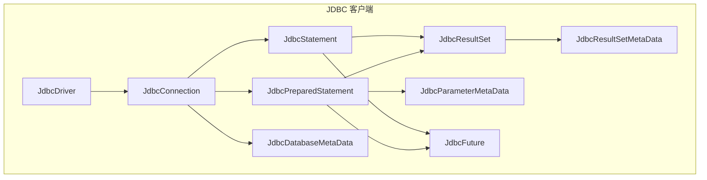
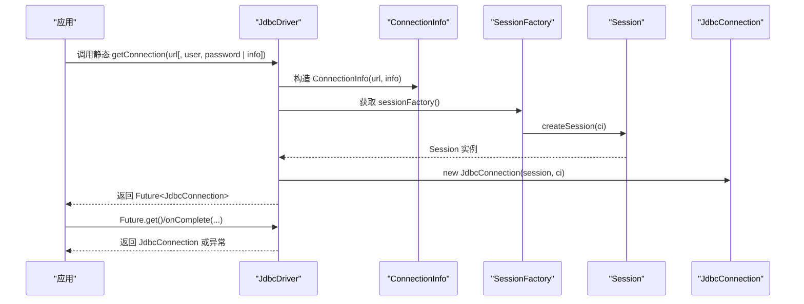
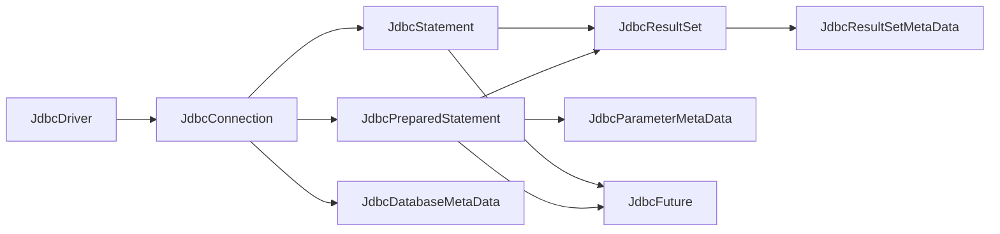

# JDBC API

<cite>
**本文引用的文件**
- [JdbcDriver.java](https://github.com/lealone/Lealone/blob/master/lealone-client/src/main/java/com/lealone/client/jdbc/JdbcDriver.java)
- [JdbcConnection.java](https://github.com/lealone/Lealone/blob/master/lealone-client/src/main/java/com/lealone/client/jdbc/JdbcConnection.java)
- [JdbcStatement.java](https://github.com/lealone/Lealone/blob/master/lealone-client/src/main/java/com/lealone/client/jdbc/JdbcStatement.java)
- [JdbcPreparedStatement.java](https://github.com/lealone/Lealone/blob/master/lealone-client/src/main/java/com/lealone/client/jdbc/JdbcPreparedStatement.java)
- [JdbcResultSet.java](https://github.com/lealone/Lealone/blob/master/lealone-client/src/main/java/com/lealone/client/jdbc/JdbcResultSet.java)
- [JdbcFuture.java](https://github.com/lealone/Lealone/blob/master/lealone-client/src/main/java/com/lealone/client/jdbc/JdbcFuture.java)
- [JdbcDatabaseMetaData.java](https://github.com/lealone/Lealone/blob/master/lealone-client/src/main/java/com/lealone/client/jdbc/JdbcDatabaseMetaData.java)
- [JdbcParameterMetaData.java](https://github.com/lealone/Lealone/blob/master/lealone-client/src/main/java/com/lealone/client/jdbc/JdbcParameterMetaData.java)
- [JdbcResultSetMetaData.java](https://github.com/lealone/Lealone/blob/master/lealone-client/src/main/java/com/lealone/client/jdbc/JdbcResultSetMetaData.java)
- [JdbcConnectionTest.java](https://github.com/lealone/Lealone/blob/master/lealone-test/src/test/java/com/lealone/test/client/JdbcConnectionTest.java)
- [JdbcStatementTest.java](https://github.com/lealone/Lealone/blob/master/lealone-test/src/test/java/com/lealone/test/client/JdbcStatementTest.java)
- [JdbcPreparedStatementTest.java](https://github.com/lealone/Lealone/blob/master/lealone-test/src/test/java/com/lealone/test/client/JdbcPreparedStatementTest.java)
</cite>

## 目录
1. [简介](#简介)
2. [项目结构](#项目结构)
3. [核心组件](#核心组件)
4. [架构总览](#架构总览)
5. [详细组件分析](#详细组件分析)
6. [依赖关系分析](#依赖关系分析)
7. [性能考量](#性能考量)
8. [故障排查指南](#故障排查指南)
9. [结论](#结论)
10. [附录：典型用法与示例](#附录典型用法与示例)

## 简介
本文件为 Lealone 的 JDBC API 参考文档，围绕 JdbcDriver、JdbcConnection、JdbcStatement、JdbcPreparedStatement、JdbcResultSet、JdbcFuture、JdbcDatabaseMetaData、JdbcParameterMetaData、JdbcResultSetMetaData 等核心类，系统梳理其公共方法、参数、返回值、异常及异步机制（Future 模式），并结合测试用例说明典型使用场景与兼容性差异。重点覆盖：
- 异步连接获取方法 getConnection 的使用方式与返回类型
- 与标准 JDBC 的兼容性差异与限制
- 典型代码示例：连接数据库、执行 SQL、处理结果集、管理事务
- 异步机制与 Future 模式的应用

## 项目结构
Lealone 的 JDBC 实现位于 lealone-client 模块中，核心类均以 com.lealone.client.jdbc 包组织，配套的测试位于 lealone-test 模块中，便于验证 API 行为与异步特性。

图表来源
- [JdbcDriver.java](https://github.com/lealone/Lealone/blob/master/lealone-client/src/main/java/com/lealone/client/jdbc/JdbcDriver.java#L1-L198)
- [JdbcConnection.java](https://github.com/lealone/Lealone/blob/master/lealone-client/src/main/java/com/lealone/client/jdbc/JdbcConnection.java#L1-L800)
- [JdbcStatement.java](https://github.com/lealone/Lealone/blob/master/lealone-client/src/main/java/com/lealone/client/jdbc/JdbcStatement.java#L1-L800)
- [JdbcPreparedStatement.java](https://github.com/lealone/Lealone/blob/master/lealone-client/src/main/java/com/lealone/client/jdbc/JdbcPreparedStatement.java#L1-L800)
- [JdbcResultSet.java](https://github.com/lealone/Lealone/blob/master/lealone-client/src/main/java/com/lealone/client/jdbc/JdbcResultSet.java#L1-L800)
- [JdbcFuture.java](https://github.com/lealone/Lealone/blob/master/lealone-client/src/main/java/com/lealone/client/jdbc/JdbcFuture.java#L1-L39)
- [JdbcDatabaseMetaData.java](https://github.com/lealone/Lealone/blob/master/lealone-client/src/main/java/com/lealone/client/jdbc/JdbcDatabaseMetaData.java#L1-L800)
- [JdbcParameterMetaData.java](https://github.com/lealone/Lealone/blob/master/lealone-client/src/main/java/com/lealone/client/jdbc/JdbcParameterMetaData.java#L1-L230)
- [JdbcResultSetMetaData.java](https://github.com/lealone/Lealone/blob/master/lealone-client/src/main/java/com/lealone/client/jdbc/JdbcResultSetMetaData.java#L1-L464)

章节来源
- [JdbcDriver.java](https://github.com/lealone/Lealone/blob/master/lealone-client/src/main/java/com/lealone/client/jdbc/JdbcDriver.java#L1-L198)
- [JdbcConnection.java](https://github.com/lealone/Lealone/blob/master/lealone-client/src/main/java/com/lealone/client/jdbc/JdbcConnection.java#L1-L800)

## 核心组件
- 驱动器 JdbcDriver：负责注册、URL 检测、版本信息、属性信息、日志记录器支持、以及异步连接获取入口（静态方法 getConnection 返回 Future<JdbcConnection>）。
- 连接 JdbcConnection：代表与数据库的会话，提供创建 Statement/PreparedStatement、元数据、事务控制、只读设置、超时设置、网络超时设置等能力；内部封装异步任务执行与 Future 封装。
- 语句 JdbcStatement：支持同步与异步执行 executeQuery/executeUpdate/execute，批处理，fetchSize 控制，查询超时设置，结果集持有策略等。
- 预编译语句 JdbcPreparedStatement：继承自 JdbcStatement，支持参数绑定、批量执行、参数元数据、结果集元数据、fetchSize 设置等。
- 结果集 JdbcResultSet：提供列访问、元数据、滚动/可更新能力标识、行计数、关闭行为等。
- Future 封装 JdbcFuture：对底层 Future 进行包装，统一异常转换与阻塞等待。
- 元数据 JdbcDatabaseMetaData、JdbcParameterMetaData、JdbcResultSetMetaData：分别提供数据库、参数、结果集的元信息查询。

章节来源
- [JdbcDriver.java](https://github.com/lealone/Lealone/blob/master/lealone-client/src/main/java/com/lealone/client/jdbc/JdbcDriver.java#L1-L198)
- [JdbcConnection.java](https://github.com/lealone/Lealone/blob/master/lealone-client/src/main/java/com/lealone/client/jdbc/JdbcConnection.java#L1-L800)
- [JdbcStatement.java](https://github.com/lealone/Lealone/blob/master/lealone-client/src/main/java/com/lealone/client/jdbc/JdbcStatement.java#L1-L800)
- [JdbcPreparedStatement.java](https://github.com/lealone/Lealone/blob/master/lealone-client/src/main/java/com/lealone/client/jdbc/JdbcPreparedStatement.java#L1-L800)
- [JdbcResultSet.java](https://github.com/lealone/Lealone/blob/master/lealone-client/src/main/java/com/lealone/client/jdbc/JdbcResultSet.java#L1-L800)
- [JdbcFuture.java](https://github.com/lealone/Lealone/blob/master/lealone-client/src/main/java/com/lealone/client/jdbc/JdbcFuture.java#L1-L39)
- [JdbcDatabaseMetaData.java](https://github.com/lealone/Lealone/blob/master/lealone-client/src/main/java/com/lealone/client/jdbc/JdbcDatabaseMetaData.java#L1-L800)
- [JdbcParameterMetaData.java](https://github.com/lealone/Lealone/blob/master/lealone-client/src/main/java/com/lealone/client/jdbc/JdbcParameterMetaData.java#L1-L230)
- [JdbcResultSetMetaData.java](https://github.com/lealone/Lealone/blob/master/lealone-client/src/main/java/com/lealone/client/jdbc/JdbcResultSetMetaData.java#L1-L464)

## 架构总览
下面的序列图展示了异步连接获取的流程，从 JdbcDriver 的静态 getConnection 到最终返回 Future<JdbcConnection>，并在连接建立后创建 JdbcConnection 对象。

图表来源
- [JdbcDriver.java](https://github.com/lealone/Lealone/blob/master/lealone-client/src/main/java/com/lealone/client/jdbc/JdbcDriver.java#L153-L196)
- [JdbcConnection.java](https://github.com/lealone/Lealone/blob/master/lealone-client/src/main/java/com/lealone/client/jdbc/JdbcConnection.java#L86-L101)

章节来源
- [JdbcDriver.java](https://github.com/lealone/Lealone/blob/master/lealone-client/src/main/java/com/lealone/client/jdbc/JdbcDriver.java#L153-L196)
- [JdbcConnection.java](https://github.com/lealone/Lealone/blob/master/lealone-client/src/main/java/com/lealone/client/jdbc/JdbcConnection.java#L86-L101)

## 详细组件分析

### JdbcDriver：驱动器与异步连接入口
- 主要职责
  - 注册自身到 DriverManager
  - 接受 URL 并判断是否支持
  - 提供版本信息与属性信息
  - 提供异步连接获取方法：getConnection(url)、getConnection(url, user, password)、getConnection(url, info)、getConnection(ConnectionInfo)
- 关键方法与行为
  - connect(url, info)：阻塞式获取连接（内部通过 Future.get()）
  - acceptsURL(url)：判断 URL 前缀
  - getMajorVersion()/getMinorVersion()：返回驱动版本
  - getPropertyInfo(url, info)：返回空属性数组
  - jdbcCompliant()：返回 true
  - getParentLogger()：不支持，抛出 Unsupported
  - 静态 getConnection(...)：返回 Future<JdbcConnection>，内部通过 SessionFactory 创建 Session 并构造 JdbcConnection
- 兼容性提示
  - getParentLogger() 在 JDBC 规范中要求支持，但此处抛出 Unsupported，属于不兼容点
  - 静态 getConnection 返回 Future，与标准 JDBC 的阻塞式 DriverManager.getConnection 不同，需使用 Future.get()/onComplete()

章节来源
- [JdbcDriver.java](https://github.com/lealone/Lealone/blob/master/lealone-client/src/main/java/com/lealone/client/jdbc/JdbcDriver.java#L1-L198)

### JdbcConnection：连接与事务管理
- 主要职责
  - 代表与数据库的会话，封装异步任务执行 executeAsyncTask
  - 创建 Statement/PreparedStatement，提供元数据 DatabaseMetaData
  - 事务控制：commit/rollback（同步与异步），setAutoCommit/getAutoCommit
  - 只读设置与查询隔离级别设置
  - 查询超时设置与网络超时设置
  - 关闭连接并清理预编译命令
- 关键方法与行为
  - createStatement(...)/prepareStatement(...)：支持指定 ResultSet 类型/并发度/保持性
  - getMetaData()：返回 JdbcDatabaseMetaData
  - setAutoCommit()/getAutoCommit()
  - commit()/rollback()：同步与 commitAsync()/rollbackAsync() 异步版本
  - setTransactionIsolation()/getTransactionIsolation()
  - setQueryTimeout()/getQueryTimeout()
  - setNetworkTimeout()/getNetworkTimeout()
  - close()：关闭并清理资源
- 异步机制
  - executeAsyncTask(task)：将任务提交到 Session 执行，内部使用 AsyncCallback/Future，返回 JdbcFuture 封装

章节来源
- [JdbcConnection.java](https://github.com/lealone/Lealone/blob/master/lealone-client/src/main/java/com/lealone/client/jdbc/JdbcConnection.java#L1-L800)

### JdbcStatement：语句执行与批处理
- 主要职责
  - 同步与异步执行 executeQuery/executeUpdate/execute
  - 批处理 addBatch/executeBatch
  - fetchSize 控制与最大行数限制
  - 查询超时设置与警告处理
  - 结果集持有策略与关闭行为
- 关键方法与行为
  - executeQuery(sql)/executeQueryAsync(sql)：返回 JdbcResultSet
  - executeUpdate(sql)/executeUpdateAsync(sql)：返回受影响行数
  - execute(sql)/execute(sql, autoGeneratedKeys/cols)：根据语句类型返回是否有结果集
  - addBatch(sql)/executeBatch()：批处理执行，支持异常聚合
  - setFetchSize()/getFetchSize()/setMaxRows()/getMaxRows()
  - getResultSet()/getUpdateCount()/close()/isClosed()
- 异步机制
  - executeQueryAsync()/executeUpdateAsync() 返回 Future，内部通过 executeAsyncTask 统一调度

章节来源
- [JdbcStatement.java](https://github.com/lealone/Lealone/blob/master/lealone-client/src/main/java/com/lealone/client/jdbc/JdbcStatement.java#L1-L800)

### JdbcPreparedStatement：参数化执行与批量
- 主要职责
  - 继承 JdbcStatement，支持参数绑定 setXxx(index, value)
  - 参数元数据 ParameterMetaData 获取
  - 批量执行 addBatch()/executeBatch()
  - fetchSize 设置与结果集元数据
- 关键方法与行为
  - executeQuery()/executeUpdate()/execute()：无参版本执行已绑定参数
  - addBatch()/executeBatch()：批量执行，支持异常聚合
  - setFetchSize()/getFetchSize()
  - getParameterMetaData()：返回 JdbcParameterMetaData
  - clearParameters()/close()
  - 参数绑定：setNull/setInt/setString/setBigDecimal/... 等
- 异步机制
  - executeQueryAsync()/executeUpdateAsync() 返回 Future

章节来源
- [JdbcPreparedStatement.java](https://github.com/lealone/Lealone/blob/master/lealone-client/src/main/java/com/lealone/client/jdbc/JdbcPreparedStatement.java#L1-L800)

### JdbcResultSet：结果集访问与元数据
- 主要职责
  - 提供列访问 getString/getInt/getBigDecimal/getDate/getTime/getTimestamp/getObject 等
  - 结果集元数据 ResultSetMetaData 获取
  - 行计数、当前行数、fetchSize、关闭行为
  - 列标签查找 findColumn
- 关键方法与行为
  - next()：移动游标
  - getMetaData()：返回 JdbcResultSetMetaData
  - findColumn(label)/getColumnCount()/getColumnTypeName()/...
  - wasNull()/close()/getStatement()
  - getFetchSize()/getRow()/getRowCount()/getCurrentRowCount()
- 兼容性提示
  - 多处注释或行为表明部分 JDBC 特性未完全实现或不支持（如某些警告、特定行为）

章节来源
- [JdbcResultSet.java](https://github.com/lealone/Lealone/blob/master/lealone-client/src/main/java/com/lealone/client/jdbc/JdbcResultSet.java#L1-L800)

### JdbcFuture：Future 封装与异常转换
- 主要职责
  - 包装底层 Future，提供 get()/getFuture()/onComplete(handler)
  - 统一异常转换为 SQLException
- 使用场景
  - JdbcStatement/JdbcPreparedStatement 的异步方法返回 JdbcFuture，内部持有 Future 并在 get() 时进行异常转换

章节来源
- [JdbcFuture.java](https://github.com/lealone/Lealone/blob/master/lealone-client/src/main/java/com/lealone/client/jdbc/JdbcFuture.java#L1-L39)

### 元数据组件
- JdbcDatabaseMetaData：提供数据库产品名、版本、驱动名、驱动版本、表/列/索引/权限等查询
- JdbcParameterMetaData：提供参数个数、类型、精度、可空性、类名、类型名等
- JdbcResultSetMetaData：提供列数、列名/别名、类型、精度、显示大小、可写性等

章节来源
- [JdbcDatabaseMetaData.java](https://github.com/lealone/Lealone/blob/master/lealone-client/src/main/java/com/lealone/client/jdbc/JdbcDatabaseMetaData.java#L1-L800)
- [JdbcParameterMetaData.java](https://github.com/lealone/Lealone/blob/master/lealone-client/src/main/java/com/lealone/client/jdbc/JdbcParameterMetaData.java#L1-L230)
- [JdbcResultSetMetaData.java](https://github.com/lealone/Lealone/blob/master/lealone-client/src/main/java/com/lealone/client/jdbc/JdbcResultSetMetaData.java#L1-L464)

## 依赖关系分析
- JdbcDriver 依赖 ConnectionInfo、SessionFactory、Session、JdbcConnection
- JdbcConnection 依赖 Session、JdbcStatement/JdbcPreparedStatement、JdbcDatabaseMetaData、JdbcFuture
- JdbcStatement/JdbcPreparedStatement 依赖 Session、SQLCommand、Result、JdbcFuture
- JdbcResultSet 依赖 Result、JdbcStatement/JdbcPreparedStatement、JdbcResultSetMetaData
- 元数据类依赖对应对象与 Result/Command

图表来源
- [JdbcDriver.java](https://github.com/lealone/Lealone/blob/master/lealone-client/src/main/java/com/lealone/client/jdbc/JdbcDriver.java#L1-L198)
- [JdbcConnection.java](https://github.com/lealone/Lealone/blob/master/lealone-client/src/main/java/com/lealone/client/jdbc/JdbcConnection.java#L1-L800)
- [JdbcStatement.java](https://github.com/lealone/Lealone/blob/master/lealone-client/src/main/java/com/lealone/client/jdbc/JdbcStatement.java#L1-L800)
- [JdbcPreparedStatement.java](https://github.com/lealone/Lealone/blob/master/lealone-client/src/main/java/com/lealone/client/jdbc/JdbcPreparedStatement.java#L1-L800)
- [JdbcResultSet.java](https://github.com/lealone/Lealone/blob/master/lealone-client/src/main/java/com/lealone/client/jdbc/JdbcResultSet.java#L1-L800)
- [JdbcFuture.java](https://github.com/lealone/Lealone/blob/master/lealone-client/src/main/java/com/lealone/client/jdbc/JdbcFuture.java#L1-L39)
- [JdbcDatabaseMetaData.java](https://github.com/lealone/Lealone/blob/master/lealone-client/src/main/java/com/lealone/client/jdbc/JdbcDatabaseMetaData.java#L1-L800)
- [JdbcParameterMetaData.java](https://github.com/lealone/Lealone/blob/master/lealone-client/src/main/java/com/lealone/client/jdbc/JdbcParameterMetaData.java#L1-L230)
- [JdbcResultSetMetaData.java](https://github.com/lealone/Lealone/blob/master/lealone-client/src/main/java/com/lealone/client/jdbc/JdbcResultSetMetaData.java#L1-L464)

## 性能考量
- 异步执行：executeQueryAsync/executeUpdateAsync/executeBatch 等异步方法通过 Future 提交至 Session 执行，避免阻塞线程，适合高并发场景
- fetchSize：通过 setFetchSize 控制每次从服务端拉取的行数，默认值来自系统属性 lealone.serverResultSetFetchSize；设置为 0 会恢复默认值
- 批处理：executeBatch/executeBatchAsync 支持批量执行，减少往返次数；异常聚合保证部分失败不影响整体执行
- 结果集分页：JdbcResultSet 支持行计数与当前行数统计，结合 fetchSize 控制内存占用
- 事务与超时：合理设置查询超时与网络超时，避免长时间阻塞

[本节为通用指导，无需具体文件引用]

## 故障排查指南
- 异常转换：所有底层异常通过 logAndConvert 转换为 SQLException，便于统一处理
- 异步异常处理：Future.onFailure/onComplete 中处理异常分支，确保异常被捕获并记录
- 连接状态：isClosed()/checkClosed() 用于检测连接/语句/结果集状态，避免在关闭状态下继续使用
- 参数校验：参数索引越界、fetchSize 超限、非法值等会在方法内抛出异常
- 典型问题定位
  - getParentLogger() 抛出 Unsupported：属于已知不兼容点
  - 语法错误/主键冲突等导致 executeQuery/executeUpdate 抛出异常：检查 SQL 与参数
  - 连接关闭后操作抛异常：确认连接生命周期与关闭时机

章节来源
- [JdbcStatement.java](https://github.com/lealone/Lealone/blob/master/lealone-client/src/main/java/com/lealone/client/jdbc/JdbcStatement.java#L1-L800)
- [JdbcPreparedStatement.java](https://github.com/lealone/Lealone/blob/master/lealone-client/src/main/java/com/lealone/client/jdbc/JdbcPreparedStatement.java#L1-L800)
- [JdbcConnection.java](https://github.com/lealone/Lealone/blob/master/lealone-client/src/main/java/com/lealone/client/jdbc/JdbcConnection.java#L1-L800)

## 结论
Lealone 的 JDBC 实现遵循标准 JDBC 接口，同时引入异步 Future 模式提升并发性能与可扩展性。JdbcDriver 的静态 getConnection 提供了 Future 形式的连接获取方式，与传统 DriverManager.getConnection 的阻塞模型存在差异。通过 JdbcStatement/JdbcPreparedStatement 的异步执行、批处理与 fetchSize 控制，开发者可在高并发场景下获得更好的吞吐与响应时间。需要注意的兼容性差异包括 getParentLogger() 不支持、部分 JDBC 特性的行为差异等。

[本节为总结性内容，无需具体文件引用]

## 附录：典型用法与示例

### 1. 异步连接获取与基本使用
- 使用 JdbcDriver 的静态 getConnection 获取 Future<JdbcConnection>，随后通过 onComplete 或 get() 获取连接
- 示例路径
  - [JdbcConnectionTest.java](https://github.com/lealone/Lealone/blob/master/lealone-test/src/test/java/com/lealone/test/client/JdbcConnectionTest.java#L114-L127)
  - [JdbcConnectionTest.java](https://github.com/lealone/Lealone/blob/master/lealone-test/src/test/java/com/lealone/test/client/JdbcConnectionTest.java#L134-L177)

章节来源
- [JdbcConnectionTest.java](https://github.com/lealone/Lealone/blob/master/lealone-test/src/test/java/com/lealone/test/client/JdbcConnectionTest.java#L114-L177)
- [JdbcDriver.java](https://github.com/lealone/Lealone/blob/master/lealone-client/src/main/java/com/lealone/client/jdbc/JdbcDriver.java#L153-L196)

### 2. 执行 SQL 与处理结果集
- 使用 JdbcStatement/JdbcPreparedStatement 执行查询与更新，支持同步与异步
- 示例路径
  - [JdbcStatementTest.java](https://github.com/lealone/Lealone/blob/master/lealone-test/src/test/java/com/lealone/test/client/JdbcStatementTest.java#L150-L163)
  - [JdbcStatementTest.java](https://github.com/lealone/Lealone/blob/master/lealone-test/src/test/java/com/lealone/test/client/JdbcStatementTest.java#L184-L233)
  - [JdbcPreparedStatementTest.java](https://github.com/lealone/Lealone/blob/master/lealone-test/src/test/java/com/lealone/test/client/JdbcPreparedStatementTest.java#L280-L322)

章节来源
- [JdbcStatementTest.java](https://github.com/lealone/Lealone/blob/master/lealone-test/src/test/java/com/lealone/test/client/JdbcStatementTest.java#L150-L233)
- [JdbcPreparedStatementTest.java](https://github.com/lealone/Lealone/blob/master/lealone-test/src/test/java/com/lealone/test/client/JdbcPreparedStatementTest.java#L280-L322)

### 3. 事务管理（同步与异步）
- 设置自动提交、提交与回滚，支持异步 commitAsync/rollbackAsync
- 示例路径
  - [JdbcConnectionTest.java](https://github.com/lealone/Lealone/blob/master/lealone-test/src/test/java/com/lealone/test/client/JdbcConnectionTest.java#L75-L108)

章节来源
- [JdbcConnectionTest.java](https://github.com/lealone/Lealone/blob/master/lealone-test/src/test/java/com/lealone/test/client/JdbcConnectionTest.java#L75-L108)
- [JdbcConnection.java](https://github.com/lealone/Lealone/blob/master/lealone-client/src/main/java/com/lealone/client/jdbc/JdbcConnection.java#L518-L586)

### 4. 批处理与异步执行
- 使用 addBatch/executeBatch 与 executeUpdateAsync/executeQueryAsync 提升吞吐
- 示例路径
  - [JdbcStatementTest.java](https://github.com/lealone/Lealone/blob/master/lealone-test/src/test/java/com/lealone/test/client/JdbcStatementTest.java#L175-L183)
  - [JdbcStatementTest.java](https://github.com/lealone/Lealone/blob/master/lealone-test/src/test/java/com/lealone/test/client/JdbcStatementTest.java#L235-L268)
  - [JdbcPreparedStatementTest.java](https://github.com/lealone/Lealone/blob/master/lealone-test/src/test/java/com/lealone/test/client/JdbcPreparedStatementTest.java#L263-L277)
  - [JdbcPreparedStatementTest.java](https://github.com/lealone/Lealone/blob/master/lealone-test/src/test/java/com/lealone/test/client/JdbcPreparedStatementTest.java#L324-L364)

章节来源
- [JdbcStatementTest.java](https://github.com/lealone/Lealone/blob/master/lealone-test/src/test/java/com/lealone/test/client/JdbcStatementTest.java#L175-L268)
- [JdbcPreparedStatementTest.java](https://github.com/lealone/Lealone/blob/master/lealone-test/src/test/java/com/lealone/test/client/JdbcPreparedStatementTest.java#L263-L364)

### 5. 结果集元数据与参数元数据
- 获取 ResultSetMetaData 与 ParameterMetaData，验证列数、类型、精度等
- 示例路径
  - [JdbcPreparedStatementTest.java](https://github.com/lealone/Lealone/blob/master/lealone-test/src/test/java/com/lealone/test/client/JdbcPreparedStatementTest.java#L158-L202)
  - [JdbcParameterMetaData.java](https://github.com/lealone/Lealone/blob/master/lealone-client/src/main/java/com/lealone/client/jdbc/JdbcParameterMetaData.java#L1-L230)
  - [JdbcResultSetMetaData.java](https://github.com/lealone/Lealone/blob/master/lealone-client/src/main/java/com/lealone/client/jdbc/JdbcResultSetMetaData.java#L1-L464)

章节来源
- [JdbcPreparedStatementTest.java](https://github.com/lealone/Lealone/blob/master/lealone-test/src/test/java/com/lealone/test/client/JdbcPreparedStatementTest.java#L158-L202)
- [JdbcParameterMetaData.java](https://github.com/lealone/Lealone/blob/master/lealone-client/src/main/java/com/lealone/client/jdbc/JdbcParameterMetaData.java#L1-L230)
- [JdbcResultSetMetaData.java](https://github.com/lealone/Lealone/blob/master/lealone-client/src/main/java/com/lealone/client/jdbc/JdbcResultSetMetaData.java#L1-L464)

### 6. 兼容性差异与注意事项
- getParentLogger() 不支持：调用将抛出 Unsupported
- 异步连接获取：JdbcDriver 的静态 getConnection 返回 Future<JdbcConnection>，需使用 onComplete/get 获取结果
- fetchSize 为 0 时自动恢复默认值
- 部分 JDBC 特性未完全实现或行为与期望不同，详见各组件注释与测试

章节来源
- [JdbcDriver.java](https://github.com/lealone/Lealone/blob/master/lealone-client/src/main/java/com/lealone/client/jdbc/JdbcDriver.java#L115-L123)
- [JdbcStatement.java](https://github.com/lealone/Lealone/blob/master/lealone-client/src/main/java/com/lealone/client/jdbc/JdbcStatement.java#L694-L737)
- [JdbcPreparedStatement.java](https://github.com/lealone/Lealone/blob/master/lealone-client/src/main/java/com/lealone/client/jdbc/JdbcPreparedStatement.java#L78-L83)