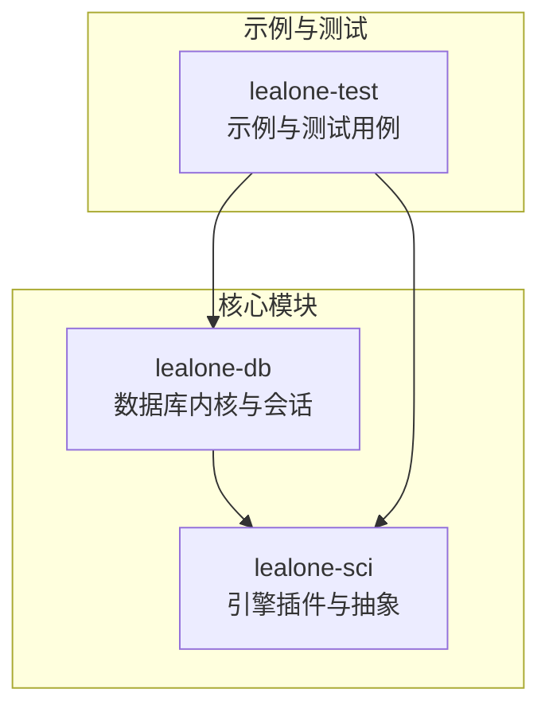
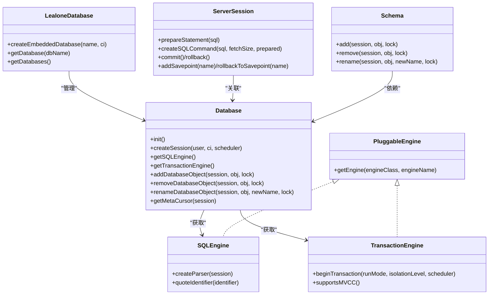
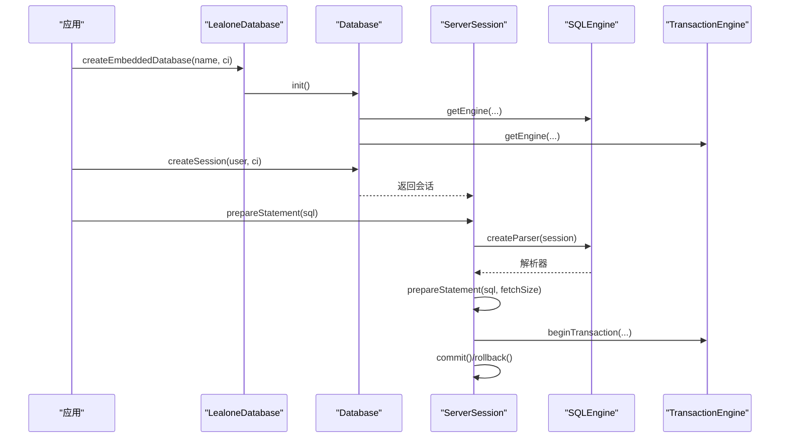
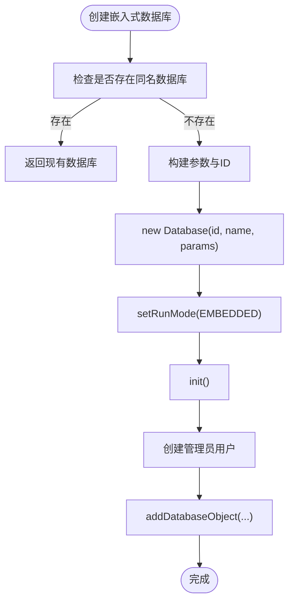
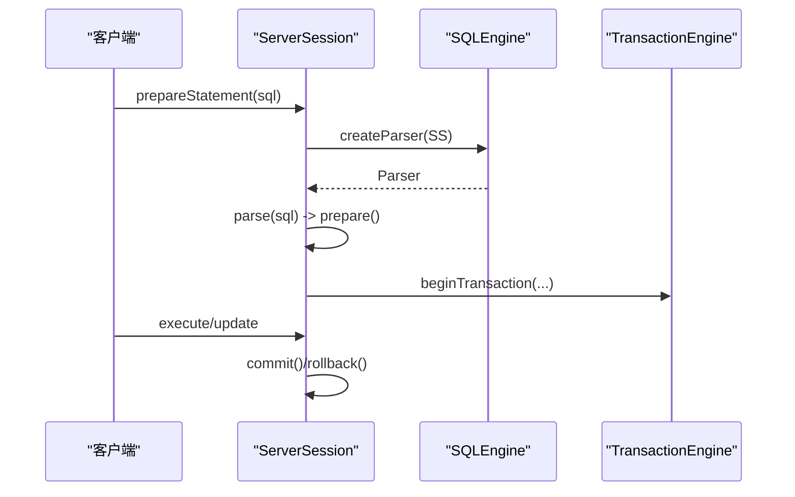
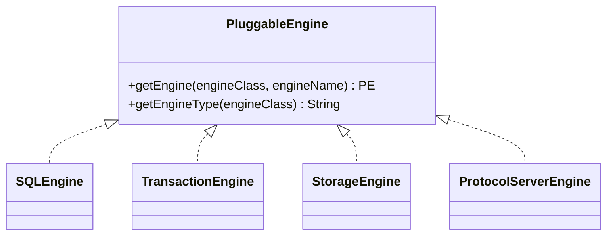
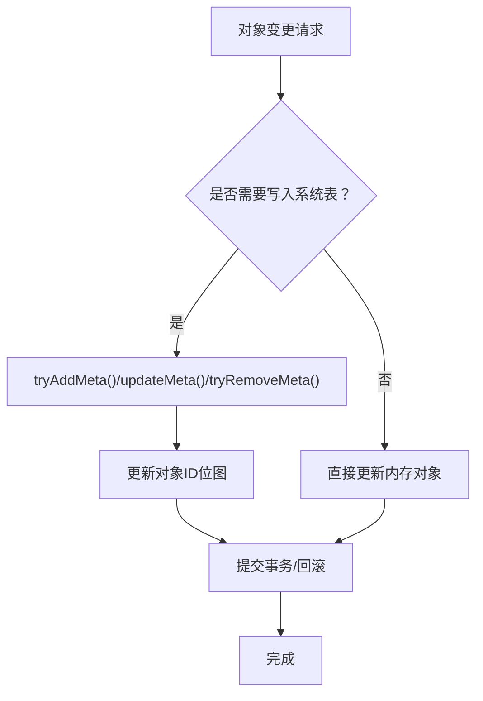
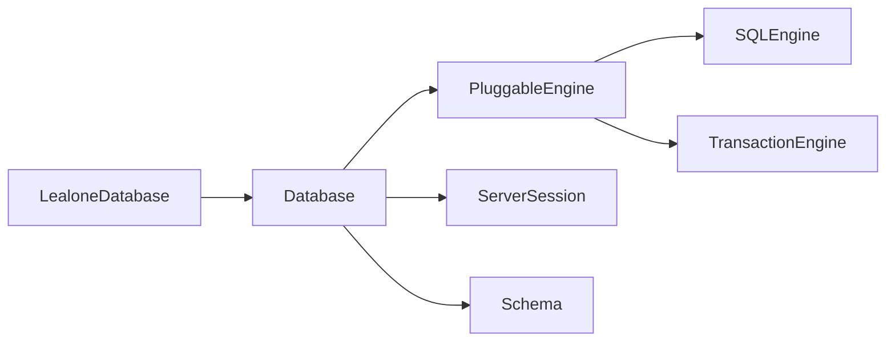
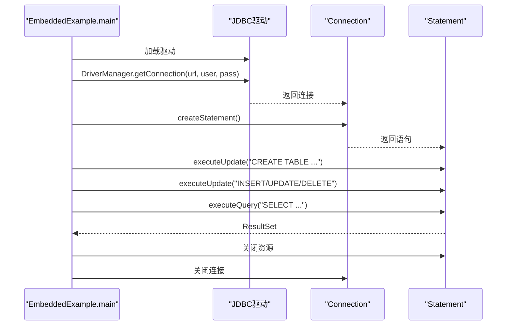

# 核心Java API

<cite>
**本文引用的文件列表**
- [Database.java](file://lealone-db/src/main/java/com/lealone/db/Database.java)
- [LealoneDatabase.java](file://lealone-db/src/main/java/com/lealone/db/LealoneDatabase.java)
- [ServerSession.java](file://lealone-db/src/main/java/com/lealone/db/session/ServerSession.java)
- [PluggableEngine.java](file://lealone-sci/src/main/java/com/lealone/db/plugin/PluggableEngine.java)
- [SQLEngine.java](file://lealone-sci/src/main/java/com/lealone/sql/SQLEngine.java)
- [TransactionEngine.java](file://lealone-sci/src/main/java/com/lealone/transaction/TransactionEngine.java)
- [Schema.java](file://lealone-db/src/main/java/com/lealone/db/schema/Schema.java)
- [DbObject.java](file://lealone-db/src/main/java/com/lealone/db/DbObject.java)
- [EmbeddedExample.java](file://lealone-test/src/test/java/com/lealone/test/misc/EmbeddedExample.java)
- [CRUDExample.java](file://lealone-test/src/test/java/com/lealone/test/misc/CRUDExample.java)
</cite>

## 目录
1. [简介](#简介)
2. [项目结构](#项目结构)
3. [核心组件](#核心组件)
4. [架构总览](#架构总览)
5. [详细组件分析](#详细组件分析)
6. [依赖关系分析](#依赖关系分析)
7. [性能考量](#性能考量)
8. [故障排查指南](#故障排查指南)
9. [结论](#结论)
10. [附录：嵌入式模式示例](#附录嵌入式模式示例)

## 简介
本文件面向Lealone的核心Java API参考，围绕Database.java提供的数据库实例公共接口展开，重点覆盖：
- 数据库生命周期管理（初始化、启动、关闭）
- 会话创建与管理（ServerSession）
- SQL引擎与事务引擎访问
- 元数据操作（系统表、对象注册与更新）
- 对象管理（增删改、重命名、依赖处理）
- 通过PluggableEngine机制获取各类引擎
- 嵌入式模式下的Java API使用示例（创建表、执行查询、管理数据库对象）

目标读者既包括需要快速上手的开发者，也包括希望深入理解架构与实现细节的技术人员。

## 项目结构
Lealone采用模块化设计，核心API集中在lealone-db与lealone-sci模块：
- 数据库内核与会话：lealone-db
- 引擎插件与SQL/事务抽象：lealone-sci
- 示例与测试：lealone-test

[无图表来源：该图为概念性结构示意，不直接映射具体源码文件]

## 核心组件
- Database：数据库实例的中心类，负责生命周期、元数据、对象管理、SQL/事务引擎接入等。
- LealoneDatabase：顶层数据库实例，管理所有应用创建的数据库，提供嵌入式数据库创建入口。
- ServerSession：会话层，封装SQL解析、准备、执行、事务提交/回滚、锁管理、临时对象等。
- PluggableEngine：插件化引擎框架，统一获取SQLEngine、TransactionEngine、StorageEngine、ProtocolServerEngine。
- Schema：数据库模式对象容器，负责对象的增删改查、唯一名生成、依赖处理。
- DbObject：数据库对象接口，定义对象类型、标识、SQL名、重命名、注释等通用能力。

**章节来源**
- file://lealone-db/src/main/java/com/lealone/db/Database.java#L200-L420
- file://lealone-db/src/main/java/com/lealone/db/LealoneDatabase.java#L68-L110
- file://lealone-db/src/main/java/com/lealone/db/session/ServerSession.java#L133-L170
- file://lealone-sci/src/main/java/com/lealone/db/plugin/PluggableEngine.java#L16-L46
- file://lealone-db/src/main/java/com/lealone/db/schema/Schema.java#L43-L120
- file://lealone-db/src/main/java/com/lealone/db/DbObject.java#L16-L128

## 架构总览
Database持有并统一管理SQL引擎与事务引擎，通过PluggableEngine机制按名称动态获取具体实现。LealoneDatabase作为顶层实例，负责创建嵌入式数据库，并将其纳入全局管理。ServerSession贯穿SQL解析、准备、执行与事务控制。

**图表来源**
- [Database.java](file://lealone-db/src/main/java/com/lealone/db/Database.java#L224-L234)
- [LealoneDatabase.java](file://lealone-db/src/main/java/com/lealone/db/LealoneDatabase.java#L68-L110)
- [ServerSession.java](file://lealone-db/src/main/java/com/lealone/db/session/ServerSession.java#L413-L496)
- [PluggableEngine.java](file://lealone-sci/src/main/java/com/lealone/db/plugin/PluggableEngine.java#L16-L46)
- [SQLEngine.java](file://lealone-sci/src/main/java/com/lealone/sql/SQLEngine.java#L15-L33)
- [TransactionEngine.java](file://lealone-sci/src/main/java/com/lealone/transaction/TransactionEngine.java#L17-L70)
- [Schema.java](file://lealone-db/src/main/java/com/lealone/db/schema/Schema.java#L191-L236)

## 详细组件分析

### Database：数据库实例公共接口
- 生命周期管理
  - init()：初始化跟踪系统、打开数据库、恢复元数据、添加关闭钩子、触发事件监听器。
  - closeIfNeeded()：根据关闭延迟策略决定是否关闭数据库。
  - close(boolean)：关闭流程包含事件回调、清理LOB、关闭系统会话、注销关闭钩子、通知LealoneDatabase。
- SQL/事务引擎访问
  - getSQLEngine()、getTransactionEngine()：通过PluggableEngine按配置名称获取具体引擎实例。
  - createParser(Session)：委托SQL引擎创建解析器。
  - quoteIdentifier(String)：委托SQL引擎进行标识符转义。
- 会话管理
  - createSession(...)：创建ServerSession并加入用户会话集合，设置调度器与连接信息。
  - removeSession(ServerSession)：断开连接后的清理与关闭决策。
- 元数据操作
  - getMetaCursor(ServerSession)、findMeta(ServerSession, id)：访问系统元数据表游标与行。
  - tryLockDbObject(...)、tryAddMeta(...)、tryRemoveMeta(...)、updateMeta(...)：对系统表进行增删改与行级锁定。
  - updateMetaAndFirstLevelChildren(...)：更新对象及其一级子对象的元数据。
- 对象管理
  - addDatabaseObject(...)、removeDatabaseObject(...)、renameDatabaseObject(...)：原子化地增删改数据库对象，维护对象ID位图与系统表记录。
  - allocateObjectId()、clearObjectId(int)、isObjectIdEnabled(int)：对象ID分配与回收。
- 其他
  - getSettings()、updateDbSettings(...)：数据库参数与设置更新。
  - getLobStorage()、setLobStorage(...)：LOB存储管理。
  - getSessions(...)、getSessionCount()：会话统计与遍历。

**图表来源**
- [LealoneDatabase.java](file://lealone-db/src/main/java/com/lealone/db/LealoneDatabase.java#L68-L110)
- [Database.java](file://lealone-db/src/main/java/com/lealone/db/Database.java#L224-L234)
- [ServerSession.java](file://lealone-db/src/main/java/com/lealone/db/session/ServerSession.java#L413-L496)

**章节来源**
- file://lealone-db/src/main/java/com/lealone/db/Database.java#L224-L234
- file://lealone-db/src/main/java/com/lealone/db/Database.java#L422-L533
- file://lealone-db/src/main/java/com/lealone/db/Database.java#L1057-L1125
- file://lealone-db/src/main/java/com/lealone/db/Database.java#L704-L827
- file://lealone-db/src/main/java/com/lealone/db/Database.java#L829-L980
- file://lealone-db/src/main/java/com/lealone/db/Database.java#L1144-L1256

### LealoneDatabase：全局实例与嵌入式数据库
- 作用：管理所有应用创建的数据库，提供嵌入式数据库创建入口。
- 关键方法：
  - createEmbeddedDatabase(String name, ConnectionInfo ci)：创建并初始化嵌入式数据库，设置运行模式为EMBEDDED，创建管理员用户，加入数据库集合。
  - getDatabase(String)：查找或从系统表重建已关闭数据库。
  - getDatabases()、findDatabase(String)：数据库集合与查询。
  - copy()、gc(TransactionEngine)：复制顶层实例与垃圾回收任务。

**图表来源**
- [LealoneDatabase.java](file://lealone-db/src/main/java/com/lealone/db/LealoneDatabase.java#L68-L110)

**章节来源**
- file://lealone-db/src/main/java/com/lealone/db/LealoneDatabase.java#L68-L110
- file://lealone-db/src/main/java/com/lealone/db/LealoneDatabase.java#L119-L147
- file://lealone-db/src/main/java/com/lealone/db/LealoneDatabase.java#L155-L203

### ServerSession：会话管理机制
- 会话创建与配置
  - 构造函数设置数据库、用户、查询缓存大小、锁超时、默认模式等。
  - createParser()：优先使用会话级SQL引擎，否则回退到数据库引擎。
- SQL解析与准备
  - parseStatement(String)、prepareStatement(String)、prepareStatement(String, int)：解析与准备SQL语句，支持查询缓存。
- 事务控制
  - commit()/rollback()、asyncCommit()：同步与异步提交；beforeCommit()、commitFinal()、rollback()内部流程。
  - addSavepoint(name)、rollbackToSavepoint(name)：保存点管理。
  - rollbackTo(int)：回滚到指定保存点。
- 临时对象与资源
  - 本地临时表、索引、约束的增删与清理；LOB解绑与释放。
- 变量与状态
  - setVariable/getVariable/getVariableNames()：用户变量管理。
  - 会话状态机与取消执行。

**图表来源**
- [ServerSession.java](file://lealone-db/src/main/java/com/lealone/db/session/ServerSession.java#L413-L496)
- [ServerSession.java](file://lealone-db/src/main/java/com/lealone/db/session/ServerSession.java#L566-L759)

**章节来源**
- file://lealone-db/src/main/java/com/lealone/db/session/ServerSession.java#L133-L170
- file://lealone-db/src/main/java/com/lealone/db/session/ServerSession.java#L413-L496
- file://lealone-db/src/main/java/com/lealone/db/session/ServerSession.java#L566-L759
- file://lealone-db/src/main/java/com/lealone/db/session/ServerSession.java#L1706-L1762

### PluggableEngine与引擎获取机制
- PluggableEngine.getEngine(Class, String)：按引擎类型与名称获取插件实例，若未注册则通过类名实例化并注册。
- 支持类型：StorageEngine、TransactionEngine、SQLEngine、ProtocolServerEngine。
- Database在构造时通过此机制获取默认SQL与事务引擎实例。

**图表来源**
- [PluggableEngine.java](file://lealone-sci/src/main/java/com/lealone/db/plugin/PluggableEngine.java#L16-L46)
- [Database.java](file://lealone-db/src/main/java/com/lealone/db/Database.java#L224-L234)

**章节来源**
- file://lealone-sci/src/main/java/com/lealone/db/plugin/PluggableEngine.java#L16-L46
- file://lealone-db/src/main/java/com/lealone/db/Database.java#L224-L234

### 元数据操作与对象管理
- 元数据表（SYS）与索引
  - openMetaTable()：创建隐藏的SYS表与ID主键索引，恢复系统表记录，重建数据库对象。
  - getMetaCursor()/findMeta()/tryLockDbObject()：系统表游标与行级锁定。
- 对象增删改
  - addDatabaseObject/removeDatabaseObject/renameDatabaseObject：原子化操作，维护系统表与对象ID位图。
  - updateMeta/updateMetaAndFirstLevelChildren：更新对象元数据及一级子对象。
- Schema层协作
  - Schema.add/remove/rename：在Schema维度执行对象管理，处理本地临时对象与依赖关系。
  - getUniqueConstraintName/getUniqueIndexName：生成唯一约束/索引名。

**图表来源**
- [Database.java](file://lealone-db/src/main/java/com/lealone/db/Database.java#L704-L827)
- [Database.java](file://lealone-db/src/main/java/com/lealone/db/Database.java#L829-L980)
- [Schema.java](file://lealone-db/src/main/java/com/lealone/db/schema/Schema.java#L191-L236)
- [Schema.java](file://lealone-db/src/main/java/com/lealone/db/schema/Schema.java#L272-L317)
- [Schema.java](file://lealone-db/src/main/java/com/lealone/db/schema/Schema.java#L344-L381)

**章节来源**
- file://lealone-db/src/main/java/com/lealone/db/Database.java#L535-L588
- file://lealone-db/src/main/java/com/lealone/db/Database.java#L704-L827
- file://lealone-db/src/main/java/com/lealone/db/Database.java#L829-L980
- file://lealone-db/src/main/java/com/lealone/db/schema/Schema.java#L191-L236
- file://lealone-db/src/main/java/com/lealone/db/schema/Schema.java#L272-L317
- file://lealone-db/src/main/java/com/lealone/db/schema/Schema.java#L344-L381

## 依赖关系分析
- Database依赖PluggableEngine以获取SQLEngine与TransactionEngine。
- ServerSession依赖Database进行SQL解析与事务控制。
- Schema依赖Database进行元数据更新与对象ID管理。
- LealoneDatabase依赖Database进行嵌入式数据库创建与管理。

**图表来源**
- [LealoneDatabase.java](file://lealone-db/src/main/java/com/lealone/db/LealoneDatabase.java#L68-L110)
- [Database.java](file://lealone-db/src/main/java/com/lealone/db/Database.java#L224-L234)
- [ServerSession.java](file://lealone-db/src/main/java/com/lealone/db/session/ServerSession.java#L413-L496)
- [Schema.java](file://lealone-db/src/main/java/com/lealone/db/schema/Schema.java#L191-L236)

**章节来源**
- file://lealone-db/src/main/java/com/lealone/db/LealoneDatabase.java#L68-L110
- file://lealone-db/src/main/java/com/lealone/db/Database.java#L224-L234
- file://lealone-db/src/main/java/com/lealone/db/session/ServerSession.java#L413-L496
- file://lealone-db/src/main/java/com/lealone/db/schema/Schema.java#L191-L236

## 性能考量
- 查询缓存：ServerSession支持基于SQL文本的查询缓存，当数据库元数据变更时会清空缓存，确保一致性。
- 事务日志：commit/asyncCommit涉及事务日志写入，异步提交可提升吞吐但需等待日志落盘。
- 元数据更新：批量更新元数据时建议合并操作，减少系统表写入次数。
- 会话关闭策略：closeDelay配置影响数据库在最后一个会话断开后的自动关闭时机。

[本节为通用指导，无需列出具体文件来源]

## 故障排查指南
- 数据库关闭异常：确认事件监听器是否阻塞关闭流程；检查系统会话是否仍被占用。
- 权限不足：LealoneDatabase.checkAdminRight用于校验管理员权限；非管理员用户无法执行数据库级DDL。
- 会话超时与取消：ServerSession.cancel()与查询超时配置；注意回滚到保存点后需清理查询缓存。
- 元数据一致性：对象重命名或删除时，确保依赖关系满足（如外键约束），否则抛出错误。

**章节来源**
- file://lealone-db/src/main/java/com/lealone/db/Database.java#L1155-L1256
- file://lealone-db/src/main/java/com/lealone/db/LealoneDatabase.java#L162-L176
- file://lealone-db/src/main/java/com/lealone/db/session/ServerSession.java#L566-L759

## 结论
Lealone通过Database统一管理数据库生命周期、SQL/事务引擎与元数据，配合LealoneDatabase提供嵌入式数据库创建能力，ServerSession承载SQL解析与事务控制，PluggableEngine实现引擎的插件化扩展。Schema与DbObject接口保证了对象管理的一致性与可扩展性。结合示例代码，开发者可在嵌入式模式下快速完成表创建、数据CRUD与对象管理。

[本节为总结性内容，无需列出具体文件来源]

## 附录：嵌入式模式示例
以下示例展示了如何在嵌入式模式下通过Java API直接操作数据库：
- 使用LealoneDatabase作为全局入口，创建嵌入式数据库。
- 通过JDBC驱动建立连接，执行DDL与DML。
- 展示创建表、插入、更新、查询、删除等基本操作。

**图表来源**
- [EmbeddedExample.java](file://lealone-test/src/test/java/com/lealone/test/misc/EmbeddedExample.java#L18-L34)
- [CRUDExample.java](file://lealone-test/src/test/java/com/lealone/test/misc/CRUDExample.java#L101-L121)

**章节来源**
- file://lealone-test/src/test/java/com/lealone/test/misc/EmbeddedExample.java#L18-L34
- file://lealone-test/src/test/java/com/lealone/test/misc/CRUDExample.java#L101-L121
- file://lealone-test/src/test/java/com/lealone/test/misc/CRUDExample.java#L134-L151