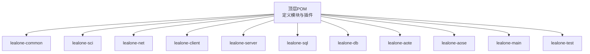
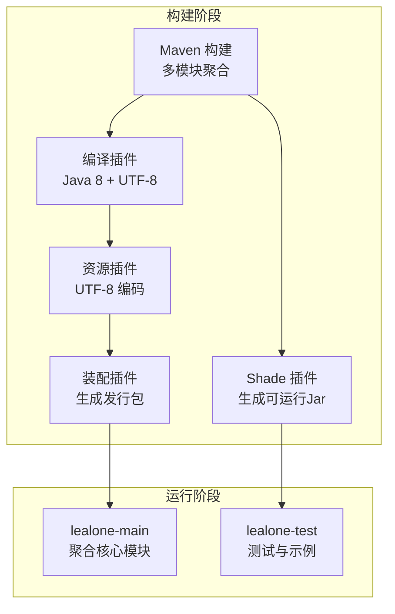
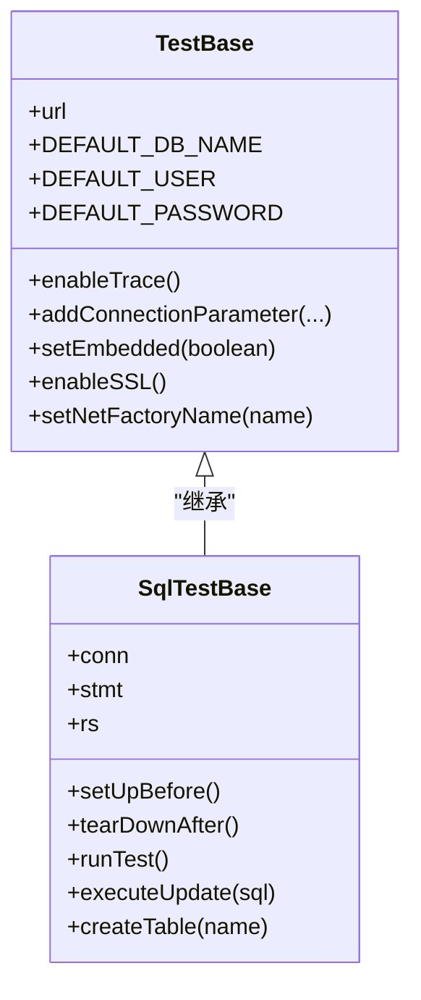
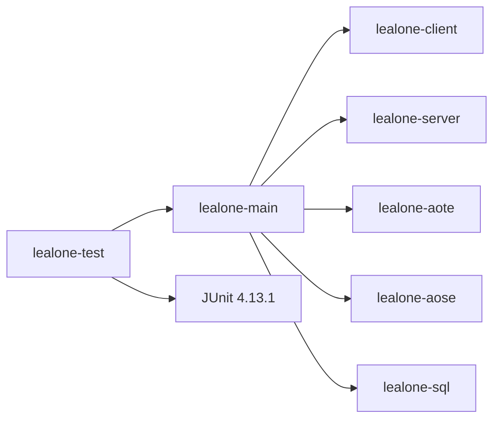

# 开发者指南

<cite>
**本文引用的文件列表**
- [pom.xml](https://github.com/lealone/Lealone/blob/master/pom.xml)
- [build.bat](https://github.com/lealone/Lealone/blob/master/build.bat)
- [README.md](https://github.com/lealone/Lealone/blob/master/README.md)
- [code.style.xml](https://github.com/lealone/Lealone/blob/master/code.style.xml)
- [lealone-test/pom.xml](https://github.com/lealone/Lealone/blob/master/lealone-test/pom.xml)
- [lealone-test/src/test/java/com/lealone/test/TestBase.java](https://github.com/lealone/Lealone/blob/master/lealone-test/src/test/java/com/lealone/test/TestBase.java)
- [lealone-test/src/test/java/com/lealone/test/sql/SqlTestBase.java](https://github.com/lealone/Lealone/blob/master/lealone-test/src/test/java/com/lealone/test/sql/SqlTestBase.java)
- [lealone-test/src/test/resources/log4j2-test.xml](https://github.com/lealone/Lealone/blob/master/lealone-test/src/test/resources/log4j2-test.xml)
- [lealone-main/pom.xml](https://github.com/lealone/Lealone/blob/master/lealone-main/pom.xml)
- [lealone-common/src/main/resources/com/lealone/common/resources/version.properties](https://github.com/lealone/Lealone/blob/master/lealone-common/src/main/resources/com/lealone/common/resources/version.properties)
- [LICENSE.md](https://github.com/lealone/Lealone/blob/master/LICENSE.md)
</cite>

## 目录
1. [简介](#简介)
2. [项目结构](#项目结构)
3. [核心组件](#核心组件)
4. [架构总览](#架构总览)
5. [详细组件分析](#详细组件分析)
6. [依赖关系分析](#依赖关系分析)
7. [性能与构建特性](#性能与构建特性)
8. [调试与测试指南](#调试与测试指南)
9. [代码风格与提交规范](#代码风格与提交规范)
10. [故障排查](#故障排查)
11. [结论](#结论)

## 简介
本指南面向希望参与 Lealone 开发的贡献者，覆盖从环境准备、源码编译、打包发布到调试与测试的完整流程；同时说明项目的代码风格、测试框架（lealone-test 模块）以及版本管理与发布相关配置。文档基于仓库中的 pom.xml 与 build.bat，帮助你快速上手并高效贡献。

## 项目结构
Lealone 采用多模块 Maven 结构，顶层 pom.xml 定义了所有子模块，并统一管理编译、资源、源码、装配等插件。核心模块包括公共基础、网络层、客户端、服务器、SQL 引擎、数据库内核、事务引擎、存储引擎、主程序与测试模块等。

图表来源
- [pom.xml](https://github.com/lealone/Lealone/blob/master/pom.xml#L52-L64)

章节来源
- [pom.xml](https://github.com/lealone/Lealone/blob/master/pom.xml#L52-L64)

## 核心组件
- 顶层构建与插件：统一编译参数（Java 8）、编码（UTF-8）、资源与清单配置，以及打包装配（assembly）。
- 主程序模块：聚合客户端、服务器、事务引擎、存储引擎与 SQL 引擎，作为可运行入口。
- 测试模块：提供 JUnit 测试基类与日志配置，支持嵌入式与客户端-服务器两种运行模式。

章节来源
- [pom.xml](https://github.com/lealone/Lealone/blob/master/pom.xml#L66-L157)
- [lealone-main/pom.xml](https://github.com/lealone/Lealone/blob/master/lealone-main/pom.xml#L16-L54)
- [lealone-test/pom.xml](https://github.com/lealone/Lealone/blob/master/lealone-test/pom.xml#L1-L135)

## 架构总览
Lealone 的构建与运行围绕 Maven 多模块展开，顶层 POM 统一管理插件与模块；测试模块通过 shade 插件生成可直接运行的 fat jar，便于本地验证与集成测试。

图表来源
- [pom.xml](https://github.com/lealone/Lealone/blob/master/pom.xml#L66-L157)
- [lealone-test/pom.xml](https://github.com/lealone/Lealone/blob/master/lealone-test/pom.xml#L96-L131)

## 详细组件分析

### 构建与打包（Maven 与批处理）
- Maven 插件管理
  - 编译插件：指定 Java 8 源/目标版本与 UTF-8 编码。
  - 资源插件：统一资源编码。
  - Jar 插件：添加清单条目。
  - Surefire 插件：JUnit 测试执行。
  - Assembly 插件：通过 lealone-main/dist/assembly.xml 生成发行包。
  - 版本号管理：通过 profiles.release 提供发布流程（Javadoc、GPG、中央仓库发布）。
- 批处理脚本 build.bat
  - 提供常用命令别名：如 eclipse 导入、打包、跳过测试、数据库模式打包、依赖树查看、版本更新等。
  - 支持 -P database 仅构建数据库核心模块，排除 web、ORM 与 log4j2 依赖。

章节来源
- [pom.xml](https://github.com/lealone/Lealone/blob/master/pom.xml#L66-L157)
- [pom.xml](https://github.com/lealone/Lealone/blob/master/pom.xml#L159-L289)
- [build.bat](https://github.com/lealone/Lealone/blob/master/build.bat#L1-L93)

### 测试框架与运行基座（lealone-test）
- 测试基类 TestBase
  - 提供默认连接参数、测试数据目录、默认数据库与用户、日志工厂设置、嵌入式/客户端-服务器模式开关、SSL 与网络工厂配置等。
  - 提供连接参数动态注入、跟踪级别启用、目录拼接工具等。
- SQL 测试基类 SqlTestBase
  - 在 TestBase 基础上封装连接建立、数据库创建、测试执行与清理流程。
  - 支持自动启动 TCP 服务器、按需创建测试数据库、统一关闭资源。
- 日志配置
  - 测试日志使用控制台输出，便于本地调试。

图表来源
- [lealone-test/src/test/java/com/lealone/test/TestBase.java](https://github.com/lealone/Lealone/blob/master/lealone-test/src/test/java/com/lealone/test/TestBase.java#L1-L200)
- [lealone-test/src/test/java/com/lealone/test/sql/SqlTestBase.java](https://github.com/lealone/Lealone/blob/master/lealone-test/src/test/java/com/lealone/test/sql/SqlTestBase.java#L1-L200)

章节来源
- [lealone-test/src/test/java/com/lealone/test/TestBase.java](https://github.com/lealone/Lealone/blob/master/lealone-test/src/test/java/com/lealone/test/TestBase.java#L1-L200)
- [lealone-test/src/test/java/com/lealone/test/sql/SqlTestBase.java](https://github.com/lealone/Lealone/blob/master/lealone-test/src/test/java/com/lealone/test/sql/SqlTestBase.java#L1-L200)
- [lealone-test/src/test/resources/log4j2-test.xml](https://github.com/lealone/Lealone/blob/master/lealone-test/src/test/resources/log4j2-test.xml#L1-L18)

### 版本管理与发布
- 版本属性文件：version.properties 中记录当前版本与构建日期。
- 发布配置：profiles.release 提供源码、Javadoc、GPG 签名与中央仓库发布流程；并配置 OSSRH 仓库。

章节来源
- [lealone-common/src/main/resources/com/lealone/common/resources/version.properties](https://github.com/lealone/Lealone/blob/master/lealone-common/src/main/resources/com/lealone/common/resources/version.properties#L1-L3)
- [pom.xml](https://github.com/lealone/Lealone/blob/master/pom.xml#L159-L289)

## 依赖关系分析
- lealone-main 依赖客户端、服务器、事务引擎、存储引擎与 SQL 引擎模块，作为可运行入口。
- lealone-test 依赖 lealone-main 与 JUnit，通过 shade 插件生成可运行 Jar，便于独立测试与演示。

图表来源
- [lealone-main/pom.xml](https://github.com/lealone/Lealone/blob/master/lealone-main/pom.xml#L16-L54)
- [lealone-test/pom.xml](https://github.com/lealone/Lealone/blob/master/lealone-test/pom.xml#L1-L135)

章节来源
- [lealone-main/pom.xml](https://github.com/lealone/Lealone/blob/master/lealone-main/pom.xml#L16-L54)
- [lealone-test/pom.xml](https://github.com/lealone/Lealone/blob/master/lealone-test/pom.xml#L1-L135)

## 性能与构建特性
- 异步化与少量线程处理高并发：README 中强调全链路异步化与抢占式调度，有助于在本地开发中减少资源占用。
- 轻量运行：单 Jar 即可运行，无需安装，适合快速验证与 CI 场景。
- 构建优化：
  - 使用 assembly 插件生成发行包，便于分发。
  - 使用 shade 插件合并服务接口文件与清单，生成可直接运行的 fat jar。

章节来源
- [README.md](https://github.com/lealone/Lealone/blob/master/README.md#L1-L96)
- [pom.xml](https://github.com/lealone/Lealone/blob/master/pom.xml#L134-L149)
- [lealone-test/pom.xml](https://github.com/lealone/Lealone/blob/master/lealone-test/pom.xml#L96-L131)

## 调试与测试指南
- 快速运行测试
  - 使用 Maven 执行测试：mvn test 或在 build.bat 中使用 -p/-pc/-pd/-pad 等选项配合跳过测试。
  - 若需客户端-服务器模式测试，可在测试基类中开启自动启动 TCP 服务器。
- 日志与跟踪
  - 通过 TestBase.enableTrace() 启用系统与文件跟踪级别，便于定位问题。
  - 测试日志配置为控制台输出，便于本地观察。
- 数据目录与连接参数
  - 默认测试数据目录位于 target/test-data，可通过 addConnectionParameter 注入自定义参数。
- 示例流程（基于源码路径）
  - 运行测试前准备：参考 [SqlTestBase.setUpBefore](https://github.com/lealone/Lealone/blob/master/lealone-test/src/test/java/com/lealone/test/sql/SqlTestBase.java#L62-L118)
  - 执行 SQL 测试：参考 [SqlTestBase.runTest](https://github.com/lealone/Lealone/blob/master/lealone-test/src/test/java/com/lealone/test/sql/SqlTestBase.java#L126-L138)
  - 关闭资源：参考 [SqlTestBase.tearDownAfter](https://github.com/lealone/Lealone/blob/master/lealone-test/src/test/java/com/lealone/test/sql/SqlTestBase.java#L119-L125)

章节来源
- [lealone-test/src/test/java/com/lealone/test/TestBase.java](https://github.com/lealone/Lealone/blob/master/lealone-test/src/test/java/com/lealone/test/TestBase.java#L1-L200)
- [lealone-test/src/test/java/com/lealone/test/sql/SqlTestBase.java](https://github.com/lealone/Lealone/blob/master/lealone-test/src/test/java/com/lealone/test/sql/SqlTestBase.java#L1-L200)
- [lealone-test/src/test/resources/log4j2-test.xml](https://github.com/lealone/Lealone/blob/master/lealone-test/src/test/resources/log4j2-test.xml#L1-L18)

## 代码风格与提交规范
- 代码风格
  - 提供 Eclipse 代码格式化配置文件 code.style.xml，包含缩进、换行、注释长度、空行策略等设置，建议在 IDE 中导入该配置以保持一致风格。
- 提交规范
  - 仓库未提供明确的提交信息模板或约定文件。建议遵循通用实践：主题简洁、正文说明动机与影响、必要时附带关联 Issue 编号。
- 许可证与合规
  - 项目采用 MPL 2.0、EPL 1.0 与 Server Side Public License 1.0，发布与分发需遵守相应条款。

章节来源
- [code.style.xml](https://github.com/lealone/Lealone/blob/master/code.style.xml#L1-L296)
- [LICENSE.md](https://github.com/lealone/Lealone/blob/master/LICENSE.md#L205-L243)

## 故障排查
- 构建失败（版本号不一致）
  - 使用 build.bat 的版本更新功能同步 pom.xml 与 version.properties。
  - 参考 [build.bat 版本更新流程](https://github.com/lealone/Lealone/blob/master/build.bat#L82-L91) 与 [version.properties](https://github.com/lealone/Lealone/blob/master/lealone-common/src/main/resources/com/lealone/common/resources/version.properties#L1-L3)。
- 依赖冲突或缺失
  - 使用 build.bat -dt 查看依赖树，定位冲突模块。
  - 参考 [pom.xml 依赖管理与装配](https://github.com/lealone/Lealone/blob/master/pom.xml#L134-L149)。
- 测试无法启动 TCP 服务器
  - 确认 SqlTestBase.autoStartTcpServer() 返回值与测试基类是否正确调用 [LealoneStart.run](https://github.com/lealone/Lealone/blob/master/lealone-test/src/test/java/com/lealone/test/sql/SqlTestBase.java#L55-L71)。
- 日志输出异常
  - 检查测试日志配置是否生效，参考 [log4j2-test.xml](https://github.com/lealone/Lealone/blob/master/lealone-test/src/test/resources/log4j2-test.xml#L1-L18)。

章节来源
- [build.bat](https://github.com/lealone/Lealone/blob/master/build.bat#L78-L91)
- [pom.xml](https://github.com/lealone/Lealone/blob/master/pom.xml#L134-L149)
- [lealone-test/src/test/java/com/lealone/test/sql/SqlTestBase.java](https://github.com/lealone/Lealone/blob/master/lealone-test/src/test/java/com/lealone/test/sql/SqlTestBase.java#L55-L71)
- [lealone-test/src/test/resources/log4j2-test.xml](https://github.com/lealone/Lealone/blob/master/lealone-test/src/test/resources/log4j2-test.xml#L1-L18)

## 结论
通过本指南，你可以完成从环境准备、源码编译、打包发布到调试与测试的全流程操作。建议在本地导入 code.style.xml 以统一风格，结合 lealone-test 模块提供的基类快速编写与运行测试，并利用 build.bat 与 Maven 插件提升开发效率。欢迎根据通用实践完善提交规范与文档模板，持续改进社区协作体验。