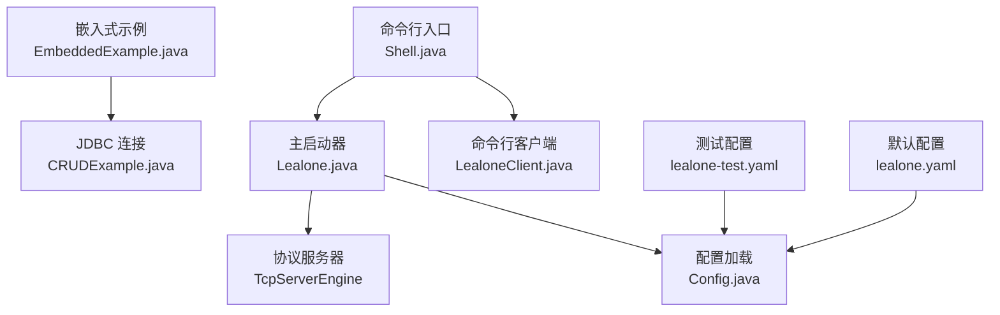
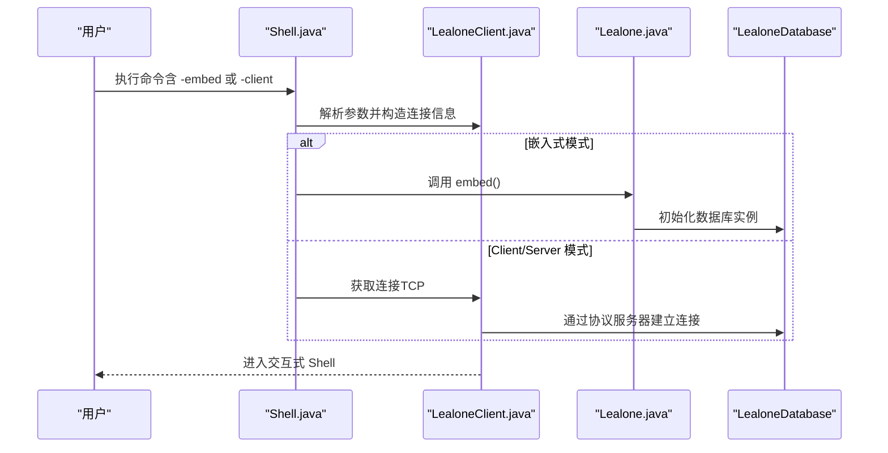
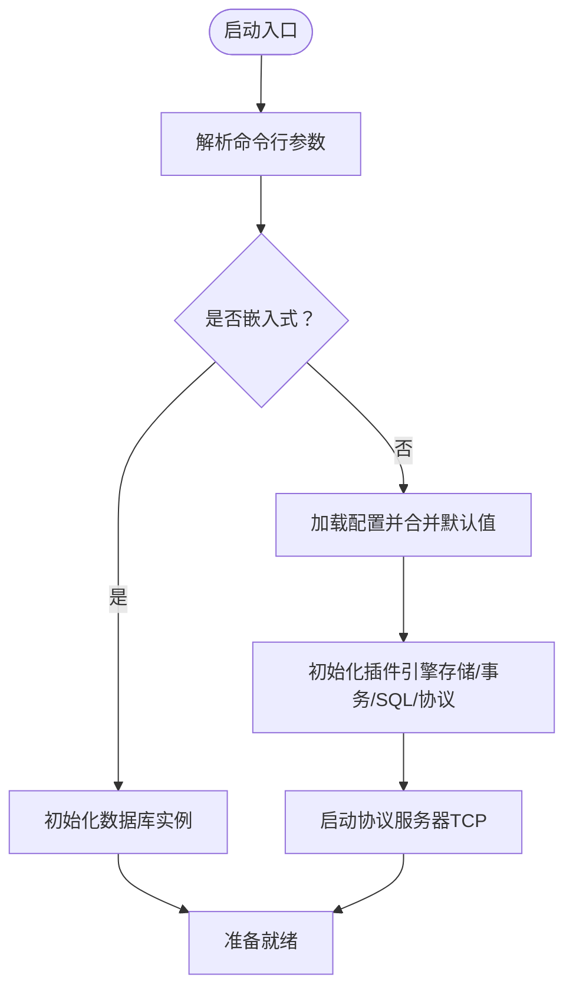
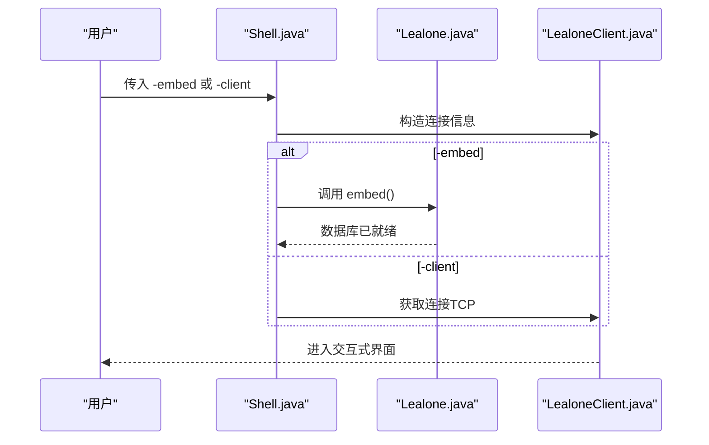
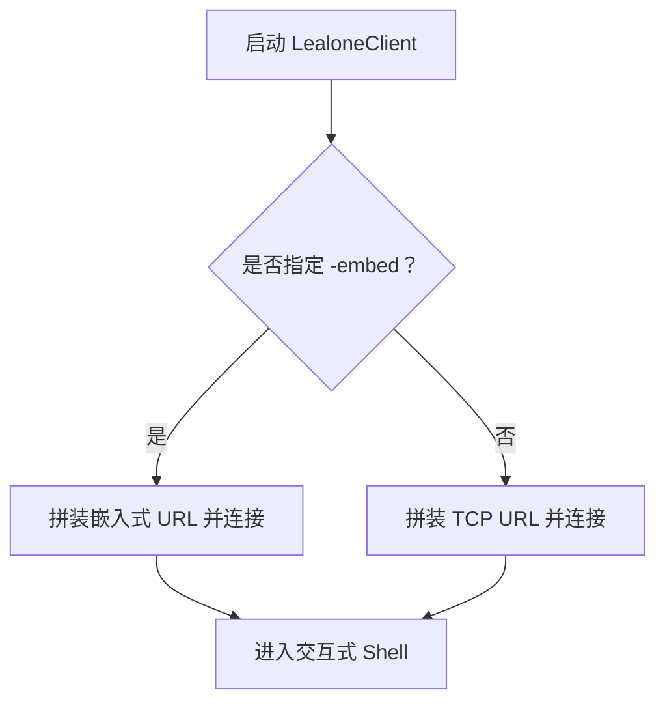
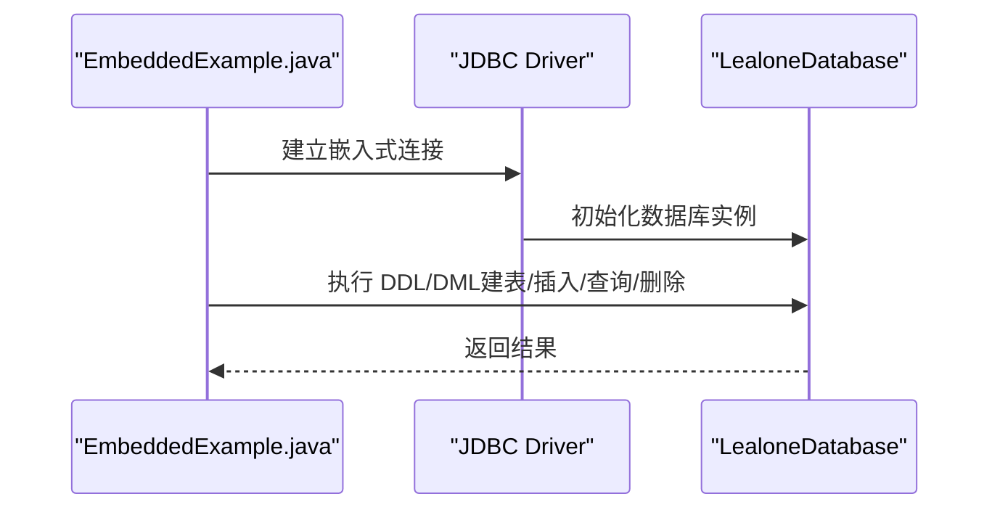
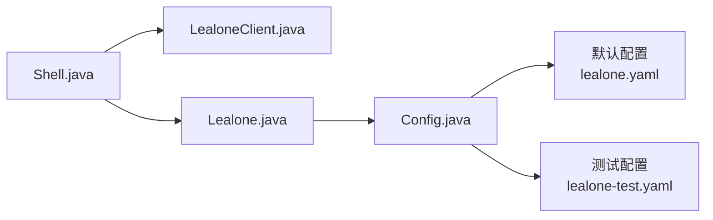

# 快速入门

<cite>
**本文引用的文件列表**
- [Lealone.java](file://lealone-main/src/main/java/com/lealone/main/Lealone.java)
- [Shell.java](file://lealone-main/src/main/java/com/lealone/main/Shell.java)
- [LealoneClient.java](file://lealone-client/src/main/java/com/lealone/client/LealoneClient.java)
- [lealone-test.yaml](file://lealone-test/src/test/resources/lealone-test.yaml)
- [lealone.yaml](file://lealone-main/dist/conf/lealone.yaml)
- [EmbeddedExample.java](file://lealone-test/src/test/java/com/lealone/test/misc/EmbeddedExample.java)
- [CRUDExample.java](file://lealone-test/src/test/java/com/lealone/test/misc/CRUDExample.java)
- [README.md](file://README.md)
</cite>

## 目录
1. [简介](#简介)
2. [项目结构](#项目结构)
3. [核心组件](#核心组件)
4. [架构总览](#架构总览)
5. [详细组件解析](#详细组件解析)
6. [依赖关系分析](#依赖关系分析)
7. [性能与实践建议](#性能与实践建议)
8. [故障排查指南](#故障排查指南)
9. [结论](#结论)
10. [附录](#附录)

## 简介
本快速入门面向初学者，目标是在最短时间内完成 Lealone 的首次体验，涵盖：
- 通过编程方式启动嵌入式数据库
- 通过命令行工具进入交互式 Shell
- 通过 Client/Server 模式连接数据库
- 完成基础的数据库操作（连接、建表、插入、查询、删除）
- 了解 lealone-test.yaml 等配置文件的基本结构与关键参数

为保证可操作性，本文不深入复杂配置细节，仅聚焦“能跑起来”的最小路径。

## 项目结构
围绕“快速入门”，以下模块与文件最为关键：
- 启动入口与模式选择：Lealone.java、Shell.java
- 命令行客户端：LealoneClient.java
- 示例程序：EmbeddedExample.java、CRUDExample.java
- 配置文件：lealone-test.yaml、lealone.yaml

图表来源
- [Shell.java](file://lealone-main/src/main/java/com/lealone/main/Shell.java#L1-L34)
- [LealoneClient.java](file://lealone-client/src/main/java/com/lealone/client/LealoneClient.java#L1-L200)
- [Lealone.java](file://lealone-main/src/main/java/com/lealone/main/Lealone.java#L1-L329)
- [lealone-test.yaml](file://lealone-test/src/test/resources/lealone-test.yaml#L1-L52)
- [lealone.yaml](file://lealone-main/dist/conf/lealone.yaml#L1-L40)

章节来源
- [README.md](file://README.md#L1-L96)

## 核心组件
- Lealone 主启动器：负责加载配置、初始化调度器、初始化数据库与插件引擎、启动协议服务器（Client/Server 模式），以及嵌入式模式的便捷入口。
- Shell 命令行工具：解析命令行参数，支持 -embed/-client 等模式，并在嵌入式模式下调用 Lealone.embed() 启动数据库。
- LealoneClient 命令行客户端：提供交互式 SQL 输入、执行与结果展示，支持 -host/-port/-url/-user/-password/-database/-embed 等参数。
- 示例程序：EmbeddedExample 展示嵌入式连接方式；CRUDExample 展示常见 DDL/DML 操作流程。

章节来源
- [Lealone.java](file://lealone-main/src/main/java/com/lealone/main/Lealone.java#L1-L329)
- [Shell.java](file://lealone-main/src/main/java/com/lealone/main/Shell.java#L1-L34)
- [LealoneClient.java](file://lealone-client/src/main/java/com/lealone/client/LealoneClient.java#L1-L200)
- [EmbeddedExample.java](file://lealone-test/src/test/java/com/lealone/test/misc/EmbeddedExample.java#L1-L36)
- [CRUDExample.java](file://lealone-test/src/test/java/com/lealone/test/misc/CRUDExample.java#L1-L217)

## 架构总览
下面的序列图展示了从命令行到数据库连接的关键调用链，帮助你理解“如何启动并连接”。

图表来源
- [Shell.java](file://lealone-main/src/main/java/com/lealone/main/Shell.java#L1-L34)
- [LealoneClient.java](file://lealone-client/src/main/java/com/lealone/client/LealoneClient.java#L1-L200)
- [Lealone.java](file://lealone-main/src/main/java/com/lealone/main/Lealone.java#L1-L329)

## 详细组件解析

### 组件一：Lealone 主启动器（嵌入式与 Client/Server 模式）
- 功能要点
  - 解析命令行参数（-embed/-client/-config/-baseDir/-host/-port/-help）。
  - 加载配置（默认 YAML，支持覆盖）。
  - 初始化调度器、数据库、插件引擎与协议服务器。
  - 在非嵌入式模式下启动 TCP 协议服务器，供客户端连接。
- 关键流程
  - 参数解析后，根据是否嵌入式决定直接启动数据库或启动协议服务器。
  - 初始化顺序：存储引擎 -> 事务引擎 -> SQL 引擎 -> 协议服务器。
  - 支持通过 System Property 覆盖配置项（如 config.loader）。

图表来源
- [Lealone.java](file://lealone-main/src/main/java/com/lealone/main/Lealone.java#L120-L207)

章节来源
- [Lealone.java](file://lealone-main/src/main/java/com/lealone/main/Lealone.java#L120-L207)

### 组件二：Shell 命令行工具（-embed/-client）
- 功能要点
  - 接收 -embed/-client 等参数，委派给 LealoneClient。
  - 在嵌入式模式下，自动调用 Lealone.embed() 启动数据库。
- 使用场景
  - -embed：适合单进程内嵌数据库，无需外部服务器。
  - -client：适合连接远程或本地 TCP 服务器。

图表来源
- [Shell.java](file://lealone-main/src/main/java/com/lealone/main/Shell.java#L1-L34)
- [Lealone.java](file://lealone-main/src/main/java/com/lealone/main/Lealone.java#L67-L79)

章节来源
- [Shell.java](file://lealone-main/src/main/java/com/lealone/main/Shell.java#L1-L34)

### 组件三：LealoneClient 命令行客户端（交互式 SQL）
- 功能要点
  - 支持 -host/-port/-url/-user/-password/-database/-embed/-safeMode 等参数。
  - 自动拼装 JDBC URL（嵌入式或 TCP）。
  - 提供交互式提示符，支持执行 SQL、脚本与历史记录。
- 实践建议
  - 初学者可直接使用 -embed 运行，无需额外启动服务器。
  - 若需多进程或多客户端访问，使用 -client 并确保 Lealone 已启动 TCP 服务器。

图表来源
- [LealoneClient.java](file://lealone-client/src/main/java/com/lealone/client/LealoneClient.java#L110-L171)

章节来源
- [LealoneClient.java](file://lealone-client/src/main/java/com/lealone/client/LealoneClient.java#L1-L200)

### 组件四：嵌入式示例与 CRUD 操作
- EmbeddedExample 展示三种嵌入式连接方式：
  - 指定数据库名
  - 使用相对路径别名
  - 内存数据库（持久化关闭）
- CRUDExample 展示典型 DDL/DML 流程：
  - 建表、插入、更新、查询、删除
  - 支持批处理、预编译语句与异步执行

图表来源
- [EmbeddedExample.java](file://lealone-test/src/test/java/com/lealone/test/misc/EmbeddedExample.java#L1-L36)
- [CRUDExample.java](file://lealone-test/src/test/java/com/lealone/test/misc/CRUDExample.java#L100-L121)

章节来源
- [EmbeddedExample.java](file://lealone-test/src/test/java/com/lealone/test/misc/EmbeddedExample.java#L1-L36)
- [CRUDExample.java](file://lealone-test/src/test/java/com/lealone/test/misc/CRUDExample.java#L100-L121)

## 依赖关系分析
- 启动链路
  - Shell -> LealoneClient -> Lealone（嵌入式）或通过协议服务器（Client/Server）
- 配置链路
  - Lealone 加载配置（默认 YAML），支持 System Property 覆盖
  - 配置合并默认引擎与调度参数，再初始化各插件引擎

图表来源
- [Shell.java](file://lealone-main/src/main/java/com/lealone/main/Shell.java#L1-L34)
- [LealoneClient.java](file://lealone-client/src/main/java/com/lealone/client/LealoneClient.java#L1-L200)
- [Lealone.java](file://lealone-main/src/main/java/com/lealone/main/Lealone.java#L1-L329)
- [lealone-test.yaml](file://lealone-test/src/test/resources/lealone-test.yaml#L1-L52)
- [lealone.yaml](file://lealone-main/dist/conf/lealone.yaml#L1-L40)

章节来源
- [Lealone.java](file://lealone-main/src/main/java/com/lealone/main/Lealone.java#L153-L207)
- [lealone-test.yaml](file://lealone-test/src/test/resources/lealone-test.yaml#L1-L52)
- [lealone.yaml](file://lealone-main/dist/conf/lealone.yaml#L1-L40)

## 性能与实践建议
- 嵌入式模式适合单进程、轻量场景，启动快、无网络开销。
- Client/Server 模式适合多进程或多客户端共享数据库，需确保 TCP 服务器已启动。
- 初学者建议先用嵌入式验证功能，再切换到 Client/Server 模式进行多客户端联调。
- 如需更高吞吐，可在配置中调整调度器与网络参数（见配置文件说明）。

[本节为通用建议，不直接分析具体文件]

## 故障排查指南
- 无法连接数据库
  - 确认是否正确使用 -embed 或 -client
  - 若使用 -client，请确认 TCP 服务器已启动且端口可用
- 配置问题
  - 检查 base_dir 是否存在且可写
  - 如需自定义配置，可通过 -config 指定 YAML 文件
- 日志与追踪
  - 可在连接参数中开启 TRACE_LEVEL（参考测试基类中的示例）

章节来源
- [Lealone.java](file://lealone-main/src/main/java/com/lealone/main/Lealone.java#L100-L116)
- [lealone-test.yaml](file://lealone-test/src/test/resources/lealone-test.yaml#L1-L52)

## 结论
通过以上步骤，你可以：
- 以嵌入式方式快速启动数据库并进行交互
- 以 Client/Server 模式连接数据库
- 完成建表、插入、查询、删除等基础操作
- 了解 lealone-test.yaml 等配置文件的基本结构与关键参数

建议在掌握这些基础后，逐步探索更丰富的功能与配置项。

[本节为总结，不直接分析具体文件]

## 附录

### A. 从零开始的实践步骤（嵌入式模式）
- 步骤 1：运行嵌入式示例
  - 参考路径：[EmbeddedExample.java](file://lealone-test/src/test/java/com/lealone/test/misc/EmbeddedExample.java#L1-L36)
- 步骤 2：执行 CRUD 操作
  - 参考路径：[CRUDExample.java](file://lealone-test/src/test/java/com/lealone/test/misc/CRUDExample.java#L100-L121)
- 步骤 3：查看交互式 Shell
  - 参考路径：[LealoneClient.java](file://lealone-client/src/main/java/com/lealone/client/LealoneClient.java#L110-L171)

章节来源
- [EmbeddedExample.java](file://lealone-test/src/test/java/com/lealone/test/misc/EmbeddedExample.java#L1-L36)
- [CRUDExample.java](file://lealone-test/src/test/java/com/lealone/test/misc/CRUDExample.java#L100-L121)
- [LealoneClient.java](file://lealone-client/src/main/java/com/lealone/client/LealoneClient.java#L110-L171)

### B. 从零开始的实践步骤（Client/Server 模式）
- 步骤 1：启动 Lealone（非嵌入式）
  - 参考路径：[Lealone.java](file://lealone-main/src/main/java/com/lealone/main/Lealone.java#L120-L207)
- 步骤 2：使用 Shell 连接
  - 参考路径：[Shell.java](file://lealone-main/src/main/java/com/lealone/main/Shell.java#L1-L34)
- 步骤 3：进入交互式 SQL
  - 参考路径：[LealoneClient.java](file://lealone-client/src/main/java/com/lealone/client/LealoneClient.java#L110-L171)

章节来源
- [Lealone.java](file://lealone-main/src/main/java/com/lealone/main/Lealone.java#L120-L207)
- [Shell.java](file://lealone-main/src/main/java/com/lealone/main/Shell.java#L1-L34)
- [LealoneClient.java](file://lealone-client/src/main/java/com/lealone/client/LealoneClient.java#L110-L171)

### C. 配置文件结构与关键参数（lealone-test.yaml）
- 基本目录与监听地址
  - base_dir：数据库数据目录
  - listen_address：协议服务器监听地址
- 调度器参数
  - scheduler_count：调度线程数
  - prefer_batch_write：是否偏好批量写
  - max_packet_count_per_loop：每次事件循环最大处理数据包数
- 存储引擎（AOSE）
  - page_size：页面大小
  - compress：压缩策略（no/lzf/deflate 或 0/1/2）
- 事务引擎（AOTE）
  - dirty_page_cache_size_in_mb：脏页缓存大小（MB）
  - redo_log_dir：重做日志目录
  - log_sync_type：日志同步类型（instant/no_sync/periodic）
- SQL 引擎（Lealone）
  - 当前示例未设置特定参数
- 协议服务器（TCP）
  - port：监听端口
  - allow_others：是否允许外部访问
  - ssl：是否启用 SSL
  - session_timeout：会话超时（-1 表示无限）

章节来源
- [lealone-test.yaml](file://lealone-test/src/test/resources/lealone-test.yaml#L1-L52)

### D. 默认配置（lealone.yaml）
- 默认包含 AOSE、AOTE、Lealone SQL 引擎与 TCP 协议服务器
- 默认端口与目录可根据需要修改

章节来源
- [lealone.yaml](file://lealone-main/dist/conf/lealone.yaml#L1-L40)