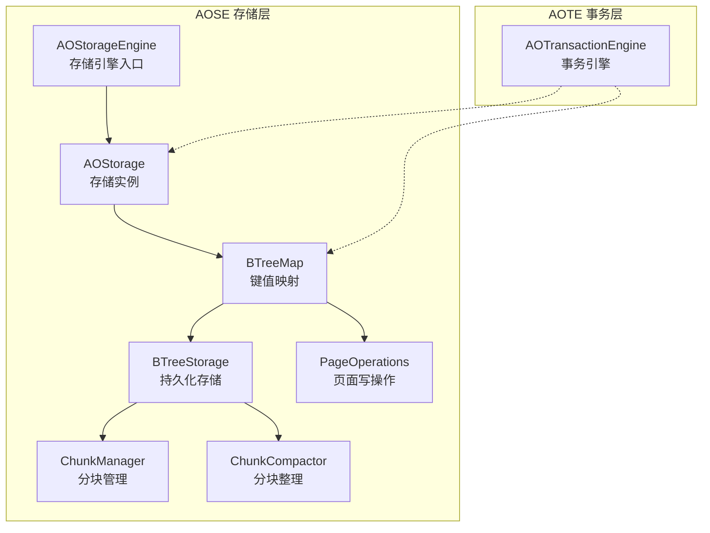
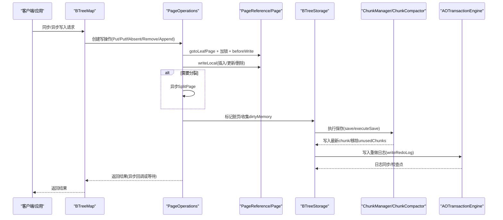
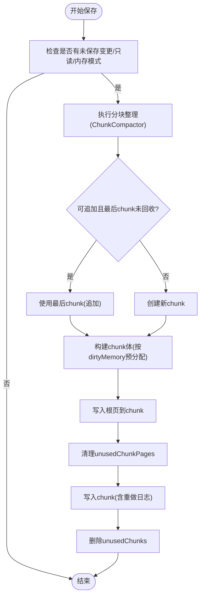
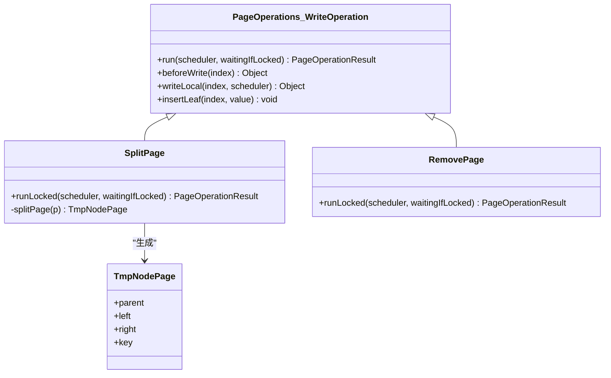
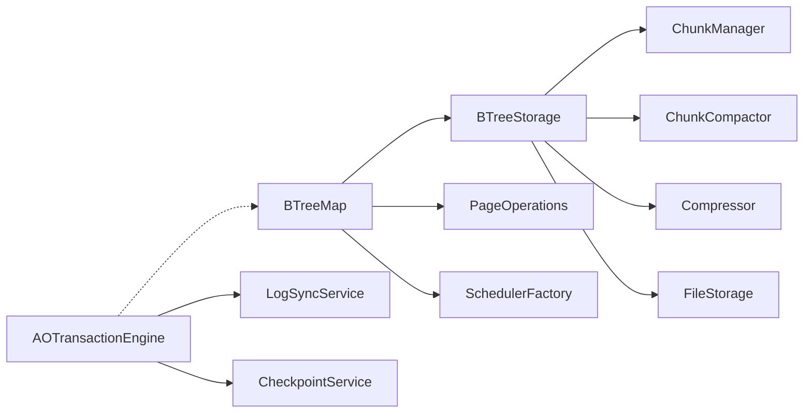

# 写入性能优化

<cite>
**本文引用的文件列表**
- [AOStorageEngine.java](file://lealone-aose/src/main/java/com/lealone/storage/aose/AOStorageEngine.java)
- [AOStorage.java](file://lealone-aose/src/main/java/com/lealone/storage/aose/AOStorage.java)
- [BTreeStorage.java](file://lealone-aose/src/main/java/com/lealone/storage/aose/btree/BTreeStorage.java)
- [BTreeMap.java](file://lealone-aose/src/main/java/com/lealone/storage/aose/btree/BTreeMap.java)
- [PageOperations.java](file://lealone-aose/src/main/java/com/lealone/storage/aose/btree/page/PageOperations.java)
- [ChunkManager.java](file://lealone-aose/src/main/java/com/lealone/storage/aose/btree/chunk/ChunkManager.java)
- [ChunkCompactor.java](file://lealone-aose/src/main/java/com/lealone/storage/aose/btree/chunk/ChunkCompactor.java)
- [AOTransactionEngine.java](file://lealone-aote/src/main/java/com/lealone/transaction/aote/AOTransactionEngine.java)
- [StorageBuilder.java](file://lealone-sci/src/main/java/com/lealone/storage/StorageBuilder.java)
- [StorageSetting.java](file://lealone-sci/src/main/java/com/lealone/storage/StorageSetting.java)
- [DataBuffer.java](file://lealone-common/src/main/java/com/lealone/db/DataBuffer.java)
- [BTreeStorageTest.java](file://lealone-test/src/test/java/com/lealone/test/aose/BTreeStorageTest.java)
</cite>

## 目录
1. [简介](#简介)
2. [项目结构](#项目结构)
3. [核心组件](#核心组件)
4. [架构总览](#架构总览)
5. [详细组件分析](#详细组件分析)
6. [依赖关系分析](#依赖关系分析)
7. [性能考量](#性能考量)
8. [故障排查指南](#故障排查指南)
9. [结论](#结论)
10. [附录：配置参数与调优建议](#附录配置参数与调优建议)

## 简介
本文件聚焦于 AOSE 存储引擎的写入性能优化机制，围绕以下目标展开：
- 解释 BTreeStorage 中的异步刷盘策略、批量写入优化与 B-Tree 节点分裂算法
- 阐述 AOStorageEngine 如何通过异步化处理提升写入吞吐量
- 分析 AOTransactionEngine 在事务提交过程中的优化措施
- 给出可操作的配置参数调优建议（缓冲区大小、刷盘间隔等）
- 结合测试用例与常见场景，给出高并发写入的最佳实践

## 项目结构
AOSE 存储引擎位于 lealone-aose 模块，核心由 B-Tree 映射、分块管理、压缩与 GC、以及 AOStorage/AOStorageEngine 组成；事务侧由 AOTE 引擎负责日志与检查点服务。

图表来源
- [AOStorageEngine.java](file://lealone-aose/src/main/java/com/lealone/storage/aose/AOStorageEngine.java#L1-L33)
- [AOStorage.java](file://lealone-aose/src/main/java/com/lealone/storage/aose/AOStorage.java#L1-L104)
- [BTreeMap.java](file://lealone-aose/src/main/java/com/lealone/storage/aose/btree/BTreeMap.java#L1-L120)
- [BTreeStorage.java](file://lealone-aose/src/main/java/com/lealone/storage/aose/btree/BTreeStorage.java#L1-L120)
- [ChunkManager.java](file://lealone-aose/src/main/java/com/lealone/storage/aose/btree/chunk/ChunkManager.java#L1-L60)
- [ChunkCompactor.java](file://lealone-aose/src/main/java/com/lealone/storage/aose/btree/chunk/ChunkCompactor.java#L1-L60)
- [PageOperations.java](file://lealone-aose/src/main/java/com/lealone/storage/aose/btree/page/PageOperations.java#L1-L60)
- [AOTransactionEngine.java](file://lealone-aote/src/main/java/com/lealone/transaction/aote/AOTransactionEngine.java#L1-L60)

章节来源
- [AOStorageEngine.java](file://lealone-aose/src/main/java/com/lealone/storage/aose/AOStorageEngine.java#L1-L33)
- [AOStorage.java](file://lealone-aose/src/main/java/com/lealone/storage/aose/AOStorage.java#L1-L104)

## 核心组件
- AOStorageEngine：AOSE 存储引擎入口，提供存储构建器与 LOB 存储
- AOStorage：存储实例，负责打开 BTreeMap 并管理临时文件
- BTreeMap：B-Tree 键值映射，提供同步/异步写入 API，调度写操作
- BTreeStorage：持久化存储，负责分块、压缩、GC、刷盘与重做日志
- ChunkManager/ChunkCompactor：分块管理与分块整理，降低碎片率、提升写入效率
- PageOperations：页面写操作抽象，封装 Put/PutIfAbsent/Remove/Append 与异步分裂/删除
- AOTransactionEngine：事务引擎，提供日志同步服务、检查点与事务生命周期管理

章节来源
- [AOStorageEngine.java](file://lealone-aose/src/main/java/com/lealone/storage/aose/AOStorageEngine.java#L1-L33)
- [AOStorage.java](file://lealone-aose/src/main/java/com/lealone/storage/aose/AOStorage.java#L1-L104)
- [BTreeMap.java](file://lealone-aose/src/main/java/com/lealone/storage/aose/btree/BTreeMap.java#L558-L752)
- [BTreeStorage.java](file://lealone-aose/src/main/java/com/lealone/storage/aose/btree/BTreeStorage.java#L1-L120)
- [ChunkManager.java](file://lealone-aose/src/main/java/com/lealone/storage/aose/btree/chunk/ChunkManager.java#L1-L120)
- [ChunkCompactor.java](file://lealone-aose/src/main/java/com/lealone/storage/aose/btree/chunk/ChunkCompactor.java#L1-L80)
- [PageOperations.java](file://lealone-aose/src/main/java/com/lealone/storage/aose/btree/page/PageOperations.java#L1-L120)
- [AOTransactionEngine.java](file://lealone-aote/src/main/java/com/lealone/transaction/aote/AOTransactionEngine.java#L1-L120)

## 架构总览
AOSE 的写入路径从 BTreeMap 的同步/异步 API 开始，进入 PageOperations 的写操作流程，随后通过 BTreeStorage 的分块与压缩策略进行批量刷盘，配合 AOTransactionEngine 的日志同步服务完成事务提交。

图表来源
- [BTreeMap.java](file://lealone-aose/src/main/java/com/lealone/storage/aose/btree/BTreeMap.java#L558-L752)
- [PageOperations.java](file://lealone-aose/src/main/java/com/lealone/storage/aose/btree/page/PageOperations.java#L120-L220)
- [BTreeStorage.java](file://lealone-aose/src/main/java/com/lealone/storage/aose/btree/BTreeStorage.java#L300-L380)
- [ChunkManager.java](file://lealone-aose/src/main/java/com/lealone/storage/aose/btree/chunk/ChunkManager.java#L120-L180)
- [ChunkCompactor.java](file://lealone-aose/src/main/java/com/lealone/storage/aose/btree/chunk/ChunkCompactor.java#L60-L120)
- [AOTransactionEngine.java](file://lealone-aote/src/main/java/com/lealone/transaction/aote/AOTransactionEngine.java#L240-L310)

## 详细组件分析

### BTreeStorage：异步刷盘、批量写入与压缩
- 异步刷盘策略
  - BTreeStorage.save/save(compact, appendModeEnabled, dirtyMemory) 在非内存模式下进行批量刷盘，优先尝试“追加模式”写入最近未被回收的 chunk，减少随机写与文件扩展成本
  - executeSave 中根据 dirtyMemory 预分配直接内存 DataBuffer，减少拷贝与 GC 压力
  - 写入完成后，先清理 unusedChunks 中的 pages，再删除旧 chunk，确保数据一致性
- 批量写入优化
  - 通过 ChunkManager.getLastChunk 与 appendModeEnabled 判断是否可追加，避免频繁创建新文件
  - 采用 DataBuffer.direct 与按需扩容策略，减少堆内存压力
- 压缩与填充率
  - 支持 LZF/Deflate 压缩级别配置，压缩仅影响新写入页面
  - minFillRate 控制分块整理阈值，降低碎片率，提升后续写入效率

图表来源
- [BTreeStorage.java](file://lealone-aose/src/main/java/com/lealone/storage/aose/btree/BTreeStorage.java#L300-L380)
- [ChunkCompactor.java](file://lealone-aose/src/main/java/com/lealone/storage/aose/btree/chunk/ChunkCompactor.java#L60-L120)
- [DataBuffer.java](file://lealone-common/src/main/java/com/lealone/db/DataBuffer.java#L576-L624)

章节来源
- [BTreeStorage.java](file://lealone-aose/src/main/java/com/lealone/storage/aose/btree/BTreeStorage.java#L300-L380)
- [ChunkManager.java](file://lealone-aose/src/main/java/com/lealone/storage/aose/btree/chunk/ChunkManager.java#L120-L180)
- [ChunkCompactor.java](file://lealone-aose/src/main/java/com/lealone/storage/aose/btree/chunk/ChunkCompactor.java#L60-L120)
- [DataBuffer.java](file://lealone-common/src/main/java/com/lealone/db/DataBuffer.java#L576-L624)

### PageOperations：异步写入与节点分裂
- 写操作流程
  - gotoLeafPage + tryLock + beforeWrite + writeLocal，成功后快速释放锁，异步处理结果
  - 对于新增键且需要分裂的叶子页，触发异步 SplitPage，避免阻塞写线程
- 节点分裂算法
  - SplitPage 将页面一分为二，生成左右子页与父节点页，必要时更新 PageReference 的 PageListener 与锁，确保并发安全
  - 对根页分裂时，直接替换根；对非根页分裂时，先锁父节点，再插入新父节点，最后异步检查父节点是否需要继续分裂
- 删除优化
  - Remove 操作先复制页面，避免并发读写冲突；若叶子页为空且非根，则异步删除该页并向上检查父节点是否需要删除

图表来源
- [PageOperations.java](file://lealone-aose/src/main/java/com/lealone/storage/aose/btree/page/PageOperations.java#L120-L220)
- [PageOperations.java](file://lealone-aose/src/main/java/com/lealone/storage/aose/btree/page/PageOperations.java#L400-L520)

章节来源
- [PageOperations.java](file://lealone-aose/src/main/java/com/lealone/storage/aose/btree/page/PageOperations.java#L120-L220)
- [PageOperations.java](file://lealone-aose/src/main/java/com/lealone/storage/aose/btree/page/PageOperations.java#L400-L520)

### AOStorageEngine：异步化与存储构建
- 作为存储引擎入口，AOStorageEngine 提供 StorageBuilder 与 LOB 存储实现，为上层提供统一的存储构建接口
- 通过 AOStorage.openBTreeMap，延迟加载与事件监听确保 map 就绪后再对外提供，避免并发竞态

章节来源
- [AOStorageEngine.java](file://lealone-aose/src/main/java/com/lealone/storage/aose/AOStorageEngine.java#L1-L33)
- [AOStorage.java](file://lealone-aose/src/main/java/com/lealone/storage/aose/AOStorage.java#L60-L104)

### AOTransactionEngine：事务提交优化
- 日志同步与检查点
  - AOTransactionEngine 初始化多个 LogSyncService，按调度线程分发，降低单点瓶颈
  - 支持周期性/异步检查点，定期将脏页落盘，减少崩溃恢复时间
- 事务生命周期
  - beginTransaction 自动初始化服务，绑定调度器，支持单线程/多线程事务
  - 提供 recover/recover 重放重做日志能力，保障数据一致性

章节来源
- [AOTransactionEngine.java](file://lealone-aote/src/main/java/com/lealone/transaction/aote/AOTransactionEngine.java#L120-L220)
- [AOTransactionEngine.java](file://lealone-aote/src/main/java/com/lealone/transaction/aote/AOTransactionEngine.java#L240-L310)

## 依赖关系分析
- BTreeMap 依赖 BTreeStorage 进行持久化与 GC；依赖 PageOperations 执行写操作；依赖 SchedulerFactory 进行异步调度
- BTreeStorage 依赖 ChunkManager/ChunkCompactor 进行分块与整理；依赖 Compressor 进行压缩；依赖 FileStorage 进行磁盘 IO
- AOTransactionEngine 依赖 LogSyncService/CheckpointService 进行日志同步与检查点；与 AOStorage/BTreeMap 协作进行恢复

图表来源
- [BTreeMap.java](file://lealone-aose/src/main/java/com/lealone/storage/aose/btree/BTreeMap.java#L1-L120)
- [BTreeStorage.java](file://lealone-aose/src/main/java/com/lealone/storage/aose/btree/BTreeStorage.java#L1-L120)
- [AOTransactionEngine.java](file://lealone-aote/src/main/java/com/lealone/transaction/aote/AOTransactionEngine.java#L240-L310)

章节来源
- [BTreeMap.java](file://lealone-aose/src/main/java/com/lealone/storage/aose/btree/BTreeMap.java#L1-L120)
- [BTreeStorage.java](file://lealone-aose/src/main/java/com/lealone/storage/aose/btree/BTreeStorage.java#L1-L120)
- [AOTransactionEngine.java](file://lealone-aote/src/main/java/com/lealone/transaction/aote/AOTransactionEngine.java#L240-L310)

## 性能考量
- 写入吞吐优化
  - 异步写操作：PageOperations 在写入后快速释放锁，将结果处理放入调度器队列，显著降低写路径阻塞
  - 批量刷盘：BTreeStorage 优先追加写入最近 chunk，减少文件扩展与随机写
  - 压缩策略：LZF/Deflate 压缩可节省空间，但会增加 CPU 开销；可根据场景选择
- 分块整理与填充率
  - ChunkCompactor 基于 minFillRate 与 live page 长度排序，批量重写低填充率 chunk，降低碎片率
- 事务提交开销
  - 多 LogSyncService 分摊日志写入压力；检查点异步执行，避免阻塞主写路径
- 内存与缓冲
  - DataBuffer.direct 与按 dirtyMemory 预分配，减少拷贝与 GC 抖动

章节来源
- [PageOperations.java](file://lealone-aose/src/main/java/com/lealone/storage/aose/btree/page/PageOperations.java#L120-L220)
- [BTreeStorage.java](file://lealone-aose/src/main/java/com/lealone/storage/aose/btree/BTreeStorage.java#L300-L380)
- [ChunkCompactor.java](file://lealone-aose/src/main/java/com/lealone/storage/aose/btree/chunk/ChunkCompactor.java#L120-L169)
- [DataBuffer.java](file://lealone-common/src/main/java/com/lealone/db/DataBuffer.java#L576-L624)
- [AOTransactionEngine.java](file://lealone-aote/src/main/java/com/lealone/transaction/aote/AOTransactionEngine.java#L240-L310)

## 故障排查指南
- 文件损坏与 panic
  - BTreeStorage.panic 在发生非法状态或读写异常时关闭存储并抛出异常，便于快速定位问题
- 重做日志校验
  - BTreeStorage.validateRedoLog 逐条解析重做日志，验证指定事务 ID 是否存在，辅助恢复流程
- 测试验证
  - BTreeStorageTest 展示了分块写入与读取正确性的基本验证流程

章节来源
- [BTreeStorage.java](file://lealone-aose/src/main/java/com/lealone/storage/aose/btree/BTreeStorage.java#L190-L220)
- [BTreeStorage.java](file://lealone-aose/src/main/java/com/lealone/storage/aose/btree/BTreeStorage.java#L388-L414)
- [BTreeStorageTest.java](file://lealone-test/src/test/java/com/lealone/test/aose/BTreeStorageTest.java#L1-L58)

## 结论
AOSE 通过“异步写操作 + 批量刷盘 + 分块整理 + 压缩”的组合拳，在保证一致性的同时显著提升了写入吞吐量。AOTransactionEngine 的多服务分发与异步检查点进一步降低了事务提交的尾延迟。合理配置参数（如页大小、缓存、最小填充率、压缩级别）可在不同工作负载下取得最佳效果。

## 附录：配置参数与调优建议
- 关键配置项
  - DbSetting.PAGE_SIZE：页面大小（字节），影响分裂阈值与 IO 成本
  - DbSetting.CACHE_SIZE：缓存大小（字节），影响内存占用与命中率
  - StorageSetting.MIN_FILL_RATE：最小填充率（百分比），控制分块整理触发
  - StorageSetting.MAX_CHUNK_SIZE：最大分块大小（字节），影响批量写入与碎片率
  - DbSetting.COMPRESS：压缩级别（0/1/2 或 LZF/DEFLATE），平衡空间与 CPU
  - StorageSetting.PAGE_STORAGE_MODE：行存储/列存储，影响列访问与压缩效果
- 调优建议
  - 高并发写入场景
    - 增大 PAGE_SIZE 与 CACHE_SIZE，减少分裂与 GC 触发频率
    - 设置合理的 MIN_FILL_RATE（如 30%-40%），配合 ChunkCompactor 降低碎片
    - 启用 LZF 压缩（压缩级别 1），在空间与 CPU 间取得平衡
  - 低延迟场景
    - 减小 PAGE_SIZE，降低单页写放大；适当降低 MIN_FILL_RATE，提升写放大
    - 使用异步写 API，避免阻塞线程
  - 磁盘受限场景
    - 启用 DEFLATE 压缩（压缩级别 2），显著节省空间；注意 CPU 开销
  - 事务一致性与恢复
    - 合理设置日志同步策略（周期性/异步），结合检查点频率，平衡吞吐与恢复时间
- 参数设置参考
  - StorageBuilder 提供便捷方法设置 PAGE_SIZE、CACHE_SIZE、MIN_FILL_RATE、压缩等级等

章节来源
- [StorageBuilder.java](file://lealone-sci/src/main/java/com/lealone/storage/StorageBuilder.java#L81-L148)
- [StorageSetting.java](file://lealone-sci/src/main/java/com/lealone/storage/StorageSetting.java#L1-L18)
- [BTreeStorage.java](file://lealone-aose/src/main/java/com/lealone/storage/aose/btree/BTreeStorage.java#L60-L120)
- [AOTransactionEngine.java](file://lealone-aote/src/main/java/com/lealone/transaction/aote/AOTransactionEngine.java#L240-L310)