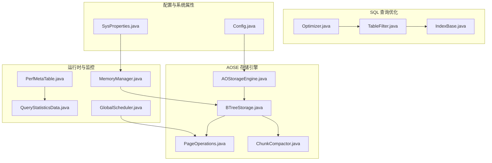
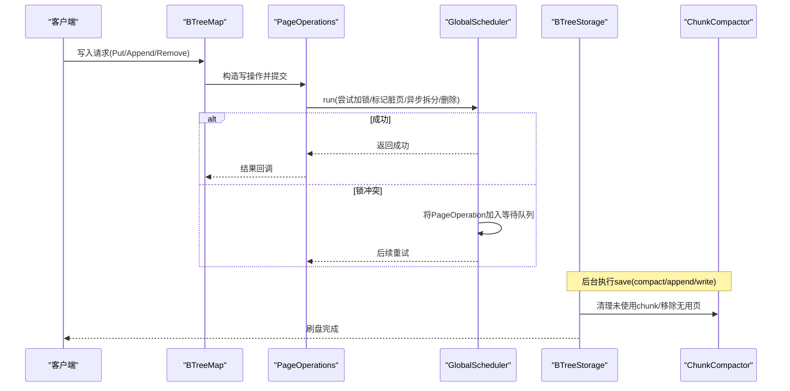
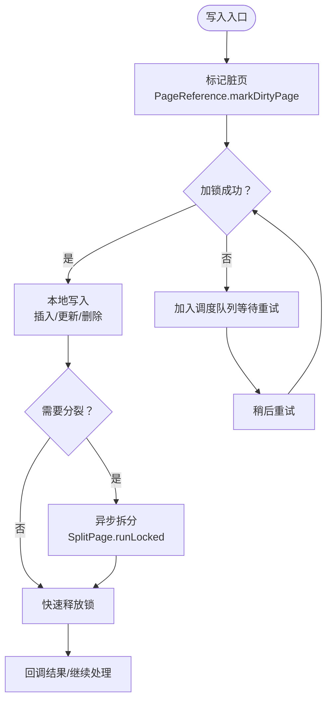
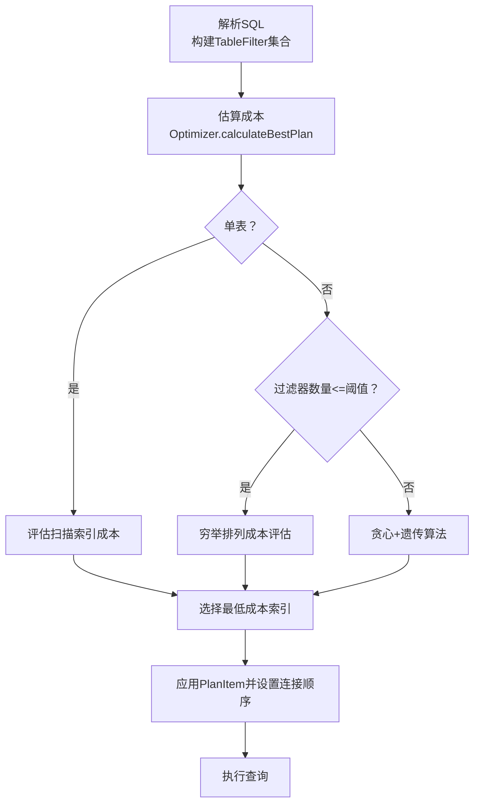
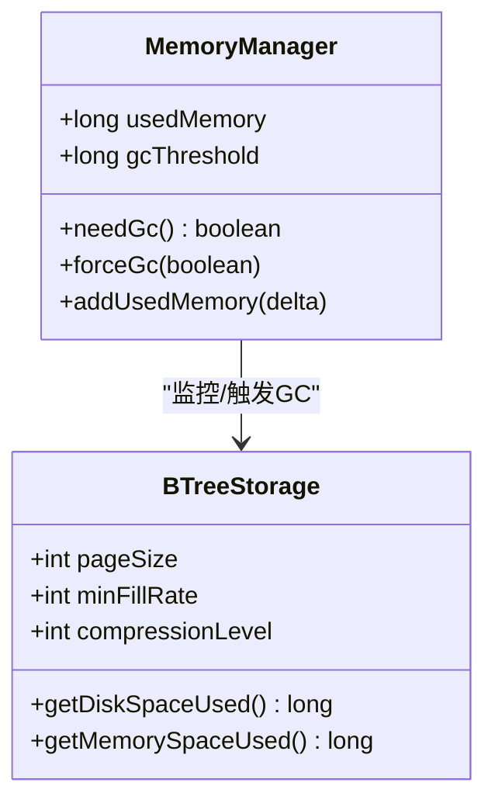
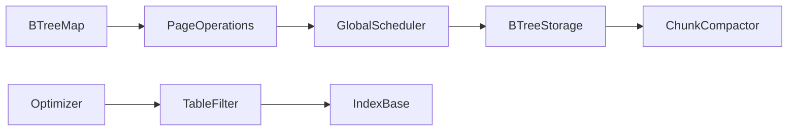

# 性能优化

<cite>
**本文引用的文件**
- [BTreeStorage.java](file://lealone-aose/src/main/java/com/lealone/storage/aose/btree/BTreeStorage.java)
- [Optimizer.java](file://lealone-sql/src/main/java/com/lealone/sql/optimizer/Optimizer.java)
- [TableFilter.java](file://lealone-sql/src/main/java/com/lealone/sql/optimizer/TableFilter.java)
- [IndexBase.java](file://lealone-db/src/main/java/com/lealone/db/index/IndexBase.java)
- [AOStorageEngine.java](file://lealone-aose/src/main/java/com/lealone/storage/aose/AOStorageEngine.java)
- [PageOperations.java](file://lealone-aose/src/main/java/com/lealone/storage/aose/btree/page/PageOperations.java)
- [BTreeMap.java](file://lealone-aose/src/main/java/com/lealone/storage/aose/btree/BTreeMap.java)
- [ChunkCompactor.java](file://lealone-aose/src/main/java/com/lealone/storage/aose/btree/chunk/ChunkCompactor.java)
- [MemoryManager.java](file://lealone-sci/src/main/java/com/lealone/db/MemoryManager.java)
- [PerfMetaTable.java](file://lealone-db/src/main/java/com/lealone/db/table/PerfMetaTable.java)
- [QueryStatisticsData.java](file://lealone-db/src/main/java/com/lealone/db/stats/QueryStatisticsData.java)
- [GlobalScheduler.java](file://lealone-server/src/main/java/com/lealone/server/scheduler/GlobalScheduler.java)
- [SysProperties.java](file://lealone-common/src/main/java/com/lealone/db/SysProperties.java)
- [Config.java](file://lealone-main/src/main/java/com/lealone/main/config/Config.java)
</cite>

## 目录
1. [简介](#简介)
2. [项目结构](#项目结构)
3. [核心组件](#核心组件)
4. [架构总览](#架构总览)
5. [详细组件分析](#详细组件分析)
6. [依赖关系分析](#依赖关系分析)
7. [性能考量](#性能考量)
8. [故障排查指南](#故障排查指南)
9. [结论](#结论)
10. [附录](#附录)

## 简介
本指南聚焦于Lealone的AOSE（Asynchronous Optimized Storage Engine）存储引擎与SQL查询优化器的性能优化实践，围绕写入性能（异步刷盘、批量写入、B-Tree优化策略）、查询性能（优化器工作原理、索引选择策略、执行计划分析）、内存管理与JVM调优、以及数据库管理员可用的性能调优工具箱展开。文档基于源码实现细节，提供可落地的优化建议与可视化图示，帮助读者在生产环境中获得稳定且高效的性能表现。

## 项目结构
Lealone采用模块化设计，AOSE存储引擎位于独立模块中，SQL优化器与查询执行逻辑位于SQL模块，内存管理与统计信息位于公共与数据库模块。下图展示与性能优化相关的关键模块与文件映射。

图表来源
- [BTreeStorage.java](file://lealone-aose/src/main/java/com/lealone/storage/aose/btree/BTreeStorage.java#L1-L415)
- [PageOperations.java](file://lealone-aose/src/main/java/com/lealone/storage/aose/btree/page/PageOperations.java#L1-L521)
- [ChunkCompactor.java](file://lealone-aose/src/main/java/com/lealone/storage/aose/btree/chunk/ChunkCompactor.java#L42-L77)
- [AOStorageEngine.java](file://lealone-aose/src/main/java/com/lealone/storage/aose/AOStorageEngine.java#L1-L33)
- [Optimizer.java](file://lealone-sql/src/main/java/com/lealone/sql/optimizer/Optimizer.java#L1-L282)
- [TableFilter.java](file://lealone-sql/src/main/java/com/lealone/sql/optimizer/TableFilter.java#L126-L193)
- [IndexBase.java](file://lealone-db/src/main/java/com/lealone/db/index/IndexBase.java#L266-L292)
- [MemoryManager.java](file://lealone-sci/src/main/java/com/lealone/db/MemoryManager.java#L1-L102)
- [PerfMetaTable.java](file://lealone-db/src/main/java/com/lealone/db/table/PerfMetaTable.java#L1-L96)
- [QueryStatisticsData.java](file://lealone-db/src/main/java/com/lealone/db/stats/QueryStatisticsData.java#L113-L188)
- [GlobalScheduler.java](file://lealone-server/src/main/java/com/lealone/server/scheduler/GlobalScheduler.java#L324-L363)
- [SysProperties.java](file://lealone-common/src/main/java/com/lealone/db/SysProperties.java)
- [Config.java](file://lealone-main/src/main/java/com/lealone/main/config/Config.java#L73-L184)

章节来源
- [AOStorageEngine.java](file://lealone-aose/src/main/java/com/lealone/storage/aose/AOStorageEngine.java#L1-L33)
- [BTreeStorage.java](file://lealone-aose/src/main/java/com/lealone/storage/aose/btree/BTreeStorage.java#L1-L415)
- [Optimizer.java](file://lealone-sql/src/main/java/com/lealone/sql/optimizer/Optimizer.java#L1-L282)

## 核心组件
- AOSE存储引擎：负责持久化B-Tree数据结构、分块管理、压缩、GC与刷盘；通过异步与批量策略提升写入吞吐。
- 查询优化器：对多表连接与过滤条件进行成本估算，选择最优索引与访问路径。
- 内存管理：全局内存阈值与触发GC机制，保障系统稳定性。
- 运行时调度：页面级操作的异步排队与优先级调度，减少锁竞争与等待。
- 统计与监控：查询统计表与实时指标，辅助定位热点与瓶颈。

章节来源
- [BTreeStorage.java](file://lealone-aose/src/main/java/com/lealone/storage/aose/btree/BTreeStorage.java#L1-L415)
- [Optimizer.java](file://lealone-sql/src/main/java/com/lealone/sql/optimizer/Optimizer.java#L1-L282)
- [MemoryManager.java](file://lealone-sci/src/main/java/com/lealone/db/MemoryManager.java#L1-L102)
- [GlobalScheduler.java](file://lealone-server/src/main/java/com/lealone/server/scheduler/GlobalScheduler.java#L324-L363)

## 架构总览
AOSE写入路径采用“异步+批量+分块”的组合策略：写操作通过页面级异步调度器排队，脏页标记后由后台GC/刷盘流程批量落盘；B-Tree页面在分裂与删除时采用异步子操作，避免阻塞主线程。查询优化器在解析阶段构建TableFilter集合，结合索引成本模型选择最优执行计划。

图表来源
- [BTreeMap.java](file://lealone-aose/src/main/java/com/lealone/storage/aose/btree/BTreeMap.java#L665-L693)
- [PageOperations.java](file://lealone-aose/src/main/java/com/lealone/storage/aose/btree/page/PageOperations.java#L1-L521)
- [GlobalScheduler.java](file://lealone-server/src/main/java/com/lealone/server/scheduler/GlobalScheduler.java#L324-L363)
- [BTreeStorage.java](file://lealone-aose/src/main/java/com/lealone/storage/aose/btree/BTreeStorage.java#L294-L414)
- [ChunkCompactor.java](file://lealone-aose/src/main/java/com/lealone/storage/aose/btree/chunk/ChunkCompactor.java#L42-L77)

## 详细组件分析

### AOSE写入性能优化：异步刷盘、批量写入与B-Tree优化
- 异步刷盘与批量写入
  - BTreeStorage.save/save(compact, appendMode, dirtyMemory)负责将脏页批量写入最新chunk或创建新chunk，支持追加模式与紧凑合并，减少碎片与IO次数。
  - 通过ChunkCompactor清理未使用chunk中的页面，延迟删除旧chunk，确保数据一致性。
- B-Tree优化策略
  - 页面级异步操作：写操作在标记脏页后快速释放锁，必要时异步执行拆分/删除，降低锁持有时间。
  - 页面分裂与删除：根页与非根页的分裂路径不同，分裂后更新PageReference与父子关系，避免读线程看到不一致状态。
  - 压缩与填充率：支持LZF/Deflate压缩级别配置，最小填充率控制页利用率，平衡空间与写放大。

图表来源
- [PageOperations.java](file://lealone-aose/src/main/java/com/lealone/storage/aose/btree/page/PageOperations.java#L1-L521)
- [BTreeStorage.java](file://lealone-aose/src/main/java/com/lealone/storage/aose/btree/BTreeStorage.java#L294-L414)
- [ChunkCompactor.java](file://lealone-aose/src/main/java/com/lealone/storage/aose/btree/chunk/ChunkCompactor.java#L42-L77)

章节来源
- [BTreeStorage.java](file://lealone-aose/src/main/java/com/lealone/storage/aose/btree/BTreeStorage.java#L294-L414)
- [PageOperations.java](file://lealone-aose/src/main/java/com/lealone/storage/aose/btree/page/PageOperations.java#L1-L521)
- [ChunkCompactor.java](file://lealone-aose/src/main/java/com/lealone/storage/aose/btree/chunk/ChunkCompactor.java#L42-L77)

### 查询性能优化：优化器工作原理、索引选择与执行计划
- 优化器策略
  - 对单表：直接评估扫描索引与可用索引的成本，选择最低成本索引。
  - 对多表连接：当过滤器数量不超过阈值时穷举所有排列；超出阈值时采用贪心+遗传算法混合策略，动态生成候选计划并剪枝。
  - 成本计算：结合索引选择性、范围/前缀匹配类型、排序需求等因素，综合得出成本。
- 索引选择
  - TableFilter根据过滤条件构造位掩码，结合Index.getCost估算成本，优先选择成本更低的索引。
  - IndexBase对不同匹配类型（唯一、范围、前缀、后缀）给出不同的成本权重，指导优化器决策。
- 执行计划分析
  - 优化完成后，设置各表的PlanItem并应用连接顺序，最终形成Top TableFilter作为查询入口。

图表来源
- [Optimizer.java](file://lealone-sql/src/main/java/com/lealone/sql/optimizer/Optimizer.java#L67-L191)
- [Optimizer.java](file://lealone-sql/src/main/java/com/lealone/sql/optimizer/Optimizer.java#L233-L281)
- [TableFilter.java](file://lealone-sql/src/main/java/com/lealone/sql/optimizer/TableFilter.java#L155-L193)
- [IndexBase.java](file://lealone-db/src/main/java/com/lealone/db/index/IndexBase.java#L266-L292)

章节来源
- [Optimizer.java](file://lealone-sql/src/main/java/com/lealone/sql/optimizer/Optimizer.java#L67-L191)
- [TableFilter.java](file://lealone-sql/src/main/java/com/lealone/sql/optimizer/TableFilter.java#L155-L193)
- [IndexBase.java](file://lealone-db/src/main/java/com/lealone/db/index/IndexBase.java#L266-L292)

### 内存管理与JVM调优
- 全局内存阈值与触发GC
  - MemoryManager根据堆最大内存设定阈值，超过阈值触发GC；支持全局监听器唤醒，协调各组件回收。
- AOSE内存占用
  - BTreeStorage维护缓存大小与脏页内存，提供磁盘与内存空间用量查询接口，便于监控与调参。
- JVM与系统属性
  - 通过SysProperties与Config加载系统属性与默认配置，支持按需覆盖，如调度器数量、存储参数等。

图表来源
- [MemoryManager.java](file://lealone-sci/src/main/java/com/lealone/db/MemoryManager.java#L1-L102)
- [BTreeStorage.java](file://lealone-aose/src/main/java/com/lealone/storage/aose/btree/BTreeStorage.java#L171-L186)
- [SysProperties.java](file://lealone-common/src/main/java/com/lealone/db/SysProperties.java)
- [Config.java](file://lealone-main/src/main/java/com/lealone/main/config/Config.java#L73-L184)

章节来源
- [MemoryManager.java](file://lealone-sci/src/main/java/com/lealone/db/MemoryManager.java#L1-L102)
- [BTreeStorage.java](file://lealone-aose/src/main/java/com/lealone/storage/aose/btree/BTreeStorage.java#L171-L186)
- [SysProperties.java](file://lealone-common/src/main/java/com/lealone/db/SysProperties.java)
- [Config.java](file://lealone-main/src/main/java/com/lealone/main/config/Config.java#L73-L184)

## 依赖关系分析
- AOSE写入链路依赖：BTreeMap提交PageOperation，GlobalScheduler调度，BTreeStorage执行保存与紧凑，ChunkCompactor清理无用页。
- 查询优化链路依赖：Optimizer依赖TableFilter与Index，IndexBase提供成本模型，最终PlanItem驱动执行。

图表来源
- [BTreeMap.java](file://lealone-aose/src/main/java/com/lealone/storage/aose/btree/BTreeMap.java#L665-L693)
- [PageOperations.java](file://lealone-aose/src/main/java/com/lealone/storage/aose/btree/page/PageOperations.java#L1-L521)
- [GlobalScheduler.java](file://lealone-server/src/main/java/com/lealone/server/scheduler/GlobalScheduler.java#L324-L363)
- [BTreeStorage.java](file://lealone-aose/src/main/java/com/lealone/storage/aose/btree/BTreeStorage.java#L294-L414)
- [ChunkCompactor.java](file://lealone-aose/src/main/java/com/lealone/storage/aose/btree/chunk/ChunkCompactor.java#L42-L77)
- [Optimizer.java](file://lealone-sql/src/main/java/com/lealone/sql/optimizer/Optimizer.java#L67-L191)
- [TableFilter.java](file://lealone-sql/src/main/java/com/lealone/sql/optimizer/TableFilter.java#L155-L193)
- [IndexBase.java](file://lealone-db/src/main/java/com/lealone/db/index/IndexBase.java#L266-L292)

章节来源
- [BTreeMap.java](file://lealone-aose/src/main/java/com/lealone/storage/aose/btree/BTreeMap.java#L665-L693)
- [Optimizer.java](file://lealone-sql/src/main/java/com/lealone/sql/optimizer/Optimizer.java#L67-L191)

## 性能考量
- 写入性能
  - 合理设置pageSize与minFillRate，平衡页利用率与写放大；开启合适的压缩级别以降低磁盘IO但注意CPU开销。
  - 利用异步写入与批量保存，避免频繁同步刷盘；在高并发场景下，适当增大缓存与脏页阈值，减少GC频率。
  - 分块紧凑策略有助于减少碎片与重复写入，建议定期执行紧凑或在低峰期触发。
- 查询性能
  - 为高频过滤列建立合适索引，优化器会依据选择性与匹配类型选择最优索引；避免全表扫描。
  - 对连接查询，尽量将过滤性强的表排在前面，减少中间结果集规模。
  - 使用查询统计表与指标，识别慢查询并针对性优化索引或SQL。
- 内存与JVM
  - 设置合理的堆大小与GC阈值，避免频繁Full GC；监控MemoryManager使用量，及时扩容或调整策略。
  - 关注调度器线程数与任务队列长度，避免调度拥塞导致写入延迟。

[本节为通用性能建议，无需列出章节来源]

## 故障排查指南
- 写入卡顿
  - 检查调度队列长度与锁冲突次数，确认是否存在大量PageOperation等待；查看BTreeStorage保存日志与ChunkCompactor清理状态。
- 查询缓慢
  - 使用查询统计表与指标定位慢查询，核对优化器选择的索引是否合理；检查过滤条件是否能命中索引。
- 内存压力
  - 观察MemoryManager阈值触发与GC行为，必要时扩大堆或调整阈值；检查AOSE缓存与脏页内存占用。
- 数据一致性
  - 确认redo日志与最新chunk写入状态，必要时验证lastTransactionId与重放日志。

章节来源
- [PerfMetaTable.java](file://lealone-db/src/main/java/com/lealone/db/table/PerfMetaTable.java#L1-L96)
- [QueryStatisticsData.java](file://lealone-db/src/main/java/com/lealone/db/stats/QueryStatisticsData.java#L113-L188)
- [BTreeStorage.java](file://lealone-aose/src/main/java/com/lealone/storage/aose/btree/BTreeStorage.java#L368-L414)
- [MemoryManager.java](file://lealone-sci/src/main/java/com/lealone/db/MemoryManager.java#L1-L102)

## 结论
通过AOSE的异步刷盘与批量写入、B-Tree页面级优化，以及SQL优化器的成本驱动索引选择，Lealone在写入与查询两端均具备良好的性能弹性。配合内存管理与监控体系，数据库管理员可以建立一套完整的性能调优工具箱，持续优化系统在不同负载下的表现。

[本节为总结性内容，无需列出章节来源]

## 附录
- 性能调优工具箱清单
  - 写入侧：调整pageSize/minFillRate/compressionLevel；观察BTreeStorage磁盘/内存用量；监控ChunkCompactor清理效果。
  - 查询侧：使用查询统计表与指标；审查优化器选择的索引；优化过滤条件与连接顺序。
  - 内存侧：调整JVM堆大小与GC阈值；关注MemoryManager使用量与触发GC时机；评估调度器线程数。
  - 配置侧：通过系统属性与配置文件覆盖默认参数，结合业务特征迭代调优。

[本节为通用建议，无需列出章节来源]