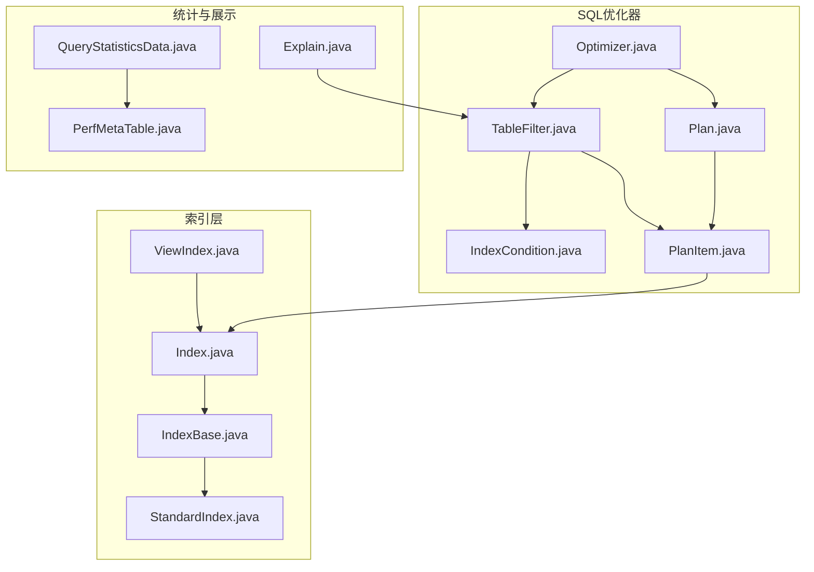
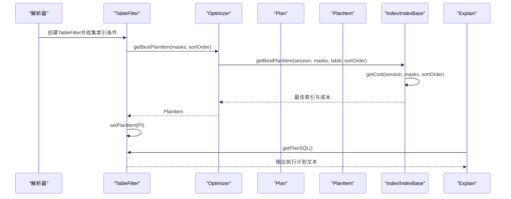
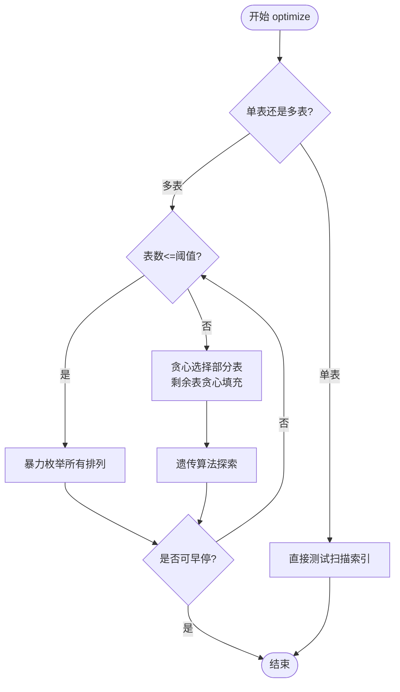
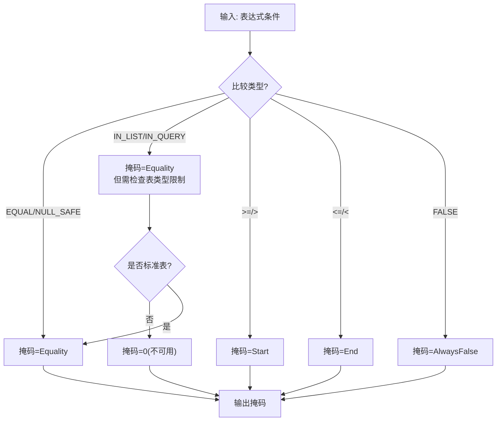
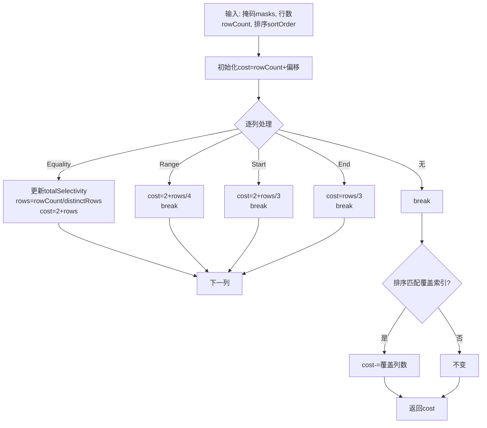
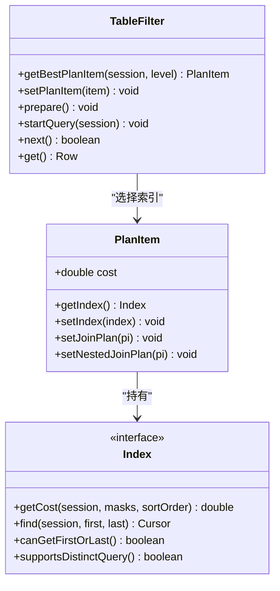
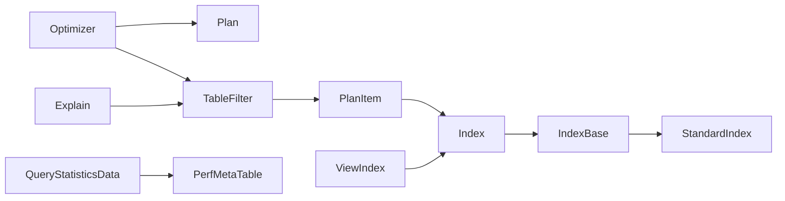

# 查询性能优化

<cite>
**本文引用的文件**
- [Optimizer.java](file://lealone-sql/src/main/java/com/lealone/sql/optimizer/Optimizer.java)
- [IndexCondition.java](file://lealone-sql/src/main/java/com/lealone/sql/optimizer/IndexCondition.java)
- [Index.java](file://lealone-db/src/main/java/com/lealone/db/index/Index.java)
- [IndexBase.java](file://lealone-db/src/main/java/com/lealone/db/index/IndexBase.java)
- [TableFilter.java](file://lealone-sql/src/main/java/com/lealone/sql/optimizer/TableFilter.java)
- [Plan.java](file://lealone-sql/src/main/java/com/lealone/sql/optimizer/Plan.java)
- [PlanItem.java](file://lealone-sql/src/main/java/com/lealone/sql/optimizer/PlanItem.java)
- [StandardIndex.java](file://lealone-db/src/main/java/com/lealone/db/index/standard/StandardIndex.java)
- [ViewIndex.java](file://lealone-db/src/main/java/com/lealone/db/index/ViewIndex.java)
- [Explain.java](file://lealone-sql/src/main/java/com/lealone/sql/dml/Explain.java)
- [QueryStatisticsData.java](file://lealone-db/src/main/java/com/lealone/db/stats/QueryStatisticsData.java)
- [PerfMetaTable.java](file://lealone-db/src/main/java/com/lealone/db/table/PerfMetaTable.java)
- [ASelectivity.java](file://lealone-sql/src/main/java/com/lealone/sql/expression/aggregate/ASelectivity.java)
</cite>

## 目录
1. [简介](#简介)
2. [项目结构](#项目结构)
3. [核心组件](#核心组件)
4. [架构总览](#架构总览)
5. [详细组件分析](#详细组件分析)
6. [依赖关系分析](#依赖关系分析)
7. [性能考量](#性能考量)
8. [故障排查指南](#故障排查指南)
9. [结论](#结论)
10. [附录](#附录)

## 简介
本文件系统性解析Lealone的查询性能优化策略，重点覆盖以下方面：
- 基于成本的查询优化：Optimizer如何在多表连接场景下搜索最优执行计划
- 索引选择策略：IndexCondition如何将WHERE条件映射为索引掩码，IndexBase如何基于掩码与选择性估算成本
- 执行计划生成：Plan与PlanItem如何组织与传播成本，TableFilter如何选择最佳索引
- 索引扫描优化：Index接口定义的扫描能力、覆盖索引与排序匹配优化
- 统计信息与查询重写：选择性与统计聚合对成本估算的影响
- 查询执行计划分析工具：EXPLAIN与性能统计元表的使用
- 常见慢查询诊断与优化建议

## 项目结构
Lealone的查询优化主要分布在SQL优化器与数据库索引层：
- SQL优化器：Optimizer、TableFilter、Plan、PlanItem、IndexCondition
- 数据库索引层：Index接口、IndexBase基础实现、StandardIndex系列、ViewIndex
- 性能统计：QueryStatisticsData、PerfMetaTable
- 计划展示：Explain

图表来源
- [Optimizer.java](file://lealone-sql/src/main/java/com/lealone/sql/optimizer/Optimizer.java#L1-L282)
- [TableFilter.java](file://lealone-sql/src/main/java/com/lealone/sql/optimizer/TableFilter.java#L1-L220)
- [Plan.java](file://lealone-sql/src/main/java/com/lealone/sql/optimizer/Plan.java#L1-L116)
- [PlanItem.java](file://lealone-sql/src/main/java/com/lealone/sql/optimizer/PlanItem.java#L1-L55)
- [IndexCondition.java](file://lealone-sql/src/main/java/com/lealone/sql/optimizer/IndexCondition.java#L1-L200)
- [Index.java](file://lealone-db/src/main/java/com/lealone/db/index/Index.java#L1-L268)
- [IndexBase.java](file://lealone-db/src/main/java/com/lealone/db/index/IndexBase.java#L210-L359)
- [StandardIndex.java](file://lealone-db/src/main/java/com/lealone/db/index/standard/StandardIndex.java#L1-L36)
- [ViewIndex.java](file://lealone-db/src/main/java/com/lealone/db/index/ViewIndex.java#L38-L119)
- [Explain.java](file://lealone-sql/src/main/java/com/lealone/sql/dml/Explain.java#L1-L125)
- [QueryStatisticsData.java](file://lealone-db/src/main/java/com/lealone/db/stats/QueryStatisticsData.java#L1-L189)
- [PerfMetaTable.java](file://lealone-db/src/main/java/com/lealone/db/table/PerfMetaTable.java#L42-L71)

章节来源
- [Optimizer.java](file://lealone-sql/src/main/java/com/lealone/sql/optimizer/Optimizer.java#L1-L282)
- [Index.java](file://lealone-db/src/main/java/com/lealone/db/index/Index.java#L1-L268)

## 核心组件
- Optimizer：负责在多表连接场景下搜索最优执行计划，采用暴力枚举、贪心与遗传算法混合策略，结合成本计算选择最佳顺序与索引
- TableFilter：代表查询中使用的每个表，维护索引条件、过滤条件、连接关系；负责根据索引条件生成掩码并调用Optimizer选择最佳PlanItem
- Plan/PlanItem：Plan保存表访问顺序与各表的PlanItem；PlanItem包含索引与成本，支持连接与嵌套连接的成本传播
- IndexCondition：将表达式条件转换为索引掩码（Equality/Start/End/Range），并判断是否可求值与恒假
- Index/IndexBase：定义索引能力与成本估算接口；IndexBase提供典型B树范围索引的成本计算逻辑，考虑选择性、覆盖索引与排序匹配
- ViewIndex：视图索引的成本缓存与参数化条件注入，避免重复计算
- Explain：输出查询执行计划文本，支持执行后统计展示
- QueryStatisticsData/PerfMetaTable：维护查询统计并导出到性能元表，辅助诊断慢查询

章节来源
- [Optimizer.java](file://lealone-sql/src/main/java/com/lealone/sql/optimizer/Optimizer.java#L1-L282)
- [TableFilter.java](file://lealone-sql/src/main/java/com/lealone/sql/optimizer/TableFilter.java#L150-L204)
- [Plan.java](file://lealone-sql/src/main/java/com/lealone/sql/optimizer/Plan.java#L82-L116)
- [PlanItem.java](file://lealone-sql/src/main/java/com/lealone/sql/optimizer/PlanItem.java#L1-L55)
- [IndexCondition.java](file://lealone-sql/src/main/java/com/lealone/sql/optimizer/IndexCondition.java#L194-L232)
- [Index.java](file://lealone-db/src/main/java/com/lealone/db/index/Index.java#L190-L201)
- [IndexBase.java](file://lealone-db/src/main/java/com/lealone/db/index/IndexBase.java#L242-L337)
- [ViewIndex.java](file://lealone-db/src/main/java/com/lealone/db/index/ViewIndex.java#L110-L299)
- [Explain.java](file://lealone-sql/src/main/java/com/lealone/sql/dml/Explain.java#L70-L124)
- [QueryStatisticsData.java](file://lealone-db/src/main/java/com/lealone/db/stats/QueryStatisticsData.java#L1-L189)
- [PerfMetaTable.java](file://lealone-db/src/main/java/com/lealone/db/table/PerfMetaTable.java#L42-L71)

## 架构总览
下面的序列图展示了从解析到执行的关键流程：解析器创建TableFilter，Optimizer计算最佳Plan，IndexBase估算成本，最终由Explain输出计划。

图表来源
- [TableFilter.java](file://lealone-sql/src/main/java/com/lealone/sql/optimizer/TableFilter.java#L155-L204)
- [Optimizer.java](file://lealone-sql/src/main/java/com/lealone/sql/optimizer/Optimizer.java#L253-L280)
- [Index.java](file://lealone-db/src/main/java/com/lealone/db/index/Index.java#L190-L201)
- [IndexBase.java](file://lealone-db/src/main/java/com/lealone/db/index/IndexBase.java#L242-L337)
- [Explain.java](file://lealone-sql/src/main/java/com/lealone/sql/dml/Explain.java#L70-L124)

## 详细组件分析

### Optimizer：基于成本的查询优化
- 多表连接优化：当仅一张表时直接测试；多表时根据表数量选择暴力枚举、贪心填充剩余表或遗传算法探索
- 成本计算：Plan.calculateCost按表顺序累乘成本，确保连接顺序对整体成本有显著影响
- 索引选择：Optimizer.getBestPlanItem遍历所有可用索引，选择最小成本索引作为PlanItem
- 早停策略：canStop根据时间与当前成本动态决定是否提前终止

图表来源
- [Optimizer.java](file://lealone-sql/src/main/java/com/lealone/sql/optimizer/Optimizer.java#L67-L191)
- [Plan.java](file://lealone-sql/src/main/java/com/lealone/sql/optimizer/Plan.java#L88-L110)

章节来源
- [Optimizer.java](file://lealone-sql/src/main/java/com/lealone/sql/optimizer/Optimizer.java#L67-L191)
- [Plan.java](file://lealone-sql/src/main/java/com/lealone/sql/optimizer/Plan.java#L82-L116)

### IndexCondition：条件到索引掩码的映射
- 条件类型到掩码：EQUAL/IN_LIST/IN_QUERY映射为Equality；>=/>映射为Start；<=/<映射为End；FALSE映射为AlwaysFalse
- 可求值性与恒假：isEvaluatable用于提前剪枝；isAlwaysFalse用于快速短路
- IN子句限制：在非标准表（如视图）上与其他条件组合时，IN可能被降级为不可用

图表来源
- [IndexCondition.java](file://lealone-sql/src/main/java/com/lealone/sql/optimizer/IndexCondition.java#L194-L232)

章节来源
- [IndexCondition.java](file://lealone-sql/src/main/java/com/lealone/sql/optimizer/IndexCondition.java#L194-L232)

### Index与IndexBase：成本估算与扫描能力
- 成本估算：Index.getCost接收每列掩码与排序信息，返回估算成本
- B树范围成本：IndexBase.getCostRangeIndex综合Equality、Range、Start、End与选择性，优先Equality降低rows，唯一索引在末列Equality时可快速收敛
- 覆盖索引与排序匹配：若索引列与排序完全匹配，进一步降低成本
- 扫描能力：IndexBase提供canGetFirstOrLast、canScan、supportsDistinctQuery等能力，配合具体索引实现

图表来源
- [IndexBase.java](file://lealone-db/src/main/java/com/lealone/db/index/IndexBase.java#L242-L337)
- [Index.java](file://lealone-db/src/main/java/com/lealone/db/index/Index.java#L190-L201)

章节来源
- [IndexBase.java](file://lealone-db/src/main/java/com/lealone/db/index/IndexBase.java#L242-L337)
- [Index.java](file://lealone-db/src/main/java/com/lealone/db/index/Index.java#L190-L201)

### TableFilter：索引选择与执行计划传播
- 掩码生成：将IndexCondition集合合并为每列掩码，支持多条件在同一列的合并
- 成本折扣：索引条件越多的表越靠前，减少无索引连接的开销
- 连接成本传播：PlanItem支持嵌套连接与连接计划的成本叠加
- 执行：IndexCursor根据索引条件定位首尾SearchRow，迭代满足条件的行

图表来源
- [TableFilter.java](file://lealone-sql/src/main/java/com/lealone/sql/optimizer/TableFilter.java#L155-L204)
- [PlanItem.java](file://lealone-sql/src/main/java/com/lealone/sql/optimizer/PlanItem.java#L1-L55)
- [Index.java](file://lealone-db/src/main/java/com/lealone/db/index/Index.java#L190-L201)

章节来源
- [TableFilter.java](file://lealone-sql/src/main/java/com/lealone/sql/optimizer/TableFilter.java#L155-L204)
- [PlanItem.java](file://lealone-sql/src/main/java/com/lealone/sql/optimizer/PlanItem.java#L1-L55)

### 视图索引与成本缓存：ViewIndex
- 递归保护：递归视图直接返回较高成本，避免无限展开
- 成本缓存：基于掩码的LRU缓存，减少重复计算
- 参数化条件：根据掩码向子查询注入全局条件，提高可复用性

章节来源
- [ViewIndex.java](file://lealone-db/src/main/java/com/lealone/db/index/ViewIndex.java#L110-L299)

### 标准索引与扫描优化：StandardIndex
- 能力：canGetFirstOrLast为true，便于快速定位边界
- 光标：内部光标抽象，便于扩展不同存储引擎的扫描实现

章节来源
- [StandardIndex.java](file://lealone-db/src/main/java/com/lealone/db/index/standard/StandardIndex.java#L1-L36)

### 查询执行计划分析工具：Explain
- 计划输出：getPlanSQL输出表名、索引与过滤条件摘要
- 执行统计：可选执行命令并输出统计占比，辅助定位热点

章节来源
- [Explain.java](file://lealone-sql/src/main/java/com/lealone/sql/dml/Explain.java#L70-L124)
- [TableFilter.java](file://lealone-sql/src/main/java/com/lealone/sql/optimizer/TableFilter.java#L574-L653)

### 统计信息与选择性：QueryStatisticsData与ASelectivity
- 查询统计：QueryStatisticsData维护执行次数、耗时、行数均值与方差，PerfMetaTable导出到元表
- 选择性：ASelectivity计算表达式的去重比例，作为索引选择的重要参考

章节来源
- [QueryStatisticsData.java](file://lealone-db/src/main/java/com/lealone/db/stats/QueryStatisticsData.java#L1-L189)
- [PerfMetaTable.java](file://lealone-db/src/main/java/com/lealone/db/table/PerfMetaTable.java#L42-L71)
- [ASelectivity.java](file://lealone-sql/src/main/java/com/lealone/sql/expression/aggregate/ASelectivity.java#L1-L82)

## 依赖关系分析
- Optimizer依赖Plan、TableFilter、Index（通过PlanItem）
- TableFilter依赖IndexCondition、Index、IndexCursor
- IndexBase实现Index接口，提供通用成本估算
- ViewIndex实现Index，扩展视图成本缓存与参数化条件
- Explain依赖StatementBase输出计划文本
- 统计模块与元表相互配合，提供运行时洞察

图表来源
- [Optimizer.java](file://lealone-sql/src/main/java/com/lealone/sql/optimizer/Optimizer.java#L1-L282)
- [TableFilter.java](file://lealone-sql/src/main/java/com/lealone/sql/optimizer/TableFilter.java#L1-L220)
- [Plan.java](file://lealone-sql/src/main/java/com/lealone/sql/optimizer/Plan.java#L1-L116)
- [PlanItem.java](file://lealone-sql/src/main/java/com/lealone/sql/optimizer/PlanItem.java#L1-L55)
- [Index.java](file://lealone-db/src/main/java/com/lealone/db/index/Index.java#L1-L268)
- [IndexBase.java](file://lealone-db/src/main/java/com/lealone/db/index/IndexBase.java#L210-L359)
- [StandardIndex.java](file://lealone-db/src/main/java/com/lealone/db/index/standard/StandardIndex.java#L1-L36)
- [ViewIndex.java](file://lealone-db/src/main/java/com/lealone/db/index/ViewIndex.java#L38-L119)
- [Explain.java](file://lealone-sql/src/main/java/com/lealone/sql/dml/Explain.java#L1-L125)
- [QueryStatisticsData.java](file://lealone-db/src/main/java/com/lealone/db/stats/QueryStatisticsData.java#L1-L189)
- [PerfMetaTable.java](file://lealone-db/src/main/java/com/lealone/db/table/PerfMetaTable.java#L42-L71)

## 性能考量
- 成本模型权重：IndexBase的成本计算优先Equality，其次Range/Start/End，最后无条件；唯一索引在末列Equality时成本极低
- 排序匹配：索引列与排序完全一致时进一步降低成本
- 覆盖索引：索引覆盖越多，成本越低
- 早停与启发式：Optimizer在多表场景采用暴力+贪心+遗传混合策略，并设置时间阈值早停
- 视图成本缓存：ViewIndex对相同掩码的结果进行缓存，避免重复计算
- 统计驱动：选择性与统计信息直接影响成本估算，应定期收集与更新

[本节为通用指导，无需列出章节来源]

## 故障排查指南
- 使用EXPLAIN查看执行计划：确认是否选择了预期索引、是否存在全表扫描
- 关注索引条件：检查WHERE中是否有可转化为Equality的条件，避免Start/End导致范围扩大
- 观察统计信息：通过性能元表识别慢查询与高耗时语句，结合执行次数与行数变化定位问题
- 视图递归：递归视图可能导致高成本，应避免深度递归或改写为物化路径
- 连接顺序：多表连接时，尽量让有强过滤条件的表先执行，减少后续连接数据量

章节来源
- [Explain.java](file://lealone-sql/src/main/java/com/lealone/sql/dml/Explain.java#L70-L124)
- [PerfMetaTable.java](file://lealone-db/src/main/java/com/lealone/db/table/PerfMetaTable.java#L42-L71)
- [ViewIndex.java](file://lealone-db/src/main/java/com/lealone/db/index/ViewIndex.java#L110-L140)

## 结论
Lealone的查询优化以“基于成本的索引选择”为核心，通过IndexCondition将WHERE条件映射为掩码，结合IndexBase的成本估算与Optimizer的多策略搜索，形成稳定的执行计划生成机制。配合Explain与统计模块，可有效诊断与优化慢查询。实践中应重视索引设计（选择性、覆盖、排序匹配）、查询重写（将范围转Equality）与统计信息维护，以获得持续稳定的查询性能。

[本节为总结，无需列出章节来源]

## 附录

### 常见慢查询诊断与优化清单
- 症状：全表扫描频繁
  - 优化：为过滤列建立合适的单列或复合索引；优先Equality条件
- 症状：范围扫描过大
  - 优化：拆分查询条件，增加Equality过滤；调整索引列顺序
- 症状：连接顺序不当
  - 优化：利用EXPLAIN确认连接顺序；将强过滤表置于前部
- 症状：视图递归导致高成本
  - 优化：避免深度递归；改写为物化路径或物化表
- 症状：统计信息陈旧
  - 优化：定期收集统计信息；关注选择性变化

[本节为通用指导，无需列出章节来源]