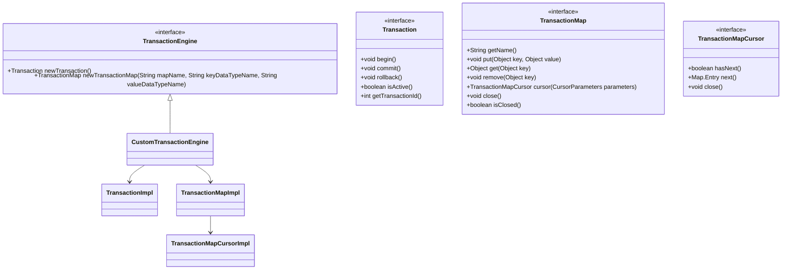

# 插件系统

<cite>
**本文档中引用的文件**  
- [PluggableEngine.java](https://github.com/lealone/Lealone/blob/master/lealone-sci/src/main/java/com/lealone/db/plugin/PluggableEngine.java)
- [PluginManager.java](https://github.com/lealone/Lealone/blob/master/lealone-common/src/main/java/com/lealone/db/plugin/PluginManager.java)
- [Plugin.java](https://github.com/lealone/Lealone/blob/master/lealone-common/src/main/java/com/lealone/db/plugin/Plugin.java)
- [PluginBase.java](https://github.com/lealone/Lealone/blob/master/lealone-common/src/main/java/com/lealone/db/plugin/PluginBase.java)
- [PluginObject.java](https://github.com/lealone/Lealone/blob/master/lealone-db/src/main/java/com/lealone/db/plugin/PluginObject.java)
- [CreatePlugin.java](https://github.com/lealone/Lealone/blob/master/lealone-sql/src/main/java/com/lealone/sql/admin/CreatePlugin.java)
- [StartPlugin.java](https://github.com/lealone/Lealone/blob/master/lealone-sql/src/main/java/com/lealone/sql/admin/StartPlugin.java)
- [StorageEngine.java](https://github.com/lealone/Lealone/blob/master/lealone-sci/src/main/java/com/lealone/storage/StorageEngine.java)
- [AOStorageEngine.java](https://github.com/lealone/Lealone/blob/master/lealone-aose/src/main/java/com/lealone/storage/aose/AOStorageEngine.java)
- [PluginTest.java](https://github.com/lealone/Lealone/blob/master/lealone-test/src/test/java/com/lealone/test/sql/plugin/PluginTest.java)
</cite>

## 目录
1. [引言](#引言)
2. [插件系统架构](#插件系统架构)
3. [核心组件分析](#核心组件分析)
4. [插件生命周期管理](#插件生命周期管理)
5. [自定义插件开发指南](#自定义插件开发指南)
6. [插件配置与加载机制](#插件配置与加载机制)
7. [插件注册与发现机制](#插件注册与发现机制)
8. [完整插件开发示例](#完整插件开发示例)
9. [高级扩展场景](#高级扩展场景)
10. [故障排除指南](#故障排除指南)

## 引言
Lealone数据库系统采用高度模块化的插件架构，允许开发者通过插件机制扩展数据库的核心功能。本技术文档深入解析Lealone插件系统的实现原理，重点分析PluggableEngine.java和PluginManager.java的源码实现。文档详细说明如何开发自定义的存储引擎、事务引擎、SQL引擎或协议服务器插件，包括必须实现的接口和生命周期方法。通过本指南，高级开发者将能够全面掌握Lealone插件系统的扩展能力，为数据库功能的定制化开发提供详尽的技术指导。

## 插件系统架构


**图示来源**
- [PluggableEngine.java](https://github.com/lealone/Lealone/blob/master/lealone-sci/src/main/java/com/lealone/db/plugin/PluggableEngine.java)
- [PluginManager.java](https://github.com/lealone/Lealone/blob/master/lealone-common/src/main/java/com/lealone/db/plugin/PluginManager.java)
- [StorageEngine.java](https://github.com/lealone/Lealone/blob/master/lealone-sci/src/main/java/com/lealone/storage/StorageEngine.java)

**本节来源**
- [PluggableEngine.java](https://github.com/lealone/Lealone/blob/master/lealone-sci/src/main/java/com/lealone/db/plugin/PluggableEngine.java)
- [PluginManager.java](https://github.com/lealone/Lealone/blob/master/lealone-common/src/main/java/com/lealone/db/plugin/PluginManager.java)

## 核心组件分析

### 插件接口体系
Lealone插件系统基于Java的接口和抽象类构建了一套完整的插件接口体系。核心接口包括Plugin接口和PluggableEngine接口，其中PluggableEngine接口扩展了Plugin接口，作为四大引擎（存储引擎、事务引擎、SQL引擎、协议服务器引擎）的标记接口。

```mermaid
classDiagram
class Plugin {
<<interface>>
+String getName()
+Map<String, String> getConfig()
+void init(Map<String, String> config)
+void close()
+void start()
+void stop()
+boolean isInited()
+boolean isStarted()
+boolean isStopped()
+State getState()
+enum State { NONE, INITED, STARTED, STOPPED }
}
class PluggableEngine {
<<interface>>
+<PE extends PluggableEngine> PE getEngine(Class<PE> engineClass, String engineName)
+<PE extends PluggableEngine> String getEngineType(Class<PE> engineClass)
}
class PluginBase {
<<abstract>>
-String name
-Map<String, String> config
-State state
+PluginBase()
+PluginBase(String name)
+String getName()
+void setName(String name)
+Map<String, String> getConfig()
+boolean isInited()
+boolean isStarted()
+boolean isStopped()
+synchronized void init(Map<String, String> config)
+synchronized void close()
+void start()
+void stop()
+State getState()
+Class<? extends Plugin> getPluginClass()
}
Plugin <|-- PluggableEngine
Plugin <|-- PluginBase
PluggableEngine <|-- StorageEngine
PluggableEngine <|-- TransactionEngine
PluggableEngine <|-- SQLEngine
PluggableEngine <|-- ProtocolServerEngine
class StorageEngine {
<<interface>>
+StorageBuilder getStorageBuilder()
+LobStorage getLobStorage(DataHandler dataHandler, Storage storage)
+static StorageEngine getDefaultStorageEngine()
}
class TransactionEngine {
<<interface>>
+Transaction newTransaction()
+TransactionMap newTransactionMap(String mapName, String keyDataTypeName, String valueDataTypeName)
}
class SQLEngine {
<<interface>>
+SQLParser createSQLParser()
+PreparedSQLStatement prepareSQLStatement(String sql)
}
class ProtocolServerEngine {
<<interface>>
+ProtocolServer createProtocolServer()
+String[] getSupportedProtocolTypes()
}
```

**图示来源**
- [Plugin.java](https://github.com/lealone/Lealone/blob/master/lealone-common/src/main/java/com/lealone/db/plugin/Plugin.java)
- [PluggableEngine.java](https://github.com/lealone/Lealone/blob/master/lealone-sci/src/main/java/com/lealone/db/plugin/PluggableEngine.java)
- [PluginBase.java](https://github.com/lealone/Lealone/blob/master/lealone-common/src/main/java/com/lealone/db/plugin/PluginBase.java)
- [StorageEngine.java](https://github.com/lealone/Lealone/blob/master/lealone-sci/src/main/java/com/lealone/storage/StorageEngine.java)

**本节来源**
- [Plugin.java](https://github.com/lealone/Lealone/blob/master/lealone-common/src/main/java/com/lealone/db/plugin/Plugin.java)
- [PluggableEngine.java](https://github.com/lealone/Lealone/blob/master/lealone-sci/src/main/java/com/lealone/db/plugin/PluggableEngine.java)
- [PluginBase.java](https://github.com/lealone/Lealone/blob/master/lealone-common/src/main/java/com/lealone/db/plugin/PluginBase.java)

### 插件管理器实现
PluginManager类是Lealone插件系统的核心管理组件，负责插件的注册、发现和生命周期管理。它采用单例模式和线程安全的设计，确保在多线程环境下插件管理的正确性。


**图示来源**
- [PluginManager.java](https://github.com/lealone/Lealone/blob/master/lealone-common/src/main/java/com/lealone/db/plugin/PluginManager.java)
- [PluginObject.java](https://github.com/lealone/Lealone/blob/master/lealone-db/src/main/java/com/lealone/db/plugin/PluginObject.java)

**本节来源**
- [PluginManager.java](https://github.com/lealone/Lealone/blob/master/lealone-common/src/main/java/com/lealone/db/plugin/PluginManager.java)
- [PluginObject.java](https://github.com/lealone/Lealone/blob/master/lealone-db/src/main/java/com/lealone/db/plugin/PluginObject.java)

## 插件生命周期管理

### 插件生命周期状态机
Lealone插件系统定义了清晰的生命周期状态机，确保插件在不同状态间的正确转换。插件状态包括NONE、INITED、STARTED和STOPPED四种，通过状态机严格控制插件的初始化、启动、停止和关闭过程。


**图示来源**
- [Plugin.java](https://github.com/lealone/Lealone/blob/master/lealone-common/src/main/java/com/lealone/db/plugin/Plugin.java)
- [PluginBase.java](https://github.com/lealone/Lealone/blob/master/lealone-common/src/main/java/com/lealone/db/plugin/PluginBase.java)

**本节来源**
- [Plugin.java](https://github.com/lealone/Lealone/blob/master/lealone-common/src/main/java/com/lealone/db/plugin/Plugin.java)
- [PluginBase.java](https://github.com/lealone/Lealone/blob/master/lealone-common/src/main/java/com/lealone/db/plugin/PluginBase.java)

### 插件生命周期操作流程
Lealone通过SQL命令实现插件的全生命周期管理，包括创建、启动、停止和删除操作。这些操作通过相应的SQL语句触发，由数据库内核调用插件管理器完成具体操作。


**图示来源**
- [CreatePlugin.java](https://github.com/lealone/Lealone/blob/master/lealone-sql/src/main/java/com/lealone/sql/admin/CreatePlugin.java)
- [StartPlugin.java](https://github.com/lealone/Lealone/blob/master/lealone-sql/src/main/java/com/lealone/sql/admin/StartPlugin.java)
- [PluginObject.java](https://github.com/lealone/Lealone/blob/master/lealone-db/src/main/java/com/lealone/db/plugin/PluginObject.java)

**本节来源**
- [CreatePlugin.java](https://github.com/lealone/Lealone/blob/master/lealone-sql/src/main/java/com/lealone/sql/admin/CreatePlugin.java)
- [StartPlugin.java](https://github.com/lealone/Lealone/blob/master/lealone-sql/src/main/java/com/lealone/sql/admin/StartPlugin.java)
- [PluginObject.java](https://github.com/lealone/Lealone/blob/master/lealone-db/src/main/java/com/lealone/db/plugin/PluginObject.java)

## 自定义插件开发指南

### 存储引擎插件开发
开发自定义存储引擎需要实现StorageEngine接口，该接口定义了存储引擎的核心功能，包括存储构建器和LOB存储的创建。


**本节来源**
- [StorageEngine.java](https://github.com/lealone/Lealone/blob/master/lealone-sci/src/main/java/com/lealone/storage/StorageEngine.java)
- [AOStorageEngine.java](https://github.com/lealone/Lealone/blob/master/lealone-aose/src/main/java/com/lealone/storage/aose/AOStorageEngine.java)

### 事务引擎插件开发
事务引擎插件需要实现TransactionEngine接口，提供事务管理和事务映射的创建功能。



**本节来源**
- [TransactionEngine.java](https://github.com/lealone/Lealone/blob/master/lealone-sci/src/main/java/com/lealone/transaction/TransactionEngine.java)

### SQL引擎插件开发
SQL引擎插件需要实现SQLEngine接口，提供SQL解析和预编译语句的创建功能。


**本节来源**
- [SQLEngine.java](https://github.com/lealone/Lealone/blob/master/lealone-sci/src/main/java/com/lealone/sql/SQLEngine.java)

### 协议服务器插件开发
协议服务器插件需要实现ProtocolServerEngine接口，提供协议服务器的创建和支持的协议类型。


**本节来源**
- [ProtocolServerEngine.java](https://github.com/lealone/Lealone/blob/master/lealone-sci/src/main/java/com/lealone/server/ProtocolServerEngine.java)

## 插件配置与加载机制

### 插件配置机制
Lealone插件系统支持灵活的配置机制，允许通过CREATE PLUGIN语句的PARAMETERS子句传递配置参数。


**本节来源**
- [CreatePlugin.java](https://github.com/lealone/Lealone/blob/master/lealone-sql/src/main/java/com/lealone/sql/admin/CreatePlugin.java)
- [PluginBase.java](https://github.com/lealone/Lealone/blob/master/lealone-common/src/main/java/com/lealone/db/plugin/PluginBase.java)

### 插件加载机制
Lealone使用Java的ServiceLoader机制实现插件的自动发现和加载，同时支持通过CLASS PATH子句指定外部JAR包中的插件。


**本节来源**
- [PluginManager.java](https://github.com/lealone/Lealone/blob/master/lealone-common/src/main/java/com/lealone/db/plugin/PluginManager.java)

## 插件注册与发现机制

### 插件注册机制
Lealone插件系统采用基于类的注册机制，支持通过插件类和插件名称的双重键值进行注册和查找。

```mermaid
classDiagram
class PluginRegistry {
-Map<Class<?>, PluginManager<?>> instances
+<P extends Plugin> PluginManager<P> getInstance(Class<P> pluginClass)
+<P extends Plugin> PluginManager<P> getInstance(P plugin)
}
class PluginManager~T~ {
-Class<T> pluginClass
-Map<String, T> plugins
+void registerPlugin(T plugin, String... alias)
+void deregisterPlugin(T plugin, String... alias)
+T getPlugin(String name)
}
PluginRegistry --> PluginManager~T~
PluginManager~T~ --> PluginRegistry
note right of PluginRegistry
单例注册中心，管理所有PluginManager实例
使用ConcurrentHashMap确保线程安全
end note
note right of PluginManager~T~
特定类型插件的管理器
使用ConcurrentHashMap存储插件实例
插件名称不区分大小写
end note
```

**本节来源**
- [PluginManager.java](https://github.com/lealone/Lealone/blob/master/lealone-common/src/main/java/com/lealone/db/plugin/PluginManager.java)

### 插件发现机制
插件发现机制结合了ServiceLoader自动发现和动态注册两种方式，提供了灵活的插件管理能力。


**本节来源**
- [PluginManager.java](https://github.com/lealone/Lealone/blob/master/lealone-common/src/main/java/com/lealone/db/plugin/PluginManager.java)

## 完整插件开发示例

### 自定义存储引擎插件
以下是一个完整的自定义存储引擎插件开发示例，展示了从接口实现到注册的全过程。


**本节来源**
- [AOStorageEngine.java](https://github.com/lealone/Lealone/blob/master/lealone-aose/src/main/java/com/lealone/storage/aose/AOStorageEngine.java)
- [PluginTest.java](https://github.com/lealone/Lealone/blob/master/lealone-test/src/test/java/com/lealone/test/sql/plugin/PluginTest.java)

### 插件部署与测试
插件部署和测试流程包括创建、启动、使用和清理等步骤。


**本节来源**
- [PluginTest.java](https://github.com/lealone/Lealone/blob/master/lealone-test/src/test/java/com/lealone/test/sql/plugin/PluginTest.java)

## 高级扩展场景

### 多引擎协同工作
Lealone插件系统支持多个引擎协同工作，实现复杂的功能扩展。

```mermaid
graph TD
subgraph "核心引擎"
SQL[SQLEngine]
Transaction[TransactionEngine]
Storage[StorageEngine]
Protocol[ProtocolServerEngine]
end
subgraph "扩展功能"
Cache[缓存引擎]
Search[搜索引擎]
Analytics[分析引擎]
Security[安全引擎]
end
SQL --> Transaction
Transaction --> Storage
Protocol --> SQL
Cache --> Storage
Search --> Storage
Analytics --> Storage
Security --> SQL
Security --> Transaction
Security --> Storage
Security --> Protocol
style SQL fill:#f96,stroke:#333
style Transaction fill:#f96,stroke:#333
style Storage fill:#f96,stroke:#333
style Protocol fill:#f96,stroke:#333
style Cache fill:#6f9,stroke:#333
style Search fill:#6f9,stroke:#333
style Analytics fill:#6f9,stroke:#333
style Security fill:#6f9,stroke:#333
note right of SQL
负责SQL语句的解析和执行
与事务引擎协同管理事务
end note
note right of Transaction
负责事务的创建和管理
确保数据的一致性和隔离性
end note
note right of Storage
负责数据的持久化存储
提供高效的数据访问接口
end note
note right of Protocol
负责网络协议的处理
支持多种客户端连接方式
end note
note right of Cache
提供数据缓存功能
加速热点数据的访问
end note
note right of Search
提供全文搜索功能
支持复杂的查询需求
end note
note right of Analytics
提供数据分析功能
支持实时统计和报表
end note
note right of Security
提供安全控制功能
包括认证、授权和加密
end note
```

**本节来源**
- [PluggableEngine.java](https://github.com/lealone/Lealone/blob/master/lealone-sci/src/main/java/com/lealone/db/plugin/PluggableEngine.java)
- [PluginManager.java](https://github.com/lealone/Lealone/blob/master/lealone-common/src/main/java/com/lealone/db/plugin/PluginManager.java)

### 插件热部署
Lealone支持插件的热部署，允许在不重启数据库的情况下动态加载和卸载插件。


**本节来源**
- [PluginManager.java](https://github.com/lealone/Lealone/blob/master/lealone-common/src/main/java/com/lealone/db/plugin/PluginManager.java)
- [PluginObject.java](https://github.com/lealone/Lealone/blob/master/lealone-db/src/main/java/com/lealone/db/plugin/PluginObject.java)

## 故障排除指南

### 常见问题及解决方案
本节列出插件开发和使用过程中可能遇到的常见问题及其解决方案。


**本节来源**
- [PluginManager.java](https://github.com/lealone/Lealone/blob/master/lealone-common/src/main/java/com/lealone/db/plugin/PluginManager.java)
- [PluginBase.java](https://github.com/lealone/Lealone/blob/master/lealone-common/src/main/java/com/lealone/db/plugin/PluginBase.java)

### 调试技巧
提供插件调试的有效技巧和方法。


**本节来源**
- [PluginBase.java](https://github.com/lealone/Lealone/blob/master/lealone-common/src/main/java/com/lealone/db/plugin/PluginBase.java)
- [PluginManager.java](https://github.com/lealone/Lealone/blob/master/lealone-common/src/main/java/com/lealone/db/plugin/PluginManager.java)