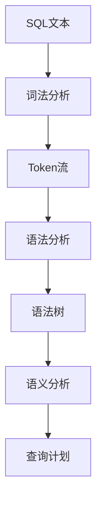
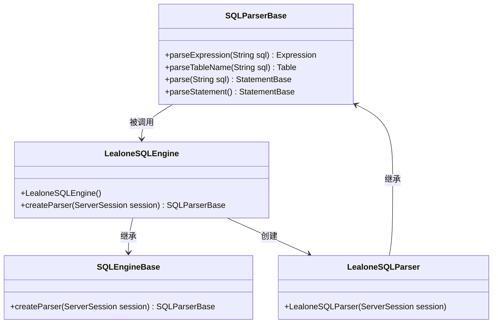
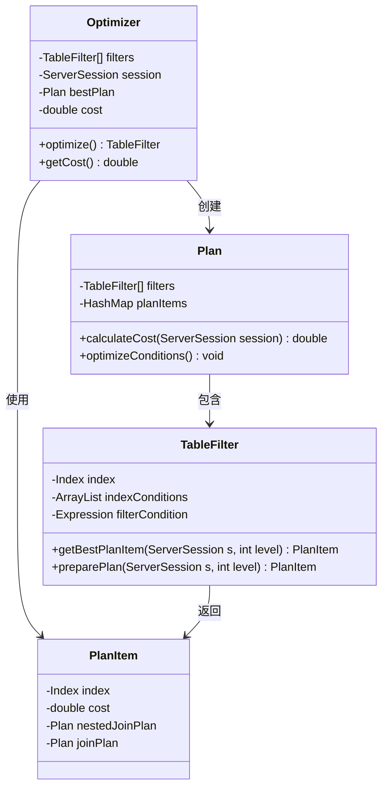
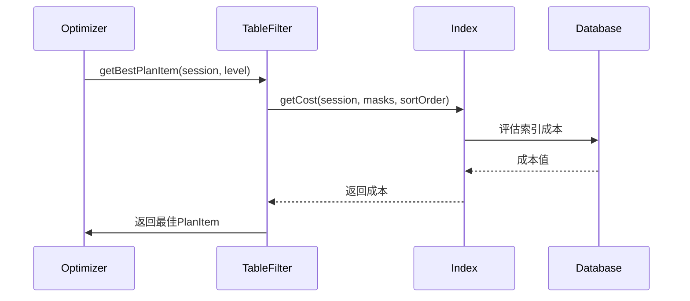
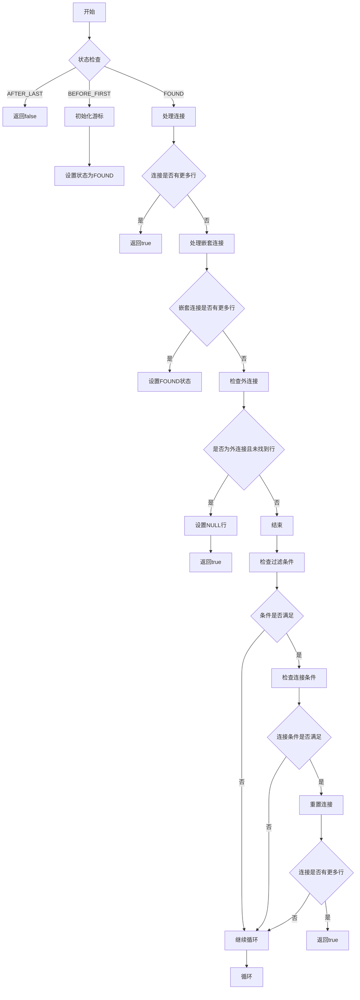
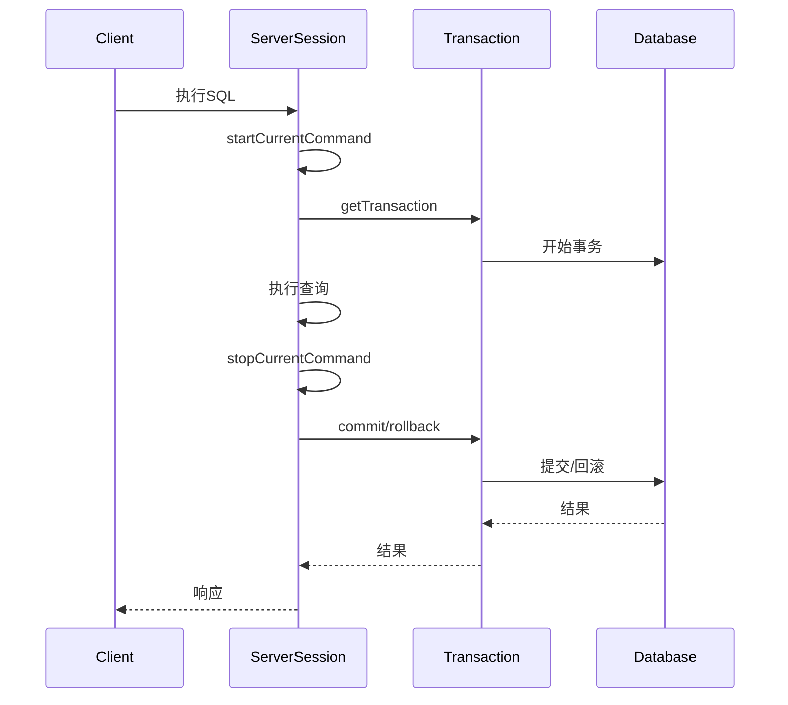
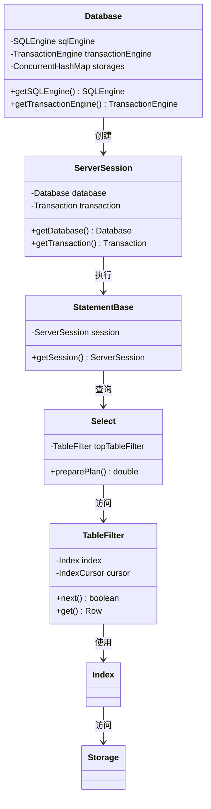
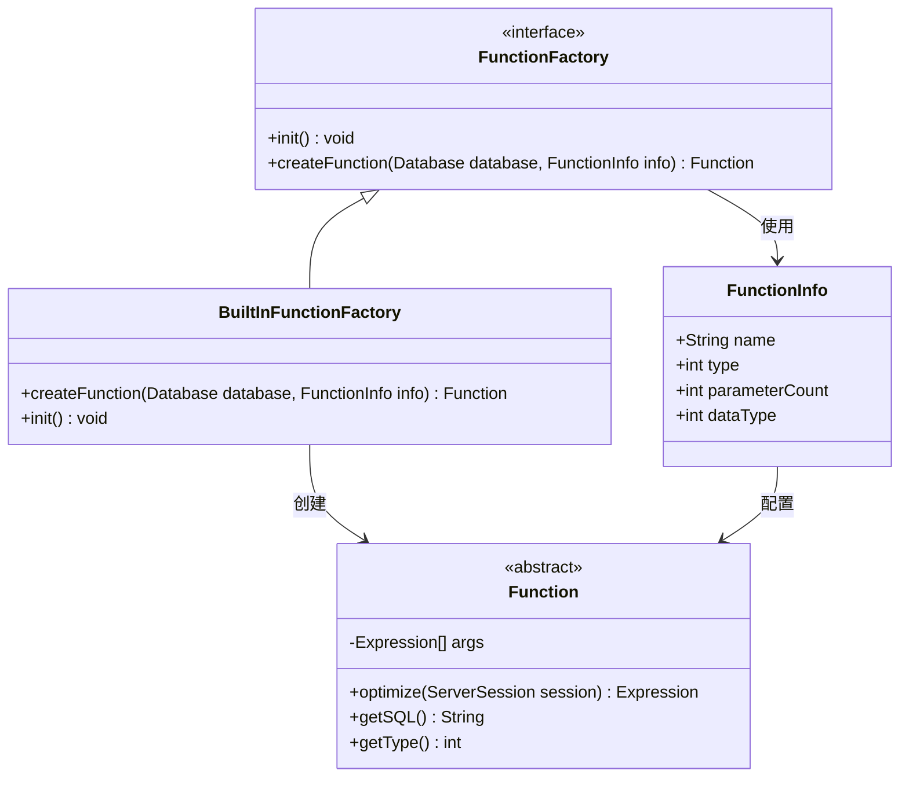

# SQL引擎架构


**本文档引用的文件**   
- [LealoneSQLParser.java](https://github.com/lealone/Lealone/blob/master/lealone-sql/src/main/java/com/lealone/sql/LealoneSQLParser.java)
- [SQLParserBase.java](https://github.com/lealone/Lealone/blob/master/lealone-sql/src/main/java/com/lealone/sql/SQLParserBase.java)
- [LealoneSQLEngine.java](https://github.com/lealone/Lealone/blob/master/lealone-sql/src/main/java/com/lealone/sql/LealoneSQLEngine.java)
- [SQLEngineBase.java](https://github.com/lealone/Lealone/blob/master/lealone-sql/src/main/java/com/lealone/sql/SQLEngineBase.java)
- [Optimizer.java](https://github.com/lealone/Lealone/blob/master/lealone-sql/src/main/java/com/lealone/sql/optimizer/Optimizer.java)
- [TableFilter.java](https://github.com/lealone/Lealone/blob/master/lealone-sql/src/main/java/com/lealone/sql/optimizer/TableFilter.java)
- [Select.java](https://github.com/lealone/Lealone/blob/master/lealone-sql/src/main/java/com/lealone/sql/query/Select.java)
- [YieldableBase.java](https://github.com/lealone/Lealone/blob/master/lealone-sql/src/main/java/com/lealone/sql/executor/YieldableBase.java)
- [YieldableSelect.java](https://github.com/lealone/Lealone/blob/master/lealone-sql/src/main/java/com/lealone/sql/query/YieldableSelect.java)
- [Database.java](https://github.com/lealone/Lealone/blob/master/lealone-db/src/main/java/com/lealone/db/Database.java)
- [ServerSession.java](https://github.com/lealone/Lealone/blob/master/lealone-db/src/main/java/com/lealone/db/session/ServerSession.java)
- [StatementBase.java](https://github.com/lealone/Lealone/blob/master/lealone-sql/src/main/java/com/lealone/sql/StatementBase.java)
- [Function.java](https://github.com/lealone/Lealone/blob/master/lealone-sql/src/main/java/com/lealone/sql/expression/function/Function.java)
- [BuiltInFunctionFactory.java](https://github.com/lealone/Lealone/blob/master/lealone-sql/src/main/java/com/lealone/sql/expression/function/BuiltInFunctionFactory.java)


## 目录
1. [引言](#引言)
2. [SQL解析流程](#sql解析流程)
3. [查询优化器](#查询优化器)
4. [渐进式查询执行](#渐进式查询执行)
5. [与事务和存储引擎的协同](#与事务和存储引擎的协同)
6. [扩展开发指南](#扩展开发指南)
7. [结论](#结论)

## 引言

Lealone SQL引擎是数据库系统的核心组件，负责处理SQL语句的解析、优化和执行。该引擎采用分层架构设计，从词法分析到物理执行，每个阶段都有明确的职责划分。SQL引擎通过`LealoneSQLEngine`和`LealoneSQLParser`类提供SQL处理能力，支持标准SQL语法和自定义扩展。引擎的设计注重性能和可扩展性，通过优化器生成高效的执行计划，并利用渐进式执行机制支持长时间运行的查询。

**Section sources**
- [LealoneSQLEngine.java](https://github.com/lealone/Lealone/blob/master/lealone-sql/src/main/java/com/lealone/sql/LealoneSQLEngine.java#L1-L27)
- [LealoneSQLParser.java](https://github.com/lealone/Lealone/blob/master/lealone-sql/src/main/java/com/lealone/sql/LealoneSQLParser.java#L1-L15)

## SQL解析流程

SQL解析是SQL引擎的第一步，负责将SQL文本转换为内部表示的语法树。解析过程分为词法分析、语法分析和语义分析三个阶段。

### 词法分析

词法分析器将SQL语句分解为基本的词法单元（token），包括关键字、标识符、参数、值和特殊符号。`SQLParserBase`类中的`characterTypes`数组用于标识每个字符的类型，支持多种字符类型如普通字符、引号字符串、美元引号字符串等。词法分析器处理标准SQL语法，包括大小写不敏感的标识符处理和多种字符串引号方式。



**Diagram sources**
- [SQLParserBase.java](https://github.com/lealone/Lealone/blob/master/lealone-sql/src/main/java/com/lealone/sql/SQLParserBase.java#L189-L197)

### 语法分析

语法分析器根据SQL语法规则将Token流转换为抽象语法树（AST）。`SQLParserBase`类实现了递归下降解析器，通过`parseStatement`方法识别不同类型的SQL语句。解析器支持完整的SQL语句集，包括DDL、DML和事务控制语句。对于SELECT语句，解析器构建`Select`对象，包含表、列、条件、排序等信息。



**Diagram sources**
- [LealoneSQLEngine.java](https://github.com/lealone/Lealone/blob/master/lealone-sql/src/main/java/com/lealone/sql/LealoneSQLEngine.java#L11-L26)
- [LealoneSQLParser.java](https://github.com/lealone/Lealone/blob/master/lealone-sql/src/main/java/com/lealone/sql/LealoneSQLParser.java#L10-L14)
- [SQLParserBase.java](https://github.com/lealone/Lealone/blob/master/lealone-sql/src/main/java/com/lealone/sql/SQLParserBase.java#L279-L311)

### 语义分析

语义分析器验证SQL语句的语义正确性，包括表和列的存在性、数据类型兼容性、权限检查等。`TableFilter`类在语义分析阶段解析表引用，建立表与查询的关联。分析器还处理别名、自然连接等复杂语义，并为后续的优化阶段准备信息。

**Section sources**
- [SQLParserBase.java](https://github.com/lealone/Lealone/blob/master/lealone-sql/src/main/java/com/lealone/sql/SQLParserBase.java#L235-L311)
- [TableFilter.java](https://github.com/lealone/Lealone/blob/master/lealone-sql/src/main/java/com/lealone/sql/optimizer/TableFilter.java#L122-L133)

## 查询优化器

查询优化器负责生成最优的查询执行计划，通过索引选择、连接顺序优化等策略提高查询性能。

### 优化器架构

`Optimizer`类是查询优化的核心，采用基于成本的优化策略。优化器评估不同的执行计划，选择成本最低的方案。对于单表查询，优化器选择最佳索引；对于多表连接，优化器确定最优的连接顺序。



**Diagram sources**
- [Optimizer.java](https://github.com/lealone/Lealone/blob/master/lealone-sql/src/main/java/com/lealone/sql/optimizer/Optimizer.java#L24-L282)
- [Plan.java](https://github.com/lealone/Lealone/blob/master/lealone-sql/src/main/java/com/lealone/sql/optimizer/Plan.java#L21-L116)
- [TableFilter.java](https://github.com/lealone/Lealone/blob/master/lealone-sql/src/main/java/com/lealone/sql/optimizer/TableFilter.java#L155-L204)

### 索引选择

优化器通过`getBestPlanItem`方法评估每个表的可用索引。对于单表查询，优化器比较全表扫描和各个索引的成本，选择最优方案。索引选择考虑因素包括索引类型、选择性、条件匹配度等。



**Diagram sources**
- [Optimizer.java](https://github.com/lealone/Lealone/blob/master/lealone-sql/src/main/java/com/lealone/sql/optimizer/Optimizer.java#L262-L280)
- [TableFilter.java](https://github.com/lealone/Lealone/blob/master/lealone-sql/src/main/java/com/lealone/sql/optimizer/TableFilter.java#L155-L204)

### 连接顺序优化

对于多表连接查询，优化器采用多种策略确定最优连接顺序：

1. **暴力搜索**：对于少量表（≤7个），尝试所有可能的连接顺序
2. **启发式搜索**：对于中等数量表，结合暴力搜索和贪心算法
3. **遗传算法**：对于大量表，使用遗传算法寻找近似最优解

优化器通过`calculateBruteForceAll`、`calculateBruteForceSome`和`calculateGenetic`方法实现这些策略，平衡优化时间和执行效率。

**Section sources**
- [Optimizer.java](https://github.com/lealone/Lealone/blob/master/lealone-sql/src/main/java/com/lealone/sql/optimizer/Optimizer.java#L87-L191)

## 渐进式查询执行

渐进式查询执行机制支持长时间运行的查询，避免阻塞其他操作。

### YieldableBase实现

`YieldableBase`类是渐进式执行的基础，实现了`Yieldable`接口。该类通过`run`方法提供非阻塞执行能力，允许在执行过程中让出控制权。

```mermaid
classDiagram
class YieldableBase<T> {
-StatementBase statement
-ServerSession session
-Trace trace
-AsyncResultHandler<T> asyncHandler
-boolean stopped
-boolean yieldEnabled
+run() void
+stop() void
+yieldIfNeeded(int rowNumber) boolean
}
class YieldableSelect {
-Select select
-ResultTarget target
-Operator queryOperator
+startInternal() void
+executeInternal() void
+stopInternal() void
}
class YieldableLocalQuery {
+YieldableLocalQuery(StatementBase, int, boolean, AsyncResultHandler)
}
YieldableSelect --> YieldableBase : 继承
YieldableLocalQuery --> YieldableBase : 继承
YieldableBase --> StatementBase : 关联
YieldableBase --> ServerSession : 关联
```

**Diagram sources**
- [YieldableBase.java](https://github.com/lealone/Lealone/blob/master/lealone-sql/src/main/java/com/lealone/sql/executor/YieldableBase.java#L26-L193)
- [YieldableSelect.java](https://github.com/lealone/Lealone/blob/master/lealone-sql/src/main/java/com/lealone/sql/query/YieldableSelect.java#L20-L213)

### 执行流程

渐进式查询执行通过`executeInternal`方法实现循环执行，每次处理部分数据后检查是否需要让出控制权。



**Diagram sources**
- [YieldableSelect.java](https://github.com/lealone/Lealone/blob/master/lealone-sql/src/main/java/com/lealone/sql/query/YieldableSelect.java#L89-L117)
- [TableFilter.java](https://github.com/lealone/Lealone/blob/master/lealone-sql/src/main/java/com/lealone/sql/optimizer/TableFilter.java#L308-L393)

## 与事务和存储引擎的协同

SQL引擎与事务引擎和存储引擎紧密协作，确保数据一致性和高效访问。

### 事务协同

`Database`类管理事务生命周期，通过`ServerSession`与SQL引擎交互。会话在执行语句时启动事务，通过`beginTransaction`和`commit`方法管理事务边界。



**Diagram sources**
- [ServerSession.java](https://github.com/lealone/Lealone/blob/master/lealone-db/src/main/java/com/lealone/db/session/ServerSession.java#L500-L564)
- [Database.java](https://github.com/lealone/Lealone/blob/master/lealone-db/src/main/java/com/lealone/db/Database.java#L596-L759)

### 存储协同

SQL引擎通过`StorageEngine`接口与存储引擎交互，执行数据读写操作。`TableFilter`类使用`IndexCursor`访问存储层，实现高效的数据检索。



**Diagram sources**
- [Database.java](https://github.com/lealone/Lealone/blob/master/lealone-db/src/main/java/com/lealone/db/Database.java#L190-L192)
- [ServerSession.java](https://github.com/lealone/Lealone/blob/master/lealone-db/src/main/java/com/lealone/db/session/ServerSession.java#L133-L151)
- [Select.java](https://github.com/lealone/Lealone/blob/master/lealone-sql/src/main/java/com/lealone/sql/query/Select.java#L538-L557)

## 扩展开发指南

### SQL解析扩展点

开发者可以通过继承`SQLParserBase`类扩展SQL语法。`LealoneSQLParser`类提供了具体的实现，可以重写`parseStatement`方法添加新的语句类型。

```java
public class CustomSQLParser extends SQLParserBase {
    public CustomSQLParser(ServerSession session) {
        super(session);
    }
    
    @Override
    protected StatementBase parseStatement(char first) {
        if (first == 'X') {
            if (readIf("XQUERY")) {
                return parseXQuery();
            }
        }
        return super.parseStatement(first);
    }
    
    private StatementBase parseXQuery() {
        // 解析自定义XQUERY语句
        return new XQueryStatement(session);
    }
}
```

**Section sources**
- [SQLParserBase.java](https://github.com/lealone/Lealone/blob/master/lealone-sql/src/main/java/com/lealone/sql/SQLParserBase.java#L542-L544)

### 自定义函数开发

通过`Function`类和`FunctionFactory`接口可以开发自定义函数。`BuiltInFunctionFactory`注册了内置函数，开发者可以创建自己的工厂类。



**Diagram sources**
- [Function.java](https://github.com/lealone/Lealone/blob/master/lealone-sql/src/main/java/com/lealone/sql/expression/function/Function.java#L26-L230)
- [BuiltInFunctionFactory.java](https://github.com/lealone/Lealone/blob/master/lealone-sql/src/main/java/com/lealone/sql/expression/function/BuiltInFunctionFactory.java#L10-L40)

### 查询性能分析

SQL引擎提供查询性能分析工具，通过`QueryStatisticsData`类收集执行统计信息。开发者可以启用查询统计功能，分析慢查询。

```java
// 启用查询统计
Database db = session.getDatabase();
db.setQueryStatistics(true);

// 获取统计信息
QueryStatisticsData stats = db.getQueryStatisticsData();
List<QueryStatisticsData.Entry> entries = stats.getEntries();

// 分析慢查询
for (QueryStatisticsData.Entry entry : entries) {
    if (entry.getAverageTime() > 100) { // 超过100ms
        System.out.println("慢查询: " + entry.getSQL());
    }
}
```

**Section sources**
- [Database.java](https://github.com/lealone/Lealone/blob/master/lealone-db/src/main/java/com/lealone/db/Database.java#L183-L184)
- [StatementBase.java](https://github.com/lealone/Lealone/blob/master/lealone-sql/src/main/java/com/lealone/sql/StatementBase.java#L348-L362)

## 结论

Lealone SQL引擎采用模块化设计，提供了完整的SQL处理能力。引擎通过分层架构实现了词法分析、语法分析、语义分析、查询优化和执行的分离。优化器采用基于成本的策略，通过索引选择和连接顺序优化提高查询性能。渐进式执行机制支持长时间运行的查询，避免阻塞其他操作。引擎与事务和存储引擎紧密协作，确保数据一致性和高效访问。通过丰富的扩展点，开发者可以定制SQL语法、添加自定义函数和分析查询性能。