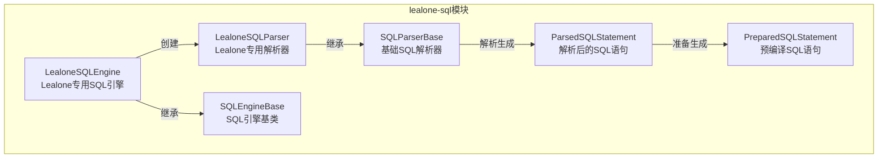
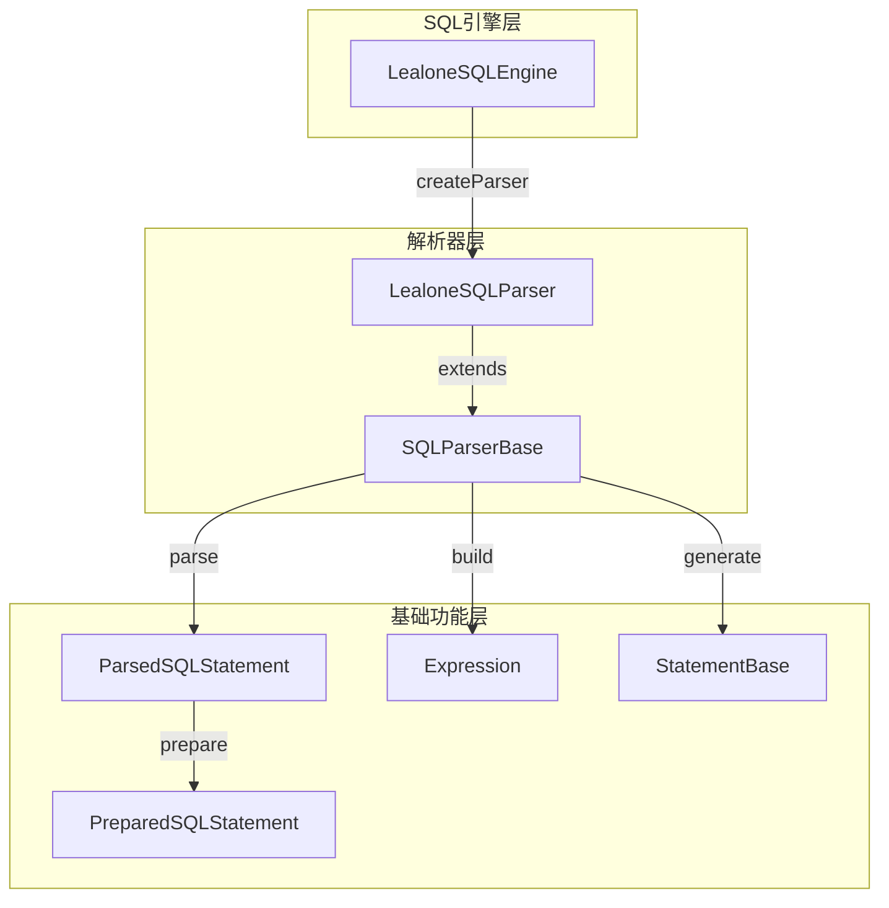
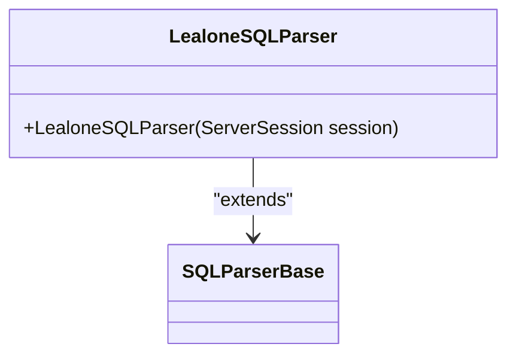
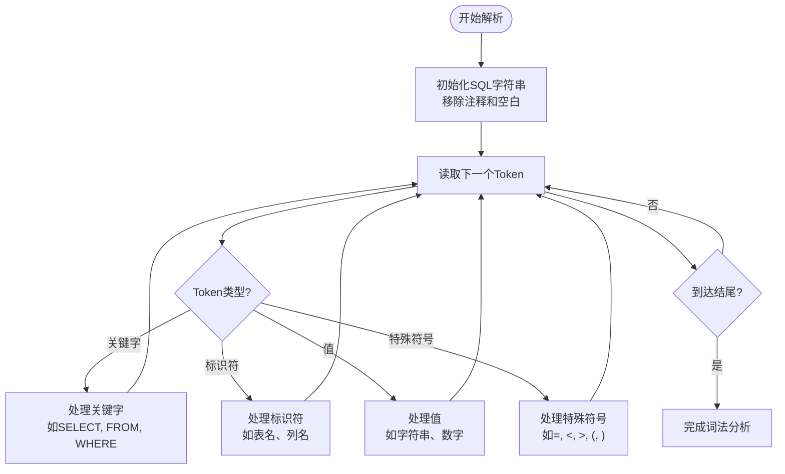
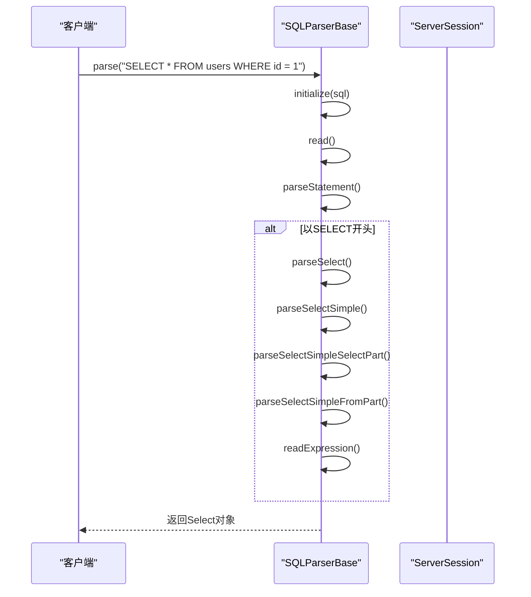
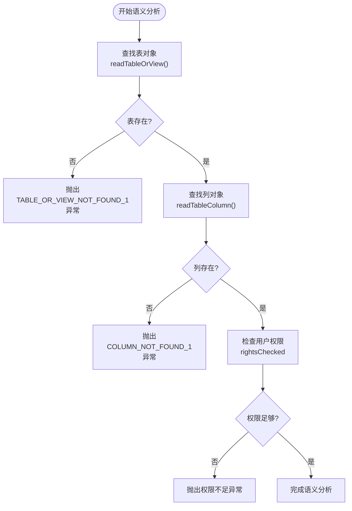
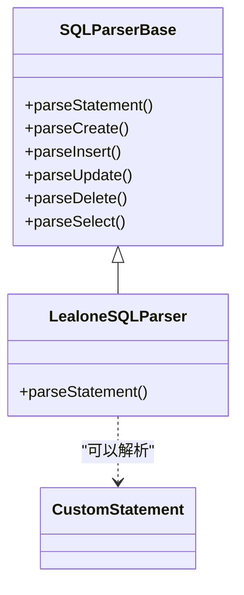
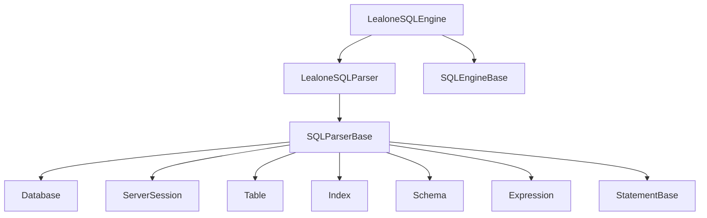

# SQL解析

**Referenced Files in This Document**   
- [LealoneSQLParser.java](https://github.com/lealone/Lealone/blob/master/lealone-sql/src/main/java/com/lealone/sql/LealoneSQLParser.java)
- [SQLParserBase.java](https://github.com/lealone/Lealone/blob/master/lealone-sql/src/main/java/com/lealone/sql/SQLParserBase.java)
- [LealoneSQLEngine.java](https://github.com/lealone/Lealone/blob/master/lealone-sql/src/main/java/com/lealone/sql/LealoneSQLEngine.java)
- [SQLEngineBase.java](https://github.com/lealone/Lealone/blob/master/lealone-sql/src/main/java/com/lealone/sql/SQLEngineBase.java)

## 目录
1. [介绍](#介绍)
2. [项目结构](#项目结构)
3. [核心组件](#核心组件)
4. [架构概述](#架构概述)
5. [详细组件分析](#详细组件分析)
6. [依赖分析](#依赖分析)
7. [性能考虑](#性能考虑)
8. [故障排除指南](#故障排除指南)
9. [结论](#结论)

## 介绍
本文档旨在深入解析Lealone数据库的SQL解析器，详细阐述其词法分析、语法分析和语义分析的实现机制。文档将重点介绍`LealoneSQLParser`如何继承`SQLParserBase`来提供基础的SQL解析功能，并通过`LealoneSQLEngine`创建解析器实例。我们将详细说明SQL解析器如何将SQL文本分解为token流，构建抽象语法树（AST），以及验证数据库对象的存在性和权限。此外，文档还将为开发者提供自定义SQL语法扩展的开发指南，包括如何添加新的SQL语句类型和解析规则。

## 项目结构
Lealone SQL解析器的核心组件位于`lealone-sql`模块中，主要包含解析器、引擎和相关表达式类。解析器负责将SQL语句转换为可执行的命令对象，而引擎则管理解析器的创建和SQL方言的处理。

**Diagram sources**
- [LealoneSQLParser.java](https://github.com/lealone/Lealone/blob/master/lealone-sql/src/main/java/com/lealone/sql/LealoneSQLParser.java)
- [SQLParserBase.java](https://github.com/lealone/Lealone/blob/master/lealone-sql/src/main/java/com/lealone/sql/SQLParserBase.java)
- [LealoneSQLEngine.java](https://github.com/lealone/Lealone/blob/master/lealone-sql/src/main/java/com/lealone/sql/LealoneSQLEngine.java)
- [SQLEngineBase.java](https://github.com/lealone/Lealone/blob/master/lealone-sql/src/main/java/com/lealone/sql/SQLEngineBase.java)

**Section sources**
- [LealoneSQLParser.java](https://github.com/lealone/Lealone/blob/master/lealone-sql/src/main/java/com/lealone/sql/LealoneSQLParser.java)
- [SQLParserBase.java](https://github.com/lealone/Lealone/blob/master/lealone-sql/src/main/java/com/lealone/sql/SQLParserBase.java)
- [LealoneSQLEngine.java](https://github.com/lealone/Lealone/blob/master/lealone-sql/src/main/java/com/lealone/sql/LealoneSQLEngine.java)

## 核心组件
Lealone SQL解析器的核心由`LealoneSQLParser`和`SQLParserBase`构成。`LealoneSQLParser`作为`SQLParserBase`的具体实现，提供了Lealone数据库特有的SQL解析功能。`SQLParserBase`则是一个功能完备的基础解析器，负责处理SQL语句的词法分析、语法分析和语义分析。`LealoneSQLEngine`作为SQL引擎，负责创建和管理`LealoneSQLParser`实例，是解析器与数据库系统之间的桥梁。

**Section sources**
- [LealoneSQLParser.java](https://github.com/lealone/Lealone/blob/master/lealone-sql/src/main/java/com/lealone/sql/LealoneSQLParser.java)
- [SQLParserBase.java](https://github.com/lealone/Lealone/blob/master/lealone-sql/src/main/java/com/lealone/sql/SQLParserBase.java)
- [LealoneSQLEngine.java](https://github.com/lealone/Lealone/blob/master/lealone-sql/src/main/java/com/lealone/sql/LealoneSQLEngine.java)

## 架构概述
Lealone SQL解析器采用分层架构，从上到下分为SQL引擎层、解析器层和基础功能层。这种设计实现了关注点分离，使得解析器的核心逻辑与数据库特定的实现细节解耦。

**Diagram sources**
- [LealoneSQLParser.java](https://github.com/lealone/Lealone/blob/master/lealone-sql/src/main/java/com/lealone/sql/LealoneSQLParser.java)
- [SQLParserBase.java](https://github.com/lealone/Lealone/blob/master/lealone-sql/src/main/java/com/lealone/sql/SQLParserBase.java)
- [LealoneSQLEngine.java](https://github.com/lealone/Lealone/blob/master/lealone-sql/src/main/java/com/lealone/sql/LealoneSQLEngine.java)

## 详细组件分析

### LealoneSQLParser分析
`LealoneSQLParser`是Lealone数据库专用的SQL解析器，它继承自`SQLParserBase`，并实现了Lealone特定的SQL方言和功能。该类的主要职责是作为`LealoneSQLEngine`创建解析器实例的入口点。

#### 类结构分析

**Diagram sources**
- [LealoneSQLParser.java](https://github.com/lealone/Lealone/blob/master/lealone-sql/src/main/java/com/lealone/sql/LealoneSQLParser.java)

**Section sources**
- [LealoneSQLParser.java](https://github.com/lealone/Lealone/blob/master/lealone-sql/src/main/java/com/lealone/sql/LealoneSQLParser.java)

### SQLParserBase分析
`SQLParserBase`是SQL解析器的核心实现，它负责将SQL文本分解为token流，构建抽象语法树（AST），并进行语义分析。该类实现了完整的词法分析器和递归下降语法分析器。

#### 词法分析器
词法分析器（Tokenizer）负责将输入的SQL字符串分解为一系列有意义的token。`SQLParserBase`通过`initialize`方法预处理SQL字符串，移除注释和空白字符，并为每个字符分配类型，然后通过`read`方法逐个读取token。

**Diagram sources**
- [SQLParserBase.java](https://github.com/lealone/Lealone/blob/master/lealone-sql/src/main/java/com/lealone/sql/SQLParserBase.java#L3397-L3799)

#### 语法分析器
语法分析器（Parser）采用递归下降算法，根据SQL语法规则构建抽象语法树（AST）。`SQLParserBase`中的`parseStatement`方法是语法分析的入口点，它根据第一个token判断SQL语句的类型，并调用相应的解析方法。

**Diagram sources**
- [SQLParserBase.java](https://github.com/lealone/Lealone/blob/master/lealone-sql/src/main/java/com/lealone/sql/SQLParserBase.java#L329-L540)

#### 语义分析器
语义分析器在语法分析之后进行，负责验证SQL语句的语义正确性，例如检查表、列、索引等数据库对象的存在性和权限。`SQLParserBase`通过`readTableOrView`、`readColumn`等方法实现对象查找和权限验证。

**Diagram sources**
- [SQLParserBase.java](https://github.com/lealone/Lealone/blob/master/lealone-sql/src/main/java/com/lealone/sql/SQLParserBase.java#L5388-L5413)

### SQLParserBase提供的基础解析功能和扩展机制
`SQLParserBase`不仅提供了基础的SQL解析功能，还设计了灵活的扩展机制，允许开发者自定义SQL语法。

#### 基础解析功能
`SQLParserBase`提供了丰富的解析方法，涵盖了SQL语言的各个方面：
- **数据定义语言（DDL）**: `parseCreate`, `parseDrop`, `parseAlter`
- **数据操作语言（DML）**: `parseInsert`, `parseUpdate`, `parseDelete`, `parseSelect`
- **表达式解析**: `readExpression`, `readCondition`, `readTerm`
- **对象查找**: `readTableOrView`, `readSequence`, `findFunctionAlias`

#### 扩展机制
`SQLParserBase`通过`parseStatement`方法的扩展点，允许子类添加新的SQL语句类型。子类可以重写`parseStatement`方法，在默认的解析逻辑之前尝试解析自定义的SQL语句。

**Diagram sources**
- [SQLParserBase.java](https://github.com/lealone/Lealone/blob/master/lealone-sql/src/main/java/com/lealone/sql/SQLParserBase.java)
- [LealoneSQLParser.java](https://github.com/lealone/Lealone/blob/master/lealone-sql/src/main/java/com/lealone/sql/LealoneSQLParser.java)

**Section sources**
- [SQLParserBase.java](https://github.com/lealone/Lealone/blob/master/lealone-sql/src/main/java/com/lealone/sql/SQLParserBase.java)
- [LealoneSQLParser.java](https://github.com/lealone/Lealone/blob/master/lealone-sql/src/main/java/com/lealone/sql/LealoneSQLParser.java)

## 依赖分析
Lealone SQL解析器与其他模块存在紧密的依赖关系，这些依赖关系确保了SQL解析器能够与数据库的其他部分协同工作。

**Diagram sources**
- [LealoneSQLParser.java](https://github.com/lealone/Lealone/blob/master/lealone-sql/src/main/java/com/lealone/sql/LealoneSQLParser.java)
- [SQLParserBase.java](https://github.com/lealone/Lealone/blob/master/lealone-sql/src/main/java/com/lealone/sql/SQLParserBase.java)
- [LealoneSQLEngine.java](https://github.com/lealone/Lealone/blob/master/lealone-sql/src/main/java/com/lealone/sql/LealoneSQLEngine.java)

## 性能考虑
SQL解析器的性能对数据库的整体性能有重要影响。`SQLParserBase`通过以下方式优化性能：
- **缓存**: 使用`StringUtils.cache`方法缓存字符串，减少内存分配。
- **预处理**: 在`initialize`方法中预处理SQL字符串，移除注释和空白字符，提高后续解析效率。
- **快速路径**: 在`parse`方法中首先尝试快速解析，只有在语法错误时才进行详细的错误分析。

## 故障排除指南
在使用Lealone SQL解析器时，可能会遇到以下常见问题：

**Section sources**
- [SQLParserBase.java](https://github.com/lealone/Lealone/blob/master/lealone-sql/src/main/java/com/lealone/sql/SQLParserBase.java#L546-L556)
- [SQLParserBase.java](https://github.com/lealone/Lealone/blob/master/lealone-sql/src/main/java/com/lealone/sql/SQLParserBase.java#L5388-L5413)

## 结论
Lealone SQL解析器是一个功能强大且设计良好的组件，它通过分层架构和模块化设计，实现了SQL语句的高效解析。`SQLParserBase`作为核心解析器，提供了完整的词法分析、语法分析和语义分析功能，而`LealoneSQLParser`则在此基础上实现了Lealone数据库特有的SQL方言。通过理解解析器的工作原理和扩展机制，开发者可以更好地利用Lealone数据库的功能，并根据需要进行定制开发。