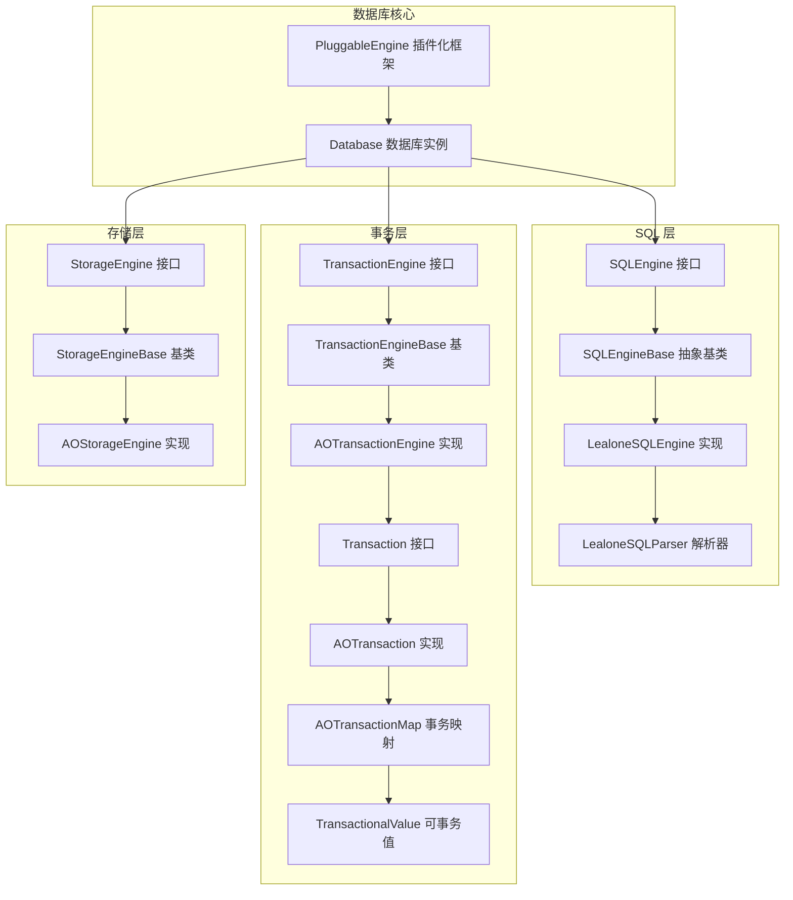
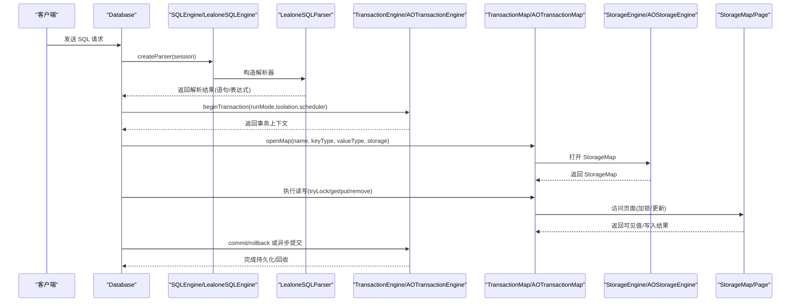
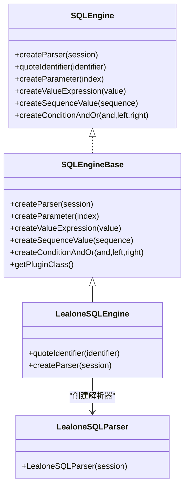
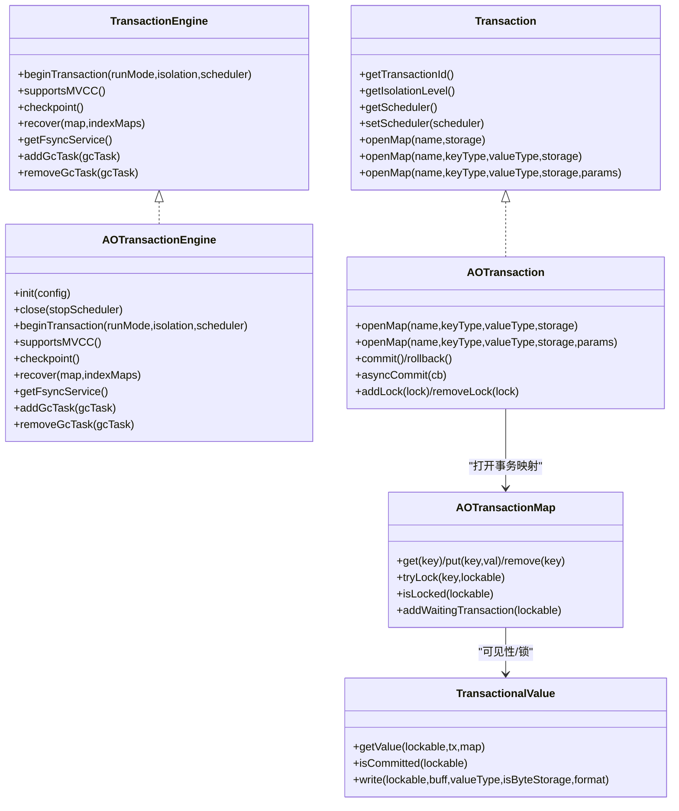
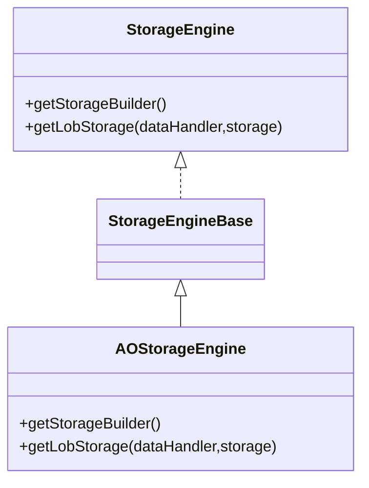
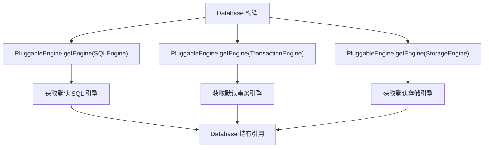
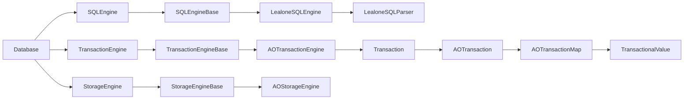

# 引擎集成

<cite>
**本文引用的文件列表**
- [LealoneSQLEngine.java](https://github.com/lealone/Lealone/blob/master/lealone-sql/src/main/java/com/lealone/sql/LealoneSQLEngine.java)
- [SQLEngineBase.java](https://github.com/lealone/Lealone/blob/master/lealone-sql/src/main/java/com/lealone/sql/SQLEngineBase.java)
- [SQLEngine.java](https://github.com/lealone/Lealone/blob/master/lealone-sci/src/main/java/com/lealone/sql/SQLEngine.java)
- [LealoneSQLParser.java](https://github.com/lealone/Lealone/blob/master/lealone-sql/src/main/java/com/lealone/sql/LealoneSQLParser.java)
- [Database.java](https://github.com/lealone/Lealone/blob/master/lealone-db/src/main/java/com/lealone/db/Database.java)
- [TransactionEngine.java](https://github.com/lealone/Lealone/blob/master/lealone-sci/src/main/java/com/lealone/transaction/TransactionEngine.java)
- [AOTransactionEngine.java](https://github.com/lealone/Lealone/blob/master/lealone-aote/src/main/java/com/lealone/transaction/aote/AOTransactionEngine.java)
- [AOTransaction.java](https://github.com/lealone/Lealone/blob/master/lealone-aote/src/main/java/com/lealone/transaction/aote/AOTransaction.java)
- [AOTransactionMap.java](https://github.com/lealone/Lealone/blob/master/lealone-aote/src/main/java/com/lealone/transaction/aote/AOTransactionMap.java)
- [TransactionalValue.java](https://github.com/lealone/Lealone/blob/master/lealone-aote/src/main/java/com/lealone/transaction/aote/TransactionalValue.java)
- [StorageEngine.java](https://github.com/lealone/Lealone/blob/master/lealone-sci/src/main/java/com/lealone/storage/StorageEngine.java)
- [AOStorageEngine.java](https://github.com/lealone/Lealone/blob/master/lealone-aose/src/main/java/com/lealone/storage/aose/AOStorageEngine.java)
- [PluggableEngine.java](https://github.com/lealone/Lealone/blob/master/lealone-sci/src/main/java/com/lealone/db/plugin/PluggableEngine.java)
</cite>

## 目录
1. [简介](#简介)
2. [项目结构](#项目结构)
3. [核心组件](#核心组件)
4. [架构总览](#架构总览)
5. [组件详解](#组件详解)
6. [依赖关系分析](#依赖关系分析)
7. [性能考量](#性能考量)
8. [故障排查指南](#故障排查指南)
9. [结论](#结论)

## 简介
本文件面向系统架构师，系统性阐述 Lealone 的多引擎协同架构：以 LealoneSQLEngine 为核心协调器，将解析后的 SQL 请求分发至事务引擎与存储引擎；通过标准化的 SQLEngine 接口协议，实现与不同事务引擎（如 AOTE）和存储引擎（如 AOSE）的松耦合集成；解释跨引擎的事务上下文传递、锁管理、MVCC 版本控制等协同机制，并给出性能调优建议与常见问题排查路径。

## 项目结构
Lealone 将“SQL 引擎”“事务引擎”“存储引擎”“协议服务器引擎”抽象为四大可插拔引擎，统一通过插件化框架加载与初始化。SQL 层负责解析与表达式构建，事务层负责并发控制与持久化，存储层负责数据组织与页面管理，协议层负责网络与会话。

图表来源
- [LealoneSQLEngine.java](https://github.com/lealone/Lealone/blob/master/lealone-sql/src/main/java/com/lealone/sql/LealoneSQLEngine.java#L1-L27)
- [SQLEngineBase.java](https://github.com/lealone/Lealone/blob/master/lealone-sql/src/main/java/com/lealone/sql/SQLEngineBase.java#L1-L60)
- [SQLEngine.java](https://github.com/lealone/Lealone/blob/master/lealone-sci/src/main/java/com/lealone/sql/SQLEngine.java#L1-L34)
- [LealoneSQLParser.java](https://github.com/lealone/Lealone/blob/master/lealone-sql/src/main/java/com/lealone/sql/LealoneSQLParser.java#L1-L15)
- [Database.java](https://github.com/lealone/Lealone/blob/master/lealone-db/src/main/java/com/lealone/db/Database.java#L200-L235)
- [TransactionEngine.java](https://github.com/lealone/Lealone/blob/master/lealone-sci/src/main/java/com/lealone/transaction/TransactionEngine.java#L1-L71)
- [AOTransactionEngine.java](https://github.com/lealone/Lealone/blob/master/lealone-aote/src/main/java/com/lealone/transaction/aote/AOTransactionEngine.java#L1-L311)
- [AOTransaction.java](https://github.com/lealone/Lealone/blob/master/lealone-aote/src/main/java/com/lealone/transaction/aote/AOTransaction.java#L168-L198)
- [AOTransactionMap.java](https://github.com/lealone/Lealone/blob/master/lealone-aote/src/main/java/com/lealone/transaction/aote/AOTransactionMap.java#L35-L316)
- [TransactionalValue.java](https://github.com/lealone/Lealone/blob/master/lealone-aote/src/main/java/com/lealone/transaction/aote/TransactionalValue.java#L35-L324)
- [StorageEngine.java](https://github.com/lealone/Lealone/blob/master/lealone-sci/src/main/java/com/lealone/storage/StorageEngine.java#L1-L24)
- [AOStorageEngine.java](https://github.com/lealone/Lealone/blob/master/lealone-aose/src/main/java/com/lealone/storage/aose/AOStorageEngine.java#L1-L33)
- [PluggableEngine.java](https://github.com/lealone/Lealone/blob/master/lealone-sci/src/main/java/com/lealone/db/plugin/PluggableEngine.java#L1-L46)

章节来源
- [LealoneSQLEngine.java](https://github.com/lealone/Lealone/blob/master/lealone-sql/src/main/java/com/lealone/sql/LealoneSQLEngine.java#L1-L27)
- [SQLEngineBase.java](https://github.com/lealone/Lealone/blob/master/lealone-sql/src/main/java/com/lealone/sql/SQLEngineBase.java#L1-L60)
- [SQLEngine.java](https://github.com/lealone/Lealone/blob/master/lealone-sci/src/main/java/com/lealone/sql/SQLEngine.java#L1-L34)
- [LealoneSQLParser.java](https://github.com/lealone/Lealone/blob/master/lealone-sql/src/main/java/com/lealone/sql/LealoneSQLParser.java#L1-L15)
- [Database.java](https://github.com/lealone/Lealone/blob/master/lealone-db/src/main/java/com/lealone/db/Database.java#L200-L235)
- [PluggableEngine.java](https://github.com/lealone/Lealone/blob/master/lealone-sci/src/main/java/com/lealone/db/plugin/PluggableEngine.java#L1-L46)

## 核心组件
- SQL 引擎接口与实现
  - SQLEngine 定义了创建解析器、标识符转义、表达式与参数工厂方法等标准化协议。
  - SQLEngineBase 提供通用工厂方法与类型适配。
  - LealoneSQLEngine 作为默认实现，绑定 LealoneSQLParser 并委托标识符转义。
- 事务引擎接口与实现
  - TransactionEngine 定义事务生命周期、MVCC 支持、检查点、恢复、GC 任务等能力。
  - AOTransactionEngine 是 AOTE 的实现，支持多调度器、日志同步服务、检查点、MVCC、重复读计数与回收。
  - Transaction 接口定义事务上下文、调度器绑定、打开事务映射等。
  - AOTransaction 实现事务上下文、锁集合维护、保存点、异步提交、打开事务映射等。
  - AOTransactionMap 包装底层 StorageMap，实现事务可见性、锁管理、Undo 日志记录、等待队列等。
  - TransactionalValue 提供可事务值的读取策略、提交状态判断、写入元信息等。
- 存储引擎接口与实现
  - StorageEngine 定义存储构建器与 LOB 存储工厂。
  - AOStorageEngine 是 AOSE 的实现，提供 AOStorageBuilder 与 LobStreamStorage。
- 数据库核心
  - Database 在构造时通过 PluggableEngine 获取 SQL/事务/存储引擎实例，贯穿整个生命周期。

章节来源
- [SQLEngine.java](https://github.com/lealone/Lealone/blob/master/lealone-sci/src/main/java/com/lealone/sql/SQLEngine.java#L1-L34)
- [SQLEngineBase.java](https://github.com/lealone/Lealone/blob/master/lealone-sql/src/main/java/com/lealone/sql/SQLEngineBase.java#L1-L60)
- [LealoneSQLEngine.java](https://github.com/lealone/Lealone/blob/master/lealone-sql/src/main/java/com/lealone/sql/LealoneSQLEngine.java#L1-L27)
- [LealoneSQLParser.java](https://github.com/lealone/Lealone/blob/master/lealone-sql/src/main/java/com/lealone/sql/LealoneSQLParser.java#L1-L15)
- [TransactionEngine.java](https://github.com/lealone/Lealone/blob/master/lealone-sci/src/main/java/com/lealone/transaction/TransactionEngine.java#L1-L71)
- [AOTransactionEngine.java](https://github.com/lealone/Lealone/blob/master/lealone-aote/src/main/java/com/lealone/transaction/aote/AOTransactionEngine.java#L1-L311)
- [AOTransaction.java](https://github.com/lealone/Lealone/blob/master/lealone-aote/src/main/java/com/lealone/transaction/aote/AOTransaction.java#L168-L198)
- [AOTransactionMap.java](https://github.com/lealone/Lealone/blob/master/lealone-aote/src/main/java/com/lealone/transaction/aote/AOTransactionMap.java#L35-L316)
- [TransactionalValue.java](https://github.com/lealone/Lealone/blob/master/lealone-aote/src/main/java/com/lealone/transaction/aote/TransactionalValue.java#L35-L324)
- [StorageEngine.java](https://github.com/lealone/Lealone/blob/master/lealone-sci/src/main/java/com/lealone/storage/StorageEngine.java#L1-L24)
- [AOStorageEngine.java](https://github.com/lealone/Lealone/blob/master/lealone-aose/src/main/java/com/lealone/storage/aose/AOStorageEngine.java#L1-L33)
- [Database.java](https://github.com/lealone/Lealone/blob/master/lealone-db/src/main/java/com/lealone/db/Database.java#L200-L235)
- [PluggableEngine.java](https://github.com/lealone/Lealone/blob/master/lealone-sci/src/main/java/com/lealone/db/plugin/PluggableEngine.java#L1-L46)

## 架构总览
LealoneSQLEngine 作为协调者，通过以下流程将 SQL 请求分发到事务与存储引擎：
- 解析阶段：Database 创建 SQL 解析器（由 SQLEngine.createParser），解析 SQL 为语句树与表达式。
- 执行阶段：根据语句类型，SQL 引擎协调事务引擎开启事务，打开事务映射，执行读写操作。
- 存储阶段：事务映射通过存储引擎打开底层 StorageMap，进行页面级读写与锁管理。
- 持久化阶段：事务引擎的日志同步服务与检查点服务保障持久化与恢复。

图表来源
- [Database.java](https://github.com/lealone/Lealone/blob/master/lealone-db/src/main/java/com/lealone/db/Database.java#L368-L375)
- [SQLEngine.java](https://github.com/lealone/Lealone/blob/master/lealone-sci/src/main/java/com/lealone/sql/SQLEngine.java#L21-L33)
- [LealoneSQLEngine.java](https://github.com/lealone/Lealone/blob/master/lealone-sql/src/main/java/com/lealone/sql/LealoneSQLEngine.java#L13-L26)
- [LealoneSQLParser.java](https://github.com/lealone/Lealone/blob/master/lealone-sql/src/main/java/com/lealone/sql/LealoneSQLParser.java#L10-L14)
- [TransactionEngine.java](https://github.com/lealone/Lealone/blob/master/lealone-sci/src/main/java/com/lealone/transaction/TransactionEngine.java#L24-L41)
- [AOTransactionEngine.java](https://github.com/lealone/Lealone/blob/master/lealone-aote/src/main/java/com/lealone/transaction/aote/AOTransactionEngine.java#L196-L226)
- [AOTransaction.java](https://github.com/lealone/Lealone/blob/master/lealone-aote/src/main/java/com/lealone/transaction/aote/AOTransaction.java#L168-L198)
- [AOTransactionMap.java](https://github.com/lealone/Lealone/blob/master/lealone-aote/src/main/java/com/lealone/transaction/aote/AOTransactionMap.java#L395-L432)
- [StorageEngine.java](https://github.com/lealone/Lealone/blob/master/lealone-sci/src/main/java/com/lealone/storage/StorageEngine.java#L16-L23)
- [AOStorageEngine.java](https://github.com/lealone/Lealone/blob/master/lealone-aose/src/main/java/com/lealone/storage/aose/AOStorageEngine.java#L23-L31)

## 组件详解

### SQL 引擎接口与实现
- SQLEngine 接口
  - 规范化协议：创建解析器、标识符转义、表达式与参数工厂方法，确保 SQL 引擎可插拔。
- SQLEngineBase 抽象基类
  - 提供通用工厂方法与类型适配，屏蔽具体实现差异。
- LealoneSQLEngine
  - 默认实现，绑定 LealoneSQLParser，委托标识符转义。
- LealoneSQLParser
  - 基于 ServerSession 的解析器，配合 SQL 引擎完成语法与语义解析。

图表来源
- [SQLEngine.java](https://github.com/lealone/Lealone/blob/master/lealone-sci/src/main/java/com/lealone/sql/SQLEngine.java#L1-L34)
- [SQLEngineBase.java](https://github.com/lealone/Lealone/blob/master/lealone-sql/src/main/java/com/lealone/sql/SQLEngineBase.java#L1-L60)
- [LealoneSQLEngine.java](https://github.com/lealone/Lealone/blob/master/lealone-sql/src/main/java/com/lealone/sql/LealoneSQLEngine.java#L13-L26)
- [LealoneSQLParser.java](https://github.com/lealone/Lealone/blob/master/lealone-sql/src/main/java/com/lealone/sql/LealoneSQLParser.java#L10-L14)

章节来源
- [SQLEngine.java](https://github.com/lealone/Lealone/blob/master/lealone-sci/src/main/java/com/lealone/sql/SQLEngine.java#L1-L34)
- [SQLEngineBase.java](https://github.com/lealone/Lealone/blob/master/lealone-sql/src/main/java/com/lealone/sql/SQLEngineBase.java#L1-L60)
- [LealoneSQLEngine.java](https://github.com/lealone/Lealone/blob/master/lealone-sql/src/main/java/com/lealone/sql/LealoneSQLEngine.java#L13-L26)
- [LealoneSQLParser.java](https://github.com/lealone/Lealone/blob/master/lealone-sql/src/main/java/com/lealone/sql/LealoneSQLParser.java#L10-L14)

### 事务引擎接口与实现
- TransactionEngine 接口
  - 事务生命周期：beginTransaction(runMode, isolation, scheduler)。
  - 能力扩展：supportsMVCC、checkpoint、recover、fsyncService、GC 任务。
- AOTransactionEngine 实现
  - 多调度器与日志同步服务：按调度器数量动态分配，嵌入模式下启动 fsync 服务。
  - 事务管理：TransactionManager 数组，重复读事务计数，最大事务 ID 查询。
  - 存储事件监听：注册为 StorageEventListener，参与存储映射的重做日志与检查点。
- Transaction 接口与 AOTransaction 实现
  - 事务上下文：事务 ID、隔离级别、调度器、会话、自动提交标志。
  - 锁管理：RowLock 集合，解锁逻辑，保存点与回滚。
  - 打开事务映射：注册存储事件监听，打开 StorageMap，创建 AOTransactionMap。
- AOTransactionMap
  - 事务可见性：基于 TransactionalValue 的隔离级别读取策略。
  - 锁与 Undo：tryLock/加锁、addUndoLog、等待事务队列、脏页标记。
  - 委派 StorageMap：clear/close/save/gc 等操作委派到底层映射。
- TransactionalValue
  - 可见性：READ_UNCOMMITTED/READ_COMMITTED/REPEATABLE_READ/ SERIALIZABLE 等策略。
  - 提交状态：isCommitted 判断、写入元信息兼容旧格式。

图表来源
- [TransactionEngine.java](https://github.com/lealone/Lealone/blob/master/lealone-sci/src/main/java/com/lealone/transaction/TransactionEngine.java#L1-L71)
- [AOTransactionEngine.java](https://github.com/lealone/Lealone/blob/master/lealone-aote/src/main/java/com/lealone/transaction/aote/AOTransactionEngine.java#L196-L226)
- [AOTransactionEngine.java](https://github.com/lealone/Lealone/blob/master/lealone-aote/src/main/java/com/lealone/transaction/aote/AOTransactionEngine.java#L113-L147)
- [AOTransactionEngine.java](https://github.com/lealone/Lealone/blob/master/lealone-aote/src/main/java/com/lealone/transaction/aote/AOTransactionEngine.java#L267-L311)
- [AOTransaction.java](https://github.com/lealone/Lealone/blob/master/lealone-aote/src/main/java/com/lealone/transaction/aote/AOTransaction.java#L168-L198)
- [AOTransactionMap.java](https://github.com/lealone/Lealone/blob/master/lealone-aote/src/main/java/com/lealone/transaction/aote/AOTransactionMap.java#L35-L316)
- [AOTransactionMap.java](https://github.com/lealone/Lealone/blob/master/lealone-aote/src/main/java/com/lealone/transaction/aote/AOTransactionMap.java#L395-L432)
- [TransactionalValue.java](https://github.com/lealone/Lealone/blob/master/lealone-aote/src/main/java/com/lealone/transaction/aote/TransactionalValue.java#L35-L324)

章节来源
- [TransactionEngine.java](https://github.com/lealone/Lealone/blob/master/lealone-sci/src/main/java/com/lealone/transaction/TransactionEngine.java#L1-L71)
- [AOTransactionEngine.java](https://github.com/lealone/Lealone/blob/master/lealone-aote/src/main/java/com/lealone/transaction/aote/AOTransactionEngine.java#L113-L147)
- [AOTransactionEngine.java](https://github.com/lealone/Lealone/blob/master/lealone-aote/src/main/java/com/lealone/transaction/aote/AOTransactionEngine.java#L196-L226)
- [AOTransactionEngine.java](https://github.com/lealone/Lealone/blob/master/lealone-aote/src/main/java/com/lealone/transaction/aote/AOTransactionEngine.java#L267-L311)
- [AOTransaction.java](https://github.com/lealone/Lealone/blob/master/lealone-aote/src/main/java/com/lealone/transaction/aote/AOTransaction.java#L168-L198)
- [AOTransactionMap.java](https://github.com/lealone/Lealone/blob/master/lealone-aote/src/main/java/com/lealone/transaction/aote/AOTransactionMap.java#L35-L316)
- [AOTransactionMap.java](https://github.com/lealone/Lealone/blob/master/lealone-aote/src/main/java/com/lealone/transaction/aote/AOTransactionMap.java#L395-L432)
- [TransactionalValue.java](https://github.com/lealone/Lealone/blob/master/lealone-aote/src/main/java/com/lealone/transaction/aote/TransactionalValue.java#L35-L324)

### 存储引擎接口与实现
- StorageEngine 接口
  - 提供 StorageBuilder 与 LOB 存储工厂，支持默认存储引擎获取。
- AOStorageEngine 实现
  - 返回 AOStorageBuilder，提供 LobStreamStorage。
- 协同机制
  - 事务引擎在打开映射时注册为 StorageEventListener，参与重做日志与检查点任务。

图表来源
- [StorageEngine.java](https://github.com/lealone/Lealone/blob/master/lealone-sci/src/main/java/com/lealone/storage/StorageEngine.java#L1-L24)
- [AOStorageEngine.java](https://github.com/lealone/Lealone/blob/master/lealone-aose/src/main/java/com/lealone/storage/aose/AOStorageEngine.java#L1-L33)

章节来源
- [StorageEngine.java](https://github.com/lealone/Lealone/blob/master/lealone-sci/src/main/java/com/lealone/storage/StorageEngine.java#L1-L24)
- [AOStorageEngine.java](https://github.com/lealone/Lealone/blob/master/lealone-aose/src/main/java/com/lealone/storage/aose/AOStorageEngine.java#L1-L33)
- [AOTransactionEngine.java](https://github.com/lealone/Lealone/blob/master/lealone-aote/src/main/java/com/lealone/transaction/aote/AOTransactionEngine.java#L113-L147)

### 数据库核心与插件化框架
- Database 在构造时通过 PluggableEngine.getEngine 获取 SQL/事务/存储引擎实例，贯穿生命周期。
- PluggableEngine 提供引擎类型识别与实例化，支持默认引擎名与动态注册。

图表来源
- [Database.java](https://github.com/lealone/Lealone/blob/master/lealone-db/src/main/java/com/lealone/db/Database.java#L207-L235)
- [PluggableEngine.java](https://github.com/lealone/Lealone/blob/master/lealone-sci/src/main/java/com/lealone/db/plugin/PluggableEngine.java#L18-L45)

章节来源
- [Database.java](https://github.com/lealone/Lealone/blob/master/lealone-db/src/main/java/com/lealone/db/Database.java#L207-L235)
- [PluggableEngine.java](https://github.com/lealone/Lealone/blob/master/lealone-sci/src/main/java/com/lealone/db/plugin/PluggableEngine.java#L18-L45)

## 依赖关系分析
- 松耦合设计
  - 通过接口与抽象基类解耦具体实现，SQL/事务/存储引擎均可替换。
  - 插件化框架统一加载与初始化，避免硬编码依赖。
- 关键依赖链
  - Database 依赖 SQLEngine/TransactionEngine/StorageEngine。
  - SQLEngineBase 依赖表达式与参数工厂。
  - AOTransactionEngine 依赖调度器工厂、日志同步服务、检查点服务。
  - AOTransactionMap 依赖 StorageMap 与 TransactionalValue。
- 潜在循环依赖
  - 事务引擎与存储引擎通过事件监听建立弱耦合关系，避免直接循环依赖。
- 外部依赖
  - 运行模式、系统属性、调度器工厂等外部配置影响引擎行为。

图表来源
- [Database.java](https://github.com/lealone/Lealone/blob/master/lealone-db/src/main/java/com/lealone/db/Database.java#L207-L235)
- [SQLEngineBase.java](https://github.com/lealone/Lealone/blob/master/lealone-sql/src/main/java/com/lealone/sql/SQLEngineBase.java#L1-L60)
- [LealoneSQLEngine.java](https://github.com/lealone/Lealone/blob/master/lealone-sql/src/main/java/com/lealone/sql/LealoneSQLEngine.java#L13-L26)
- [LealoneSQLParser.java](https://github.com/lealone/Lealone/blob/master/lealone-sql/src/main/java/com/lealone/sql/LealoneSQLParser.java#L10-L14)
- [TransactionEngine.java](https://github.com/lealone/Lealone/blob/master/lealone-sci/src/main/java/com/lealone/transaction/TransactionEngine.java#L1-L71)
- [AOTransactionEngine.java](https://github.com/lealone/Lealone/blob/master/lealone-aote/src/main/java/com/lealone/transaction/aote/AOTransactionEngine.java#L196-L226)
- [AOTransaction.java](https://github.com/lealone/Lealone/blob/master/lealone-aote/src/main/java/com/lealone/transaction/aote/AOTransaction.java#L168-L198)
- [AOTransactionMap.java](https://github.com/lealone/Lealone/blob/master/lealone-aote/src/main/java/com/lealone/transaction/aote/AOTransactionMap.java#L35-L316)
- [TransactionalValue.java](https://github.com/lealone/Lealone/blob/master/lealone-aote/src/main/java/com/lealone/transaction/aote/TransactionalValue.java#L35-L324)
- [StorageEngine.java](https://github.com/lealone/Lealone/blob/master/lealone-sci/src/main/java/com/lealone/storage/StorageEngine.java#L1-L24)
- [AOStorageEngine.java](https://github.com/lealone/Lealone/blob/master/lealone-aose/src/main/java/com/lealone/storage/aose/AOStorageEngine.java#L1-L33)

章节来源
- [Database.java](https://github.com/lealone/Lealone/blob/master/lealone-db/src/main/java/com/lealone/db/Database.java#L207-L235)
- [PluggableEngine.java](https://github.com/lealone/Lealone/blob/master/lealone-sci/src/main/java/com/lealone/db/plugin/PluggableEngine.java#L18-L45)

## 性能考量
- 事务并发与调度
  - 使用多调度器与日志同步服务，减少热点竞争；根据运行模式选择单线程或跨线程事务绑定。
- MVCC 与可见性
  - 合理设置隔离级别，避免过度串行化；重复读事务计数用于检查点策略优化。
- 存储与页面
  - 事务映射的 tryLock 与等待队列降低冲突；脏页标记与检查点批量回收内存。
- IO 与持久化
  - fsync 服务与周期性检查点平衡吞吐与可靠性；LOB 存储按需压缩。
- 调优建议
  - 根据负载特征调整调度器数量与日志同步策略。
  - 控制事务大小与持有锁时间，避免长事务阻塞。
  - 合理配置存储路径与检查点频率，平衡延迟与可靠性。

[本节为通用指导，无需特定文件来源]

## 故障排查指南
- 事务相关
  - 保存点无效：确认保存点名称与 ID 映射正确，回滚到指定 ID。
  - 锁等待：观察 AOTransactionMap 的等待事务队列，定位冲突键。
  - 重复读事务：通过 AOTransactionEngine.containsRepeatableReadTransactions 与最大事务 ID 辅助诊断。
- 存储相关
  - 检查点失败：查看 CheckpointService 的错误日志与脏页统计。
  - LOB 读写异常：确认 LobStorage 初始化与数据处理流程。
- SQL 解析
  - 标识符转义：确认 LealoneSQLEngine.quoteIdentifier 行为与数据库模式一致。
- 插件化
  - 引擎未注册：检查 PluggableEngine.getEngine 类型识别与默认引擎名。

章节来源
- [AOTransaction.java](https://github.com/lealone/Lealone/blob/master/lealone-aote/src/main/java/com/lealone/transaction/aote/AOTransaction.java#L357-L387)
- [AOTransactionMap.java](https://github.com/lealone/Lealone/blob/master/lealone-aote/src/main/java/com/lealone/transaction/aote/AOTransactionMap.java#L395-L432)
- [AOTransactionEngine.java](https://github.com/lealone/Lealone/blob/master/lealone-aote/src/main/java/com/lealone/transaction/aote/AOTransactionEngine.java#L80-L92)
- [AOTransactionEngine.java](https://github.com/lealone/Lealone/blob/master/lealone-aote/src/main/java/com/lealone/transaction/aote/AOTransactionEngine.java#L246-L251)
- [TransactionalValue.java](https://github.com/lealone/Lealone/blob/master/lealone-aote/src/main/java/com/lealone/transaction/aote/TransactionalValue.java#L311-L324)
- [LealoneSQLEngine.java](https://github.com/lealone/Lealone/blob/master/lealone-sql/src/main/java/com/lealone/sql/LealoneSQLEngine.java#L18-L20)
- [PluggableEngine.java](https://github.com/lealone/Lealone/blob/master/lealone-sci/src/main/java/com/lealone/db/plugin/PluggableEngine.java#L18-L45)

## 结论
Lealone 通过标准化的 SQLEngine 接口协议，将 SQL 解析与执行与事务、存储引擎解耦，形成清晰的多引擎协作架构。AOTE 与 AOSE 分别在事务并发控制与存储组织方面提供高性能实现，配合插件化框架与数据库核心，实现可扩展、可调优、可维护的数据库系统。架构师可在该基础上按需替换引擎实现，满足不同业务场景的性能与一致性需求。