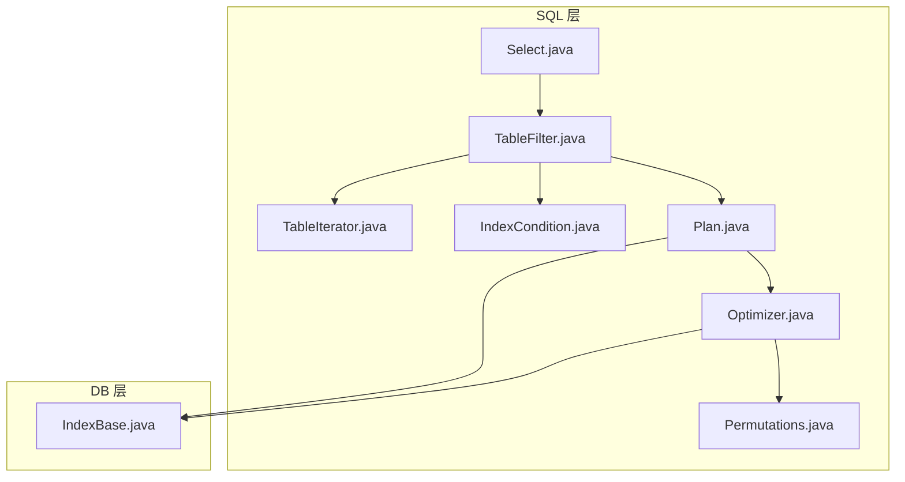
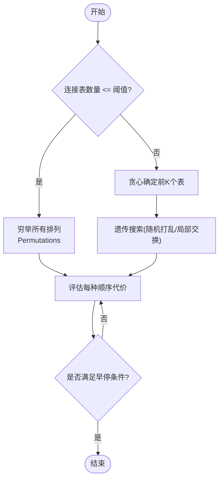
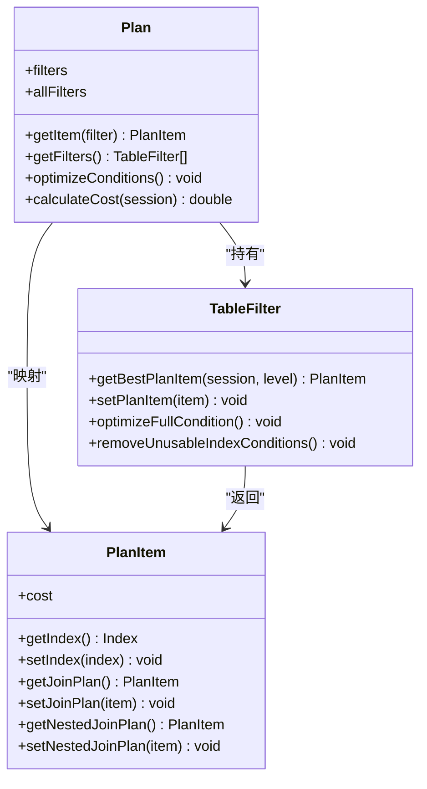
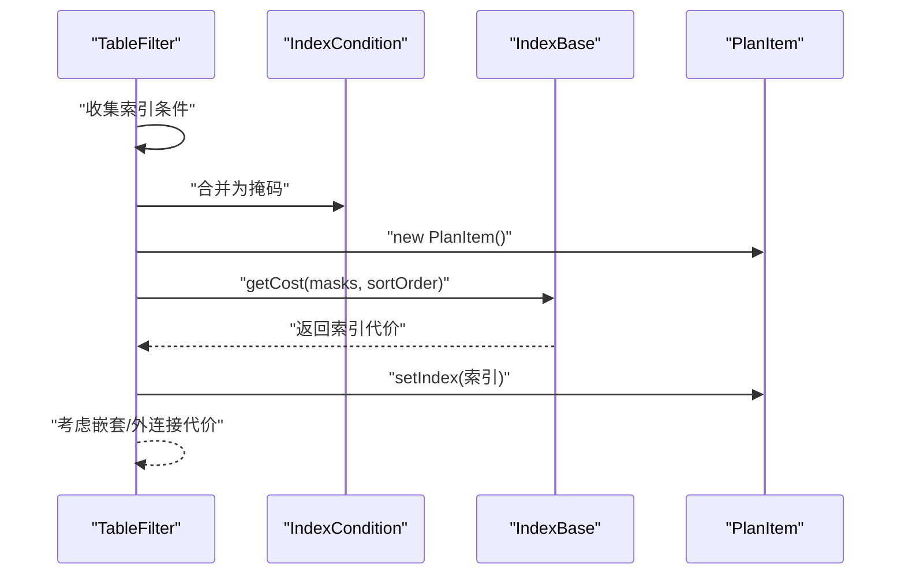
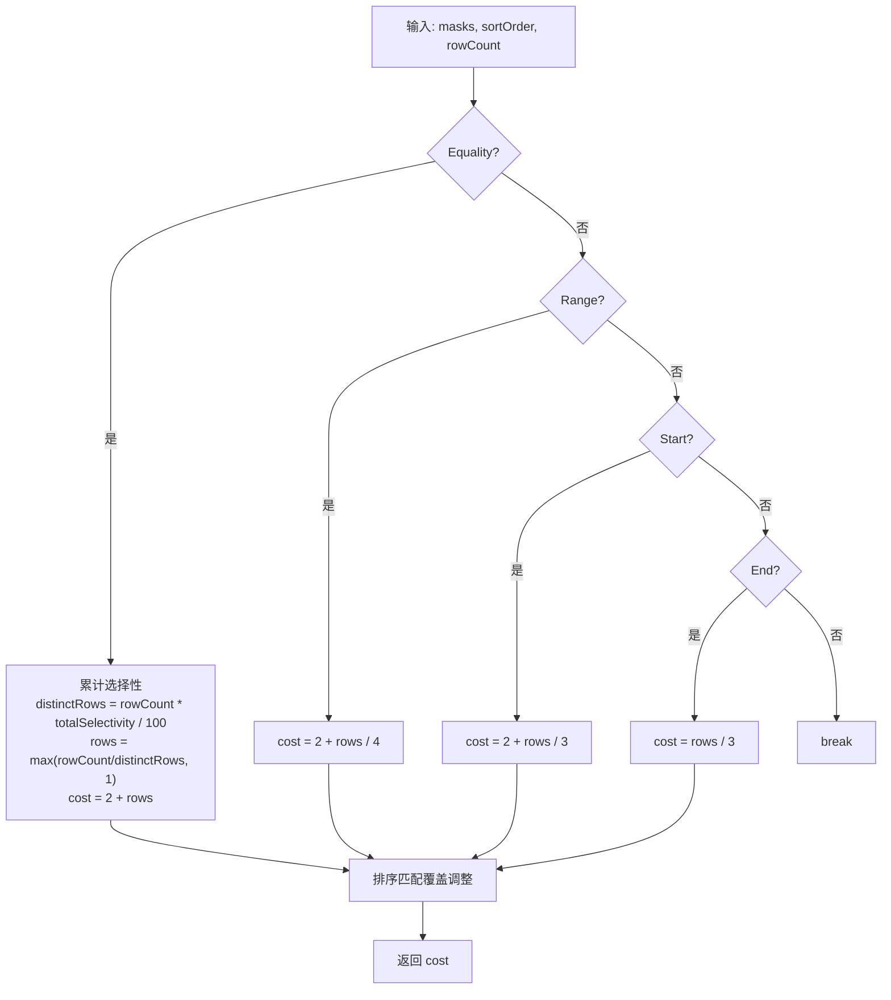
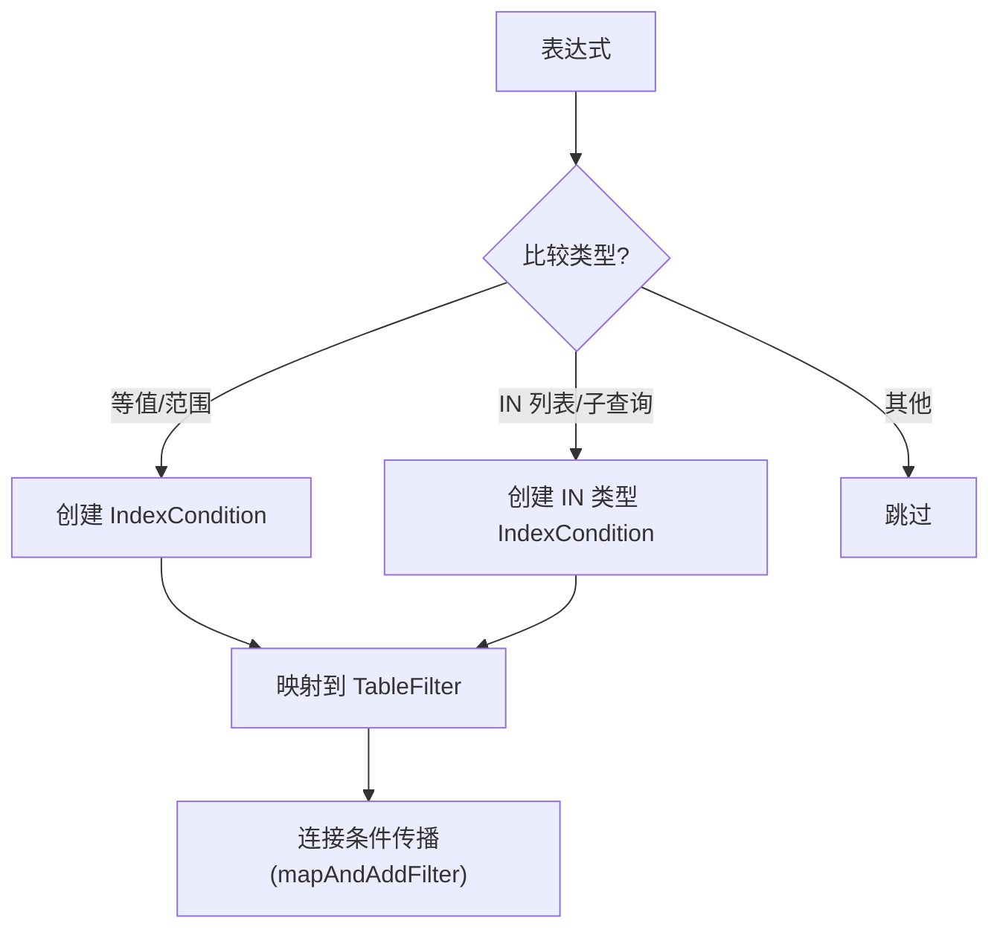
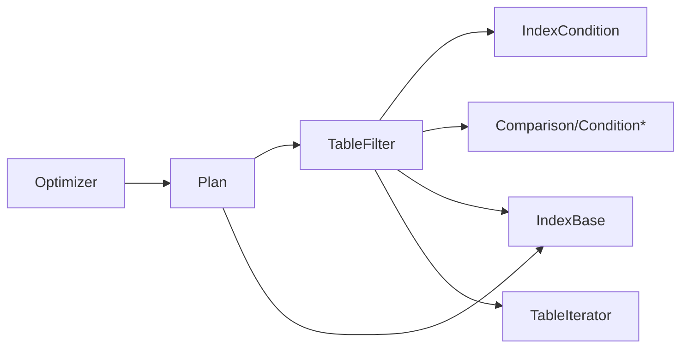

# 查询优化


**本文引用的文件**
- [Optimizer.java](https://github.com/lealone/Lealone/blob/master/lealone-sql/src/main/java/com/lealone/sql/optimizer/Optimizer.java)
- [Plan.java](https://github.com/lealone/Lealone/blob/master/lealone-sql/src/main/java/com/lealone/sql/optimizer/Plan.java)
- [PlanItem.java](https://github.com/lealone/Lealone/blob/master/lealone-sql/src/main/java/com/lealone/sql/optimizer/PlanItem.java)
- [TableFilter.java](https://github.com/lealone/Lealone/blob/master/lealone-sql/src/main/java/com/lealone/sql/optimizer/TableFilter.java)
- [IndexCondition.java](https://github.com/lealone/Lealone/blob/master/lealone-sql/src/main/java/com/lealone/sql/optimizer/IndexCondition.java)
- [Permutations.java](https://github.com/lealone/Lealone/blob/master/lealone-sql/src/main/java/com/lealone/sql/optimizer/Permutations.java)
- [TableIterator.java](https://github.com/lealone/Lealone/blob/master/lealone-sql/src/main/java/com/lealone/sql/optimizer/TableIterator.java)
- [IndexBase.java](https://github.com/lealone/Lealone/blob/master/lealone-db/src/main/java/com/lealone/db/index/IndexBase.java)
- [Comparison.java](https://github.com/lealone/Lealone/blob/master/lealone-sql/src/main/java/com/lealone/sql/expressions/condition/Comparison.java)
- [ConditionAndOr.java](https://github.com/lealone/Lealone/blob/master/lealone-sql/src/main/java/com/lealone/sql/expressions/condition/ConditionAndOr.java)
- [ConditionInSelect.java](https://github.com/lealone/Lealone/blob/master/lealone-sql/src/main/java/com/lealone/sql/expressions/condition/ConditionInSelect.java)
- [Select.java](https://github.com/lealone/Lealone/blob/master/lealone-sql/src/main/java/com/lealone/sql/query/Select.java)
- [ASelectivity.java](https://github.com/lealone/Lealone/blob/master/lealone-sql/src/main/java/com/lealone/sql/expression/aggregate/ASelectivity.java)


## 目录
1. [简介](#简介)
2. [项目结构](#项目结构)
3. [核心组件](#核心组件)
4. [架构总览](#架构总览)
5. [详细组件分析](#详细组件分析)
6. [依赖关系分析](#依赖关系分析)
7. [性能考量](#性能考量)
8. [故障排查指南](#故障排查指南)
9. [结论](#结论)
10. [附录](#附录)

## 简介
本文件面向数据库调优专家与开发者，系统性阐述 Lealone 查询优化器的工作机制，重点覆盖：
- 基于成本模型的选择最优执行计划
- 索引选择算法与代价估算
- 连接顺序优化策略
- 谓词下推规则与条件传播
- Plan 与 TableFilter 的语义与协作
- 统计信息驱动的基数估计与成本计算
- 查询计划分析工具与提示（hints）对优化器的影响
- 实际查询优化过程示例

## 项目结构
Lealone 的查询优化器位于 lealone-sql 模块的 optimizer 包中，围绕 TableFilter、Plan、Optimizer 三大核心类组织；代价计算由索引层的 IndexBase 提供，谓词下推由表达式层的 Comparison/Condition* 系列负责。



图表来源
- [Optimizer.java](https://github.com/lealone/Lealone/blob/master/lealone-sql/src/main/java/com/lealone/sql/optimizer/Optimizer.java#L62-L120)
- [Plan.java](https://github.com/lealone/Lealone/blob/master/lealone-sql/src/main/java/com/lealone/sql/optimizer/Plan.java#L82-L116)
- [TableFilter.java](https://github.com/lealone/Lealone/blob/master/lealone-sql/src/main/java/com/lealone/sql/optimizer/TableFilter.java#L148-L204)
- [IndexBase.java](https://github.com/lealone/Lealone/blob/master/lealone-db/src/main/java/com/lealone/db/index/IndexBase.java#L260-L336)
- [Permutations.java](https://github.com/lealone/Lealone/blob/master/lealone-sql/src/main/java/com/lealone/sql/optimizer/Permutations.java#L66-L120)
- [IndexCondition.java](https://github.com/lealone/Lealone/blob/master/lealone-sql/src/main/java/com/lealone/sql/optimizer/IndexCondition.java#L194-L232)
- [TableIterator.java](https://github.com/lealone/Lealone/blob/master/lealone-sql/src/main/java/com/lealone/sql/optimizer/TableIterator.java#L18-L66)

章节来源
- [Optimizer.java](https://github.com/lealone/Lealone/blob/master/lealone-sql/src/main/java/com/lealone/sql/optimizer/Optimizer.java#L62-L120)
- [Plan.java](https://github.com/lealone/Lealone/blob/master/lealone-sql/src/main/java/com/lealone/sql/optimizer/Plan.java#L82-L116)
- [TableFilter.java](https://github.com/lealone/Lealone/blob/master/lealone-sql/src/main/java/com/lealone/sql/optimizer/TableFilter.java#L148-L204)
- [IndexBase.java](https://github.com/lealone/Lealone/blob/master/lealone-db/src/main/java/com/lealone/db/index/IndexBase.java#L260-L336)

## 核心组件
- Optimizer：负责在给定的 TableFilter 列表中搜索最优执行计划，采用穷举+贪心+遗传混合策略，并通过 Plan.calculateCost 评估代价。
- Plan：封装一次具体的访问顺序与各表的索引选择，提供 optimizeConditions 和 calculateCost。
- PlanItem：描述某表使用的索引及预估代价，支持嵌套连接与外连接的代价叠加。
- TableFilter：表示查询中的单表或连接节点，维护索引条件、过滤条件、连接条件，负责根据谓词下推结果选择最佳索引。
- IndexCondition：将表达式转换为可被索引使用的条件掩码，用于代价计算与索引选择。
- Permutations：生成排列的迭代器，支撑穷举搜索。
- TableIterator：执行阶段的游标包装，负责行级锁与重试逻辑。
- IndexBase：索引代价计算的核心实现，结合选择性、范围条件、排序匹配等因素综合评估。

章节来源
- [Optimizer.java](https://github.com/lealone/Lealone/blob/master/lealone-sql/src/main/java/com/lealone/sql/optimizer/Optimizer.java#L62-L120)
- [Plan.java](https://github.com/lealone/Lealone/blob/master/lealone-sql/src/main/java/com/lealone/sql/optimizer/Plan.java#L27-L81)
- [PlanItem.java](https://github.com/lealone/Lealone/blob/master/lealone-sql/src/main/java/com/lealone/sql/optimizer/PlanItem.java#L16-L55)
- [TableFilter.java](https://github.com/lealone/Lealone/blob/master/lealone-sql/src/main/java/com/lealone/sql/optimizer/TableFilter.java#L148-L204)
- [IndexCondition.java](https://github.com/lealone/Lealone/blob/master/lealone-sql/src/main/java/com/lealone/sql/optimizer/IndexCondition.java#L194-L232)
- [Permutations.java](https://github.com/lealone/Lealone/blob/master/lealone-sql/src/main/java/com/lealone/sql/optimizer/Permutations.java#L66-L120)
- [TableIterator.java](https://github.com/lealone/Lealone/blob/master/lealone-sql/src/main/java/com/lealone/sql/optimizer/TableIterator.java#L18-L66)
- [IndexBase.java](https://github.com/lealone/Lealone/blob/master/lealone-db/src/main/java/com/lealone/db/index/IndexBase.java#L260-L336)

## 架构总览
优化器的整体流程如下：
- 解析阶段：Select 收集 TableFilter 并建立连接树。
- 优化阶段：Optimizer 依据 TableFilter 数量选择策略（全排列/部分排列+贪心/遗传），Plan 计算每种顺序的成本。
- 成本模型：IndexBase 基于选择性、范围条件、排序匹配等计算索引代价；TableFilter 将索引条件合并为掩码参与代价评估。
- 执行阶段：PlanItem 决定每个表的索引与连接代价，TableFilter.applyPlan 设置执行参数，TableIterator 驱动行扫描与锁处理。

```mermaid
sequenceDiagram
participant Parser as "解析/构建"
participant Sel as "Select"
participant Opt as "Optimizer"
participant Plan as "Plan"
participant TF as "TableFilter"
participant IB as "IndexBase"
Parser->>Sel : "构建 Select 与 TableFilter"
Sel->>Opt : "optimize()"
Opt->>Opt : "选择策略(穷举/贪心/遗传)"
loop "遍历候选顺序"
Opt->>Plan : "new Plan(顺序)"
Plan->>TF : "getBestPlanItem(level)"
TF->>IB : "getCost(masks, sortOrder)"
IB-->>TF : "返回索引代价"
TF-->>Plan : "返回 PlanItem"
Plan-->>Opt : "calculateCost()"
end
Opt-->>Sel : "bestPlan.optimizeConditions()"
Sel->>TF : "setPlanItem(PlanItem)"
Sel-->>Parser : "返回优化后的根 TableFilter"
```

图表来源
- [Optimizer.java](https://github.com/lealone/Lealone/blob/master/lealone-sql/src/main/java/com/lealone/sql/optimizer/Optimizer.java#L62-L120)
- [Plan.java](https://github.com/lealone/Lealone/blob/master/lealone-sql/src/main/java/com/lealone/sql/optimizer/Plan.java#L82-L116)
- [TableFilter.java](https://github.com/lealone/Lealone/blob/master/lealone-sql/src/main/java/com/lealone/sql/optimizer/TableFilter.java#L148-L204)
- [IndexBase.java](https://github.com/lealone/Lealone/blob/master/lealone-db/src/main/java/com/lealone/db/index/IndexBase.java#L260-L336)

## 详细组件分析

### Optimizer：连接顺序与混合搜索策略
- 全排列穷举：当连接表数量不超过阈值时，使用 Permutations 生成所有顺序并评估代价。
- 部分排列+贪心：超过阈值时先用贪心确定前若干个表的顺序，再对剩余表做穷举。
- 遗传搜索：在剩余表上进行随机打乱与局部交换，逐步收敛到更优解。
- 早停机制：基于时间与代价的比例进行早停，避免复杂查询过度优化。



图表来源
- [Optimizer.java](https://github.com/lealone/Lealone/blob/master/lealone-sql/src/main/java/com/lealone/sql/optimizer/Optimizer.java#L82-L120)
- [Permutations.java](https://github.com/lealone/Lealone/blob/master/lealone-sql/src/main/java/com/lealone/sql/optimizer/Permutations.java#L66-L120)

章节来源
- [Optimizer.java](https://github.com/lealone/Lealone/blob/master/lealone-sql/src/main/java/com/lealone/sql/optimizer/Optimizer.java#L82-L120)
- [Permutations.java](https://github.com/lealone/Lealone/blob/master/lealone-sql/src/main/java/com/lealone/sql/optimizer/Permutations.java#L66-L120)

### Plan：执行计划表示与代价计算
- 表顺序与子节点收集：Plan 构造时遍历所有 TableFilter（含嵌套连接），形成统一的访问序列。
- 条件优化：optimizeConditions 逐表设置可求值标记、优化完整条件、移除不可用索引条件。
- 代价聚合：calculateCost 以累加代价的方式计算整条链路代价，若连接条件不可求值则代价置无穷。



图表来源
- [Plan.java](https://github.com/lealone/Lealone/blob/master/lealone-sql/src/main/java/com/lealone/sql/optimizer/Plan.java#L27-L81)
- [TableFilter.java](https://github.com/lealone/Lealone/blob/master/lealone-sql/src/main/java/com/lealone/sql/optimizer/TableFilter.java#L148-L204)
- [PlanItem.java](https://github.com/lealone/Lealone/blob/master/lealone-sql/src/main/java/com/lealone/sql/optimizer/PlanItem.java#L16-L55)

章节来源
- [Plan.java](https://github.com/lealone/Lealone/blob/master/lealone-sql/src/main/java/com/lealone/sql/optimizer/Plan.java#L27-L81)
- [Plan.java](https://github.com/lealone/Lealone/blob/master/lealone-sql/src/main/java/com/lealone/sql/optimizer/Plan.java#L82-L116)

### TableFilter：表过滤与索引选择
- 索引选择：getBestPlanItem 将索引条件合并为掩码，调用 Optimizer.getBestPlanItem 选择最优索引；对无索引的表给予一定权重提升，避免连接顺序导致的低效。
- 连接代价叠加：若存在嵌套连接或外连接，将子连接的代价按比例叠加至当前代价。
- 条件管理：addIndexCondition/addFilterCondition/mapAndAddFilter 负责谓词下推与条件传播；prepare/removeUnusableIndexConditions 保证仅使用可用索引条件。



图表来源
- [TableFilter.java](https://github.com/lealone/Lealone/blob/master/lealone-sql/src/main/java/com/lealone/sql/optimizer/TableFilter.java#L148-L204)
- [IndexCondition.java](https://github.com/lealone/Lealone/blob/master/lealone-sql/src/main/java/com/lealone/sql/optimizer/IndexCondition.java#L194-L232)
- [IndexBase.java](https://github.com/lealone/Lealone/blob/master/lealone-db/src/main/java/com/lealone/db/index/IndexBase.java#L260-L336)

章节来源
- [TableFilter.java](https://github.com/lealone/Lealone/blob/master/lealone-sql/src/main/java/com/lealone/sql/optimizer/TableFilter.java#L148-L204)
- [IndexCondition.java](https://github.com/lealone/Lealone/blob/master/lealone-sql/src/main/java/com/lealone/sql/optimizer/IndexCondition.java#L194-L232)

### 索引选择算法与代价模型
- 掩码生成：IndexCondition.getMask 将比较类型映射为 Equality/Start/End/RANGE 等位掩码，支持 IN 列表/子查询场景。
- 代价计算：IndexBase.getCost 结合以下因素：
  - 选择性累积：totalSelectivity 递增，distinctRows = rowCount * totalSelectivity / 100，rows = max(rowCount/distinctRows, 1)，cost = 2 + rows。
  - 范围条件：START/END/RANGE 分别对应不同折扣系数，减少扫描行数。
  - 唯一索引：当最后一个索引列是 Equality 且索引唯一时，cost 直接为常数。
  - 排序匹配：ORDER BY 与索引列一致时，按覆盖列数量进一步降低代价。
- 优化器权重：TableFilter.getBestPlanItem 对有更多索引条件的表给予一定代价折扣，鼓励优先使用可下推的等值条件。



图表来源
- [IndexBase.java](https://github.com/lealone/Lealone/blob/master/lealone-db/src/main/java/com/lealone/db/index/IndexBase.java#L260-L336)
- [IndexCondition.java](https://github.com/lealone/Lealone/blob/master/lealone-sql/src/main/java/com/lealone/sql/optimizer/IndexCondition.java#L194-L232)
- [TableFilter.java](https://github.com/lealone/Lealone/blob/master/lealone-sql/src/main/java/com/lealone/sql/optimizer/TableFilter.java#L148-L204)

章节来源
- [IndexBase.java](https://github.com/lealone/Lealone/blob/master/lealone-db/src/main/java/com/lealone/db/index/IndexBase.java#L260-L336)
- [IndexCondition.java](https://github.com/lealone/Lealone/blob/master/lealone-sql/src/main/java/com/lealone/sql/optimizer/IndexCondition.java#L194-L232)
- [TableFilter.java](https://github.com/lealone/Lealone/blob/master/lealone-sql/src/main/java/com/lealone/sql/optimizer/TableFilter.java#L148-L204)

### 谓词下推与条件传播
- 等值/范围下推：Comparison.createIndexConditions 将等值、范围比较转换为 IndexCondition，并映射到对应 TableFilter。
- 逻辑组合：ConditionAndOr 在 AND 情况下分别下推左右子表达式；OR 情况下不进行索引下推。
- IN 子查询：ConditionInSelect 在允许的情况下将子查询转换为 IndexCondition，便于索引代价评估。
- 条件传播：mapAndAddFilter 将 ON 条件映射到连接两侧并创建索引条件，确保连接路径上的谓词可被索引利用。



图表来源
- [Comparison.java](https://github.com/lealone/Lealone/blob/master/lealone-sql/src/main/java/com/lealone/sql/expressions/condition/Comparison.java#L353-L429)
- [ConditionAndOr.java](https://github.com/lealone/Lealone/blob/master/lealone-sql/src/main/java/com/lealone/sql/expressions/condition/ConditionAndOr.java#L74-L88)
- [ConditionInSelect.java](https://github.com/lealone/Lealone/blob/master/lealone-sql/src/main/java/com/lealone/sql/expressions/condition/ConditionInSelect.java#L150-L167)
- [TableFilter.java](https://github.com/lealone/Lealone/blob/master/lealone-sql/src/main/java/com/lealone/sql/optimizer/TableFilter.java#L527-L543)

章节来源
- [Comparison.java](https://github.com/lealone/Lealone/blob/master/lealone-sql/src/main/java/com/lealone/sql/expressions/condition/Comparison.java#L353-L429)
- [ConditionAndOr.java](https://github.com/lealone/Lealone/blob/master/lealone-sql/src/main/java/com/lealone/sql/expressions/condition/ConditionAndOr.java#L74-L88)
- [ConditionInSelect.java](https://github.com/lealone/Lealone/blob/master/lealone-sql/src/main/java/com/lealone/sql/expressions/condition/ConditionInSelect.java#L150-L167)
- [TableFilter.java](https://github.com/lealone/Lealone/blob/master/lealone-sql/src/main/java/com/lealone/sql/optimizer/TableFilter.java#L527-L543)

### 统计信息与基数估计
- 选择性（Selectivity）：通过 ASelectivity 聚合计算表达式的去重比例，作为索引代价模型中的选择性因子。
- 代价模型：IndexBase.getCost 使用选择性累积与 rowCount 计算 distinctRows 与 rows，从而得到扫描行数与代价。
- 排序匹配：ORDER BY 与索引列一致时进一步降低代价，体现排序覆盖的收益。

章节来源
- [ASelectivity.java](https://github.com/lealone/Lealone/blob/master/lealone-sql/src/main/java/com/lealone/sql/expression/aggregate/ASelectivity.java#L44-L82)
- [IndexBase.java](https://github.com/lealone/Lealone/blob/master/lealone-db/src/main/java/com/lealone/db/index/IndexBase.java#L260-L336)

### 查询计划分析与提示（hints）
- 计划文本：TableFilter.getPlanSQL 输出当前表的执行计划片段，包含所选索引、索引条件、WHERE 条件与扫描次数等信息，可用于 EXPLAIN/分析。
- 提示机制：当前代码未见显式“hint”语法解析与强制索引选择逻辑。建议通过外部工具或扩展点在解析阶段注入索引偏好，再由 Optimizer.getBestPlanItem 选择相应索引。

章节来源
- [TableFilter.java](https://github.com/lealone/Lealone/blob/master/lealone-sql/src/main/java/com/lealone/sql/optimizer/TableFilter.java#L569-L653)
- [Optimizer.java](https://github.com/lealone/Lealone/blob/master/lealone-sql/src/main/java/com/lealone/sql/optimizer/Optimizer.java#L253-L280)

### 实际查询优化过程示例
以下示例展示一个典型的两表连接查询的优化流程（步骤化说明，不包含具体代码）：
1. 解析阶段：Select 收集两个 TableFilter，建立连接树。
2. 优化阶段：Optimizer 选择策略（例如部分穷举+贪心），生成候选顺序。
3. 索引选择：每个 TableFilter 将谓词下推为 IndexCondition 掩码，调用 Optimizer.getBestPlanItem 选择最优索引。
4. 代价计算：IndexBase.getCost 基于选择性、范围条件与排序匹配计算代价；Plan.calculateCost 累加整条链路代价。
5. 条件优化：Plan.optimizeConditions 移除不可用索引条件，设置可求值标记。
6. 执行准备：Select.setPlanItem 应用 PlanItem，TableFilter.prepare 完成最终准备。
7. 执行阶段：TableIterator 驱动扫描与锁处理。

章节来源
- [Select.java](https://github.com/lealone/Lealone/blob/master/lealone-sql/src/main/java/com/lealone/sql/query/Select.java#L1-L200)
- [Optimizer.java](https://github.com/lealone/Lealone/blob/master/lealone-sql/src/main/java/com/lealone/sql/optimizer/Optimizer.java#L62-L120)
- [Plan.java](https://github.com/lealone/Lealone/blob/master/lealone-sql/src/main/java/com/lealone/sql/optimizer/Plan.java#L82-L116)
- [TableFilter.java](https://github.com/lealone/Lealone/blob/master/lealone-sql/src/main/java/com/lealone/sql/optimizer/TableFilter.java#L148-L204)
- [IndexBase.java](https://github.com/lealone/Lealone/blob/master/lealone-db/src/main/java/com/lealone/db/index/IndexBase.java#L260-L336)

## 依赖关系分析
- 组件耦合：
  - Optimizer 依赖 Plan、Permutations、Optimizer.getBestPlanItem。
  - Plan 依赖 TableFilter、Expression、SortOrder。
  - TableFilter 依赖 IndexCondition、IndexCursor、Expression、Comparison/Condition*。
  - IndexBase 依赖 IndexConditionType、SortOrder、Column 的选择性。
- 外部依赖：
  - 统计信息来自 ASelectivity 与 Column 的选择性。
  - 执行阶段依赖 TableIterator 与锁机制。



图表来源
- [Optimizer.java](https://github.com/lealone/Lealone/blob/master/lealone-sql/src/main/java/com/lealone/sql/optimizer/Optimizer.java#L62-L120)
- [Plan.java](https://github.com/lealone/Lealone/blob/master/lealone-sql/src/main/java/com/lealone/sql/optimizer/Plan.java#L82-L116)
- [TableFilter.java](https://github.com/lealone/Lealone/blob/master/lealone-sql/src/main/java/com/lealone/sql/optimizer/TableFilter.java#L148-L204)
- [IndexBase.java](https://github.com/lealone/Lealone/blob/master/lealone-db/src/main/java/com/lealone/db/index/IndexBase.java#L260-L336)
- [TableIterator.java](https://github.com/lealone/Lealone/blob/master/lealone-sql/src/main/java/com/lealone/sql/optimizer/TableIterator.java#L18-L66)

## 性能考量
- 搜索空间控制：通过阈值与早停机制限制优化开销，避免对简单查询过度优化。
- 索引选择折扣：对具备更多索引条件的表给予代价折扣，鼓励优先使用可下推的等值条件。
- 排序覆盖：ORDER BY 与索引匹配时降低代价，提升排序效率。
- 执行阶段锁处理：TableIterator 在行锁冲突时重试与回退，保障并发一致性。

[本节为通用指导，无需列出具体文件来源]

## 故障排查指南
- 无效连接条件：Plan.calculateCost 若发现连接条件不可求值，将返回无穷代价，优化器会跳过该顺序。
- 自连接检测：TableFilter.prepare 中对自连接进行检查，防止错误配置导致的无限循环。
- 扫描超时：TableFilter.next 中定期检查取消状态，避免长时间扫描阻塞。
- 锁冲突：TableIterator.tryLockRow 返回负值时表示记录已删除/过期或被其他事务锁定，需重试或回退。

章节来源
- [Plan.java](https://github.com/lealone/Lealone/blob/master/lealone-sql/src/main/java/com/lealone/sql/optimizer/Plan.java#L82-L116)
- [TableFilter.java](https://github.com/lealone/Lealone/blob/master/lealone-sql/src/main/java/com/lealone/sql/optimizer/TableFilter.java#L226-L263)
- [TableFilter.java](https://github.com/lealone/Lealone/blob/master/lealone-sql/src/main/java/com/lealone/sql/optimizer/TableFilter.java#L308-L393)
- [TableIterator.java](https://github.com/lealone/Lealone/blob/master/lealone-sql/src/main/java/com/lealone/sql/optimizer/TableIterator.java#L67-L105)

## 结论
Lealone 查询优化器通过“混合搜索 + 成本模型”的方式在连接顺序与索引选择之间取得平衡。其代价模型充分考虑了选择性、范围条件、排序匹配与谓词下推效果，能够有效引导优化器选择更优执行路径。对于调优专家而言，理解 Plan/PlanItem/TableFilter 的职责边界、掌握谓词下推规则与统计信息的作用，是进行高效调优的关键。

[本节为总结性内容，无需列出具体文件来源]

## 附录
- 查询计划分析工具使用建议：
  - 使用 TableFilter.getPlanSQL 输出当前执行计划片段，定位索引选择与谓词下推情况。
  - 关注扫描次数与 WHERE 条件，确认是否存在可下推但未生效的谓词。
- 提示（hints）使用建议：
  - 当前实现未内置显式 hint 语法，可在解析阶段注入索引偏好，再由 Optimizer.getBestPlanItem 选择相应索引。
  - 对于强制走索引的场景，建议结合 EXPLAIN 输出与统计信息进行验证。

[本节为通用指导，无需列出具体文件来源]