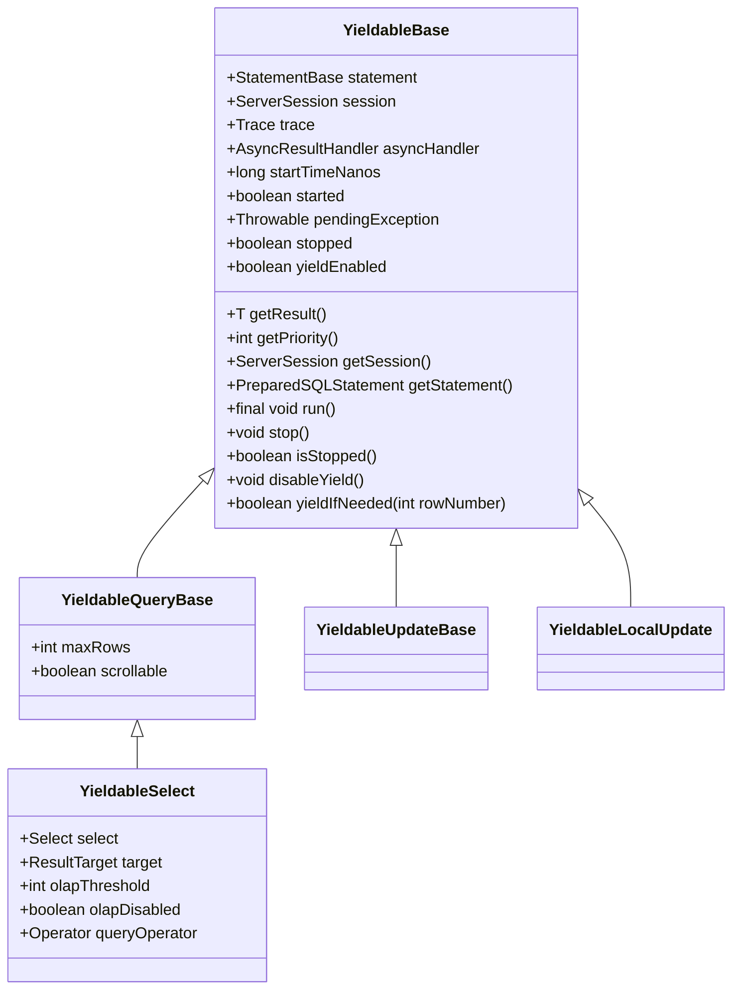
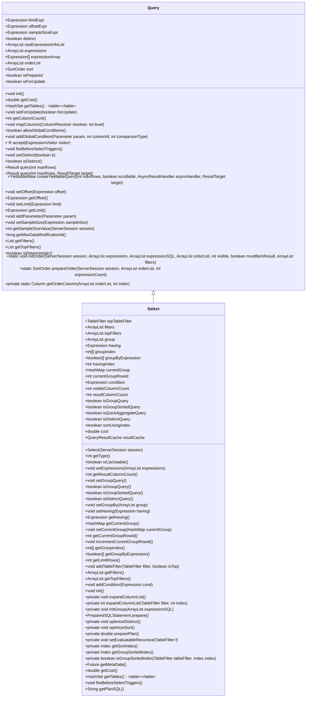
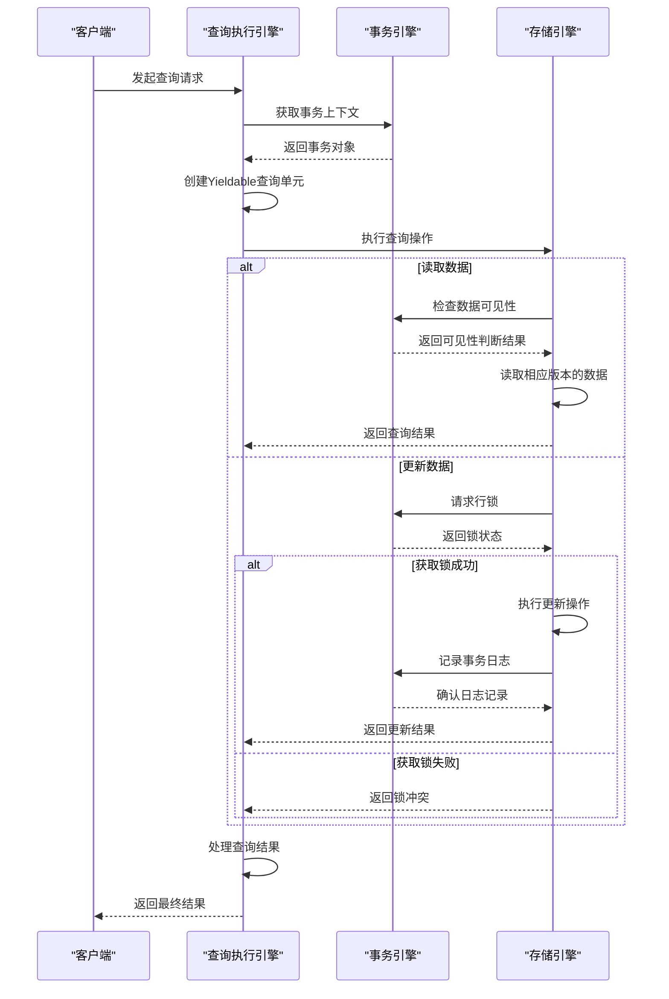
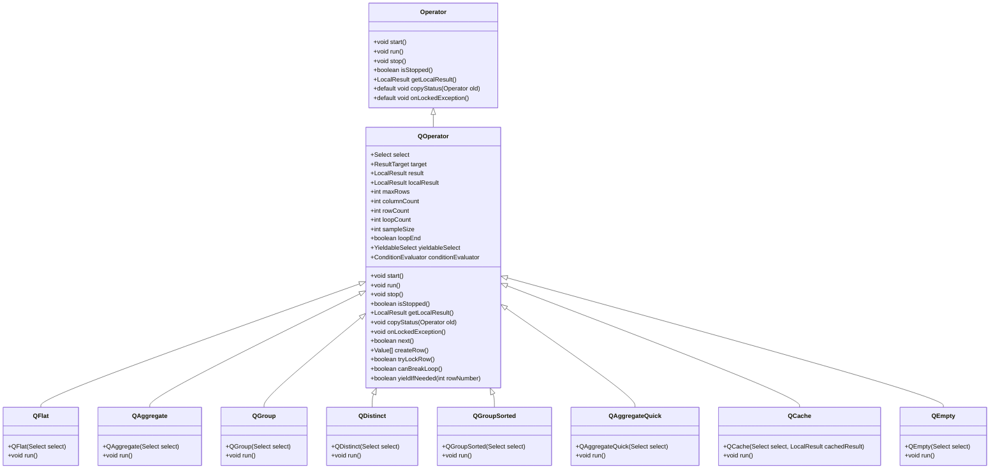
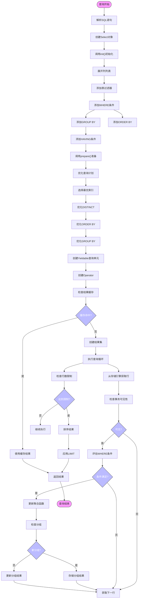

# 查询执行

<cite>
**本文档引用的文件**  
- [YieldableBase.java](https://github.com/lealone/Lealone/blob/master/lealone-sql/src/main/java/com/lealone/sql/executor/YieldableBase.java)
- [Select.java](https://github.com/lealone/Lealone/blob/master/lealone-sql/src/main/java/com/lealone/sql/query/Select.java)
- [YieldableSelect.java](https://github.com/lealone/Lealone/blob/master/lealone-sql/src/main/java/com/lealone/sql/query/YieldableSelect.java)
- [YieldableQueryBase.java](https://github.com/lealone/Lealone/blob/master/lealone-sql/src/main/java/com/lealone/sql/query/YieldableQueryBase.java)
- [Query.java](https://github.com/lealone/Lealone/blob/master/lealone-sql/src/main/java/com/lealone/sql/query/Query.java)
- [Operator.java](https://github.com/lealone/Lealone/blob/master/lealone-sql/src/main/java/com/lealone/sql/operator/Operator.java)
- [QFlat.java](https://github.com/lealone/Lealone/blob/master/lealone-sql/src/main/java/com/lealone/sql/query/QFlat.java)
- [QAggregate.java](https://github.com/lealone/Lealone/blob/master/lealone-sql/src/main/java/com/lealone/sql/query/QAggregate.java)
- [QGroup.java](https://github.com/lealone/Lealone/blob/master/lealone-sql/src/main/java/com/lealone/sql/query/QGroup.java)
- [QDistinct.java](https://github.com/lealone/Lealone/blob/master/lealone-sql/src/main/java/com/lealone/sql/query/QDistinct.java)
- [QGroupSorted.java](https://github.com/lealone/Lealone/blob/master/lealone-sql/src/main/java/com/lealone/sql/query/QGroupSorted.java)
- [QAggregateQuick.java](https://github.com/lealone/Lealone/blob/master/lealone-sql/src/main/java/com/lealone/sql/query/QAggregateQuick.java)
- [QCache.java](https://github.com/lealone/Lealone/blob/master/lealone-sql/src/main/java/com/lealone/sql/query/QCache.java)
- [QEmpty.java](https://github.com/lealone/Lealone/blob/master/lealone-sql/src/main/java/com/lealone/sql/query/QEmpty.java)
- [QOperator.java](https://github.com/lealone/Lealone/blob/master/lealone-sql/src/main/java/com/lealone/sql/query/QOperator.java)
- [QueryResultCache.java](https://github.com/lealone/Lealone/blob/master/lealone-sql/src/main/java/com/lealone/sql/query/QueryResultCache.java)
- [AOTransaction.java](https://github.com/lealone/Lealone/blob/master/lealone-aote/src/main/java/com/lealone/transaction/aote/AOTransaction.java)
- [AOTransactionEngine.java](https://github.com/lealone/Lealone/blob/master/lealone-aote/src/main/java/com/lealone/transaction/aote/AOTransactionEngine.java)
- [AOTransactionMap.java](https://github.com/lealone/Lealone/blob/master/lealone-aote/src/main/java/com/lealone/transaction/aote/AOTransactionMap.java)
</cite>

## 目录
1. [引言](#引言)
2. [渐进式查询执行机制](#渐进式查询执行机制)
3. [查询接口与执行流程](#查询接口与执行流程)
4. [Select查询实现](#select查询实现)
5. [执行引擎与事务引擎协同](#执行引擎与事务引擎协同)
6. [自定义查询执行策略扩展](#自定义查询执行策略扩展)
7. [查询执行性能监控](#查询执行性能监控)
8. [复杂查询执行过程跟踪示例](#复杂查询执行过程跟踪示例)
9. [结论](#结论)

## 引言

Lealone数据库的查询执行引擎设计旨在支持高并发场景下的公平调度，通过将长时间运行的查询分解为可暂停的执行单元来实现渐进式查询执行。本文档深入解析YieldableBase实现的这一机制，说明Query接口的执行流程和Select查询的具体实现，解释执行引擎如何与事务引擎协同工作以确保查询的隔离性和一致性，并为开发者提供自定义查询执行策略的扩展点以及如何监控查询执行性能。

**本节不分析具体源文件，因此不提供源文件引用**

## 渐进式查询执行机制

Lealone查询执行引擎的核心是YieldableBase类，它实现了渐进式查询执行机制，将长时间运行的查询分解为可暂停的执行单元，支持高并发场景下的公平调度。



**图1：渐进式查询执行机制类图**

**图源**  
- [YieldableBase.java](https://github.com/lealone/Lealone/blob/master/lealone-sql/src/main/java/com/lealone/sql/executor/YieldableBase.java)
- [YieldableQueryBase.java](https://github.com/lealone/Lealone/blob/master/lealone-sql/src/main/java/com/lealone/sql/query/YieldableQueryBase.java)
- [YieldableSelect.java](https://github.com/lealone/Lealone/blob/master/lealone-sql/src/main/java/com/lealone/sql/query/YieldableSelect.java)

**节源**  
- [YieldableBase.java](https://github.com/lealone/Lealone/blob/master/lealone-sql/src/main/java/com/lealone/sql/executor/YieldableBase.java#L26-L193)

### YieldableBase实现原理

YieldableBase作为所有可暂停执行单元的基类，通过以下机制实现渐进式查询执行：

1. **执行状态管理**：维护查询的执行状态，包括开始时间、是否已启动、是否已停止等
2. **异常处理**：统一处理执行过程中的异常，确保查询的健壮性
3. **执行调度**：通过run()方法实现查询的执行循环，支持在适当时机暂停执行
4. **让出执行权**：通过yieldIfNeeded()方法在执行过程中适时让出CPU，支持高并发场景下的公平调度

YieldableBase的run()方法是渐进式执行的核心，它在一个循环中调用executeInternal()方法执行查询逻辑，同时检查是否需要暂停执行。当查询需要暂停时，会设置会话状态为STATEMENT_YIELDED并返回，从而让出执行权给其他查询。

### 执行单元的生命周期

渐进式查询执行单元的生命周期包括以下阶段：

1. **初始化**：创建Yieldable实例，设置查询语句、会话、异步处理器等
2. **启动**：调用start()方法，设置开始时间，初始化查询状态
3. **执行**：在run()方法中循环调用executeInternal()执行查询逻辑
4. **暂停**：在适当时机调用yieldIfNeeded()让出执行权
5. **恢复**：当调度器再次分配执行权时，从上次暂停点继续执行
6. **完成**：查询执行完成后调用stop()方法清理资源

这种生命周期管理机制使得长时间运行的查询可以被分解为多个小的执行单元，在高并发场景下能够公平地分享CPU资源，避免单个查询长时间占用执行线程。

## 查询接口与执行流程

Lealone查询执行引擎通过Query接口定义了查询的基本行为和执行流程，为各种查询类型提供了统一的执行框架。



**图2：查询接口与Select查询实现类图**

**图源**  
- [Query.java](https://github.com/lealone/Lealone/blob/master/lealone-sql/src/main/java/com/lealone/sql/query/Query.java)
- [Select.java](https://github.com/lealone/Lealone/blob/master/lealone-sql/src/main/java/com/lealone/sql/query/Select.java)

**节源**  
- [Query.java](https://github.com/lealone/Lealone/blob/master/lealone-sql/src/main/java/com/lealone/sql/query/Query.java#L45-L496)

### 查询执行流程

Lealone查询的执行流程遵循以下步骤：

1. **解析与初始化**：SQL解析器将SQL语句解析为抽象语法树，创建相应的查询对象并调用init()方法进行初始化
2. **准备阶段**：调用prepare()方法优化查询计划，选择合适的索引，准备执行环境
3. **创建可执行单元**：调用createYieldableQuery()方法创建Yieldable查询执行单元
4. **同步或异步执行**：通过query()方法同步执行查询，或通过异步处理器异步执行
5. **结果返回**：将查询结果返回给客户端

查询执行流程的关键在于createYieldableQuery()方法，它将查询对象转换为可暂停的执行单元，为渐进式执行提供了基础。

### 查询优化策略

Lealone查询执行引擎在prepare()阶段实施多种优化策略：

1. **聚合查询优化**：对min、max、count等聚合函数进行特殊优化
2. **去重优化**：对distinct查询选择合适的索引以避免额外的排序操作
3. **排序优化**：对order by查询选择合适的索引以避免额外的排序操作
4. **分组优化**：对group by查询选择合适的索引以实现分组排序

这些优化策略通过分析查询条件、索引可用性和数据分布来选择最优的执行计划，显著提高了查询性能。

## Select查询实现

Select查询是Lealone中最基本的查询类型，其实现涵盖了SQL查询的各个方面，包括列选择、条件过滤、排序、分组和聚合等。

### Select查询的组件结构

Select查询由多个组件构成，每个组件负责查询的一个特定方面：

1. **表达式列表**：存储SELECT子句中的所有表达式
2. **表过滤器**：管理FROM子句中的表及其连接关系
3. **条件表达式**：存储WHERE子句中的过滤条件
4. **排序信息**：存储ORDER BY子句中的排序要求
5. **分组信息**：存储GROUP BY子句中的分组要求
6. **聚合信息**：存储HAVING子句中的聚合条件

这些组件协同工作，共同完成Select查询的执行。

### 查询计划生成

Select查询的执行计划生成过程在preparePlan()方法中实现：

1. **单表查询优化**：对于单表查询，直接使用表的主索引或最优索引
2. **多表查询优化**：对于多表查询，使用Optimizer类进行查询优化，选择最优的表连接顺序和索引

查询计划的生成考虑了多种因素，包括表的大小、索引的选择性、连接条件等，以选择最优的执行策略。

### 特殊查询优化

Select查询实现了多种特殊查询的优化：

#### 去重查询优化

对于distinct查询，Lealone通过optimizeDistinct()方法进行优化：

1. **单字段去重**：如果去重字段有合适的索引且选择性较高，则使用该索引避免额外的排序操作
2. **多字段去重**：如果多个去重字段组合有合适的复合索引，则使用该索引

#### 排序查询优化

对于order by查询，Lealone通过optimizeSort()方法进行优化：

1. **索引排序**：如果排序字段有合适的索引，则使用该索引避免额外的排序操作
2. **索引替换**：如果现有索引与排序要求部分匹配，则考虑替换为更合适的索引

#### 分组查询优化

对于group by查询，Lealone通过getGroupSortedIndex()方法进行优化：

1. **分组排序索引**：如果分组字段有合适的索引，则使用该索引实现分组排序
2. **连续性检查**：确保索引的前导列都包含在分组字段中

这些优化策略显著提高了特殊查询的执行效率，避免了不必要的排序和去重操作。

**节源**  
- [Select.java](https://github.com/lealone/Lealone/blob/master/lealone-sql/src/main/java/com/lealone/sql/query/Select.java#L66-L800)

## 执行引擎与事务引擎协同

Lealone查询执行引擎与事务引擎紧密协同，确保查询的隔离性和一致性。这种协同工作主要体现在查询执行过程中的事务管理、锁机制和版本控制等方面。



**图3：查询执行引擎与事务引擎协同工作序列图**

**图源**  
- [YieldableSelect.java](https://github.com/lealone/Lealone/blob/master/lealone-sql/src/main/java/com/lealone/sql/query/YieldableSelect.java)
- [AOTransaction.java](https://github.com/lealone/Lealone/blob/master/lealone-aote/src/main/java/com/lealone/transaction/aote/AOTransaction.java)
- [AOTransactionEngine.java](https://github.com/lealone/Lealone/blob/master/lealone-aote/src/main/java/com/lealone/transaction/aote/AOTransactionEngine.java)

**节源**  
- [YieldableSelect.java](https://github.com/lealone/Lealone/blob/master/lealone-sql/src/main/java/com/lealone/sql/query/YieldableSelect.java#L20-L213)
- [AOTransaction.java](https://github.com/lealone/Lealone/blob/master/lealone-aote/src/main/java/com/lealone/transaction/aote/AOTransaction.java)
- [AOTransactionEngine.java](https://github.com/lealone/Lealone/blob/master/lealone-aote/src/main/java/com/lealone/transaction/aote/AOTransactionEngine.java)

### 事务隔离性保障

Lealone通过多版本并发控制(MVCC)机制保障查询的隔离性：

1. **事务快照**：每个事务在开始时获取一个全局一致的快照，确保在整个事务执行过程中看到的数据是一致的
2. **版本可见性**：查询执行时，事务引擎根据事务快照判断数据版本的可见性，只返回对当前事务可见的数据版本
3. **写入冲突检测**：在更新数据时，检查是否存在写-写冲突，确保事务的串行化语义

这种MVCC机制允许多个事务并发执行，同时保证了事务的隔离性，避免了传统锁机制导致的性能瓶颈。

### 锁机制协同

查询执行引擎与事务引擎在锁机制方面紧密协同：

1. **共享锁**：对于只读查询，获取共享锁，允许多个查询并发读取同一数据
2. **排他锁**：对于更新查询，获取排他锁，防止其他事务同时修改同一数据
3. **锁升级**：在必要时，将共享锁升级为排他锁，支持读-写转换
4. **死锁检测**：事务引擎检测并处理死锁情况，确保系统的稳定性

这种锁机制协同确保了数据的一致性和完整性，同时最大限度地提高了并发性能。

### 版本控制与回滚

Lealone的版本控制机制为查询执行提供了强大的支持：

1. **多版本存储**：每个数据项存储多个版本，每个版本关联一个事务ID
2. **版本清理**：事务引擎定期清理不再需要的旧版本，回收存储空间
3. **回滚支持**：通过保留旧版本，支持事务回滚操作，恢复到之前的状态
4. **快照隔离**：基于版本控制实现快照隔离级别，提供高并发性能

这种版本控制机制使得Lealone能够在高并发场景下提供高性能的查询服务，同时保证数据的一致性和可靠性。

## 自定义查询执行策略扩展

Lealone查询执行引擎提供了灵活的扩展机制，允许开发者自定义查询执行策略，以满足特定的性能需求或业务场景。

### Operator扩展点

Lealone通过Operator接口提供了查询执行策略的扩展点：



**图4：查询执行策略扩展点类图**

**图源**  
- [Operator.java](https://github.com/lealone/Lealone/blob/master/lealone-sql/src/main/java/com/lealone/sql/operator/Operator.java)
- [QOperator.java](https://github.com/lealone/Lealone/blob/master/lealone-sql/src/main/java/com/lealone/sql/query/QOperator.java)
- [QFlat.java](https://github.com/lealone/Lealone/blob/master/lealone-sql/src/main/java/com/lealone/sql/query/QFlat.java)
- [QAggregate.java](https://github.com/lealone/Lealone/blob/master/lealone-sql/src/main/java/com/lealone/sql/query/QAggregate.java)
- [QGroup.java](https://github.com/lealone/Lealone/blob/master/lealone-sql/src/main/java/com/lealone/sql/query/QGroup.java)
- [QDistinct.java](https://github.com/lealone/Lealone/blob/master/lealone-sql/src/main/java/com/lealone/sql/query/QDistinct.java)
- [QGroupSorted.java](https://github.com/lealone/Lealone/blob/master/lealone-sql/src/main/java/com/lealone/sql/query/QGroupSorted.java)
- [QAggregateQuick.java](https://github.com/lealone/Lealone/blob/master/lealone-sql/src/main/java/com/lealone/sql/query/QAggregateQuick.java)
- [QCache.java](https://github.com/lealone/Lealone/blob/master/lealone-sql/src/main/java/com/lealone/sql/query/QCache.java)
- [QEmpty.java](https://github.com/lealone/Lealone/blob/master/lealone-sql/src/main/java/com/lealone/sql/query/QEmpty.java)

**节源**  
- [Operator.java](https://github.com/lealone/Lealone/blob/master/lealone-sql/src/main/java/com/lealone/sql/operator/Operator.java#L10-L28)
- [QOperator.java](https://github.com/lealone/Lealone/blob/master/lealone-sql/src/main/java/com/lealone/sql/query/QOperator.java)
- [QFlat.java](https://github.com/lealone/Lealone/blob/master/lealone-sql/src/main/java/com/lealone/sql/query/QFlat.java#L11-L38)
- [QAggregate.java](https://github.com/lealone/Lealone/blob/master/lealone-sql/src/main/java/com/lealone/sql/query/QAggregate.java#L14-L49)
- [QGroup.java](https://github.com/lealone/Lealone/blob/master/lealone-sql/src/main/java/com/lealone/sql/query/QGroup.java)
- [QDistinct.java](https://github.com/lealone/Lealone/blob/master/lealone-sql/src/main/java/com/lealone/sql/query/QDistinct.java)
- [QGroupSorted.java](https://github.com/lealone/Lealone/blob/master/lealone-sql/src/main/java/com/lealone/sql/query/QGroupSorted.java)
- [QAggregateQuick.java](https://github.com/lealone/Lealone/blob/master/lealone-sql/src/main/java/com/lealone/sql/query/QAggregateQuick.java)
- [QCache.java](https://github.com/lealone/Lealone/blob/master/lealone-sql/src/main/java/com/lealone/sql/query/QCache.java)
- [QEmpty.java](https://github.com/lealone/Lealone/blob/master/lealone-sql/src/main/java/com/lealone/sql/query/QEmpty.java)

### 自定义Operator实现

开发者可以通过实现Operator接口或继承QOperator类来创建自定义的查询执行策略：

1. **实现Operator接口**：完全自定义执行逻辑，适用于复杂的查询优化需求
2. **继承QOperator类**：在现有执行逻辑基础上进行扩展或修改，适用于特定场景的优化

自定义Operator可以针对特定的查询模式、数据分布或业务需求进行优化，提供比默认执行策略更好的性能。

### OLAP执行策略

Lealone内置了OLAP执行策略，通过YieldableSelect的createOlapOperator()方法实现：

1. **阈值检测**：当查询返回的行数超过预设阈值时，自动切换到OLAP执行模式
2. **插件化实现**：OLAP执行策略通过插件机制实现，支持灵活的扩展和替换
3. **性能优化**：OLAP执行策略针对大数据量分析查询进行了专门优化，提高分析查询的性能

开发者可以基于此机制实现自己的OLAP执行策略，以满足特定的分析需求。

## 查询执行性能监控

Lealone查询执行引擎提供了全面的性能监控机制，帮助开发者和管理员了解查询执行的性能特征，识别性能瓶颈，优化查询性能。

### 查询统计信息

Lealone通过QueryStatisticsData类收集和管理查询统计信息：

1. **执行时间**：记录查询的执行时间，识别慢查询
2. **执行次数**：记录查询的执行次数，识别高频查询
3. **资源消耗**：记录查询的CPU、内存等资源消耗
4. **执行计划**：记录查询的执行计划，分析执行效率

这些统计信息为查询性能分析提供了基础数据，帮助识别性能问题。

### 慢查询检测

Lealone内置了慢查询检测机制，在YieldableBase中实现：

1. **阈值设置**：通过Constants.SLOW_QUERY_LIMIT_MS常量定义慢查询阈值
2. **执行时间记录**：在查询开始和结束时记录时间戳，计算执行时间
3. **日志记录**：当查询执行时间超过阈值时，在日志中记录慢查询信息

慢查询检测机制帮助及时发现性能问题，为查询优化提供依据。

### 执行计划缓存

Lealone通过QueryResultCache实现执行计划缓存：

1. **结果缓存**：缓存查询结果，避免重复执行相同的查询
2. **计划重用**：重用已优化的查询计划，减少查询优化开销
3. **缓存失效**：在数据变更时及时失效相关缓存，保证数据一致性

执行计划缓存显著提高了重复查询的性能，减少了查询优化的开销。

### 性能监控API

Lealone提供了性能监控API，允许开发者集成自定义的监控工具：

1. **事件监听**：通过DatabaseEventListener接口监听查询执行事件
2. **统计信息访问**：通过公开的API访问查询统计信息
3. **自定义监控**：允许开发者实现自定义的监控逻辑，集成到现有监控系统

这些API为构建全面的性能监控系统提供了支持，帮助实现精细化的性能管理。

**节源**  
- [YieldableBase.java](https://github.com/lealone/Lealone/blob/master/lealone-sql/src/main/java/com/lealone/sql/executor/YieldableBase.java#L167-L173)
- [QueryResultCache.java](https://github.com/lealone/Lealone/blob/master/lealone-sql/src/main/java/com/lealone/sql/query/QueryResultCache.java)

## 复杂查询执行过程跟踪示例

为了更好地理解Lealone查询执行引擎的工作机制，我们通过一个复杂查询的执行过程跟踪示例来展示各个组件的协同工作。

### 示例查询

考虑以下复杂查询：

```sql
SELECT DISTINCT customer_id, SUM(order_amount) as total_amount
FROM orders 
WHERE order_date >= '2023-01-01' 
  AND order_date < '2024-01-01'
  AND status = 'completed'
GROUP BY customer_id
HAVING SUM(order_amount) > 10000
ORDER BY total_amount DESC
LIMIT 100;
```

这个查询包含了去重、聚合、分组、过滤、排序和限制行数等多个复杂特性。

### 执行过程跟踪



**图5：复杂查询执行过程跟踪流程图**

**图源**  
- [Select.java](https://github.com/lealone/Lealone/blob/master/lealone-sql/src/main/java/com/lealone/sql/query/Select.java)
- [YieldableSelect.java](https://github.com/lealone/Lealone/blob/master/lealone-sql/src/main/java/com/lealone/sql/query/YieldableSelect.java)
- [QOperator.java](https://github.com/lealone/Lealone/blob/master/lealone-sql/src/main/java/com/lealone/sql/query/QOperator.java)

**节源**  
- [Select.java](https://github.com/lealone/Lealone/blob/master/lealone-sql/src/main/java/com/lealone/sql/query/Select.java)
- [YieldableSelect.java](https://github.com/lealone/Lealone/blob/master/lealone-sql/src/main/java/com/lealone/sql/query/YieldableSelect.java)
- [QOperator.java](https://github.com/lealone/Lealone/blob/master/lealone-sql/src/main/java/com/lealone/sql/query/QOperator.java)

### 执行过程分析

这个复杂查询的执行过程展示了Lealone查询执行引擎的多个关键特性：

1. **初始化阶段**：查询对象创建后，通过init()方法初始化各个组件，包括展开列列表、添加表过滤器、添加各种条件等
2. **准备阶段**：通过prepare()方法优化查询计划，选择最优的执行策略，包括索引选择、去重优化、排序优化等
3. **执行阶段**：创建Yieldable查询单元和相应的Operator，开始执行查询循环
4. **结果处理**：在执行循环中，逐行处理数据，应用各种条件和聚合函数，最终生成查询结果

在整个执行过程中，查询执行引擎与事务引擎协同工作，确保数据的隔离性和一致性，同时通过渐进式执行机制支持高并发场景下的公平调度。

## 结论

Lealone查询执行引擎通过YieldableBase实现的渐进式查询执行机制，成功地将长时间运行的查询分解为可暂停的执行单元，支持高并发场景下的公平调度。Query接口定义了统一的查询执行流程，Select查询的具体实现涵盖了SQL查询的各个方面，并通过多种优化策略提高查询性能。

执行引擎与事务引擎的紧密协同确保了查询的隔离性和一致性，通过MVCC机制、锁机制和版本控制提供了强大的事务支持。同时，Lealone提供了灵活的扩展点，允许开发者自定义查询执行策略，以满足特定的性能需求或业务场景。

查询执行性能监控机制为性能分析和优化提供了全面的支持，包括查询统计信息、慢查询检测、执行计划缓存和性能监控API等。通过复杂查询执行过程的跟踪示例，我们深入理解了各个组件的协同工作方式和执行流程。

总的来说，Lealone查询执行引擎设计精巧，功能全面，性能优越，为构建高性能的数据库应用提供了坚实的基础。

**本节不分析具体源文件，因此不提供源文件引用**