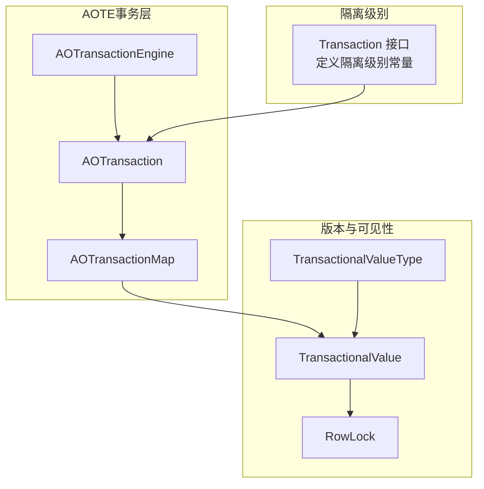
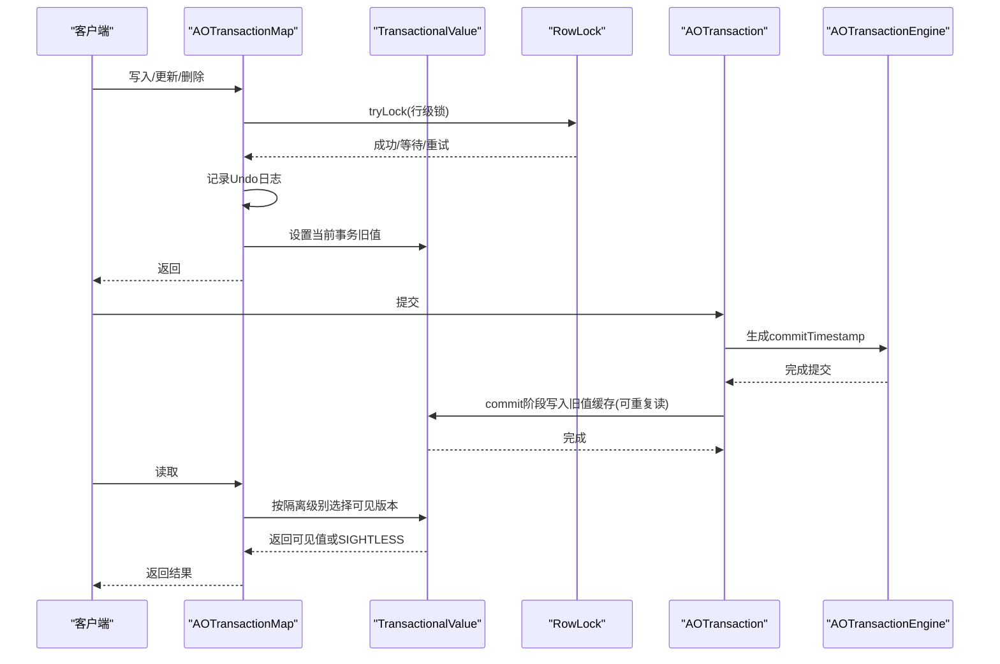
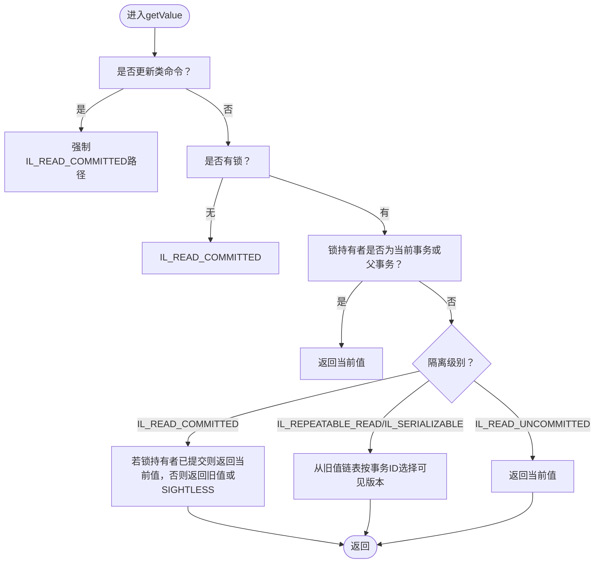
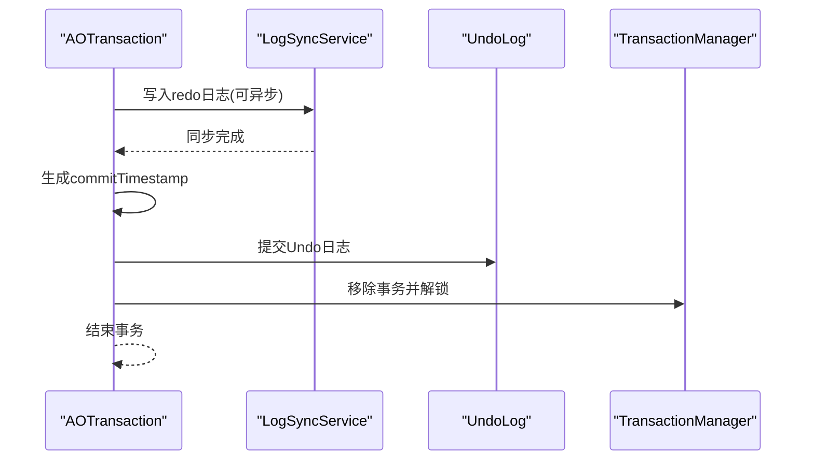
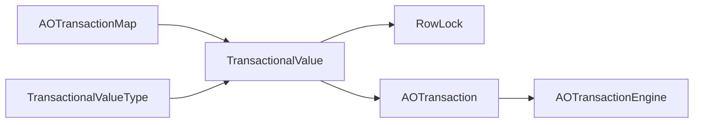
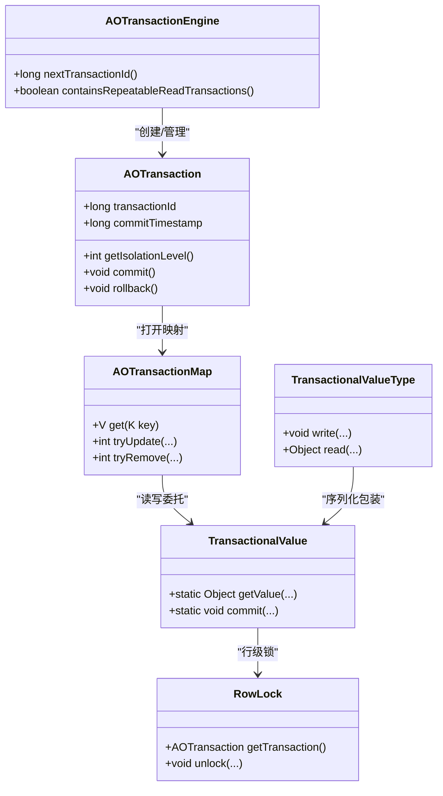

# MVCC实现机制

<cite>
**本文引用的文件**
- [TransactionalValue.java](file://lealone-aote/src/main/java/com/lealone/transaction/aote/TransactionalValue.java)
- [AOTransaction.java](file://lealone-aote/src/main/java/com/lealone/transaction/aote/AOTransaction.java)
- [AOTransactionEngine.java](file://lealone-aote/src/main/java/com/lealone/transaction/aote/AOTransactionEngine.java)
- [AOTransactionMap.java](file://lealone-aote/src/main/java/com/lealone/transaction/aote/AOTransactionMap.java)
- [TransactionalValueType.java](file://lealone-aote/src/main/java/com/lealone/transaction/aote/TransactionalValueType.java)
- [RowLock.java](file://lealone-aote/src/main/java/com/lealone/transaction/aote/lock/RowLock.java)
- [Transaction.java](file://lealone-sci/src/main/java/com/lealone/transaction/Transaction.java)
- [IsolationLevelTest.java](file://lealone-test/src/test/java/com/lealone/test/aote/IsolationLevelTest.java)
- [ReaCommittedTest.java](file://lealone-test/src/test/java/com/lealone/test/sql/transaction/ReaCommittedTest.java)
- [RepeatableReadTest.java](file://lealone-test/src/test/java/com/lealone/test/sql/transaction/RepeatableReadTest.java)
- [TransactionalValueTest.java](file://lealone-test/src/test/java/com/lealone/test/aote/TransactionalValueTest.java)
</cite>

## 目录
1. [简介](#简介)
2. [项目结构](#项目结构)
3. [核心组件](#核心组件)
4. [架构总览](#架构总览)
5. [详细组件分析](#详细组件分析)
6. [依赖关系分析](#依赖关系分析)
7. [性能考量](#性能考量)
8. [故障排查指南](#故障排查指南)
9. [结论](#结论)
10. [附录](#附录)

## 简介
本文件系统性解析Lealone数据库中基于AOTE（Async Adaptive Optimization Transaction Engine）的MVCC（多版本并发控制）实现机制，重点覆盖：
- TransactionalValue如何存储数据的多个版本
- AOTransaction如何通过时间戳和事务ID管理版本可见性
- 读已提交（Read Committed）与可重复读（Repeatable Read）隔离级别的实现差异
- 结合测试用例展示事务在读取和写入时的版本选择逻辑
- 分析高并发场景下的性能优势与版本膨胀问题，并给出优化策略

## 项目结构
Lealone的MVCC实现主要集中在AOTE模块，涉及事务、锁、存储映射以及类型包装等组件：
- 事务与引擎：AOTransaction、AOTransactionEngine
- 版本与可见性：TransactionalValue、TransactionalValueType
- 行级锁：RowLock
- 事务映射封装：AOTransactionMap
- 隔离级别常量：Transaction
- 测试验证：IsolationLevelTest、ReaCommittedTest、RepeatableReadTest、TransactionalValueTest

图表来源
- [AOTransactionEngine.java](file://lealone-aote/src/main/java/com/lealone/transaction/aote/AOTransactionEngine.java#L1-L120)
- [AOTransaction.java](file://lealone-aote/src/main/java/com/lealone/transaction/aote/AOTransaction.java#L1-L120)
- [AOTransactionMap.java](file://lealone-aote/src/main/java/com/lealone/transaction/aote/AOTransactionMap.java#L1-L120)
- [TransactionalValue.java](file://lealone-aote/src/main/java/com/lealone/transaction/aote/TransactionalValue.java#L1-L120)
- [TransactionalValueType.java](file://lealone-aote/src/main/java/com/lealone/transaction/aote/TransactionalValueType.java#L1-L80)
- [RowLock.java](file://lealone-aote/src/main/java/com/lealone/transaction/aote/lock/RowLock.java#L1-L60)
- [Transaction.java](file://lealone-sci/src/main/java/com/lealone/transaction/Transaction.java#L1-L47)

章节来源
- [AOTransactionEngine.java](file://lealone-aote/src/main/java/com/lealone/transaction/aote/AOTransactionEngine.java#L1-L120)
- [AOTransaction.java](file://lealone-aote/src/main/java/com/lealone/transaction/aote/AOTransaction.java#L1-L120)
- [AOTransactionMap.java](file://lealone-aote/src/main/java/com/lealone/transaction/aote/AOTransactionMap.java#L1-L120)
- [TransactionalValue.java](file://lealone-aote/src/main/java/com/lealone/transaction/aote/TransactionalValue.java#L1-L120)
- [TransactionalValueType.java](file://lealone-aote/src/main/java/com/lealone/transaction/aote/TransactionalValueType.java#L1-L80)
- [RowLock.java](file://lealone-aote/src/main/java/com/lealone/transaction/aote/lock/RowLock.java#L1-L60)
- [Transaction.java](file://lealone-sci/src/main/java/com/lealone/transaction/Transaction.java#L1-L47)

## 核心组件
- TransactionalValue：记录的多版本容器，包含当前值、旧值链表、可见性标记（SIGHTLESS）、行锁集成与版本写入/读取逻辑。
- AOTransaction：事务实体，持有事务ID、提交时间戳、隔离级别、Undo日志、会话与调度器等；负责提交/回滚、等待/唤醒、保存点等。
- AOTransactionEngine：事务引擎，维护事务计数、生成事务ID、管理日志同步服务、回收与检查点。
- AOTransactionMap：事务感知的存储映射，封装读写、加锁、回滚日志、游标过滤等。
- TransactionalValueType：值类型包装器，将原始值类型与TransactionalValue结合，实现版本化序列化/反序列化。
- RowLock：行级锁，与TransactionalValue配合实现行级并发控制与可见性判定。

章节来源
- [TransactionalValue.java](file://lealone-aote/src/main/java/com/lealone/transaction/aote/TransactionalValue.java#L1-L200)
- [AOTransaction.java](file://lealone-aote/src/main/java/com/lealone/transaction/aote/AOTransaction.java#L1-L200)
- [AOTransactionEngine.java](file://lealone-aote/src/main/java/com/lealone/transaction/aote/AOTransactionEngine.java#L1-L120)
- [AOTransactionMap.java](file://lealone-aote/src/main/java/com/lealone/transaction/aote/AOTransactionMap.java#L1-L120)
- [TransactionalValueType.java](file://lealone-aote/src/main/java/com/lealone/transaction/aote/TransactionalValueType.java#L1-L120)
- [RowLock.java](file://lealone-aote/src/main/java/com/lealone/transaction/aote/lock/RowLock.java#L1-L80)

## 架构总览
MVCC在Lealone中的关键流程：
- 写入：AOTransactionMap在写入前尝试加锁，记录Undo日志，设置当前事务的旧值，必要时将旧值缓存至旧值链表。
- 提交：AOTransactionEngine生成commitTimestamp，TransactionalValue根据是否可重复读事务决定是否保留旧值链表，以便后续事务按时间点读取。
- 读取：AOTransactionMap委托TransactionalValue按隔离级别选择可见版本，若无可见版本则返回SIGHTLESS（表示“看不见”），上层转换为null。

图表来源
- [AOTransactionMap.java](file://lealone-aote/src/main/java/com/lealone/transaction/aote/AOTransactionMap.java#L370-L430)
- [TransactionalValue.java](file://lealone-aote/src/main/java/com/lealone/transaction/aote/TransactionalValue.java#L121-L196)
- [AOTransaction.java](file://lealone-aote/src/main/java/com/lealone/transaction/aote/AOTransaction.java#L250-L300)
- [AOTransactionEngine.java](file://lealone-aote/src/main/java/com/lealone/transaction/aote/AOTransactionEngine.java#L190-L210)

## 详细组件分析

### TransactionalValue：多版本存储与可见性
- 多版本存储
  - 当前值：由Lockable持有的值。
  - 旧值链表：在提交时，若存在可重复读事务，会将旧值以链表形式缓存，节点包含事务提交时间戳（commitTimestamp）与旧值。
  - 可见性标记：SIGHTLESS用于表示“当前事务不可见”，上层读取时转换为null。
- 版本可见性选择
  - 读已提交（IL_READ_COMMITTED）：若当前事务执行的是更新类命令，则强制以读已提交视角读取最新版本；否则按事务ID与锁持有者判断。
  - 可重复读（IL_REPEATABLE_READ/IL_SERIALIZABLE）：使用事务ID与旧值链表进行比较，确保事务内多次读取一致。
  - 读未提交（IL_READ_UNCOMMITTED）：直接返回当前值。
- 行锁与事务ID
  - 通过RowLock与AOTransaction关联，获取事务ID与提交时间戳，用于版本选择。
- 序列化/反序列化
  - 通过TransactionalValueType包装，实现带版本信息的持久化与恢复。

图表来源
- [TransactionalValue.java](file://lealone-aote/src/main/java/com/lealone/transaction/aote/TransactionalValue.java#L121-L196)

章节来源
- [TransactionalValue.java](file://lealone-aote/src/main/java/com/lealone/transaction/aote/TransactionalValue.java#L1-L385)
- [RowLock.java](file://lealone-aote/src/main/java/com/lealone/transaction/aote/lock/RowLock.java#L1-L104)
- [TransactionalValueType.java](file://lealone-aote/src/main/java/com/lealone/transaction/aote/TransactionalValueType.java#L1-L159)

### AOTransaction：事务生命周期与提交时间戳
- 事务标识与隔离级别：持有事务ID与隔离级别，提供查询与变更能力。
- 提交时间戳：在redo日志同步完成后生成，作为可重复读的版本边界。
- 提交/回滚：写入redo日志，提交Undo日志，解锁并结束事务。
- 等待/唤醒：当遇到锁冲突时，将等待事务加入队列并在锁释放后通知重试。

图表来源
- [AOTransaction.java](file://lealone-aote/src/main/java/com/lealone/transaction/aote/AOTransaction.java#L222-L309)
- [AOTransactionEngine.java](file://lealone-aote/src/main/java/com/lealone/transaction/aote/AOTransactionEngine.java#L190-L210)

章节来源
- [AOTransaction.java](file://lealone-aote/src/main/java/com/lealone/transaction/aote/AOTransaction.java#L1-L461)
- [AOTransactionEngine.java](file://lealone-aote/src/main/java/com/lealone/transaction/aote/AOTransactionEngine.java#L1-L311)

### AOTransactionMap：事务感知的存储映射
- 读取：委托TransactionalValue按隔离级别选择可见值，若返回SIGHTLESS则转换为null。
- 写入：尝试加锁，记录Undo日志，设置当前事务旧值；插入/追加时同样记录Undo日志。
- 游标：过滤已标记删除的记录，保证事务视图一致性。
- 旧值缓存：提供从旧值链表中快速获取最近旧值的能力。

章节来源
- [AOTransactionMap.java](file://lealone-aote/src/main/java/com/lealone/transaction/aote/AOTransactionMap.java#L50-L120)
- [AOTransactionMap.java](file://lealone-aote/src/main/java/com/lealone/transaction/aote/AOTransactionMap.java#L370-L430)
- [AOTransactionMap.java](file://lealone-aote/src/main/java/com/lealone/transaction/aote/AOTransactionMap.java#L430-L520)

### TransactionalValueType：版本化类型包装
- 将原始值类型与TransactionalValue结合，实现版本化序列化/反序列化。
- 在写入时，根据是否字节存储选择写入未提交或已提交值。
- 在读取时，创建已提交的Lockable或直接返回值。

章节来源
- [TransactionalValueType.java](file://lealone-aote/src/main/java/com/lealone/transaction/aote/TransactionalValueType.java#L1-L159)

### 隔离级别实现差异
- 读已提交（IL_READ_COMMITTED）
  - 若当前事务执行更新类命令，强制以读已提交视角读取最新版本。
  - 否则：若锁持有者已提交，返回当前值；否则返回旧值或SIGHTLESS。
- 可重复读（IL_REPEATABLE_READ/IL_SERIALIZABLE）
  - 使用事务ID与旧值链表比较，确保事务内多次读取一致。
  - 若旧值链表为空，优先尝试锁持有者的旧值；否则返回当前值。
- 读未提交（IL_READ_UNCOMMITTED）
  - 直接返回当前值（包括未提交值）。

章节来源
- [TransactionalValue.java](file://lealone-aote/src/main/java/com/lealone/transaction/aote/TransactionalValue.java#L121-L196)
- [Transaction.java](file://lealone-sci/src/main/java/com/lealone/transaction/Transaction.java#L1-L47)

## 依赖关系分析
- 组件耦合
  - AOTransactionMap依赖TransactionalValue进行可见性判断与旧值缓存。
  - TransactionalValue依赖RowLock与AOTransaction获取事务上下文。
  - AOTransactionEngine负责事务ID生成与提交时间戳生成，影响版本可见性。
  - TransactionalValueType依赖TransactionalValue实现版本化序列化。
- 外部依赖
  - 日志同步服务（LogSyncService）与检查点（CheckpointService）保障提交顺序与持久化。
  - 存储映射（StorageMap）提供底层键值存储与游标能力。

图表来源
- [AOTransactionMap.java](file://lealone-aote/src/main/java/com/lealone/transaction/aote/AOTransactionMap.java#L1-L120)
- [TransactionalValue.java](file://lealone-aote/src/main/java/com/lealone/transaction/aote/TransactionalValue.java#L1-L120)
- [RowLock.java](file://lealone-aote/src/main/java/com/lealone/transaction/aote/lock/RowLock.java#L1-L60)
- [AOTransaction.java](file://lealone-aote/src/main/java/com/lealone/transaction/aote/AOTransaction.java#L1-L120)
- [AOTransactionEngine.java](file://lealone-aote/src/main/java/com/lealone/transaction/aote/AOTransactionEngine.java#L1-L120)
- [TransactionalValueType.java](file://lealone-aote/src/main/java/com/lealone/transaction/aote/TransactionalValueType.java#L1-L80)

章节来源
- [AOTransactionMap.java](file://lealone-aote/src/main/java/com/lealone/transaction/aote/AOTransactionMap.java#L1-L200)
- [TransactionalValue.java](file://lealone-aote/src/main/java/com/lealone/transaction/aote/TransactionalValue.java#L1-L200)
- [AOTransactionEngine.java](file://lealone-aote/src/main/java/com/lealone/transaction/aote/AOTransactionEngine.java#L1-L200)

## 性能考量
- 读取性能
  - 读已提交路径在更新类命令下直接读取最新版本，避免旧值链表查找，降低开销。
  - 可重复读通过旧值链表实现快照读，避免锁竞争，提升并发吞吐。
- 写入性能
  - 行级锁减少全局锁争用；Undo日志与异步日志同步提升写入吞吐。
  - 插入/追加不产生事务冲突，避免额外等待。
- 内存与版本膨胀
  - 为可重复读事务保留旧值链表，可能导致版本膨胀；可通过检查点与垃圾回收清理不再需要的旧版本。
  - 事务引擎维护可重复读事务计数，便于触发清理策略。

章节来源
- [AOTransactionEngine.java](file://lealone-aote/src/main/java/com/lealone/transaction/aote/AOTransactionEngine.java#L1-L120)
- [TransactionalValue.java](file://lealone-aote/src/main/java/com/lealone/transaction/aote/TransactionalValue.java#L258-L296)

## 故障排查指南
- 读取不到预期值
  - 检查隔离级别是否为IL_REPEATABLE_READ/IL_SERIALIZABLE，确认旧值链表是否存在。
  - 确认事务是否已提交，提交时间戳是否生成。
- 锁冲突导致等待
  - 观察AOTransaction的等待/唤醒逻辑，确认锁持有者是否长时间未释放。
- 版本膨胀
  - 检查是否存在大量可重复读事务长期运行，建议缩短事务生命周期或调整检查点策略。
  - 关注AOTransactionEngine的清理与回收机制。

章节来源
- [AOTransaction.java](file://lealone-aote/src/main/java/com/lealone/transaction/aote/AOTransaction.java#L311-L359)
- [AOTransactionEngine.java](file://lealone-aote/src/main/java/com/lealone/transaction/aote/AOTransactionEngine.java#L1-L120)
- [TransactionalValue.java](file://lealone-aote/src/main/java/com/lealone/transaction/aote/TransactionalValue.java#L258-L296)

## 结论
Lealone的AOTE实现了高效的MVCC机制：
- 通过TransactionalValue的旧值链表与RowLock的行级锁，结合AOTransaction的提交时间戳，精确控制版本可见性。
- 读已提交与可重复读在不同隔离级别下提供清晰的版本选择策略，满足高并发下的读写分离与一致性需求。
- 在高并发场景下，MVCC显著降低锁竞争，提升整体吞吐；但需关注版本膨胀问题并通过检查点与回收策略进行治理。

## 附录

### 代码级类图（映射实际源码）

图表来源
- [AOTransaction.java](file://lealone-aote/src/main/java/com/lealone/transaction/aote/AOTransaction.java#L1-L200)
- [AOTransactionEngine.java](file://lealone-aote/src/main/java/com/lealone/transaction/aote/AOTransactionEngine.java#L1-L120)
- [AOTransactionMap.java](file://lealone-aote/src/main/java/com/lealone/transaction/aote/AOTransactionMap.java#L1-L120)
- [TransactionalValue.java](file://lealone-aote/src/main/java/com/lealone/transaction/aote/TransactionalValue.java#L1-L200)
- [TransactionalValueType.java](file://lealone-aote/src/main/java/com/lealone/transaction/aote/TransactionalValueType.java#L1-L120)
- [RowLock.java](file://lealone-aote/src/main/java/com/lealone/transaction/aote/lock/RowLock.java#L1-L80)

### 隔离级别与可见性示例（测试驱动）
- 读未提交可见未提交值，其他级别不可见
- 读已提交在更新类命令下强制读最新版本
- 可重复读在事务内多次读取一致

章节来源
- [IsolationLevelTest.java](file://lealone-test/src/test/java/com/lealone/test/aote/IsolationLevelTest.java#L1-L44)
- [ReaCommittedTest.java](file://lealone-test/src/test/java/com/lealone/test/sql/transaction/ReaCommittedTest.java#L44-L86)
- [RepeatableReadTest.java](file://lealone-test/src/test/java/com/lealone/test/sql/transaction/RepeatableReadTest.java#L42-L82)
- [TransactionalValueTest.java](file://lealone-test/src/test/java/com/lealone/test/aote/TransactionalValueTest.java#L1-L185)