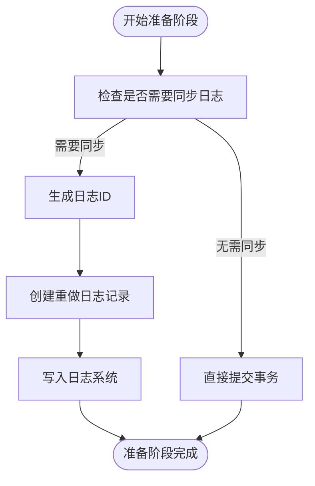
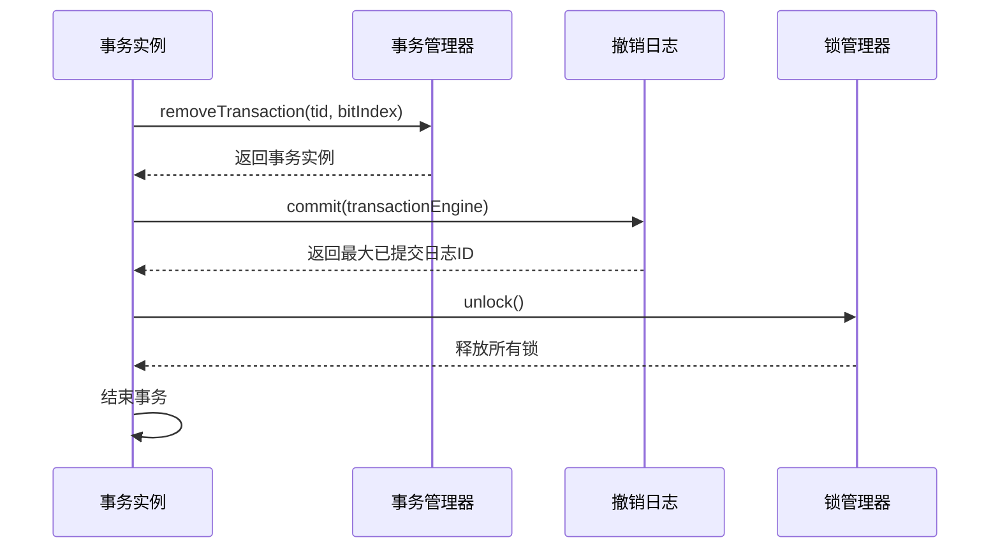
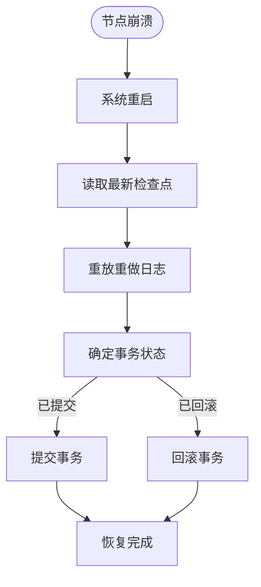
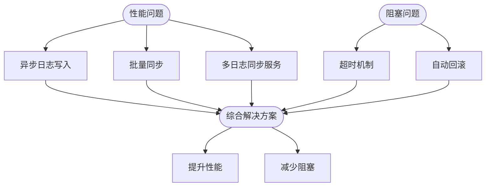

# 两阶段提交协议

<cite>
**本文档中引用的文件**   
- [AOTransaction.java](file://lealone-aote/src/main/java/com/lealone/transaction/aote/AOTransaction.java)
- [LogSyncService.java](file://lealone-aote/src/main/java/com/lealone/transaction/aote/log/LogSyncService.java)
- [RedoLog.java](file://lealone-aote/src/main/java/com/lealone/transaction/aote/log/RedoLog.java)
- [PendingTransaction.java](file://lealone-sci/src/main/java/com/lealone/transaction/PendingTransaction.java)
- [AOTransactionEngine.java](file://lealone-aote/src/main/java/com/lealone/transaction/aote/AOTransactionEngine.java)
- [InternalSchedulerBase.java](file://lealone-sci/src/main/java/com/lealone/db/scheduler/InternalSchedulerBase.java)
- [TransactionStatement.java](file://lealone-sql/src/main/java/com/lealone/sql/dml/TransactionStatement.java)
</cite>

## 目录
1. [引言](#引言)
2. [准备阶段（Prepare Phase）的实现](#准备阶段prepare-phase的实现)
3. [提交阶段（Commit Phase）的决策与持久化](#提交阶段commit-phase的决策与持久化)
4. [故障恢复策略](#故障恢复策略)
5. [分布式事务协调流程](#分布式事务协调流程)
6. [性能开销与阻塞问题](#性能开销与阻塞问题)
7. [结论](#结论)

## 引言

Lealone数据库的事务引擎采用两阶段提交（2PC）协议来确保分布式事务的原子性和一致性。尽管SQL层面的2PC语句已被废弃，但其核心机制在事务引擎内部依然发挥着关键作用。本文档将深入分析Lealone中2PC协议的实现细节，包括准备阶段的投票收集、提交阶段的状态持久化、故障恢复策略以及性能优化方案。

**Section sources**
- [TransactionStatement.java](file://lealone-sql/src/main/java/com/lealone/sql/dml/TransactionStatement.java#L82-L86)

## 准备阶段（Prepare Phase）的实现

在Lealone的事务引擎中，准备阶段的核心任务是收集所有参与者的投票并记录事务状态。这一过程通过`AOTransaction`类的`writeRedoLog`方法实现。当事务准备提交时，系统会生成重做日志（Redo Log）记录，并将其写入日志同步服务（LogSyncService）。

准备阶段的关键步骤如下：
1. 检查事务是否需要同步日志。
2. 生成唯一的日志ID。
3. 创建重做日志记录（RedoLogRecord），包含事务的撤销日志（UndoLog）。
4. 将日志记录异步或同步写入日志系统。



**Diagram sources **
- [AOTransaction.java](file://lealone-aote/src/main/java/com/lealone/transaction/aote/AOTransaction.java#L222-L247)

**Section sources**
- [AOTransaction.java](file://lealone-aote/src/main/java/com/lealone/transaction/aote/AOTransaction.java#L222-L247)

## 提交阶段（Commit Phase）的决策与持久化

提交阶段的决策过程和状态持久化机制是确保事务最终一致性的关键。在Lealone中，提交阶段由`commitFinal`方法主导，该方法负责最终提交事务并释放资源。

提交阶段的主要流程包括：
1. 从事务管理器中移除事务实例，避免并发提交。
2. 提交撤销日志（UndoLog），使事务状态变为结束状态。
3. 执行最终的解锁操作，释放所有持有的锁。

状态持久化通过重做日志（Redo Log）实现，确保即使在系统崩溃后也能恢复事务状态。日志同步服务（LogSyncService）负责将日志记录持久化到存储设备。



**Diagram sources **
- [AOTransaction.java](file://lealone-aote/src/main/java/com/lealone/transaction/aote/AOTransaction.java#L293-L301)

**Section sources**
- [AOTransaction.java](file://lealone-aote/src/main/java/com/lealone/transaction/aote/AOTransaction.java#L293-L301)

## 故障恢复策略

Lealone在各种故障场景下（如网络分区、节点崩溃）采用多种恢复策略来保证事务的一致性。核心机制包括：

1. **待定事务（PendingTransaction）管理**：通过`PendingTransaction`类跟踪尚未完成的事务，确保在网络恢复后能够继续处理。
2. **日志重放（Redo）机制**：在系统重启时，通过重放重做日志来恢复未完成的事务状态。
3. **检查点（Checkpoint）服务**：定期创建检查点，减少恢复时需要重放的日志量。

在节点崩溃的情况下，系统通过以下步骤恢复：
- 读取最新的检查点信息。
- 重放从检查点之后的所有重做日志。
- 提交或回滚未完成的事务。



**Diagram sources **
- [RedoLog.java](file://lealone-aote/src/main/java/com/lealone/transaction/aote/log/RedoLog.java#L422-L426)
- [PendingTransaction.java](file://lealone-sci/src/main/java/com/lealone/transaction/PendingTransaction.java#L1-L81)

**Section sources**
- [RedoLog.java](file://lealone-aote/src/main/java/com/lealone/transaction/aote/log/RedoLog.java#L422-L426)
- [PendingTransaction.java](file://lealone-sci/src/main/java/com/lealone/transaction/PendingTransaction.java#L1-L81)

## 分布式事务协调流程

Lealone的分布式事务协调流程结合了异步提交和日志同步机制。协调器（Coordinator）负责管理事务的生命周期，参与者（Participants）执行具体的数据库操作。

协调流程如下：
1. 客户端发起事务请求。
2. 协调器创建事务实例并分配唯一事务ID。
3. 参与者执行操作并记录撤销日志。
4. 准备阶段：协调器收集所有参与者的投票。
5. 提交阶段：协调器决定提交或回滚，并通知所有参与者。

```mermaid
sequenceDiagram
participant Client as 客户端
participant Coordinator as 协调器
participant Participant as 参与者
Client->>Coordinator : 开始事务
Coordinator->>Coordinator : 创建事务实例
Coordinator->>Participant : 执行操作
Participant->>Participant : 记录撤销日志
Coordinator->>Participant : 准备提交
Participant-->>Coordinator : 投票同意
Coordinator->>Participant : 提交事务
Participant-->>Coordinator : 确认提交
Coordinator-->>Client : 事务完成
```

**Diagram sources **
- [AOTransactionEngine.java](file://lealone-aote/src/main/java/com/lealone/transaction/aote/AOTransactionEngine.java#L196-L226)
- [InternalSchedulerBase.java](file://lealone-sci/src/main/java/com/lealone/db/scheduler/InternalSchedulerBase.java#L139-L154)

**Section sources**
- [AOTransactionEngine.java](file://lealone-aote/src/main/java/com/lealone/transaction/aote/AOTransactionEngine.java#L196-L226)
- [InternalSchedulerBase.java](file://lealone-sci/src/main/java/com/lealone/db/scheduler/InternalSchedulerBase.java#L139-L154)

## 性能开销与阻塞问题

两阶段提交协议虽然保证了强一致性，但也带来了显著的性能开销和潜在的阻塞问题。Lealone通过以下方式优化：

1. **异步日志写入**：使用`asyncWrite`方法将日志写入操作异步化，减少事务提交的延迟。
2. **批量同步**：通过`redoLogRecordSyncThreshold`参数控制日志同步的频率，实现批量同步以提高吞吐量。
3. **多日志同步服务**：支持多个日志同步服务实例，分散I/O压力。

潜在的阻塞问题及解决方案：
- **问题**：协调器故障可能导致参与者长时间等待。
- **解决方案**：引入超时机制，参与者在超时后可主动回滚事务。



**Diagram sources **
- [LogSyncService.java](file://lealone-aote/src/main/java/com/lealone/transaction/aote/log/LogSyncService.java#L59-L60)
- [AOTransaction.java](file://lealone-aote/src/main/java/com/lealone/transaction/aote/AOTransaction.java#L261-L276)

**Section sources**
- [LogSyncService.java](file://lealone-aote/src/main/java/com/lealone/transaction/aote/log/LogSyncService.java#L59-L60)
- [AOTransaction.java](file://lealone-aote/src/main/java/com/lealone/transaction/aote/AOTransaction.java#L261-L276)

## 结论

Lealone事务引擎中的两阶段提交协议通过精心设计的准备和提交阶段，结合高效的故障恢复策略，实现了分布式事务的强一致性。尽管存在一定的性能开销和阻塞风险，但通过异步处理、批量同步和超时机制等优化手段，有效缓解了这些问题。未来可以进一步探索三阶段提交或其他分布式一致性算法，以在保证一致性的同时进一步提升系统性能。