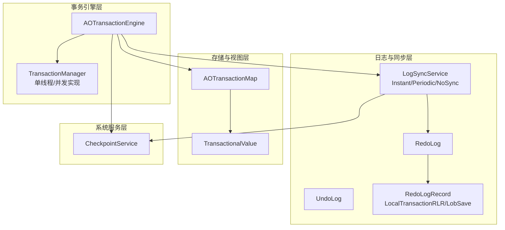
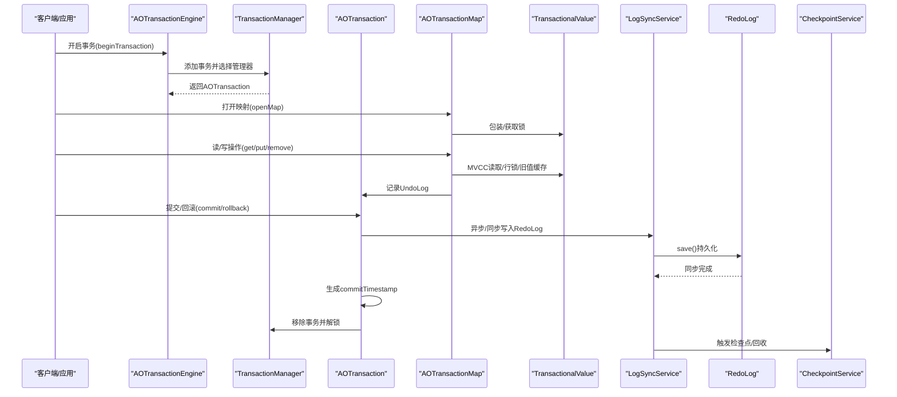
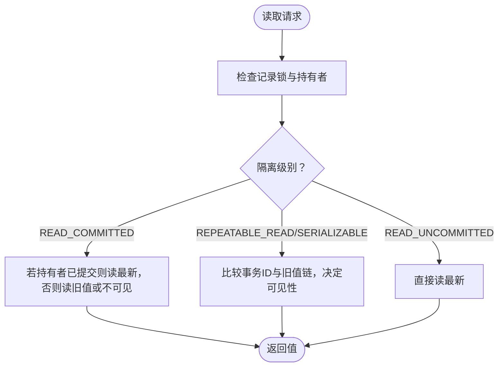
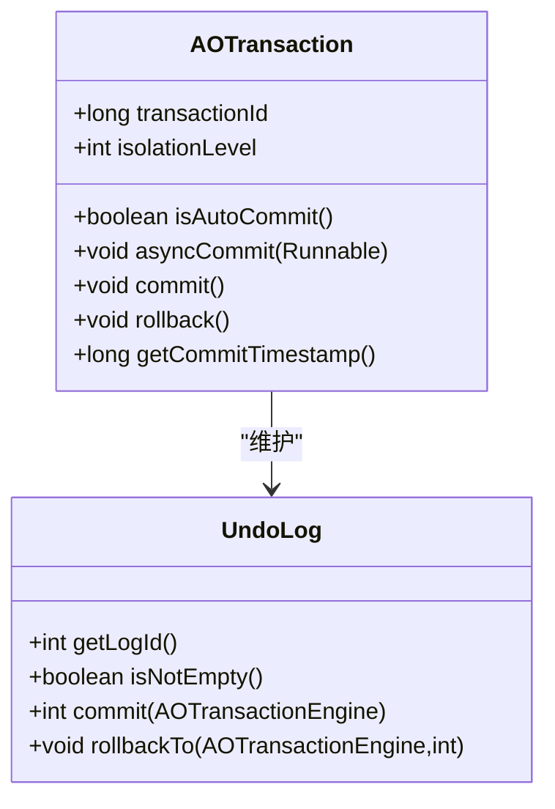
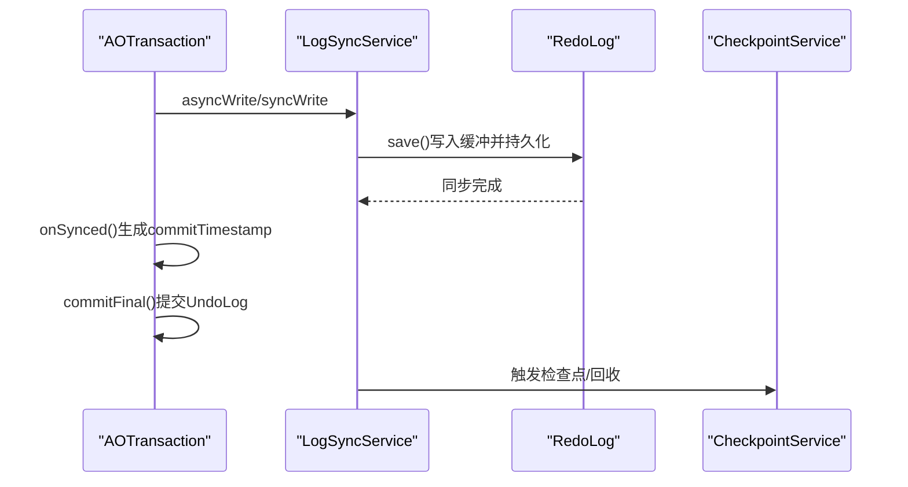
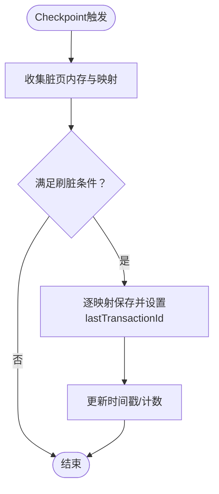
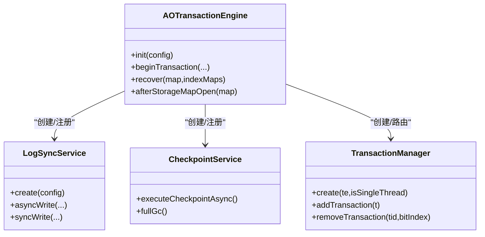
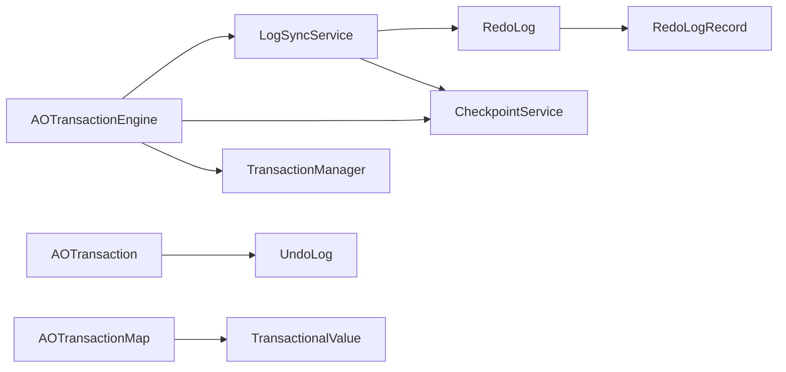

# 事务引擎架构

<cite>
**本文引用的文件**
- [AOTransactionEngine.java](https://github.com/lealone/Lealone/blob/master/lealone-aote/src/main/java/com/lealone/transaction/aote/AOTransactionEngine.java)
- [AOTransaction.java](https://github.com/lealone/Lealone/blob/master/lealone-aote/src/main/java/com/lealone/transaction/aote/AOTransaction.java)
- [AOTransactionMap.java](https://github.com/lealone/Lealone/blob/master/lealone-aote/src/main/java/com/lealone/transaction/aote/AOTransactionMap.java)
- [TransactionalValue.java](https://github.com/lealone/Lealone/blob/master/lealone-aote/src/main/java/com/lealone/transaction/aote/TransactionalValue.java)
- [RedoLog.java](https://github.com/lealone/Lealone/blob/master/lealone-aote/src/main/java/com/lealone/transaction/aote/log/RedoLog.java)
- [UndoLog.java](https://github.com/lealone/Lealone/blob/master/lealone-aote/src/main/java/com/lealone/transaction/aote/log/UndoLog.java)
- [RedoLogRecord.java](https://github.com/lealone/Lealone/blob/master/lealone-aote/src/main/java/com/lealone/transaction/aote/log/RedoLogRecord.java)
- [LogSyncService.java](https://github.com/lealone/Lealone/blob/master/lealone-aote/src/main/java/com/lealone/transaction/aote/log/LogSyncService.java)
- [CheckpointService.java](https://github.com/lealone/Lealone/blob/master/lealone-aote/src/main/java/com/lealone/transaction/aote/CheckpointService.java)
- [TransactionManager.java](https://github.com/lealone/Lealone/blob/master/lealone-aote/src/main/java/com/lealone/transaction/aote/tm/TransactionManager.java)
- [TransactionTest.java](https://github.com/lealone/Lealone/blob/master/lealone-test/src/test/java/com/lealone/test/aote/TransactionTest.java)
</cite>

## 目录
1. [简介](#简介)
2. [项目结构](#项目结构)
3. [核心组件](#核心组件)
4. [架构总览](#架构总览)
5. [详细组件分析](#详细组件分析)
6. [依赖关系分析](#依赖关系分析)
7. [性能考量](#性能考量)
8. [故障排查指南](#故障排查指南)
9. [结论](#结论)
10. [附录：配置参数与调优建议](#附录配置参数与调优建议)

## 简介
本文件面向开发者与架构师，系统性阐述 Lealone 的 AOTE（Async Optimized Transaction Engine）异步化事务引擎的架构与实现细节。重点覆盖：
- MVCC（多版本并发控制）的实现机制与隔离级别策略
- AOTransaction 如何管理事务状态、锁与回滚点
- 两阶段提交（2PC）流程与 RedoLog/UndoLog 的作用边界
- CheckpointService 如何协调事务日志与存储引擎的刷盘与回收
- 插件化架构与核心系统的集成方式
- 高并发场景下的性能特征与调优建议

## 项目结构
AOTE 位于 lealone-aote 模块，围绕事务引擎、日志系统、检查点与存储映射展开，采用“事务引擎 + 日志同步服务 + 检查点服务”的分层设计，配合 AOTransactionMap 与 TransactionalValue 实现 MVCC 与行级锁。

图表来源
- [AOTransactionEngine.java](https://github.com/lealone/Lealone/blob/master/lealone-aote/src/main/java/com/lealone/transaction/aote/AOTransactionEngine.java#L1-L311)
- [LogSyncService.java](https://github.com/lealone/Lealone/blob/master/lealone-aote/src/main/java/com/lealone/transaction/aote/log/LogSyncService.java#L1-L321)
- [RedoLog.java](https://github.com/lealone/Lealone/blob/master/lealone-aote/src/main/java/com/lealone/transaction/aote/log/RedoLog.java#L1-L453)
- [UndoLog.java](https://github.com/lealone/Lealone/blob/master/lealone-aote/src/main/java/com/lealone/transaction/aote/log/UndoLog.java#L1-L144)
- [RedoLogRecord.java](https://github.com/lealone/Lealone/blob/master/lealone-aote/src/main/java/com/lealone/transaction/aote/log/RedoLogRecord.java#L1-L187)
- [AOTransactionMap.java](https://github.com/lealone/Lealone/blob/master/lealone-aote/src/main/java/com/lealone/transaction/aote/AOTransactionMap.java#L1-L618)
- [TransactionalValue.java](https://github.com/lealone/Lealone/blob/master/lealone-aote/src/main/java/com/lealone/transaction/aote/TransactionalValue.java#L1-L385)
- [CheckpointService.java](https://github.com/lealone/Lealone/blob/master/lealone-aote/src/main/java/com/lealone/transaction/aote/CheckpointService.java#L1-L313)

章节来源
- [AOTransactionEngine.java](https://github.com/lealone/Lealone/blob/master/lealone-aote/src/main/java/com/lealone/transaction/aote/AOTransactionEngine.java#L1-L311)
- [LogSyncService.java](https://github.com/lealone/Lealone/blob/master/lealone-aote/src/main/java/com/lealone/transaction/aote/log/LogSyncService.java#L1-L321)
- [AOTransactionMap.java](https://github.com/lealone/Lealone/blob/master/lealone-aote/src/main/java/com/lealone/transaction/aote/AOTransactionMap.java#L1-L618)

## 核心组件
- AOTransactionEngine：事务引擎入口，负责事务生命周期、日志同步服务与检查点协调、存储映射注册与回收。
- AOTransaction：单个事务的载体，维护隔离级别、UndoLog、行锁、提交/回滚流程与异步回调。
- AOTransactionMap：事务视图下的存储映射，封装 MVCC 读取、写入、锁与旧值缓存。
- TransactionalValue：记录的可锁包装，实现 MVCC 读取、行锁、旧值链与提交/回滚。
- RedoLog/UndoLog：持久化与回滚的核心数据结构，前者负责重放与持久化，后者负责回滚点。
- RedoLogRecord：重做日志记录类型，包含本地事务记录与 LOB 保存记录。
- LogSyncService：日志同步服务抽象，提供即时/周期/无同步三种模式。
- CheckpointService：检查点与垃圾回收协调者，驱动存储刷脏与旧值清理。

章节来源
- [AOTransactionEngine.java](https://github.com/lealone/Lealone/blob/master/lealone-aote/src/main/java/com/lealone/transaction/aote/AOTransactionEngine.java#L1-L311)
- [AOTransaction.java](https://github.com/lealone/Lealone/blob/master/lealone-aote/src/main/java/com/lealone/transaction/aote/AOTransaction.java#L1-L461)
- [AOTransactionMap.java](https://github.com/lealone/Lealone/blob/master/lealone-aote/src/main/java/com/lealone/transaction/aote/AOTransactionMap.java#L1-L618)
- [TransactionalValue.java](https://github.com/lealone/Lealone/blob/master/lealone-aote/src/main/java/com/lealone/transaction/aote/TransactionalValue.java#L1-L385)
- [RedoLog.java](https://github.com/lealone/Lealone/blob/master/lealone-aote/src/main/java/com/lealone/transaction/aote/log/RedoLog.java#L1-L453)
- [UndoLog.java](https://github.com/lealone/Lealone/blob/master/lealone-aote/src/main/java/com/lealone/transaction/aote/log/UndoLog.java#L1-L144)
- [RedoLogRecord.java](https://github.com/lealone/Lealone/blob/master/lealone-aote/src/main/java/com/lealone/transaction/aote/log/RedoLogRecord.java#L1-L187)
- [LogSyncService.java](https://github.com/lealone/Lealone/blob/master/lealone-aote/src/main/java/com/lealone/transaction/aote/log/LogSyncService.java#L1-L321)
- [CheckpointService.java](https://github.com/lealone/Lealone/blob/master/lealone-aote/src/main/java/com/lealone/transaction/aote/CheckpointService.java#L1-L313)

## 架构总览
AOTE 以 AOTransactionEngine 为中心，通过 TransactionManager 将事务路由到对应调度线程的单线程或并发管理器；日志同步由 LogSyncService 统一调度，RedoLog 负责持久化与重放，UndoLog 负责回滚；CheckpointService 协调刷脏与旧值回收，AOTransactionMap 与 TransactionalValue 实现 MVCC 读取与行级锁。

图表来源
- [AOTransactionEngine.java](https://github.com/lealone/Lealone/blob/master/lealone-aote/src/main/java/com/lealone/transaction/aote/AOTransactionEngine.java#L196-L226)
- [AOTransaction.java](https://github.com/lealone/Lealone/blob/master/lealone-aote/src/main/java/com/lealone/transaction/aote/AOTransaction.java#L222-L309)
- [AOTransactionMap.java](https://github.com/lealone/Lealone/blob/master/lealone-aote/src/main/java/com/lealone/transaction/aote/AOTransactionMap.java#L312-L618)
- [TransactionalValue.java](https://github.com/lealone/Lealone/blob/master/lealone-aote/src/main/java/com/lealone/transaction/aote/TransactionalValue.java#L121-L196)
- [LogSyncService.java](https://github.com/lealone/Lealone/blob/master/lealone-aote/src/main/java/com/lealone/transaction/aote/log/LogSyncService.java#L161-L217)
- [RedoLog.java](https://github.com/lealone/Lealone/blob/master/lealone-aote/src/main/java/com/lealone/transaction/aote/log/RedoLog.java#L365-L427)
- [CheckpointService.java](https://github.com/lealone/Lealone/blob/master/lealone-aote/src/main/java/com/lealone/transaction/aote/CheckpointService.java#L114-L168)

## 详细组件分析

### MVCC 与隔离级别
- 读取策略
  - READ_COMMITTED：若锁持有者已提交，则读取最新值；否则读取旧值或“不可见”。
  - REPEATABLE_READ/SERIALIZABLE：基于事务 ID 与旧值链（OldValue）决定可见性，确保同一事务多次读取一致。
  - READ_UNCOMMITTED：直接读取最新值。
- 旧值缓存
  - TransactionalValue 在提交时将旧值链写入存储映射的旧值缓存，供可重复读事务使用。
- 行锁与等待
  - AOTransactionMap 使用 RowLock 对记录加锁，冲突时返回等待码，事务可挂起并等待唤醒。

图表来源
- [TransactionalValue.java](https://github.com/lealone/Lealone/blob/master/lealone-aote/src/main/java/com/lealone/transaction/aote/TransactionalValue.java#L121-L196)
- [AOTransactionMap.java](https://github.com/lealone/Lealone/blob/master/lealone-aote/src/main/java/com/lealone/transaction/aote/AOTransactionMap.java#L63-L80)

章节来源
- [TransactionalValue.java](https://github.com/lealone/Lealone/blob/master/lealone-aote/src/main/java/com/lealone/transaction/aote/TransactionalValue.java#L1-L385)
- [AOTransactionMap.java](https://github.com/lealone/Lealone/blob/master/lealone-aote/src/main/java/com/lealone/transaction/aote/AOTransactionMap.java#L1-L215)

### AOTransaction 事务状态与隔离级别
- 状态管理
  - 事务 ID 自增，commitTimestamp 在 RedoLog 同步完成后生成，作为可重复读与检查点的关键边界。
  - 支持保存点、异步提交回调、等待与唤醒。
- 隔离级别
  - 通过构造参数与运行时 session 设置，AOTransactionMap 在读取时根据级别选择 MVCC 读取路径。
- 回滚与解锁
  - rollbackTo/savepoint 回滚至指定 UndoLog 记录，释放行锁。

图表来源
- [AOTransaction.java](https://github.com/lealone/Lealone/blob/master/lealone-aote/src/main/java/com/lealone/transaction/aote/AOTransaction.java#L1-L461)
- [UndoLog.java](https://github.com/lealone/Lealone/blob/master/lealone-aote/src/main/java/com/lealone/transaction/aote/log/UndoLog.java#L1-L144)

章节来源
- [AOTransaction.java](https://github.com/lealone/Lealone/blob/master/lealone-aote/src/main/java/com/lealone/transaction/aote/AOTransaction.java#L1-L461)
- [UndoLog.java](https://github.com/lealone/Lealone/blob/master/lealone-aote/src/main/java/com/lealone/transaction/aote/log/UndoLog.java#L1-L144)

### 两阶段提交（2PC）与日志持久化
- 本地事务提交流程
  - 写入 RedoLogRecord（LocalTransactionRLR），包含 UndoLog 序列化内容；若涉及 LOB，使用 LobSave 包裹。
  - 异步/同步写入 RedoLog，LogSyncService 根据模式决定是否立即同步。
  - onSynced 生成 commitTimestamp，随后提交 UndoLog 并结束事务。
- 恢复与重放
  - AOTransactionEngine.recover 调用 RedoLog.redo，按存储映射重放事务操作，重建索引或清理删除标记。

图表来源
- [AOTransaction.java](https://github.com/lealone/Lealone/blob/master/lealone-aote/src/main/java/com/lealone/transaction/aote/AOTransaction.java#L222-L309)
- [LogSyncService.java](https://github.com/lealone/Lealone/blob/master/lealone-aote/src/main/java/com/lealone/transaction/aote/log/LogSyncService.java#L161-L217)
- [RedoLog.java](https://github.com/lealone/Lealone/blob/master/lealone-aote/src/main/java/com/lealone/transaction/aote/log/RedoLog.java#L365-L427)
- [CheckpointService.java](https://github.com/lealone/Lealone/blob/master/lealone-aote/src/main/java/com/lealone/transaction/aote/CheckpointService.java#L114-L168)

章节来源
- [AOTransaction.java](https://github.com/lealone/Lealone/blob/master/lealone-aote/src/main/java/com/lealone/transaction/aote/AOTransaction.java#L222-L309)
- [RedoLogRecord.java](https://github.com/lealone/Lealone/blob/master/lealone-aote/src/main/java/com/lealone/transaction/aote/log/RedoLogRecord.java#L105-L148)
- [RedoLog.java](https://github.com/lealone/Lealone/blob/master/lealone-aote/src/main/java/com/lealone/transaction/aote/log/RedoLog.java#L136-L190)

### CheckpointService 协调刷脏与回收
- 触发条件
  - 强制检查点任务、关闭前、脏页内存阈值、周期性检查点。
- 刷脏策略
  - 基于 RedoLog.getLastTransactionId() 与各存储映射的脏页统计，批量保存并清除 lastTransactionId。
- 旧值回收
  - 若无可重复读事务，直接清理旧值缓存；否则保留到最小事务 ID 之外的旧值链，避免破坏可重复读一致性。

图表来源
- [CheckpointService.java](https://github.com/lealone/Lealone/blob/master/lealone-aote/src/main/java/com/lealone/transaction/aote/CheckpointService.java#L227-L269)
- [RedoLog.java](https://github.com/lealone/Lealone/blob/master/lealone-aote/src/main/java/com/lealone/transaction/aote/log/RedoLog.java#L271-L363)

章节来源
- [CheckpointService.java](https://github.com/lealone/Lealone/blob/master/lealone-aote/src/main/java/com/lealone/transaction/aote/CheckpointService.java#L1-L313)
- [RedoLog.java](https://github.com/lealone/Lealone/blob/master/lealone-aote/src/main/java/com/lealone/transaction/aote/log/RedoLog.java#L271-L363)

### 插件化架构与核心系统集成
- 事务引擎初始化
  - AOTransactionEngine.init 会根据配置创建 LogSyncService 与 CheckpointService，并注册到存储映射事件监听。
- 存储映射事件
  - afterStorageMapOpen：为非内存表与非键仅索引表注册 RedoLog 映射与服务索引。
- 事务管理器
  - TransactionManager.create 根据是否单线程创建不同实现，AOTransactionEngine 将事务分配到对应管理器。

图表来源
- [AOTransactionEngine.java](https://github.com/lealone/Lealone/blob/master/lealone-aote/src/main/java/com/lealone/transaction/aote/AOTransactionEngine.java#L148-L206)
- [LogSyncService.java](https://github.com/lealone/Lealone/blob/master/lealone-aote/src/main/java/com/lealone/transaction/aote/log/LogSyncService.java#L218-L231)
- [CheckpointService.java](https://github.com/lealone/Lealone/blob/master/lealone-aote/src/main/java/com/lealone/transaction/aote/CheckpointService.java#L106-L113)
- [TransactionManager.java](https://github.com/lealone/Lealone/blob/master/lealone-aote/src/main/java/com/lealone/transaction/aote/tm/TransactionManager.java#L1-L39)

章节来源
- [AOTransactionEngine.java](https://github.com/lealone/Lealone/blob/master/lealone-aote/src/main/java/com/lealone/transaction/aote/AOTransactionEngine.java#L113-L147)
- [AOTransactionEngine.java](https://github.com/lealone/Lealone/blob/master/lealone-aote/src/main/java/com/lealone/transaction/aote/AOTransactionEngine.java#L240-L266)
- [TransactionManager.java](https://github.com/lealone/Lealone/blob/master/lealone-aote/src/main/java/com/lealone/transaction/aote/tm/TransactionManager.java#L1-L39)

## 依赖关系分析
- 组件耦合
  - AOTransactionEngine 与 LogSyncService/CheckpointService 强耦合，负责生命周期与事件分发。
  - AOTransactionMap 依赖 TransactionalValue 与 UndoLog，实现 MVCC 与回滚。
  - RedoLog 与 UndoLog 通过 RedoLogRecord 协作，前者负责持久化，后者负责回滚。
- 外部依赖
  - 存储映射 StorageMap 提供持久化能力，AOTransactionEngine 在存储事件中注册 RedoLog 与 CheckpointService。

图表来源
- [AOTransactionEngine.java](https://github.com/lealone/Lealone/blob/master/lealone-aote/src/main/java/com/lealone/transaction/aote/AOTransactionEngine.java#L1-L311)
- [AOTransaction.java](https://github.com/lealone/Lealone/blob/master/lealone-aote/src/main/java/com/lealone/transaction/aote/AOTransaction.java#L1-L461)
- [AOTransactionMap.java](https://github.com/lealone/Lealone/blob/master/lealone-aote/src/main/java/com/lealone/transaction/aote/AOTransactionMap.java#L1-L618)
- [TransactionalValue.java](https://github.com/lealone/Lealone/blob/master/lealone-aote/src/main/java/com/lealone/transaction/aote/TransactionalValue.java#L1-L385)
- [RedoLog.java](https://github.com/lealone/Lealone/blob/master/lealone-aote/src/main/java/com/lealone/transaction/aote/log/RedoLog.java#L1-L453)
- [UndoLog.java](https://github.com/lealone/Lealone/blob/master/lealone-aote/src/main/java/com/lealone/transaction/aote/log/UndoLog.java#L1-L144)
- [RedoLogRecord.java](https://github.com/lealone/Lealone/blob/master/lealone-aote/src/main/java/com/lealone/transaction/aote/log/RedoLogRecord.java#L1-L187)
- [LogSyncService.java](https://github.com/lealone/Lealone/blob/master/lealone-aote/src/main/java/com/lealone/transaction/aote/log/LogSyncService.java#L1-L321)
- [CheckpointService.java](https://github.com/lealone/Lealone/blob/master/lealone-aote/src/main/java/com/lealone/transaction/aote/CheckpointService.java#L1-L313)

章节来源
- [AOTransactionEngine.java](https://github.com/lealone/Lealone/blob/master/lealone-aote/src/main/java/com/lealone/transaction/aote/AOTransactionEngine.java#L1-L311)
- [AOTransaction.java](https://github.com/lealone/Lealone/blob/master/lealone-aote/src/main/java/com/lealone/transaction/aote/AOTransaction.java#L1-L461)
- [AOTransactionMap.java](https://github.com/lealone/Lealone/blob/master/lealone-aote/src/main/java/com/lealone/transaction/aote/AOTransactionMap.java#L1-L618)

## 性能考量
- 日志同步模式
  - instant：低延迟，适合强一致性场景；periodic：批处理，吞吐更高；no_sync：极致吞吐但牺牲持久性。
- 脏页阈值与周期
  - dirty_page_cache_size_in_mb 与 checkpoint_period 控制刷脏频率与内存占用。
- 调度线程与事务管理
  - 单线程管理器减少锁竞争，适合高并发写入；并发管理器提升吞吐但需注意锁粒度。
- MVCC 读取成本
  - 可重复读需要旧值链与缓存，读取路径更复杂；读未提交可降低开销。
- 异步提交
  - 异步提交在日志同步完成后尽快返回，减少阻塞；同步提交保证更强的持久性。

[本节为通用指导，不直接分析具体文件]

## 故障排查指南
- 提交未持久化
  - 检查日志同步模式与队列长度，确认 LogSyncService 是否在运行；查看 RedoLog.save 流程是否抛错。
- 回滚异常
  - 确认 rollbackTo/savepoint 的 logId 是否正确；检查 UndoLog.rollbackTo 是否清空到目标记录。
- 旧值未清理
  - 检查 CheckpointService 的 GC 逻辑与可重复读事务数量；确认 minTid 与旧值链截断逻辑。
- 读取不可见
  - 核对隔离级别与 commitTimestamp 生成时机；确认 TransactionalValue 的可见性判定分支。

章节来源
- [LogSyncService.java](https://github.com/lealone/Lealone/blob/master/lealone-aote/src/main/java/com/lealone/transaction/aote/log/LogSyncService.java#L111-L159)
- [AOTransaction.java](https://github.com/lealone/Lealone/blob/master/lealone-aote/src/main/java/com/lealone/transaction/aote/AOTransaction.java#L251-L309)
- [CheckpointService.java](https://github.com/lealone/Lealone/blob/master/lealone-aote/src/main/java/com/lealone/transaction/aote/CheckpointService.java#L141-L208)
- [TransactionalValue.java](https://github.com/lealone/Lealone/blob/master/lealone-aote/src/main/java/com/lealone/transaction/aote/TransactionalValue.java#L121-L196)

## 结论
AOTE 通过 MVCC 与行级锁实现高并发下的强一致性与可重复读，借助异步日志同步与检查点机制平衡吞吐与持久性。AOTransactionEngine 作为中枢协调事务、日志与存储，配合 AOTransactionMap/TransactionalValue 提供清晰的 MVCC 读取与写入路径。在高并发场景下，合理配置日志同步模式、脏页阈值与调度线程数，可获得稳定的性能表现。

[本节为总结性内容，不直接分析具体文件]

## 附录：配置参数与调优建议
- 日志同步相关
  - log_sync_type：periodic/instant/no_sync
  - log_sync_period：周期同步间隔（毫秒）
  - log_sync_service_loop_interval：同步服务轮询间隔（毫秒）
  - redo_log_record_sync_threshold：周期同步阈值
  - redo_log_dir：重做日志目录
- 检查点相关
  - dirty_page_cache_size_in_mb：脏页缓存大小（MB）
  - checkpoint_period：检查点周期（毫秒）
  - checkpoint_service_loop_interval：检查点服务轮询间隔（毫秒）
- 存储与调度
  - base_dir：基础目录
  - scheduler_count：调度线程数（由配置合并到引擎）

调优建议
- 高一致性场景优先使用 instant 或 periodic，适当提高 log_sync_period 与 redo_log_record_sync_threshold。
- 高吞吐场景可考虑 periodic 或 no_sync，但需评估数据丢失风险。
- 调整 dirty_page_cache_size_in_mb 与 checkpoint_period，避免频繁刷脏导致抖动。
- 单线程管理器适合热点写入，减少锁竞争；并发管理器适合多事务并发。

章节来源
- [AOTransactionEngine.java](https://github.com/lealone/Lealone/blob/master/lealone-aote/src/main/java/com/lealone/transaction/aote/AOTransactionEngine.java#L228-L234)
- [LogSyncService.java](https://github.com/lealone/Lealone/blob/master/lealone-aote/src/main/java/com/lealone/transaction/aote/log/LogSyncService.java#L218-L231)
- [CheckpointService.java](https://github.com/lealone/Lealone/blob/master/lealone-aote/src/main/java/com/lealone/transaction/aote/CheckpointService.java#L46-L63)
- [RedoLog.java](https://github.com/lealone/Lealone/blob/master/lealone-aote/src/main/java/com/lealone/transaction/aote/log/RedoLog.java#L99-L118)