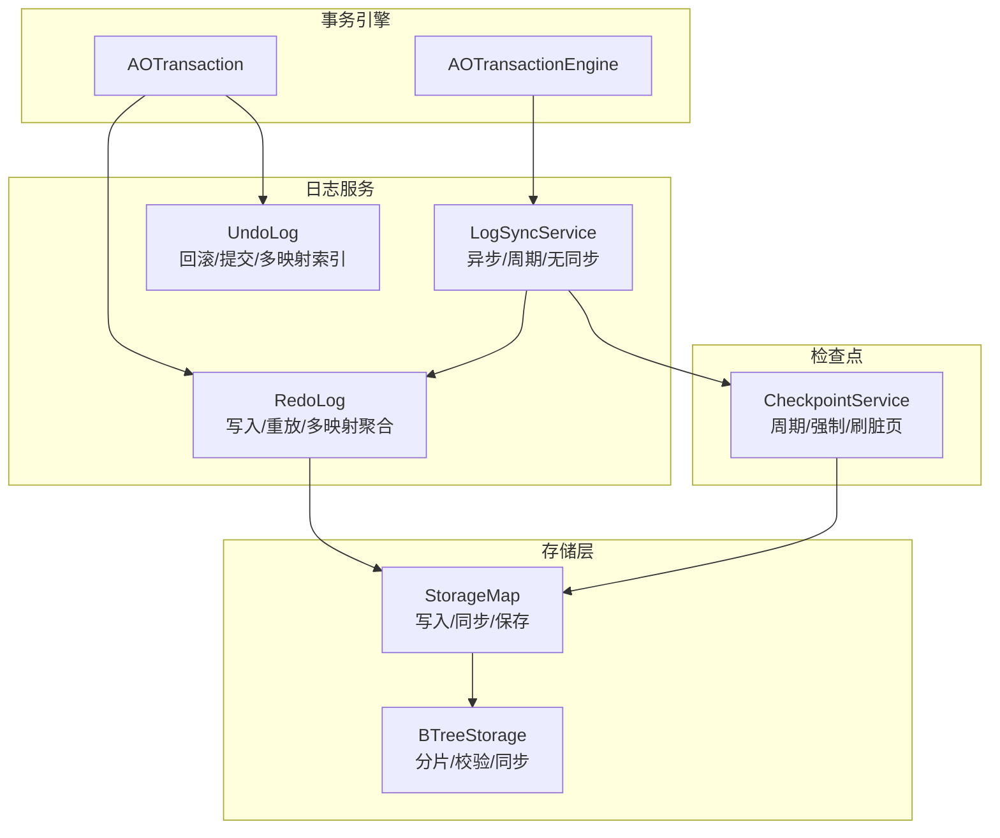
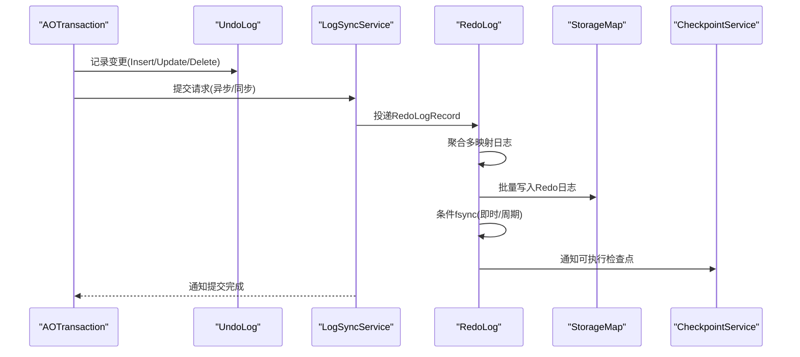
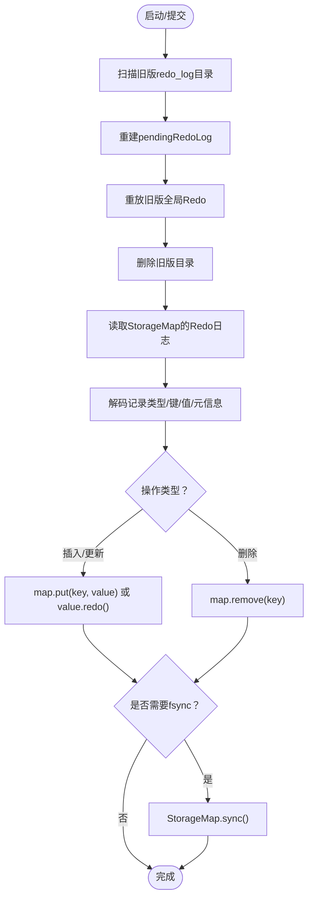
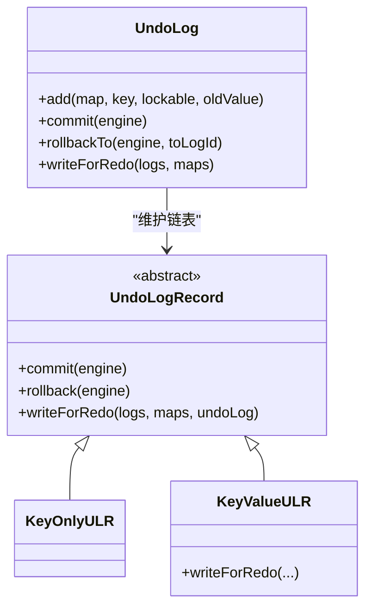
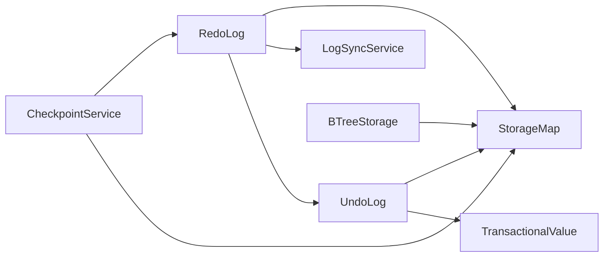

# 事务日志系统

**本文引用的文件**
- [RedoLog.java](https://github.com/lealone/Lealone/blob/master/lealone-aote/src/main/java/com/lealone/transaction/aote/log/RedoLog.java)
- [RedoLogRecord.java](https://github.com/lealone/Lealone/blob/master/lealone-aote/src/main/java/com/lealone/transaction/aote/log/RedoLogRecord.java)
- [UndoLog.java](https://github.com/lealone/Lealone/blob/master/lealone-aote/src/main/java/com/lealone/transaction/aote/log/UndoLog.java)
- [UndoLogRecord.java](https://github.com/lealone/Lealone/blob/master/lealone-aote/src/main/java/com/lealone/transaction/aote/log/UndoLogRecord.java)
- [LogSyncService.java](https://github.com/lealone/Lealone/blob/master/lealone-aote/src/main/java/com/lealone/transaction/aote/log/LogSyncService.java)
- [CheckpointService.java](https://github.com/lealone/Lealone/blob/master/lealone-aote/src/main/java/com/lealone/transaction/aote/CheckpointService.java)
- [BTreeStorage.java](https://github.com/lealone/Lealone/blob/master/lealone-aose/src/main/java/com/lealone/storage/aose/btree/BTreeStorage.java)

## 目录
1. [简介](#简介)
2. [项目结构](#项目结构)
3. [核心组件](#核心组件)
4. [架构总览](#架构总览)
5. [详细组件分析](#详细组件分析)
6. [依赖关系分析](#依赖关系分析)
7. [性能与监控](#性能与监控)
8. [故障排查指南](#故障排查指南)
9. [结论](#结论)

## 简介
本文件系统性阐述 Lealone 事务引擎的日志子系统：以 RedoLog 保障事务持久性、以 UndoLog 支持事务回滚与 MVCC 版本管理，并结合异步写入策略、日志文件管理（轮转/校验/清理）与性能监控指标，帮助读者全面理解其设计与实现要点。

## 项目结构
日志系统位于 aote 模块的 log 包中，围绕事务引擎的 AOTransaction/AOTransactionEngine 运行，配合 CheckpointService 完成刷脏页与周期性检查点；底层存储采用 AOSE 的 B+树分片（chunk）持久化，支持 RedoLog 的读写与校验。

图表来源
- [LogSyncService.java](https://github.com/lealone/Lealone/blob/master/lealone-aote/src/main/java/com/lealone/transaction/aote/log/LogSyncService.java#L1-L321)
- [RedoLog.java](https://github.com/lealone/Lealone/blob/master/lealone-aote/src/main/java/com/lealone/transaction/aote/log/RedoLog.java#L1-L453)
- [UndoLog.java](https://github.com/lealone/Lealone/blob/master/lealone-aote/src/main/java/com/lealone/transaction/aote/log/UndoLog.java#L1-L144)
- [CheckpointService.java](https://github.com/lealone/Lealone/blob/master/lealone-aote/src/main/java/com/lealone/transaction/aote/CheckpointService.java#L1-L313)
- [BTreeStorage.java](https://github.com/lealone/Lealone/blob/master/lealone-aose/src/main/java/com/lealone/storage/aose/btree/BTreeStorage.java#L369-L414)

章节来源
- [LogSyncService.java](https://github.com/lealone/Lealone/blob/master/lealone-aote/src/main/java/com/lealone/transaction/aote/log/LogSyncService.java#L1-L321)
- [RedoLog.java](https://github.com/lealone/Lealone/blob/master/lealone-aote/src/main/java/com/lealone/transaction/aote/log/RedoLog.java#L1-L453)
- [UndoLog.java](https://github.com/lealone/Lealone/blob/master/lealone-aote/src/main/java/com/lealone/transaction/aote/log/UndoLog.java#L1-L144)
- [CheckpointService.java](https://github.com/lealone/Lealone/blob/master/lealone-aote/src/main/java/com/lealone/transaction/aote/CheckpointService.java#L1-L313)
- [BTreeStorage.java](https://github.com/lealone/Lealone/blob/master/lealone-aose/src/main/java/com/lealone/storage/aose/btree/BTreeStorage.java#L369-L414)

## 核心组件
- RedoLog：负责收集事务产生的 UndoLog 记录，批量写入 StorageMap 对应的 Redo 日志区，并在重启时重放以恢复数据一致性。
- RedoLogRecord：抽象重做记录类型，包含 Checkpoint、DropMap、本地事务记录等，兼容旧版格式。
- UndoLog：维护单事务内的变更序列，支持回滚到指定位置与提交后的内存状态更新。
- UndoLogRecord：具体记录类型（键仅/键值），负责将变更编码为 Redo 日志，以及在提交/回滚时更新内存状态。
- LogSyncService：日志同步服务，提供异步、即时、周期、无同步四种模式，协调事务提交与日志落盘。
- CheckpointService：周期性或强制触发检查点，刷脏页并清理历史版本缓存，降低恢复成本。
- BTreeStorage：AOSE 存储实现，提供 Redo 日志读写、校验与同步能力。

章节来源
- [RedoLog.java](https://github.com/lealone/Lealone/blob/master/lealone-aote/src/main/java/com/lealone/transaction/aote/log/RedoLog.java#L1-L453)
- [RedoLogRecord.java](https://github.com/lealone/Lealone/blob/master/lealone-aote/src/main/java/com/lealone/transaction/aote/log/RedoLogRecord.java#L1-L187)
- [UndoLog.java](https://github.com/lealone/Lealone/blob/master/lealone-aote/src/main/java/com/lealone/transaction/aote/log/UndoLog.java#L1-L144)
- [UndoLogRecord.java](https://github.com/lealone/Lealone/blob/master/lealone-aote/src/main/java/com/lealone/transaction/aote/log/UndoLogRecord.java#L1-L195)
- [LogSyncService.java](https://github.com/lealone/Lealone/blob/master/lealone-aote/src/main/java/com/lealone/transaction/aote/log/LogSyncService.java#L1-L321)
- [CheckpointService.java](https://github.com/lealone/Lealone/blob/master/lealone-aote/src/main/java/com/lealone/transaction/aote/CheckpointService.java#L1-L313)
- [BTreeStorage.java](https://github.com/lealone/Lealone/blob/master/lealone-aose/src/main/java/com/lealone/storage/aose/btree/BTreeStorage.java#L369-L414)

## 架构总览
事务提交流程概览：
- 事务在执行过程中产生 UndoLogRecord，记录对 StorageMap 的变更。
- 提交阶段，LogSyncService 将事务的 RedoLogRecord 投递到对应调度器队列，RedoLog 汇聚并批量写入各 StorageMap 的 Redo 日志区。
- 写入完成后，根据同步策略决定是否立即 fsync，随后唤醒等待的事务线程并推进检查点。
- 数据库重启时，RedoLog 读取历史 Redo 文件并重放到最新状态，再由 CheckpointService 刷脏页。

图表来源
- [LogSyncService.java](https://github.com/lealone/Lealone/blob/master/lealone-aote/src/main/java/com/lealone/transaction/aote/log/LogSyncService.java#L161-L217)
- [RedoLog.java](https://github.com/lealone/Lealone/blob/master/lealone-aote/src/main/java/com/lealone/transaction/aote/log/RedoLog.java#L271-L363)
- [UndoLog.java](https://github.com/lealone/Lealone/blob/master/lealone-aote/src/main/java/com/lealone/transaction/aote/log/UndoLog.java#L107-L144)
- [CheckpointService.java](https://github.com/lealone/Lealone/blob/master/lealone-aote/src/main/java/com/lealone/transaction/aote/CheckpointService.java#L227-L269)

## 详细组件分析

### RedoLog：持久化与恢复
- 多映射聚合：RedoLog 维护“映射名 -> 日志缓冲”的聚合结构，按块大小（默认约 16KB）批量写入，减少系统调用次数。
- 写入策略：
  - 即时同步：当未启用周期模式且队列中有待同步记录时，立即 fsync。
  - 周期同步：按周期间隔进行 fsync，期间允许提前标记事务已同步以提升吞吐。
  - 无同步：不执行 fsync，适合对持久性要求较低的场景。
- 重启重放：
  - 兼容旧版全局 Redo 日志：启动时扫描 redo_log 目录，按文件名序读取并重建 pendingRedoLog，再逐条重放。
  - 新版映射级 Redo：从 StorageMap 的 Redo 区域读取，按记录类型与键值进行 put/remove/redo。
  - 事务多映射校验：重放时验证事务涉及的所有映射均满足 lastTransactionId 校验，确保一致性。
- 多服务协同：当事务涉及多个 RedoLog 服务索引时，RedoLog 会维护待处理事务列表，等待所有服务完成同步后再推进。

图表来源
- [RedoLog.java](https://github.com/lealone/Lealone/blob/master/lealone-aote/src/main/java/com/lealone/transaction/aote/log/RedoLog.java#L74-L190)
- [RedoLog.java](https://github.com/lealone/Lealone/blob/master/lealone-aote/src/main/java/com/lealone/transaction/aote/log/RedoLog.java#L192-L257)
- [RedoLog.java](https://github.com/lealone/Lealone/blob/master/lealone-aote/src/main/java/com/lealone/transaction/aote/log/RedoLog.java#L336-L363)

章节来源
- [RedoLog.java](https://github.com/lealone/Lealone/blob/master/lealone-aote/src/main/java/com/lealone/transaction/aote/log/RedoLog.java#L74-L190)
- [RedoLog.java](https://github.com/lealone/Lealone/blob/master/lealone-aote/src/main/java/com/lealone/transaction/aote/log/RedoLog.java#L192-L257)
- [RedoLog.java](https://github.com/lealone/Lealone/blob/master/lealone-aote/src/main/java/com/lealone/transaction/aote/log/RedoLog.java#L336-L363)

### RedoLogRecord：记录类型与兼容
- 类型体系：
  - CheckpointRLR：检查点记录，用于丢弃之前的重放历史。
  - DroppedMapRLR：兼容旧版 DropMap 记录，初始化 pendingRedoLog。
  - LocalTransactionRLR：本地事务记录，封装 UndoLog 的操作集合并支持多映射事务。
  - LobSave：LOB 写入包装，先执行 LOB 任务再写入实际记录。
- 兼容策略：旧版 Redo 文件通过 RedoLogRecord.read 解析，新版本仅需 write 方法即可生成映射级 Redo 日志。

章节来源
- [RedoLogRecord.java](https://github.com/lealone/Lealone/blob/master/lealone-aote/src/main/java/com/lealone/transaction/aote/log/RedoLogRecord.java#L1-L187)

### UndoLog 与 UndoLogRecord：回滚与 MVCC
- UndoLog：
  - 维护双向链表，按提交顺序从头到尾遍历，支持回滚到指定 logId。
  - 记录涉及的 StorageMap 集合与 RedoLog 服务索引集合，用于跨服务同步控制。
  - 提交时从 first 开始逐条调用 commit，更新内存状态；回滚时从 last 逐条撤销。
- UndoLogRecord：
  - KeyOnlyULR：索引等仅键场景，不写 Redo。
  - KeyValueULR：键值场景，编码为 Redo 日志时包含长度、类型、元版本、键、值等；提交时更新页面内存占用或直接提交值。
  - 回滚时恢复旧值，删除场景下移除页面引用。

图表来源
- [UndoLog.java](https://github.com/lealone/Lealone/blob/master/lealone-aote/src/main/java/com/lealone/transaction/aote/log/UndoLog.java#L1-L144)
- [UndoLogRecord.java](https://github.com/lealone/Lealone/blob/master/lealone-aote/src/main/java/com/lealone/transaction/aote/log/UndoLogRecord.java#L1-L195)

章节来源
- [UndoLog.java](https://github.com/lealone/Lealone/blob/master/lealone-aote/src/main/java/com/lealone/transaction/aote/log/UndoLog.java#L1-L144)
- [UndoLogRecord.java](https://github.com/lealone/Lealone/blob/master/lealone-aote/src/main/java/com/lealone/transaction/aote/log/UndoLogRecord.java#L1-L195)

### LogSyncService：异步写入与同步策略
- 模式选择：
  - periodic：周期同步，按配置的同步周期与阈值触发 fsync，支持“追赶滞后”检测以避免阻塞。
  - instant：即时同步，只要有待同步记录就尽快同步。
  - no_sync：不执行 fsync，适合非关键数据或特殊场景。
- 协调机制：
  - 将 PendingTransaction 投递到对应 InternalScheduler，唤醒等待的事务线程。
  - 多 RedoLog 服务索引参与时，等待所有服务完成同步后再推进事务。
- 关闭流程：确保所有待处理事务推进完毕并执行最后一次检查点。

章节来源
- [LogSyncService.java](https://github.com/lealone/Lealone/blob/master/lealone-aote/src/main/java/com/lealone/transaction/aote/log/LogSyncService.java#L1-L321)

### CheckpointService：刷脏页与清理
- 触发条件：
  - 强制检查点（外部命令或关闭）。
  - 达到脏页内存阈值。
  - 周期超时。
- 行为：
  - 收集各 StorageMap 的脏页内存统计，按 lastTransactionId 设置并保存。
  - 在无重复读事务时清理旧值缓存，减少内存占用。
  - 与 LogSyncService 协作，确保在检查点前 Redo 已安全落盘。

章节来源
- [CheckpointService.java](https://github.com/lealone/Lealone/blob/master/lealone-aote/src/main/java/com/lealone/transaction/aote/CheckpointService.java#L1-L313)

### 存储层集成：BTreeStorage 与 Redo
- 写入/读取：BTreeStorage 在分片末尾写入/读取 Redo 日志，并提供 sync 与 validateRedoLog 校验。
- 校验逻辑：基于 lastTransactionId 与事务 ID 比较，确保分片包含目标事务。

章节来源
- [BTreeStorage.java](https://github.com/lealone/Lealone/blob/master/lealone-aose/src/main/java/com/lealone/storage/aose/btree/BTreeStorage.java#L369-L414)

## 依赖关系分析
- RedoLog 依赖：
  - StorageMap 的 Redo 写入/同步接口。
  - LogSyncService 的队列与唤醒机制。
  - UndoLog 的多映射索引与服务索引集合。
- UndoLog 依赖：
  - StorageMap 的键/值类型写入与 redo 接口。
  - TransactionalValue 的提交/回滚内存更新。
- CheckpointService 依赖：
  - LogSyncService 的 lastTransactionId 与 Redo 状态。
  - StorageMap 的脏页统计与保存。

图表来源
- [RedoLog.java](https://github.com/lealone/Lealone/blob/master/lealone-aote/src/main/java/com/lealone/transaction/aote/log/RedoLog.java#L1-L453)
- [UndoLog.java](https://github.com/lealone/Lealone/blob/master/lealone-aote/src/main/java/com/lealone/transaction/aote/log/UndoLog.java#L1-L144)
- [UndoLogRecord.java](https://github.com/lealone/Lealone/blob/master/lealone-aote/src/main/java/com/lealone/transaction/aote/log/UndoLogRecord.java#L1-L195)
- [LogSyncService.java](https://github.com/lealone/Lealone/blob/master/lealone-aote/src/main/java/com/lealone/transaction/aote/log/LogSyncService.java#L1-L321)
- [CheckpointService.java](https://github.com/lealone/Lealone/blob/master/lealone-aote/src/main/java/com/lealone/transaction/aote/CheckpointService.java#L1-L313)
- [BTreeStorage.java](https://github.com/lealone/Lealone/blob/master/lealone-aose/src/main/java/com/lealone/storage/aose/btree/BTreeStorage.java#L369-L414)

## 性能与监控
- 同步策略选择
  - 即时同步：延迟低但 IO 压力大，适合高一致性需求。
  - 周期同步：通过阈值与周期平衡吞吐与可靠性，推荐生产环境默认配置。
  - 无同步：吞吐最高但持久性最弱，谨慎使用。
- 关键参数
  - log_sync_type：选择 periodic/instant/no_sync。
  - log_sync_period：周期同步间隔（毫秒）。
  - redo_log_record_sync_threshold：周期同步阈值（记录数）。
  - log_sync_service_loop_interval：即时同步轮询间隔（毫秒）。
  - dirty_page_cache_size_in_mb：脏页内存阈值（MB）。
  - checkpoint_period：检查点周期（毫秒）。
  - checkpoint_service_loop_interval：检查点服务轮询间隔（毫秒）。
- 性能优化建议
  - 合理设置 log_sync_period 与 redo_log_record_sync_threshold，避免频繁 fsync。
  - 使用周期同步模式并适当增大阈值，提高批量写入效率。
  - 控制事务粒度，减少单事务涉及的映射数量，降低 RedoLog 聚合复杂度。
  - 定期执行 CHECKPOINT，降低重启恢复时间与内存压力。
- 监控指标（建议）
  - Redo 写入速率（字节/秒）、平均写入延迟、fsync 次数与耗时。
  - 事务提交延迟分布（p50/p95/p99）、异步队列长度。
  - 脏页内存总量、检查点频率与每次保存耗时。
  - 重启重放耗时与记录条数。

章节来源
- [LogSyncService.java](https://github.com/lealone/Lealone/blob/master/lealone-aote/src/main/java/com/lealone/transaction/aote/log/LogSyncService.java#L34-L110)
- [CheckpointService.java](https://github.com/lealone/Lealone/blob/master/lealone-aote/src/main/java/com/lealone/transaction/aote/CheckpointService.java#L31-L110)

## 故障排查指南
- 提交后未持久化
  - 检查 log_sync_type 是否为 no_sync。
  - 确认周期同步阈值是否过大导致长时间未 fsync。
  - 查看 RedoLog.save 流程是否抛出异常。
- 重启恢复异常
  - 检查 redo_log 目录是否存在旧版文件，确认 init 与重放流程是否正确。
  - 校验 BTreeStorage.validateRedoLog 返回值，确认 lastTransactionId 与事务 ID 匹配。
- 回滚失败或数据不一致
  - 检查 UndoLogRecord 的 ignore 条件（事务取消/映射关闭/已撤销）。
  - 确认 KeyValueULR 的 writeForRedo 编码是否包含正确的类型与元版本。
- 检查点卡顿
  - 观察脏页内存是否持续增长，必要时手动触发强制检查点。
  - 检查是否存在重复读事务阻塞旧值清理。

章节来源
- [RedoLog.java](https://github.com/lealone/Lealone/blob/master/lealone-aote/src/main/java/com/lealone/transaction/aote/log/RedoLog.java#L74-L190)
- [RedoLog.java](https://github.com/lealone/Lealone/blob/master/lealone-aote/src/main/java/com/lealone/transaction/aote/log/RedoLog.java#L336-L363)
- [UndoLogRecord.java](https://github.com/lealone/Lealone/blob/master/lealone-aote/src/main/java/com/lealone/transaction/aote/log/UndoLogRecord.java#L46-L82)
- [BTreeStorage.java](https://github.com/lealone/Lealone/blob/master/lealone-aose/src/main/java/com/lealone/storage/aose/btree/BTreeStorage.java#L394-L414)
- [LogSyncService.java](https://github.com/lealone/Lealone/blob/master/lealone-aote/src/main/java/com/lealone/transaction/aote/log/LogSyncService.java#L161-L184)
- [CheckpointService.java](https://github.com/lealone/Lealone/blob/master/lealone-aote/src/main/java/com/lealone/transaction/aote/CheckpointService.java#L227-L269)

## 结论
Lealone 的日志系统通过 UndoLog 记录事务变更，借助 RedoLog 将变更编码为持久化日志并支持重启重放，结合多种同步策略与周期性检查点，实现了高可靠与高性能的事务持久化。通过合理的参数配置与监控，可在一致性与吞吐之间取得最佳平衡。