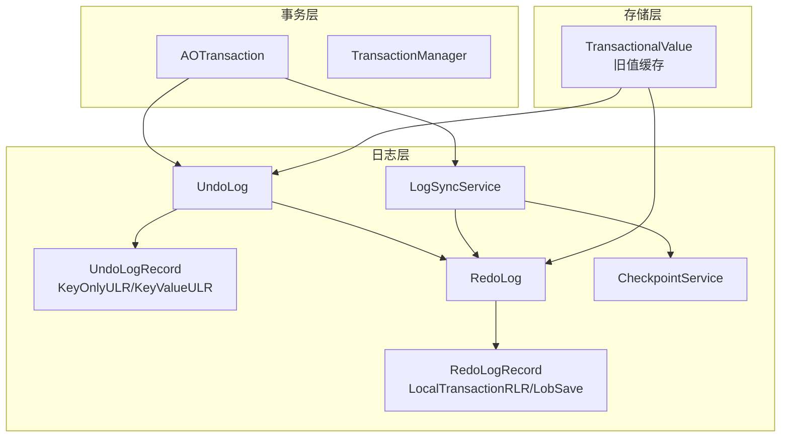
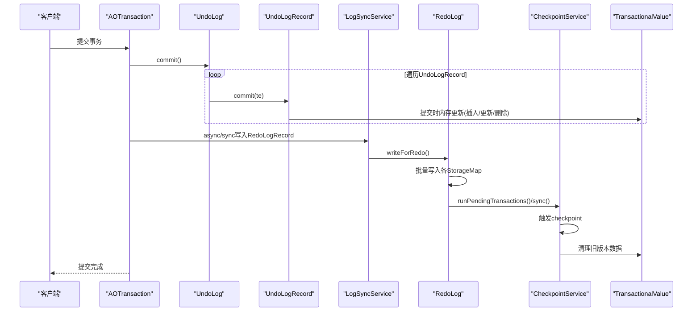
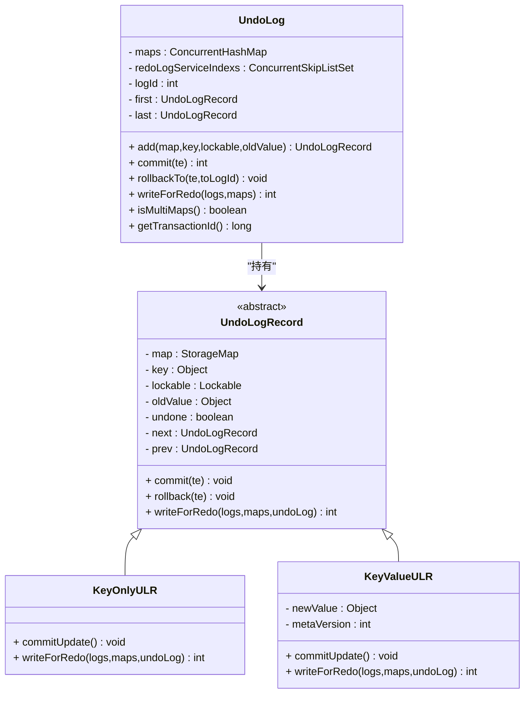
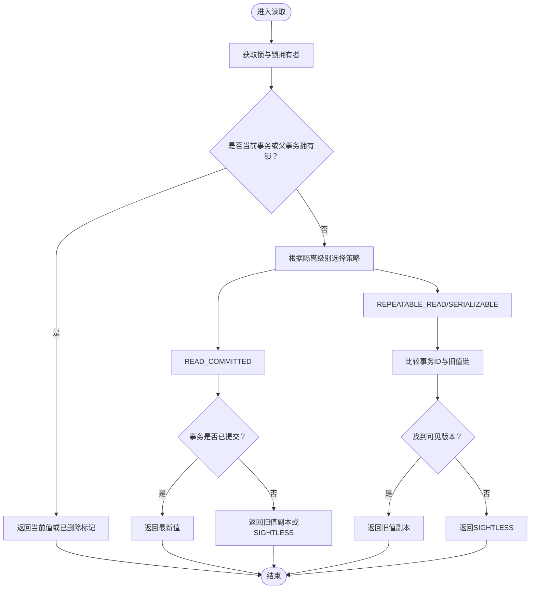
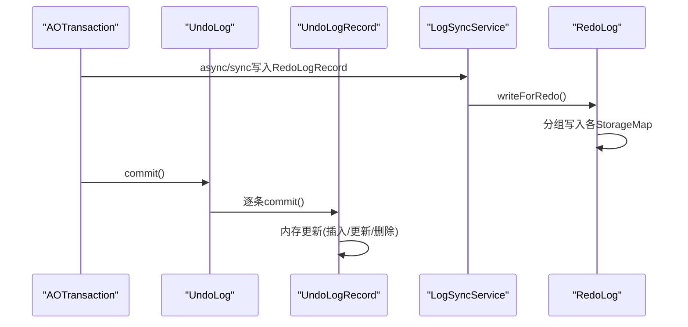
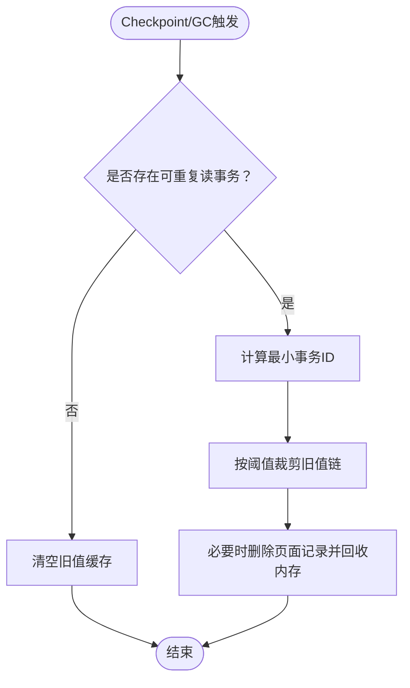
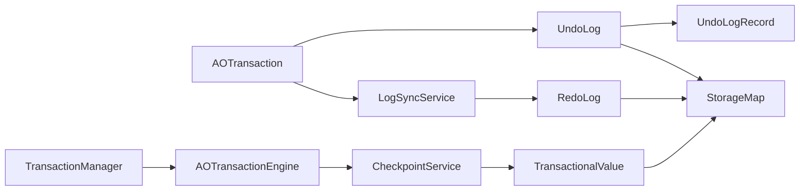

# 撤销日志(Undo Log)

<cite>
**本文引用的文件列表**
- [UndoLog.java](https://github.com/lealone/Lealone/blob/master/lealone-aote/src/main/java/com/lealone/transaction/aote/log/UndoLog.java)
- [UndoLogRecord.java](https://github.com/lealone/Lealone/blob/master/lealone-aote/src/main/java/com/lealone/transaction/aote/log/UndoLogRecord.java)
- [AOTransaction.java](https://github.com/lealone/Lealone/blob/master/lealone-aote/src/main/java/com/lealone/transaction/aote/AOTransaction.java)
- [AOTransactionEngine.java](https://github.com/lealone/Lealone/blob/master/lealone-aote/src/main/java/com/lealone/transaction/aote/AOTransactionEngine.java)
- [TransactionalValue.java](https://github.com/lealone/Lealone/blob/master/lealone-aote/src/main/java/com/lealone/transaction/aote/TransactionalValue.java)
- [RedoLog.java](https://github.com/lealone/Lealone/blob/master/lealone-aote/src/main/java/com/lealone/transaction/aote/log/RedoLog.java)
- [RedoLogRecord.java](https://github.com/lealone/Lealone/blob/master/lealone-aote/src/main/java/com/lealone/transaction/aote/log/RedoLogRecord.java)
- [LogSyncService.java](https://github.com/lealone/Lealone/blob/master/lealone-aote/src/main/java/com/lealone/transaction/aote/log/LogSyncService.java)
- [CheckpointService.java](https://github.com/lealone/Lealone/blob/master/lealone-aote/src/main/java/com/lealone/transaction/aote/CheckpointService.java)
- [TransactionManager.java](https://github.com/lealone/Lealone/blob/master/lealone-aote/src/main/java/com/lealone/transaction/aote/tm/TransactionManager.java)
</cite>

## 目录
1. [简介](#简介)
2. [项目结构](#项目结构)
3. [核心组件](#核心组件)
4. [架构总览](#架构总览)
5. [详细组件分析](#详细组件分析)
6. [依赖关系分析](#依赖关系分析)
7. [性能考量](#性能考量)
8. [故障排查指南](#故障排查指南)
9. [结论](#结论)
10. [附录：配置与调优](#附录配置与调优)

## 简介
本文件系统性解析Lealone事务引擎中的撤销日志（Undo Log）设计与实现，重点覆盖：
- UndoLog如何记录事务修改前的旧值，支撑事务回滚与MVCC多版本并发控制
- UndoLogRecord的数据结构与关键字段（前像数据、事务版本号、回滚指针等）
- 快照隔离级别下的版本管理机制与旧版本数据清理策略
- 日志的存储组织方式、访问路径优化及性能影响
- UndoLog相关的配置参数与调优建议

## 项目结构
围绕UndoLog的关键模块主要位于aote事务引擎子模块中，核心文件如下：
- UndoLog：事务撤销日志容器，维护有序链表，支持提交与回滚
- UndoLogRecord：撤销日志记录抽象，包含KeyOnlyULR与KeyValueULR两类
- AOTransaction：事务生命周期管理，负责写redo日志、生成提交时间戳、提交与回滚
- AOTransactionEngine：事务引擎入口，负责服务初始化、事务开启、MVCC相关统计
- TransactionalValue：MVCC旧值缓存与读取逻辑，支持可重复读/串行化隔离级别
- RedoLog/RedoLogRecord：重做日志写入与恢复，UndoLog通过写redo日志持久化变更
- LogSyncService：日志同步服务，负责异步/同步写入与周期性checkpoint
- CheckpointService：检查点与GC，清理旧版本数据
- TransactionManager：事务管理器，单线程/并发模式

图表来源
- [UndoLog.java](https://github.com/lealone/Lealone/blob/master/lealone-aote/src/main/java/com/lealone/transaction/aote/log/UndoLog.java#L1-L143)
- [UndoLogRecord.java](https://github.com/lealone/Lealone/blob/master/lealone-aote/src/main/java/com/lealone/transaction/aote/log/UndoLogRecord.java#L1-L194)
- [AOTransaction.java](https://github.com/lealone/Lealone/blob/master/lealone-aote/src/main/java/com/lealone/transaction/aote/AOTransaction.java#L1-L461)
- [RedoLog.java](https://github.com/lealone/Lealone/blob/master/lealone-aote/src/main/java/com/lealone/transaction/aote/log/RedoLog.java#L1-L453)
- [RedoLogRecord.java](https://github.com/lealone/Lealone/blob/master/lealone-aote/src/main/java/com/lealone/transaction/aote/log/RedoLogRecord.java#L1-L187)
- [LogSyncService.java](https://github.com/lealone/Lealone/blob/master/lealone-aote/src/main/java/com/lealone/transaction/aote/log/LogSyncService.java#L1-L321)
- [CheckpointService.java](https://github.com/lealone/Lealone/blob/master/lealone-aote/src/main/java/com/lealone/transaction/aote/CheckpointService.java#L111-L231)
- [TransactionalValue.java](https://github.com/lealone/Lealone/blob/master/lealone-aote/src/main/java/com/lealone/transaction/aote/TransactionalValue.java#L1-L385)

章节来源
- [UndoLog.java](https://github.com/lealone/Lealone/blob/master/lealone-aote/src/main/java/com/lealone/transaction/aote/log/UndoLog.java#L1-L143)
- [UndoLogRecord.java](https://github.com/lealone/Lealone/blob/master/lealone-aote/src/main/java/com/lealone/transaction/aote/log/UndoLogRecord.java#L1-L194)
- [AOTransaction.java](https://github.com/lealone/Lealone/blob/master/lealone-aote/src/main/java/com/lealone/transaction/aote/AOTransaction.java#L1-L461)
- [AOTransactionEngine.java](https://github.com/lealone/Lealone/blob/master/lealone-aote/src/main/java/com/lealone/transaction/aote/AOTransactionEngine.java#L1-L311)
- [TransactionalValue.java](https://github.com/lealone/Lealone/blob/master/lealone-aote/src/main/java/com/lealone/transaction/aote/TransactionalValue.java#L1-L385)
- [RedoLog.java](https://github.com/lealone/Lealone/blob/master/lealone-aote/src/main/java/com/lealone/transaction/aote/log/RedoLog.java#L1-L453)
- [RedoLogRecord.java](https://github.com/lealone/Lealone/blob/master/lealone-aote/src/main/java/com/lealone/transaction/aote/log/RedoLogRecord.java#L1-L187)
- [LogSyncService.java](https://github.com/lealone/Lealone/blob/master/lealone-aote/src/main/java/com/lealone/transaction/aote/log/LogSyncService.java#L1-L321)
- [CheckpointService.java](https://github.com/lealone/Lealone/blob/master/lealone-aote/src/main/java/com/lealone/transaction/aote/CheckpointService.java#L111-L231)
- [TransactionManager.java](https://github.com/lealone/Lealone/blob/master/lealone-aote/src/main/java/com/lealone/transaction/aote/tm/TransactionManager.java#L1-L39)

## 核心组件
- UndoLog：以双向链表维护事务期间产生的撤销记录，提供add、commit、rollbackTo、writeForRedo等能力；记录涉及的StorageMap集合与redo服务索引集合，支持多表事务的批量写入与清理。
- UndoLogRecord：抽象记录，包含map、key、lockable、oldValue、prev/next指针；KeyOnlyULR用于键仅索引等无需写redo日志的场景；KeyValueULR记录新值与元版本号，负责写redo日志与提交/回滚时的内存更新。
- AOTransaction：事务生命周期管理，负责写redo日志、生成commitTimestamp、提交与回滚；回滚时调用UndoLog.rollbackTo按序回放撤销记录。
- AOTransactionEngine：事务引擎入口，提供MVCC统计（可重复读事务计数）、事务开启、恢复与checkpoint调度。
- TransactionalValue：MVCC旧值缓存与读取逻辑，支持不同隔离级别下的可见性判断与旧值链维护。
- RedoLog/RedoLogRecord：重做日志写入与恢复，UndoLog通过writeForRedo将操作序列编码为redo日志；LogSyncService协调异步/同步写入与checkpoint。
- LogSyncService：日志同步服务，支持periodic/instant/no_sync三种模式，负责批量写入、队列调度与周期性checkpoint。
- CheckpointService：检查点与GC，清理旧版本数据，释放内存与磁盘空间。
- TransactionManager：事务管理器，单线程/并发模式，负责事务注册与移除。

章节来源
- [UndoLog.java](https://github.com/lealone/Lealone/blob/master/lealone-aote/src/main/java/com/lealone/transaction/aote/log/UndoLog.java#L1-L143)
- [UndoLogRecord.java](https://github.com/lealone/Lealone/blob/master/lealone-aote/src/main/java/com/lealone/transaction/aote/log/UndoLogRecord.java#L1-L194)
- [AOTransaction.java](https://github.com/lealone/Lealone/blob/master/lealone-aote/src/main/java/com/lealone/transaction/aote/AOTransaction.java#L1-L461)
- [AOTransactionEngine.java](https://github.com/lealone/Lealone/blob/master/lealone-aote/src/main/java/com/lealone/transaction/aote/AOTransactionEngine.java#L1-L311)
- [TransactionalValue.java](https://github.com/lealone/Lealone/blob/master/lealone-aote/src/main/java/com/lealone/transaction/aote/TransactionalValue.java#L1-L385)
- [RedoLog.java](https://github.com/lealone/Lealone/blob/master/lealone-aote/src/main/java/com/lealone/transaction/aote/log/RedoLog.java#L1-L453)
- [RedoLogRecord.java](https://github.com/lealone/Lealone/blob/master/lealone-aote/src/main/java/com/lealone/transaction/aote/log/RedoLogRecord.java#L1-L187)
- [LogSyncService.java](https://github.com/lealone/Lealone/blob/master/lealone-aote/src/main/java/com/lealone/transaction/aote/log/LogSyncService.java#L1-L321)
- [CheckpointService.java](https://github.com/lealone/Lealone/blob/master/lealone-aote/src/main/java/com/lealone/transaction/aote/CheckpointService.java#L111-L231)
- [TransactionManager.java](https://github.com/lealone/Lealone/blob/master/lealone-aote/src/main/java/com/lealone/transaction/aote/tm/TransactionManager.java#L1-L39)

## 架构总览
下面的序列图展示了事务提交流程中UndoLog与RedoLog的协作关系，以及MVCC旧值缓存的作用。

图表来源
- [AOTransaction.java](https://github.com/lealone/Lealone/blob/master/lealone-aote/src/main/java/com/lealone/transaction/aote/AOTransaction.java#L222-L301)
- [UndoLog.java](https://github.com/lealone/Lealone/blob/master/lealone-aote/src/main/java/com/lealone/transaction/aote/log/UndoLog.java#L107-L134)
- [UndoLogRecord.java](https://github.com/lealone/Lealone/blob/master/lealone-aote/src/main/java/com/lealone/transaction/aote/log/UndoLogRecord.java#L51-L82)
- [RedoLog.java](https://github.com/lealone/Lealone/blob/master/lealone-aote/src/main/java/com/lealone/transaction/aote/log/RedoLog.java#L365-L452)
- [LogSyncService.java](https://github.com/lealone/Lealone/blob/master/lealone-aote/src/main/java/com/lealone/transaction/aote/log/LogSyncService.java#L161-L217)
- [CheckpointService.java](https://github.com/lealone/Lealone/blob/master/lealone-aote/src/main/java/com/lealone/transaction/aote/CheckpointService.java#L111-L231)
- [TransactionalValue.java](https://github.com/lealone/Lealone/blob/master/lealone-aote/src/main/java/com/lealone/transaction/aote/TransactionalValue.java#L258-L310)

## 详细组件分析

### UndoLog与UndoLogRecord：撤销日志的数据结构与行为
- 数据结构要点
  - 双向链表：first/last指针维护插入顺序，支持从尾部追加与从尾部回滚
  - 记录字段：map、key、lockable、oldValue、prev/next指针
  - 版本标识：KeyValueULR记录new value与meta version，用于写redo日志
  - 多表支持：记录涉及的StorageMap集合与redo服务索引集合，支持跨表事务
- 关键行为
  - add：根据map类型决定是否写redo日志，并将记录加入链表尾部
  - commit：按插入顺序逐条调用记录的commit，完成内存层面的最终提交
  - rollbackTo：按logId回退，从尾部逐条移除并调用记录的rollback，恢复旧值
  - writeForRedo：将UndoLog中的记录序列化为redo日志，按map分组写入

图表来源
- [UndoLog.java](https://github.com/lealone/Lealone/blob/master/lealone-aote/src/main/java/com/lealone/transaction/aote/log/UndoLog.java#L1-L143)
- [UndoLogRecord.java](https://github.com/lealone/Lealone/blob/master/lealone-aote/src/main/java/com/lealone/transaction/aote/log/UndoLogRecord.java#L1-L194)

章节来源
- [UndoLog.java](https://github.com/lealone/Lealone/blob/master/lealone-aote/src/main/java/com/lealone/transaction/aote/log/UndoLog.java#L1-L143)
- [UndoLogRecord.java](https://github.com/lealone/Lealone/blob/master/lealone-aote/src/main/java/com/lealone/transaction/aote/log/UndoLogRecord.java#L1-L194)

### MVCC多版本与快照隔离：旧值缓存与可见性
- 旧值缓存
  - TransactionalValue维护每个锁对应的旧值链（OldValue），包含事务ID、键、旧值、next指针与useLast标记
  - 提交时根据是否插入/更新与是否存在可重复读事务，决定是否添加旧值节点或复用useLast
- 可见性规则
  - READ_COMMITTED：仅能看到已提交的值；若当前事务拥有锁且未提交，则返回旧值副本
  - REPEATABLE_READ/SERIALIZABLE：根据事务ID与旧值链查找可见版本；若找不到则返回SIGHTLESS表示不可见
  - 更新命令场景自动降级为READ_COMMITTED，确保读到最新版本
- 读取流程

图表来源
- [TransactionalValue.java](https://github.com/lealone/Lealone/blob/master/lealone-aote/src/main/java/com/lealone/transaction/aote/TransactionalValue.java#L121-L196)
- [TransactionalValue.java](https://github.com/lealone/Lealone/blob/master/lealone-aote/src/main/java/com/lealone/transaction/aote/TransactionalValue.java#L258-L310)

章节来源
- [TransactionalValue.java](https://github.com/lealone/Lealone/blob/master/lealone-aote/src/main/java/com/lealone/transaction/aote/TransactionalValue.java#L1-L385)

### 事务回滚与提交：UndoLog与RedoLog的协作
- 回滚
  - AOTransaction.rollback/rollbackTo调用UndoLog.rollbackTo，从尾部逐条移除并调用记录rollback，恢复旧值
- 提交
  - AOTransaction.commit/commitFinal先写redo日志，再生成commitTimestamp，最后调用UndoLog.commit，逐条记录commit，完成内存最终提交
- Redo日志写入
  - UndoLog.writeForRedo将记录序列化为redo日志，按map分组写入；LogSyncService协调异步/同步写入与周期性checkpoint

图表来源
- [AOTransaction.java](https://github.com/lealone/Lealone/blob/master/lealone-aote/src/main/java/com/lealone/transaction/aote/AOTransaction.java#L222-L301)
- [UndoLog.java](https://github.com/lealone/Lealone/blob/master/lealone-aote/src/main/java/com/lealone/transaction/aote/log/UndoLog.java#L107-L134)
- [UndoLogRecord.java](https://github.com/lealone/Lealone/blob/master/lealone-aote/src/main/java/com/lealone/transaction/aote/log/UndoLogRecord.java#L51-L82)
- [RedoLog.java](https://github.com/lealone/Lealone/blob/master/lealone-aote/src/main/java/com/lealone/transaction/aote/log/RedoLog.java#L365-L452)
- [LogSyncService.java](https://github.com/lealone/Lealone/blob/master/lealone-aote/src/main/java/com/lealone/transaction/aote/log/LogSyncService.java#L161-L217)

章节来源
- [AOTransaction.java](https://github.com/lealone/Lealone/blob/master/lealone-aote/src/main/java/com/lealone/transaction/aote/AOTransaction.java#L1-L461)
- [UndoLog.java](https://github.com/lealone/Lealone/blob/master/lealone-aote/src/main/java/com/lealone/transaction/aote/log/UndoLog.java#L1-L143)
- [UndoLogRecord.java](https://github.com/lealone/Lealone/blob/master/lealone-aote/src/main/java/com/lealone/transaction/aote/log/UndoLogRecord.java#L1-L194)
- [RedoLog.java](https://github.com/lealone/Lealone/blob/master/lealone-aote/src/main/java/com/lealone/transaction/aote/log/RedoLog.java#L1-L453)
- [LogSyncService.java](https://github.com/lealone/Lealone/blob/master/lealone-aote/src/main/java/com/lealone/transaction/aote/log/LogSyncService.java#L1-L321)

### 旧版本数据清理策略：Checkpoint与GC
- 清理触发条件
  - 存在可重复读事务时保留旧值；当不存在可重复读事务时，直接清空旧值缓存
  - 通过AOTransactionEngine统计可重复读事务数量，确定最大事务ID，据此裁剪旧值链
- 清理过程
  - CheckpointService遍历StorageMap的旧值缓存，按最小事务ID阈值裁剪旧值链，必要时删除旧值对应的页面记录
  - 同时执行map的fullGc与普通GC，释放内存与磁盘空间

图表来源
- [AOTransactionEngine.java](https://github.com/lealone/Lealone/blob/master/lealone-aote/src/main/java/com/lealone/transaction/aote/AOTransactionEngine.java#L39-L92)
- [CheckpointService.java](https://github.com/lealone/Lealone/blob/master/lealone-aote/src/main/java/com/lealone/transaction/aote/CheckpointService.java#L141-L231)
- [TransactionalValue.java](https://github.com/lealone/Lealone/blob/master/lealone-aote/src/main/java/com/lealone/transaction/aote/TransactionalValue.java#L258-L310)

章节来源
- [AOTransactionEngine.java](https://github.com/lealone/Lealone/blob/master/lealone-aote/src/main/java/com/lealone/transaction/aote/AOTransactionEngine.java#L1-L311)
- [CheckpointService.java](https://github.com/lealone/Lealone/blob/master/lealone-aote/src/main/java/com/lealone/transaction/aote/CheckpointService.java#L111-L231)
- [TransactionalValue.java](https://github.com/lealone/Lealone/blob/master/lealone-aote/src/main/java/com/lealone/transaction/aote/TransactionalValue.java#L258-L310)

## 依赖关系分析
- 组件耦合
  - UndoLog依赖UndoLogRecord与StorageMap；AOTransaction持有UndoLog并在提交/回滚时驱动其行为
  - RedoLog与LogSyncService共同完成日志写入与同步；CheckpointService与TransactionalValue协同完成旧值清理
- 外部依赖
  - StorageMap提供键值类型、页面监听器、redo服务索引等接口
  - TransactionManager负责事务注册与移除，影响可重复读事务计数

图表来源
- [UndoLog.java](https://github.com/lealone/Lealone/blob/master/lealone-aote/src/main/java/com/lealone/transaction/aote/log/UndoLog.java#L1-L143)
- [UndoLogRecord.java](https://github.com/lealone/Lealone/blob/master/lealone-aote/src/main/java/com/lealone/transaction/aote/log/UndoLogRecord.java#L1-L194)
- [AOTransaction.java](https://github.com/lealone/Lealone/blob/master/lealone-aote/src/main/java/com/lealone/transaction/aote/AOTransaction.java#L1-L461)
- [RedoLog.java](https://github.com/lealone/Lealone/blob/master/lealone-aote/src/main/java/com/lealone/transaction/aote/log/RedoLog.java#L1-L453)
- [LogSyncService.java](https://github.com/lealone/Lealone/blob/master/lealone-aote/src/main/java/com/lealone/transaction/aote/log/LogSyncService.java#L1-L321)
- [CheckpointService.java](https://github.com/lealone/Lealone/blob/master/lealone-aote/src/main/java/com/lealone/transaction/aote/CheckpointService.java#L111-L231)
- [TransactionalValue.java](https://github.com/lealone/Lealone/blob/master/lealone-aote/src/main/java/com/lealone/transaction/aote/TransactionalValue.java#L1-L385)
- [TransactionManager.java](https://github.com/lealone/Lealone/blob/master/lealone-aote/src/main/java/com/lealone/transaction/aote/tm/TransactionManager.java#L1-L39)
- [AOTransactionEngine.java](https://github.com/lealone/Lealone/blob/master/lealone-aote/src/main/java/com/lealone/transaction/aote/AOTransactionEngine.java#L1-L311)

章节来源
- [UndoLog.java](https://github.com/lealone/Lealone/blob/master/lealone-aote/src/main/java/com/lealone/transaction/aote/log/UndoLog.java#L1-L143)
- [UndoLogRecord.java](https://github.com/lealone/Lealone/blob/master/lealone-aote/src/main/java/com/lealone/transaction/aote/log/UndoLogRecord.java#L1-L194)
- [AOTransaction.java](https://github.com/lealone/Lealone/blob/master/lealone-aote/src/main/java/com/lealone/transaction/aote/AOTransaction.java#L1-L461)
- [RedoLog.java](https://github.com/lealone/Lealone/blob/master/lealone-aote/src/main/java/com/lealone/transaction/aote/log/RedoLog.java#L1-L453)
- [LogSyncService.java](https://github.com/lealone/Lealone/blob/master/lealone-aote/src/main/java/com/lealone/transaction/aote/log/LogSyncService.java#L1-L321)
- [CheckpointService.java](https://github.com/lealone/Lealone/blob/master/lealone-aote/src/main/java/com/lealone/transaction/aote/CheckpointService.java#L111-L231)
- [TransactionalValue.java](https://github.com/lealone/Lealone/blob/master/lealone-aote/src/main/java/com/lealone/transaction/aote/TransactionalValue.java#L1-L385)
- [TransactionManager.java](https://github.com/lealone/Lealone/blob/master/lealone-aote/src/main/java/com/lealone/transaction/aote/tm/TransactionManager.java#L1-L39)
- [AOTransactionEngine.java](https://github.com/lealone/Lealone/blob/master/lealone-aote/src/main/java/com/lealone/transaction/aote/AOTransactionEngine.java#L1-L311)

## 性能考量
- UndoLog链表遍历
  - 提交/回滚均需按顺序遍历UndoLogRecord，链表长度与事务修改量成正比
  - 建议减少不必要的中间状态写入，合并小事务，降低UndoLog大小
- Redo日志写入
  - RedoLog采用批量写入与缓冲区聚合，减少fsync次数；LogSyncService支持periodic/instant/no_sync三种模式
  - periodic模式下可通过log_sync_period与redo_log_record_sync_threshold平衡延迟与吞吐
- MVCC旧值缓存
  - 旧值链在可重复读事务存在期间保留，占用内存；checkpoint与GC会按阈值清理
  - 避免长时间运行的可重复读事务，减少旧值链长度
- 页面内存与IO
  - KeyValueULR在提交时根据新旧值内存差异调整页面使用内存，有助于更精确的内存统计
  - RedoLog写入完成后由LogSyncService触发fsync，确保持久性

[本节为通用性能讨论，不直接分析具体文件]

## 故障排查指南
- 提交后仍能看到未提交数据
  - 检查AOTransaction.onSynced是否正确生成commitTimestamp，确保在redo日志同步完成后才生成
  - 确认LogSyncService的needSync与写入路径是否被正确调用
- 回滚无效或回滚后数据不一致
  - 检查UndoLog.rollbackTo是否按logId正确回退，确认记录的rollback是否被调用
  - 确认KeyOnlyULR与KeyValueULR的rollback分支是否覆盖插入/更新/删除场景
- 旧值未清理导致内存增长
  - 检查AOTransactionEngine.containsRepeatableReadTransactions与max重复读事务ID
  - 确认CheckpointService的GC流程是否正常执行，阈值计算是否合理
- Redo日志写入异常
  - 检查LogSyncService的asyncWrite/syncWrite路径，确认PendingTransaction队列与唤醒逻辑
  - 确认RedoLog.save写入与sync调用是否成功，以及map的writeRedoLog与sync是否被调用

章节来源
- [AOTransaction.java](https://github.com/lealone/Lealone/blob/master/lealone-aote/src/main/java/com/lealone/transaction/aote/AOTransaction.java#L222-L301)
- [UndoLog.java](https://github.com/lealone/Lealone/blob/master/lealone-aote/src/main/java/com/lealone/transaction/aote/log/UndoLog.java#L107-L134)
- [UndoLogRecord.java](https://github.com/lealone/Lealone/blob/master/lealone-aote/src/main/java/com/lealone/transaction/aote/log/UndoLogRecord.java#L51-L82)
- [RedoLog.java](https://github.com/lealone/Lealone/blob/master/lealone-aote/src/main/java/com/lealone/transaction/aote/log/RedoLog.java#L365-L452)
- [LogSyncService.java](https://github.com/lealone/Lealone/blob/master/lealone-aote/src/main/java/com/lealone/transaction/aote/log/LogSyncService.java#L161-L217)
- [CheckpointService.java](https://github.com/lealone/Lealone/blob/master/lealone-aote/src/main/java/com/lealone/transaction/aote/CheckpointService.java#L141-L231)

## 结论
Lealone的UndoLog通过“记录旧值+写redo日志”的组合，既保证了事务回滚的原子性，又为MVCC提供了旧版本数据支撑。UndoLogRecord的KeyOnlyULR与KeyValueULR分别适配不同存储场景，RedoLog与LogSyncService确保持久化与性能平衡，TransactionalValue与CheckpointService共同完成旧版本数据的生命周期管理。整体设计在可重复读与串行化隔离级别下实现了严格的可见性控制，并通过checkpoint与GC策略维持系统长期稳定运行。

[本节为总结性内容，不直接分析具体文件]

## 附录：配置与调优
- 日志同步模式
  - log_sync_type：periodic/instant/no_sync，默认periodic
  - log_sync_period：周期同步间隔（毫秒），默认500
  - log_sync_service_loop_interval：instant模式循环间隔（毫秒），默认100
  - redo_log_record_sync_threshold：周期同步阈值，超过该阈值立即同步
- 存储与目录
  - base_dir：基础目录
  - redo_log_dir：redo日志目录名，默认“redo_log”
- 其他
  - embedded：嵌入式模式开关
  - checkpoint_service_loop_interval：checkpoint循环间隔（毫秒）

章节来源
- [LogSyncService.java](https://github.com/lealone/Lealone/blob/master/lealone-aote/src/main/java/com/lealone/transaction/aote/log/LogSyncService.java#L54-L100)
- [AOTransactionEngine.java](https://github.com/lealone/Lealone/blob/master/lealone-aote/src/main/java/com/lealone/transaction/aote/AOTransactionEngine.java#L284-L310)
- [RedoLog.java](https://github.com/lealone/Lealone/blob/master/lealone-aote/src/main/java/com/lealone/transaction/aote/log/RedoLog.java#L99-L118)