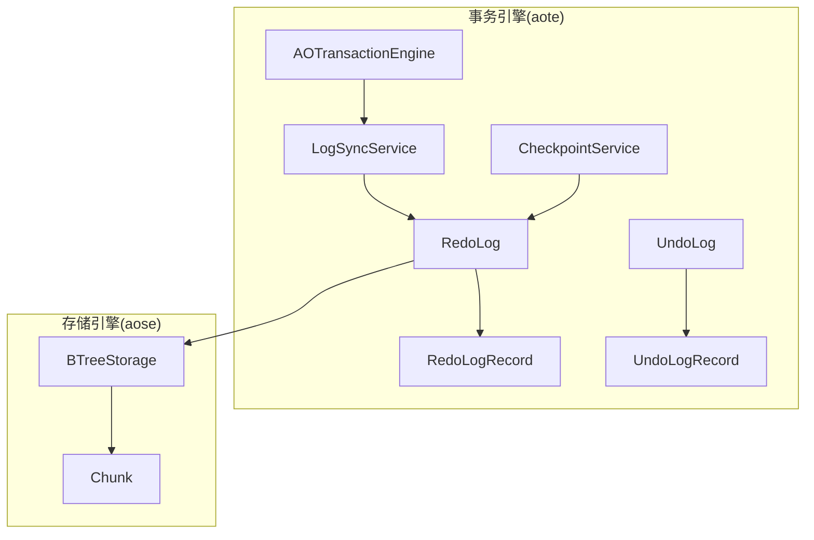
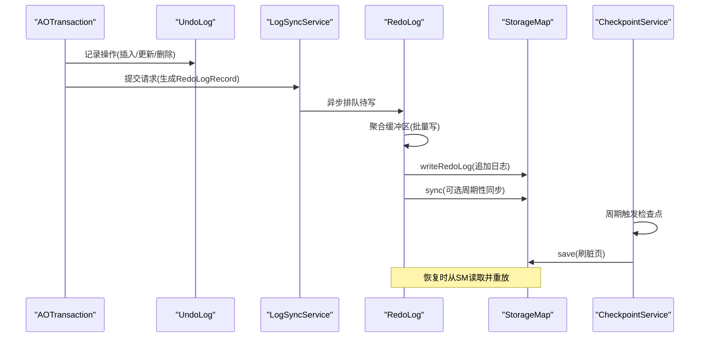
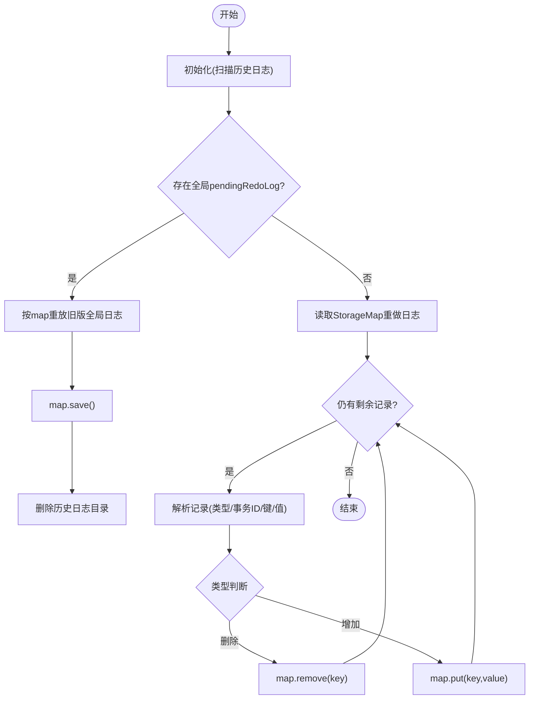
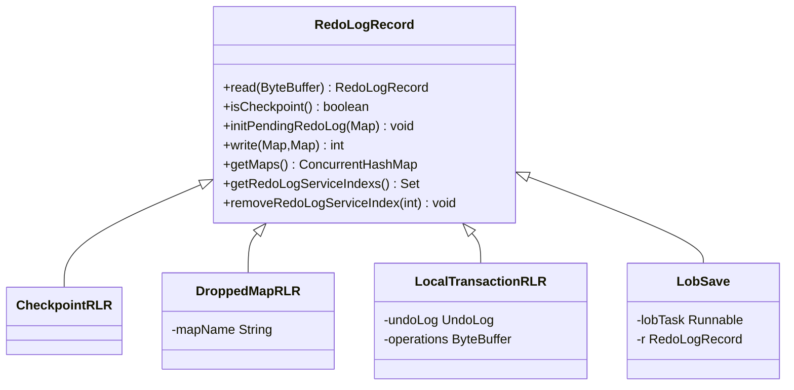
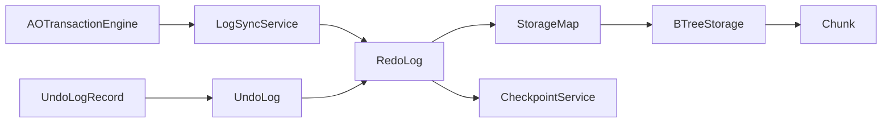

# 重做日志(Redo Log)

**本文引用的文件列表**
- [RedoLog.java](https://github.com/lealone/Lealone/blob/master/lealone-aote/src/main/java/com/lealone/transaction/aote/log/RedoLog.java)
- [RedoLogRecord.java](https://github.com/lealone/Lealone/blob/master/lealone-aote/src/main/java/com/lealone/transaction/aote/log/RedoLogRecord.java)
- [UndoLog.java](https://github.com/lealone/Lealone/blob/master/lealone-aote/src/main/java/com/lealone/transaction/aote/log/UndoLog.java)
- [UndoLogRecord.java](https://github.com/lealone/Lealone/blob/master/lealone-aote/src/main/java/com/lealone/transaction/aote/log/UndoLogRecord.java)
- [LogSyncService.java](https://github.com/lealone/Lealone/blob/master/lealone-aote/src/main/java/com/lealone/transaction/aote/log/LogSyncService.java)
- [CheckpointService.java](https://github.com/lealone/Lealone/blob/master/lealone-aote/src/main/java/com/lealone/transaction/aote/CheckpointService.java)
- [AOTransactionEngine.java](https://github.com/lealone/Lealone/blob/master/lealone-aote/src/main/java/com/lealone/transaction/aote/AOTransactionEngine.java)
- [Chunk.java](https://github.com/lealone/Lealone/blob/master/lealone-aose/src/main/java/com/lealone/storage/aose/btree/chunk/Chunk.java)
- [BTreeStorage.java](https://github.com/lealone/Lealone/blob/master/lealone-aose/src/main/java/com/lealone/storage/aose/btree/BTreeStorage.java)

## 目录
1. [简介](#简介)
2. [项目结构](#项目结构)
3. [核心组件](#核心组件)
4. [架构总览](#架构总览)
5. [详细组件分析](#详细组件分析)
6. [依赖关系分析](#依赖关系分析)
7. [性能考量与调优](#性能考量与调优)
8. [故障排查指南](#故障排查指南)
9. [结论](#结论)

## 简介
本文件系统化阐述Lealone事务引擎中的重做日志（Redo Log）设计与实现，重点覆盖：
- RedoLog如何通过记录事务的物理修改操作确保数据持久性
- 在系统崩溃后的恢复流程与校验机制
- RedoLogRecord的数据结构设计要点（事务ID、操作类型、数据页信息等）
- 日志异步写入策略、批量提交优化与多服务协同
- 日志文件循环利用与检查点机制
- 性能监控指标与配置调优建议（日志文件大小、缓冲区配置、同步策略）

## 项目结构
围绕RedoLog的关键模块分布于事务引擎与存储引擎两个子模块：
- 事务引擎（aote）：负责事务生命周期、日志同步服务、检查点服务、RedoLog与UndoLog的组织与写入
- 存储引擎（aose）：负责具体日志文件的落盘、读取与校验（基于B+树分块Chunk）

图表来源
- [AOTransactionEngine.java](https://github.com/lealone/Lealone/blob/master/lealone-aote/src/main/java/com/lealone/transaction/aote/AOTransactionEngine.java#L228-L311)
- [LogSyncService.java](https://github.com/lealone/Lealone/blob/master/lealone-aote/src/main/java/com/lealone/transaction/aote/log/LogSyncService.java#L34-L120)
- [RedoLog.java](https://github.com/lealone/Lealone/blob/master/lealone-aote/src/main/java/com/lealone/transaction/aote/log/RedoLog.java#L41-L120)
- [RedoLogRecord.java](https://github.com/lealone/Lealone/blob/master/lealone-aote/src/main/java/com/lealone/transaction/aote/log/RedoLogRecord.java#L1-L60)
- [UndoLog.java](https://github.com/lealone/Lealone/blob/master/lealone-aote/src/main/java/com/lealone/transaction/aote/log/UndoLog.java#L1-L80)
- [UndoLogRecord.java](https://github.com/lealone/Lealone/blob/master/lealone-aote/src/main/java/com/lealone/transaction/aote/log/UndoLogRecord.java#L80-L140)
- [CheckpointService.java](https://github.com/lealone/Lealone/blob/master/lealone-aote/src/main/java/com/lealone/transaction/aote/CheckpointService.java#L28-L120)
- [BTreeStorage.java](https://github.com/lealone/Lealone/blob/master/lealone-aose/src/main/java/com/lealone/storage/aose/btree/BTreeStorage.java#L369-L414)
- [Chunk.java](https://github.com/lealone/Lealone/blob/master/lealone-aose/src/main/java/com/lealone/storage/aose/btree/chunk/Chunk.java#L311-L325)

章节来源
- [AOTransactionEngine.java](https://github.com/lealone/Lealone/blob/master/lealone-aote/src/main/java/com/lealone/transaction/aote/AOTransactionEngine.java#L228-L311)
- [LogSyncService.java](https://github.com/lealone/Lealone/blob/master/lealone-aote/src/main/java/com/lealone/transaction/aote/log/LogSyncService.java#L34-L120)
- [RedoLog.java](https://github.com/lealone/Lealone/blob/master/lealone-aote/src/main/java/com/lealone/transaction/aote/log/RedoLog.java#L41-L120)
- [BTreeStorage.java](https://github.com/lealone/Lealone/blob/master/lealone-aose/src/main/java/com/lealone/storage/aose/btree/BTreeStorage.java#L369-L414)
- [Chunk.java](https://github.com/lealone/Lealone/blob/master/lealone-aose/src/main/java/com/lealone/storage/aose/btree/chunk/Chunk.java#L311-L325)

## 核心组件
- RedoLog：事务提交阶段将UndoLog记录转换为重做日志并批量写入存储；在恢复阶段重放历史事务以保证持久性
- RedoLogRecord：日志记录抽象，包含Checkpoint、DroppedMap、LocalTransaction等类型，支持兼容老版本
- UndoLog/UndoLogRecord：事务期间的逻辑修改记录，用于生成重做日志与回滚
- LogSyncService：日志同步服务，负责异步写入、批量提交、周期性同步与唤醒
- CheckpointService：检查点服务，周期性触发刷脏页，与RedoLog协同保障一致性
- BTreeStorage/Chunk：存储层实现，负责将重做日志追加到分块文件末尾，并提供读取与校验能力

章节来源
- [RedoLog.java](https://github.com/lealone/Lealone/blob/master/lealone-aote/src/main/java/com/lealone/transaction/aote/log/RedoLog.java#L41-L120)
- [RedoLogRecord.java](https://github.com/lealone/Lealone/blob/master/lealone-aote/src/main/java/com/lealone/transaction/aote/log/RedoLogRecord.java#L1-L60)
- [UndoLog.java](https://github.com/lealone/Lealone/blob/master/lealone-aote/src/main/java/com/lealone/transaction/aote/log/UndoLog.java#L1-L80)
- [UndoLogRecord.java](https://github.com/lealone/Lealone/blob/master/lealone-aote/src/main/java/com/lealone/transaction/aote/log/UndoLogRecord.java#L80-L140)
- [LogSyncService.java](https://github.com/lealone/Lealone/blob/master/lealone-aote/src/main/java/com/lealone/transaction/aote/log/LogSyncService.java#L34-L120)
- [CheckpointService.java](https://github.com/lealone/Lealone/blob/master/lealone-aote/src/main/java/com/lealone/transaction/aote/CheckpointService.java#L28-L120)
- [BTreeStorage.java](https://github.com/lealone/Lealone/blob/master/lealone-aose/src/main/java/com/lealone/storage/aose/btree/BTreeStorage.java#L369-L414)
- [Chunk.java](https://github.com/lealone/Lealone/blob/master/lealone-aose/src/main/java/com/lealone/storage/aose/btree/chunk/Chunk.java#L311-L325)

## 架构总览
RedoLog在事务提交路径上的工作流：
- 事务写入UndoLog记录
- 提交时由LogSyncService将UndoLog转换为RedoLogRecord并写入对应StorageMap
- RedoLog批量聚合写入，必要时触发同步
- CheckpointService周期性刷脏页，避免日志无限增长
- 恢复时，RedoLog从存储层读取并重放

图表来源
- [UndoLog.java](https://github.com/lealone/Lealone/blob/master/lealone-aote/src/main/java/com/lealone/transaction/aote/log/UndoLog.java#L107-L143)
- [LogSyncService.java](https://github.com/lealone/Lealone/blob/master/lealone-aote/src/main/java/com/lealone/transaction/aote/log/LogSyncService.java#L186-L217)
- [RedoLog.java](https://github.com/lealone/Lealone/blob/master/lealone-aote/src/main/java/com/lealone/transaction/aote/log/RedoLog.java#L271-L363)
- [BTreeStorage.java](https://github.com/lealone/Lealone/blob/master/lealone-aose/src/main/java/com/lealone/storage/aose/btree/BTreeStorage.java#L369-L393)
- [CheckpointService.java](https://github.com/lealone/Lealone/blob/master/lealone-aote/src/main/java/com/lealone/transaction/aote/CheckpointService.java#L227-L269)

## 详细组件分析

### RedoLog：持久化与恢复
- 批量写入与缓冲区聚合
  - 使用固定大小的缓冲区阈值进行批量写入，减少磁盘写放大
  - 将同一事务涉及的多个StorageMap的日志合并写入，降低跨表写入成本
- 同步策略
  - 非周期模式下，当队列中有日志时立即同步；周期模式下按阈值或间隔触发
  - 对于多表事务，需等待所有参与表的RedoLog均完成同步后再允许检查点刷脏页
- 恢复流程
  - 兼容老版本：扫描历史日志目录，按文件名序读取并初始化全局pendingRedoLog
  - 重放：从StorageMap读取重做日志，按类型区分删除/增加操作，重建索引与数据页
  - 校验：通过validateRedoLog校验事务ID，确保仅重放“已提交且在检查点之后”的事务

图表来源
- [RedoLog.java](https://github.com/lealone/Lealone/blob/master/lealone-aote/src/main/java/com/lealone/transaction/aote/log/RedoLog.java#L74-L190)
- [RedoLog.java](https://github.com/lealone/Lealone/blob/master/lealone-aote/src/main/java/com/lealone/transaction/aote/log/RedoLog.java#L192-L270)
- [BTreeStorage.java](https://github.com/lealone/Lealone/blob/master/lealone-aose/src/main/java/com/lealone/storage/aose/btree/BTreeStorage.java#L380-L414)

章节来源
- [RedoLog.java](https://github.com/lealone/Lealone/blob/master/lealone-aote/src/main/java/com/lealone/transaction/aote/log/RedoLog.java#L41-L120)
- [RedoLog.java](https://github.com/lealone/Lealone/blob/master/lealone-aote/src/main/java/com/lealone/transaction/aote/log/RedoLog.java#L120-L190)
- [RedoLog.java](https://github.com/lealone/Lealone/blob/master/lealone-aote/src/main/java/com/lealone/transaction/aote/log/RedoLog.java#L190-L270)
- [RedoLog.java](https://github.com/lealone/Lealone/blob/master/lealone-aote/src/main/java/com/lealone/transaction/aote/log/RedoLog.java#L271-L363)
- [RedoLog.java](https://github.com/lealone/Lealone/blob/master/lealone-aote/src/main/java/com/lealone/transaction/aote/log/RedoLog.java#L364-L452)
- [BTreeStorage.java](https://github.com/lealone/Lealone/blob/master/lealone-aose/src/main/java/com/lealone/storage/aose/btree/BTreeStorage.java#L369-L414)

### RedoLogRecord：记录类型与兼容性
- 类型体系
  - CheckpointRLR：检查点标记，用于丢弃旧日志
  - DroppedMapRLR：兼容旧版，记录被删除的mapName
  - LocalTransactionRLR：本地事务重做记录，封装UndoLog序列化内容
  - LobSave：LOB保存任务包装，延迟执行LOB重做
- 兼容性
  - 旧版日志通过read方法解析并初始化全局pendingRedoLog
  - 新版日志采用writeForRedo直接输出到各StorageMap

图表来源
- [RedoLogRecord.java](https://github.com/lealone/Lealone/blob/master/lealone-aote/src/main/java/com/lealone/transaction/aote/log/RedoLogRecord.java#L1-L60)
- [RedoLogRecord.java](https://github.com/lealone/Lealone/blob/master/lealone-aote/src/main/java/com/lealone/transaction/aote/log/RedoLogRecord.java#L61-L120)
- [RedoLogRecord.java](https://github.com/lealone/Lealone/blob/master/lealone-aote/src/main/java/com/lealone/transaction/aote/log/RedoLogRecord.java#L120-L186)

章节来源
- [RedoLogRecord.java](https://github.com/lealone/Lealone/blob/master/lealone-aote/src/main/java/com/lealone/transaction/aote/log/RedoLogRecord.java#L1-L60)
- [RedoLogRecord.java](https://github.com/lealone/Lealone/blob/master/lealone-aote/src/main/java/com/lealone/transaction/aote/log/RedoLogRecord.java#L61-L120)
- [RedoLogRecord.java](https://github.com/lealone/Lealone/blob/master/lealone-aote/src/main/java/com/lealone/transaction/aote/log/RedoLogRecord.java#L120-L186)

### UndoLog/UndoLogRecord：生成重做日志
- 记录内容
  - KeyOnlyULR：仅键的记录（如索引），不写重做日志
  - KeyValueULR：键值记录，携带新值与元数据版本
- 写入格式
  - 删除：type=0或2，写入键
  - 增加：type=1或3，写入metaVersion、键、值
  - 多表事务：附加事务ID与涉及的mapName列表，便于恢复时校验
- 写入目标
  - 仅对非内存表写入重做日志，索引与内存表跳过

章节来源
- [UndoLog.java](https://github.com/lealone/Lealone/blob/master/lealone-aote/src/main/java/com/lealone/transaction/aote/log/UndoLog.java#L1-L80)
- [UndoLog.java](https://github.com/lealone/Lealone/blob/master/lealone-aote/src/main/java/com/lealone/transaction/aote/log/UndoLog.java#L81-L143)
- [UndoLogRecord.java](https://github.com/lealone/Lealone/blob/master/lealone-aote/src/main/java/com/lealone/transaction/aote/log/UndoLogRecord.java#L80-L140)
- [UndoLogRecord.java](https://github.com/lealone/Lealone/blob/master/lealone-aote/src/main/java/com/lealone/transaction/aote/log/UndoLogRecord.java#L140-L195)

### LogSyncService：异步写入与批量提交
- 写入模型
  - 异步写：将PendingTransaction加入对应InternalScheduler队列，唤醒目标LogSyncService
  - 同步写：阻塞等待完成
- 同步策略
  - Instant：实时唤醒，适合低延迟场景
  - Periodic：周期性同步，支持阈值触发，兼顾吞吐与延迟
  - NoSync：禁用同步，适合特殊测试或外部一致性保障场景
- 协同机制
  - 多LogSyncService实例按表的RedoLogServiceIndex分发，避免单点瓶颈
  - 事务完成后设置同步状态，唤醒调度器回收资源

章节来源
- [LogSyncService.java](https://github.com/lealone/Lealone/blob/master/lealone-aote/src/main/java/com/lealone/transaction/aote/log/LogSyncService.java#L34-L120)
- [LogSyncService.java](https://github.com/lealone/Lealone/blob/master/lealone-aote/src/main/java/com/lealone/transaction/aote/log/LogSyncService.java#L186-L217)
- [LogSyncService.java](https://github.com/lealone/Lealone/blob/master/lealone-aote/src/main/java/com/lealone/transaction/aote/log/LogSyncService.java#L218-L321)

### CheckpointService：检查点与刷脏页
- 触发条件
  - 强制检查点任务、关闭前、脏页内存阈值、周期间隔
- 刷脏页流程
  - 统计各StorageMap脏页内存，按lastTransactionId标记
  - 逐表save，完成后重置lastTransactionId
- 与RedoLog协作
  - 仅在无多表事务等待同步时才执行检查点，避免数据不一致

章节来源
- [CheckpointService.java](https://github.com/lealone/Lealone/blob/master/lealone-aote/src/main/java/com/lealone/transaction/aote/CheckpointService.java#L28-L120)
- [CheckpointService.java](https://github.com/lealone/Lealone/blob/master/lealone-aote/src/main/java/com/lealone/transaction/aote/CheckpointService.java#L227-L269)

### 存储层：日志文件写入与校验
- 写入
  - BTreeStorage将重做日志追加到当前Chunk末尾，必要时创建新Chunk
  - Chunk.writeRedoLog在首次写入时写入头部，随后追加日志
- 读取与校验
  - BTreeStorage.readRedoLog从最后一个Chunk读取重做日志
  - validateRedoLog校验指定事务ID是否出现在最近日志中，确保恢复完整性

章节来源
- [BTreeStorage.java](https://github.com/lealone/Lealone/blob/master/lealone-aose/src/main/java/com/lealone/storage/aose/btree/BTreeStorage.java#L369-L414)
- [Chunk.java](https://github.com/lealone/Lealone/blob/master/lealone-aose/src/main/java/com/lealone/storage/aose/btree/chunk/Chunk.java#L311-L325)

## 依赖关系分析
- RedoLog依赖LogSyncService进行异步调度与同步控制
- RedoLog通过StorageMap接口写入与同步日志
- CheckpointService依赖RedoLog获取lastTransactionId并协调刷脏
- UndoLog/UndoLogRecord为RedoLog提供数据来源
- AOTransactionEngine负责初始化LogSyncService与触发恢复

图表来源
- [AOTransactionEngine.java](https://github.com/lealone/Lealone/blob/master/lealone-aote/src/main/java/com/lealone/transaction/aote/AOTransactionEngine.java#L228-L311)
- [LogSyncService.java](https://github.com/lealone/Lealone/blob/master/lealone-aote/src/main/java/com/lealone/transaction/aote/log/LogSyncService.java#L34-L120)
- [RedoLog.java](https://github.com/lealone/Lealone/blob/master/lealone-aote/src/main/java/com/lealone/transaction/aote/log/RedoLog.java#L41-L120)
- [UndoLog.java](https://github.com/lealone/Lealone/blob/master/lealone-aote/src/main/java/com/lealone/transaction/aote/log/UndoLog.java#L1-L80)
- [UndoLogRecord.java](https://github.com/lealone/Lealone/blob/master/lealone-aote/src/main/java/com/lealone/transaction/aote/log/UndoLogRecord.java#L80-L140)
- [CheckpointService.java](https://github.com/lealone/Lealone/blob/master/lealone-aote/src/main/java/com/lealone/transaction/aote/CheckpointService.java#L227-L269)
- [BTreeStorage.java](https://github.com/lealone/Lealone/blob/master/lealone-aose/src/main/java/com/lealone/storage/aose/btree/BTreeStorage.java#L369-L414)
- [Chunk.java](https://github.com/lealone/Lealone/blob/master/lealone-aose/src/main/java/com/lealone/storage/aose/btree/chunk/Chunk.java#L311-L325)

## 性能考量与调优
- 同步策略选择
  - 低延迟：Instant模式，实时唤醒，适合高响应场景
  - 吞吐优先：Periodic模式，按阈值或间隔批量同步，减少fsync次数
  - 测试/外部保障：NoSync模式，禁用同步，谨慎使用
- 缓冲区与批量
  - 调整redo_log_record_sync_threshold提升批量效率，但可能增加延迟
  - RedoLog内部固定缓冲阈值，避免过大内存占用
- 检查点周期
  - checkpoint_period与dirty_page_cache_size_in_mb控制刷脏频率与内存占用
  - 周期性触发与强制检查点任务结合，平衡数据安全与性能
- 日志文件管理
  - 通过BTreeStorage/Chunk实现日志文件的循环利用与末尾追加
  - 恢复时仅读取最近Chunk的重做日志，避免全量扫描

章节来源
- [LogSyncService.java](https://github.com/lealone/Lealone/blob/master/lealone-aote/src/main/java/com/lealone/transaction/aote/log/LogSyncService.java#L34-L120)
- [LogSyncService.java](https://github.com/lealone/Lealone/blob/master/lealone-aote/src/main/java/com/lealone/transaction/aote/log/LogSyncService.java#L271-L321)
- [CheckpointService.java](https://github.com/lealone/Lealone/blob/master/lealone-aote/src/main/java/com/lealone/transaction/aote/CheckpointService.java#L28-L120)
- [BTreeStorage.java](https://github.com/lealone/Lealone/blob/master/lealone-aose/src/main/java/com/lealone/storage/aose/btree/BTreeStorage.java#L369-L414)
- [Chunk.java](https://github.com/lealone/Lealone/blob/master/lealone-aose/src/main/java/com/lealone/storage/aose/btree/chunk/Chunk.java#L311-L325)

## 故障排查指南
- 恢复失败或数据不一致
  - 检查validateRedoLog返回值，确认事务ID匹配
  - 排查多表事务是否全部同步完成（pendingTransactions为空）
- 写入阻塞或延迟过高
  - 检查LogSyncService的同步模式与阈值配置
  - 观察asyncLogQueueSize变化，确认是否有大量积压
- 检查点无法推进
  - 确认无多表事务等待同步
  - 检查脏页内存统计与阈值设置
- 日志文件异常
  - 确认Chunk头写入与末尾追加逻辑正常
  - 恢复时确认readRedoLog读取的是最新Chunk

章节来源
- [RedoLog.java](https://github.com/lealone/Lealone/blob/master/lealone-aote/src/main/java/com/lealone/transaction/aote/log/RedoLog.java#L364-L452)
- [BTreeStorage.java](https://github.com/lealone/Lealone/blob/master/lealone-aose/src/main/java/com/lealone/storage/aose/btree/BTreeStorage.java#L394-L414)
- [LogSyncService.java](https://github.com/lealone/Lealone/blob/master/lealone-aote/src/main/java/com/lealone/transaction/aote/log/LogSyncService.java#L111-L160)
- [CheckpointService.java](https://github.com/lealone/Lealone/blob/master/lealone-aote/src/main/java/com/lealone/transaction/aote/CheckpointService.java#L227-L269)

## 结论
Lealone的RedoLog通过“UndoLog→RedoLogRecord→StorageMap”的链路，实现了对事务物理修改的可靠持久化。配合多服务异步写入、批量提交与周期性检查点，既保证了高吞吐，又能在崩溃后通过validate与重放机制恢复一致性。通过合理配置同步策略、批量阈值与检查点参数，可在性能与可靠性之间取得平衡。