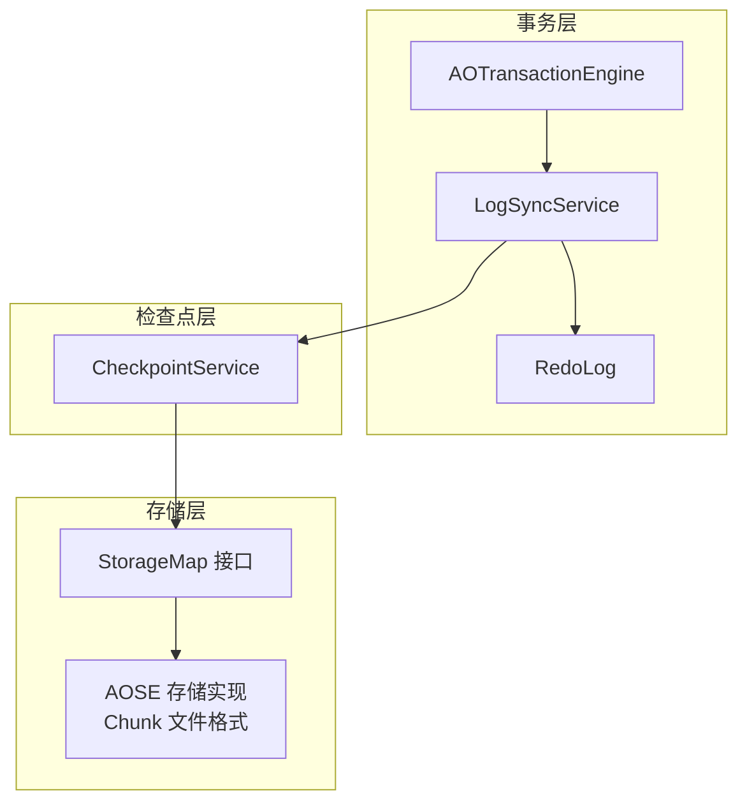
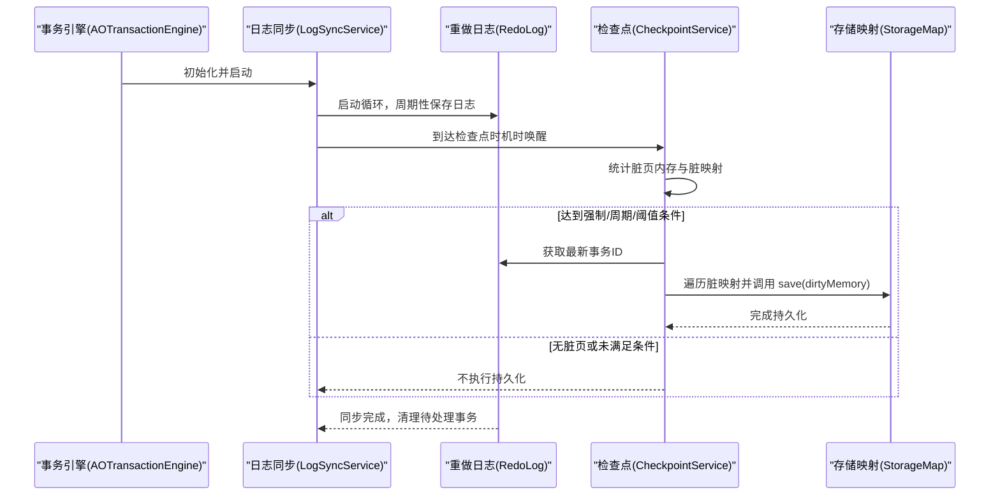
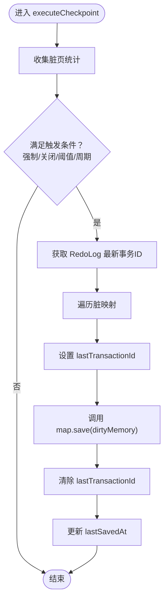
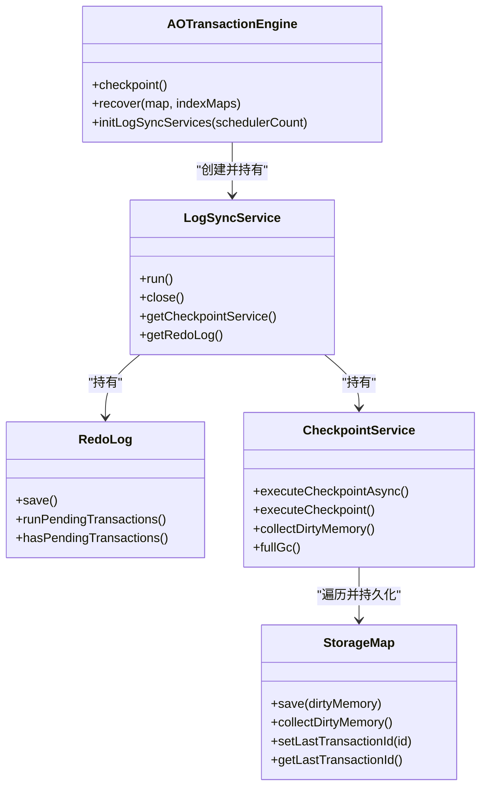
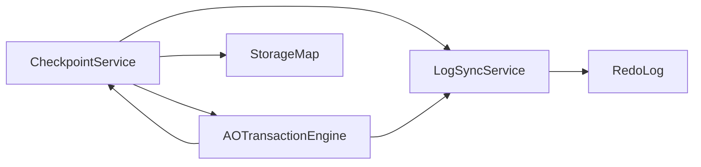

# 检查点机制

<cite>
**本文引用的文件**
- [CheckpointService.java](file://lealone-aote/src/main/java/com/lealone/transaction/aote/CheckpointService.java)
- [LogSyncService.java](file://lealone-aote/src/main/java/com/lealone/transaction/aote/log/LogSyncService.java)
- [RedoLog.java](file://lealone-aote/src/main/java/com/lealone/transaction/aote/log/RedoLog.java)
- [AOTransactionEngine.java](file://lealone-aote/src/main/java/com/lealone/transaction/aote/AOTransactionEngine.java)
- [StorageMap.java](file://lealone-sci/src/main/java/com/lealone/storage/StorageMap.java)
- [Chunk.java](file://lealone-aose/src/main/java/com/lealone/storage/aose/btree/chunk/Chunk.java)
- [RedoLogRecord.java](file://lealone-aote/src/main/java/com/lealone/transaction/aote/log/RedoLogRecord.java)
- [TransactionEngine.java](file://lealone-sci/src/main/java/com/lealone/transaction/TransactionEngine.java)
</cite>

## 目录
1. [简介](#简介)
2. [项目结构](#项目结构)
3. [核心组件](#核心组件)
4. [架构总览](#架构总览)
5. [详细组件分析](#详细组件分析)
6. [依赖关系分析](#依赖关系分析)
7. [性能考量](#性能考量)
8. [故障排查指南](#故障排查指南)
9. [结论](#结论)

## 简介
本文件深入解析 Lealone 中 CheckpointService 的工作原理与实现细节，重点说明：
- 检查点如何协调事务日志（RedoLog）与存储引擎状态同步，以减少数据库恢复时间；
- 增量检查点与完整检查点的触发条件与执行流程；
- 检查点过程对系统性能的影响及优化策略（异步执行、分批处理、周期控制）；
- 检查点元数据的存储格式与管理方式；
- 在系统崩溃后如何利用检查点进行快速恢复。

## 项目结构
围绕检查点机制的关键模块包括：
- 事务引擎与日志同步服务：AOTransactionEngine、LogSyncService、RedoLog
- 检查点服务：CheckpointService
- 存储接口：StorageMap
- 存储实现与元数据：AOSE 的 Chunk 格式
- 日志记录类型：RedoLogRecord

图表来源
- [AOTransactionEngine.java](file://lealone-aote/src/main/java/com/lealone/transaction/aote/AOTransactionEngine.java#L283-L308)
- [LogSyncService.java](file://lealone-aote/src/main/java/com/lealone/transaction/aote/log/LogSyncService.java#L110-L159)
- [RedoLog.java](file://lealone-aote/src/main/java/com/lealone/transaction/aote/log/RedoLog.java#L270-L363)
- [CheckpointService.java](file://lealone-aote/src/main/java/com/lealone/transaction/aote/CheckpointService.java#L226-L268)
- [StorageMap.java](file://lealone-sci/src/main/java/com/lealone/storage/StorageMap.java#L16-L329)
- [Chunk.java](file://lealone-aose/src/main/java/com/lealone/storage/aose/btree/chunk/Chunk.java#L203-L290)

章节来源
- [AOTransactionEngine.java](file://lealone-aote/src/main/java/com/lealone/transaction/aote/AOTransactionEngine.java#L283-L308)
- [LogSyncService.java](file://lealone-aote/src/main/java/com/lealone/transaction/aote/log/LogSyncService.java#L110-L159)
- [RedoLog.java](file://lealone-aote/src/main/java/com/lealone/transaction/aote/log/RedoLog.java#L270-L363)
- [CheckpointService.java](file://lealone-aote/src/main/java/com/lealone/transaction/aote/CheckpointService.java#L226-L268)
- [StorageMap.java](file://lealone-sci/src/main/java/com/lealone/storage/StorageMap.java#L16-L329)
- [Chunk.java](file://lealone-aose/src/main/java/com/lealone/storage/aose/btree/chunk/Chunk.java#L203-L290)

## 核心组件
- CheckpointService：负责周期性或强制性的脏页刷盘、垃圾回收、脏页内存统计与触发持久化。
- LogSyncService：负责将事务日志写入 RedoLog，并在合适时机唤醒 CheckpointService 执行检查点。
- RedoLog：聚合并顺序写出事务日志，支持按调度器批量写出与同步。
- AOTransactionEngine：初始化日志同步服务与检查点服务，提供 checkpoint 触发入口与恢复流程。
- StorageMap：存储引擎抽象接口，定义 save、collectDirtyMemory、setLastTransactionId 等与检查点相关的方法。
- Chunk：AOSE 存储的块头元数据，包含 lastTransactionId 等关键信息，用于恢复一致性判断。

章节来源
- [CheckpointService.java](file://lealone-aote/src/main/java/com/lealone/transaction/aote/CheckpointService.java#L226-L268)
- [LogSyncService.java](file://lealone-aote/src/main/java/com/lealone/transaction/aote/log/LogSyncService.java#L110-L159)
- [RedoLog.java](file://lealone-aote/src/main/java/com/lealone/transaction/aote/log/RedoLog.java#L270-L363)
- [AOTransactionEngine.java](file://lealone-aote/src/main/java/com/lealone/transaction/aote/AOTransactionEngine.java#L244-L259)
- [StorageMap.java](file://lealone-sci/src/main/java/com/lealone/storage/StorageMap.java#L208-L329)
- [Chunk.java](file://lealone-aose/src/main/java/com/lealone/storage/aose/btree/chunk/Chunk.java#L203-L290)

## 架构总览
检查点机制通过“日志先行、按需刷盘”的方式，确保事务日志与存储状态一致，从而缩短崩溃后的恢复时间。

图表来源
- [AOTransactionEngine.java](file://lealone-aote/src/main/java/com/lealone/transaction/aote/AOTransactionEngine.java#L283-L308)
- [LogSyncService.java](file://lealone-aote/src/main/java/com/lealone/transaction/aote/log/LogSyncService.java#L110-L159)
- [RedoLog.java](file://lealone-aote/src/main/java/com/lealone/transaction/aote/log/RedoLog.java#L270-L363)
- [CheckpointService.java](file://lealone-aote/src/main/java/com/lealone/transaction/aote/CheckpointService.java#L226-L268)
- [StorageMap.java](file://lealone-sci/src/main/java/com/lealone/storage/StorageMap.java#L208-L329)

## 详细组件分析

### CheckpointService 工作原理
- 角色定位：作为“脏页刷盘与垃圾回收”的协调者，负责在合适的时机将脏页落盘，并维护脏页内存统计。
- 脏页统计：遍历所有已注册的 StorageMap，调用 collectDirtyMemory，汇总 dirtyMemoryTotal 与 dirtyMaps。
- 触发条件：
  - 强制检查点：外部调用 executeCheckpointAsync 或 forceCheckpointTasks 非空；
  - 关闭前：isClosed=true；
  - 脏页阈值：dirtyMemoryTotal > dirtyPageCacheSize；
  - 周期阈值：lastSavedAt + checkpointPeriod < 当前时间。
- 执行流程：
  - 若存在强制任务，优先执行一个强制任务；
  - 否则根据上述条件决定是否执行；
  - 对每个脏映射，先设置 lastTransactionId，再调用 map.save(dirtyMemory)，最后清除该标记；
  - 更新 lastSavedAt，避免频繁刷盘。
- 垃圾回收：在每次检查点前先执行 gc，包括旧值缓存回收、GcTask 回收、映射 GC。

图表来源
- [CheckpointService.java](file://lealone-aote/src/main/java/com/lealone/transaction/aote/CheckpointService.java#L226-L268)
- [CheckpointService.java](file://lealone-aote/src/main/java/com/lealone/transaction/aote/CheckpointService.java#L280-L310)

章节来源
- [CheckpointService.java](file://lealone-aote/src/main/java/com/lealone/transaction/aote/CheckpointService.java#L226-L268)
- [CheckpointService.java](file://lealone-aote/src/main/java/com/lealone/transaction/aote/CheckpointService.java#L114-L128)
- [CheckpointService.java](file://lealone-aote/src/main/java/com/lealone/transaction/aote/CheckpointService.java#L140-L144)
- [CheckpointService.java](file://lealone-aote/src/main/java/com/lealone/transaction/aote/CheckpointService.java#L146-L187)
- [CheckpointService.java](file://lealone-aote/src/main/java/com/lealone/transaction/aote/CheckpointService.java#L189-L206)
- [CheckpointService.java](file://lealone-aote/src/main/java/com/lealone/transaction/aote/CheckpointService.java#L208-L214)
- [CheckpointService.java](file://lealone-aote/src/main/java/com/lealone/transaction/aote/CheckpointService.java#L216-L224)
- [CheckpointService.java](file://lealone-aote/src/main/java/com/lealone/transaction/aote/CheckpointService.java#L280-L310)

### 增量检查点与完整检查点
- 增量检查点：由 CheckpointService 基于脏页统计与阈值触发，仅对有变化的映射执行 save，属于“按需”刷盘。
- 完整检查点：通过外部调用 executeCheckpointAsync 或在关闭时触发，确保所有活跃映射都得到持久化。
- 触发入口：
  - 事务引擎提供 checkpoint() 方法，内部向所有 LogSyncService 发送异步检查点请求；
  - 也可通过存储事件或手动命令触发。

章节来源
- [AOTransactionEngine.java](file://lealone-aote/src/main/java/com/lealone/transaction/aote/AOTransactionEngine.java#L244-L249)
- [AOTransactionEngine.java](file://lealone-aote/src/main/java/com/lealone/transaction/aote/AOTransactionEngine.java#L165-L188)
- [CheckpointService.java](file://lealone-aote/src/main/java/com/lealone/transaction/aote/CheckpointService.java#L105-L111)

### 事务日志与存储引擎的同步
- RedoLog.save() 会从各调度器的 PendingTransaction 队列中按提交时间戳顺序取出事务日志，聚合到 DataBuffer 并写出；
- 对于多服务实例，RedoLog 会根据服务索引筛选与自身关联的事务，保证一致性；
- 写出后，若为周期模式，会进行同步；否则在必要时立即同步；
- CheckpointService 在执行持久化前，会读取 RedoLog 的 lastTransactionId，并将其设置到 StorageMap 上，确保持久化边界与日志边界一致。

章节来源
- [RedoLog.java](file://lealone-aote/src/main/java/com/lealone/transaction/aote/log/RedoLog.java#L270-L363)
- [RedoLog.java](file://lealone-aote/src/main/java/com/lealone/transaction/aote/log/RedoLog.java#L365-L408)
- [CheckpointService.java](file://lealone-aote/src/main/java/com/lealone/transaction/aote/CheckpointService.java#L249-L261)

### 检查点元数据与恢复
- 元数据来源：AOSE 的 Chunk 文件头包含 lastTransactionId 等关键字段，用于判断该块内的数据与日志边界一致性；
- 恢复流程：事务引擎在 recover 时调用 RedoLog.redo，按事务顺序重放日志，使存储状态回到崩溃前的一致点；
- 检查点的作用：通过定期将脏页落盘，减少恢复时需要重放的日志量，从而缩短恢复时间。

章节来源
- [Chunk.java](file://lealone-aose/src/main/java/com/lealone/storage/aose/btree/chunk/Chunk.java#L203-L290)
- [AOTransactionEngine.java](file://lealone-aote/src/main/java/com/lealone/transaction/aote/AOTransactionEngine.java#L252-L259)
- [RedoLog.java](file://lealone-aote/src/main/java/com/lealone/transaction/aote/log/RedoLog.java#L188-L280)

### 类关系图

图表来源
- [AOTransactionEngine.java](file://lealone-aote/src/main/java/com/lealone/transaction/aote/AOTransactionEngine.java#L283-L308)
- [LogSyncService.java](file://lealone-aote/src/main/java/com/lealone/transaction/aote/log/LogSyncService.java#L110-L159)
- [RedoLog.java](file://lealone-aote/src/main/java/com/lealone/transaction/aote/log/RedoLog.java#L270-L363)
- [CheckpointService.java](file://lealone-aote/src/main/java/com/lealone/transaction/aote/CheckpointService.java#L226-L268)
- [StorageMap.java](file://lealone-sci/src/main/java/com/lealone/storage/StorageMap.java#L208-L329)

## 依赖关系分析
- CheckpointService 依赖：
  - AOTransactionEngine：获取当前事务状态、重复读事务数量；
  - LogSyncService：获取 RedoLog 的 lastTransactionId，协调唤醒；
  - StorageMap：遍历并持久化脏页。
- LogSyncService 依赖：
  - RedoLog：周期性保存日志；
  - CheckpointService：在合适时机触发检查点。
- AOTransactionEngine 依赖：
  - LogSyncService：初始化与启动；
  - StorageMap：注册映射、移除映射、触发检查点。

图表来源
- [AOTransactionEngine.java](file://lealone-aote/src/main/java/com/lealone/transaction/aote/AOTransactionEngine.java#L283-L308)
- [LogSyncService.java](file://lealone-aote/src/main/java/com/lealone/transaction/aote/log/LogSyncService.java#L110-L159)
- [CheckpointService.java](file://lealone-aote/src/main/java/com/lealone/transaction/aote/CheckpointService.java#L226-L268)
- [StorageMap.java](file://lealone-sci/src/main/java/com/lealone/storage/StorageMap.java#L16-L329)

章节来源
- [AOTransactionEngine.java](file://lealone-aote/src/main/java/com/lealone/transaction/aote/AOTransactionEngine.java#L283-L308)
- [LogSyncService.java](file://lealone-aote/src/main/java/com/lealone/transaction/aote/log/LogSyncService.java#L110-L159)
- [CheckpointService.java](file://lealone-aote/src/main/java/com/lealone/transaction/aote/CheckpointService.java#L226-L268)
- [StorageMap.java](file://lealone-sci/src/main/java/com/lealone/storage/StorageMap.java#L16-L329)

## 性能考量
- 异步执行与唤醒：
  - LogSyncService.run() 在满足条件时唤醒 CheckpointService.run()，避免阻塞主循环；
  - RedoLog.save() 采用批量写出与按需同步，减少磁盘同步次数。
- 分批处理：
  - RedoLog.save() 将 PendingTransaction 按提交时间戳顺序聚合，达到缓冲阈值后写出；
  - CheckpointService.collectDirtyMemory() 逐映射统计，避免一次性扫描全量数据。
- 周期控制：
  - checkpointPeriod 控制检查点周期，loopInterval 控制唤醒间隔，两者取较小值以平衡吞吐与延迟。
- 垃圾回收：
  - 在检查点前执行 gc，释放旧值缓存与映射垃圾，降低后续持久化压力。

章节来源
- [LogSyncService.java](file://lealone-aote/src/main/java/com/lealone/transaction/aote/log/LogSyncService.java#L110-L159)
- [RedoLog.java](file://lealone-aote/src/main/java/com/lealone/transaction/aote/log/RedoLog.java#L270-L363)
- [CheckpointService.java](file://lealone-aote/src/main/java/com/lealone/transaction/aote/CheckpointService.java#L114-L128)
- [CheckpointService.java](file://lealone-aote/src/main/java/com/lealone/transaction/aote/CheckpointService.java#L140-L144)

## 故障排查指南
- 检查点失败：
  - 查看 CheckpointService.executeCheckpoint() 异常日志；
  - 确认 dirtyMaps 是否为空、StorageMap 是否已关闭；
  - 检查 RedoLog.lastTransactionId 获取是否成功。
- 日志未同步：
  - 检查 LogSyncService.isPeriodic() 与 asyncLogQueueSize 阈值；
  - 确认 RedoLog.save() 是否正常写出并同步。
- 恢复异常：
  - 确认 Chunk.header 中的 lastTransactionId 与 RedoLog 的边界一致；
  - 使用 AOTransactionEngine.recover() 重放日志，观察是否有无效事务或索引校验失败。

章节来源
- [CheckpointService.java](file://lealone-aote/src/main/java/com/lealone/transaction/aote/CheckpointService.java#L226-L268)
- [LogSyncService.java](file://lealone-aote/src/main/java/com/lealone/transaction/aote/log/LogSyncService.java#L110-L159)
- [RedoLog.java](file://lealone-aote/src/main/java/com/lealone/transaction/aote/log/RedoLog.java#L270-L363)
- [Chunk.java](file://lealone-aose/src/main/java/com/lealone/storage/aose/btree/chunk/Chunk.java#L203-L290)

## 结论
- CheckpointService 通过“脏页统计 + 条件触发 + 分批持久化”的机制，有效降低了存储层的写放大与恢复成本；
- 与 RedoLog 协同，确保事务日志与存储状态边界一致，显著缩短崩溃恢复时间；
- 通过异步唤醒、批量写出与周期控制，兼顾吞吐与延迟；
- 元数据层面，Chunk 的 lastTransactionId 与 RedoLog 的边界配合，为恢复提供了可靠依据。