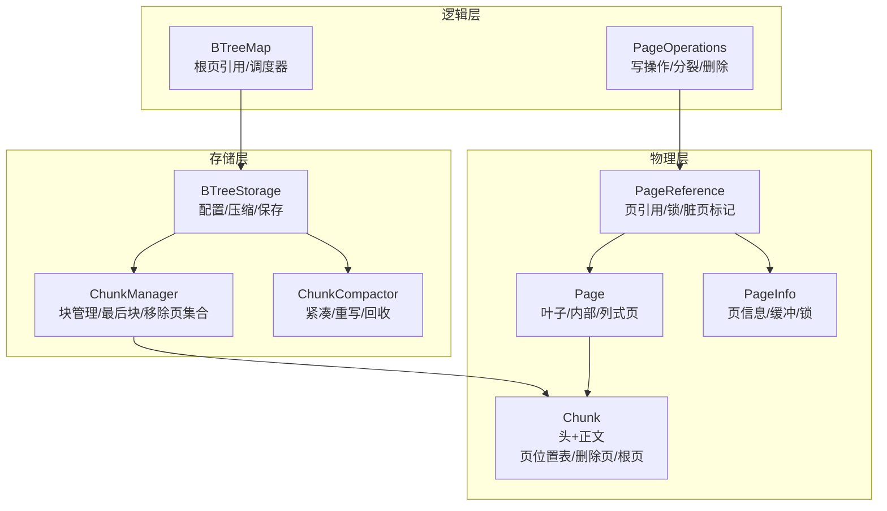
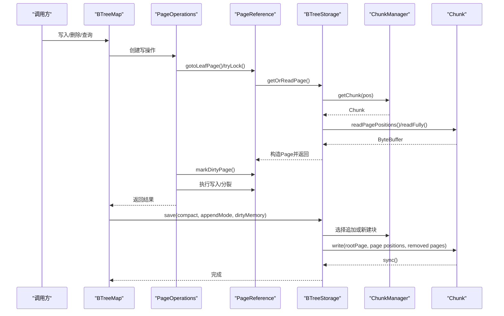
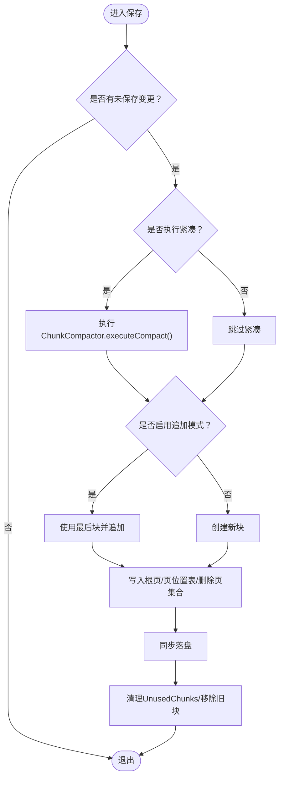
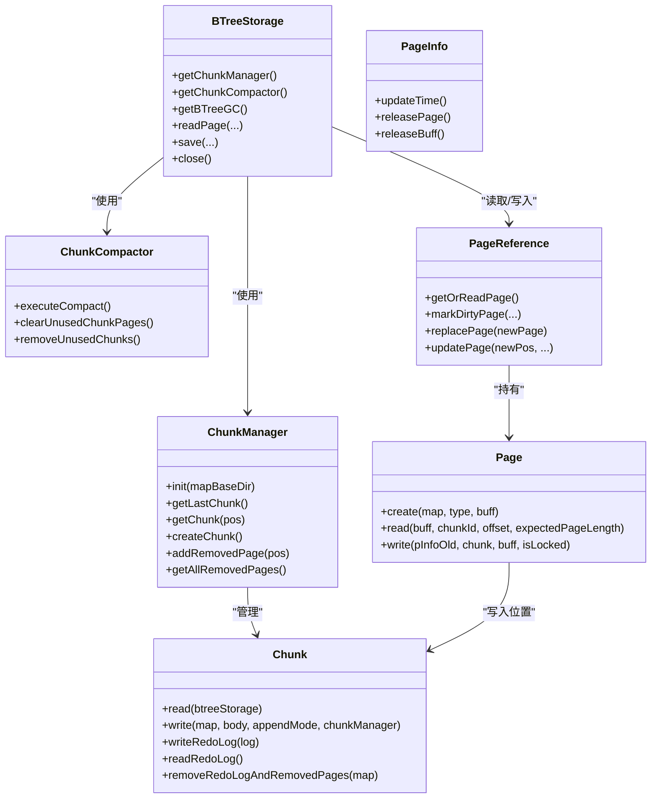

# B-Tree存储管理

**本文引用的文件列表**
- [BTreeStorage.java](https://github.com/lealone/Lealone/blob/master/lealone-aose/src/main/java/com/lealone/storage/aose/btree/BTreeStorage.java)
- [ChunkManager.java](https://github.com/lealone/Lealone/blob/master/lealone-aose/src/main/java/com/lealone/storage/aose/btree/chunk/ChunkManager.java)
- [Chunk.java](https://github.com/lealone/Lealone/blob/master/lealone-aose/src/main/java/com/lealone/storage/aose/btree/chunk/Chunk.java)
- [ChunkCompactor.java](https://github.com/lealone/Lealone/blob/master/lealone-aose/src/main/java/com/lealone/storage/aose/btree/chunk/ChunkCompactor.java)
- [Page.java](https://github.com/lealone/Lealone/blob/master/lealone-aose/src/main/java/com/lealone/storage/aose/btree/page/Page.java)
- [PageInfo.java](https://github.com/lealone/Lealone/blob/master/lealone-aose/src/main/java/com/lealone/storage/aose/btree/page/PageInfo.java)
- [PageReference.java](https://github.com/lealone/Lealone/blob/master/lealone-aose/src/main/java/com/lealone/storage/aose/btree/page/PageReference.java)
- [PageStorageMode.java](https://github.com/lealone/Lealone/blob/master/lealone-aose/src/main/java/com/lealone/storage/aose/btree/page/PageStorageMode.java)
- [PageUtils.java](https://github.com/lealone/Lealone/blob/master/lealone-aose/src/main/java/com/lealone/storage/aose/btree/page/PageUtils.java)
- [PageOperations.java](https://github.com/lealone/Lealone/blob/master/lealone-aose/src/main/java/com/lealone/storage/aose/btree/page/PageOperations.java)
- [BTreeMap.java](https://github.com/lealone/Lealone/blob/master/lealone-aose/src/main/java/com/lealone/storage/aose/btree/BTreeMap.java)

## 目录
1. [简介](#简介)
2. [项目结构](#项目结构)
3. [核心组件](#核心组件)
4. [架构总览](#架构总览)
5. [详细组件分析](#详细组件分析)
6. [依赖关系分析](#依赖关系分析)
7. [性能考量](#性能考量)
8. [故障排查指南](#故障排查指南)
9. [结论](#结论)
10. [附录](#附录)

## 简介
本文件系统性阐述AOSE存储引擎中BTreeStorage类在B-Tree物理存储结构管理中的核心作用，重点解析：
- B-Tree节点在磁盘上的布局与页（Page）、块（Chunk）的组织方式
- ChunkManager与Chunk的分配、回收与元数据维护机制
- BTreeStorage与ChunkManager的协作，实现内存与磁盘高效交换
- 不同PageStorageMode（行式/列式）对B-Tree性能的影响与配置建议
- 结合代码路径，展示BTreeStorage在初始化、加载与持久化过程中的具体流程

## 项目结构
AOSE模块围绕“页-块-文件”三层组织B-Tree物理存储：
- 页（Page）：B-Tree节点的最小可寻址单元，包含键、值或子指针
- 块（Chunk）：连续的磁盘文件段，包含若干页及其元数据（页位置与长度映射、已删除页集合、根页位置等）
- 文件（Chunk文件）：以固定头部（含校验）+正文（页数据+元数据）形式持久化

图表来源
- [BTreeStorage.java](https://github.com/lealone/Lealone/blob/master/lealone-aose/src/main/java/com/lealone/storage/aose/btree/BTreeStorage.java#L65-L194)
- [ChunkManager.java](https://github.com/lealone/Lealone/blob/master/lealone-aose/src/main/java/com/lealone/storage/aose/btree/chunk/ChunkManager.java#L40-L113)
- [Chunk.java](https://github.com/lealone/Lealone/blob/master/lealone-aose/src/main/java/com/lealone/storage/aose/btree/chunk/Chunk.java#L191-L309)
- [PageReference.java](https://github.com/lealone/Lealone/blob/master/lealone-aose/src/main/java/com/lealone/storage/aose/btree/page/PageReference.java#L161-L208)
- [Page.java](https://github.com/lealone/Lealone/blob/master/lealone-aose/src/main/java/com/lealone/storage/aose/btree/page/Page.java#L226-L241)

章节来源
- [BTreeStorage.java](https://github.com/lealone/Lealone/blob/master/lealone-aose/src/main/java/com/lealone/storage/aose/btree/BTreeStorage.java#L65-L194)
- [ChunkManager.java](https://github.com/lealone/Lealone/blob/master/lealone-aose/src/main/java/com/lealone/storage/aose/btree/chunk/ChunkManager.java#L40-L113)
- [Chunk.java](https://github.com/lealone/Lealone/blob/master/lealone-aose/src/main/java/com/lealone/storage/aose/btree/chunk/Chunk.java#L191-L309)
- [PageReference.java](https://github.com/lealone/Lealone/blob/master/lealone-aose/src/main/java/com/lealone/storage/aose/btree/page/PageReference.java#L161-L208)
- [Page.java](https://github.com/lealone/Lealone/blob/master/lealone-aose/src/main/java/com/lealone/storage/aose/btree/page/Page.java#L226-L241)

## 核心组件
- BTreeStorage：负责B-Tree持久化存储的生命周期管理、页读取/写入、保存/恢复、压缩策略、磁盘空间统计与异常处理
- ChunkManager：负责块文件发现与加载、最后块跟踪、移除页集合维护、块创建与删除
- Chunk：块文件的读写、头部校验、页位置与长度映射、删除页集合、根页位置、事务ID等元数据
- ChunkCompactor：基于最小填充率触发的块紧凑（重写存活页到新块），回收未使用块
- Page/Leaf/Node/Column：页类型工厂与读写协议，支持压缩/解压、校验值、页位置编码
- PageReference/PageInfo：页引用与页信息，支持锁、脏页标记、GC、替换与更新
- PageStorageMode：行式/列式存储模式枚举，影响页类型选择与序列化布局

章节来源
- [BTreeStorage.java](https://github.com/lealone/Lealone/blob/master/lealone-aose/src/main/java/com/lealone/storage/aose/btree/BTreeStorage.java#L65-L194)
- [ChunkManager.java](https://github.com/lealone/Lealone/blob/master/lealone-aose/src/main/java/com/lealone/storage/aose/btree/chunk/ChunkManager.java#L124-L160)
- [Chunk.java](https://github.com/lealone/Lealone/blob/master/lealone-aose/src/main/java/com/lealone/storage/aose/btree/chunk/Chunk.java#L191-L309)
- [ChunkCompactor.java](https://github.com/lealone/Lealone/blob/master/lealone-aose/src/main/java/com/lealone/storage/aose/btree/chunk/ChunkCompactor.java#L69-L169)
- [Page.java](https://github.com/lealone/Lealone/blob/master/lealone-aose/src/main/java/com/lealone/storage/aose/btree/page/Page.java#L27-L52)
- [PageReference.java](https://github.com/lealone/Lealone/blob/master/lealone-aose/src/main/java/com/lealone/storage/aose/btree/page/PageReference.java#L232-L363)
- [PageInfo.java](https://github.com/lealone/Lealone/blob/master/lealone-aose/src/main/java/com/lealone/storage/aose/btree/page/PageInfo.java#L1-L181)
- [PageStorageMode.java](https://github.com/lealone/Lealone/blob/master/lealone-aose/src/main/java/com/lealone/storage/aose/btree/page/PageStorageMode.java#L8-L12)

## 架构总览
BTreeStorage作为AOSE B-Tree的物理存储中枢，协调以下关键流程：
- 初始化：解析配置（页大小、最小填充率、压缩级别、缓存大小），建立ChunkManager与ChunkCompactor，扫描并加载最后块
- 读取：通过PageReference定位页，若内存中无页则从Chunk中读取并构造Page，设置PageInfo与PageLock
- 写入：PageOperations封装单键写操作，先定位叶页、加锁、标记脏页、执行写入，必要时触发页分裂
- 保存：决定是否紧凑（ChunkCompactor），选择追加或新建块，写入根页、页位置表、删除页集合、同步落盘
- 回收：BTreeGC与ChunkCompactor配合，回收未使用块与页缓冲，维持内存占用与磁盘利用率平衡

图表来源
- [BTreeMap.java](https://github.com/lealone/Lealone/blob/master/lealone-aose/src/main/java/com/lealone/storage/aose/btree/BTreeMap.java#L382-L405)
- [PageOperations.java](https://github.com/lealone/Lealone/blob/master/lealone-aose/src/main/java/com/lealone/storage/aose/btree/page/PageOperations.java#L82-L151)
- [PageReference.java](https://github.com/lealone/Lealone/blob/master/lealone-aose/src/main/java/com/lealone/storage/aose/btree/page/PageReference.java#L161-L208)
- [BTreeStorage.java](https://github.com/lealone/Lealone/blob/master/lealone-aose/src/main/java/com/lealone/storage/aose/btree/BTreeStorage.java#L306-L366)
- [ChunkManager.java](https://github.com/lealone/Lealone/blob/master/lealone-aose/src/main/java/com/lealone/storage/aose/btree/chunk/ChunkManager.java#L124-L146)
- [Chunk.java](https://github.com/lealone/Lealone/blob/master/lealone-aose/src/main/java/com/lealone/storage/aose/btree/chunk/Chunk.java#L298-L309)

## 详细组件分析

### BTreeStorage：物理存储中枢
- 配置与初始化
  - 解析页大小、最小填充率、压缩级别、缓存大小；限制最小填充率上限；初始化BTreeGC
  - 若非内存模式，创建映射目录并扫描块文件，加载最后块
- 读取与页解码
  - 通过ChunkManager定位块，计算文件偏移，读取页缓冲，构造Page并设置PageInfo（包含缓冲、长度、锁、元版本）
- 写入与保存
  - 保存前可执行紧凑（ChunkCompactor），选择追加或新建块；写入根页、页位置表、删除页集合，同步落盘
  - 支持重做日志写入与校验
- 关闭与清理
  - 正常关闭先保存，再关闭ChunkManager与BTreeGC；立即关闭忽略错误

图表来源
- [BTreeStorage.java](https://github.com/lealone/Lealone/blob/master/lealone-aose/src/main/java/com/lealone/storage/aose/btree/BTreeStorage.java#L306-L366)
- [ChunkCompactor.java](https://github.com/lealone/Lealone/blob/master/lealone-aose/src/main/java/com/lealone/storage/aose/btree/chunk/ChunkCompactor.java#L69-L169)
- [Chunk.java](https://github.com/lealone/Lealone/blob/master/lealone-aose/src/main/java/com/lealone/storage/aose/btree/chunk/Chunk.java#L298-L309)

章节来源
- [BTreeStorage.java](https://github.com/lealone/Lealone/blob/master/lealone-aose/src/main/java/com/lealone/storage/aose/btree/BTreeStorage.java#L65-L194)
- [BTreeStorage.java](https://github.com/lealone/Lealone/blob/master/lealone-aose/src/main/java/com/lealone/storage/aose/btree/BTreeStorage.java#L205-L241)
- [BTreeStorage.java](https://github.com/lealone/Lealone/blob/master/lealone-aose/src/main/java/com/lealone/storage/aose/btree/BTreeStorage.java#L306-L366)
- [BTreeStorage.java](https://github.com/lealone/Lealone/blob/master/lealone-aose/src/main/java/com/lealone/storage/aose/btree/BTreeStorage.java#L368-L414)

### ChunkManager：块管理与发现
- 块发现与最后块
  - 扫描映射目录，解析块文件名（c_[id]_[seq]），维护最大序列号与最后块
- 块读取与缓存
  - 按需读取块头与页位置表，缓存块实例；提供最后块访问与块创建
- 移除页集合
  - 维护全局移除页集合，合并最后块的移除页集合，用于紧凑判断与重写

章节来源
- [ChunkManager.java](https://github.com/lealone/Lealone/blob/master/lealone-aose/src/main/java/com/lealone/storage/aose/btree/chunk/ChunkManager.java#L40-L75)
- [ChunkManager.java](https://github.com/lealone/Lealone/blob/master/lealone-aose/src/main/java/com/lealone/storage/aose/btree/chunk/ChunkManager.java#L115-L146)
- [ChunkManager.java](https://github.com/lealone/Lealone/blob/master/lealone-aose/src/main/java/com/lealone/storage/aose/btree/chunk/ChunkManager.java#L188-L206)

### Chunk：块文件的读写与元数据
- 头部与校验
  - 两份头部拷贝（块大小固定），使用Fletcher校验；解析并验证格式版本
- 页位置与长度映射
  - 记录每个页的位置与长度，支持随机访问与紧凑重写
- 删除页集合
  - 记录被删除页位置，支持与新移除页合并
- 写入与追加
  - 写入页位置表与删除页集合，写入头部与正文，支持追加模式与同步

章节来源
- [Chunk.java](https://github.com/lealone/Lealone/blob/master/lealone-aose/src/main/java/com/lealone/storage/aose/btree/chunk/Chunk.java#L191-L309)
- [Chunk.java](https://github.com/lealone/Lealone/blob/master/lealone-aose/src/main/java/com/lealone/storage/aose/btree/chunk/Chunk.java#L311-L353)

### ChunkCompactor：紧凑与回收
- 紧凑策略
  - 基于最小填充率筛选低效块，计算存活页总长度，批量重写至新块
- 未使用块回收
  - 将完全未使用的块延迟删除，待最新块写入成功后再删除，避免数据丢失风险
- 移除页集合清理
  - 清理UnusedChunks中的页对应移除集合，避免重复写入

章节来源
- [ChunkCompactor.java](https://github.com/lealone/Lealone/blob/master/lealone-aose/src/main/java/com/lealone/storage/aose/btree/chunk/ChunkCompactor.java#L69-L169)

### Page/Leaf/Node/Column：页类型与布局
- 页类型工厂
  - 根据类型与存储模式（行式/列式）选择具体页实现（KeyPage/KeyValuePage/KeyColumnsPage/RowPage/ColumnsPage/ColumnPage/NodePage）
- 读写协议
  - read：从缓冲区读取页内容，设置PageInfo；write：将页及其子页写入块，返回页位置
- 压缩与校验
  - 支持快速/高压缩，写入前压缩，读取时解压；页头包含校验值与长度检查

章节来源
- [Page.java](https://github.com/lealone/Lealone/blob/master/lealone-aose/src/main/java/com/lealone/storage/aose/btree/page/Page.java#L27-L52)
- [Page.java](https://github.com/lealone/Lealone/blob/master/lealone-aose/src/main/java/com/lealone/storage/aose/btree/page/Page.java#L226-L241)
- [Page.java](https://github.com/lealone/Lealone/blob/master/lealone-aose/src/main/java/com/lealone/storage/aose/btree/page/Page.java#L308-L356)
- [PageStorageMode.java](https://github.com/lealone/Lealone/blob/master/lealone-aose/src/main/java/com/lealone/storage/aose/btree/page/PageStorageMode.java#L8-L12)

### PageReference/PageInfo：页引用与信息
- 页引用
  - 提供页锁、脏页标记、替换页、更新页位置、GC释放等能力；支持数据结构变化（分裂/删除）重定向
- 页信息
  - 记录页对象、缓冲、长度、锁、命中时间与次数、元版本；支持复制与内存统计

章节来源
- [PageReference.java](https://github.com/lealone/Lealone/blob/master/lealone-aose/src/main/java/com/lealone/storage/aose/btree/page/PageReference.java#L161-L208)
- [PageReference.java](https://github.com/lealone/Lealone/blob/master/lealone-aose/src/main/java/com/lealone/storage/aose/btree/page/PageReference.java#L232-L363)
- [PageInfo.java](https://github.com/lealone/Lealone/blob/master/lealone-aose/src/main/java/com/lealone/storage/aose/btree/page/PageInfo.java#L1-L181)

### PageOperations：写操作编排
- 单键写操作
  - Put/PutIfAbsent/Remove/Append等，封装定位叶页、加锁、标记脏页、执行写入、必要时触发页分裂
- 异步操作
  - 分裂与删除采用异步调度，避免阻塞写路径

章节来源
- [PageOperations.java](https://github.com/lealone/Lealone/blob/master/lealone-aose/src/main/java/com/lealone/storage/aose/btree/page/PageOperations.java#L82-L151)
- [PageOperations.java](https://github.com/lealone/Lealone/blob/master/lealone-aose/src/main/java/com/lealone/storage/aose/btree/page/PageOperations.java#L283-L400)
- [PageOperations.java](https://github.com/lealone/Lealone/blob/master/lealone-aose/src/main/java/com/lealone/storage/aose/btree/page/PageOperations.java#L402-L521)

## 依赖关系分析

图表来源
- [BTreeStorage.java](https://github.com/lealone/Lealone/blob/master/lealone-aose/src/main/java/com/lealone/storage/aose/btree/BTreeStorage.java#L141-L170)
- [ChunkManager.java](https://github.com/lealone/Lealone/blob/master/lealone-aose/src/main/java/com/lealone/storage/aose/btree/chunk/ChunkManager.java#L124-L160)
- [Chunk.java](https://github.com/lealone/Lealone/blob/master/lealone-aose/src/main/java/com/lealone/storage/aose/btree/chunk/Chunk.java#L298-L309)
- [PageReference.java](https://github.com/lealone/Lealone/blob/master/lealone-aose/src/main/java/com/lealone/storage/aose/btree/page/PageReference.java#L161-L208)
- [Page.java](https://github.com/lealone/Lealone/blob/master/lealone-aose/src/main/java/com/lealone/storage/aose/btree/page/Page.java#L226-L241)

章节来源
- [BTreeStorage.java](https://github.com/lealone/Lealone/blob/master/lealone-aose/src/main/java/com/lealone/storage/aose/btree/BTreeStorage.java#L141-L170)
- [ChunkManager.java](https://github.com/lealone/Lealone/blob/master/lealone-aose/src/main/java/com/lealone/storage/aose/btree/chunk/ChunkManager.java#L124-L160)
- [Chunk.java](https://github.com/lealone/Lealone/blob/master/lealone-aose/src/main/java/com/lealone/storage/aose/btree/chunk/Chunk.java#L298-L309)
- [PageReference.java](https://github.com/lealone/Lealone/blob/master/lealone-aose/src/main/java/com/lealone/storage/aose/btree/page/PageReference.java#L161-L208)
- [Page.java](https://github.com/lealone/Lealone/blob/master/lealone-aose/src/main/java/com/lealone/storage/aose/btree/page/Page.java#L226-L241)

## 性能考量
- 页与块布局
  - 页对齐（典型页大小与块对齐）减少碎片，提高顺序写入效率
  - 块头部双拷贝与Fletcher校验提升崩溃恢复可靠性
- 压缩策略
  - 支持快速/高压缩级别，仅对较大页有效；压缩比与CPU开销权衡
- 填充率与紧凑
  - 通过最小填充率阈值驱动ChunkCompactor，降低碎片与随机I/O
- 内存与磁盘交换
  - PageReference在内存中缓存页对象与缓冲，结合BTreeGC控制内存占用；GC释放页对象或缓冲，避免长期占用
- 并发与锁
  - PageReference提供轻量级锁与PageListener链，写操作先定位叶页、加锁、标记脏页，再执行写入，减少冲突

章节来源
- [Chunk.java](https://github.com/lealone/Lealone/blob/master/lealone-aose/src/main/java/com/lealone/storage/aose/btree/chunk/Chunk.java#L191-L246)
- [Page.java](https://github.com/lealone/Lealone/blob/master/lealone-aose/src/main/java/com/lealone/storage/aose/btree/page/Page.java#L308-L356)
- [ChunkCompactor.java](https://github.com/lealone/Lealone/blob/master/lealone-aose/src/main/java/com/lealone/storage/aose/btree/chunk/ChunkCompactor.java#L114-L169)
- [PageReference.java](https://github.com/lealone/Lealone/blob/master/lealone-aose/src/main/java/com/lealone/storage/aose/btree/page/PageReference.java#L232-L363)

## 故障排查指南
- 文件损坏与校验失败
  - 块头部校验失败或页长度不合法会触发panic，关闭存储并返回异常
- 页位置缺失
  - 读取页时若页位置表中无对应项，抛出文件损坏异常
- 追加模式限制
  - 旧格式块不支持追加，自动回退到新建块
- 重做日志校验
  - 通过validateRedoLog校验事务ID，确保数据一致性

章节来源
- [Chunk.java](https://github.com/lealone/Lealone/blob/master/lealone-aose/src/main/java/com/lealone/storage/aose/btree/chunk/Chunk.java#L227-L246)
- [Page.java](https://github.com/lealone/Lealone/blob/master/lealone-aose/src/main/java/com/lealone/storage/aose/btree/page/Page.java#L300-L307)
- [BTreeStorage.java](https://github.com/lealone/Lealone/blob/master/lealone-aose/src/main/java/com/lealone/storage/aose/btree/BTreeStorage.java#L315-L366)
- [BTreeStorage.java](https://github.com/lealone/Lealone/blob/master/lealone-aose/src/main/java/com/lealone/storage/aose/btree/BTreeStorage.java#L394-L414)

## 结论
BTreeStorage通过ChunkManager与Chunk实现可靠的页-块-文件组织，结合PageReference/PageInfo的页生命周期管理与PageOperations的写操作编排，形成高可靠、可扩展的B-Tree物理存储体系。通过最小填充率驱动的紧凑机制与压缩策略，兼顾磁盘利用率与CPU成本；通过BTreeGC与移除页集合，实现内存与磁盘的高效交换。不同PageStorageMode（行式/列式）在页类型与序列化布局上差异显著，应依据数据特征与查询模式选择合适模式以获得最佳性能。

## 附录

### B-Tree节点在磁盘上的布局与页/块组织
- 页位置编码
  - 页位置由块ID、偏移与类型编码组成，便于快速解析与定位
- 块文件结构
  - 头部包含块大小、校验与元数据；正文包含页数据与页位置表、删除页集合
- 页布局
  - 页类型区分叶子/内部/列式；行式/列式存储模式影响键值布局与序列化

章节来源
- [PageUtils.java](https://github.com/lealone/Lealone/blob/master/lealone-aose/src/main/java/com/lealone/storage/aose/btree/page/PageUtils.java#L40-L94)
- [Chunk.java](https://github.com/lealone/Lealone/blob/master/lealone-aose/src/main/java/com/lealone/storage/aose/btree/chunk/Chunk.java#L191-L309)
- [Page.java](https://github.com/lealone/Lealone/blob/master/lealone-aose/src/main/java/com/lealone/storage/aose/btree/page/Page.java#L27-L52)

### BTreeStorage初始化、加载与持久化流程（代码路径）
- 初始化
  - [BTreeStorage构造函数](https://github.com/lealone/Lealone/blob/master/lealone-aose/src/main/java/com/lealone/storage/aose/btree/BTreeStorage.java#L65-L98)
  - [ChunkManager.init](https://github.com/lealone/Lealone/blob/master/lealone-aose/src/main/java/com/lealone/storage/aose/btree/chunk/ChunkManager.java#L40-L75)
- 加载
  - [BTreeStorage.readPage](https://github.com/lealone/Lealone/blob/master/lealone-aose/src/main/java/com/lealone/storage/aose/btree/BTreeStorage.java#L219-L241)
  - [PageReference.getOrReadPage](https://github.com/lealone/Lealone/blob/master/lealone-aose/src/main/java/com/lealone/storage/aose/btree/page/PageReference.java#L161-L208)
- 持久化
  - [BTreeMap.save](https://github.com/lealone/Lealone/blob/master/lealone-aose/src/main/java/com/lealone/storage/aose/btree/BTreeMap.java#L382-L405)
  - [BTreeStorage.save](https://github.com/lealone/Lealone/blob/master/lealone-aose/src/main/java/com/lealone/storage/aose/btree/BTreeStorage.java#L306-L366)
  - [Chunk.write](https://github.com/lealone/Lealone/blob/master/lealone-aose/src/main/java/com/lealone/storage/aose/btree/chunk/Chunk.java#L298-L309)