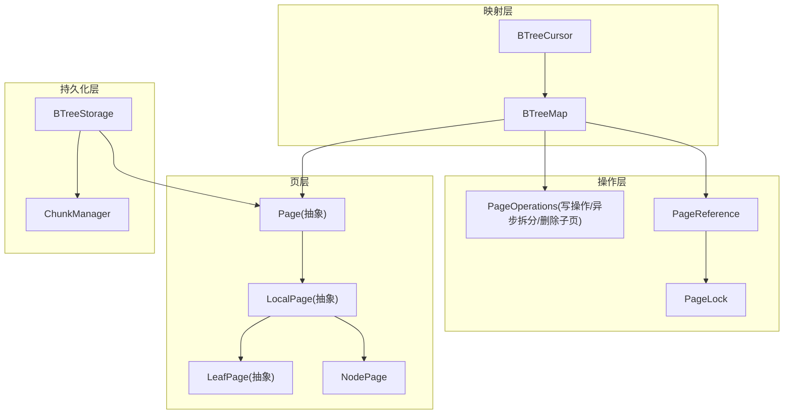
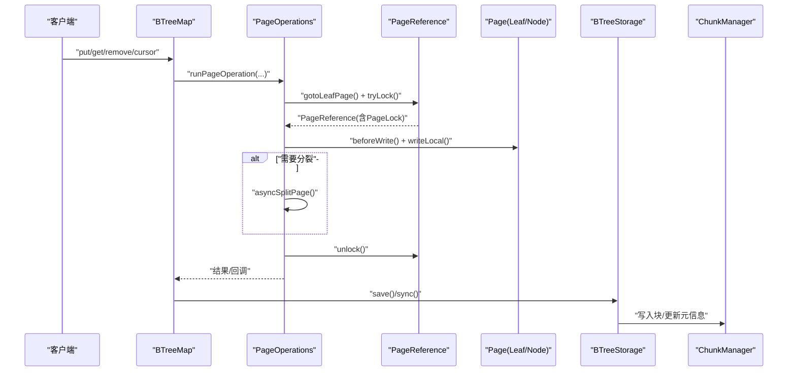
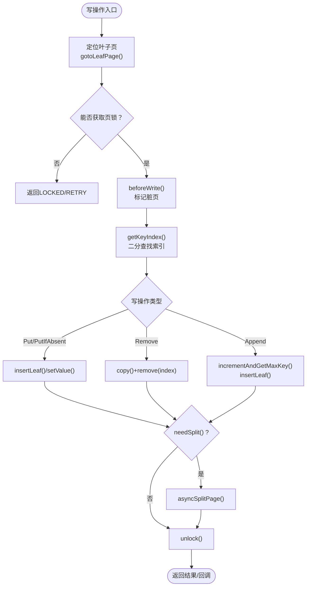
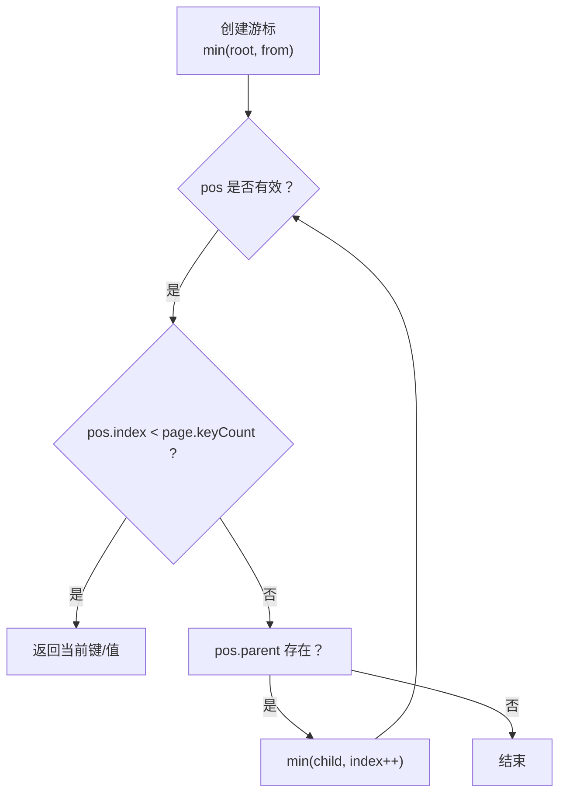
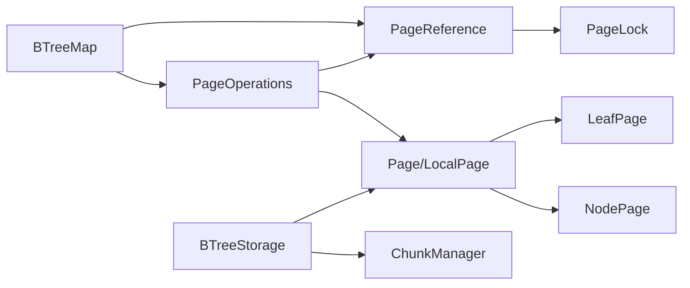

# B-Tree实现

<cite>
**本文引用的文件**
- [BTreeStorage.java](https://github.com/lealone/Lealone/blob/master/lealone-aose/src/main/java/com/lealone/storage/aose/btree/BTreeStorage.java)
- [BTreeMap.java](https://github.com/lealone/Lealone/blob/master/lealone-aose/src/main/java/com/lealone/storage/aose/btree/BTreeMap.java)
- [BTreeCursor.java](https://github.com/lealone/Lealone/blob/master/lealone-aose/src/main/java/com/lealone/storage/aose/btree/BTreeCursor.java)
- [Page.java](https://github.com/lealone/Lealone/blob/master/lealone-aose/src/main/java/com/lealone/storage/aose/btree/page/Page.java)
- [LeafPage.java](https://github.com/lealone/Lealone/blob/master/lealone-aose/src/main/java/com/lealone/storage/aose/btree/page/LeafPage.java)
- [NodePage.java](https://github.com/lealone/Lealone/blob/master/lealone-aose/src/main/java/com/lealone/storage/aose/btree/page/NodePage.java)
- [LocalPage.java](https://github.com/lealone/Lealone/blob/master/lealone-aose/src/main/java/com/lealone/storage/aose/btree/page/LocalPage.java)
- [PageOperations.java](https://github.com/lealone/Lealone/blob/master/lealone-aose/src/main/java/com/lealone/storage/aose/btree/page/PageOperations.java)
- [PageReference.java](https://github.com/lealone/Lealone/blob/master/lealone-aose/src/main/java/com/lealone/storage/aose/btree/page/PageReference.java)
- [PageLock.java](https://github.com/lealone/Lealone/blob/master/lealone-aose/src/main/java/com/lealone/storage/aose/btree/page/PageLock.java)
- [ChunkManager.java](https://github.com/lealone/Lealone/blob/master/lealone-aose/src/main/java/com/lealone/storage/aose/btree/chunk/ChunkManager.java)
</cite>

## 目录
1. [简介](#简介)
2. [项目结构](#项目结构)
3. [核心组件](#核心组件)
4. [架构总览](#架构总览)
5. [详细组件分析](#详细组件分析)
6. [依赖关系分析](#依赖关系分析)
7. [性能考量](#性能考量)
8. [故障排查指南](#故障排查指南)
9. [结论](#结论)

## 简介
本文件系统性解析 Lealone AOSE 存储引擎中的 B-Tree 实现，重点围绕 BTreeStorage 类如何管理持久化的 B-Tree 结构，涵盖节点分裂与合并算法、键值对存储策略、树的平衡机制；解释 BTreeMap 作为具体实现如何高效支持插入、删除与查找；结合 BTreeCursor 的遍历工作流说明前向与后向扫描；并分析高并发下的性能表现与锁机制（PageLock）如何保障一致性，最后给出优化建议。

## 项目结构
AOSE 的 B-Tree 实现位于 btree 包及其子包中，采用“按页（Page）+ 按块（Chunk）+ 文件系统”的分层设计：
- BTreeMap：对外暴露的存储映射接口，封装写操作的调度与锁协调，负责根页引用与持久化触发。
- Page 层：抽象页基类与本地页实现，统一提供键值访问、二分查找、分裂/合并、读写序列化等能力。
- NodePage/LeafPage：分别代表内部节点与叶子节点，实现具体的分裂、插入、删除逻辑。
- PageOperations：定义写操作（Put/PutIfAbsent/Remove/Append）与异步拆分/删除子页的原子操作。
- PageReference/PageLock：页引用与页级锁，负责并发控制、脏页标记、GC 协调与页生命周期管理。
- BTreeStorage/ChunkManager：负责磁盘文件组织、页读写、压缩、GC、重做日志与块管理。

图表来源
- [BTreeMap.java](https://github.com/lealone/Lealone/blob/master/lealone-aose/src/main/java/com/lealone/storage/aose/btree/BTreeMap.java#L1-L200)
- [Page.java](https://github.com/lealone/Lealone/blob/master/lealone-aose/src/main/java/com/lealone/storage/aose/btree/page/Page.java#L1-L120)
- [LeafPage.java](https://github.com/lealone/Lealone/blob/master/lealone-aose/src/main/java/com/lealone/storage/aose/btree/page/LeafPage.java#L1-L120)
- [NodePage.java](https://github.com/lealone/Lealone/blob/master/lealone-aose/src/main/java/com/lealone/storage/aose/btree/page/NodePage.java#L1-L120)
- [LocalPage.java](https://github.com/lealone/Lealone/blob/master/lealone-aose/src/main/java/com/lealone/storage/aose/btree/page/LocalPage.java#L1-L120)
- [PageOperations.java](https://github.com/lealone/Lealone/blob/master/lealone-aose/src/main/java/com/lealone/storage/aose/btree/page/PageOperations.java#L1-L120)
- [PageReference.java](https://github.com/lealone/Lealone/blob/master/lealone-aose/src/main/java/com/lealone/storage/aose/btree/page/PageReference.java#L1-L120)
- [PageLock.java](https://github.com/lealone/Lealone/blob/master/lealone-aose/src/main/java/com/lealone/storage/aose/btree/page/PageLock.java#L1-L35)
- [BTreeStorage.java](https://github.com/lealone/Lealone/blob/master/lealone-aose/src/main/java/com/lealone/storage/aose/btree/BTreeStorage.java#L1-L120)
- [ChunkManager.java](https://github.com/lealone/Lealone/blob/master/lealone-aose/src/main/java/com/lealone/storage/aose/btree/chunk/ChunkManager.java#L1-L120)

章节来源
- [BTreeMap.java](https://github.com/lealone/Lealone/blob/master/lealone-aose/src/main/java/com/lealone/storage/aose/btree/BTreeMap.java#L1-L200)
- [BTreeStorage.java](https://github.com/lealone/Lealone/blob/master/lealone-aose/src/main/java/com/lealone/storage/aose/btree/BTreeStorage.java#L1-L120)
- [ChunkManager.java](https://github.com/lealone/Lealone/blob/master/lealone-aose/src/main/java/com/lealone/storage/aose/btree/chunk/ChunkManager.java#L1-L120)

## 核心组件
- BTreeMap：维护根页引用、并发写入调度、异步/同步 API、持久化触发、GC 触发与校验。
- Page/LocalPage：统一的键值访问、二分查找、内存估算、needSplit 判定与复制语义。
- LeafPage/NodePage：叶子与内部节点的分裂、插入、删除、写入序列化与子页引用管理。
- PageOperations：写操作的原子执行框架，含锁获取、脏页标记、异步拆分/删除子页。
- PageReference/PageLock：页引用与页级锁，支持轻量级并发控制、脏页传播、GC 协调。
- BTreeStorage/ChunkManager：页读写、压缩、块管理、重做日志、GC 回收与空间统计。

章节来源
- [BTreeMap.java](https://github.com/lealone/Lealone/blob/master/lealone-aose/src/main/java/com/lealone/storage/aose/btree/BTreeMap.java#L1-L200)
- [Page.java](https://github.com/lealone/Lealone/blob/master/lealone-aose/src/main/java/com/lealone/storage/aose/btree/page/Page.java#L1-L120)
- [LeafPage.java](https://github.com/lealone/Lealone/blob/master/lealone-aose/src/main/java/com/lealone/storage/aose/btree/page/LeafPage.java#L1-L120)
- [NodePage.java](https://github.com/lealone/Lealone/blob/master/lealone-aose/src/main/java/com/lealone/storage/aose/btree/page/NodePage.java#L1-L120)
- [PageOperations.java](https://github.com/lealone/Lealone/blob/master/lealone-aose/src/main/java/com/lealone/storage/aose/btree/page/PageOperations.java#L1-L120)
- [PageReference.java](https://github.com/lealone/Lealone/blob/master/lealone-aose/src/main/java/com/lealone/storage/aose/btree/page/PageReference.java#L1-L120)
- [PageLock.java](https://github.com/lealone/Lealone/blob/master/lealone-aose/src/main/java/com/lealone/storage/aose/btree/page/PageLock.java#L1-L35)
- [BTreeStorage.java](https://github.com/lealone/Lealone/blob/master/lealone-aose/src/main/java/com/lealone/storage/aose/btree/BTreeStorage.java#L1-L120)
- [ChunkManager.java](https://github.com/lealone/Lealone/blob/master/lealone-aose/src/main/java/com/lealone/storage/aose/btree/chunk/ChunkManager.java#L1-L120)

## 架构总览
B-Tree 的核心路径：
- 写入：BTreeMap 将写操作封装为 PageOperations，定位叶子页，加锁，执行 beforeWrite/markDirtyPage，必要时触发异步 split/removePage。
- 读取：BTreeMap 通过根页 gotoLeafPage 定位叶子，二分查找定位键，按需读取页。
- 遍历：BTreeCursor 从最小键开始，沿叶子链表前进，遇到父节点回溯，实现前向扫描。
- 持久化：BTreeStorage 统一读写页，按块落盘，支持压缩、重做日志与 GC 清理。

图表来源
- [BTreeMap.java](https://github.com/lealone/Lealone/blob/master/lealone-aose/src/main/java/com/lealone/storage/aose/btree/BTreeMap.java#L558-L752)
- [PageOperations.java](https://github.com/lealone/Lealone/blob/master/lealone-aose/src/main/java/com/lealone/storage/aose/btree/page/PageOperations.java#L1-L200)
- [PageReference.java](https://github.com/lealone/Lealone/blob/master/lealone-aose/src/main/java/com/lealone/storage/aose/btree/page/PageReference.java#L1-L120)
- [BTreeStorage.java](https://github.com/lealone/Lealone/blob/master/lealone-aose/src/main/java/com/lealone/storage/aose/btree/BTreeStorage.java#L294-L366)
- [ChunkManager.java](https://github.com/lealone/Lealone/blob/master/lealone-aose/src/main/java/com/lealone/storage/aose/btree/chunk/ChunkManager.java#L120-L206)

## 详细组件分析

### BTreeStorage：持久化与块管理
- 配置与参数：从配置解析页大小、最小填充率、最大块大小、压缩级别等，用于控制页容量与压缩策略。
- 页读写：readPage/readPageBuffer 将物理位置转换为页对象，支持压缩页解压与校验。
- 持久化保存：executeSave 选择追加模式或新建块，写入根页，清理未使用块，更新重做日志。
- GC 与空间统计：提供磁盘/内存空间用量查询，配合 BTreeGC 进行回收。
- 重做日志：writeRedoLog/readRedoLog/sync/validateRedoLog 支持事务一致性校验。

章节来源
- [BTreeStorage.java](https://github.com/lealone/Lealone/blob/master/lealone-aose/src/main/java/com/lealone/storage/aose/btree/BTreeStorage.java#L1-L120)
- [BTreeStorage.java](https://github.com/lealone/Lealone/blob/master/lealone-aose/src/main/java/com/lealone/storage/aose/btree/BTreeStorage.java#L194-L241)
- [BTreeStorage.java](https://github.com/lealone/Lealone/blob/master/lealone-aose/src/main/java/com/lealone/storage/aose/btree/BTreeStorage.java#L294-L366)
- [BTreeStorage.java](https://github.com/lealone/Lealone/blob/master/lealone-aose/src/main/java/com/lealone/storage/aose/btree/BTreeStorage.java#L368-L414)
- [ChunkManager.java](https://github.com/lealone/Lealone/blob/master/lealone-aose/src/main/java/com/lealone/storage/aose/btree/chunk/ChunkManager.java#L1-L120)

### BTreeMap：映射与并发控制
- 根页管理：RootPageReference 维护根页引用，支持 newRoot 与替换页时设置父子关系。
- 读操作：get/binarySearch/firstKey/lastKey/范围键查询均通过 gotoLeafPage + 二分查找实现。
- 写操作：put/putIfAbsent/remove/append 均封装为 PageOperations，统一调度与锁协调。
- 并发与调度：runPageOperation 支持快速重试与异步排队，handlePageOperation 将操作委派给调度器。
- 持久化与 GC：save/fullGc/collectDirtyMemory/repair 等接口由 BTreeStorage 协调完成。

章节来源
- [BTreeMap.java](https://github.com/lealone/Lealone/blob/master/lealone-aose/src/main/java/com/lealone/storage/aose/btree/BTreeMap.java#L61-L120)
- [BTreeMap.java](https://github.com/lealone/Lealone/blob/master/lealone-aose/src/main/java/com/lealone/storage/aose/btree/BTreeMap.java#L172-L210)
- [BTreeMap.java](https://github.com/lealone/Lealone/blob/master/lealone-aose/src/main/java/com/lealone/storage/aose/btree/BTreeMap.java#L298-L360)
- [BTreeMap.java](https://github.com/lealone/Lealone/blob/master/lealone-aose/src/main/java/com/lealone/storage/aose/btree/BTreeMap.java#L558-L752)

### Page/LocalPage：键值与内存管理
- 键值访问：getKey/getValue/getKeyCount/binarySearch 提供统一接口。
- 二分查找：cachedCompare 缓存上次比较结果，加速连续访问。
- 分裂判定：needSplit 基于内存阈值与页大小比较，确保页不超过配置上限。
- 内存估算：recalculateKeysMemory/recalculateMemory 计算键/值占用，addMemory 更新使用量。

章节来源
- [Page.java](https://github.com/lealone/Lealone/blob/master/lealone-aose/src/main/java/com/lealone/storage/aose/btree/page/Page.java#L1-L120)
- [LocalPage.java](https://github.com/lealone/Lealone/blob/master/lealone-aose/src/main/java/com/lealone/storage/aose/btree/page/LocalPage.java#L1-L120)
- [LocalPage.java](https://github.com/lealone/Lealone/blob/master/lealone-aose/src/main/java/com/lealone/storage/aose/btree/page/LocalPage.java#L84-L120)

### LeafPage：叶子节点的分裂与插入
- 分裂策略：split(at) 将键值分为左右两半，右半作为新页返回，左半保留在原页。
- 插入：copyAndInsertLeaf 在指定位置插入键值，更新全局计数与内存。
- 删除：remove(index) 减少全局计数，触发父节点删除子页的异步流程（非根页）。

章节来源
- [LeafPage.java](https://github.com/lealone/Lealone/blob/master/lealone-aose/src/main/java/com/lealone/storage/aose/btree/page/LeafPage.java#L69-L123)
- [LeafPage.java](https://github.com/lealone/Lealone/blob/master/lealone-aose/src/main/java/com/lealone/storage/aose/btree/page/LeafPage.java#L124-L171)

### NodePage：内部节点的分裂与子页管理
- 分裂策略：split(at) 将 keys 与 children 按 at 切分，at 对应的键上移到父节点，左右子树分别形成新子页。
- 子页插入：copyAndInsertChild 在指定索引插入一对子页，更新父子关系与内存。
- 写入序列化：write 方法先写入自身，再异步写入子页，支持压缩与重写页优化。

章节来源
- [NodePage.java](https://github.com/lealone/Lealone/blob/master/lealone-aose/src/main/java/com/lealone/storage/aose/btree/page/NodePage.java#L64-L120)
- [NodePage.java](https://github.com/lealone/Lealone/blob/master/lealone-aose/src/main/java/com/lealone/storage/aose/btree/page/NodePage.java#L157-L210)
- [NodePage.java](https://github.com/lealone/Lealone/blob/master/lealone-aose/src/main/java/com/lealone/storage/aose/btree/page/NodePage.java#L210-L279)

### PageOperations：写操作与异步拆分/删除
- 写操作框架：WriteOperation.run 定位叶子、加锁、beforeWrite/markDirtyPage、writeLocal、必要时异步 split/removePage。
- 具体操作：
  - Put/PutIfAbsent：插入或覆盖值。
  - Remove：删除并异步删除空子页（非根）。
  - Append：定位到末页，自增键并插入。
- 异步拆分/删除：SplitPage/RemovePage 在锁定父页后执行，避免重复工作与死锁。

图表来源
- [PageOperations.java](https://github.com/lealone/Lealone/blob/master/lealone-aose/src/main/java/com/lealone/storage/aose/btree/page/PageOperations.java#L1-L200)
- [PageOperations.java](https://github.com/lealone/Lealone/blob/master/lealone-aose/src/main/java/com/lealone/storage/aose/btree/page/PageOperations.java#L200-L400)
- [PageOperations.java](https://github.com/lealone/Lealone/blob/master/lealone-aose/src/main/java/com/lealone/storage/aose/btree/page/PageOperations.java#L400-L521)

章节来源
- [PageOperations.java](https://github.com/lealone/Lealone/blob/master/lealone-aose/src/main/java/com/lealone/storage/aose/btree/page/PageOperations.java#L1-L200)
- [PageOperations.java](https://github.com/lealone/Lealone/blob/master/lealone-aose/src/main/java/com/lealone/storage/aose/btree/page/PageOperations.java#L200-L400)

### PageReference/PageLock：并发与生命周期
- 页引用：PageReference 维护 PageInfo（页对象/位置/时间戳/锁/监听器），支持 CAS 替换页、脏页标记、GC 协调。
- 页锁：PageLock 继承 Lock，携带 PageListener，用于行级锁与页级锁的统一管理。
- 脏页传播：markDirtyPage 从叶向上标记父页，若被 GC 回收则返回 RETRY，确保一致性。
- GC 协作：PageReference.gcPage 释放页或缓冲区，更新使用内存；ChunkManager 统一管理移除页集合。

章节来源
- [PageReference.java](https://github.com/lealone/Lealone/blob/master/lealone-aose/src/main/java/com/lealone/storage/aose/btree/page/PageReference.java#L1-L120)
- [PageReference.java](https://github.com/lealone/Lealone/blob/master/lealone-aose/src/main/java/com/lealone/storage/aose/btree/page/PageReference.java#L120-L240)
- [PageReference.java](https://github.com/lealone/Lealone/blob/master/lealone-aose/src/main/java/com/lealone/storage/aose/btree/page/PageReference.java#L240-L418)
- [PageLock.java](https://github.com/lealone/Lealone/blob/master/lealone-aose/src/main/java/com/lealone/storage/aose/btree/page/PageLock.java#L1-L35)
- [ChunkManager.java](https://github.com/lealone/Lealone/blob/master/lealone-aose/src/main/java/com/lealone/storage/aose/btree/chunk/ChunkManager.java#L188-L206)

### BTreeCursor：遍历与扫描
- 前向扫描：min 从根出发，沿子页向下定位到叶子，记录回溯栈；next 逐个推进索引，遇到页尾回溯父节点继续。
- 范围扫描：构造 CursorParameters.from/fromInclusive 等参数，从指定键开始迭代。
- 列投影：根据参数决定全列或部分列读取，减少不必要的列读取。

图表来源
- [BTreeCursor.java](https://github.com/lealone/Lealone/blob/master/lealone-aose/src/main/java/com/lealone/storage/aose/btree/BTreeCursor.java#L1-L124)

章节来源
- [BTreeCursor.java](https://github.com/lealone/Lealone/blob/master/lealone-aose/src/main/java/com/lealone/storage/aose/btree/BTreeCursor.java#L1-L124)

## 依赖关系分析
- BTreeMap 依赖 PageReference/PageLock 进行并发控制，依赖 PageOperations 执行写操作，依赖 BTreeStorage 进行持久化。
- Page/LocalPage 为 LeafPage/NodePage 提供通用能力，BinarySearch/needSplit/内存估算等。
- PageOperations 依赖 PageReference/PageLock 完成加锁、脏页标记与异步拆分/删除。
- BTreeStorage 依赖 ChunkManager 管理块与移除页集合，负责页读写与压缩。

图表来源
- [BTreeMap.java](https://github.com/lealone/Lealone/blob/master/lealone-aose/src/main/java/com/lealone/storage/aose/btree/BTreeMap.java#L558-L752)
- [PageOperations.java](https://github.com/lealone/Lealone/blob/master/lealone-aose/src/main/java/com/lealone/storage/aose/btree/page/PageOperations.java#L1-L200)
- [PageReference.java](https://github.com/lealone/Lealone/blob/master/lealone-aose/src/main/java/com/lealone/storage/aose/btree/page/PageReference.java#L1-L120)
- [PageLock.java](https://github.com/lealone/Lealone/blob/master/lealone-aose/src/main/java/com/lealone/storage/aose/btree/page/PageLock.java#L1-L35)
- [BTreeStorage.java](https://github.com/lealone/Lealone/blob/master/lealone-aose/src/main/java/com/lealone/storage/aose/btree/BTreeStorage.java#L1-L120)
- [ChunkManager.java](https://github.com/lealone/Lealone/blob/master/lealone-aose/src/main/java/com/lealone/storage/aose/btree/chunk/ChunkManager.java#L1-L120)

章节来源
- [BTreeMap.java](https://github.com/lealone/Lealone/blob/master/lealone-aose/src/main/java/com/lealone/storage/aose/btree/BTreeMap.java#L558-L752)
- [PageOperations.java](https://github.com/lealone/Lealone/blob/master/lealone-aose/src/main/java/com/lealone/storage/aose/btree/page/PageOperations.java#L1-L200)
- [PageReference.java](https://github.com/lealone/Lealone/blob/master/lealone-aose/src/main/java/com/lealone/storage/aose/btree/page/PageReference.java#L1-L120)
- [BTreeStorage.java](https://github.com/lealone/Lealone/blob/master/lealone-aose/src/main/java/com/lealone/storage/aose/btree/BTreeStorage.java#L1-L120)
- [ChunkManager.java](https://github.com/lealone/Lealone/blob/master/lealone-aose/src/main/java/com/lealone/storage/aose/btree/chunk/ChunkManager.java#L1-L120)

## 性能考量
- 页大小与填充率：通过配置页大小与最小填充率控制页容量与分裂频率，避免频繁分裂与碎片化。
- 压缩策略：BTreeStorage 支持 LZF/Deflate 压缩，按页压缩阈值与类型动态选择，降低磁盘占用与 IO。
- 并发写入：PageOperations 的快速重试与异步拆分/删除减少锁持有时间，提高吞吐。
- 内存管理：LocalPage 的内存估算与 addMemory 更新，结合 BTreeGC 统计使用量，避免 OOM。
- 遍历效率：BTreeCursor 的回溯栈与二分查找缓存，提升顺序扫描性能。
- 持久化策略：executeSave 支持追加模式与块合并，减少随机写放大。

[本节为通用指导，无需列出具体文件来源]

## 故障排查指南
- 页损坏与校验：Page.readCheckValue/Page.writeCheckValue 提供页头校验，BTreeStorage.readPageBuffer/expandPage 支持压缩页解码与长度校验。
- Panic 与恢复：BTreeStorage.panic 抛出异常并关闭资源，BTreeMap.repair 通过扫描块重建可用页。
- 重做日志：writeRedoLog/readRedoLog/sync/validateRedoLog 保障事务一致性与崩溃恢复。
- GC 与内存泄漏：PageReference.gcPage 释放页或缓冲区，ChunkManager 统一管理移除页集合，避免悬挂引用。

章节来源
- [Page.java](https://github.com/lealone/Lealone/blob/master/lealone-aose/src/main/java/com/lealone/storage/aose/btree/page/Page.java#L282-L307)
- [BTreeStorage.java](https://github.com/lealone/Lealone/blob/master/lealone-aose/src/main/java/com/lealone/storage/aose/btree/BTreeStorage.java#L194-L241)
- [BTreeStorage.java](https://github.com/lealone/Lealone/blob/master/lealone-aose/src/main/java/com/lealone/storage/aose/btree/BTreeStorage.java#L368-L414)
- [BTreeMap.java](https://github.com/lealone/Lealone/blob/master/lealone-aose/src/main/java/com/lealone/storage/aose/btree/BTreeMap.java#L522-L556)
- [PageReference.java](https://github.com/lealone/Lealone/blob/master/lealone-aose/src/main/java/com/lealone/storage/aose/btree/page/PageReference.java#L365-L418)
- [ChunkManager.java](https://github.com/lealone/Lealone/blob/master/lealone-aose/src/main/java/com/lealone/storage/aose/btree/chunk/ChunkManager.java#L188-L206)

## 结论
Lealone AOSE 的 B-Tree 实现通过“页 + 块 + 文件系统”的分层设计，结合页级锁与异步拆分/删除，实现了高并发下的高效读写与强一致性。BTreeMap 作为门面，统一调度写操作与持久化；Page/LocalPage/LeafPage/NodePage 提供稳定的键值访问与内存管理；PageOperations/ PageReference/PageLock 保障并发安全与 GC 协同；BTreeStorage/ChunkManager 负责持久化与空间管理。开发者可通过调整页大小、最小填充率、压缩策略与块大小等参数，进一步优化性能与稳定性。