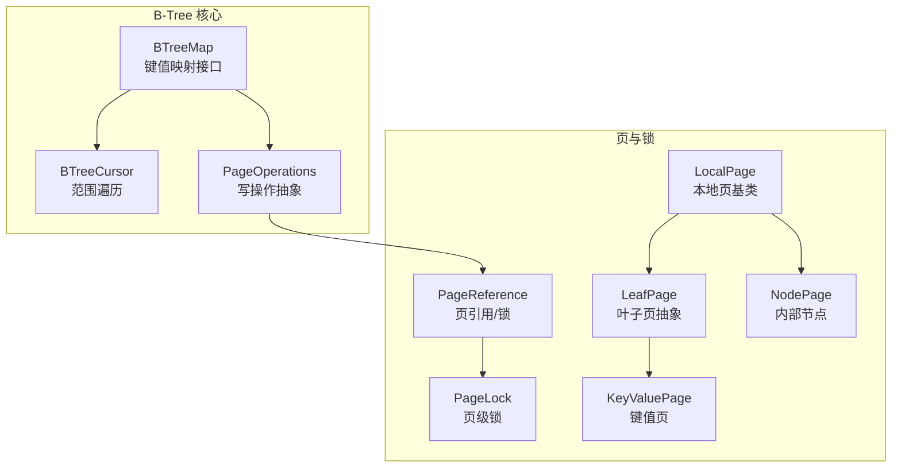
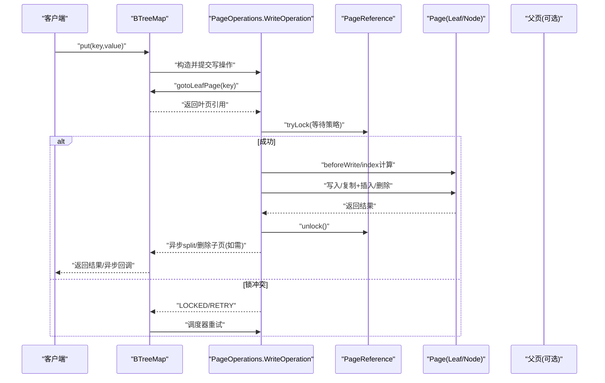
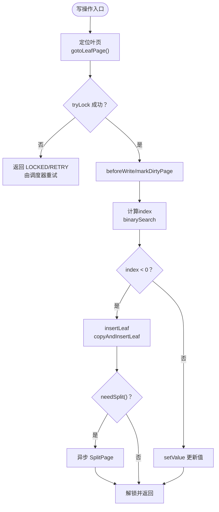
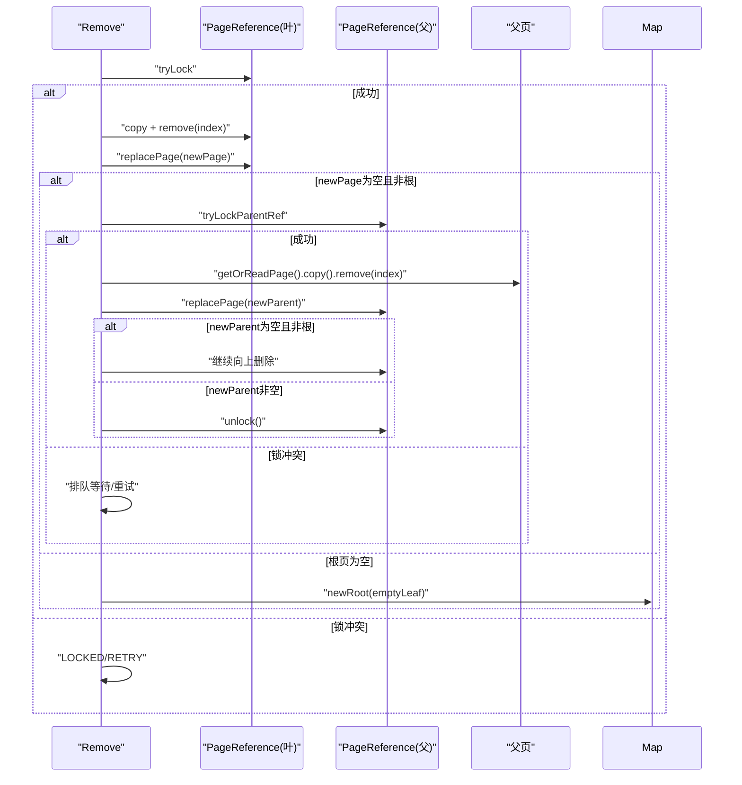
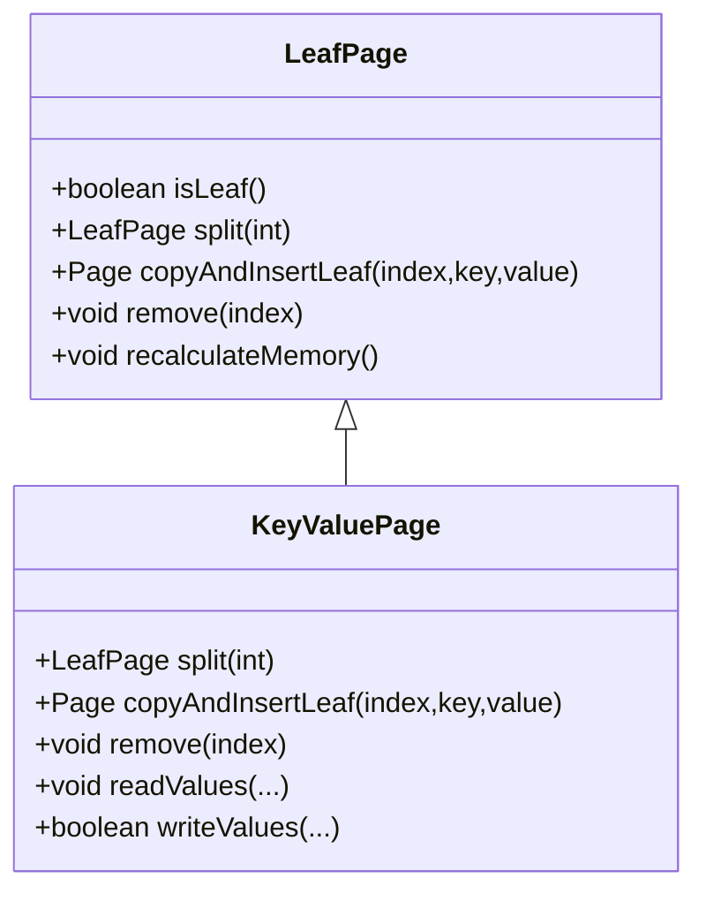
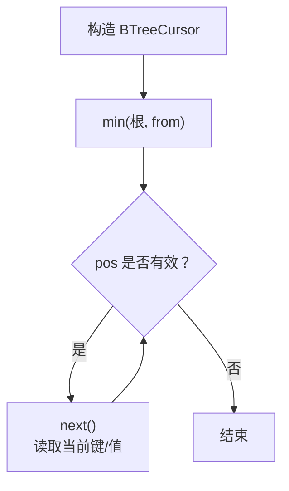
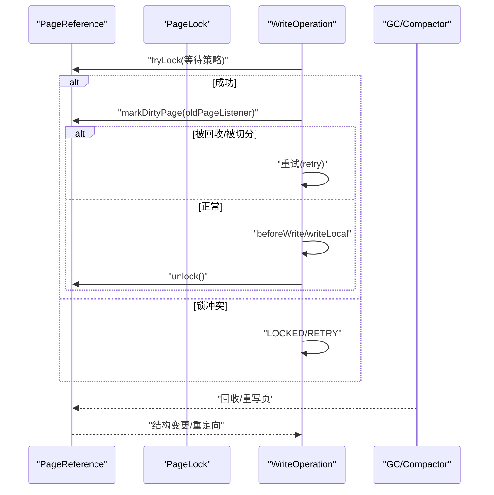
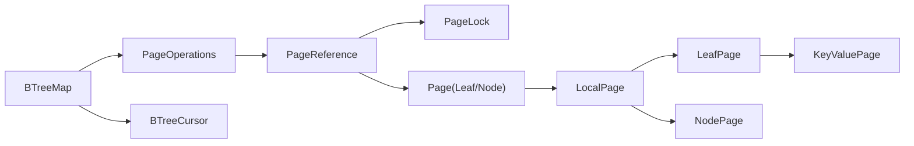

# B-Tree映射操作

**本文引用的文件**
- [BTreeMap.java](https://github.com/lealone/Lealone/blob/master/lealone-aose/src/main/java/com/lealone/storage/aose/btree/BTreeMap.java)
- [PageOperations.java](https://github.com/lealone/Lealone/blob/master/lealone-aose/src/main/java/com/lealone/storage/aose/btree/page/PageOperations.java)
- [KeyValuePage.java](https://github.com/lealone/Lealone/blob/master/lealone-aose/src/main/java/com/lealone/storage/aose/btree/page/KeyValuePage.java)
- [LeafPage.java](https://github.com/lealone/Lealone/blob/master/lealone-aose/src/main/java/com/lealone/storage/aose/btree/page/LeafPage.java)
- [NodePage.java](https://github.com/lealone/Lealone/blob/master/lealone-aose/src/main/java/com/lealone/storage/aose/btree/page/NodePage.java)
- [LocalPage.java](https://github.com/lealone/Lealone/blob/master/lealone-aose/src/main/java/com/lealone/storage/aose/btree/page/LocalPage.java)
- [PageReference.java](https://github.com/lealone/Lealone/blob/master/lealone-aose/src/main/java/com/lealone/storage/aose/btree/page/PageReference.java)
- [PageLock.java](https://github.com/lealone/Lealone/blob/master/lealone-aose/src/main/java/com/lealone/storage/aose/btree/page/PageLock.java)
- [BTreeCursor.java](https://github.com/lealone/Lealone/blob/master/lealone-aose/src/main/java/com/lealone/storage/aose/btree/BTreeCursor.java)
- [BTreeMapTest.java](https://github.com/lealone/Lealone/blob/master/lealone-test/src/test/java/com/lealone/test/aose/BTreeMapTest.java)

## 目录
1. [简介](#简介)
2. [项目结构](#项目结构)
3. [核心组件](#核心组件)
4. [架构总览](#架构总览)
5. [详细组件分析](#详细组件分析)
6. [依赖关系分析](#依赖关系分析)
7. [性能考量](#性能考量)
8. [故障排查指南](#故障排查指南)
9. [结论](#结论)
10. [附录](#附录)

## 简介
本文件系统性讲解 Lealone 中 BTreeMap 的 B-Tree 逻辑实现，围绕键值对的增删改查展开，重点阐述：
- 插入过程中的节点分裂算法与平衡维护
- 删除过程中的节点合并与回溯删除策略
- KeyValuePage 如何承载键值数据，以及多种叶子页类型的选择
- BTreeCursor 如何实现高效范围查询与遍历
- 并发控制：细粒度 PageLock 与 PageReference 的协作，保障原子性与一致性
- 高并发下的优化建议与最佳实践

## 项目结构
BTreeMap 位于 AOSE 存储引擎模块中，采用“按页”组织的 B-Tree 结构，配合 PageReference、PageLock 实现细粒度并发控制；Cursor 提供范围扫描能力；PageOperations 将写操作抽象为可重试的 PageOperation，统一处理锁、重试与异步回调。

图表来源
- [BTreeMap.java](https://github.com/lealone/Lealone/blob/master/lealone-aose/src/main/java/com/lealone/storage/aose/btree/BTreeMap.java#L1-L120)
- [BTreeCursor.java](https://github.com/lealone/Lealone/blob/master/lealone-aose/src/main/java/com/lealone/storage/aose/btree/BTreeCursor.java#L1-L60)
- [PageOperations.java](https://github.com/lealone/Lealone/blob/master/lealone-aose/src/main/java/com/lealone/storage/aose/btree/page/PageOperations.java#L1-L120)
- [PageReference.java](https://github.com/lealone/Lealone/blob/master/lealone-aose/src/main/java/com/lealone/storage/aose/btree/page/PageReference.java#L1-L80)
- [PageLock.java](https://github.com/lealone/Lealone/blob/master/lealone-aose/src/main/java/com/lealone/storage/aose/btree/page/PageLock.java#L1-L35)
- [LocalPage.java](https://github.com/lealone/Lealone/blob/master/lealone-aose/src/main/java/com/lealone/storage/aose/btree/page/LocalPage.java#L1-L60)
- [LeafPage.java](https://github.com/lealone/Lealone/blob/master/lealone-aose/src/main/java/com/lealone/storage/aose/btree/page/LeafPage.java#L1-L60)
- [NodePage.java](https://github.com/lealone/Lealone/blob/master/lealone-aose/src/main/java/com/lealone/storage/aose/btree/page/NodePage.java#L1-L60)
- [KeyValuePage.java](https://github.com/lealone/Lealone/blob/master/lealone-aose/src/main/java/com/lealone/storage/aose/btree/page/KeyValuePage.java#L1-L40)

章节来源
- [BTreeMap.java](https://github.com/lealone/Lealone/blob/master/lealone-aose/src/main/java/com/lealone/storage/aose/btree/BTreeMap.java#L1-L120)
- [PageOperations.java](https://github.com/lealone/Lealone/blob/master/lealone-aose/src/main/java/com/lealone/storage/aose/btree/page/PageOperations.java#L1-L120)

## 核心组件
- BTreeMap：对外提供同步/异步的 put/get/remove/cursor 等 API，协调写操作的调度与重试、并发保护与 GC。
- PageOperations：定义写操作抽象（Put/PutIfAbsent/Remove/Append），封装定位叶页、加锁、重试、拆分/删除子页等流程。
- PageReference：页引用与锁管理，负责页的读取、替换、脏页标记、GC 协调与重定向。
- PageLock：页级锁，与 PageReference/PageListener 协作，实现细粒度并发控制。
- LocalPage/LeafPage/NodePage：页层次结构，分别负责键值存储、分裂/插入/删除、父子指针管理。
- KeyValuePage：键值同存的叶子页实现，支持 split/copyAndInsertLeaf/remove 等。
- BTreeCursor：基于栈式游标的范围遍历器，支持 from 参数与列选择。

章节来源
- [BTreeMap.java](https://github.com/lealone/Lealone/blob/master/lealone-aose/src/main/java/com/lealone/storage/aose/btree/BTreeMap.java#L120-L220)
- [PageOperations.java](https://github.com/lealone/Lealone/blob/master/lealone-aose/src/main/java/com/lealone/storage/aose/btree/page/PageOperations.java#L120-L220)
- [PageReference.java](https://github.com/lealone/Lealone/blob/master/lealone-aose/src/main/java/com/lealone/storage/aose/btree/page/PageReference.java#L120-L220)
- [PageLock.java](https://github.com/lealone/Lealone/blob/master/lealone-aose/src/main/java/com/lealone/storage/aose/btree/page/PageLock.java#L1-L35)
- [LocalPage.java](https://github.com/lealone/Lealone/blob/master/lealone-aose/src/main/java/com/lealone/storage/aose/btree/page/LocalPage.java#L80-L120)
- [LeafPage.java](https://github.com/lealone/Lealone/blob/master/lealone-aose/src/main/java/com/lealone/storage/aose/btree/page/LeafPage.java#L60-L120)
- [NodePage.java](https://github.com/lealone/Lealone/blob/master/lealone-aose/src/main/java/com/lealone/storage/aose/btree/page/NodePage.java#L60-L120)
- [KeyValuePage.java](https://github.com/lealone/Lealone/blob/master/lealone-aose/src/main/java/com/lealone/storage/aose/btree/page/KeyValuePage.java#L40-L91)
- [BTreeCursor.java](https://github.com/lealone/Lealone/blob/master/lealone-aose/src/main/java/com/lealone/storage/aose/btree/BTreeCursor.java#L1-L60)

## 架构总览
BTreeMap 通过根页引用（RootPageReference）持有当前树根，写操作通过 PageOperations 在调度器上执行，先定位叶页，再加锁，执行 beforeWrite/写入，必要时触发异步 split 或 remove 子页。读操作（get/cursor）不阻塞，允许多线程并发读。

图表来源
- [BTreeMap.java](https://github.com/lealone/Lealone/blob/master/lealone-aose/src/main/java/com/lealone/storage/aose/btree/BTreeMap.java#L558-L701)
- [PageOperations.java](https://github.com/lealone/Lealone/blob/master/lealone-aose/src/main/java/com/lealone/storage/aose/btree/page/PageOperations.java#L82-L151)
- [PageReference.java](https://github.com/lealone/Lealone/blob/master/lealone-aose/src/main/java/com/lealone/storage/aose/btree/page/PageReference.java#L149-L160)

## 详细组件分析

### 插入操作与节点分裂
- 定位与加锁：WriteOperation.run 先定位叶页，尝试加锁；若被 GC 或结构变更则重试。
- 写入路径：index<0 表示新增，走 insertLeaf；index≥0 表示更新，走 setValue。
- 分裂触发：insertLeaf 后若 needSplit 返回真，则异步触发 SplitPage。
- 分裂算法：
  - 根页：直接 setNewPageLock，创建临时父节点（包含左右子页），替换根页。
  - 非根页：先锁父页，copyAndInsertChild 构造新父页，替换父页；原引用被替换为 SplittedPageInfo，以便后续事务重定向到父节点。
  - 左右子页：LeafPage.split 按中点切分键集合，NodePage.split 切分键与子指针数组，父页键为切分键。
- 平衡维护：分裂后若父页仍需分裂，继续异步向上分裂，直至根。

图表来源
- [PageOperations.java](https://github.com/lealone/Lealone/blob/master/lealone-aose/src/main/java/com/lealone/storage/aose/btree/page/PageOperations.java#L122-L179)
- [PageOperations.java](https://github.com/lealone/Lealone/blob/master/lealone-aose/src/main/java/com/lealone/storage/aose/btree/page/PageOperations.java#L181-L219)
- [PageOperations.java](https://github.com/lealone/Lealone/blob/master/lealone-aose/src/main/java/com/lealone/storage/aose/btree/page/PageOperations.java#L402-L501)
- [LeafPage.java](https://github.com/lealone/Lealone/blob/master/lealone-aose/src/main/java/com/lealone/storage/aose/btree/page/LeafPage.java#L69-L93)
- [NodePage.java](https://github.com/lealone/Lealone/blob/master/lealone-aose/src/main/java/com/lealone/storage/aose/btree/page/NodePage.java#L65-L83)

章节来源
- [PageOperations.java](https://github.com/lealone/Lealone/blob/master/lealone-aose/src/main/java/com/lealone/storage/aose/btree/page/PageOperations.java#L122-L219)
- [LeafPage.java](https://github.com/lealone/Lealone/blob/master/lealone-aose/src/main/java/com/lealone/storage/aose/btree/page/LeafPage.java#L69-L123)
- [NodePage.java](https://github.com/lealone/Lealone/blob/master/lealone-aose/src/main/java/com/lealone/storage/aose/btree/page/NodePage.java#L65-L111)

### 删除操作与节点合并
- 删除路径：index<0 直接返回 null；index≥0 先 copy 再 remove，避免读写并发冲突。
- 叶页为空且非根：异步触发 RemovePage，尝试加锁父页，copy 后 remove 父页对应子指针；若父页为空且非根，继续向上删除，直至根或不再为空。
- 根页为空：newRoot 创建空叶页。
- 并发安全：copy 前后均进行脏页标记与锁检查，防止 GC 回收或结构变更导致的不一致。

图表来源
- [PageOperations.java](https://github.com/lealone/Lealone/blob/master/lealone-aose/src/main/java/com/lealone/storage/aose/btree/page/PageOperations.java#L255-L281)
- [PageOperations.java](https://github.com/lealone/Lealone/blob/master/lealone-aose/src/main/java/com/lealone/storage/aose/btree/page/PageOperations.java#L283-L400)
- [PageOperations.java](https://github.com/lealone/Lealone/blob/master/lealone-aose/src/main/java/com/lealone/storage/aose/btree/page/PageOperations.java#L355-L400)

章节来源
- [PageOperations.java](https://github.com/lealone/Lealone/blob/master/lealone-aose/src/main/java/com/lealone/storage/aose/btree/page/PageOperations.java#L255-L281)
- [PageOperations.java](https://github.com/lealone/Lealone/blob/master/lealone-aose/src/main/java/com/lealone/storage/aose/btree/page/PageOperations.java#L355-L400)

### KeyValuePage 与数据存储
- KeyValuePage：键值同存的叶子页，split 将键与值数组按中点切分，remove 递减全局 size。
- 叶子页类型选择：LeafPage.createEmpty 根据 key/value 类型与存储模式选择 KeyPage/RowPage/ColumnsPage/KeyValuePage/KeyColumnsPage。
- 内存管理：recalculateMemory 统计键与值的内存占用，addMemory 记录到 BTreeGC。

图表来源
- [LeafPage.java](https://github.com/lealone/Lealone/blob/master/lealone-aose/src/main/java/com/lealone/storage/aose/btree/page/LeafPage.java#L1-L120)
- [KeyValuePage.java](https://github.com/lealone/Lealone/blob/master/lealone-aose/src/main/java/com/lealone/storage/aose/btree/page/KeyValuePage.java#L1-L91)

章节来源
- [LeafPage.java](https://github.com/lealone/Lealone/blob/master/lealone-aose/src/main/java/com/lealone/storage/aose/btree/page/LeafPage.java#L120-L200)
- [KeyValuePage.java](https://github.com/lealone/Lealone/blob/master/lealone-aose/src/main/java/com/lealone/storage/aose/btree/page/KeyValuePage.java#L40-L91)

### 范围查询与遍历（BTreeCursor）
- 定位：从根出发，min 方法沿路径定位到 ≥from 的第一个叶页，维护父链。
- 遍历：next 逐步推进当前页索引，若越界则回溯父页，继续下一个子页。
- 列选择：根据 CursorParameters.allColumns 或 columnIndexes 获取值。

图表来源
- [BTreeCursor.java](https://github.com/lealone/Lealone/blob/master/lealone-aose/src/main/java/com/lealone/storage/aose/btree/BTreeCursor.java#L1-L124)

章节来源
- [BTreeCursor.java](https://github.com/lealone/Lealone/blob/master/lealone-aose/src/main/java/com/lealone/storage/aose/btree/BTreeCursor.java#L1-L124)

### 并发控制与一致性（PageLock 与 PageReference）
- PageLock：继承 Lock，标识为页级锁，携带 PageListener，用于锁传播与重试。
- PageReference：
  - tryLock/unlock：基于 SchedulerLock 的细粒度页锁。
  - markDirtyPage：自底向上标记脏页，检测 PageListener 变化与 page 被切分/回收，必要时重试。
  - replacePage：CAS 替换页信息，避免并发写覆盖旧页导致的不一致。
  - getOrReadPage：在结构变更时重定向到新引用，保证读的一致性。
- PageOperations：写操作 run 中先定位叶页，再加锁，执行 beforeWrite/writeLocal，最后快速解锁；若需要 split/remove 子页，异步执行并由调度器重试。

图表来源
- [PageReference.java](https://github.com/lealone/Lealone/blob/master/lealone-aose/src/main/java/com/lealone/storage/aose/btree/page/PageReference.java#L149-L208)
- [PageReference.java](https://github.com/lealone/Lealone/blob/master/lealone-aose/src/main/java/com/lealone/storage/aose/btree/page/PageReference.java#L232-L320)
- [PageOperations.java](https://github.com/lealone/Lealone/blob/master/lealone-aose/src/main/java/com/lealone/storage/aose/btree/page/PageOperations.java#L82-L151)
- [PageLock.java](https://github.com/lealone/Lealone/blob/master/lealone-aose/src/main/java/com/lealone/storage/aose/btree/page/PageLock.java#L1-L35)

章节来源
- [PageReference.java](https://github.com/lealone/Lealone/blob/master/lealone-aose/src/main/java/com/lealone/storage/aose/btree/page/PageReference.java#L149-L208)
- [PageReference.java](https://github.com/lealone/Lealone/blob/master/lealone-aose/src/main/java/com/lealone/storage/aose/btree/page/PageReference.java#L232-L320)
- [PageOperations.java](https://github.com/lealone/Lealone/blob/master/lealone-aose/src/main/java/com/lealone/storage/aose/btree/page/PageOperations.java#L82-L151)
- [PageLock.java](https://github.com/lealone/Lealone/blob/master/lealone-aose/src/main/java/com/lealone/storage/aose/btree/page/PageLock.java#L1-L35)

### 查询性能优化建议
- 使用 BTreeCursor 进行范围扫描，避免多次随机查找。
- 控制页大小：通过 needSplit 与内存统计，合理设置键值类型与存储模式，减少分裂频率。
- 异步写入：优先使用异步 API，结合调度器批量处理，降低锁竞争。
- 避免热点键：尽量均匀分布键，减少单页压力。
- 列裁剪：仅请求所需列，减少值读取与序列化开销。
- 合理配置：根据业务场景调整页大小、并发线程数与调度策略。

章节来源
- [LocalPage.java](https://github.com/lealone/Lealone/blob/master/lealone-aose/src/main/java/com/lealone/storage/aose/btree/page/LocalPage.java#L84-L120)
- [BTreeCursor.java](https://github.com/lealone/Lealone/blob/master/lealone-aose/src/main/java/com/lealone/storage/aose/btree/BTreeCursor.java#L1-L124)
- [BTreeMap.java](https://github.com/lealone/Lealone/blob/master/lealone-aose/src/main/java/com/lealone/storage/aose/btree/BTreeMap.java#L558-L701)

## 依赖关系分析
- BTreeMap 依赖 PageOperations 执行写操作，依赖 PageReference 管理页与锁，依赖 BTreeStorage/GC 进行持久化与回收。
- PageOperations 依赖 PageReference 的锁与脏页标记，依赖 LocalPage/LeafPage/NodePage 的具体页行为。
- PageReference 依赖 PageLock 与 PageListener，实现锁传播与重试。
- BTreeCursor 依赖 Page 的二分查找与子页导航。

图表来源
- [BTreeMap.java](https://github.com/lealone/Lealone/blob/master/lealone-aose/src/main/java/com/lealone/storage/aose/btree/BTreeMap.java#L1-L120)
- [PageOperations.java](https://github.com/lealone/Lealone/blob/master/lealone-aose/src/main/java/com/lealone/storage/aose/btree/page/PageOperations.java#L1-L120)
- [PageReference.java](https://github.com/lealone/Lealone/blob/master/lealone-aose/src/main/java/com/lealone/storage/aose/btree/page/PageReference.java#L1-L80)
- [LocalPage.java](https://github.com/lealone/Lealone/blob/master/lealone-aose/src/main/java/com/lealone/storage/aose/btree/page/LocalPage.java#L1-L60)
- [LeafPage.java](https://github.com/lealone/Lealone/blob/master/lealone-aose/src/main/java/com/lealone/storage/aose/btree/page/LeafPage.java#L1-L60)
- [NodePage.java](https://github.com/lealone/Lealone/blob/master/lealone-aose/src/main/java/com/lealone/storage/aose/btree/page/NodePage.java#L1-L60)
- [KeyValuePage.java](https://github.com/lealone/Lealone/blob/master/lealone-aose/src/main/java/com/lealone/storage/aose/btree/page/KeyValuePage.java#L1-L40)
- [BTreeCursor.java](https://github.com/lealone/Lealone/blob/master/lealone-aose/src/main/java/com/lealone/storage/aose/btree/BTreeCursor.java#L1-L60)

章节来源
- [BTreeMap.java](https://github.com/lealone/Lealone/blob/master/lealone-aose/src/main/java/com/lealone/storage/aose/btree/BTreeMap.java#L1-L120)
- [PageOperations.java](https://github.com/lealone/Lealone/blob/master/lealone-aose/src/main/java/com/lealone/storage/aose/btree/page/PageOperations.java#L1-L120)
- [PageReference.java](https://github.com/lealone/Lealone/blob/master/lealone-aose/src/main/java/com/lealone/storage/aose/btree/page/PageReference.java#L1-L80)
- [LocalPage.java](https://github.com/lealone/Lealone/blob/master/lealone-aose/src/main/java/com/lealone/storage/aose/btree/page/LocalPage.java#L1-L60)
- [LeafPage.java](https://github.com/lealone/Lealone/blob/master/lealone-aose/src/main/java/com/lealone/storage/aose/btree/page/LeafPage.java#L1-L60)
- [NodePage.java](https://github.com/lealone/Lealone/blob/master/lealone-aose/src/main/java/com/lealone/storage/aose/btree/page/NodePage.java#L1-L60)
- [KeyValuePage.java](https://github.com/lealone/Lealone/blob/master/lealone-aose/src/main/java/com/lealone/storage/aose/btree/page/KeyValuePage.java#L1-L40)
- [BTreeCursor.java](https://github.com/lealone/Lealone/blob/master/lealone-aose/src/main/java/com/lealone/storage/aose/btree/BTreeCursor.java#L1-L60)

## 性能考量
- 分裂与删除的异步化：通过异步 SplitPage/RemovePage 降低写路径阻塞时间。
- 细粒度锁：PageReference 的 tryLock/unlock 与 PageLock 的锁传播，显著降低全局锁竞争。
- 脏页标记与重试：markDirtyPage 自底向上传播，避免 GC 回收导致的不一致，同时允许快速重试。
- 二分查找缓存：LocalPage.binarySearch 缓存上次比较结果，提升连续访问性能。
- 内存估算：recalculateMemory 与 addMemory 记录键值内存，便于 GC 与页大小控制。

章节来源
- [PageOperations.java](https://github.com/lealone/Lealone/blob/master/lealone-aose/src/main/java/com/lealone/storage/aose/btree/page/PageOperations.java#L122-L179)
- [PageReference.java](https://github.com/lealone/Lealone/blob/master/lealone-aose/src/main/java/com/lealone/storage/aose/btree/page/PageReference.java#L232-L320)
- [LocalPage.java](https://github.com/lealone/Lealone/blob/master/lealone-aose/src/main/java/com/lealone/storage/aose/btree/page/LocalPage.java#L56-L82)
- [LeafPage.java](https://github.com/lealone/Lealone/blob/master/lealone-aose/src/main/java/com/lealone/storage/aose/btree/page/LeafPage.java#L152-L171)

## 故障排查指南
- 写操作返回 null/异常：检查是否已关闭或只读；确认锁冲突导致的 RETRY/LOCKED，观察调度器重试。
- 删除后仍可见：确认是否在同事务中读取未刷新的页；检查 PageReference 的 getOrReadPage 重定向逻辑。
- 分裂未生效：确认 needSplit 条件与页大小阈值；查看异步 SplitPage 是否被调度器重试。
- 并发读写冲突：确保使用异步 API 或在合适时机等待；避免在锁持有期间执行耗时操作。

章节来源
- [BTreeMap.java](https://github.com/lealone/Lealone/blob/master/lealone-aose/src/main/java/com/lealone/storage/aose/btree/BTreeMap.java#L506-L557)
- [PageOperations.java](https://github.com/lealone/Lealone/blob/master/lealone-aose/src/main/java/com/lealone/storage/aose/btree/page/PageOperations.java#L82-L151)
- [PageReference.java](https://github.com/lealone/Lealone/blob/master/lealone-aose/src/main/java/com/lealone/storage/aose/btree/page/PageReference.java#L161-L208)

## 结论
BTreeMap 通过“页级并发 + 异步写操作”的设计，在保证强一致性的前提下实现了高并发下的高效读写。插入与删除分别以“分裂/向上分裂”和“自底向上删除”维持树的平衡；KeyValuePage 与多种叶子页类型适配不同存储模式；BTreeCursor 提供高效的范围遍历。配合 PageReference/PageLock 的细粒度锁与脏页标记，系统在复杂并发场景下保持稳定与高性能。

## 附录
- 示例用法参考测试类：BTreeMapTest 展示了同步/异步 put/get/putIfAbsent/remove/cursor/save/append 等典型操作与断言。

章节来源
- [BTreeMapTest.java](https://github.com/lealone/Lealone/blob/master/lealone-test/src/test/java/com/lealone/test/aose/BTreeMapTest.java#L1-L200)