# B-Tree游标遍历

<cite>
**本文引用的文件**
- [BTreeCursor.java](https://github.com/lealone/Lealone/blob/master/lealone-aose/src/main/java/com/lealone/storage/aose/btree/BTreeCursor.java)
- [BTreeMap.java](https://github.com/lealone/Lealone/blob/master/lealone-aose/src/main/java/com/lealone/storage/aose/btree/BTreeMap.java)
- [LeafPage.java](https://github.com/lealone/Lealone/blob/master/lealone-aose/src/main/java/com/lealone/storage/aose/btree/page/LeafPage.java)
- [Page.java](https://github.com/lealone/Lealone/blob/master/lealone-aose/src/main/java/com/lealone/storage/aose/btree/page/Page.java)
- [PageOperations.java](https://github.com/lealone/Lealone/blob/master/lealone-aose/src/main/java/com/lealone/storage/aose/btree/page/PageOperations.java)
- [BTreeGC.java](https://github.com/lealone/Lealone/blob/master/lealone-aose/src/main/java/com/lealone/storage/aose/btree/BTreeGC.java)
- [BTreeMapTest.java](https://github.com/lealone/Lealone/blob/master/lealone-test/src/test/java/com/lealone/test/aose/BTreeMapTest.java)
</cite>

## 目录
1. [引言](#引言)
2. [项目结构](#项目结构)
3. [核心组件](#核心组件)
4. [架构总览](#架构总览)
5. [详细组件分析](#详细组件分析)
6. [依赖关系分析](#依赖关系分析)
7. [性能考量](#性能考量)
8. [故障排查指南](#故障排查指南)
9. [结论](#结论)
10. [附录](#附录)

## 引言
本文件系统性解析 B-Tree 游标（BTreeCursor）在 B-Tree 遍历过程中的工作机制，重点说明：
- 游标如何从根节点开始，通过路径追踪（path tracking）定位到目标叶节点；
- 在叶节点之间进行前向移动；
- 处理范围查询时的优化策略（如利用叶节点间双向链接提升扫描效率）；
- BTreeCursor 与 BTreeMap 和 LeafPage 的交互过程（获取、更新、删除）；
- 长时间运行查询中的资源管理与潜在性能瓶颈。

## 项目结构
围绕 B-Tree 游标的关键代码位于 AOSE 存储引擎模块，主要涉及：
- BTreeCursor：游标实现，负责按升序遍历；
- BTreeMap：B-Tree 映射容器，提供根页、游标创建、写操作等；
- Page/LeafPage：页面抽象与叶页面实现，承载键值数据与页内操作；
- PageOperations：写操作框架，封装 put/putIfAbsent/remove 等；
- BTreeGC：内存与垃圾回收辅助；
- 测试用例：验证游标与范围查询行为。

图表来源
- [BTreeCursor.java](https://github.com/lealone/Lealone/blob/master/lealone-aose/src/main/java/com/lealone/storage/aose/btree/BTreeCursor.java#L1-L124)
- [BTreeMap.java](https://github.com/lealone/Lealone/blob/master/lealone-aose/src/main/java/com/lealone/storage/aose/btree/BTreeMap.java#L1-L200)
- [Page.java](https://github.com/lealone/Lealone/blob/master/lealone-aose/src/main/java/com/lealone/storage/aose/btree/page/Page.java#L1-L120)
- [LeafPage.java](https://github.com/lealone/Lealone/blob/master/lealone-aose/src/main/java/com/lealone/storage/aose/btree/page/LeafPage.java#L1-L80)
- [PageOperations.java](https://github.com/lealone/Lealone/blob/master/lealone-aose/src/main/java/com/lealone/storage/aose/btree/page/PageOperations.java#L160-L280)
- [BTreeGC.java](https://github.com/lealone/Lealone/blob/master/lealone-aose/src/main/java/com/lealone/storage/aose/btree/BTreeGC.java#L44-L94)

章节来源
- [BTreeCursor.java](https://github.com/lealone/Lealone/blob/master/lealone-aose/src/main/java/com/lealone/storage/aose/btree/BTreeCursor.java#L1-L124)
- [BTreeMap.java](https://github.com/lealone/Lealone/blob/master/lealone-aose/src/main/java/com/lealone/storage/aose/btree/BTreeMap.java#L1-L200)

## 核心组件
- BTreeCursor：实现升序遍历，维护当前位置指针（包含页、索引、父位置），支持 next() 获取下一个键值对；构造时根据 CursorParameters.from 定位到 >=from 的首个叶页。
- BTreeMap：持有根页引用，提供 cursor(CursorParameters) 创建游标；提供 get/put/remove 等写操作，内部通过 PageOperations 框架执行。
- Page/LeafPage：定义页接口与叶页语义，包括键值访问、二分查找、页内插入/删除、分裂等；叶页还负责内存统计与监听器设置。
- PageOperations：统一的写操作基类与具体实现（Put/PutIfAbsent/Remove），负责定位叶页、执行页内修改、替换页引用、必要时触发异步移除或分裂。

章节来源
- [BTreeCursor.java](https://github.com/lealone/Lealone/blob/master/lealone-aose/src/main/java/com/lealone/storage/aose/btree/BTreeCursor.java#L1-L124)
- [BTreeMap.java](https://github.com/lealone/Lealone/blob/master/lealone-aose/src/main/java/com/lealone/storage/aose/btree/BTreeMap.java#L330-L336)
- [Page.java](https://github.com/lealone/Lealone/blob/master/lealone-aose/src/main/java/com/lealone/storage/aose/btree/page/Page.java#L120-L200)
- [LeafPage.java](https://github.com/lealone/Lealone/blob/master/lealone-aose/src/main/java/com/lealone/storage/aose/btree/page/LeafPage.java#L1-L80)
- [PageOperations.java](https://github.com/lealone/Lealone/blob/master/lealone-aose/src/main/java/com/lealone/storage/aose/btree/page/PageOperations.java#L160-L280)

## 架构总览
BTreeCursor 与 BTreeMap/LeafPage 的交互流程如下：

图表来源
- [BTreeMap.java](https://github.com/lealone/Lealone/blob/master/lealone-aose/src/main/java/com/lealone/storage/aose/btree/BTreeMap.java#L330-L336)
- [BTreeCursor.java](https://github.com/lealone/Lealone/blob/master/lealone-aose/src/main/java/com/lealone/storage/aose/btree/BTreeCursor.java#L30-L94)
- [Page.java](https://github.com/lealone/Lealone/blob/master/lealone-aose/src/main/java/com/lealone/storage/aose/btree/page/Page.java#L272-L280)
- [LeafPage.java](https://github.com/lealone/Lealone/blob/master/lealone-aose/src/main/java/com/lealone/storage/aose/btree/page/LeafPage.java#L1-L80)

## 详细组件分析

### BTreeCursor 工作机制
- 初始化：构造函数接收 CursorParameters.from，调用 min(root, from) 定位到 >=from 的首个叶页，构建 CursorPos 栈以支持回溯。
- 前向移动：next() 从当前页的当前位置取键值，索引自增；若当前页已耗尽，则向上回溯父节点，尝试兄弟子页，直到找到下一个有效位置或结束。
- 范围定位：min(Page p, K from) 在非叶节点沿 getPageIndex(from) 下钻，到达叶节点后用 binarySearch(from) 定位插入点，形成初始游标位置。

图表来源
- [BTreeCursor.java](https://github.com/lealone/Lealone/blob/master/lealone-aose/src/main/java/com/lealone/storage/aose/btree/BTreeCursor.java#L85-L94)
- [Page.java](https://github.com/lealone/Lealone/blob/master/lealone-aose/src/main/java/com/lealone/storage/aose/btree/page/Page.java#L162-L174)

章节来源
- [BTreeCursor.java](https://github.com/lealone/Lealone/blob/master/lealone-aose/src/main/java/com/lealone/storage/aose/btree/BTreeCursor.java#L30-L94)
- [Page.java](https://github.com/lealone/Lealone/blob/master/lealone-aose/src/main/java/com/lealone/storage/aose/btree/page/Page.java#L162-L174)

### 路径追踪与叶节点移动
- 路径追踪：CursorPos 结构保存“当前页、当前索引、父位置”，用于回溯到父节点并尝试下一个兄弟子页。
- 叶节点移动：hasNext() 中当当前页索引越界，回溯父节点 pos.parent，若父节点仍有未遍历的子页则 min(子页, null) 继续下钻。

图表来源
- [BTreeCursor.java](https://github.com/lealone/Lealone/blob/master/lealone-aose/src/main/java/com/lealone/storage/aose/btree/BTreeCursor.java#L1-L124)

章节来源
- [BTreeCursor.java](https://github.com/lealone/Lealone/blob/master/lealone-aose/src/main/java/com/lealone/storage/aose/btree/BTreeCursor.java#L62-L94)

### 范围查询优化
- 起始定位：通过 min(root, from) 使用二分搜索快速定位 >=from 的起始叶页，避免全表扫描。
- 连续扫描：next() 逐个推进页内索引，天然顺序访问，减少随机 IO。
- 注意：当前实现未显示叶节点之间的双向链指针，因此范围扫描依赖页内顺序与父节点回溯，而非跨页双向链接。

章节来源
- [BTreeCursor.java](https://github.com/lealone/Lealone/blob/master/lealone-aose/src/main/java/com/lealone/storage/aose/btree/BTreeCursor.java#L30-L94)
- [Page.java](https://github.com/lealone/Lealone/blob/master/lealone-aose/src/main/java/com/lealone/storage/aose/btree/page/Page.java#L162-L174)

### 与 BTreeMap 的交互
- 游标创建：BTreeMap.cursor(parameters) 返回 BTreeCursor 实例。
- 写操作：BTreeMap.put/putIfAbsent/remove 通过 PageOperations 框架执行，内部同样使用 gotoLeafPage 定位叶页，然后在页内插入/更新/删除。
- 读操作：BTreeMap.get/firstKey/lastKey 等均通过 Page.gotoLeafPage 与二分查找实现。

```mermaid
sequenceDiagram
participant Client as "客户端"
participant Map as "BTreeMap"
participant Op as "PageOperations"
participant Root as "Page(根)"
participant Leaf as "LeafPage(叶)"
Client->>Map : put(key, value)
Map->>Op : new Put(map, key, value)
Op->>Root : gotoLeafPage(key)
Root-->>Op : 叶页
Op->>Leaf : 插入/更新
Leaf-->>Op : 新页
Op-->>Map : 替换页引用
Map-->>Client : 返回旧值
```

图表来源
- [BTreeMap.java](https://github.com/lealone/Lealone/blob/master/lealone-aose/src/main/java/com/lealone/storage/aose/btree/BTreeMap.java#L330-L336)
- [PageOperations.java](https://github.com/lealone/Lealone/blob/master/lealone-aose/src/main/java/com/lealone/storage/aose/btree/page/PageOperations.java#L181-L210)
- [Page.java](https://github.com/lealone/Lealone/blob/master/lealone-aose/src/main/java/com/lealone/storage/aose/btree/page/Page.java#L272-L280)

章节来源
- [BTreeMap.java](https://github.com/lealone/Lealone/blob/master/lealone-aose/src/main/java/com/lealone/storage/aose/btree/BTreeMap.java#L330-L336)
- [PageOperations.java](https://github.com/lealone/Lealone/blob/master/lealone-aose/src/main/java/com/lealone/storage/aose/btree/page/PageOperations.java#L181-L281)
- [Page.java](https://github.com/lealone/Lealone/blob/master/lealone-aose/src/main/java/com/lealone/storage/aose/btree/page/Page.java#L272-L280)

### 与 LeafPage 的交互
- 取值：BTreeCursor.next() 通过叶页的 getKey(index)/getValue(index, ...) 获取键值。
- 更新：BTreeMap.put/putIfAbsent 在叶页内执行 setValue 或 copyAndInsertLeaf，同时维护全局 size 计数。
- 删除：BTreeMap.remove 先复制叶页，再 remove(index)，必要时触发异步移除空页。

图表来源
- [LeafPage.java](https://github.com/lealone/Lealone/blob/master/lealone-aose/src/main/java/com/lealone/storage/aose/btree/page/LeafPage.java#L1-L120)
- [BTreeCursor.java](https://github.com/lealone/Lealone/blob/master/lealone-aose/src/main/java/com/lealone/storage/aose/btree/BTreeCursor.java#L38-L60)

章节来源
- [LeafPage.java](https://github.com/lealone/Lealone/blob/master/lealone-aose/src/main/java/com/lealone/storage/aose/btree/page/LeafPage.java#L1-L120)
- [BTreeCursor.java](https://github.com/lealone/Lealone/blob/master/lealone-aose/src/main/java/com/lealone/storage/aose/btree/BTreeCursor.java#L38-L60)

### 写操作细节（Put/PutIfAbsent/Remove）
- Put：若二分查找 index<0 表示插入，调用 insertLeaf；否则 setValue 更新现有值。
- PutIfAbsent：若 index<0 表示插入，否则返回旧值。
- Remove：复制叶页后删除指定索引项，若叶页为空且非根页则异步移除该页。

章节来源
- [PageOperations.java](https://github.com/lealone/Lealone/blob/master/lealone-aose/src/main/java/com/lealone/storage/aose/btree/page/PageOperations.java#L181-L281)

## 依赖关系分析
- BTreeCursor 依赖 BTreeMap 提供根页与子页数量信息，依赖 Page 接口的二分查找与下钻能力。
- BTreeMap 依赖 PageOperations 执行写操作，依赖 Page.gotoLeafPage 定位叶页。
- 叶页 LeafPage 提供键值存取与内存统计，参与写操作的页复制与替换。

图表来源
- [BTreeCursor.java](https://github.com/lealone/Lealone/blob/master/lealone-aose/src/main/java/com/lealone/storage/aose/btree/BTreeCursor.java#L1-L124)
- [BTreeMap.java](https://github.com/lealone/Lealone/blob/master/lealone-aose/src/main/java/com/lealone/storage/aose/btree/BTreeMap.java#L330-L336)
- [PageOperations.java](https://github.com/lealone/Lealone/blob/master/lealone-aose/src/main/java/com/lealone/storage/aose/btree/page/PageOperations.java#L160-L280)
- [Page.java](https://github.com/lealone/Lealone/blob/master/lealone-aose/src/main/java/com/lealone/storage/aose/btree/page/Page.java#L272-L280)
- [LeafPage.java](https://github.com/lealone/Lealone/blob/master/lealone-aose/src/main/java/com/lealone/storage/aose/btree/page/LeafPage.java#L1-L80)

## 性能考量
- 时间复杂度
  - 范围起始定位：O(log h)（h 为树高），通过二分查找与下钻；
  - 单次 next()：O(1) 页内推进；
  - 整体范围扫描：O(n) 键值，其中 n 为范围内键数。
- 空间复杂度
  - 游标路径栈深度 O(h)，每个 CursorPos 持有页引用与索引；
  - 写操作可能触发页复制与分裂，额外内存开销由 BTreeGC 管理。
- 资源管理
  - BTreeGC 统计与回收脏页内存，避免长时间运行查询导致内存膨胀；
  - 写操作采用重试与异步调度，降低锁竞争与阻塞。
- 潜在瓶颈
  - 长时间扫描：频繁的页访问与二分查找，建议批量处理或配合外部 yield 机制；
  - 写多读少：分裂与复制页可能导致临时内存峰值，需关注 BTreeGC 触发频率。

章节来源
- [BTreeGC.java](https://github.com/lealone/Lealone/blob/master/lealone-aose/src/main/java/com/lealone/storage/aose/btree/BTreeGC.java#L44-L94)
- [BTreeMap.java](https://github.com/lealone/Lealone/blob/master/lealone-aose/src/main/java/com/lealone/storage/aose/btree/BTreeMap.java#L558-L701)

## 故障排查指南
- 游标无法前进
  - 检查 CursorParameters.from 是否导致定位到末尾页；
  - 确认 hasNext() 回溯逻辑是否正确推进父节点与兄弟子页。
- 写操作异常
  - 确认 map 未关闭或只读；
  - 查看 PageOperations 执行结果与重试策略。
- 内存增长
  - 观察 BTreeGC 使用量与 GC 触发；
  - 检查是否存在大量短生命周期的写操作导致脏页堆积。

章节来源
- [BTreeCursor.java](https://github.com/lealone/Lealone/blob/master/lealone-aose/src/main/java/com/lealone/storage/aose/btree/BTreeCursor.java#L62-L94)
- [PageOperations.java](https://github.com/lealone/Lealone/blob/master/lealone-aose/src/main/java/com/lealone/storage/aose/btree/page/PageOperations.java#L580-L701)
- [BTreeGC.java](https://github.com/lealone/Lealone/blob/master/lealone-aose/src/main/java/com/lealone/storage/aose/btree/BTreeGC.java#L44-L94)

## 结论
BTreeCursor 通过路径追踪与二分查找实现了高效的范围扫描，next() 以 O(1) 的代价推进页内索引，整体范围查询具备良好的顺序访问特性。与 BTreeMap/LeafPage 的协作清晰：游标负责遍历，映射容器负责定位与写操作，叶页负责键值存取与内存统计。对于长时间运行的查询，建议结合外部调度与 BTreeGC 策略，避免内存压力与锁争用。

## 附录
- 使用示例参考：测试用例展示了游标创建、范围扫描与基本 CRUD 行为。

章节来源
- [BTreeMapTest.java](https://github.com/lealone/Lealone/blob/master/lealone-test/src/test/java/com/lealone/test/aose/BTreeMapTest.java#L76-L90)