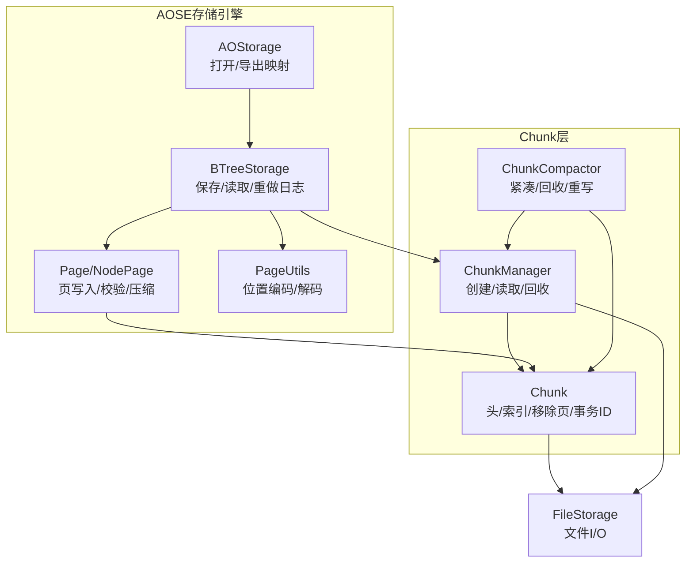
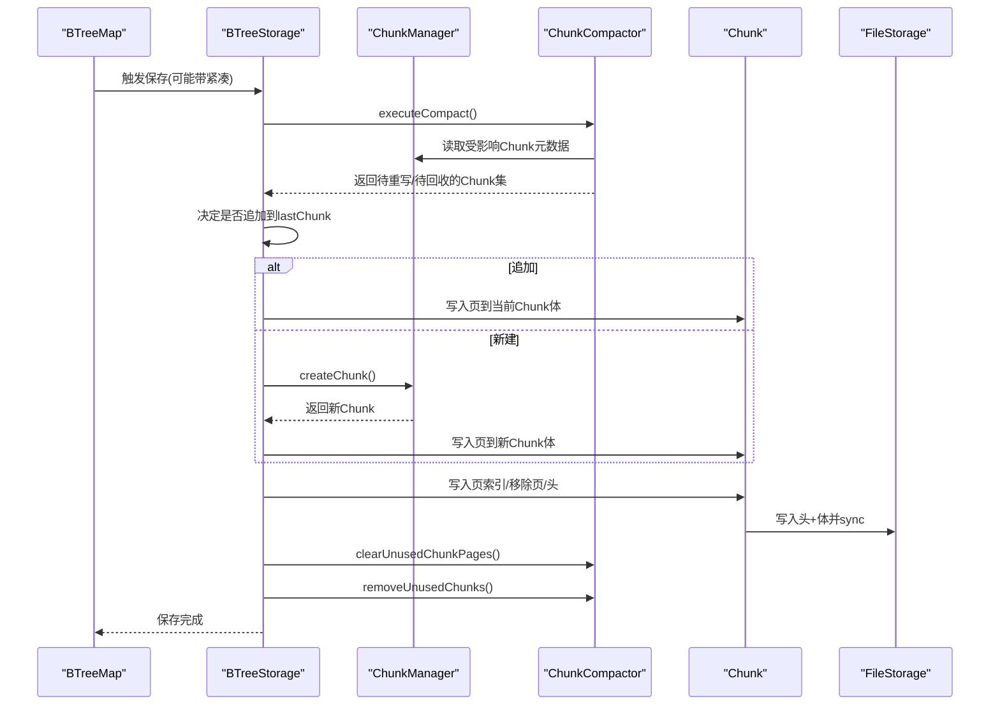
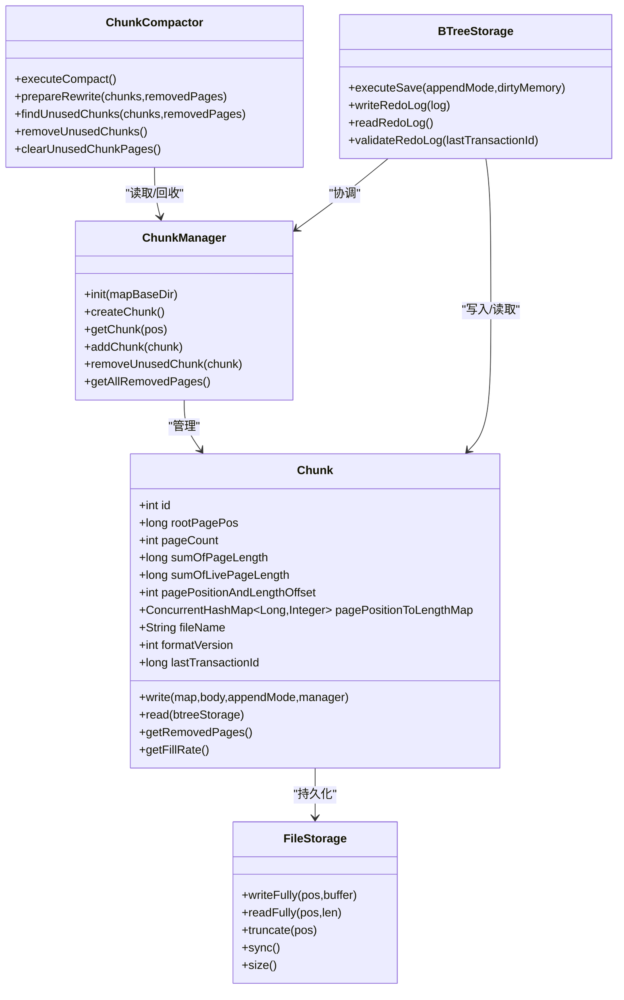
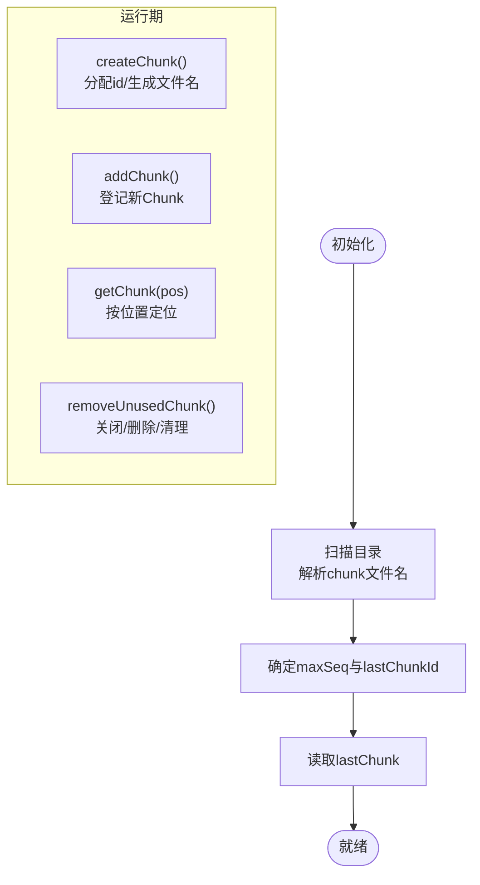
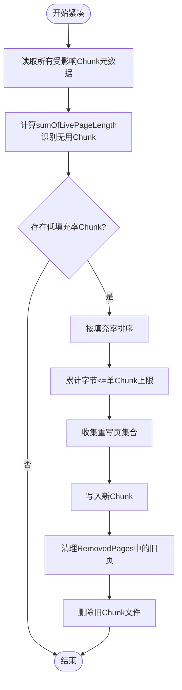
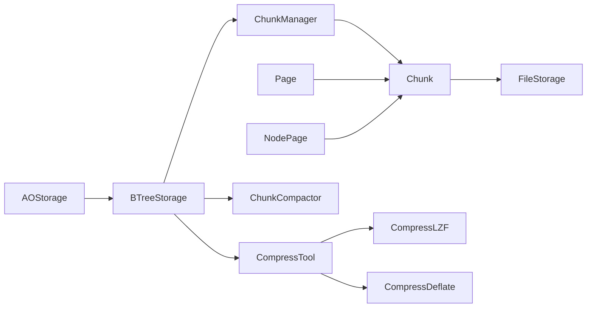

# Chunk管理

**本文引用的文件列表**
- [Chunk.java](https://github.com/lealone/Lealone/blob/master/lealone-aose/src/main/java/com/lealone/storage/aose/btree/chunk/Chunk.java)
- [ChunkManager.java](https://github.com/lealone/Lealone/blob/master/lealone-aose/src/main/java/com/lealone/storage/aose/btree/chunk/ChunkManager.java)
- [ChunkCompactor.java](https://github.com/lealone/Lealone/blob/master/lealone-aose/src/main/java/com/lealone/storage/aose/btree/chunk/ChunkCompactor.java)
- [BTreeStorage.java](https://github.com/lealone/Lealone/blob/master/lealone-aose/src/main/java/com/lealone/storage/aose/btree/BTreeStorage.java)
- [Page.java](https://github.com/lealone/Lealone/blob/master/lealone-aose/src/main/java/com/lealone/storage/aose/btree/page/Page.java)
- [NodePage.java](https://github.com/lealone/Lealone/blob/master/lealone-aose/src/main/java/com/lealone/storage/aose/btree/page/NodePage.java)
- [AOStorage.java](https://github.com/lealone/Lealone/blob/master/lealone-aose/src/main/java/com/lealone/storage/aose/AOStorage.java)
- [PageUtils.java](https://github.com/lealone/Lealone/blob/master/lealone-aose/src/main/java/com/lealone/storage/aose/btree/page/PageUtils.java)
- [FileStorage.java](https://github.com/lealone/Lealone/blob/master/lealone-common/src/main/java/com/lealone/storage/fs/FileStorage.java)
- [DataBuffer.java](https://github.com/lealone/Lealone/blob/master/lealone-common/src/main/java/com/lealone/db/DataBuffer.java)
- [CompressTool.java](https://github.com/lealone/Lealone/blob/master/lealone-common/src/main/java/com/lealone/common/compress/CompressTool.java)
- [CompressLZF.java](https://github.com/lealone/Lealone/blob/master/lealone-common/src/main/java/com/lealone/common/compress/CompressLZF.java)
- [CompressDeflate.java](https://github.com/lealone/Lealone/blob/master/lealone-common/src/main/java/com/lealone/common/compress/CompressDeflate.java)

## 目录
1. [简介](#简介)
2. [项目结构](#项目结构)
3. [核心组件](#核心组件)
4. [架构总览](#架构总览)
5. [详细组件分析](#详细组件分析)
6. [依赖关系分析](#依赖关系分析)
7. [性能考量](#性能考量)
8. [故障排查指南](#故障排查指南)
9. [结论](#结论)
10. [附录：配置参数与调优建议](#附录配置参数与调优建议)

## 简介
本文件深入解析Lealone中ChunkManager对存储文件的全生命周期管理机制，围绕Chunk作为存储基本单元的数据结构设计（元信息、数据区、索引区布局），阐述ChunkManager如何协调Chunk的创建、分配、合并与回收；在高并发写入场景下的线程安全处理；结合代码分析Chunk的版本控制与事务ID记录，解释如何避免压缩过程中数据丢失；描述ChunkManager与B-Tree存储结构的交互方式，以及通过预分配策略减少I/O延迟；最后提供配置参数说明与性能调优建议。

## 项目结构
本主题涉及的关键模块位于AOSE（Adaptive Optimization Storage Engine）子系统：
- 存储引擎入口与映射：AOStorage
- B-Tree存储与页管理：BTreeStorage、Page、NodePage、PageUtils
- Chunk与ChunkManager：Chunk、ChunkManager、ChunkCompactor
- 文件系统抽象：FileStorage
- 缓冲与压缩工具：DataBuffer、CompressTool、CompressLZF、CompressDeflate

图表来源
- [AOStorage.java](https://github.com/lealone/Lealone/blob/master/lealone-aose/src/main/java/com/lealone/storage/aose/AOStorage.java#L1-L104)
- [BTreeStorage.java](https://github.com/lealone/Lealone/blob/master/lealone-aose/src/main/java/com/lealone/storage/aose/btree/BTreeStorage.java#L104-L194)
- [ChunkManager.java](https://github.com/lealone/Lealone/blob/master/lealone-aose/src/main/java/com/lealone/storage/aose/btree/chunk/ChunkManager.java#L1-L164)
- [Chunk.java](https://github.com/lealone/Lealone/blob/master/lealone-aose/src/main/java/com/lealone/storage/aose/btree/chunk/Chunk.java#L1-L137)
- [ChunkCompactor.java](https://github.com/lealone/Lealone/blob/master/lealone-aose/src/main/java/com/lealone/storage/aose/btree/chunk/ChunkCompactor.java#L1-L136)
- [Page.java](https://github.com/lealone/Lealone/blob/master/lealone-aose/src/main/java/com/lealone/storage/aose/btree/page/Page.java#L286-L369)
- [NodePage.java](https://github.com/lealone/Lealone/blob/master/lealone-aose/src/main/java/com/lealone/storage/aose/btree/page/NodePage.java#L173-L205)
- [PageUtils.java](https://github.com/lealone/Lealone/blob/master/lealone-aose/src/main/java/com/lealone/storage/aose/btree/page/PageUtils.java#L1-L200)
- [FileStorage.java](https://github.com/lealone/Lealone/blob/master/lealone-common/src/main/java/com/lealone/storage/fs/FileStorage.java#L1-L200)

章节来源
- [AOStorage.java](https://github.com/lealone/Lealone/blob/master/lealone-aose/src/main/java/com/lealone/storage/aose/AOStorage.java#L1-L104)
- [BTreeStorage.java](https://github.com/lealone/Lealone/blob/master/lealone-aose/src/main/java/com/lealone/storage/aose/btree/BTreeStorage.java#L104-L194)

## 核心组件
- Chunk：存储文件的基本单元，包含头部、页索引区、数据体区。支持双块头冗余、Fletcher校验、页位置到长度映射、移除页集合、格式版本、事务ID等。
- ChunkManager：负责Chunk的创建、读取、命名序列化、最后Chunk跟踪、移除无用Chunk、维护RemovedPages集合。
- ChunkCompactor：扫描RemovedPages，识别低填充率或无用Chunk，准备重写到新Chunk，最终在最新Trunk写入成功后才删除旧Chunk。
- BTreeStorage：协调保存流程，决定是否追加到末尾Chunk、何时创建新Chunk、写入重做日志、校验重做日志、同步落盘。
- Page/NodePage：页写入时更新Chunk索引、计算校验值、可选压缩，返回页位置供上层引用。
- PageUtils：页位置编码（chunkId、offset、type）与解码，用于定位页。
- FileStorage：底层文件I/O抽象，支持顺序写、随机读、截断、同步。

章节来源
- [Chunk.java](https://github.com/lealone/Lealone/blob/master/lealone-aose/src/main/java/com/lealone/storage/aose/btree/chunk/Chunk.java#L1-L137)
- [ChunkManager.java](https://github.com/lealone/Lealone/blob/master/lealone-aose/src/main/java/com/lealone/storage/aose/btree/chunk/ChunkManager.java#L1-L164)
- [ChunkCompactor.java](https://github.com/lealone/Lealone/blob/master/lealone-aose/src/main/java/com/lealone/storage/aose/btree/chunk/ChunkCompactor.java#L1-L136)
- [BTreeStorage.java](https://github.com/lealone/Lealone/blob/master/lealone-aose/src/main/java/com/lealone/storage/aose/btree/BTreeStorage.java#L320-L415)
- [Page.java](https://github.com/lealone/Lealone/blob/master/lealone-aose/src/main/java/com/lealone/storage/aose/btree/page/Page.java#L286-L369)
- [NodePage.java](https://github.com/lealone/Lealone/blob/master/lealone-aose/src/main/java/com/lealone/storage/aose/btree/page/NodePage.java#L173-L205)
- [PageUtils.java](https://github.com/lealone/Lealone/blob/master/lealone-aose/src/main/java/com/lealone/storage/aose/btree/page/PageUtils.java#L1-L200)
- [FileStorage.java](https://github.com/lealone/Lealone/blob/master/lealone-common/src/main/java/com/lealone/storage/fs/FileStorage.java#L1-L200)

## 架构总览
下图展示从B-Tree写入到Chunk持久化的端到端流程，以及紧凑器在保存过程中的协作点。

图表来源
- [BTreeStorage.java](https://github.com/lealone/Lealone/blob/master/lealone-aose/src/main/java/com/lealone/storage/aose/btree/BTreeStorage.java#L320-L415)
- [ChunkManager.java](https://github.com/lealone/Lealone/blob/master/lealone-aose/src/main/java/com/lealone/storage/aose/btree/chunk/ChunkManager.java#L139-L164)
- [ChunkCompactor.java](https://github.com/lealone/Lealone/blob/master/lealone-aose/src/main/java/com/lealone/storage/aose/btree/chunk/ChunkCompactor.java#L69-L136)
- [Chunk.java](https://github.com/lealone/Lealone/blob/master/lealone-aose/src/main/java/com/lealone/storage/aose/btree/chunk/Chunk.java#L298-L321)

## 详细组件分析

### Chunk数据结构设计与布局
- 头部（CHUNK_HEADER_SIZE=2×BLOCK_SIZE）：双拷贝冗余，包含关键元信息键值对（如id、rootPagePos、pageCount、sumOfPageLength、pagePositionAndLengthOffset、mapSize、mapMaxKey、format、removedPageOffset、removedPageCount、lastTransactionId），并以Fletcher校验保护。
- 索引区：记录每个页的位置到长度映射，便于随机访问与校验。
- 移除页区：记录被标记删除的页位置，参与紧凑与回收决策。
- 数据体区：页数据按写入顺序追加，支持压缩与校验。
- 版本控制：formatVersion字段标识格式版本；lastTransactionId记录最后一次事务ID，配合重做日志校验。
- 填充率：sumOfPageLength与sumOfLivePageLength用于计算填充率，驱动紧凑策略。

图表来源
- [Chunk.java](https://github.com/lealone/Lealone/blob/master/lealone-aose/src/main/java/com/lealone/storage/aose/btree/chunk/Chunk.java#L1-L137)
- [ChunkManager.java](https://github.com/lealone/Lealone/blob/master/lealone-aose/src/main/java/com/lealone/storage/aose/btree/chunk/ChunkManager.java#L1-L164)
- [ChunkCompactor.java](https://github.com/lealone/Lealone/blob/master/lealone-aose/src/main/java/com/lealone/storage/aose/btree/chunk/ChunkCompactor.java#L1-L136)
- [BTreeStorage.java](https://github.com/lealone/Lealone/blob/master/lealone-aose/src/main/java/com/lealone/storage/aose/btree/BTreeStorage.java#L320-L415)
- [FileStorage.java](https://github.com/lealone/Lealone/blob/master/lealone-common/src/main/java/com/lealone/storage/fs/FileStorage.java#L1-L200)

章节来源
- [Chunk.java](https://github.com/lealone/Lealone/blob/master/lealone-aose/src/main/java/com/lealone/storage/aose/btree/chunk/Chunk.java#L1-L137)
- [Chunk.java](https://github.com/lealone/Lealone/blob/master/lealone-aose/src/main/java/com/lealone/storage/aose/btree/chunk/Chunk.java#L191-L262)
- [Chunk.java](https://github.com/lealone/Lealone/blob/master/lealone-aose/src/main/java/com/lealone/storage/aose/btree/chunk/Chunk.java#L298-L321)

### ChunkManager生命周期管理
- 初始化：扫描目录，解析chunk文件名（c_[id]_[seq]），确定最大序列号与最后Chunk。
- 创建：分配未使用的chunkId，生成新文件名，不立即写入文件。
- 读取：按需加载Chunk，缓存到内存，提供页索引查询。
- 添加：新Chunk写入成功后登记到管理器。
- 回收：关闭并删除文件，清除索引，维护RemovedPages集合一致性，更新lastChunk。

图表来源
- [ChunkManager.java](https://github.com/lealone/Lealone/blob/master/lealone-aose/src/main/java/com/lealone/storage/aose/btree/chunk/ChunkManager.java#L40-L99)
- [ChunkManager.java](https://github.com/lealone/Lealone/blob/master/lealone-aose/src/main/java/com/lealone/storage/aose/btree/chunk/ChunkManager.java#L115-L164)

章节来源
- [ChunkManager.java](https://github.com/lealone/Lealone/blob/master/lealone-aose/src/main/java/com/lealone/storage/aose/btree/chunk/ChunkManager.java#L40-L99)
- [ChunkManager.java](https://github.com/lealone/Lealone/blob/master/lealone-aose/src/main/java/com/lealone/storage/aose/btree/chunk/ChunkManager.java#L115-L164)

### Chunk紧凑与回收策略
- 扫描RemovedPages，定位受影响的Chunk，计算sumOfLivePageLength，筛选低填充率或完全无活页的Chunk。
- 准备重写：收集重写页集合，按填充率排序，累计字节数不超过单Chunk上限。
- 清理阶段：在最新Trunk写入成功后，先清理UnusedChunk中的页在RemovedPages中的记录，再删除这些Chunk文件，避免数据丢失。

图表来源
- [ChunkCompactor.java](https://github.com/lealone/Lealone/blob/master/lealone-aose/src/main/java/com/lealone/storage/aose/btree/chunk/ChunkCompactor.java#L69-L136)
- [Chunk.java](https://github.com/lealone/Lealone/blob/master/lealone-aose/src/main/java/com/lealone/storage/aose/btree/chunk/Chunk.java#L162-L174)

章节来源
- [ChunkCompactor.java](https://github.com/lealone/Lealone/blob/master/lealone-aose/src/main/java/com/lealone/storage/aose/btree/chunk/ChunkCompactor.java#L69-L136)
- [Chunk.java](https://github.com/lealone/Lealone/blob/master/lealone-aose/src/main/java/com/lealone/storage/aose/btree/chunk/Chunk.java#L162-L174)

### 高并发写入与线程安全
- 关键同步点：
  - ChunkManager.close/removeUnusedChunk：整体同步，保证文件删除与集合清理原子性。
  - Chunk.write/writeRedoLog/readRedoLog：每个Chunk内部同步，避免并发写入竞争。
  - BTreeStorage.executeSave：保存主流程同步，确保紧凑、写入、回收顺序正确。
- 并发容器：
  - RemovedPages使用并发有序集合，支持多线程读写RemovedPages。
  - 页位置到长度映射使用并发哈希表，保障页索引读写一致性。

章节来源
- [ChunkManager.java](https://github.com/lealone/Lealone/blob/master/lealone-aose/src/main/java/com/lealone/storage/aose/btree/chunk/ChunkManager.java#L100-L164)
- [Chunk.java](https://github.com/lealone/Lealone/blob/master/lealone-aose/src/main/java/com/lealone/storage/aose/btree/chunk/Chunk.java#L298-L321)
- [BTreeStorage.java](https://github.com/lealone/Lealone/blob/master/lealone-aose/src/main/java/com/lealone/storage/aose/btree/BTreeStorage.java#L320-L415)

### 版本控制与事务ID
- 格式版本：formatVersion字段与头部format键共同标识格式版本，防止不兼容升级。
- 事务ID：lastTransactionId记录最后一次事务ID，配合重做日志校验，确保崩溃恢复一致性。
- 重做日志：支持写入、读取、校验，必要时截断移除已应用的日志段。

章节来源
- [Chunk.java](https://github.com/lealone/Lealone/blob/master/lealone-aose/src/main/java/com/lealone/storage/aose/btree/chunk/Chunk.java#L248-L296)
- [Chunk.java](https://github.com/lealone/Lealone/blob/master/lealone-aose/src/main/java/com/lealone/storage/aose/btree/chunk/Chunk.java#L311-L342)
- [BTreeStorage.java](https://github.com/lealone/Lealone/blob/master/lealone-aose/src/main/java/com/lealone/storage/aose/btree/BTreeStorage.java#L368-L414)

### 与B-Tree存储结构的交互
- 页写入：Page/NodePage在写入时更新Chunk索引（位置到长度映射），计算校验值，可选压缩。
- 页读取：BTreeStorage根据页位置定位Chunk，查页索引获取长度，读取数据体。
- 保存流程：BTreeStorage决定是否追加到lastChunk，否则创建新Chunk；写入完成后清理与回收。

章节来源
- [Page.java](https://github.com/lealone/Lealone/blob/master/lealone-aose/src/main/java/com/lealone/storage/aose/btree/page/Page.java#L286-L369)
- [NodePage.java](https://github.com/lealone/Lealone/blob/master/lealone-aose/src/main/java/com/lealone/storage/aose/btree/page/NodePage.java#L173-L205)
- [BTreeStorage.java](https://github.com/lealone/Lealone/blob/master/lealone-aose/src/main/java/com/lealone/storage/aose/btree/BTreeStorage.java#L205-L217)
- [BTreeStorage.java](https://github.com/lealone/Lealone/blob/master/lealone-aose/src/main/java/com/lealone/storage/aose/btree/BTreeStorage.java#L320-L415)

### 预分配策略与I/O优化
- 追加策略：若lastChunk未被标记为“无用”，且剩余空间足够，优先追加写入，减少碎片与随机写。
- 单Chunk上限：紧凑选择时累计字节数不超过单Chunk最大容量，避免跨Chunk写导致的碎片。
- 同步策略：Chunk写入头与体后执行同步，确保崩溃不丢数据；重做日志写入采用延迟同步，由上层按需触发。

章节来源
- [BTreeStorage.java](https://github.com/lealone/Lealone/blob/master/lealone-aose/src/main/java/com/lealone/storage/aose/btree/BTreeStorage.java#L320-L366)
- [Chunk.java](https://github.com/lealone/Lealone/blob/master/lealone-aose/src/main/java/com/lealone/storage/aose/btree/chunk/Chunk.java#L298-L309)
- [ChunkCompactor.java](https://github.com/lealone/Lealone/blob/master/lealone-aose/src/main/java/com/lealone/storage/aose/btree/chunk/ChunkCompactor.java#L137-L169)

## 依赖关系分析
- Chunk依赖FileStorage进行文件I/O；依赖PageUtils进行位置编码；依赖Compressor进行页压缩。
- ChunkManager依赖BitField管理chunkId分配，依赖ConcurrentSkipListSet维护RemovedPages。
- BTreeStorage协调保存流程，依赖ChunkManager与ChunkCompactor，依赖CompressTool/Compressor进行压缩。
- AOStorage负责打开映射与导出流，间接连接ChunkManager。

图表来源
- [BTreeStorage.java](https://github.com/lealone/Lealone/blob/master/lealone-aose/src/main/java/com/lealone/storage/aose/btree/BTreeStorage.java#L104-L194)
- [ChunkManager.java](https://github.com/lealone/Lealone/blob/master/lealone-aose/src/main/java/com/lealone/storage/aose/btree/chunk/ChunkManager.java#L1-L164)
- [Chunk.java](https://github.com/lealone/Lealone/blob/master/lealone-aose/src/main/java/com/lealone/storage/aose/btree/chunk/Chunk.java#L1-L137)
- [Page.java](https://github.com/lealone/Lealone/blob/master/lealone-aose/src/main/java/com/lealone/storage/aose/btree/page/Page.java#L286-L369)
- [NodePage.java](https://github.com/lealone/Lealone/blob/master/lealone-aose/src/main/java/com/lealone/storage/aose/btree/page/NodePage.java#L173-L205)
- [AOStorage.java](https://github.com/lealone/Lealone/blob/master/lealone-aose/src/main/java/com/lealone/storage/aose/AOStorage.java#L1-L104)
- [CompressTool.java](https://github.com/lealone/Lealone/blob/master/lealone-common/src/main/java/com/lealone/common/compress/CompressTool.java#L1-L200)
- [CompressLZF.java](https://github.com/lealone/Lealone/blob/master/lealone-common/src/main/java/com/lealone/common/compress/CompressLZF.java#L1-L200)
- [CompressDeflate.java](https://github.com/lealone/Lealone/blob/master/lealone-common/src/main/java/com/lealone/common/compress/CompressDeflate.java#L1-L200)

## 性能考量
- 填充率阈值：minFillRate用于控制紧凑触发条件，过低会频繁重写，过高会增加碎片。
- 压缩级别：可通过配置选择压缩算法与等级，平衡CPU与存储占用。
- 追加写：优先利用lastChunk剩余空间，减少随机写与碎片。
- 同步策略：写入头与体后同步，确保可靠性；重做日志可延迟同步，降低I/O开销。
- 页大小：默认页大小影响单页负载与压缩效果，应结合业务特征调整。

[本节为通用性能讨论，无需列出具体文件来源]

## 故障排查指南
- 文件损坏与校验失败：
  - Chunk头部采用双拷贝与Fletcher校验，读取失败会抛出异常；检查磁盘与文件权限。
  - 页校验失败：检查页长度与校验值计算逻辑。
- 页缺失：
  - 通过Chunk.pagePositionToLengthMap定位页，缺失时抛出异常；确认RemovedPages与重写流程。
- 崩溃恢复：
  - 使用重做日志校验lastTransactionId，确保数据一致性；必要时截断重做日志。
- 无用Chunk未删除：
  - 确认最新Trunk写入成功后再删除旧Chunk，避免数据丢失；检查removeUnusedChunks调用时机。

章节来源
- [Chunk.java](https://github.com/lealone/Lealone/blob/master/lealone-aose/src/main/java/com/lealone/storage/aose/btree/chunk/Chunk.java#L198-L231)
- [Page.java](https://github.com/lealone/Lealone/blob/master/lealone-aose/src/main/java/com/lealone/storage/aose/btree/page/Page.java#L286-L307)
- [BTreeStorage.java](https://github.com/lealone/Lealone/blob/master/lealone-aose/src/main/java/com/lealone/storage/aose/btree/BTreeStorage.java#L368-L414)

## 结论
ChunkManager通过严谨的Chunk数据结构设计与完善的生命周期管理，实现了高可靠、可扩展的存储体系。紧凑器在不丢失数据的前提下提升填充率，B-Tree写入路径与预分配策略有效降低I/O延迟。版本控制与事务ID机制进一步增强了崩溃恢复能力。结合合适的配置与调优，可在吞吐与空间之间取得良好平衡。

[本节为总结性内容，无需列出具体文件来源]

## 附录：配置参数与调优建议
- 压缩配置
  - compress：可选值NO/LZF/DEFLATE或数值等级，控制页压缩策略。
  - 建议：小对象/高并发写入倾向LZF；大对象/低CPU倾向DEFLATE。
- 填充率阈值
  - minFillRate：紧凑触发阈值（百分比），建议根据业务写入模式与碎片容忍度设定。
- 页大小
  - getPageSize：默认16KB，可根据键值大小与压缩效果调整。
- 追加策略
  - appendModeEnabled：启用后优先追加写入lastChunk，减少碎片；注意旧格式Chunk不支持追加。
- 日志与同步
  - 重做日志写入：延迟同步，由上层按需调用sync；确保崩溃恢复一致性。

章节来源
- [BTreeStorage.java](https://github.com/lealone/Lealone/blob/master/lealone-aose/src/main/java/com/lealone/storage/aose/btree/BTreeStorage.java#L104-L194)
- [BTreeStorage.java](https://github.com/lealone/Lealone/blob/master/lealone-aose/src/main/java/com/lealone/storage/aose/btree/BTreeStorage.java#L320-L415)