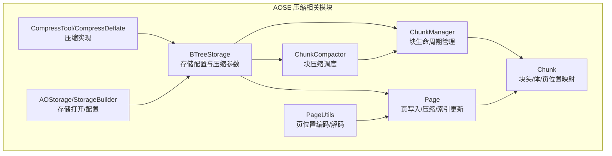
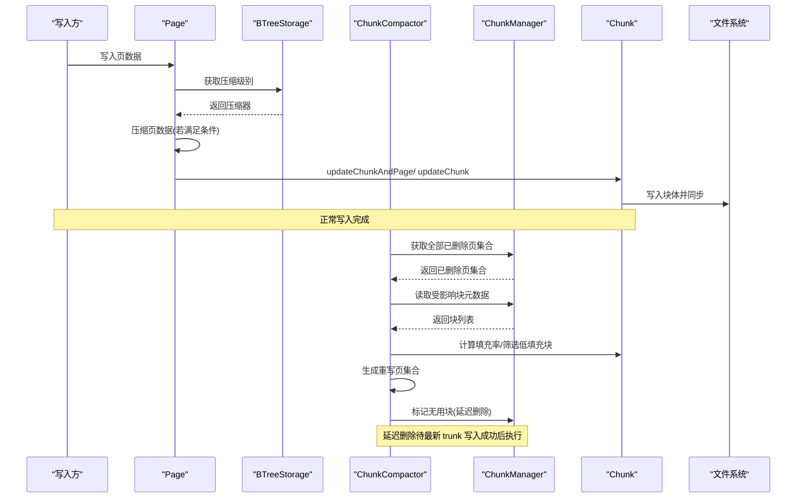
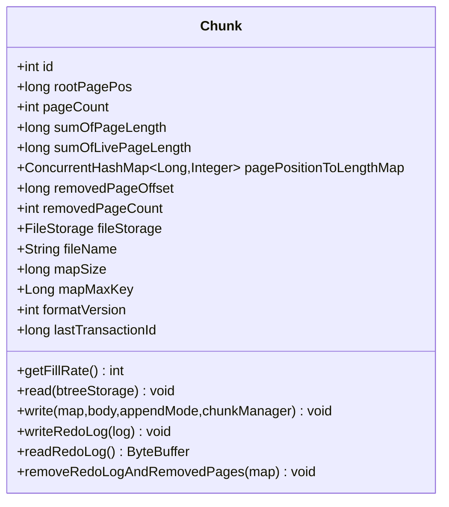
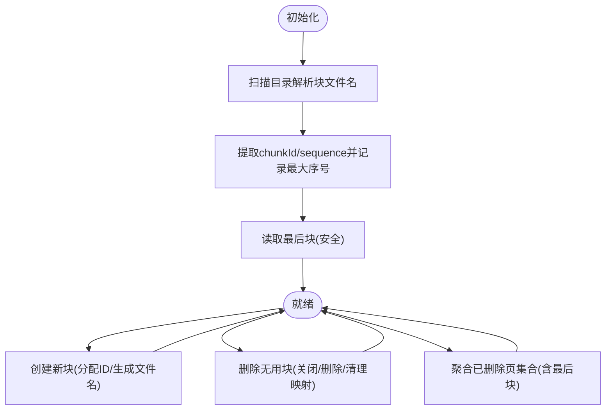
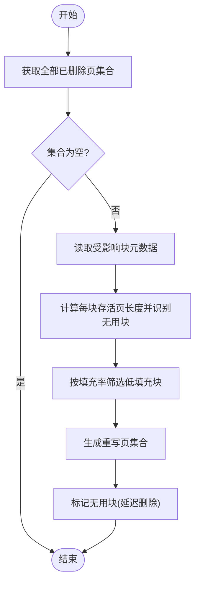
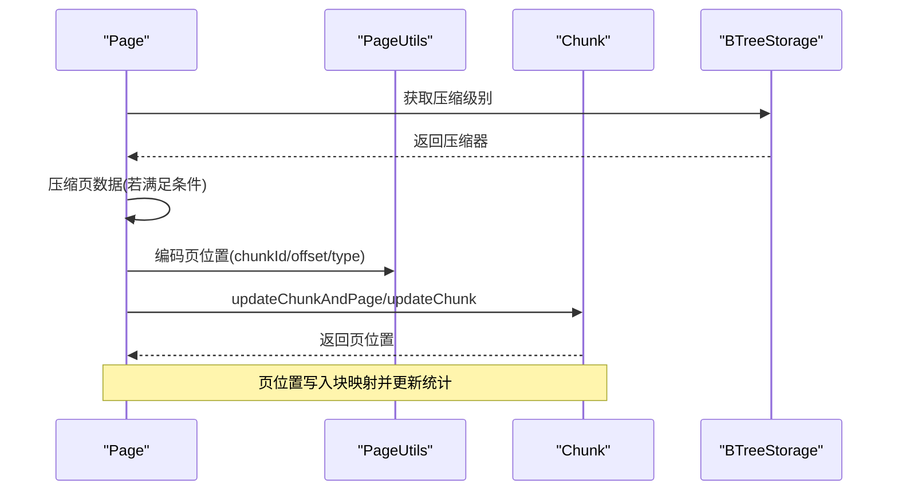
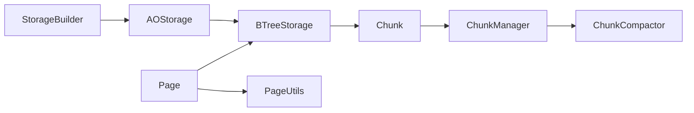

# 压缩机制

<cite>
**本文引用的文件**
- [Chunk.java](file://lealone-aose/src/main/java/com/lealone/storage/aose/btree/chunk/Chunk.java)
- [ChunkCompactor.java](file://lealone-aose/src/main/java/com/lealone/storage/aose/btree/chunk/ChunkCompactor.java)
- [ChunkManager.java](file://lealone-aose/src/main/java/com/lealone/storage/aose/btree/chunk/ChunkManager.java)
- [BTreeStorage.java](file://lealone-aose/src/main/java/com/lealone/storage/aose/btree/BTreeStorage.java)
- [Page.java](file://lealone-aose/src/main/java/com/lealone/storage/aose/btree/page/Page.java)
- [PageUtils.java](file://lealone-aose/src/main/java/com/lealone/storage/aose/btree/page/PageUtils.java)
- [AOStorage.java](file://lealone-aose/src/main/java/com/lealone/storage/aose/AOStorage.java)
- [CompressTool.java](file://lealone-common/src/main/java/com/lealone/common/compress/CompressTool.java)
- [CompressDeflate.java](file://lealone-common/src/main/java/com/lealone/common/compress/CompressDeflate.java)
- [StorageBuilder.java](file://lealone-sci/src/main/java/com/lealone/storage/StorageBuilder.java)
- [CompactTest.java](file://lealone-test/src/test/java/com/lealone/test/aose/CompactTest.java)
- [AoseTestBase.java](file://lealone-test/src/test/java/com/lealone/test/aose/AoseTestBase.java)
</cite>

## 目录
1. [简介](#简介)
2. [项目结构](#项目结构)
3. [核心组件](#核心组件)
4. [架构总览](#架构总览)
5. [详细组件分析](#详细组件分析)
6. [依赖关系分析](#依赖关系分析)
7. [性能考量](#性能考量)
8. [故障排查指南](#故障排查指南)
9. [结论](#结论)
10. [附录](#附录)

## 简介
本文件系统性阐述 AOSE 存储引擎的压缩机制，重点围绕以下目标：
- 解释 ChunkCompactor 如何通过异步化方式对存储文件进行压缩，减少磁盘空间占用并提升读取性能。
- 说明 ChunkManager 如何管理存储文件的生命周期（创建、合并、删除）。
- 描述 Chunk 作为存储文件基本单元的数据结构与元信息管理。
- 结合代码路径展示压缩过程中的数据迁移与索引更新机制。
- 分析压缩机制对系统性能的影响（I/O 负载、CPU 占用、存储效率）。
- 提供配置与优化建议（压缩频率、触发条件等）。

## 项目结构
AOSE 压缩相关的核心代码位于 btree/chunk 与 btree/page 子包，以及通用压缩工具与存储构建器中。整体采用“页-块-文件”的分层组织：页在写入时可选择压缩；块负责页的元信息与持久化；文件由块管理器统一维护。

图表来源
- [BTreeStorage.java](file://lealone-aose/src/main/java/com/lealone/storage/aose/btree/BTreeStorage.java#L36-L194)
- [ChunkManager.java](file://lealone-aose/src/main/java/com/lealone/storage/aose/btree/chunk/ChunkManager.java#L1-L207)
- [Chunk.java](file://lealone-aose/src/main/java/com/lealone/storage/aose/btree/chunk/Chunk.java#L1-L354)
- [ChunkCompactor.java](file://lealone-aose/src/main/java/com/lealone/storage/aose/btree/chunk/ChunkCompactor.java#L1-L169)
- [Page.java](file://lealone-aose/src/main/java/com/lealone/storage/aose/btree/page/Page.java#L300-L378)
- [PageUtils.java](file://lealone-aose/src/main/java/com/lealone/storage/aose/btree/page/PageUtils.java#L1-L94)
- [CompressTool.java](file://lealone-common/src/main/java/com/lealone/common/compress/CompressTool.java#L42-L120)
- [CompressDeflate.java](file://lealone-common/src/main/java/com/lealone/common/compress/CompressDeflate.java#L44-L74)
- [AOStorage.java](file://lealone-aose/src/main/java/com/lealone/storage/aose/AOStorage.java#L1-L104)
- [StorageBuilder.java](file://lealone-sci/src/main/java/com/lealone/storage/StorageBuilder.java#L81-L148)

章节来源
- [BTreeStorage.java](file://lealone-aose/src/main/java/com/lealone/storage/aose/btree/BTreeStorage.java#L36-L194)
- [ChunkManager.java](file://lealone-aose/src/main/java/com/lealone/storage/aose/btree/chunk/ChunkManager.java#L1-L207)
- [Chunk.java](file://lealone-aose/src/main/java/com/lealone/storage/aose/btree/chunk/Chunk.java#L1-L354)
- [ChunkCompactor.java](file://lealone-aose/src/main/java/com/lealone/storage/aose/btree/chunk/ChunkCompactor.java#L1-L169)
- [Page.java](file://lealone-aose/src/main/java/com/lealone/storage/aose/btree/page/Page.java#L300-L378)
- [PageUtils.java](file://lealone-aose/src/main/java/com/lealone/storage/aose/btree/page/PageUtils.java#L1-L94)
- [CompressTool.java](file://lealone-common/src/main/java/com/lealone/common/compress/CompressTool.java#L42-L120)
- [CompressDeflate.java](file://lealone-common/src/main/java/com/lealone/common/compress/CompressDeflate.java#L44-L74)
- [AOStorage.java](file://lealone-aose/src/main/java/com/lealone/storage/aose/AOStorage.java#L1-L104)
- [StorageBuilder.java](file://lealone-sci/src/main/java/com/lealone/storage/StorageBuilder.java#L81-L148)

## 核心组件
- Chunk：块对象，封装块头、页位置与长度映射、已删除页集合、事务 ID 等元信息；负责块的读写与校验。
- ChunkManager：块生命周期管理器，负责块文件命名、最后块读取、块创建、删除、移除页跟踪等。
- ChunkCompactor：块压缩协调器，基于最小填充率阈值筛选低效块，计算重写页集合并延迟删除无用块。
- BTreeStorage：存储配置入口，持有压缩级别、最小填充率、页大小、最大块大小等参数，并提供压缩器实例。
- Page：页写入流程中执行页内数据压缩与页位置更新；支持压缩页的读取扩展。
- PageUtils：页位置编码/解码工具，将 chunkId、offset、type 编码为单一位置标识。
- CompressTool/CompressDeflate：通用压缩工具与高压缩算法实现，用于页内数据压缩。
- AOStorage/StorageBuilder：存储打开与配置入口，提供 compress()/compressHigh()/minFillRate() 等配置接口。

章节来源
- [Chunk.java](file://lealone-aose/src/main/java/com/lealone/storage/aose/btree/chunk/Chunk.java#L1-L354)
- [ChunkManager.java](file://lealone-aose/src/main/java/com/lealone/storage/aose/btree/chunk/ChunkManager.java#L1-L207)
- [ChunkCompactor.java](file://lealone-aose/src/main/java/com/lealone/storage/aose/btree/chunk/ChunkCompactor.java#L1-L169)
- [BTreeStorage.java](file://lealone-aose/src/main/java/com/lealone/storage/aose/btree/BTreeStorage.java#L36-L194)
- [Page.java](file://lealone-aose/src/main/java/com/lealone/storage/aose/btree/page/Page.java#L300-L378)
- [PageUtils.java](file://lealone-aose/src/main/java/com/lealone/storage/aose/btree/page/PageUtils.java#L1-L94)
- [CompressTool.java](file://lealone-common/src/main/java/com/lealone/common/compress/CompressTool.java#L42-L120)
- [CompressDeflate.java](file://lealone-common/src/main/java/com/lealone/common/compress/CompressDeflate.java#L44-L74)
- [AOStorage.java](file://lealone-aose/src/main/java/com/lealone/storage/aose/AOStorage.java#L1-L104)
- [StorageBuilder.java](file://lealone-sci/src/main/java/com/lealone/storage/StorageBuilder.java#L81-L148)

## 架构总览
AOSE 的压缩机制以“页级压缩 + 块级整理”为核心：
- 写入阶段：页在写入缓冲区时根据压缩级别决定是否压缩，压缩后更新块的页位置与长度映射。
- 整理阶段：ChunkCompactor 周期性扫描已删除页集合，识别低填充率块与无用块，准备重写页集合并延迟删除无用块。
- 数据迁移：重写低填充率块中的存活页到新块，更新页位置映射与索引引用。
- 同步与一致性：块写入与重写过程中严格维护块头校验与事务 ID，保证崩溃恢复能力。

图表来源
- [Page.java](file://lealone-aose/src/main/java/com/lealone/storage/aose/btree/page/Page.java#L300-L378)
- [BTreeStorage.java](file://lealone-aose/src/main/java/com/lealone/storage/aose/btree/BTreeStorage.java#L120-L170)
- [ChunkCompactor.java](file://lealone-aose/src/main/java/com/lealone/storage/aose/btree/chunk/ChunkCompactor.java#L69-L168)
- [ChunkManager.java](file://lealone-aose/src/main/java/com/lealone/storage/aose/btree/chunk/ChunkManager.java#L188-L206)
- [Chunk.java](file://lealone-aose/src/main/java/com/lealone/storage/aose/btree/chunk/Chunk.java#L298-L321)

## 详细组件分析

### Chunk 类：块数据结构与元信息管理
- 关键字段
  - id：块标识
  - rootPagePos：根页位置
  - pageCount/sumOfPageLength/sumOfLivePageLength：页数量与总长度、存活页总长度
  - pagePositionToLengthMap：页位置到长度的并发映射
  - removedPageOffset/removedPageCount/removedPages：已删除页集合及其偏移
  - 文件句柄、文件名、映射大小、最大键、格式版本、最后事务 ID
- 填充率计算：基于 sumOfLivePageLength 与 sumOfPageLength 的百分比估算，用于压缩决策
- 头部与校验：块头包含关键元信息，采用双拷贝与 Fletcher 校验，提升崩溃安全性
- 写入与重放日志：支持追加模式写入块体并同步；支持写入重放日志与裁剪
- 生命周期：通过 ChunkManager 删除块并清理已删除页集合

图表来源
- [Chunk.java](file://lealone-aose/src/main/java/com/lealone/storage/aose/btree/chunk/Chunk.java#L1-L354)

章节来源
- [Chunk.java](file://lealone-aose/src/main/java/com/lealone/storage/aose/btree/chunk/Chunk.java#L1-L354)

### ChunkManager：块生命周期管理
- 初始化：扫描目录，解析块文件名，确定最大序列号与最后块
- 最后块读取：安全读取并缓存最后块，异常时触发 panic
- 块创建与添加：分配新的块 ID，生成块文件名并登记
- 删除块：关闭文件句柄、删除文件、清除块 ID、清理映射、更新最后块
- 已删除页集合：维护全局与最后块的已删除页集合，用于压缩调度
- 输入流：根据文件名定位对应块的输入流，便于外部读取

图表来源
- [ChunkManager.java](file://lealone-aose/src/main/java/com/lealone/storage/aose/btree/chunk/ChunkManager.java#L40-L113)
- [ChunkManager.java](file://lealone-aose/src/main/java/com/lealone/storage/aose/btree/chunk/ChunkManager.java#L115-L174)
- [ChunkManager.java](file://lealone-aose/src/main/java/com/lealone/storage/aose/btree/chunk/ChunkManager.java#L148-L163)
- [ChunkManager.java](file://lealone-aose/src/main/java/com/lealone/storage/aose/btree/chunk/ChunkManager.java#L188-L206)

章节来源
- [ChunkManager.java](file://lealone-aose/src/main/java/com/lealone/storage/aose/btree/chunk/ChunkManager.java#L1-L207)

### ChunkCompactor：异步压缩调度与数据迁移
- 触发条件：存在已删除页集合时启动
- 读取受影响块：从已删除页集合推导涉及的块 ID 并读取元数据
- 识别无用块：遍历块的页位置映射，统计存活页总长度；若为 0 则标记为无用块（延迟删除）
- 低填充块筛选：按填充率升序排序，累计存活页长度不超过块最大容量，选出可重写的块集合
- 重写页集合：从可重写块中收集未被删除的页位置，作为重写候选
- 延迟删除：将无用块与重写块集合暂存，等待最新 trunk 写入成功后再统一删除

图表来源
- [ChunkCompactor.java](file://lealone-aose/src/main/java/com/lealone/storage/aose/btree/chunk/ChunkCompactor.java#L69-L168)

章节来源
- [ChunkCompactor.java](file://lealone-aose/src/main/java/com/lealone/storage/aose/btree/chunk/ChunkCompactor.java#L1-L169)

### 页压缩与索引更新：Page 与 PageUtils
- 页压缩：在写入缓冲区末尾进行压缩，若压缩收益显著则替换类型位并写入压缩数据与长度差
- 页扩展：读取压缩页时根据类型位选择对应压缩器进行解压
- 位置编码：将 chunkId、offset、type 编码为单一位置标识，便于页引用与重写
- 索引更新：写入完成后通过 updateChunkAndPage/updateChunk 将页位置与长度写入块映射，并更新块统计

图表来源
- [Page.java](file://lealone-aose/src/main/java/com/lealone/storage/aose/btree/page/Page.java#L300-L378)
- [PageUtils.java](file://lealone-aose/src/main/java/com/lealone/storage/aose/btree/page/PageUtils.java#L40-L94)
- [BTreeStorage.java](file://lealone-aose/src/main/java/com/lealone/storage/aose/btree/BTreeStorage.java#L120-L170)

章节来源
- [Page.java](file://lealone-aose/src/main/java/com/lealone/storage/aose/btree/page/Page.java#L300-L378)
- [PageUtils.java](file://lealone-aose/src/main/java/com/lealone/storage/aose/btree/page/PageUtils.java#L1-L94)
- [BTreeStorage.java](file://lealone-aose/src/main/java/com/lealone/storage/aose/btree/BTreeStorage.java#L120-L170)

### 压缩算法与配置
- 压缩级别：支持禁用、快速压缩(LZF)、高压缩(DEFLATE)
- 压缩工具：CompressTool 统一封装压缩/解压流程，自动选择算法并处理回退
- 配置入口：StorageBuilder 提供 compress()/compressHigh()/minFillRate() 接口
- 测试示例：AoseTestBase 中设置压缩级别与最小填充率，CompactTest 展示压缩场景

章节来源
- [CompressTool.java](file://lealone-common/src/main/java/com/lealone/common/compress/CompressTool.java#L42-L120)
- [CompressDeflate.java](file://lealone-common/src/main/java/com/lealone/common/compress/CompressDeflate.java#L44-L74)
- [StorageBuilder.java](file://lealone-sci/src/main/java/com/lealone/storage/StorageBuilder.java#L81-L148)
- [AoseTestBase.java](file://lealone-test/src/test/java/com/lealone/test/aose/AoseTestBase.java#L55-L85)
- [CompactTest.java](file://lealone-test/src/test/java/com/lealone/test/aose/CompactTest.java#L1-L53)

## 依赖关系分析
- Chunk 依赖 ChunkManager 提供文件存储与块元数据读取
- ChunkCompactor 依赖 ChunkManager 获取已删除页集合与块元数据
- Page 写入依赖 BTreeStorage 提供压缩器与块更新接口
- PageUtils 为页位置编码/解码提供基础工具
- AOStorage/StorageBuilder 为存储打开与压缩配置提供入口

图表来源
- [Page.java](file://lealone-aose/src/main/java/com/lealone/storage/aose/btree/page/Page.java#L300-L378)
- [BTreeStorage.java](file://lealone-aose/src/main/java/com/lealone/storage/aose/btree/BTreeStorage.java#L36-L194)
- [Chunk.java](file://lealone-aose/src/main/java/com/lealone/storage/aose/btree/chunk/Chunk.java#L1-L354)
- [ChunkManager.java](file://lealone-aose/src/main/java/com/lealone/storage/aose/btree/chunk/ChunkManager.java#L1-L207)
- [ChunkCompactor.java](file://lealone-aose/src/main/java/com/lealone/storage/aose/btree/chunk/ChunkCompactor.java#L1-L169)
- [PageUtils.java](file://lealone-aose/src/main/java/com/lealone/storage/aose/btree/page/PageUtils.java#L1-L94)
- [AOStorage.java](file://lealone-aose/src/main/java/com/lealone/storage/aose/AOStorage.java#L1-L104)
- [StorageBuilder.java](file://lealone-sci/src/main/java/com/lealone/storage/StorageBuilder.java#L81-L148)

章节来源
- [Page.java](file://lealone-aose/src/main/java/com/lealone/storage/aose/btree/page/Page.java#L300-L378)
- [BTreeStorage.java](file://lealone-aose/src/main/java/com/lealone/storage/aose/btree/BTreeStorage.java#L36-L194)
- [Chunk.java](file://lealone-aose/src/main/java/com/lealone/storage/aose/btree/chunk/Chunk.java#L1-L354)
- [ChunkManager.java](file://lealone-aose/src/main/java/com/lealone/storage/aose/btree/chunk/ChunkManager.java#L1-L207)
- [ChunkCompactor.java](file://lealone-aose/src/main/java/com/lealone/storage/aose/btree/chunk/ChunkCompactor.java#L1-L169)
- [PageUtils.java](file://lealone-aose/src/main/java/com/lealone/storage/aose/btree/page/PageUtils.java#L1-L94)
- [AOStorage.java](file://lealone-aose/src/main/java/com/lealone/storage/aose/AOStorage.java#L1-L104)
- [StorageBuilder.java](file://lealone-sci/src/main/java/com/lealone/storage/StorageBuilder.java#L81-L148)

## 性能考量
- I/O 负载
  - 页压缩发生在写入缓冲区，压缩后写入块体并同步，降低磁盘写放大
  - 压缩重写会引入额外的顺序读取与写入，建议在低峰期或批量写入场景触发
- CPU 占用
  - 压缩/解压算法（LZF/DEFLATE）会增加 CPU 开销；DEFLATE 压缩比更高但 CPU 成本更大
  - 压缩调度（计算填充率、筛选块、生成重写页集合）为后台逻辑，避免阻塞主线程
- 存储效率
  - 填充率阈值（minFillRate）控制压缩触发强度；过高阈值导致压缩不生效，过低阈值引发频繁重写
  - 块最大容量限制（Chunk.MAX_SIZE）保障单次重写规模可控，避免一次性重写过大

[本节为通用性能讨论，无需列出具体文件来源]

## 故障排查指南
- 崩溃恢复
  - 块头采用双拷贝与校验，若任一副本校验失败，抛出文件损坏异常；应检查磁盘与文件系统
- 页位置缺失
  - 读取页长度时若映射不存在，抛出文件损坏异常；通常由块元数据损坏或重写未完成导致
- 重写页集合异常
  - 若重写页集合对应的块已被删除，可能导致异常；应确保在最新 trunk 写入成功后再删除无用块
- 压缩配置问题
  - 压缩级别与算法选项错误会导致压缩失败或回退；可通过 StorageBuilder 的 compress()/compressHigh() 设置

章节来源
- [Chunk.java](file://lealone-aose/src/main/java/com/lealone/storage/aose/btree/chunk/Chunk.java#L94-L102)
- [Chunk.java](file://lealone-aose/src/main/java/com/lealone/storage/aose/btree/chunk/Chunk.java#L228-L231)
- [ChunkCompactor.java](file://lealone-aose/src/main/java/com/lealone/storage/aose/btree/chunk/ChunkCompactor.java#L45-L67)
- [CompressTool.java](file://lealone-common/src/main/java/com/lealone/common/compress/CompressTool.java#L80-L120)

## 结论
AOSE 的压缩机制通过“页级压缩 + 块级整理”的组合，在保证一致性的前提下有效降低磁盘占用并提升读取性能。ChunkCompactor 以最小填充率阈值为触发条件，异步化地识别并重写低效块，配合延迟删除策略避免并发冲突。开发者可通过合理设置压缩级别与最小填充率，平衡 CPU 与 I/O 开销，获得更优的存储效率。

[本节为总结性内容，无需列出具体文件来源]

## 附录
- 配置建议
  - 压缩级别：默认 LZF（快速），大数据量写入场景可考虑 DEFLATE（高压缩比）
  - 最小填充率：建议 30%-50%，过高导致压缩不生效，过低引发频繁重写
  - 页大小：根据工作负载调整，影响页分裂与压缩收益
- 触发策略
  - 建议在批量写入完成后触发保存与压缩，或在系统空闲时段定期执行压缩
  - 结合业务峰值与磁盘带宽，避免与热点读写同时进行

章节来源
- [BTreeStorage.java](file://lealone-aose/src/main/java/com/lealone/storage/aose/btree/BTreeStorage.java#L66-L73)
- [StorageBuilder.java](file://lealone-sci/src/main/java/com/lealone/storage/StorageBuilder.java#L81-L148)
- [AoseTestBase.java](file://lealone-test/src/test/java/com/lealone/test/aose/AoseTestBase.java#L55-L85)
- [CompactTest.java](file://lealone-test/src/test/java/com/lealone/test/aose/CompactTest.java#L1-L53)