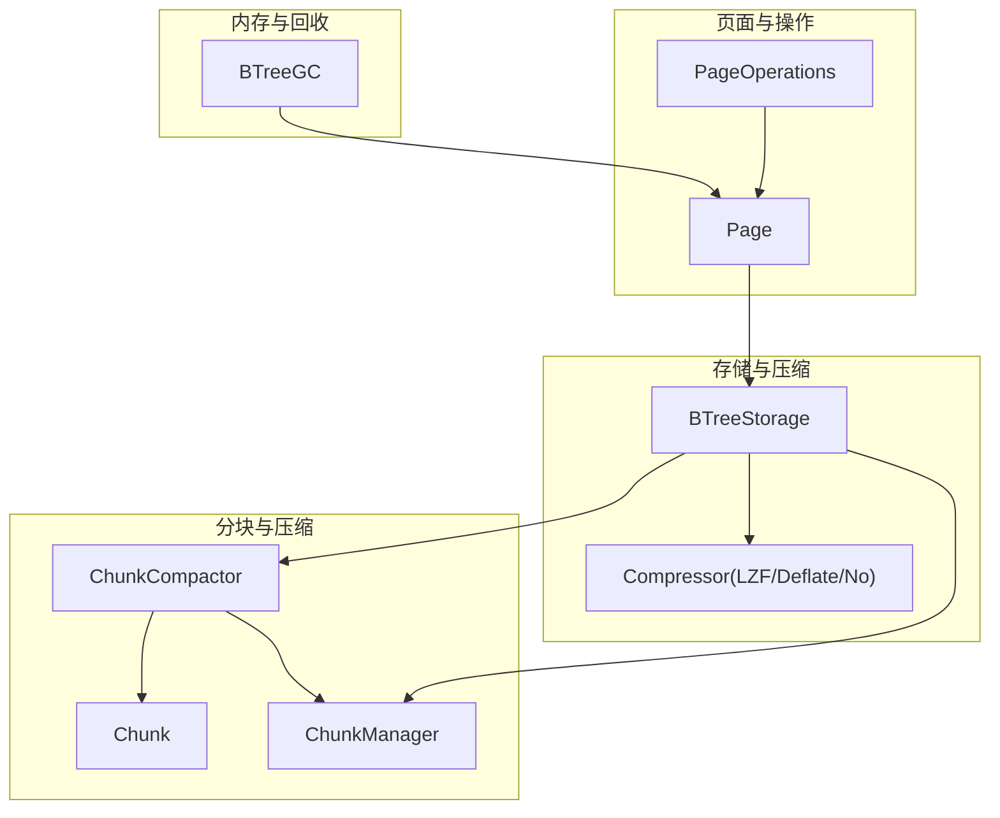
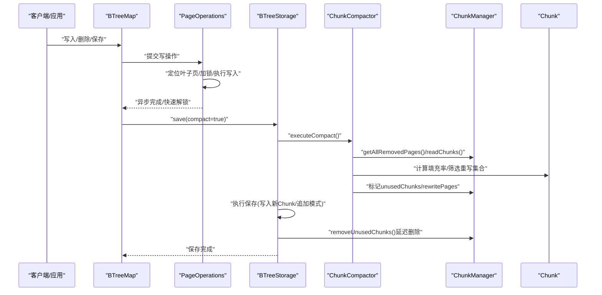
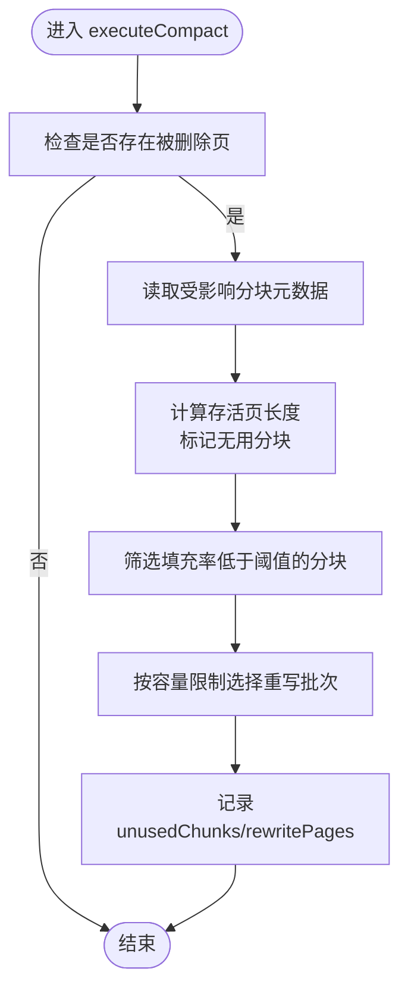
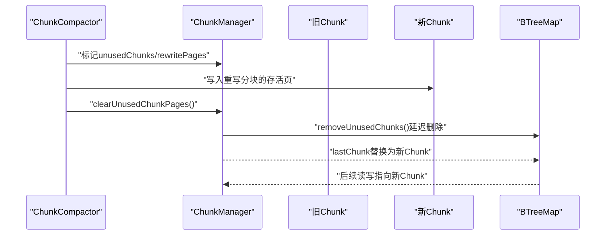
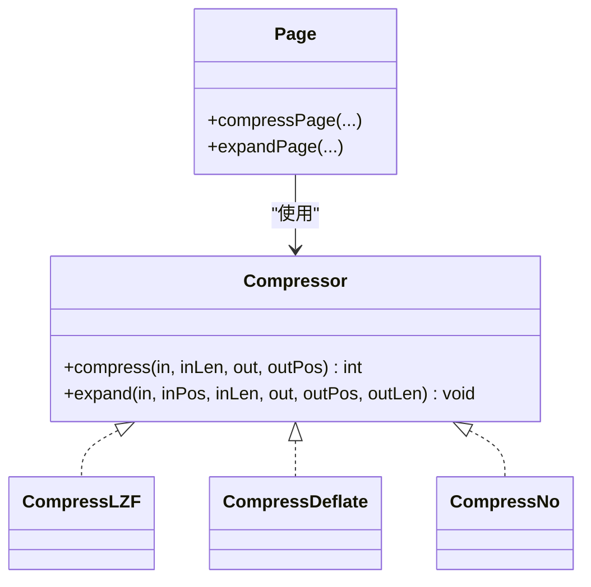
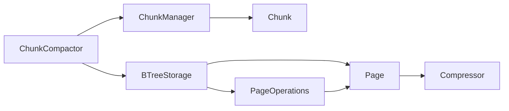

# 压缩策略

<cite>
**本文引用的文件列表**
- [ChunkCompactor.java](https://github.com/lealone/Lealone/blob/master/lealone-aose/src/main/java/com/lealone/storage/aose/btree/chunk/ChunkCompactor.java)
- [Chunk.java](https://github.com/lealone/Lealone/blob/master/lealone-aose/src/main/java/com/lealone/storage/aose/btree/chunk/Chunk.java)
- [ChunkManager.java](https://github.com/lealone/Lealone/blob/master/lealone-aose/src/main/java/com/lealone/storage/aose/btree/chunk/ChunkManager.java)
- [BTreeStorage.java](https://github.com/lealone/Lealone/blob/master/lealone-aose/src/main/java/com/lealone/storage/aose/btree/BTreeStorage.java)
- [BTreeGC.java](https://github.com/lealone/Lealone/blob/master/lealone-aose/src/main/java/com/lealone/storage/aose/btree/BTreeGC.java)
- [PageOperations.java](https://github.com/lealone/Lealone/blob/master/lealone-aose/src/main/java/com/lealone/storage/aose/btree/page/PageOperations.java)
- [Page.java](https://github.com/lealone/Lealone/blob/master/lealone-aose/src/main/java/com/lealone/storage/aose/btree/page/Page.java)
- [CompressTool.java](https://github.com/lealone/Lealone/blob/master/lealone-common/src/main/java/com/lealone/common/compress/CompressTool.java)
- [CompressLZF.java](https://github.com/lealone/Lealone/blob/master/lealone-common/src/main/java/com/lealone/common/compress/CompressLZF.java)
- [CompressDeflate.java](https://github.com/lealone/Lealone/blob/master/lealone-common/src/main/java/com/lealone/common/compress/CompressDeflate.java)
- [CompressNo.java](https://github.com/lealone/Lealone/blob/master/lealone-common/src/main/java/com/lealone/common/compress/CompressNo.java)
- [StorageBuilder.java](https://github.com/lealone/Lealone/blob/master/lealone-sci/src/main/java/com/lealone/storage/StorageBuilder.java)
- [AoseTestBase.java](https://github.com/lealone/Lealone/blob/master/lealone-test/src/test/java/com/lealone/test/aose/AoseTestBase.java)
- [CompactTest.java](https://github.com/lealone/Lealone/blob/master/lealone-test/src/test/java/com/lealone/test/aose/CompactTest.java)
</cite>

## 目录
1. [简介](#简介)
2. [项目结构](#项目结构)
3. [核心组件](#核心组件)
4. [架构总览](#架构总览)
5. [详细组件分析](#详细组件分析)
6. [依赖关系分析](#依赖关系分析)
7. [性能考量](#性能考量)
8. [故障排查指南](#故障排查指南)
9. [结论](#结论)
10. [附录](#附录)

## 简介
本文件系统性阐述 AOSE 存储引擎的压缩策略设计，重点围绕 ChunkCompactor 如何通过异步化方式执行压缩任务，避免阻塞正常读写；分析压缩触发条件（空间利用率阈值、脏页比例、时间间隔等）；解释压缩过程中的数据迁移机制（旧 Chunk 到新 Chunk 的数据复制、索引更新与引用切换的原子性保障）；并评估压缩对 I/O 负载、CPU 资源与存储空间回收效率的影响。最后给出基于业务负载调整压缩策略参数（如并发压缩线程数、压缩优先级）的实践建议。

## 项目结构
AOSE 压缩策略涉及的核心模块：
- 分块与管理：Chunk、ChunkManager、ChunkCompactor
- 存储与压缩：BTreeStorage（含压缩级别与阈值）、Compressor 实现
- 内存与回收：BTreeGC（内存回收与触发）
- 页面与操作：Page、PageOperations（异步写入与锁控制）

图表来源
- [ChunkCompactor.java](https://github.com/lealone/Lealone/blob/master/lealone-aose/src/main/java/com/lealone/storage/aose/btree/chunk/ChunkCompactor.java#L1-L169)
- [Chunk.java](https://github.com/lealone/Lealone/blob/master/lealone-aose/src/main/java/com/lealone/storage/aose/btree/chunk/Chunk.java#L1-L354)
- [ChunkManager.java](https://github.com/lealone/Lealone/blob/master/lealone-aose/src/main/java/com/lealone/storage/aose/btree/chunk/ChunkManager.java#L1-L207)
- [BTreeStorage.java](https://github.com/lealone/Lealone/blob/master/lealone-aose/src/main/java/com/lealone/storage/aose/btree/BTreeStorage.java#L1-L200)
- [PageOperations.java](https://github.com/lealone/Lealone/blob/master/lealone-aose/src/main/java/com/lealone/storage/aose/btree/page/PageOperations.java#L1-L200)
- [Page.java](https://github.com/lealone/Lealone/blob/master/lealone-aose/src/main/java/com/lealone/storage/aose/btree/page/Page.java#L286-L340)

章节来源
- [ChunkCompactor.java](https://github.com/lealone/Lealone/blob/master/lealone-aose/src/main/java/com/lealone/storage/aose/btree/chunk/ChunkCompactor.java#L1-L169)
- [Chunk.java](https://github.com/lealone/Lealone/blob/master/lealone-aose/src/main/java/com/lealone/storage/aose/btree/chunk/Chunk.java#L1-L354)
- [ChunkManager.java](https://github.com/lealone/Lealone/blob/master/lealone-aose/src/main/java/com/lealone/storage/aose/btree/chunk/ChunkManager.java#L1-L207)
- [BTreeStorage.java](https://github.com/lealone/Lealone/blob/master/lealone-aose/src/main/java/com/lealone/storage/aose/btree/BTreeStorage.java#L1-L200)
- [PageOperations.java](https://github.com/lealone/Lealone/blob/master/lealone-aose/src/main/java/com/lealone/storage/aose/btree/page/PageOperations.java#L1-L200)
- [Page.java](https://github.com/lealone/Lealone/blob/master/lealone-aose/src/main/java/com/lealone/storage/aose/btree/page/Page.java#L286-L340)

## 核心组件
- Chunk：表示持久化分块，包含页位置与长度映射、移除页集合、头尾校验与写入/读取逻辑。
- ChunkManager：负责分块文件发现、最后分块跟踪、移除页集合聚合、分块创建与删除。
- ChunkCompactor：按阈值筛选可重写分块，计算填充率，选择待重写集合，延迟删除无用分块。
- BTreeStorage：持有最小填充率阈值、压缩级别、最大分块大小，协调保存与压缩执行。
- BTreeGC：内存回收与触发，间接影响压缩时机（内存压力驱动清理）。
- PageOperations：异步写入与锁控制，避免阻塞读写路径。
- Compressor：LZF/Deflate/No 三种压缩器，用于页面压缩与解压。

章节来源
- [Chunk.java](https://github.com/lealone/Lealone/blob/master/lealone-aose/src/main/java/com/lealone/storage/aose/btree/chunk/Chunk.java#L1-L354)
- [ChunkManager.java](https://github.com/lealone/Lealone/blob/master/lealone-aose/src/main/java/com/lealone/storage/aose/btree/chunk/ChunkManager.java#L1-L207)
- [ChunkCompactor.java](https://github.com/lealone/Lealone/blob/master/lealone-aose/src/main/java/com/lealone/storage/aose/btree/chunk/ChunkCompactor.java#L1-L169)
- [BTreeStorage.java](https://github.com/lealone/Lealone/blob/master/lealone-aose/src/main/java/com/lealone/storage/aose/btree/BTreeStorage.java#L1-L200)
- [BTreeGC.java](https://github.com/lealone/Lealone/blob/master/lealone-aose/src/main/java/com/lealone/storage/aose/btree/BTreeGC.java#L1-L200)
- [PageOperations.java](https://github.com/lealone/Lealone/blob/master/lealone-aose/src/main/java/com/lealone/storage/aose/btree/page/PageOperations.java#L1-L200)
- [CompressTool.java](https://github.com/lealone/Lealone/blob/master/lealone-common/src/main/java/com/lealone/common/compress/CompressTool.java#L1-L306)

## 架构总览
AOSE 压缩策略的关键流程：
- 触发阶段：保存时判断是否需要压缩（由 BTreeStorage 控制），随后调用 ChunkCompactor 执行压缩准备与重写。
- 准备阶段：统计各分块存活页长度，计算填充率，筛选低于阈值的分块，构建重写集合。
- 执行阶段：将重写集合中的存活页写入新分块，更新移除页集合，延迟删除无用分块。
- 引用切换：通过 ChunkManager 的 lastChunk 与新分块替换，确保后续读写指向新分块。
- 异步化：PageOperations 的写入采用异步与快速解锁，减少阻塞；压缩作为保存流程的一部分，避免长事务阻塞。

图表来源
- [BTreeStorage.java](https://github.com/lealone/Lealone/blob/master/lealone-aose/src/main/java/com/lealone/storage/aose/btree/BTreeStorage.java#L307-L340)
- [ChunkCompactor.java](https://github.com/lealone/Lealone/blob/master/lealone-aose/src/main/java/com/lealone/storage/aose/btree/chunk/ChunkCompactor.java#L69-L169)
- [ChunkManager.java](https://github.com/lealone/Lealone/blob/master/lealone-aose/src/main/java/com/lealone/storage/aose/btree/chunk/ChunkManager.java#L188-L206)
- [Chunk.java](https://github.com/lealone/Lealone/blob/master/lealone-aose/src/main/java/com/lealone/storage/aose/btree/chunk/Chunk.java#L104-L118)
- [PageOperations.java](https://github.com/lealone/Lealone/blob/master/lealone-aose/src/main/java/com/lealone/storage/aose/btree/page/PageOperations.java#L81-L151)

## 详细组件分析

### ChunkCompactor：异步化压缩任务
- 触发入口：保存时调用 executeCompact，仅当存在被删除页时才执行。
- 无用分块识别：遍历被删除页涉及的分块，计算存活页总长度，若为 0 则标记为无用分块，延迟删除。
- 重写集合选择：按填充率升序排序，累计存活页长度不超过单分块容量，选出一批待重写分块。
- 延迟删除：将无用分块与重写分块记录在内部集合，等待最新 trunk 写成功后再统一删除，避免并发读取异常。
- 引用切换：通过 ChunkManager 的 lastChunk 与新分块替换，确保后续读写指向新分块。

图表来源
- [ChunkCompactor.java](https://github.com/lealone/Lealone/blob/master/lealone-aose/src/main/java/com/lealone/storage/aose/btree/chunk/ChunkCompactor.java#L69-L169)
- [Chunk.java](https://github.com/lealone/Lealone/blob/master/lealone-aose/src/main/java/com/lealone/storage/aose/btree/chunk/Chunk.java#L104-L118)
- [ChunkManager.java](https://github.com/lealone/Lealone/blob/master/lealone-aose/src/main/java/com/lealone/storage/aose/btree/chunk/ChunkManager.java#L188-L206)

章节来源
- [ChunkCompactor.java](https://github.com/lealone/Lealone/blob/master/lealone-aose/src/main/java/com/lealone/storage/aose/btree/chunk/ChunkCompactor.java#L1-L169)
- [ChunkManager.java](https://github.com/lealone/Lealone/blob/master/lealone-aose/src/main/java/com/lealone/storage/aose/btree/chunk/ChunkManager.java#L1-L207)

### 触发条件与策略参数
- 空间利用率阈值（最小填充率）：由 BTreeStorage 读取配置，默认 30%，上限 50%。ChunkCompactor 仅对填充率低于阈值的分块进行重写。
- 脏页比例：通过 BTreeGC 的内存回收与触发，间接影响压缩频率。当内存压力较大时，更易触发清理与保存，从而增加压缩机会。
- 时间间隔：保存时触发压缩，具体频率取决于业务写入节奏与 save 调用频次。可通过业务侧控制 save 频率以平衡压缩与 I/O。
- 分块容量：单分块最大容量受 Chunk.MAX_SIZE 限制，重写批次累计长度不超过该值，避免跨分块重写导致复杂度上升。

章节来源
- [BTreeStorage.java](https://github.com/lealone/Lealone/blob/master/lealone-aose/src/main/java/com/lealone/storage/aose/btree/BTreeStorage.java#L66-L74)
- [BTreeStorage.java](https://github.com/lealone/Lealone/blob/master/lealone-aose/src/main/java/com/lealone/storage/aose/btree/BTreeStorage.java#L171-L177)
- [Chunk.java](https://github.com/lealone/Lealone/blob/master/lealone-aose/src/main/java/com/lealone/storage/aose/btree/chunk/Chunk.java#L48-L49)
- [ChunkCompactor.java](https://github.com/lealone/Lealone/blob/master/lealone-aose/src/main/java/com/lealone/storage/aose/btree/chunk/ChunkCompactor.java#L137-L167)
- [BTreeGC.java](https://github.com/lealone/Lealone/blob/master/lealone-aose/src/main/java/com/lealone/storage/aose/btree/BTreeGC.java#L50-L114)

### 数据迁移机制与原子性保障
- 旧到新的数据复制：将重写分块中的存活页写入新分块，保留页位置与长度映射，移除页集合合并。
- 索引更新与引用切换：通过 ChunkManager 的 lastChunk 与新分块替换，确保后续读写指向新分块；无用分块延迟删除，避免并发读取异常。
- 原子性保障：重写与删除操作在保存流程中顺序执行，结合文件同步与头部校验，确保崩溃恢复一致性；延迟删除避免读取时找不到分块引发异常。

图表来源
- [ChunkCompactor.java](https://github.com/lealone/Lealone/blob/master/lealone-aose/src/main/java/com/lealone/storage/aose/btree/chunk/ChunkCompactor.java#L41-L67)
- [ChunkCompactor.java](https://github.com/lealone/Lealone/blob/master/lealone-aose/src/main/java/com/lealone/storage/aose/btree/chunk/ChunkCompactor.java#L114-L136)
- [ChunkManager.java](https://github.com/lealone/Lealone/blob/master/lealone-aose/src/main/java/com/lealone/storage/aose/btree/chunk/ChunkManager.java#L148-L163)

章节来源
- [ChunkCompactor.java](https://github.com/lealone/Lealone/blob/master/lealone-aose/src/main/java/com/lealone/storage/aose/btree/chunk/ChunkCompactor.java#L41-L67)
- [ChunkManager.java](https://github.com/lealone/Lealone/blob/master/lealone-aose/src/main/java/com/lealone/storage/aose/btree/chunk/ChunkManager.java#L148-L163)

### 压缩页面与压缩器
- 页面压缩：当页面大小超过阈值且启用压缩时，根据压缩级别选择 LZF 或 Deflate 压缩器，仅当压缩收益大于阈值时才写入压缩页。
- 压缩器实现：LZF 快速压缩，适合高吞吐场景；Deflate 高压缩比，适合空间敏感场景；No 表示不压缩。
- 解压与校验：读取时按类型解压，配合校验值与页长度检查，保证数据完整性。

图表来源
- [CompressTool.java](https://github.com/lealone/Lealone/blob/master/lealone-common/src/main/java/com/lealone/common/compress/CompressTool.java#L1-L306)
- [CompressLZF.java](https://github.com/lealone/Lealone/blob/master/lealone-common/src/main/java/com/lealone/common/compress/CompressLZF.java#L1-L261)
- [CompressDeflate.java](https://github.com/lealone/Lealone/blob/master/lealone-common/src/main/java/com/lealone/common/compress/CompressDeflate.java#L1-L93)
- [CompressNo.java](https://github.com/lealone/Lealone/blob/master/lealone-common/src/main/java/com/lealone/common/compress/CompressNo.java#L1-L35)
- [Page.java](https://github.com/lealone/Lealone/blob/master/lealone-aose/src/main/java/com/lealone/storage/aose/btree/page/Page.java#L286-L340)

章节来源
- [Page.java](https://github.com/lealone/Lealone/blob/master/lealone-aose/src/main/java/com/lealone/storage/aose/btree/page/Page.java#L286-L340)
- [CompressTool.java](https://github.com/lealone/Lealone/blob/master/lealone-common/src/main/java/com/lealone/common/compress/CompressTool.java#L1-L306)
- [CompressLZF.java](https://github.com/lealone/Lealone/blob/master/lealone-common/src/main/java/com/lealone/common/compress/CompressLZF.java#L1-L261)
- [CompressDeflate.java](https://github.com/lealone/Lealone/blob/master/lealone-common/src/main/java/com/lealone/common/compress/CompressDeflate.java#L1-L93)
- [CompressNo.java](https://github.com/lealone/Lealone/blob/master/lealone-common/src/main/java/com/lealone/common/compress/CompressNo.java#L1-L35)

### 异步化与阻塞避免
- 写入异步化：PageOperations 在写入完成后快速解锁，避免阻塞其他读写；必要时异步执行分裂等操作。
- 压缩异步化：压缩作为保存流程的一部分，避免独立线程带来的复杂性；通过延迟删除与引用切换，减少对读路径的影响。
- 内存回收：BTreeGC 在内存压力大时主动回收，降低写放大与 I/O 压力，间接提升压缩效率。

章节来源
- [PageOperations.java](https://github.com/lealone/Lealone/blob/master/lealone-aose/src/main/java/com/lealone/storage/aose/btree/page/PageOperations.java#L81-L151)
- [BTreeGC.java](https://github.com/lealone/Lealone/blob/master/lealone-aose/src/main/java/com/lealone/storage/aose/btree/BTreeGC.java#L50-L114)
- [BTreeStorage.java](https://github.com/lealone/Lealone/blob/master/lealone-aose/src/main/java/com/lealone/storage/aose/btree/BTreeStorage.java#L307-L340)

## 依赖关系分析
- ChunkCompactor 依赖 ChunkManager 获取被删除页集合与分块元数据，依赖 BTreeStorage 的最小填充率阈值。
- ChunkManager 维护分块文件名映射、最后分块与移除页集合，负责创建与删除分块。
- BTreeStorage 持有压缩级别与阈值，协调保存与压缩执行。
- PageOperations 与 Page 协作实现异步写入与压缩页面生成。

图表来源
- [ChunkCompactor.java](https://github.com/lealone/Lealone/blob/master/lealone-aose/src/main/java/com/lealone/storage/aose/btree/chunk/ChunkCompactor.java#L1-L169)
- [ChunkManager.java](https://github.com/lealone/Lealone/blob/master/lealone-aose/src/main/java/com/lealone/storage/aose/btree/chunk/ChunkManager.java#L1-L207)
- [BTreeStorage.java](https://github.com/lealone/Lealone/blob/master/lealone-aose/src/main/java/com/lealone/storage/aose/btree/BTreeStorage.java#L1-L200)
- [PageOperations.java](https://github.com/lealone/Lealone/blob/master/lealone-aose/src/main/java/com/lealone/storage/aose/btree/page/PageOperations.java#L1-L200)
- [Page.java](https://github.com/lealone/Lealone/blob/master/lealone-aose/src/main/java/com/lealone/storage/aose/btree/page/Page.java#L286-L340)

章节来源
- [ChunkCompactor.java](https://github.com/lealone/Lealone/blob/master/lealone-aose/src/main/java/com/lealone/storage/aose/btree/chunk/ChunkCompactor.java#L1-L169)
- [ChunkManager.java](https://github.com/lealone/Lealone/blob/master/lealone-aose/src/main/java/com/lealone/storage/aose/btree/chunk/ChunkManager.java#L1-L207)
- [BTreeStorage.java](https://github.com/lealone/Lealone/blob/master/lealone-aose/src/main/java/com/lealone/storage/aose/btree/BTreeStorage.java#L1-L200)
- [PageOperations.java](https://github.com/lealone/Lealone/blob/master/lealone-aose/src/main/java/com/lealone/storage/aose/btree/page/PageOperations.java#L1-L200)
- [Page.java](https://github.com/lealone/Lealone/blob/master/lealone-aose/src/main/java/com/lealone/storage/aose/btree/page/Page.java#L286-L340)

## 性能考量
- I/O 负载分布：压缩主要发生在保存阶段，将随机写分散到新分块写入，减少热点分块的追加写；延迟删除避免频繁删除操作。
- CPU 资源占用：页面压缩在写入时进行，压缩级别越高（Deflate）CPU 开销越大；可通过压缩级别与阈值平衡压缩收益与 CPU。
- 存储空间回收效率：填充率阈值越低，回收空间越多但重写次数越多；建议结合业务写入模式与磁盘空间成本设定阈值。
- 并发与阻塞：写入异步化与快速解锁显著降低阻塞；压缩作为保存流程的一部分，避免额外线程竞争。

章节来源
- [BTreeStorage.java](https://github.com/lealone/Lealone/blob/master/lealone-aose/src/main/java/com/lealone/storage/aose/btree/BTreeStorage.java#L66-L74)
- [Page.java](https://github.com/lealone/Lealone/blob/master/lealone-aose/src/main/java/com/lealone/storage/aose/btree/page/Page.java#L286-L340)
- [PageOperations.java](https://github.com/lealone/Lealone/blob/master/lealone-aose/src/main/java/com/lealone/storage/aose/btree/page/PageOperations.java#L81-L151)

## 故障排查指南
- 压缩后空间未回收：检查最小填充率阈值是否过高；确认保存时已调用压缩；验证延迟删除是否在最新 trunk 写成功后执行。
- 读取异常找不到分块：确认无用分块延迟删除逻辑是否生效；检查 lastChunk 替换是否正确。
- 写入阻塞：检查写入路径是否频繁触发压缩；适当提高阈值或降低压缩级别；关注内存压力导致的频繁回收。
- 压缩错误：确认压缩算法与选项配置正确；检查压缩缓冲区大小与异常处理。

章节来源
- [ChunkCompactor.java](https://github.com/lealone/Lealone/blob/master/lealone-aose/src/main/java/com/lealone/storage/aose/btree/chunk/ChunkCompactor.java#L41-L67)
- [ChunkManager.java](https://github.com/lealone/Lealone/blob/master/lealone-aose/src/main/java/com/lealone/storage/aose/btree/chunk/ChunkManager.java#L148-L163)
- [CompressTool.java](https://github.com/lealone/Lealone/blob/master/lealone-common/src/main/java/com/lealone/common/compress/CompressTool.java#L80-L110)

## 结论
AOSE 的压缩策略以“阈值驱动 + 延迟删除 + 引用切换”为核心，通过保存流程触发压缩，避免独立线程带来的复杂性；结合异步写入与内存回收，有效降低阻塞与写放大。合理设置最小填充率与压缩级别，可在空间回收效率与 CPU/I/O 成本之间取得最佳平衡。

## 附录
- 参数配置建议
  - 最小填充率：根据磁盘空间成本与写入模式设定（默认 30%，上限 50%）。
  - 压缩级别：高吞吐场景优先 LZF（fast），空间敏感场景优先 Deflate（high）。
  - 保存频率：通过业务侧控制 save 频率，平衡压缩机会与 I/O 峰值。
- 实战案例
  - 测试用例展示了压缩前后数据一致性与大小变化，可参考测试基类与压缩测试类进行参数调优与回归验证。

章节来源
- [StorageBuilder.java](https://github.com/lealone/Lealone/blob/master/lealone-sci/src/main/java/com/lealone/storage/StorageBuilder.java#L120-L142)
- [AoseTestBase.java](https://github.com/lealone/Lealone/blob/master/lealone-test/src/test/java/com/lealone/test/aose/AoseTestBase.java#L72-L85)
- [CompactTest.java](https://github.com/lealone/Lealone/blob/master/lealone-test/src/test/java/com/lealone/test/aose/CompactTest.java#L1-L91)