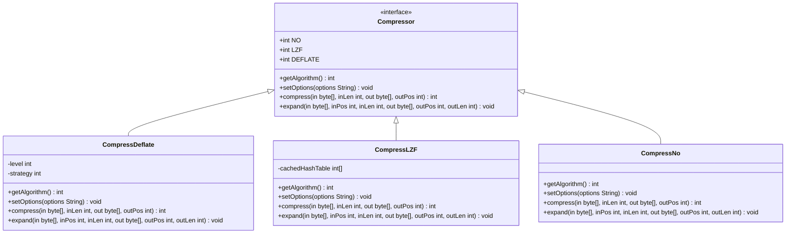
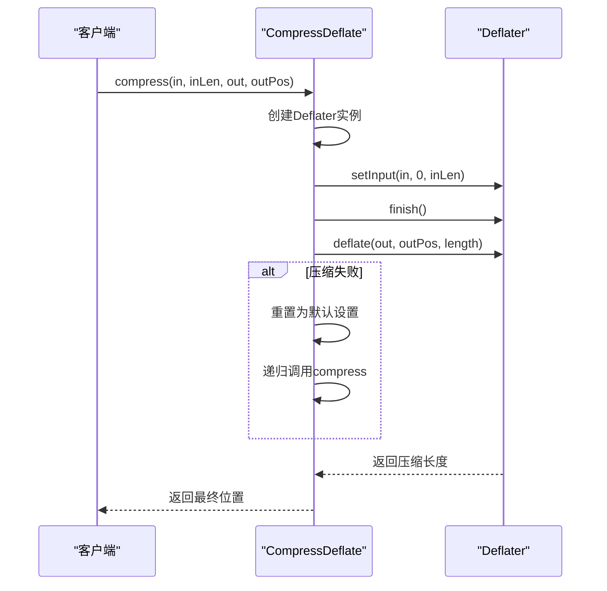
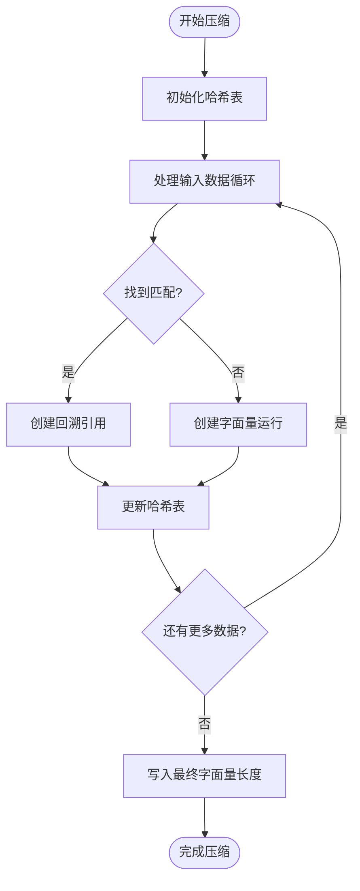
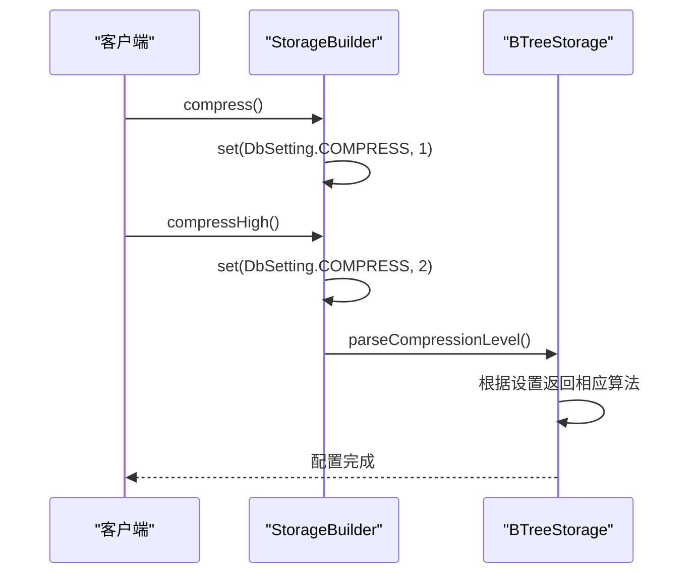
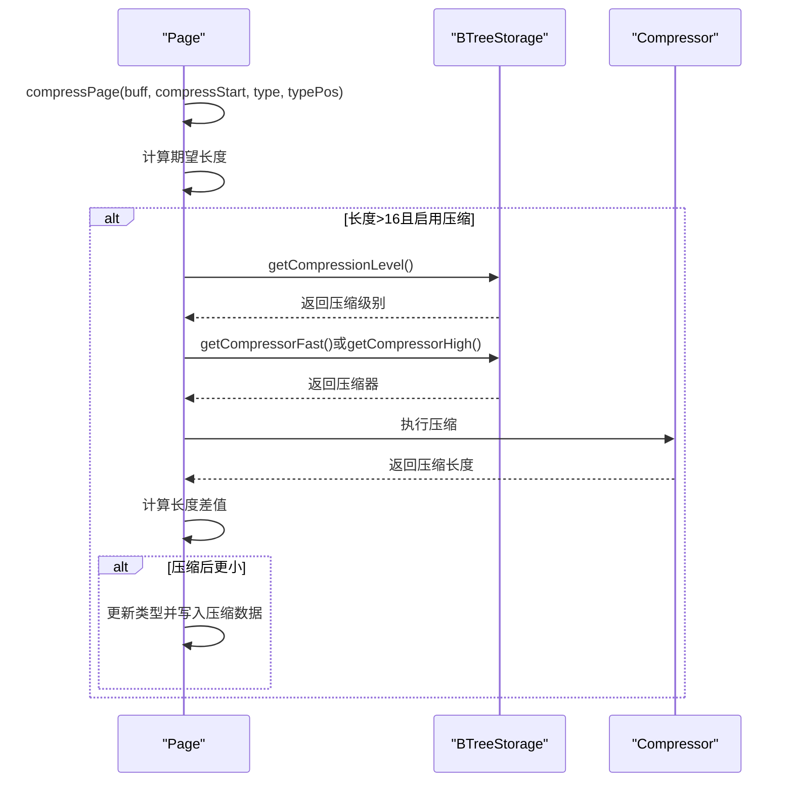
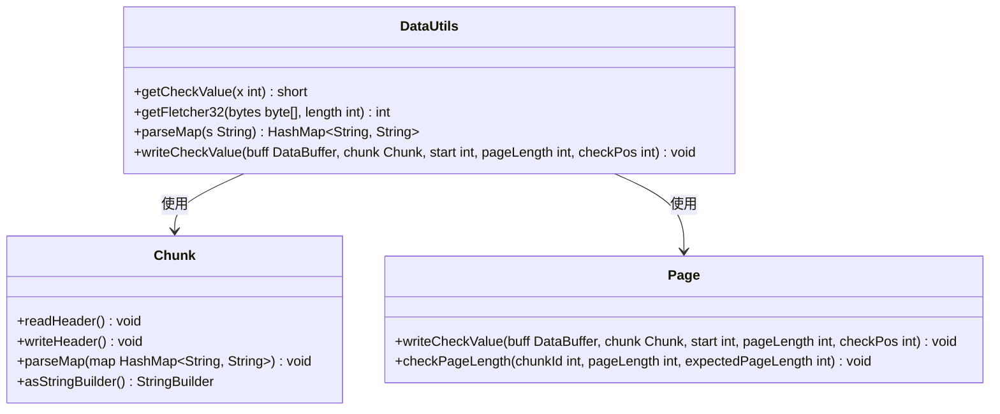

# 压缩算法


**本文档引用的文件**   
- [Compressor.java](https://github.com/lealone/Lealone/blob/master/lealone-common/src/main/java/com/lealone/common/compress/Compressor.java)
- [CompressDeflate.java](https://github.com/lealone/Lealone/blob/master/lealone-common/src/main/java/com/lealone/common/compress/CompressDeflate.java)
- [CompressLZF.java](https://github.com/lealone/Lealone/blob/master/lealone-common/src/main/java/com/lealone/common/compress/CompressLZF.java)
- [CompressNo.java](https://github.com/lealone/Lealone/blob/master/lealone-common/src/main/java/com/lealone/common/compress/CompressNo.java)
- [CompressTool.java](https://github.com/lealone/Lealone/blob/master/lealone-common/src/main/java/com/lealone/common/compress/CompressTool.java)
- [StorageBuilder.java](https://github.com/lealone/Lealone/blob/master/lealone-sci/src/main/java/com/lealone/storage/StorageBuilder.java)
- [BTreeStorage.java](https://github.com/lealone/Lealone/blob/master/lealone-aose/src/main/java/com/lealone/storage/aose/btree/BTreeStorage.java)
- [Page.java](https://github.com/lealone/Lealone/blob/master/lealone-aose/src/main/java/com/lealone/storage/aose/btree/page/Page.java)
- [Chunk.java](https://github.com/lealone/Lealone/blob/master/lealone-aose/src/main/java/com/lealone/storage/aose/btree/chunk/Chunk.java)
- [ChunkManager.java](https://github.com/lealone/Lealone/blob/master/lealone-aose/src/main/java/com/lealone/storage/aose/btree/chunk/ChunkManager.java)
- [DataUtils.java](https://github.com/lealone/Lealone/blob/master/lealone-common/src/main/java/com/lealone/common/util/DataUtils.java)


## 目录
1. [压缩算法概述](#压缩算法概述)
2. [Compressor接口设计](#compressor接口设计)
3. [具体压缩算法实现](#具体压缩算法实现)
   - [Deflate算法](#deflate算法)
   - [LZF算法](#lzf算法)
   - [无压缩模式](#无压缩模式)
4. [性能特点与权衡](#性能特点与权衡)
5. [存储配置中的算法选择](#存储配置中的算法选择)
6. [压缩算法与Chunk结构集成](#压缩算法与chunk结构集成)
7. [压缩数据校验机制](#压缩数据校验机制)
8. [开发者选型建议](#开发者选型建议)

## 压缩算法概述

Lealone数据库系统支持三种压缩算法：Deflate、LZF和无压缩模式。这些算法通过统一的Compressor接口进行管理，为存储引擎提供灵活的数据压缩能力。压缩功能主要应用于B树存储引擎中，通过减少数据在磁盘上的存储空间来提高存储效率。每种算法都有其独特的性能特征和适用场景，开发者可以根据具体需求选择最适合的压缩策略。

**Section sources**
- [Compressor.java](https://github.com/lealone/Lealone/blob/master/lealone-common/src/main/java/com/lealone/common/compress/Compressor.java)

## Compressor接口设计

Compressor接口是Lealone压缩算法的核心抽象，定义了所有压缩算法必须实现的基本操作。该接口在存储引擎中扮演着关键角色，提供了统一的压缩和解压缩API，使得不同算法可以无缝替换。接口包含四个主要方法：getAlgorithm()用于获取算法类型，setOptions()用于设置压缩选项，compress()用于执行压缩操作，expand()用于解压缩数据。



**Diagram sources**
- [Compressor.java](https://github.com/lealone/Lealone/blob/master/lealone-common/src/main/java/com/lealone/common/compress/Compressor.java)
- [CompressDeflate.java](https://github.com/lealone/Lealone/blob/master/lealone-common/src/main/java/com/lealone/common/compress/CompressDeflate.java)
- [CompressLZF.java](https://github.com/lealone/Lealone/blob/master/lealone-common/src/main/java/com/lealone/common/compress/CompressLZF.java)
- [CompressNo.java](https://github.com/lealone/Lealone/blob/master/lealone-common/src/main/java/com/lealone/common/compress/CompressNo.java)

**Section sources**
- [Compressor.java](https://github.com/lealone/Lealone/blob/master/lealone-common/src/main/java/com/lealone/common/compress/Compressor.java)

## 具体压缩算法实现

### Deflate算法

Deflate算法通过CompressDeflate类实现，基于Java内置的Deflater和Inflater类。该算法支持多种压缩选项，包括压缩级别（level）和压缩策略（strategy）。压缩级别范围从-1（默认）到9（最佳压缩），而策略包括默认策略、过滤策略和仅哈夫曼编码策略。Deflate算法在压缩比方面表现优异，通常能节省更多磁盘空间，但相应的CPU开销也更高。



**Diagram sources**
- [CompressDeflate.java](https://github.com/lealone/Lealone/blob/master/lealone-common/src/main/java/com/lealone/common/compress/CompressDeflate.java)

**Section sources**
- [CompressDeflate.java](https://github.com/lealone/Lealone/blob/master/lealone-common/src/main/java/com/lealone/common/compress/CompressDeflate.java)

### LZF算法

LZF算法通过CompressLZF类实现，是一种基于Lempel-Ziv变体的字节对齐压缩算法。该算法优化了速度性能，使用大小为16384的哈希表来匹配字节序列。LZF算法将数据分为字面量运行和回溯引用两种类型，其中字面量直接复制，回溯引用则通过指定偏移量和长度来复制先前的数据。LZF算法在压缩速度和CPU开销方面表现优秀，压缩比约为50%。



**Diagram sources**
- [CompressLZF.java](https://github.com/lealone/Lealone/blob/master/lealone-common/src/main/java/com/lealone/common/compress/CompressLZF.java)

**Section sources**
- [CompressLZF.java](https://github.com/lealone/Lealone/blob/master/lealone-common/src/main/java/com/lealone/common/compress/CompressLZF.java)

### 无压缩模式

无压缩模式通过CompressNo类实现，实际上不执行任何压缩操作。这种模式适用于已经加密、已经压缩或随机的数据，因为这些数据通常难以进一步压缩。无压缩模式的主要优势是零CPU开销和最快的读写速度，但相应的磁盘空间利用率最低。

```mermaid
classDiagram
class CompressNo {
+getAlgorithm() int
+setOptions(options String) void
+compress(in byte[], inLen int, out byte[], outPos int) int
+expand(in byte[], inPos int, inLen int, out byte[], outPos int, outLen int) void
}
CompressNo : : : highlight
style CompressNo fill : #f9f,stroke : #333,stroke-width : 2px
```

**Diagram sources**
- [CompressNo.java](https://github.com/lealone/Lealone/blob/master/lealone-common/src/main/java/com/lealone/common/compress/CompressNo.java)

**Section sources**
- [CompressNo.java](https://github.com/lealone/Lealone/blob/master/lealone-common/src/main/java/com/lealone/common/compress/CompressNo.java)

## 性能特点与权衡

三种压缩算法在压缩比、压缩速度和CPU开销方面各有特点，形成了明显的性能权衡。Deflate算法提供最高的压缩比，通常能节省60-70%的磁盘空间，但压缩和解压缩速度最慢，CPU开销最高。LZF算法在压缩比（约50%）和速度之间取得了良好平衡，压缩速度比Deflate快3-5倍，CPU开销适中。无压缩模式虽然不节省磁盘空间，但提供了最快的读写速度和最低的CPU开销。

| 算法 | 压缩比 | 压缩速度 | CPU开销 | 适用场景 |
|------|--------|----------|---------|----------|
| Deflate | 高 (60-70%) | 慢 | 高 | 存储空间受限 |
| LZF | 中 (约50%) | 快 | 中 | 通用场景 |
| 无压缩 | 无 | 最快 | 无 | 高吞吐写入 |

**Section sources**
- [CompressDeflate.java](https://github.com/lealone/Lealone/blob/master/lealone-common/src/main/java/com/lealone/common/compress/CompressDeflate.java)
- [CompressLZF.java](https://github.com/lealone/Lealone/blob/master/lealone-common/src/main/java/com/lealone/common/compress/CompressLZF.java)
- [CompressNo.java](https://github.com/lealone/Lealone/blob/master/lealone-common/src/main/java/com/lealone/common/compress/CompressNo.java)

## 存储配置中的算法选择

在Lealone中，可以通过StorageBuilder类的API来选择和切换压缩算法。提供了两种便捷的方法：compress()用于启用LZF压缩，compressHigh()用于启用Deflate压缩。这些设置仅影响写入操作，读取时无需启用压缩，即使写入时启用了压缩。



**Diagram sources**
- [StorageBuilder.java](https://github.com/lealone/Lealone/blob/master/lealone-sci/src/main/java/com/lealone/storage/StorageBuilder.java)
- [BTreeStorage.java](https://github.com/lealone/Lealone/blob/master/lealone-aose/src/main/java/com/lealone/storage/aose/btree/BTreeStorage.java)

**Section sources**
- [StorageBuilder.java](https://github.com/lealone/Lealone/blob/master/lealone-sci/src/main/java/com/lealone/storage/StorageBuilder.java)
- [BTreeStorage.java](https://github.com/lealone/Lealone/blob/master/lealone-aose/src/main/java/com/lealone/storage/aose/btree/BTreeStorage.java)

## 压缩算法与Chunk结构集成

压缩算法与Chunk结构的集成主要通过Page类的compressPage方法实现。当页面数据长度超过16字节且启用了压缩时，系统会根据配置的压缩级别选择相应的压缩器。压缩后的数据会包含长度差值的可变整数编码，只有当压缩后数据确实更小时才会使用压缩数据。这种集成方式确保了压缩只在真正有益时才应用。



**Diagram sources**
- [Page.java](https://github.com/lealone/Lealone/blob/master/lealone-aose/src/main/java/com/lealone/storage/aose/btree/page/Page.java)
- [BTreeStorage.java](https://github.com/lealone/Lealone/blob/master/lealone-aose/src/main/java/com/lealone/storage/aose/btree/BTreeStorage.java)

**Section sources**
- [Page.java](https://github.com/lealone/Lealone/blob/master/lealone-aose/src/main/java/com/lealone/storage/aose/btree/page/Page.java)
- [BTreeStorage.java](https://github.com/lealone/Lealone/blob/master/lealone-aose/src/main/java/com/lealone/storage/aose/btree/BTreeStorage.java)

## 压缩数据校验机制

Lealone使用多种校验机制确保压缩数据的完整性。在Chunk级别，使用Fletcher32校验和来验证Chunk头的完整性。在页面级别，使用基于Chunk ID、偏移量和页面长度的异或校验值。这些校验机制在数据读取时自动验证，如果发现校验失败，会抛出文件损坏异常。



**Diagram sources**
- [DataUtils.java](https://github.com/lealone/Lealone/blob/master/lealone-common/src/main/java/com/lealone/common/util/DataUtils.java)
- [Chunk.java](https://github.com/lealone/Lealone/blob/master/lealone-aose/src/main/java/com/lealone/storage/aose/btree/chunk/Chunk.java)
- [Page.java](https://github.com/lealone/Lealone/blob/master/lealone-aose/src/main/java/com/lealone/storage/aose/btree/page/Page.java)

**Section sources**
- [DataUtils.java](https://github.com/lealone/Lealone/blob/master/lealone-common/src/main/java/com/lealone/common/util/DataUtils.java)
- [Chunk.java](https://github.com/lealone/Lealone/blob/master/lealone-aose/src/main/java/com/lealone/storage/aose/btree/chunk/Chunk.java)
- [Page.java](https://github.com/lealone/Lealone/blob/master/lealone-aose/src/main/java/com/lealone/storage/aose/btree/page/Page.java)

## 开发者选型建议

对于高吞吐写入场景，建议使用LZF算法或无压缩模式。LZF算法在提供约50%压缩比的同时，保持了较高的压缩速度和较低的CPU开销，适合大多数通用场景。对于低延迟读取场景，如果数据访问模式主要是随机读取，建议使用LZF算法，因为它在解压缩速度方面表现优秀。如果存储空间是主要限制因素，可以考虑使用Deflate算法，尽管这会牺牲一定的读写性能。

**Section sources**
- [CompressDeflate.java](https://github.com/lealone/Lealone/blob/master/lealone-common/src/main/java/com/lealone/common/compress/CompressDeflate.java)
- [CompressLZF.java](https://github.com/lealone/Lealone/blob/master/lealone-common/src/main/java/com/lealone/common/compress/CompressLZF.java)
- [CompressNo.java](https://github.com/lealone/Lealone/blob/master/lealone-common/src/main/java/com/lealone/common/compress/CompressNo.java)