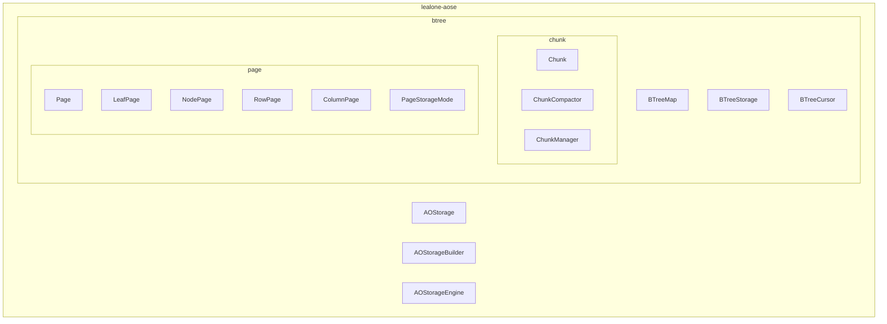
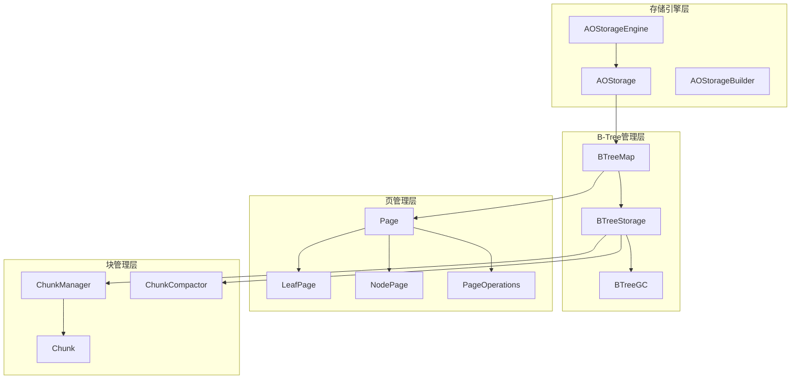
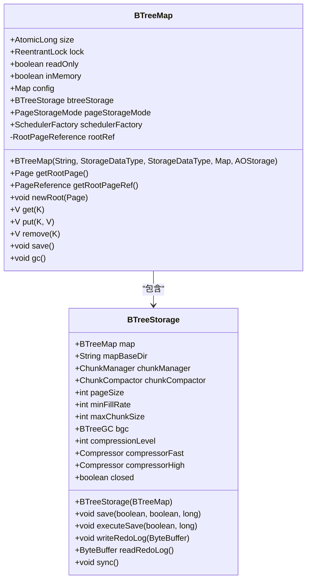
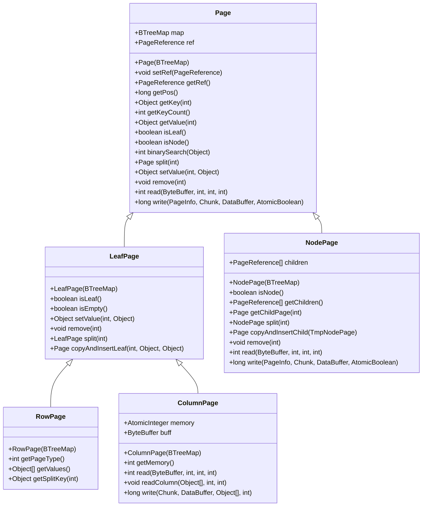
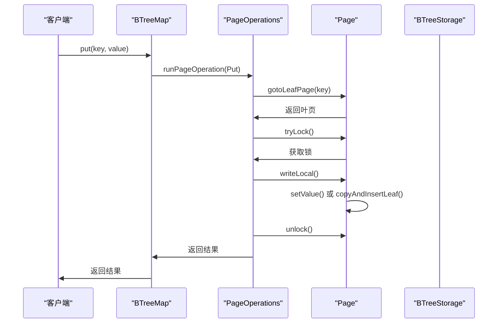
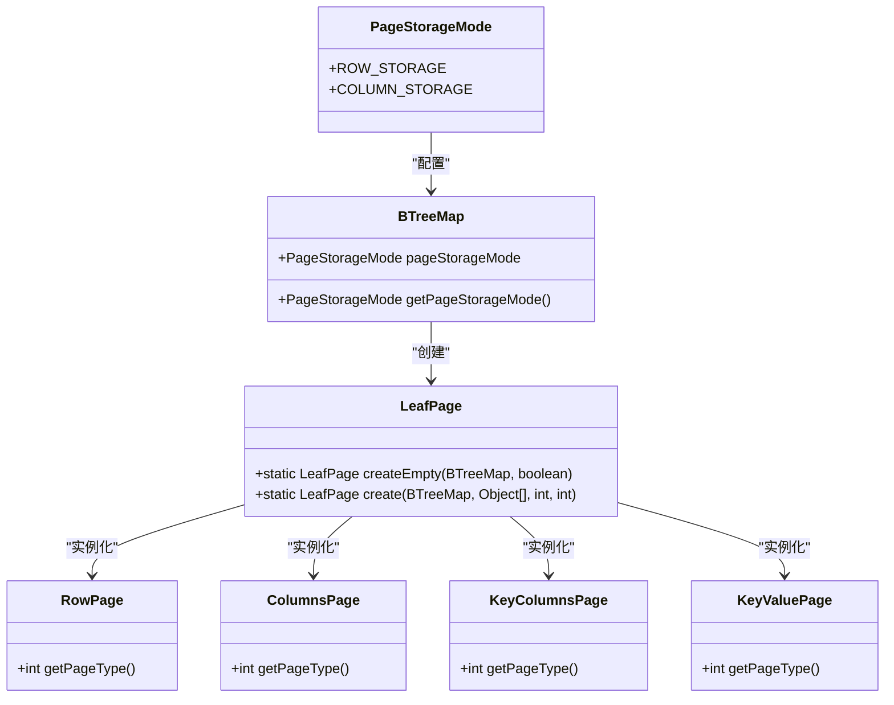
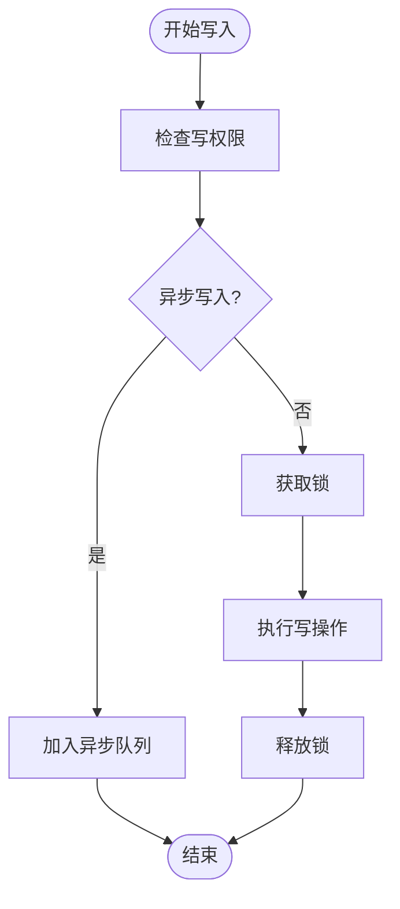
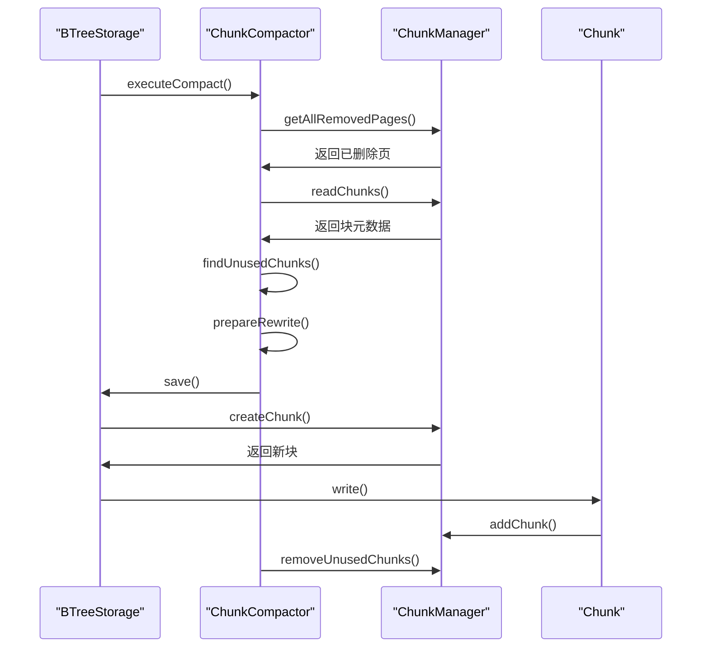
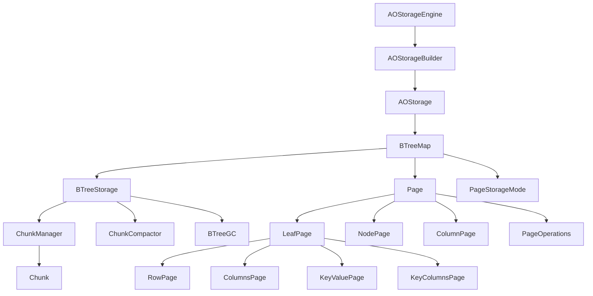

# 存储引擎架构

<cite>
**本文档引用的文件**   
- [AOStorageEngine.java](file://lealone-aose/src/main/java/com/lealone/storage/aose/AOStorageEngine.java)
- [BTreeStorage.java](file://lealone-aose/src/main/java/com/lealone/storage/aose/btree/BTreeStorage.java)
- [BTreeMap.java](file://lealone-aose/src/main/java/com/lealone/storage/aose/btree/BTreeMap.java)
- [PageStorageMode.java](file://lealone-aose/src/main/java/com/lealone/storage/aose/btree/page/PageStorageMode.java)
- [ChunkCompactor.java](file://lealone-aose/src/main/java/com/lealone/storage/aose/btree/chunk/ChunkCompactor.java)
- [Page.java](file://lealone-aose/src/main/java/com/lealone/storage/aose/btree/page/Page.java)
- [LeafPage.java](file://lealone-aose/src/main/java/com/lealone/storage/aose/btree/page/LeafPage.java)
- [NodePage.java](file://lealone-aose/src/main/java/com/lealone/storage/aose/btree/page/NodePage.java)
- [RowPage.java](file://lealone-aose/src/main/java/com/lealone/storage/aose/btree/page/RowPage.java)
- [ColumnPage.java](file://lealone-aose/src/main/java/com/lealone/storage/aose/btree/page/ColumnPage.java)
- [PageOperations.java](file://lealone-aose/src/main/java/com/lealone/storage/aose/btree/page/PageOperations.java)
- [Chunk.java](file://lealone-aose/src/main/java/com/lealone/storage/aose/btree/chunk/Chunk.java)
- [AOStorage.java](file://lealone-aose/src/main/java/com/lealone/storage/aose/AOStorage.java)
- [AOStorageBuilder.java](file://lealone-aose/src/main/java/com/lealone/storage/aose/AOStorageBuilder.java)
</cite>

## 目录
1. [引言](#引言)
2. [项目结构](#项目结构)
3. [核心组件](#核心组件)
4. [架构概述](#架构概述)
5. [详细组件分析](#详细组件分析)
6. [依赖分析](#依赖分析)
7. [性能考虑](#性能考虑)
8. [故障排除指南](#故障排除指南)
9. [结论](#结论)

## 引言
AOSE异步化存储引擎是Lealone数据库系统中的核心存储组件，采用基于B-Tree的存储结构设计，支持行列混合存储模式和异步化写入。该存储引擎通过插件化接口与核心系统集成，提供了高并发写入场景下的性能优势。

## 项目结构
AOSE存储引擎的项目结构清晰地组织了其核心功能模块，包括B-Tree存储结构、页管理、块压缩等关键组件。

**图表来源**
- [BTreeStorage.java](file://lealone-aose/src/main/java/com/lealone/storage/aose/btree/BTreeStorage.java)
- [BTreeMap.java](file://lealone-aose/src/main/java/com/lealone/storage/aose/btree/BTreeMap.java)
- [Page.java](file://lealone-aose/src/main/java/com/lealone/storage/aose/btree/page/Page.java)
- [Chunk.java](file://lealone-aose/src/main/java/com/lealone/storage/aose/btree/chunk/Chunk.java)

**章节来源**
- [BTreeStorage.java](file://lealone-aose/src/main/java/com/lealone/storage/aose/btree/BTreeStorage.java)
- [BTreeMap.java](file://lealone-aose/src/main/java/com/lealone/storage/aose/btree/BTreeMap.java)

## 核心组件
AOSE存储引擎的核心组件包括BTreeStorage、BTreeMap、页管理组件和块压缩组件，这些组件共同实现了高效的数据存储和访问机制。

**章节来源**
- [BTreeStorage.java](file://lealone-aose/src/main/java/com/lealone/storage/aose/btree/BTreeStorage.java#L35-L415)
- [BTreeMap.java](file://lealone-aose/src/main/java/com/lealone/storage/aose/btree/BTreeMap.java#L55-L753)

## 架构概述
AOSE存储引擎采用分层架构设计，从上到下分为存储引擎层、B-Tree管理层、页管理层和块管理层。这种分层设计使得各组件职责清晰，便于维护和扩展。

**图表来源**
- [AOStorageEngine.java](file://lealone-aose/src/main/java/com/lealone/storage/aose/AOStorageEngine.java)
- [AOStorage.java](file://lealone-aose/src/main/java/com/lealone/storage/aose/AOStorage.java)
- [BTreeMap.java](file://lealone-aose/src/main/java/com/lealone/storage/aose/btree/BTreeMap.java)
- [BTreeStorage.java](file://lealone-aose/src/main/java/com/lealone/storage/aose/btree/BTreeStorage.java)
- [Page.java](file://lealone-aose/src/main/java/com/lealone/storage/aose/btree/page/Page.java)
- [Chunk.java](file://lealone-aose/src/main/java/com/lealone/storage/aose/btree/chunk/Chunk.java)

## 详细组件分析

### B-Tree存储结构分析
AOSE存储引擎基于B-Tree数据结构实现，通过BTreeMap和BTreeStorage两个核心类来管理数据的存储和访问。

#### BTreeMap类分析
BTreeMap是B-Tree的主要实现类，负责管理B-Tree的逻辑结构和提供数据访问接口。

**图表来源**
- [BTreeMap.java](file://lealone-aose/src/main/java/com/lealone/storage/aose/btree/BTreeMap.java#L55-L753)
- [BTreeStorage.java](file://lealone-aose/src/main/java/com/lealone/storage/aose/btree/BTreeStorage.java#L35-L415)

**章节来源**
- [BTreeMap.java](file://lealone-aose/src/main/java/com/lealone/storage/aose/btree/BTreeMap.java#L55-L753)

#### BTreeStorage类分析
BTreeStorage是B-Tree的持久化存储管理类，负责将B-Tree结构持久化到磁盘，并管理块的读写操作。

**章节来源**
- [BTreeStorage.java](file://lealone-aose/src/main/java/com/lealone/storage/aose/btree/BTreeStorage.java#L35-L415)

### 页管理机制分析
AOSE存储引擎的页管理机制是其高性能的关键，通过多种页类型和高效的页操作来实现数据的快速访问。

#### 页类型分析
AOSE存储引擎定义了多种页类型，包括叶页、节点页和列页，每种页类型都有特定的用途和结构。

**图表来源**
- [Page.java](file://lealone-aose/src/main/java/com/lealone/storage/aose/btree/page/Page.java#L20-L378)
- [LeafPage.java](file://lealone-aose/src/main/java/com/lealone/storage/aose/btree/page/LeafPage.java#L19-L260)
- [NodePage.java](file://lealone-aose/src/main/java/com/lealone/storage/aose/btree/page/NodePage.java#L19-L279)
- [RowPage.java](file://lealone-aose/src/main/java/com/lealone/storage/aose/btree/page/RowPage.java#L14-L74)
- [ColumnPage.java](file://lealone-aose/src/main/java/com/lealone/storage/aose/btree/page/ColumnPage.java#L17-L94)

**章节来源**
- [Page.java](file://lealone-aose/src/main/java/com/lealone/storage/aose/btree/page/Page.java#L20-L378)

#### 页操作流程分析
AOSE存储引擎的页操作流程包括读取、写入、分割和合并等操作，这些操作通过PageOperations类来实现。

**图表来源**
- [BTreeMap.java](file://lealone-aose/src/main/java/com/lealone/storage/aose/btree/BTreeMap.java#L55-L753)
- [PageOperations.java](file://lealone-aose/src/main/java/com/lealone/storage/aose/btree/page/PageOperations.java#L20-L521)

**章节来源**
- [PageOperations.java](file://lealone-aose/src/main/java/com/lealone/storage/aose/btree/page/PageOperations.java#L20-L521)

### 行列混合存储模式分析
AOSE存储引擎支持行列混合存储模式，通过PageStorageMode枚举来定义不同的存储模式。

#### 存储模式定义

**图表来源**
- [PageStorageMode.java](file://lealone-aose/src/main/java/com/lealone/storage/aose/btree/page/PageStorageMode.java#L8-L13)
- [BTreeMap.java](file://lealone-aose/src/main/java/com/lealone/storage/aose/btree/BTreeMap.java#L55-L753)
- [LeafPage.java](file://lealone-aose/src/main/java/com/lealone/storage/aose/btree/page/LeafPage.java#L19-L260)

**章节来源**
- [PageStorageMode.java](file://lealone-aose/src/main/java/com/lealone/storage/aose/btree/page/PageStorageMode.java#L8-L13)

### 异步化写入和压缩分析
AOSE存储引擎通过异步化写入和块压缩来提高写入性能和存储效率。

#### 写入流程分析

**图表来源**
- [BTreeMap.java](file://lealone-aose/src/main/java/com/lealone/storage/aose/btree/BTreeMap.java#L55-L753)
- [PageOperations.java](file://lealone-aose/src/main/java/com/lealone/storage/aose/btree/page/PageOperations.java#L20-L521)

**章节来源**
- [BTreeMap.java](file://lealone-aose/src/main/java/com/lealone/storage/aose/btree/BTreeMap.java#L55-L753)

#### 块压缩流程分析

**图表来源**
- [BTreeStorage.java](file://lealone-aose/src/main/java/com/lealone/storage/aose/btree/BTreeStorage.java#L35-L415)
- [ChunkCompactor.java](file://lealone-aose/src/main/java/com/lealone/storage/aose/btree/chunk/ChunkCompactor.java#L24-L169)
- [ChunkManager.java](file://lealone-aose/src/main/java/com/lealone/storage/aose/btree/chunk/ChunkManager.java)

**章节来源**
- [ChunkCompactor.java](file://lealone-aose/src/main/java/com/lealone/storage/aose/btree/chunk/ChunkCompactor.java#L24-L169)

## 依赖分析
AOSE存储引擎的组件之间存在复杂的依赖关系，这些依赖关系确保了系统的稳定性和性能。

**图表来源**
- [AOStorageEngine.java](file://lealone-aose/src/main/java/com/lealone/storage/aose/AOStorageEngine.java)
- [AOStorageBuilder.java](file://lealone-aose/src/main/java/com/lealone/storage/aose/AOStorageBuilder.java)
- [AOStorage.java](file://lealone-aose/src/main/java/com/lealone/storage/aose/AOStorage.java)
- [BTreeMap.java](file://lealone-aose/src/main/java/com/lealone/storage/aose/btree/BTreeMap.java)
- [BTreeStorage.java](file://lealone-aose/src/main/java/com/lealone/storage/aose/btree/BTreeStorage.java)
- [Page.java](file://lealone-aose/src/main/java/com/lealone/storage/aose/btree/page/Page.java)
- [Chunk.java](file://lealone-aose/src/main/java/com/lealone/storage/aose/btree/chunk/Chunk.java)

**章节来源**
- [AOStorageEngine.java](file://lealone-aose/src/main/java/com/lealone/storage/aose/AOStorageEngine.java#L15-L33)
- [AOStorageBuilder.java](file://lealone-aose/src/main/java/com/lealone/storage/aose/AOStorageBuilder.java#L17-L65)
- [AOStorage.java](file://lealone-aose/src/main/java/com/lealone/storage/aose/AOStorage.java#L26-L104)

## 性能考虑
AOSE存储引擎在高并发写入场景下表现出色，主要得益于其异步化写入、块压缩和行列混合存储模式。

**章节来源**
- [BTreeMap.java](file://lealone-aose/src/main/java/com/lealone/storage/aose/btree/BTreeMap.java#L55-L753)
- [BTreeStorage.java](file://lealone-aose/src/main/java/com/lealone/storage/aose/btree/BTreeStorage.java#L35-L415)

## 故障排除指南
当遇到存储引擎相关问题时，可以参考以下常见问题的解决方案。

**章节来源**
- [BTreeMap.java](file://lealone-aose/src/main/java/com/lealone/storage/aose/btree/BTreeMap.java#L55-L753)
- [BTreeStorage.java](file://lealone-aose/src/main/java/com/lealone/storage/aose/btree/BTreeStorage.java#L35-L415)

## 结论
AOSE异步化存储引擎通过基于B-Tree的存储结构设计、高效的页管理机制、行列混合存储模式和异步化写入，为Lealone数据库系统提供了高性能的数据存储解决方案。其插件化接口设计使得存储引擎易于集成和扩展，适用于各种高并发写入场景。