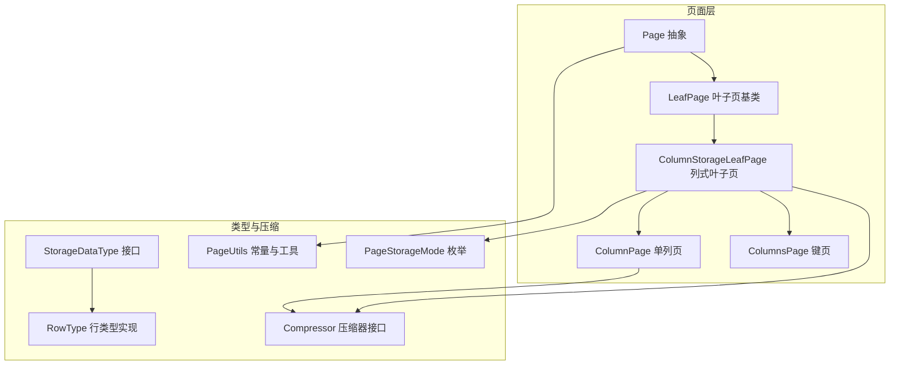
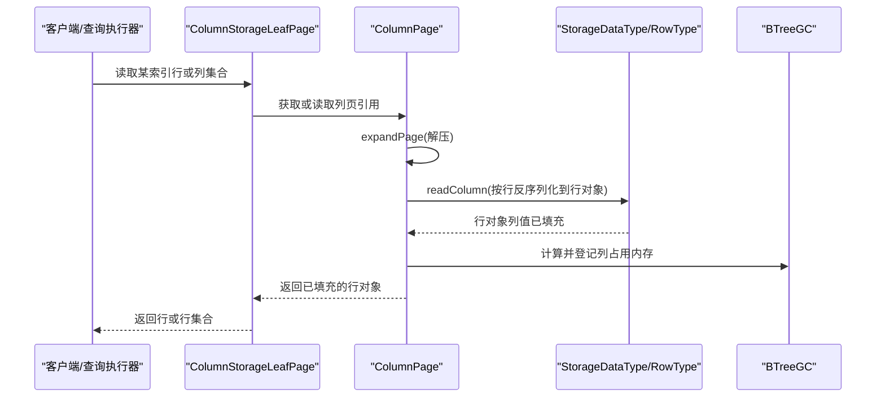
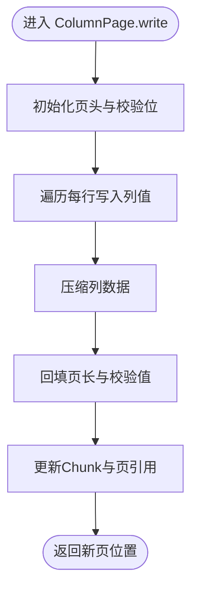
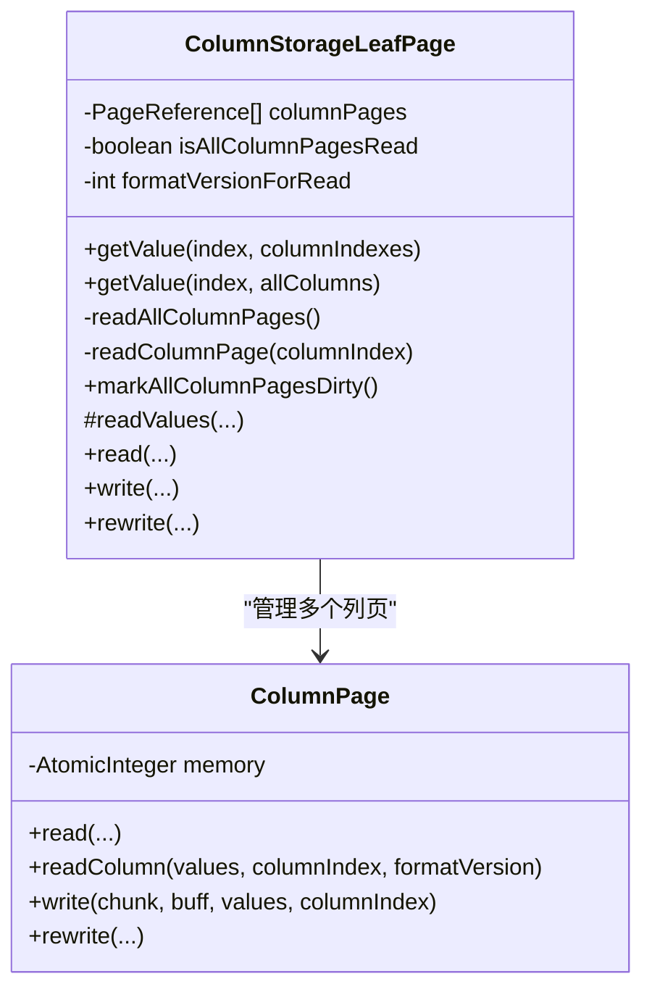
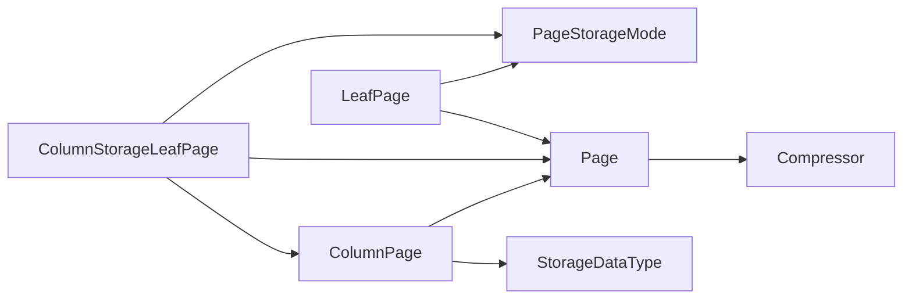

# 列式存储实现

<cite>
**本文引用的文件列表**
- [ColumnPage.java](https://github.com/lealone/Lealone/blob/master/lealone-aose/src/main/java/com/lealone/storage/aose/btree/page/ColumnPage.java)
- [ColumnStorageLeafPage.java](https://github.com/lealone/Lealone/blob/master/lealone-aose/src/main/java/com/lealone/storage/aose/btree/page/ColumnStorageLeafPage.java)
- [ColumnsPage.java](https://github.com/lealone/Lealone/blob/master/lealone-aose/src/main/java/com/lealone/storage/aose/btree/page/ColumnsPage.java)
- [LeafPage.java](https://github.com/lealone/Lealone/blob/master/lealone-aose/src/main/java/com/lealone/storage/aose/btree/page/LeafPage.java)
- [Page.java](https://github.com/lealone/Lealone/blob/master/lealone-aose/src/main/java/com/lealone/storage/aose/btree/page/Page.java)
- [PageStorageMode.java](https://github.com/lealone/Lealone/blob/master/lealone-aose/src/main/java/com/lealone/storage/aose/btree/page/PageStorageMode.java)
- [PageUtils.java](https://github.com/lealone/Lealone/blob/master/lealone-aose/src/main/java/com/lealone/storage/aose/btree/page/PageUtils.java)
- [StorageDataType.java](https://github.com/lealone/Lealone/blob/master/lealone-sci/src/main/java/com/lealone/storage/type/StorageDataType.java)
- [RowType.java](https://github.com/lealone/Lealone/blob/master/lealone-db/src/main/java/com/lealone/db/row/RowType.java)
- [Compressor.java](https://github.com/lealone/Lealone/blob/master/lealone-common/src/main/java/com/lealone/common/compress/Compressor.java)
- [PageStorageModeTest.java](https://github.com/lealone/Lealone/blob/master/lealone-test/src/test/java/com/lealone/test/aose/PageStorageModeTest.java)
- [PageStorageModeSqlTest.java](https://github.com/lealone/Lealone/blob/master/lealone-test/src/test/java/com/lealone/test/aose/PageStorageModeSqlTest.java)
- [CompactTest.java](https://github.com/lealone/Lealone/blob/master/lealone-test/src/test/java/com/lealone/test/aose/CompactTest.java)
- [BuiltInAggregate.java](https://github.com/lealone/Lealone/blob/master/lealone-sql/src/main/java/com/lealone/sql/expression/aggregate/BuiltInAggregate.java)
- [YieldableSelect.java](https://github.com/lealone/Lealone/blob/master/lealone-sql/src/main/java/com/lealone/sql/query/YieldableSelect.java)
</cite>

## 目录
1. [引言](#引言)
2. [项目结构](#项目结构)
3. [核心组件](#核心组件)
4. [架构总览](#架构总览)
5. [详细组件分析](#详细组件分析)
6. [依赖关系分析](#依赖关系分析)
7. [性能考量](#性能考量)
8. [故障排查指南](#故障排查指南)
9. [结论](#结论)
10. [附录](#附录)

## 引言
本文件围绕 ColumnPage 类及其相关组件，系统性解析列式存储在 Lealone 中的实现细节，重点覆盖：
- 列式存储的数据结构设计与内存布局优化
- 压缩算法的应用与选择策略
- 多列数据块的管理方式与延迟解码机制
- 高效的列数据读取与写入流程
- OLAP 查询（尤其是聚合与范围扫描）场景下的性能优势
- 性能测试与对比（列式 vs 行式）的方法与建议

## 项目结构
列式存储实现位于 AOSE（AO Storage Engine）模块的 B-Tree 页面层，核心文件如下：
- ColumnPage：单列数据页，负责列数据的序列化、压缩与延迟反序列化
- ColumnStorageLeafPage：列式叶子页，组织键、元数据与多个 ColumnPage 的引用
- ColumnsPage：仅存储键的列式页面，用于特定模式
- LeafPage：叶子页基类，提供分裂、插入、内存重算等通用能力
- Page：页面抽象与通用工具（压缩、校验、位置更新）
- PageStorageMode：页面存储模式枚举（ROW_STORAGE/COLUMN_STORAGE）
- StorageDataType/RowType：列式序列化接口与行类型实现
- Compressor：压缩器接口（LZF/DEFLATE/无压缩）

图表来源
- [Page.java](https://github.com/lealone/Lealone/blob/master/lealone-aose/src/main/java/com/lealone/storage/aose/btree/page/Page.java#L1-L120)
- [LeafPage.java](https://github.com/lealone/Lealone/blob/master/lealone-aose/src/main/java/com/lealone/storage/aose/btree/page/LeafPage.java#L1-L120)
- [ColumnPage.java](https://github.com/lealone/Lealone/blob/master/lealone-aose/src/main/java/com/lealone/storage/aose/btree/page/ColumnPage.java#L1-L94)
- [ColumnStorageLeafPage.java](https://github.com/lealone/Lealone/blob/master/lealone-aose/src/main/java/com/lealone/storage/aose/btree/page/ColumnStorageLeafPage.java#L1-L120)
- [ColumnsPage.java](https://github.com/lealone/Lealone/blob/master/lealone-aose/src/main/java/com/lealone/storage/aose/btree/page/ColumnsPage.java#L1-L63)
- [StorageDataType.java](https://github.com/lealone/Lealone/blob/master/lealone-sci/src/main/java/com/lealone/storage/type/StorageDataType.java#L1-L49)
- [RowType.java](https://github.com/lealone/Lealone/blob/master/lealone-db/src/main/java/com/lealone/db/row/RowType.java#L140-L171)
- [Compressor.java](https://github.com/lealone/Lealone/blob/master/lealone-common/src/main/java/com/lealone/common/compress/Compressor.java#L1-L66)
- [PageUtils.java](https://github.com/lealone/Lealone/blob/master/lealone-aose/src/main/java/com/lealone/storage/aose/btree/page/PageUtils.java#L1-L57)
- [PageStorageMode.java](https://github.com/lealone/Lealone/blob/master/lealone-aose/src/main/java/com/lealone/storage/aose/btree/page/PageStorageMode.java#L1-L12)

章节来源
- [Page.java](https://github.com/lealone/Lealone/blob/master/lealone-aose/src/main/java/com/lealone/storage/aose/btree/page/Page.java#L1-L120)
- [LeafPage.java](https://github.com/lealone/Lealone/blob/master/lealone-aose/src/main/java/com/lealone/storage/aose/btree/page/LeafPage.java#L1-L120)
- [ColumnPage.java](https://github.com/lealone/Lealone/blob/master/lealone-aose/src/main/java/com/lealone/storage/aose/btree/page/ColumnPage.java#L1-L94)
- [ColumnStorageLeafPage.java](https://github.com/lealone/Lealone/blob/master/lealone-aose/src/main/java/com/lealone/storage/aose/btree/page/ColumnStorageLeafPage.java#L1-L120)
- [ColumnsPage.java](https://github.com/lealone/Lealone/blob/master/lealone-aose/src/main/java/com/lealone/storage/aose/btree/page/ColumnsPage.java#L1-L63)
- [StorageDataType.java](https://github.com/lealone/Lealone/blob/master/lealone-sci/src/main/java/com/lealone/storage/type/StorageDataType.java#L1-L49)
- [RowType.java](https://github.com/lealone/Lealone/blob/master/lealone-db/src/main/java/com/lealone/db/row/RowType.java#L140-L171)
- [Compressor.java](https://github.com/lealone/Lealone/blob/master/lealone-common/src/main/java/com/lealone/common/compress/Compressor.java#L1-L66)
- [PageUtils.java](https://github.com/lealone/Lealone/blob/master/lealone-aose/src/main/java/com/lealone/storage/aose/btree/page/PageUtils.java#L1-L57)
- [PageStorageMode.java](https://github.com/lealone/Lealone/blob/master/lealone-aose/src/main/java/com/lealone/storage/aose/btree/page/PageStorageMode.java#L1-L12)

## 核心组件
- ColumnPage：单列数据页，负责列数据的写入、压缩与延迟反序列化；读取时先解压，再按需逐行反序列化到目标行对象
- ColumnStorageLeafPage：列式叶子页，持有键数组、元数据与多个 ColumnPage 的引用；支持按需读取列页、延迟加载与全量刷新
- ColumnsPage：仅存储键的列式页面，键内存由值类型计算，适合键过滤场景
- LeafPage：提供分裂、插入、内存重算、重写等通用能力
- Page：提供压缩/解压、校验值计算、页长度检查、位置更新等通用工具
- StorageDataType/RowType：定义列式序列化/反序列化接口与行类型实现，支持按列读写
- PageStorageMode：控制页面存储模式（ROW_STORAGE/COLUMN_STORAGE），影响页面创建与重写逻辑

章节来源
- [ColumnPage.java](https://github.com/lealone/Lealone/blob/master/lealone-aose/src/main/java/com/lealone/storage/aose/btree/page/ColumnPage.java#L1-L94)
- [ColumnStorageLeafPage.java](https://github.com/lealone/Lealone/blob/master/lealone-aose/src/main/java/com/lealone/storage/aose/btree/page/ColumnStorageLeafPage.java#L1-L120)
- [ColumnsPage.java](https://github.com/lealone/Lealone/blob/master/lealone-aose/src/main/java/com/lealone/storage/aose/btree/page/ColumnsPage.java#L1-L63)
- [LeafPage.java](https://github.com/lealone/Lealone/blob/master/lealone-aose/src/main/java/com/lealone/storage/aose/btree/page/LeafPage.java#L1-L120)
- [Page.java](https://github.com/lealone/Lealone/blob/master/lealone-aose/src/main/java/com/lealone/storage/aose/btree/page/Page.java#L286-L378)
- [StorageDataType.java](https://github.com/lealone/Lealone/blob/master/lealone-sci/src/main/java/com/lealone/storage/type/StorageDataType.java#L1-L49)
- [RowType.java](https://github.com/lealone/Lealone/blob/master/lealone-db/src/main/java/com/lealone/db/row/RowType.java#L140-L171)
- [PageStorageMode.java](https://github.com/lealone/Lealone/blob/master/lealone-aose/src/main/java/com/lealone/storage/aose/btree/page/PageStorageMode.java#L1-L12)

## 架构总览
列式存储通过“键页 + 多列页”的组合实现，键页保存键数组与元数据，每列独立存储在一个 ColumnPage 中。读取时采用延迟解码策略：先解压键页，再按需读取指定列页，逐行反序列化到行对象，避免一次性解码整页行数据。

图表来源
- [ColumnStorageLeafPage.java](https://github.com/lealone/Lealone/blob/master/lealone-aose/src/main/java/com/lealone/storage/aose/btree/page/ColumnStorageLeafPage.java#L68-L126)
- [ColumnPage.java](https://github.com/lealone/Lealone/blob/master/lealone-aose/src/main/java/com/lealone/storage/aose/btree/page/ColumnPage.java#L31-L92)
- [RowType.java](https://github.com/lealone/Lealone/blob/master/lealone-db/src/main/java/com/lealone/db/row/RowType.java#L154-L171)
- [Page.java](https://github.com/lealone/Lealone/blob/master/lealone-aose/src/main/java/com/lealone/storage/aose/btree/page/Page.java#L336-L378)

## 详细组件分析

### ColumnPage 组件分析
- 数据结构与内存布局
  - 按列连续存储，减少随机访问带来的缓存抖动
  - 采用延迟解码：键页解压后，列页按需解压并逐行反序列化
  - 使用原子内存计数与 BTreeGC 进行增量内存统计，避免重复统计
- 压缩与解压
  - 写入时对列数据进行压缩（根据存储配置选择快速/高压缩级别）
  - 读取时先解压，再按行反序列化
- 读取流程
  - read 方法完成页头解析与解压
  - readColumn 方法在多线程安全下对每行调用 StorageDataType.readColumn
- 写入流程
  - write 方法按列顺序写入，完成后统一压缩并回填页长与校验值
  - 重写支持仅更新校验值，避免不必要的重写

图表来源
- [ColumnPage.java](https://github.com/lealone/Lealone/blob/master/lealone-aose/src/main/java/com/lealone/storage/aose/btree/page/ColumnPage.java#L61-L92)
- [Page.java](https://github.com/lealone/Lealone/blob/master/lealone-aose/src/main/java/com/lealone/storage/aose/btree/page/Page.java#L308-L378)

章节来源
- [ColumnPage.java](https://github.com/lealone/Lealone/blob/master/lealone-aose/src/main/java/com/lealone/storage/aose/btree/page/ColumnPage.java#L1-L94)
- [Page.java](https://github.com/lealone/Lealone/blob/master/lealone-aose/src/main/java/com/lealone/storage/aose/btree/page/Page.java#L308-L378)

### ColumnStorageLeafPage 组件分析
- 多列页管理
  - 持有多个 ColumnPage 的引用数组，按列索引访问
  - 支持按需读取（仅读取所需列）与全量读取（isAllColumnPagesRead 标记）
  - 读取时延迟加载列页，首次访问时才触发列页读取与反序列化
- 写入流程
  - 先写键与元数据，再为每列创建 ColumnPage 并写入对应列数据
  - 最终回填每个列页的位置，便于后续重写与定位
- 重写流程
  - 重写键页时同步更新每个列页的新位置，保证一致性

图表来源
- [ColumnStorageLeafPage.java](https://github.com/lealone/Lealone/blob/master/lealone-aose/src/main/java/com/lealone/storage/aose/btree/page/ColumnStorageLeafPage.java#L1-L220)
- [ColumnPage.java](https://github.com/lealone/Lealone/blob/master/lealone-aose/src/main/java/com/lealone/storage/aose/btree/page/ColumnPage.java#L1-L94)

章节来源
- [ColumnStorageLeafPage.java](https://github.com/lealone/Lealone/blob/master/lealone-aose/src/main/java/com/lealone/storage/aose/btree/page/ColumnStorageLeafPage.java#L1-L220)

### ColumnsPage 组件分析
- 仅存储键的列式页面，适合键过滤与范围扫描
- 键内存由值类型计算，页面空闲内存常量固定
- 提供拆分键与内存计算逻辑，便于分裂与合并

章节来源
- [ColumnsPage.java](https://github.com/lealone/Lealone/blob/master/lealone-aose/src/main/java/com/lealone/storage/aose/btree/page/ColumnsPage.java#L1-L63)

### LeafPage 与 Page 组件分析
- 叶子页基类提供分裂、插入、删除、内存重算等通用能力
- Page 提供压缩/解压、校验值计算、页长度检查、位置更新等通用工具
- 重写支持按模式区分（ROW_STORAGE/COLUMN_STORAGE），确保兼容性

章节来源
- [LeafPage.java](https://github.com/lealone/Lealone/blob/master/lealone-aose/src/main/java/com/lealone/storage/aose/btree/page/LeafPage.java#L1-L260)
- [Page.java](https://github.com/lealone/Lealone/blob/master/lealone-aose/src/main/java/com/lealone/storage/aose/btree/page/Page.java#L286-L378)

### 存储类型与序列化
- StorageDataType 定义列式序列化接口，默认行为按整行写/读
- RowType 实现列式写入/读取：按列索引写入/读取 Value，支持枚举列设置
- 事务包装类型 TransactionalValueType 将列式操作委托给底层类型

章节来源
- [StorageDataType.java](https://github.com/lealone/Lealone/blob/master/lealone-sci/src/main/java/com/lealone/storage/type/StorageDataType.java#L1-L49)
- [RowType.java](https://github.com/lealone/Lealone/blob/master/lealone-db/src/main/java/com/lealone/db/row/RowType.java#L140-L171)
- [TransactionalValueType.java](https://github.com/lealone/Lealone/blob/master/lealone-aote/src/main/java/com/lealone/transaction/aote/TransactionalValueType.java#L82-L158)

## 依赖关系分析
- ColumnPage 依赖 StorageDataType 进行列式序列化，依赖 Page.compressPage/expandPage 进行压缩/解压
- ColumnStorageLeafPage 依赖 ColumnPage 管理列页，依赖 PageUtils/Chunk 进行位置与格式版本管理
- LeafPage/ColumnStorageLeafPage 依赖 PageStorageMode 控制页面类型与重写策略
- 压缩器 Compressor 由 BTreeStorage 注入，支持快速/高压缩级别

图表来源
- [ColumnPage.java](https://github.com/lealone/Lealone/blob/master/lealone-aose/src/main/java/com/lealone/storage/aose/btree/page/ColumnPage.java#L1-L94)
- [ColumnStorageLeafPage.java](https://github.com/lealone/Lealone/blob/master/lealone-aose/src/main/java/com/lealone/storage/aose/btree/page/ColumnStorageLeafPage.java#L1-L120)
- [LeafPage.java](https://github.com/lealone/Lealone/blob/master/lealone-aose/src/main/java/com/lealone/storage/aose/btree/page/LeafPage.java#L1-L120)
- [Page.java](https://github.com/lealone/Lealone/blob/master/lealone-aose/src/main/java/com/lealone/storage/aose/btree/page/Page.java#L308-L378)
- [Compressor.java](https://github.com/lealone/Lealone/blob/master/lealone-common/src/main/java/com/lealone/common/compress/Compressor.java#L1-L66)
- [PageStorageMode.java](https://github.com/lealone/Lealone/blob/master/lealone-aose/src/main/java/com/lealone/storage/aose/btree/page/PageStorageMode.java#L1-L12)

## 性能考量
- 列式存储的优势
  - 聚合操作：按列读取，避免整行反序列化，减少 CPU 缓存压力与内存带宽消耗
  - 范围扫描：列页按列连续存储，顺序扫描更友好，I/O 更高效
  - 压缩比：列式数据通常具有更好的局部性，压缩率更高
- 内存布局优化
  - 延迟解码：键页解压后按需读取列页，降低峰值内存占用
  - 增量内存统计：列页首次反序列化时登记内存，避免重复统计
- 压缩策略
  - 快速压缩：低开销，适合高吞吐写入
  - 高压缩：更高压缩比，适合冷数据与空间敏感场景
- OLAP 查询优化
  - BuiltInAggregate 对 COUNT/MIN/MAX 等常见聚合提供快速路径
  - YieldableSelect 在行数超过阈值时切换到更高效的 OLAP 执行策略

章节来源
- [BuiltInAggregate.java](https://github.com/lealone/Lealone/blob/master/lealone-sql/src/main/java/com/lealone/sql/expression/aggregate/BuiltInAggregate.java#L134-L209)
- [YieldableSelect.java](https://github.com/lealone/Lealone/blob/master/lealone-sql/src/main/java/com/lealone/sql/query/YieldableSelect.java#L1-L39)
- [Page.java](https://github.com/lealone/Lealone/blob/master/lealone-aose/src/main/java/com/lealone/storage/aose/btree/page/Page.java#L308-L378)

## 故障排查指南
- 文件损坏与页长度校验
  - readCheckValue/writeCheckValue 通过多项式校验确保页完整性
  - checkPageLength 校验页长，防止越界或损坏
- 压缩异常
  - expandPage/expand 在解压失败时抛出异常，需检查压缩器与页类型
- 内存统计异常
  - ColumnPage 使用原子计数与 BTreeGC 增量登记，若出现负增长，检查是否重复释放或未正确登记
- 重写一致性
  - ColumnStorageLeafPage.rewrite 同步更新列页位置，确保重写后引用一致

章节来源
- [Page.java](https://github.com/lealone/Lealone/blob/master/lealone-aose/src/main/java/com/lealone/storage/aose/btree/page/Page.java#L286-L378)
- [ColumnStorageLeafPage.java](https://github.com/lealone/Lealone/blob/master/lealone-aose/src/main/java/com/lealone/storage/aose/btree/page/ColumnStorageLeafPage.java#L192-L219)
- [ColumnPage.java](https://github.com/lealone/Lealone/blob/master/lealone-aose/src/main/java/com/lealone/storage/aose/btree/page/ColumnPage.java#L31-L92)

## 结论
ColumnPage 及其上层组件通过“键页 + 多列页”的列式存储模型，结合延迟解码与压缩策略，在 OLAP 场景下显著提升了聚合与范围扫描的性能。配合 BuiltInAggregate 与 YieldableSelect 的优化，系统在大数据量与复杂查询中仍能保持良好吞吐与响应时间。通过 PageStorageMode 可灵活切换存储模式，满足不同工作负载需求。

## 附录
- 性能测试与对比方法
  - 使用测试用例设置 PageStorageMode 为 ROW_STORAGE 或 COLUMN_STORAGE，执行相同查询集，记录吞吐、延迟与内存占用
  - 示例测试文件：
    - [PageStorageModeTest.java](https://github.com/lealone/Lealone/blob/master/lealone-test/src/test/java/com/lealone/test/aose/PageStorageModeTest.java#L1-L42)
    - [PageStorageModeSqlTest.java](https://github.com/lealone/Lealone/blob/master/lealone-test/src/test/java/com/lealone/test/aose/PageStorageModeSqlTest.java#L1-L46)
    - [CompactTest.java](https://github.com/lealone/Lealone/blob/master/lealone-test/src/test/java/com/lealone/test/aose/CompactTest.java#L51-L91)
- 关键实现路径参考
  - 列页读取与延迟反序列化：[ColumnPage.java](https://github.com/lealone/Lealone/blob/master/lealone-aose/src/main/java/com/lealone/storage/aose/btree/page/ColumnPage.java#L31-L92)
  - 列式叶子页写入与列页定位：[ColumnStorageLeafPage.java](https://github.com/lealone/Lealone/blob/master/lealone-aose/src/main/java/com/lealone/storage/aose/btree/page/ColumnStorageLeafPage.java#L141-L191)
  - 压缩与解压工具：[Page.java](https://github.com/lealone/Lealone/blob/master/lealone-aose/src/main/java/com/lealone/storage/aose/btree/page/Page.java#L308-L378)
  - 列式序列化接口与实现：[StorageDataType.java](https://github.com/lealone/Lealone/blob/master/lealone-sci/src/main/java/com/lealone/storage/type/StorageDataType.java#L1-L49), [RowType.java](https://github.com/lealone/Lealone/blob/master/lealone-db/src/main/java/com/lealone/db/row/RowType.java#L140-L171)