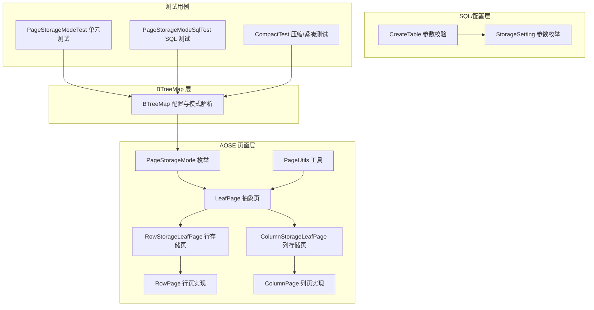
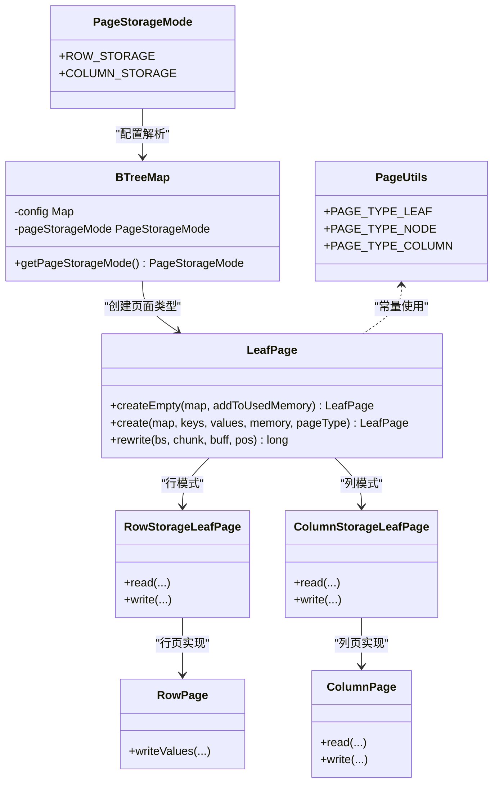
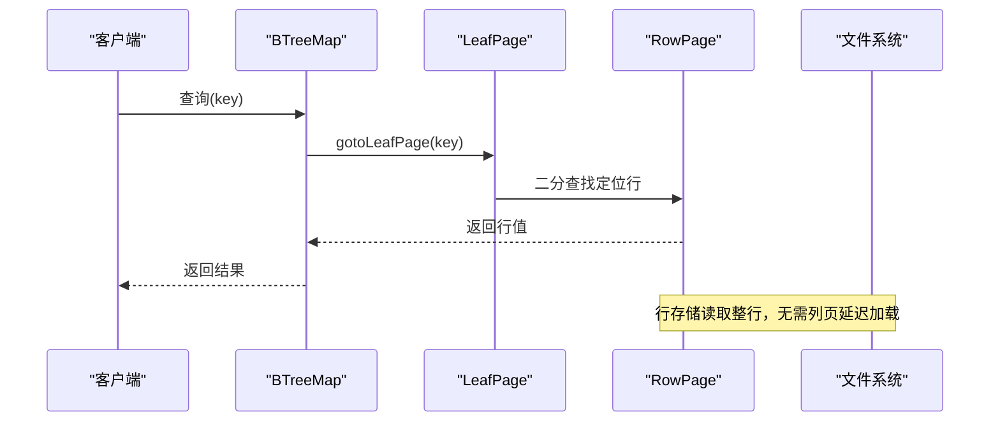
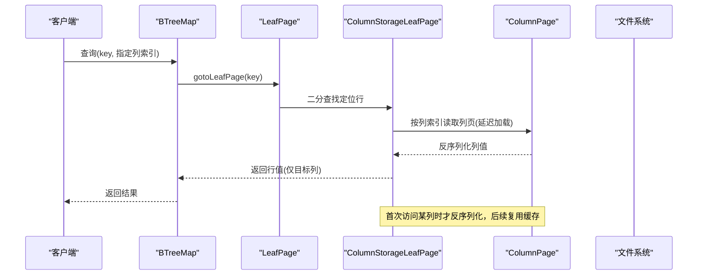
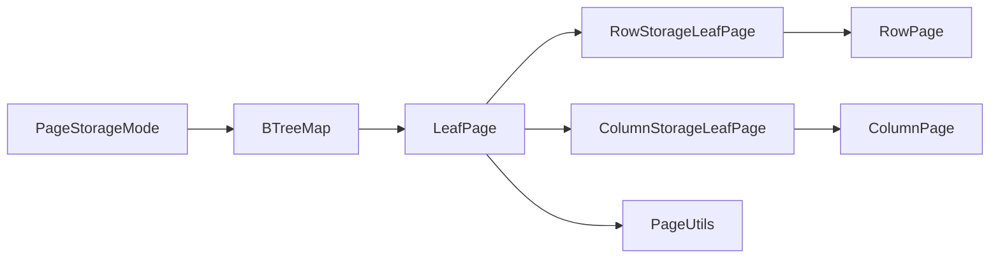

# 存储模式定义

<cite>
**本文引用的文件**
- [PageStorageMode.java](file://lealone-aose/src/main/java/com/lealone/storage/aose/btree/page/PageStorageMode.java)
- [BTreeMap.java](file://lealone-aose/src/main/java/com/lealone/storage/aose/btree/BTreeMap.java)
- [LeafPage.java](file://lealone-aose/src/main/java/com/lealone/storage/aose/btree/page/LeafPage.java)
- [RowStorageLeafPage.java](file://lealone-aose/src/main/java/com/lealone/storage/aose/btree/page/RowStorageLeafPage.java)
- [ColumnStorageLeafPage.java](file://lealone-aose/src/main/java/com/lealone/storage/aose/btree/page/ColumnStorageLeafPage.java)
- [RowPage.java](file://lealone-aose/src/main/java/com/lealone/storage/aose/btree/page/RowPage.java)
- [ColumnPage.java](file://lealone-aose/src/main/java/com/lealone/storage/aose/btree/page/ColumnPage.java)
- [PageUtils.java](file://lealone-aose/src/main/java/com/lealone/storage/aose/btree/page/PageUtils.java)
- [StorageSetting.java](file://lealone-sci/src/main/java/com/lealone/storage/StorageSetting.java)
- [CreateTable.java](file://lealone-sql/src/main/java/com/lealone/sql/DDL/CreateTable.java)
- [PageStorageModeTest.java](file://lealone-test/src/test/java/com/lealone/test/aose/PageStorageModeTest.java)
- [PageStorageModeSqlTest.java](file://lealone-test/src/test/java/com/lealone/test/aose/PageStorageModeSqlTest.java)
- [CompactTest.java](file://lealone-test/src/test/java/com/lealone/test/aose/CompactTest.java)
</cite>

## 目录
1. [简介](#简介)
2. [项目结构](#项目结构)
3. [核心组件](#核心组件)
4. [架构总览](#架构总览)
5. [详细组件分析](#详细组件分析)
6. [依赖关系分析](#依赖关系分析)
7. [性能考量](#性能考量)
8. [故障排查指南](#故障排查指南)
9. [结论](#结论)
10. [附录](#附录)

## 简介
本文件围绕 Lealone 数据库中 AOSE（AO Storage Engine）的页面存储模式进行系统性说明，重点解释 PageStorageMode 枚举中定义的三种模式：
- 行存储（ROW）
- 列存储（COLUMN）
- 混合存储（HYBRID）

通过对代码结构、数据组织方式、适用场景、性能特征以及对查询计划与数据页布局的影响进行深入分析，并结合测试用例展示如何在创建表时指定存储模式，帮助读者理解在不同业务负载下如何选择合适的存储模式以平衡内存使用、磁盘 I/O 和缓存效率。

## 项目结构
与存储模式直接相关的代码主要分布在以下模块：
- AOSE 页面层：定义页面类型与存储模式，负责页面读写、压缩、延迟加载等
- BTreeMap：承载存储模式配置，决定页面类型与行为
- 测试用例：演示如何在 SQL 中指定存储模式参数，验证不同模式下的 CRUD 与查询行为

图表来源
- [PageStorageMode.java](file://lealone-aose/src/main/java/com/lealone/storage/aose/btree/page/PageStorageMode.java#L1-L12)
- [LeafPage.java](file://lealone-aose/src/main/java/com/lealone/storage/aose/btree/page/LeafPage.java#L1-L260)
- [RowStorageLeafPage.java](file://lealone-aose/src/main/java/com/lealone/storage/aose/btree/page/RowStorageLeafPage.java#L1-L115)
- [ColumnStorageLeafPage.java](file://lealone-aose/src/main/java/com/lealone/storage/aose/btree/page/ColumnStorageLeafPage.java#L1-L220)
- [RowPage.java](file://lealone-aose/src/main/java/com/lealone/storage/aose/btree/page/RowPage.java#L1-L74)
- [ColumnPage.java](file://lealone-aose/src/main/java/com/lealone/storage/aose/btree/page/ColumnPage.java#L1-L94)
- [PageUtils.java](file://lealone-aose/src/main/java/com/lealone/storage/aose/btree/page/PageUtils.java#L1-L94)
- [BTreeMap.java](file://lealone-aose/src/main/java/com/lealone/storage/aose/btree/BTreeMap.java#L95-L128)
- [CreateTable.java](file://lealone-sql/src/main/java/com/lealone/sql/DDL/CreateTable.java#L121-L153)
- [StorageSetting.java](file://lealone-sci/src/main/java/com/lealone/storage/StorageSetting.java#L1-L18)
- [PageStorageModeTest.java](file://lealone-test/src/test/java/com/lealone/test/aose/PageStorageModeTest.java#L1-L89)
- [PageStorageModeSqlTest.java](file://lealone-test/src/test/java/com/lealone/test/aose/PageStorageModeSqlTest.java#L1-L80)
- [CompactTest.java](file://lealone-test/src/test/java/com/lealone/test/aose/CompactTest.java#L51-L91)

章节来源
- [PageStorageMode.java](file://lealone-aose/src/main/java/com/lealone/storage/aose/btree/page/PageStorageMode.java#L1-L12)
- [BTreeMap.java](file://lealone-aose/src/main/java/com/lealone/storage/aose/btree/BTreeMap.java#L95-L128)

## 核心组件
- PageStorageMode：定义存储模式枚举，当前包含 ROW_STORAGE 与 COLUMN_STORAGE。注释强调“定义的先后顺序不能随便改动，其他代码依赖 ordinal”，这表明后续版本可能引入 HYBRID，但当前仓库中仅包含上述两种。
- BTreeMap：从配置中解析 PAGE_STORAGE_MODE 参数，默认使用 ROW_STORAGE；根据模式选择页面类型（行页或列页）。
- LeafPage 及其实现：抽象叶子页，决定页面类型与内存估算；根据模式创建 RowPage 或 ColumnPage。
- RowStorageLeafPage/ColumnStorageLeafPage：分别实现行式与列式的叶子页读写逻辑，含延迟加载列页、压缩、检查值等机制。
- RowPage/ColumnPage：具体页面实现，RowPage 以键值整体存储，ColumnPage 以列数组形式存储并延迟反序列化列数据。
- StorageSetting：统一的存储参数枚举，包含 PAGE_STORAGE_MODE 键。
- SQL 层：CreateTable 校验存储引擎参数，支持在 ENGINE PARAMETERS 中传入 page_storage_mode。

章节来源
- [PageStorageMode.java](file://lealone-aose/src/main/java/com/lealone/storage/aose/btree/page/PageStorageMode.java#L1-L12)
- [BTreeMap.java](file://lealone-aose/src/main/java/com/lealone/storage/aose/btree/BTreeMap.java#L95-L128)
- [LeafPage.java](file://lealone-aose/src/main/java/com/lealone/storage/aose/btree/page/LeafPage.java#L179-L200)
- [RowStorageLeafPage.java](file://lealone-aose/src/main/java/com/lealone/storage/aose/btree/page/RowStorageLeafPage.java#L79-L115)
- [ColumnStorageLeafPage.java](file://lealone-aose/src/main/java/com/lealone/storage/aose/btree/page/ColumnStorageLeafPage.java#L96-L180)
- [RowPage.java](file://lealone-aose/src/main/java/com/lealone/storage/aose/btree/page/RowPage.java#L1-L74)
- [ColumnPage.java](file://lealone-aose/src/main/java/com/lealone/storage/aose/btree/page/ColumnPage.java#L1-L94)
- [StorageSetting.java](file://lealone-sci/src/main/java/com/lealone/storage/StorageSetting.java#L1-L18)
- [CreateTable.java](file://lealone-sql/src/main/java/com/lealone/sql/DDL/CreateTable.java#L121-L153)

## 架构总览
下面的类图展示了存储模式与页面层次的关系，以及页面类型选择与读写流程的关键点。

图表来源
- [PageStorageMode.java](file://lealone-aose/src/main/java/com/lealone/storage/aose/btree/page/PageStorageMode.java#L1-L12)
- [BTreeMap.java](file://lealone-aose/src/main/java/com/lealone/storage/aose/btree/BTreeMap.java#L95-L128)
- [LeafPage.java](file://lealone-aose/src/main/java/com/lealone/storage/aose/btree/page/LeafPage.java#L179-L200)
- [RowStorageLeafPage.java](file://lealone-aose/src/main/java/com/lealone/storage/aose/btree/page/RowStorageLeafPage.java#L79-L115)
- [ColumnStorageLeafPage.java](file://lealone-aose/src/main/java/com/lealone/storage/aose/btree/page/ColumnStorageLeafPage.java#L96-L180)
- [RowPage.java](file://lealone-aose/src/main/java/com/lealone/storage/aose/btree/page/RowPage.java#L1-L74)
- [ColumnPage.java](file://lealone-aose/src/main/java/com/lealone/storage/aose/btree/page/ColumnPage.java#L1-L94)
- [PageUtils.java](file://lealone-aose/src/main/java/com/lealone/storage/aose/btree/page/PageUtils.java#L1-L94)

## 详细组件分析

### PageStorageMode 枚举与默认行为
- 枚举定义：ROW_STORAGE、COLUMN_STORAGE，且注释明确指出“定义的先后顺序不能随便改动，其他代码依赖 ordinal”。这意味着后续若引入 HYBRID，需保持现有顺序不变，以避免破坏基于 ordinal 的分支逻辑。
- 默认模式：BTreeMap 在未显式配置时，默认使用 ROW_STORAGE，确保兼容性与稳定性。
- 配置入口：通过 StorageSetting.PAGE_STORAGE_MODE 传递字符串值（如 "ROW_STORAGE" 或 "COLUMN_STORAGE"），BTreeMap 解析后应用到页面类型选择。

章节来源
- [PageStorageMode.java](file://lealone-aose/src/main/java/com/lealone/storage/aose/btree/page/PageStorageMode.java#L1-L12)
- [BTreeMap.java](file://lealone-aose/src/main/java/com/lealone/storage/aose/btree/BTreeMap.java#L95-L128)
- [StorageSetting.java](file://lealone-sci/src/main/java/com/lealone/storage/StorageSetting.java#L1-L18)

### 行存储（ROW）模式
- 数据组织方式：键与值整体存储在同一页面中，适合按整行访问的 OLTP 场景。RowPage/RowStorageLeafPage 以键值对形式读写，内存估算同时考虑键与值类型。
- 适用场景：主键查询、范围扫描、整行更新/删除等，读取时无需额外列页反序列化。
- 性能特征：
  - 读取局部性好，命中缓存概率高
  - 更新整行时，页面写入开销较低
  - 列式投影（仅读取部分列）时仍需解码整行，可能产生冗余 IO
- 页面类型选择：LeafPage.createEmpty 依据模式与键/值类型组合选择行页（pageType 1/3）。

图表来源
- [BTreeMap.java](file://lealone-aose/src/main/java/com/lealone/storage/aose/btree/BTreeMap.java#L172-L200)
- [LeafPage.java](file://lealone-aose/src/main/java/com/lealone/storage/aose/btree/page/LeafPage.java#L179-L200)
- [RowPage.java](file://lealone-aose/src/main/java/com/lealone/storage/aose/btree/page/RowPage.java#L1-L74)

章节来源
- [RowStorageLeafPage.java](file://lealone-aose/src/main/java/com/lealone/storage/aose/btree/page/RowStorageLeafPage.java#L79-L115)
- [RowPage.java](file://lealone-aose/src/main/java/com/lealone/storage/aose/btree/page/RowPage.java#L1-L74)
- [LeafPage.java](file://lealone-aose/src/main/java/com/lealone/storage/aose/btree/page/LeafPage.java#L179-L200)

### 列存储（COLUMN）模式
- 数据组织方式：键与值分离存储，值按列组织，每个列单独保存为 ColumnPage。ColumnStorageLeafPage 记录键集合与各列页位置，首次访问某列时才延迟反序列化该列数据，显著降低读取冗余。
- 适用场景：宽表、列式投影查询（如统计分析）、稀疏列、批量扫描等。
- 性能特征：
  - 列式投影读取高效，减少 IO 与 CPU
  - 写入时需维护多个列页，写放大相对较高
  - 延迟加载列页带来首次访问延迟，但后续访问受益于缓存
- 页面类型选择：LeafPage.createEmpty 依据模式与键/值类型组合选择列页（pageType 2/4）。

图表来源
- [ColumnStorageLeafPage.java](file://lealone-aose/src/main/java/com/lealone/storage/aose/btree/page/ColumnStorageLeafPage.java#L28-L78)
- [ColumnPage.java](file://lealone-aose/src/main/java/com/lealone/storage/aose/btree/page/ColumnPage.java#L46-L86)
- [LeafPage.java](file://lealone-aose/src/main/java/com/lealone/storage/aose/btree/page/LeafPage.java#L239-L249)

章节来源
- [ColumnStorageLeafPage.java](file://lealone-aose/src/main/java/com/lealone/storage/aose/btree/page/ColumnStorageLeafPage.java#L96-L180)
- [ColumnPage.java](file://lealone-aose/src/main/java/com/lealone/storage/aose/btree/page/ColumnPage.java#L1-L94)
- [LeafPage.java](file://lealone-aose/src/main/java/com/lealone/storage/aose/btree/page/LeafPage.java#L239-L249)

### 混合存储（HYBRID）模式
- 当前状态：在本仓库中，PageStorageMode 仅包含 ROW_STORAGE 与 COLUMN_STORAGE，未定义 HYBRID。注释强调“定义的先后顺序不能随便改动，其他代码依赖 ordinal”，暗示后续可能引入 HYBRID 作为第三种模式。
- 设计建议（概念性说明）：HYBRID 可结合行存储与列存储的优势，例如对热点列采用列式存储以提升投影查询效率，对频繁整行访问的列保留行式布局，从而在 OLTP 与 OLAP 场景间取得平衡。但本仓库未提供具体实现，此处仅为概念性说明。

[本节为概念性内容，不直接分析具体源码文件]

### 创建表时指定存储模式
- SQL 方式：在 CREATE TABLE 语句中通过 ENGINE PARAMETERS 指定 page_storage_mode 与 page_size 等参数，CreateTable 校验参数合法性。
- 编程式方式：通过 StorageSetting.PAGE_STORAGE_MODE 设置为 "ROW_STORAGE" 或 "COLUMN_STORAGE"，BTreeMap 解析后生效。

章节来源
- [PageStorageModeSqlTest.java](file://lealone-test/src/test/java/com/lealone/test/aose/PageStorageModeSqlTest.java#L41-L80)
- [CreateTable.java](file://lealone-sql/src/main/java/com/lealone/sql/DDL/CreateTable.java#L121-L153)
- [StorageSetting.java](file://lealone-sci/src/main/java/com/lealone/storage/StorageSetting.java#L1-L18)

### 查询计划与数据页布局
- 页面类型选择：LeafPage.createEmpty 根据模式与键/值类型组合选择页面类型，决定页头、键/值布局与压缩策略。
- 读取路径：ROW 模式走 RowStorageLeafPage/RowPage；COLUMN 模式走 ColumnStorageLeafPage/ColumnPage。
- 写入路径：ROW 模式写入键与值整体；COLUMN 模式先写叶页元数据，再逐列写 ColumnPage 并回填列页位置。

章节来源
- [LeafPage.java](file://lealone-aose/src/main/java/com/lealone/storage/aose/btree/page/LeafPage.java#L179-L200)
- [RowStorageLeafPage.java](file://lealone-aose/src/main/java/com/lealone/storage/aose/btree/page/RowStorageLeafPage.java#L79-L115)
- [ColumnStorageLeafPage.java](file://lealone-aose/src/main/java/com/lealone/storage/aose/btree/page/ColumnStorageLeafPage.java#L128-L180)

## 依赖关系分析
- 枚举依赖：PageStorageMode 的 ordinal 被多处逻辑依赖（如页面类型选择、重写逻辑），因此顺序不可随意调整。
- 配置依赖：BTreeMap 从配置中读取 PAGE_STORAGE_MODE，若缺失则回退到 ROW_STORAGE。
- 页面依赖：LeafPage.createEmpty 依据模式与键/值类型创建具体页面；ColumnStorageLeafPage 依赖 ColumnPage 进行列数据延迟加载与写入。

图表来源
- [PageStorageMode.java](file://lealone-aose/src/main/java/com/lealone/storage/aose/btree/page/PageStorageMode.java#L1-L12)
- [BTreeMap.java](file://lealone-aose/src/main/java/com/lealone/storage/aose/btree/BTreeMap.java#L95-L128)
- [LeafPage.java](file://lealone-aose/src/main/java/com/lealone/storage/aose/btree/page/LeafPage.java#L179-L200)
- [RowStorageLeafPage.java](file://lealone-aose/src/main/java/com/lealone/storage/aose/btree/page/RowStorageLeafPage.java#L79-L115)
- [ColumnStorageLeafPage.java](file://lealone-aose/src/main/java/com/lealone/storage/aose/btree/page/ColumnStorageLeafPage.java#L96-L180)
- [RowPage.java](file://lealone-aose/src/main/java/com/lealone/storage/aose/btree/page/RowPage.java#L1-L74)
- [ColumnPage.java](file://lealone-aose/src/main/java/com/lealone/storage/aose/btree/page/ColumnPage.java#L1-L94)
- [PageUtils.java](file://lealone-aose/src/main/java/com/lealone/storage/aose/btree/page/PageUtils.java#L1-L94)

章节来源
- [BTreeMap.java](file://lealone-aose/src/main/java/com/lealone/storage/aose/btree/BTreeMap.java#L95-L128)
- [LeafPage.java](file://lealone-aose/src/main/java/com/lealone/storage/aose/btree/page/LeafPage.java#L179-L200)

## 性能考量
- 内存使用
  - 行存储：整行读取，内存占用与键值类型直接相关；RowStorageLeafPage 写入时按值类型估算内存。
  - 列存储：延迟加载列页，首次访问时累计列内存；ColumnPage 在读取列时增量累加内存，避免重复反序列化。
- 磁盘 I/O
  - 行存储：整行读取，列式投影时仍需解码整行，可能产生冗余 IO。
  - 列存储：仅反序列化所需列，显著降低 IO；ColumnPage 写入时按列顺序写入，压缩后回填列页位置。
- 缓存效率
  - 行存储：主键查询与整行更新具有良好的局部性，缓存命中率高。
  - 列存储：列式投影查询受益于缓存，多次访问同一列时缓存复用效果明显。
- 压缩与格式
  - 页面写入时均支持压缩（fast/high），压缩起始位置与类型在写入过程中动态确定，压缩比受页面大小与数据分布影响。

章节来源
- [RowStorageLeafPage.java](file://lealone-aose/src/main/java/com/lealone/storage/aose/btree/page/RowStorageLeafPage.java#L79-L115)
- [ColumnStorageLeafPage.java](file://lealone-aose/src/main/java/com/lealone/storage/aose/btree/page/ColumnStorageLeafPage.java#L128-L180)
- [ColumnPage.java](file://lealone-aose/src/main/java/com/lealone/storage/aose/btree/page/ColumnPage.java#L61-L86)
- [PageUtils.java](file://lealone-aose/src/main/java/com/lealone/storage/aose/btree/page/PageUtils.java#L1-L94)

## 故障排查指南
- 参数校验失败
  - 若在 ENGINE PARAMETERS 中传入未识别的参数，CreateTable 会抛出异常，提示识别到的参数选项。请确认 page_storage_mode 与 page_size 等参数名称正确。
- 模式切换注意事项
  - 由于 PageStorageMode 的 ordinal 被多处逻辑依赖，新增 HYBRID 模式时需谨慎评估对现有分支逻辑的影响。
- 读取异常
  - 若列式投影查询出现列缺失或反序列化错误，检查 ColumnStorageLeafPage 是否已正确读取列页，以及 ColumnPage 的延迟加载逻辑是否触发。

章节来源
- [CreateTable.java](file://lealone-sql/src/main/java/com/lealone/sql/DDL/CreateTable.java#L121-L153)
- [PageStorageMode.java](file://lealone-aose/src/main/java/com/lealone/storage/aose/btree/page/PageStorageMode.java#L1-L12)
- [ColumnStorageLeafPage.java](file://lealone-aose/src/main/java/com/lealone/storage/aose/btree/page/ColumnStorageLeafPage.java#L28-L78)

## 结论
- 当前仓库中，PageStorageMode 仅定义了行存储（ROW）与列存储（COLUMN）两种模式，HYBRID 尚未实现。
- 行存储适合主键查询与整行访问为主的 OLTP 场景；列存储适合宽表与列式投影为主的 OLAP 场景。
- 通过 StorageSetting.PAGE_STORAGE_MODE 与 ENGINE PARAMETERS，可在创建表时灵活选择存储模式；BTreeMap 默认回退到行存储以保证兼容性。
- 页面类型选择、延迟加载与压缩策略共同决定了内存使用、磁盘 I/O 与缓存效率，应根据业务负载特征进行权衡。

[本节为总结性内容，不直接分析具体源码文件]

## 附录

### 代码示例路径（如何在创建表时指定存储模式）
- SQL 示例（指定 page_storage_mode 与 page_size）
  - [PageStorageModeSqlTest.java](file://lealone-test/src/test/java/com/lealone/test/aose/PageStorageModeSqlTest.java#L56-L66)
- 编程式示例（通过参数设置存储模式）
  - [PageStorageModeTest.java](file://lealone-test/src/test/java/com/lealone/test/aose/PageStorageModeTest.java#L52-L59)
- 参数校验（CreateTable）
  - [CreateTable.java](file://lealone-sql/src/main/java/com/lealone/sql/DDL/CreateTable.java#L121-L153)

### 存储模式选择建议
- 选择行存储（ROW）当：
  - 主键查询与整行更新频繁
  - 列式投影较少
  - 对写入吞吐要求较高
- 选择列存储（COLUMN）当：
  - 宽表、列式投影查询较多
  - 稀疏列或大字段较多
  - 批量扫描与统计分析为主

[本节为通用建议，不直接分析具体源码文件]