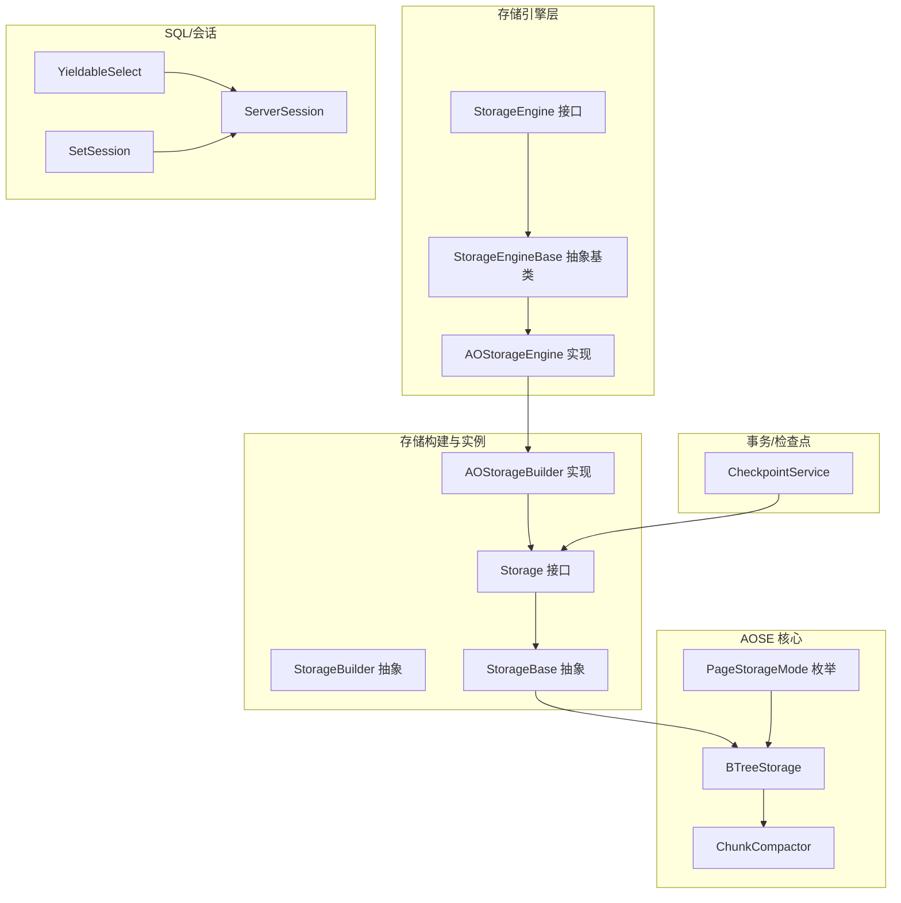
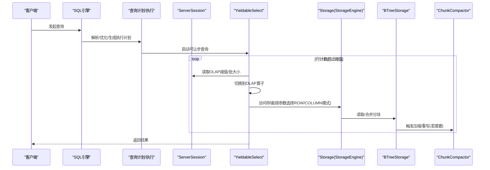
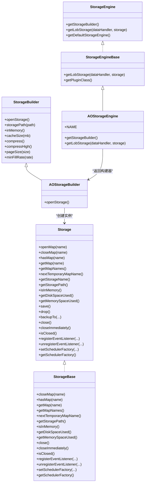
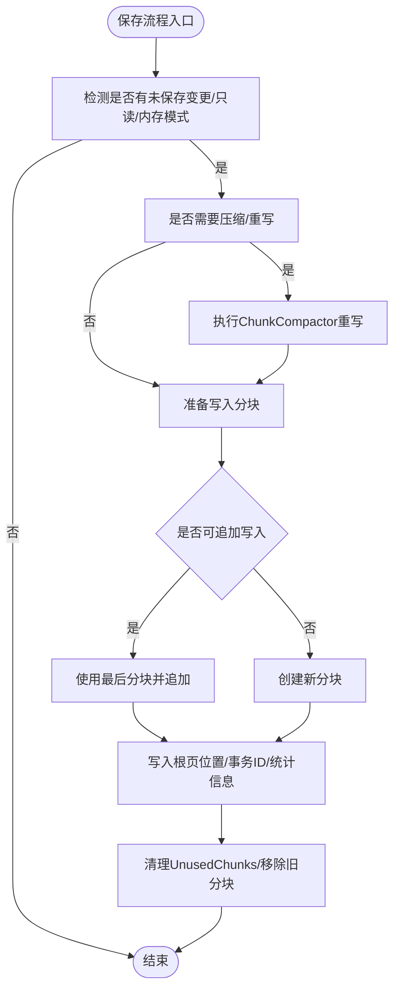
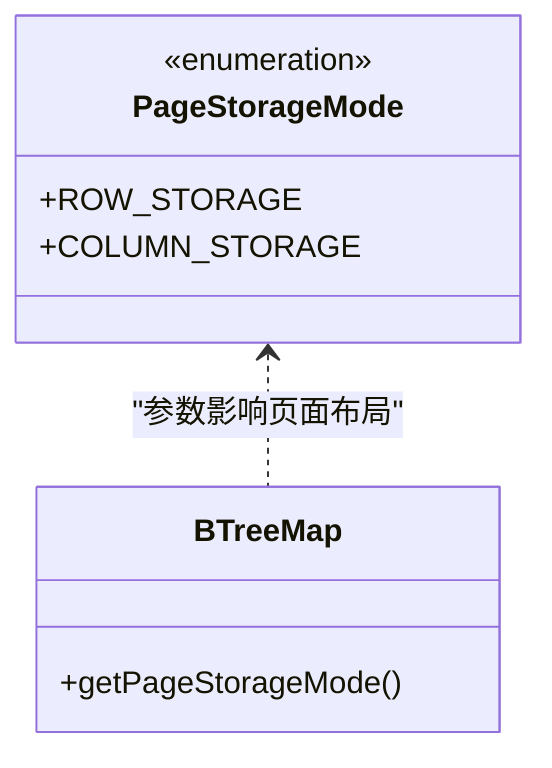
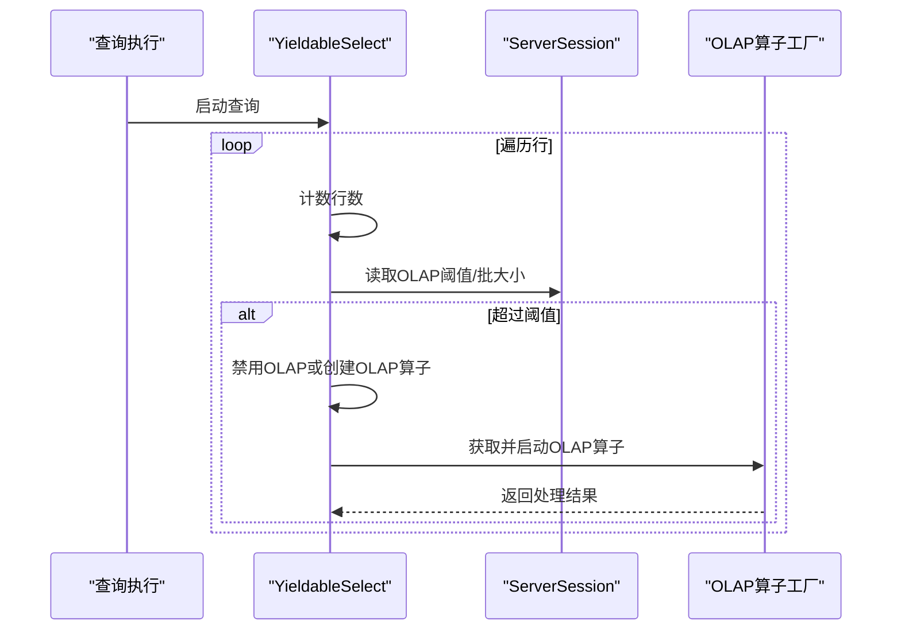
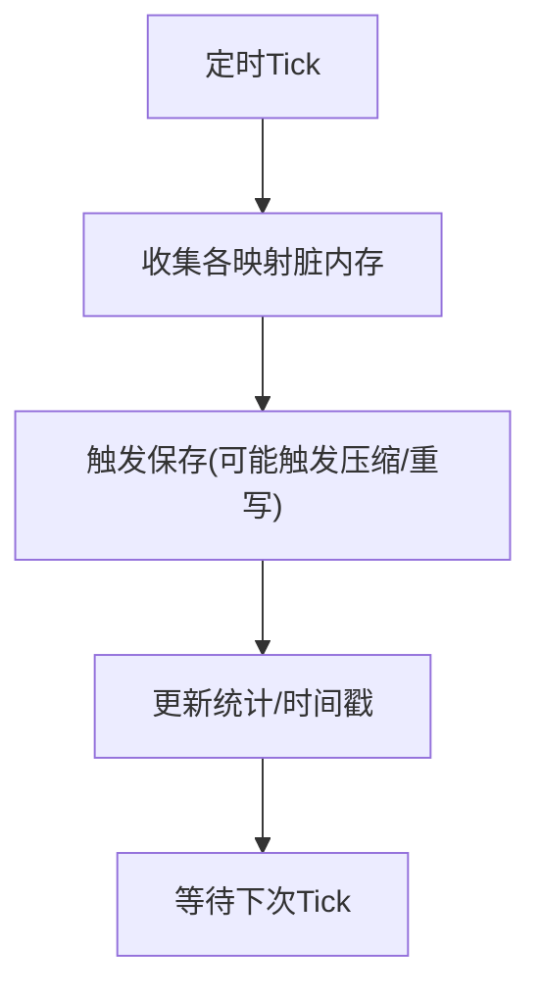
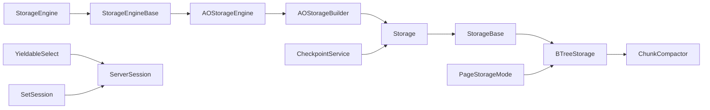

# 混合存储优化策略

<cite>
**本文引用的文件列表**
- [AOStorageEngine.java](https://github.com/lealone/Lealone/blob/master/lealone-aose/src/main/java/com/lealone/storage/aose/AOStorageEngine.java)
- [AOStorageBuilder.java](https://github.com/lealone/Lealone/blob/master/lealone-aose/src/main/java/com/lealone/storage/aose/AOStorageBuilder.java)
- [BTreeStorage.java](https://github.com/lealone/Lealone/blob/master/lealone-aose/src/main/java/com/lealone/storage/aose/btree/BTreeStorage.java)
- [ChunkCompactor.java](https://github.com/lealone/Lealone/blob/master/lealone-aose/src/main/java/com/lealone/storage/aose/btree/chunk/ChunkCompactor.java)
- [PageStorageMode.java](https://github.com/lealone/Lealone/blob/master/lealone-aose/src/main/java/com/lealone/storage/aose/btree/page/PageStorageMode.java)
- [StorageEngine.java](https://github.com/lealone/Lealone/blob/master/lealone-sci/src/main/java/com/lealone/storage/StorageEngine.java)
- [StorageEngineBase.java](https://github.com/lealone/Lealone/blob/master/lealone-sci/src/main/java/com/lealone/storage/StorageEngineBase.java)
- [Storage.java](https://github.com/lealone/Lealone/blob/master/lealone-sci/src/main/java/com/lealone/storage/Storage.java)
- [StorageBase.java](https://github.com/lealone/Lealone/blob/master/lealone-sci/src/main/java/com/lealone/storage/StorageBase.java)
- [StorageBuilder.java](https://github.com/lealone/Lealone/blob/master/lealone-sci/src/main/java/com/lealone/storage/StorageBuilder.java)
- [StorageSetting.java](https://github.com/lealone/Lealone/blob/master/lealone-sci/src/main/java/com/lealone/storage/StorageSetting.java)
- [PageStorageModeTest.java](https://github.com/lealone/Lealone/blob/master/lealone-test/src/test/java/com/lealone/test/aose/PageStorageModeTest.java)
- [PageStorageModeSqlTest.java](https://github.com/lealone/Lealone/blob/master/lealone-test/src/test/java/com/lealone/test/aose/PageStorageModeSqlTest.java)
- [YieldableSelect.java](https://github.com/lealone/Lealone/blob/master/lealone-sql/src/main/java/com/lealone/sql/query/YieldableSelect.java)
- [ServerSession.java](https://github.com/lealone/Lealone/blob/master/lealone-db/src/main/java/com/lealone/db/session/ServerSession.java)
- [SetSession.java](https://github.com/lealone/Lealone/blob/master/lealone-sql/src/main/java/com/lealone/sql/dml/SetSession.java)
- [Database.java](https://github.com/lealone/Lealone/blob/master/lealone-db/src/main/java/com/lealone/db/Database.java)
- [CheckpointService.java](https://github.com/lealone/Lealone/blob/master/lealone-aote/src/main/java/com/lealone/transaction/aote/CheckpointService.java)
- [DbSetting.java](https://github.com/lealone/Lealone/blob/master/lealone-common/src/main/java/com/lealone/db/DbSetting.java)
</cite>

## 目录
1. [简介](#简介)
2. [项目结构](#项目结构)
3. [核心组件](#核心组件)
4. [架构总览](#架构总览)
5. [详细组件分析](#详细组件分析)
6. [依赖关系分析](#依赖关系分析)
7. [性能考量](#性能考量)
8. [故障排查指南](#故障排查指南)
9. [结论](#结论)
10. [附录](#附录)

## 简介
本文件围绕混合存储模式的优化策略展开，重点结合Lealone代码库中的AOSE（面向列/行混合）存储实现，系统性分析如何依据工作负载特征动态选择最优存储模式（行式与列式），在兼顾OLTP与OLAP需求的同时实现存储模式的平滑切换，并给出实际应用场景与最佳实践建议。文档同时讨论混合存储的管理开销与维护成本，帮助读者在生产环境中做出合理权衡。

## 项目结构
Lealone采用插件化存储引擎架构，AOSE作为默认持久化存储引擎，基于B+树页式存储，支持行式与列式两种页面存储模式；SQL层提供OLAP阈值与批处理参数控制，配合事务与检查点机制保障数据一致性与可恢复性。

图表来源
- [StorageEngine.java](https://github.com/lealone/Lealone/blob/master/lealone-sci/src/main/java/com/lealone/storage/StorageEngine.java#L1-L24)
- [StorageEngineBase.java](https://github.com/lealone/Lealone/blob/master/lealone-sci/src/main/java/com/lealone/storage/StorageEngineBase.java#L1-L30)
- [AOStorageEngine.java](https://github.com/lealone/Lealone/blob/master/lealone-aose/src/main/java/com/lealone/storage/aose/AOStorageEngine.java#L1-L33)
- [StorageBuilder.java](https://github.com/lealone/Lealone/blob/master/lealone-sci/src/main/java/com/lealone/storage/StorageBuilder.java#L1-L148)
- [AOStorageBuilder.java](https://github.com/lealone/Lealone/blob/master/lealone-aose/src/main/java/com/lealone/storage/aose/AOStorageBuilder.java#L1-L65)
- [Storage.java](https://github.com/lealone/Lealone/blob/master/lealone-sci/src/main/java/com/lealone/storage/Storage.java#L1-L80)
- [StorageBase.java](https://github.com/lealone/Lealone/blob/master/lealone-sci/src/main/java/com/lealone/storage/StorageBase.java#L1-L189)
- [BTreeStorage.java](https://github.com/lealone/Lealone/blob/master/lealone-aose/src/main/java/com/lealone/storage/aose/btree/BTreeStorage.java#L1-L415)
- [ChunkCompactor.java](https://github.com/lealone/Lealone/blob/master/lealone-aose/src/main/java/com/lealone/storage/aose/btree/chunk/ChunkCompactor.java#L1-L136)
- [PageStorageMode.java](https://github.com/lealone/Lealone/blob/master/lealone-aose/src/main/java/com/lealone/storage/aose/btree/page/PageStorageMode.java#L1-L13)
- [YieldableSelect.java](https://github.com/lealone/Lealone/blob/master/lealone-sql/src/main/java/com/lealone/sql/query/YieldableSelect.java#L38-L72)
- [ServerSession.java](https://github.com/lealone/Lealone/blob/master/lealone-db/src/main/java/com/lealone/db/session/ServerSession.java#L1583-L1629)
- [SetSession.java](https://github.com/lealone/Lealone/blob/master/lealone-sql/src/main/java/com/lealone/sql/dml/SetSession.java#L77-L90)
- [CheckpointService.java](https://github.com/lealone/Lealone/blob/master/lealone-aote/src/main/java/com/lealone/transaction/aote/CheckpointService.java#L258-L296)

章节来源
- [AOStorageEngine.java](https://github.com/lealone/Lealone/blob/master/lealone-aose/src/main/java/com/lealone/storage/aose/AOStorageEngine.java#L1-L33)
- [StorageEngine.java](https://github.com/lealone/Lealone/blob/master/lealone-sci/src/main/java/com/lealone/storage/StorageEngine.java#L1-L24)
- [StorageEngineBase.java](https://github.com/lealone/Lealone/blob/master/lealone-sci/src/main/java/com/lealone/storage/StorageEngineBase.java#L1-L30)
- [AOStorageBuilder.java](https://github.com/lealone/Lealone/blob/master/lealone-aose/src/main/java/com/lealone/storage/aose/AOStorageBuilder.java#L1-L65)
- [StorageBuilder.java](https://github.com/lealone/Lealone/blob/master/lealone-sci/src/main/java/com/lealone/storage/StorageBuilder.java#L1-L148)
- [Storage.java](https://github.com/lealone/Lealone/blob/master/lealone-sci/src/main/java/com/lealone/storage/Storage.java#L1-L80)
- [StorageBase.java](https://github.com/lealone/Lealone/blob/master/lealone-sci/src/main/java/com/lealone/storage/StorageBase.java#L1-L189)
- [BTreeStorage.java](https://github.com/lealone/Lealone/blob/master/lealone-aose/src/main/java/com/lealone/storage/aose/btree/BTreeStorage.java#L1-L415)
- [ChunkCompactor.java](https://github.com/lealone/Lealone/blob/master/lealone-aose/src/main/java/com/lealone/storage/aose/btree/chunk/ChunkCompactor.java#L1-L136)
- [PageStorageMode.java](https://github.com/lealone/Lealone/blob/master/lealone-aose/src/main/java/com/lealone/storage/aose/btree/page/PageStorageMode.java#L1-L13)
- [YieldableSelect.java](https://github.com/lealone/Lealone/blob/master/lealone-sql/src/main/java/com/lealone/sql/query/YieldableSelect.java#L38-L72)
- [ServerSession.java](https://github.com/lealone/Lealone/blob/master/lealone-db/src/main/java/com/lealone/db/session/ServerSession.java#L1583-L1629)
- [SetSession.java](https://github.com/lealone/Lealone/blob/master/lealone-sql/src/main/java/com/lealone/sql/dml/SetSession.java#L77-L90)
- [CheckpointService.java](https://github.com/lealone/Lealone/blob/master/lealone-aote/src/main/java/com/lealone/transaction/aote/CheckpointService.java#L258-L296)

## 核心组件
- 存储引擎接口与实现：通过StorageEngine定义统一入口，AOStorageEngine提供AOSE实现与LOB存储适配。
- 存储构建器：AOStorageBuilder负责AOSE存储实例的创建、缓存与调度工厂注入。
- B+树存储与分块压缩：BTreeStorage管理页大小、最小填充率、压缩级别、分块与回收；ChunkCompactor负责低填充率分块的重写与无用分块清理。
- 页面存储模式：PageStorageMode枚举定义ROW_STORAGE与COLUMN_STORAGE两种模式，用于按表或映射参数选择。
- SQL与会话：YieldableSelect根据行数阈值与会话设置触发OLAP算子切换；ServerSession与SetSession提供阈值与批大小配置。
- 事务与检查点：CheckpointService周期性收集脏页内存并触发保存，保障持久化与恢复。

章节来源
- [StorageEngine.java](https://github.com/lealone/Lealone/blob/master/lealone-sci/src/main/java/com/lealone/storage/StorageEngine.java#L1-L24)
- [AOStorageEngine.java](https://github.com/lealone/Lealone/blob/master/lealone-aose/src/main/java/com/lealone/storage/aose/AOStorageEngine.java#L1-L33)
- [StorageBuilder.java](https://github.com/lealone/Lealone/blob/master/lealone-sci/src/main/java/com/lealone/storage/StorageBuilder.java#L1-L148)
- [AOStorageBuilder.java](https://github.com/lealone/Lealone/blob/master/lealone-aose/src/main/java/com/lealone/storage/aose/AOStorageBuilder.java#L1-L65)
- [BTreeStorage.java](https://github.com/lealone/Lealone/blob/master/lealone-aose/src/main/java/com/lealone/storage/aose/btree/BTreeStorage.java#L1-L415)
- [ChunkCompactor.java](https://github.com/lealone/Lealone/blob/master/lealone-aose/src/main/java/com/lealone/storage/aose/btree/chunk/ChunkCompactor.java#L1-L136)
- [PageStorageMode.java](https://github.com/lealone/Lealone/blob/master/lealone-aose/src/main/java/com/lealone/storage/aose/btree/page/PageStorageMode.java#L1-L13)
- [YieldableSelect.java](https://github.com/lealone/Lealone/blob/master/lealone-sql/src/main/java/com/lealone/sql/query/YieldableSelect.java#L38-L72)
- [ServerSession.java](https://github.com/lealone/Lealone/blob/master/lealone-db/src/main/java/com/lealone/db/session/ServerSession.java#L1583-L1629)
- [SetSession.java](https://github.com/lealone/Lealone/blob/master/lealone-sql/src/main/java/com/lealone/sql/dml/SetSession.java#L77-L90)
- [CheckpointService.java](https://github.com/lealone/Lealone/blob/master/lealone-aote/src/main/java/com/lealone/transaction/aote/CheckpointService.java#L258-L296)

## 架构总览
AOSE以B+树为核心，采用分块（Chunk）组织页面，支持行式与列式页面存储模式。SQL层通过会话级阈值与批大小参数驱动查询执行策略，在大规模扫描场景下自动切换到OLAP执行路径，从而平衡OLTP与OLAP的资源占用。

图表来源
- [YieldableSelect.java](https://github.com/lealone/Lealone/blob/master/lealone-sql/src/main/java/com/lealone/sql/query/YieldableSelect.java#L38-L72)
- [ServerSession.java](https://github.com/lealone/Lealone/blob/master/lealone-db/src/main/java/com/lealone/db/session/ServerSession.java#L1583-L1629)
- [StorageEngine.java](https://github.com/lealone/Lealone/blob/master/lealone-sci/src/main/java/com/lealone/storage/StorageEngine.java#L1-L24)
- [BTreeStorage.java](https://github.com/lealone/Lealone/blob/master/lealone-aose/src/main/java/com/lealone/storage/aose/btree/BTreeStorage.java#L1-L415)
- [ChunkCompactor.java](https://github.com/lealone/Lealone/blob/master/lealone-aose/src/main/java/com/lealone/storage/aose/btree/chunk/ChunkCompactor.java#L1-L136)

## 详细组件分析

### 组件A：存储引擎与构建器（AOSE）
- AOStorageEngine继承StorageEngineBase，提供AOSE名称、存储构建器与LOB存储适配。
- AOStorageBuilder负责AOSE存储实例的创建与缓存，注入调度工厂，确保嵌入式场景下的调度可用性。

图表来源
- [StorageEngine.java](https://github.com/lealone/Lealone/blob/master/lealone-sci/src/main/java/com/lealone/storage/StorageEngine.java#L1-L24)
- [StorageEngineBase.java](https://github.com/lealone/Lealone/blob/master/lealone-sci/src/main/java/com/lealone/storage/StorageEngineBase.java#L1-L30)
- [AOStorageEngine.java](https://github.com/lealone/Lealone/blob/master/lealone-aose/src/main/java/com/lealone/storage/aose/AOStorageEngine.java#L1-L33)
- [StorageBuilder.java](https://github.com/lealone/Lealone/blob/master/lealone-sci/src/main/java/com/lealone/storage/StorageBuilder.java#L1-L148)
- [AOStorageBuilder.java](https://github.com/lealone/Lealone/blob/master/lealone-aose/src/main/java/com/lealone/storage/aose/AOStorageBuilder.java#L1-L65)
- [Storage.java](https://github.com/lealone/Lealone/blob/master/lealone-sci/src/main/java/com/lealone/storage/Storage.java#L1-L80)
- [StorageBase.java](https://github.com/lealone/Lealone/blob/master/lealone-sci/src/main/java/com/lealone/storage/StorageBase.java#L1-L189)

章节来源
- [AOStorageEngine.java](https://github.com/lealone/Lealone/blob/master/lealone-aose/src/main/java/com/lealone/storage/aose/AOStorageEngine.java#L1-L33)
- [AOStorageBuilder.java](https://github.com/lealone/Lealone/blob/master/lealone-aose/src/main/java/com/lealone/storage/aose/AOStorageBuilder.java#L1-L65)
- [StorageEngine.java](https://github.com/lealone/Lealone/blob/master/lealone-sci/src/main/java/com/lealone/storage/StorageEngine.java#L1-L24)
- [StorageEngineBase.java](https://github.com/lealone/Lealone/blob/master/lealone-sci/src/main/java/com/lealone/storage/StorageEngineBase.java#L1-L30)
- [Storage.java](https://github.com/lealone/Lealone/blob/master/lealone-sci/src/main/java/com/lealone/storage/Storage.java#L1-L80)
- [StorageBase.java](https://github.com/lealone/Lealone/blob/master/lealone-sci/src/main/java/com/lealone/storage/StorageBase.java#L1-L189)

### 组件B：B+树存储与分块压缩
- BTreeStorage负责：
  - 页大小、最小填充率、压缩级别解析与应用。
  - 分块管理与重写，支持追加写与新分块创建。
  - 读写页缓冲、重做日志同步与校验。
- ChunkCompactor负责：
  - 识别无用分块与低填充率分块。
  - 重写存活页到新分块，清理移除页集合，延迟删除旧分块文件，避免数据丢失风险。

图表来源
- [BTreeStorage.java](https://github.com/lealone/Lealone/blob/master/lealone-aose/src/main/java/com/lealone/storage/aose/btree/BTreeStorage.java#L302-L366)
- [ChunkCompactor.java](https://github.com/lealone/Lealone/blob/master/lealone-aose/src/main/java/com/lealone/storage/aose/btree/chunk/ChunkCompactor.java#L69-L136)

章节来源
- [BTreeStorage.java](https://github.com/lealone/Lealone/blob/master/lealone-aose/src/main/java/com/lealone/storage/aose/btree/BTreeStorage.java#L1-L415)
- [ChunkCompactor.java](https://github.com/lealone/Lealone/blob/master/lealone-aose/src/main/java/com/lealone/storage/aose/btree/chunk/ChunkCompactor.java#L1-L136)

### 组件C：页面存储模式（ROW_STORAGE vs COLUMN_STORAGE）
- PageStorageMode枚举定义两种页面存储模式，顺序固定，其他代码依赖其ordinal。
- 测试用例展示了通过参数设置页面存储模式，并验证行式与列式在CRUD与游标遍历上的正确性。

图表来源
- [PageStorageMode.java](https://github.com/lealone/Lealone/blob/master/lealone-aose/src/main/java/com/lealone/storage/aose/btree/page/PageStorageMode.java#L1-L13)
- [PageStorageModeTest.java](https://github.com/lealone/Lealone/blob/master/lealone-test/src/test/java/com/lealone/test/aose/PageStorageModeTest.java#L1-L90)
- [PageStorageModeSqlTest.java](https://github.com/lealone/Lealone/blob/master/lealone-test/src/test/java/com/lealone/test/aose/PageStorageModeSqlTest.java#L1-L81)

章节来源
- [PageStorageMode.java](https://github.com/lealone/Lealone/blob/master/lealone-aose/src/main/java/com/lealone/storage/aose/btree/page/PageStorageMode.java#L1-L13)
- [PageStorageModeTest.java](https://github.com/lealone/Lealone/blob/master/lealone-test/src/test/java/com/lealone/test/aose/PageStorageModeTest.java#L1-L90)
- [PageStorageModeSqlTest.java](https://github.com/lealone/Lealone/blob/master/lealone-test/src/test/java/com/lealone/test/aose/PageStorageModeSqlTest.java#L1-L81)

### 组件D：OLAP切换与会话参数
- YieldableSelect在行数超过阈值时禁用OLAP或创建OLAP算子，并更新会话状态。
- ServerSession提供OLAP阈值与批大小的读写接口。
- SetSession允许在会话级别设置这些参数。

图表来源
- [YieldableSelect.java](https://github.com/lealone/Lealone/blob/master/lealone-sql/src/main/java/com/lealone/sql/query/YieldableSelect.java#L38-L72)
- [ServerSession.java](https://github.com/lealone/Lealone/blob/master/lealone-db/src/main/java/com/lealone/db/session/ServerSession.java#L1583-L1629)
- [SetSession.java](https://github.com/lealone/Lealone/blob/master/lealone-sql/src/main/java/com/lealone/sql/dml/SetSession.java#L77-L90)

章节来源
- [YieldableSelect.java](https://github.com/lealone/Lealone/blob/master/lealone-sql/src/main/java/com/lealone/sql/query/YieldableSelect.java#L38-L72)
- [ServerSession.java](https://github.com/lealone/Lealone/blob/master/lealone-db/src/main/java/com/lealone/db/session/ServerSession.java#L1583-L1629)
- [SetSession.java](https://github.com/lealone/Lealone/blob/master/lealone-sql/src/main/java/com/lealone/sql/dml/SetSession.java#L77-L90)

### 组件E：事务与检查点（维护成本与可靠性）
- CheckpointService周期性收集各映射的脏内存，触发保存，减少长时间运行导致的脏页累积。
- Database在持久化场景下为存储构建器注入缓存大小、页大小、加密密钥等参数，确保一致性与性能。

图表来源
- [CheckpointService.java](https://github.com/lealone/Lealone/blob/master/lealone-aote/src/main/java/com/lealone/transaction/aote/CheckpointService.java#L258-L296)
- [Database.java](https://github.com/lealone/Lealone/blob/master/lealone-db/src/main/java/com/lealone/db/Database.java#L1823-L1846)

章节来源
- [CheckpointService.java](https://github.com/lealone/Lealone/blob/master/lealone-aote/src/main/java/com/lealone/transaction/aote/CheckpointService.java#L258-L296)
- [Database.java](https://github.com/lealone/Lealone/blob/master/lealone-db/src/main/java/com/lealone/db/Database.java#L1823-L1846)

## 依赖关系分析
- 存储引擎与构建器：AOStorageEngine依赖StorageEngine接口与StorageEngineBase抽象；AOStorageBuilder依赖StorageBuilder与SchedulerFactory。
- 存储接口与实现：Storage接口由StorageBase抽象实现，AOSE通过AOStorageBuilder创建具体实例。
- B+树与分块：BTreeStorage依赖ChunkManager与ChunkCompactor进行分块管理与压缩；PageStorageMode影响页面布局与读写路径。
- SQL与会话：YieldableSelect依赖ServerSession的阈值与批大小；SetSession提供参数设置入口。
- 事务与检查点：CheckpointService依赖StorageMap的脏内存统计，Database负责构建器参数注入。

图表来源
- [StorageEngine.java](https://github.com/lealone/Lealone/blob/master/lealone-sci/src/main/java/com/lealone/storage/StorageEngine.java#L1-L24)
- [StorageEngineBase.java](https://github.com/lealone/Lealone/blob/master/lealone-sci/src/main/java/com/lealone/storage/StorageEngineBase.java#L1-L30)
- [AOStorageEngine.java](https://github.com/lealone/Lealone/blob/master/lealone-aose/src/main/java/com/lealone/storage/aose/AOStorageEngine.java#L1-L33)
- [StorageBuilder.java](https://github.com/lealone/Lealone/blob/master/lealone-sci/src/main/java/com/lealone/storage/StorageBuilder.java#L1-L148)
- [AOStorageBuilder.java](https://github.com/lealone/Lealone/blob/master/lealone-aose/src/main/java/com/lealone/storage/aose/AOStorageBuilder.java#L1-L65)
- [Storage.java](https://github.com/lealone/Lealone/blob/master/lealone-sci/src/main/java/com/lealone/storage/Storage.java#L1-L80)
- [StorageBase.java](https://github.com/lealone/Lealone/blob/master/lealone-sci/src/main/java/com/lealone/storage/StorageBase.java#L1-L189)
- [BTreeStorage.java](https://github.com/lealone/Lealone/blob/master/lealone-aose/src/main/java/com/lealone/storage/aose/btree/BTreeStorage.java#L1-L415)
- [ChunkCompactor.java](https://github.com/lealone/Lealone/blob/master/lealone-aose/src/main/java/com/lealone/storage/aose/btree/chunk/ChunkCompactor.java#L1-L136)
- [PageStorageMode.java](https://github.com/lealone/Lealone/blob/master/lealone-aose/src/main/java/com/lealone/storage/aose/btree/page/PageStorageMode.java#L1-L13)
- [YieldableSelect.java](https://github.com/lealone/Lealone/blob/master/lealone-sql/src/main/java/com/lealone/sql/query/YieldableSelect.java#L38-L72)
- [ServerSession.java](https://github.com/lealone/Lealone/blob/master/lealone-db/src/main/java/com/lealone/db/session/ServerSession.java#L1583-L1629)
- [SetSession.java](https://github.com/lealone/Lealone/blob/master/lealone-sql/src/main/java/com/lealone/sql/dml/SetSession.java#L77-L90)
- [CheckpointService.java](https://github.com/lealone/Lealone/blob/master/lealone-aote/src/main/java/com/lealone/transaction/aote/CheckpointService.java#L258-L296)

章节来源
- [StorageEngine.java](https://github.com/lealone/Lealone/blob/master/lealone-sci/src/main/java/com/lealone/storage/StorageEngine.java#L1-L24)
- [StorageEngineBase.java](https://github.com/lealone/Lealone/blob/master/lealone-sci/src/main/java/com/lealone/storage/StorageEngineBase.java#L1-L30)
- [AOStorageEngine.java](https://github.com/lealone/Lealone/blob/master/lealone-aose/src/main/java/com/lealone/storage/aose/AOStorageEngine.java#L1-L33)
- [StorageBuilder.java](https://github.com/lealone/Lealone/blob/master/lealone-sci/src/main/java/com/lealone/storage/StorageBuilder.java#L1-L148)
- [AOStorageBuilder.java](https://github.com/lealone/Lealone/blob/master/lealone-aose/src/main/java/com/lealone/storage/aose/AOStorageBuilder.java#L1-L65)
- [Storage.java](https://github.com/lealone/Lealone/blob/master/lealone-sci/src/main/java/com/lealone/storage/Storage.java#L1-L80)
- [StorageBase.java](https://github.com/lealone/Lealone/blob/master/lealone-sci/src/main/java/com/lealone/storage/StorageBase.java#L1-L189)
- [BTreeStorage.java](https://github.com/lealone/Lealone/blob/master/lealone-aose/src/main/java/com/lealone/storage/aose/btree/BTreeStorage.java#L1-L415)
- [ChunkCompactor.java](https://github.com/lealone/Lealone/blob/master/lealone-aose/src/main/java/com/lealone/storage/aose/btree/chunk/ChunkCompactor.java#L1-L136)
- [PageStorageMode.java](https://github.com/lealone/Lealone/blob/master/lealone-aose/src/main/java/com/lealone/storage/aose/btree/page/PageStorageMode.java#L1-L13)
- [YieldableSelect.java](https://github.com/lealone/Lealone/blob/master/lealone-sql/src/main/java/com/lealone/sql/query/YieldableSelect.java#L38-L72)
- [ServerSession.java](https://github.com/lealone/Lealone/blob/master/lealone-db/src/main/java/com/lealone/db/session/ServerSession.java#L1583-L1629)
- [SetSession.java](https://github.com/lealone/Lealone/blob/master/lealone-sql/src/main/java/com/lealone/sql/dml/SetSession.java#L77-L90)
- [CheckpointService.java](https://github.com/lealone/Lealone/blob/master/lealone-aote/src/main/java/com/lealone/transaction/aote/CheckpointService.java#L258-L296)

## 性能考量
- 页面存储模式选择
  - 行式（ROW_STORAGE）适合OLTP高并发写入与点查，列式（COLUMN_STORAGE）适合OLAP聚合扫描与宽表查询。
  - 可通过表参数或映射参数设置页面存储模式，测试用例验证了两种模式的CRUD与游标行为。
- 分块与压缩
  - BTreeStorage支持压缩级别与最小填充率，ChunkCompactor在低填充率时重写分块，提升空间利用率与读取效率。
  - 追加写策略在满足格式兼容前提下减少IO与碎片。
- OLAP阈值与批大小
  - 当查询行数超过阈值时，自动切换到OLAP算子，降低对在线事务的影响；批大小控制每次让步的处理量。
- 缓存与调度
  - StorageBuilder提供缓存大小与页大小配置；AOStorageBuilder在嵌入式场景自动启动默认调度器，保证后台任务执行。
- 事务与检查点
  - CheckpointService定期收集脏内存并触发保存，避免长时间运行导致的脏页膨胀与恢复时间增长。

章节来源
- [PageStorageModeTest.java](https://github.com/lealone/Lealone/blob/master/lealone-test/src/test/java/com/lealone/test/aose/PageStorageModeTest.java#L1-L90)
- [PageStorageModeSqlTest.java](https://github.com/lealone/Lealone/blob/master/lealone-test/src/test/java/com/lealone/test/aose/PageStorageModeSqlTest.java#L1-L81)
- [BTreeStorage.java](https://github.com/lealone/Lealone/blob/master/lealone-aose/src/main/java/com/lealone/storage/aose/btree/BTreeStorage.java#L1-L415)
- [ChunkCompactor.java](https://github.com/lealone/Lealone/blob/master/lealone-aose/src/main/java/com/lealone/storage/aose/btree/chunk/ChunkCompactor.java#L1-L136)
- [YieldableSelect.java](https://github.com/lealone/Lealone/blob/master/lealone-sql/src/main/java/com/lealone/sql/query/YieldableSelect.java#L38-L72)
- [AOStorageBuilder.java](https://github.com/lealone/Lealone/blob/master/lealone-aose/src/main/java/com/lealone/storage/aose/AOStorageBuilder.java#L1-L65)
- [StorageBuilder.java](https://github.com/lealone/Lealone/blob/master/lealone-sci/src/main/java/com/lealone/storage/StorageBuilder.java#L1-L148)
- [CheckpointService.java](https://github.com/lealone/Lealone/blob/master/lealone-aote/src/main/java/com/lealone/transaction/aote/CheckpointService.java#L258-L296)

## 故障排查指南
- 页面读取异常
  - PageReference在Compact过程中若目标分块已被删除，会回退到已读取的页面，避免崩溃；应检查分块重写与删除顺序逻辑。
- 保存/关闭异常
  - BTreeStorage在保存失败时进入panic状态并关闭相关资源；需关注磁盘空间、权限与格式版本兼容性。
- OLAP切换无效
  - 确认ServerSession中的OLAP阈值与批大小已正确设置；检查YieldableSelect的阈值判断逻辑是否被显式禁用。
- 检查点不生效
  - 检查CheckpointService的定时触发与脏内存统计；确认StorageMap的collectDirtyMemory实现正常。

章节来源
- [PageReference.java](https://github.com/lealone/Lealone/blob/master/lealone-aose/src/main/java/com/lealone/storage/aose/btree/page/PageReference.java#L184-L220)
- [BTreeStorage.java](https://github.com/lealone/Lealone/blob/master/lealone-aose/src/main/java/com/lealone/storage/aose/btree/BTreeStorage.java#L195-L204)
- [YieldableSelect.java](https://github.com/lealone/Lealone/blob/master/lealone-sql/src/main/java/com/lealone/sql/query/YieldableSelect.java#L38-L72)
- [CheckpointService.java](https://github.com/lealone/Lealone/blob/master/lealone-aote/src/main/java/com/lealone/transaction/aote/CheckpointService.java#L258-L296)

## 结论
Lealone的AOSE通过“行式/列式页面存储模式 + 分块压缩 + OLAP阈值控制 + 事务检查点”的组合，实现了在OLTP与OLAP之间的灵活平衡。根据工作负载特征动态选择存储模式与调整OLAP阈值，可在保证在线事务性能的同时显著优化复杂查询的吞吐与延迟。配合合理的缓存与调度配置，可进一步降低维护成本并提升整体稳定性。

## 附录
- 参数与配置要点
  - 页面存储模式：通过表参数或映射参数设置页面存储模式。
  - 最小填充率：控制分块重写触发条件，平衡空间与写放大。
  - 压缩级别：根据写入频率与存储成本权衡。
  - OLAP阈值与批大小：在会话级别设置，控制大规模扫描的让步策略。
  - 缓存大小与页大小：影响内存占用与IO效率。
- 最佳实践建议
  - 写密集型OLTP：优先行式存储，适度提高页大小与缓存，降低写放大。
  - 读密集型OLAP：优先列式存储，开启压缩，设置较低最小填充率以提升空间利用率。
  - 复杂查询：设置合理OLAP阈值与批大小，避免长时间阻塞在线事务。
  - 长时间运行：启用检查点服务，定期保存脏页，缩短恢复时间。
  - 生产部署：结合监控指标（磁盘空间、内存占用、IO延迟、检查点耗时）持续优化参数。

章节来源
- [StorageSetting.java](https://github.com/lealone/Lealone/blob/master/lealone-sci/src/main/java/com/lealone/storage/StorageSetting.java#L1-L19)
- [DbSetting.java](https://github.com/lealone/Lealone/blob/master/lealone-common/src/main/java/com/lealone/db/DbSetting.java#L54-L97)
- [PageStorageModeSqlTest.java](https://github.com/lealone/Lealone/blob/master/lealone-test/src/test/java/com/lealone/test/aose/PageStorageModeSqlTest.java#L1-L81)
- [ServerSession.java](https://github.com/lealone/Lealone/blob/master/lealone-db/src/main/java/com/lealone/db/session/ServerSession.java#L1583-L1629)
- [CheckpointService.java](https://github.com/lealone/Lealone/blob/master/lealone-aote/src/main/java/com/lealone/transaction/aote/CheckpointService.java#L258-L296)