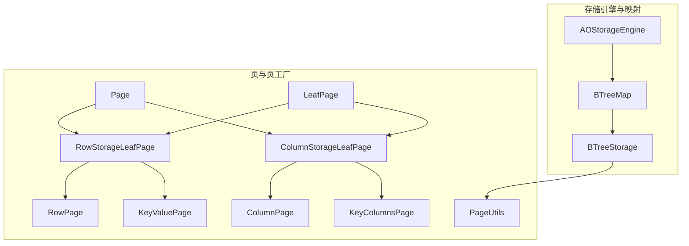
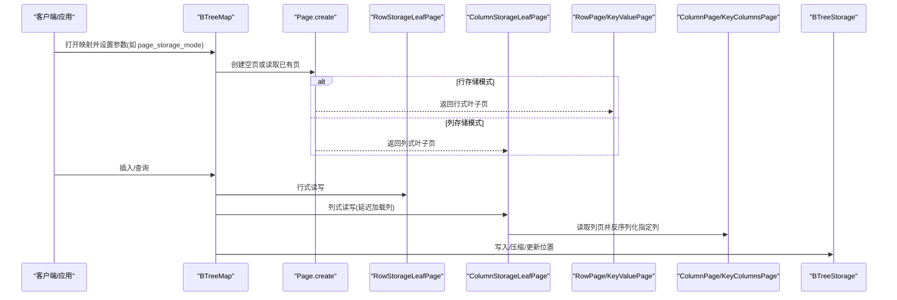
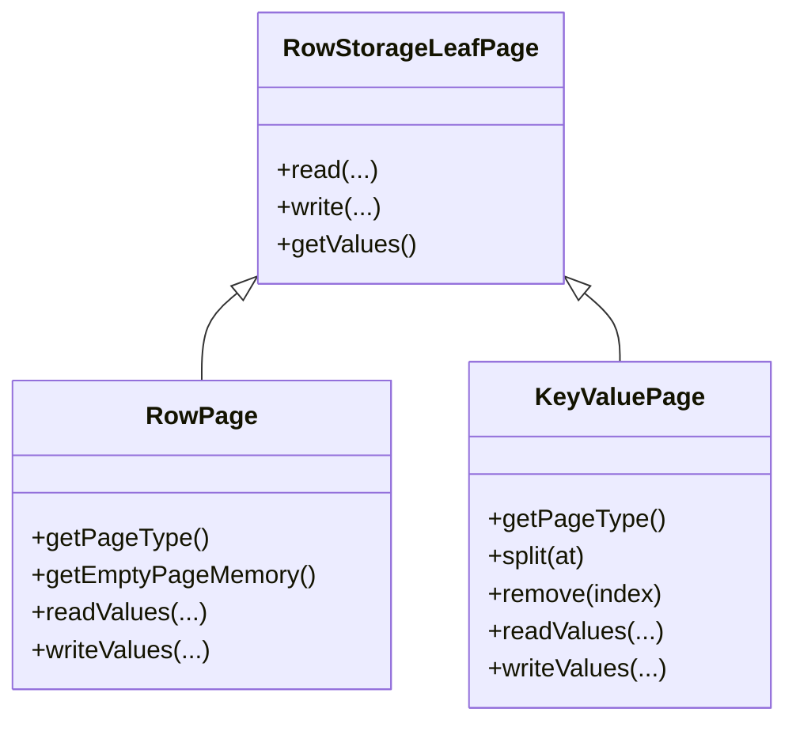
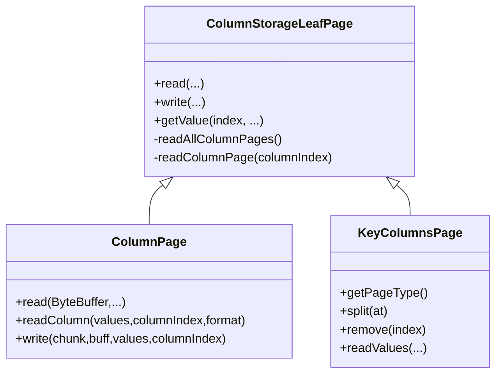
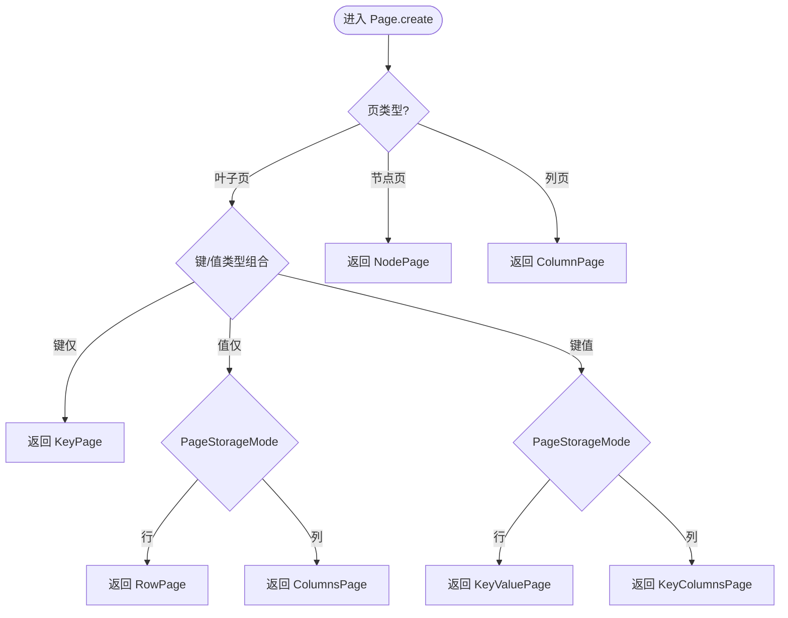
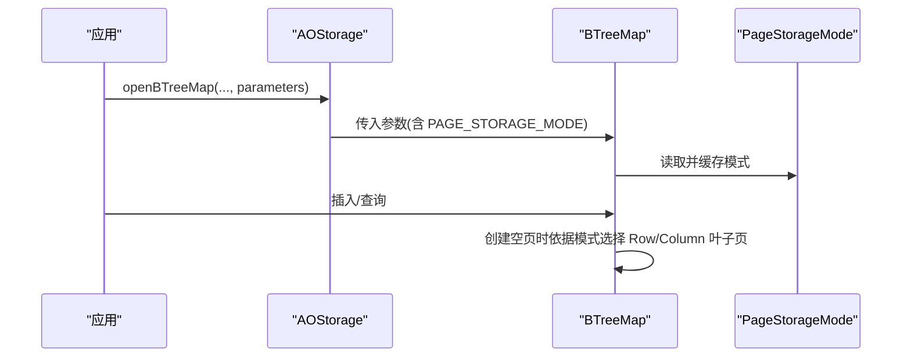
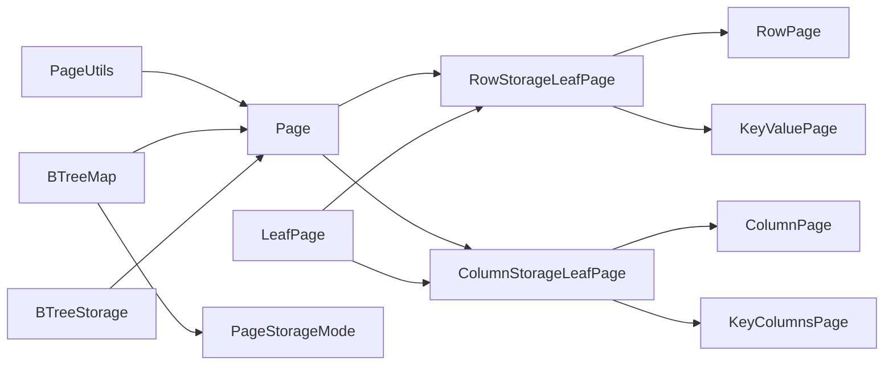

# 行列混合存储

<cite>
**本文引用的文件列表**
- [PageStorageMode.java](file://lealone-aose/src/main/java/com/lealone/storage/aose/btree/page/PageStorageMode.java)
- [Page.java](file://lealone-aose/src/main/java/com/lealone/storage/aose/btree/page/Page.java)
- [RowStorageLeafPage.java](file://lealone-aose/src/main/java/com/lealone/storage/aose/btree/page/RowStorageLeafPage.java)
- [ColumnStorageLeafPage.java](file://lealone-aose/src/main/java/com/lealone/storage/aose/btree/page/ColumnStorageLeafPage.java)
- [RowPage.java](file://lealone-aose/src/main/java/com/lealone/storage/aose/btree/page/RowPage.java)
- [ColumnPage.java](file://lealone-aose/src/main/java/com/lealone/storage/aose/btree/page/ColumnPage.java)
- [KeyValuePage.java](file://lealone-aose/src/main/java/com/lealone/storage/aose/btree/page/KeyValuePage.java)
- [KeyColumnsPage.java](file://lealone-aose/src/main/java/com/lealone/storage/aose/btree/page/KeyColumnsPage.java)
- [LeafPage.java](file://lealone-aose/src/main/java/com/lealone/storage/aose/btree/page/LeafPage.java)
- [PageUtils.java](file://lealone-aose/src/main/java/com/lealone/storage/aose/btree/page/PageUtils.java)
- [BTreeMap.java](file://lealone-aose/src/main/java/com/lealone/storage/aose/btree/BTreeMap.java)
- [BTreeStorage.java](file://lealone-aose/src/main/java/com/lealone/storage/aose/btree/BTreeStorage.java)
- [AOStorageEngine.java](file://lealone-aose/src/main/java/com/lealone/storage/aose/AOStorageEngine.java)
- [StorageSetting.java](file://lealone-sci/src/main/java/com/lealone/storage/StorageSetting.java)
- [PageStorageModeTest.java](file://lealone-test/src/test/java/com/lealone/test/aose/PageStorageModeTest.java)
- [PageStorageModeSqlTest.java](file://lealone-test/src/test/java/com/lealone/test/aose/PageStorageModeSqlTest.java)
</cite>

## 目录
1. [简介](#简介)
2. [项目结构](#项目结构)
3. [核心组件](#核心组件)
4. [架构总览](#架构总览)
5. [组件详解](#组件详解)
6. [依赖关系分析](#依赖关系分析)
7. [性能与适用场景](#性能与适用场景)
8. [故障排查指南](#故障排查指南)
9. [结论](#结论)
10. [附录：设计与优化建议](#附录设计与优化建议)

## 简介
本文件围绕 AOSE 存储引擎的“行列混合存储”模式展开，系统性阐述 PageStorageMode 枚举如何定义行存储、列存储两种模式，并结合 ColumnPage 与 RowPage 在不同模式下的数据结构与存储策略，给出基于查询模式选择最优存储模式的方法论，以及在运行时如何通过参数配置切换存储模式。文档还分析了 OLAP 与 OLTP 场景下的性能差异（查询效率、压缩比、I/O 开销），并提供面向开发者的表结构设计与优化建议。

## 项目结构
AOSE 的存储层位于 lealone-aose 模块，核心围绕 BTreeMap 与页级抽象 Page 及其子类实现。页类型由 PageUtils 统一编码，存储模式通过 PageStorageMode 枚举控制，Row/Column 两类叶子页分别承载行式与列式布局。

图表来源
- [AOStorageEngine.java](file://lealone-aose/src/main/java/com/lealone/storage/aose/AOStorageEngine.java#L1-L33)
- [BTreeMap.java](file://lealone-aose/src/main/java/com/lealone/storage/aose/btree/BTreeMap.java#L33-L120)
- [BTreeStorage.java](file://lealone-aose/src/main/java/com/lealone/storage/aose/btree/BTreeStorage.java#L1-L74)
- [Page.java](file://lealone-aose/src/main/java/com/lealone/storage/aose/btree/page/Page.java#L27-L52)
- [RowStorageLeafPage.java](file://lealone-aose/src/main/java/com/lealone/storage/aose/btree/page/RowStorageLeafPage.java#L1-L115)
- [ColumnStorageLeafPage.java](file://lealone-aose/src/main/java/com/lealone/storage/aose/btree/page/ColumnStorageLeafPage.java#L1-L220)
- [RowPage.java](file://lealone-aose/src/main/java/com/lealone/storage/aose/btree/page/RowPage.java#L1-L74)
- [KeyValuePage.java](file://lealone-aose/src/main/java/com/lealone/storage/aose/btree/page/KeyValuePage.java#L1-L91)
- [ColumnPage.java](file://lealone-aose/src/main/java/com/lealone/storage/aose/btree/page/ColumnPage.java#L1-L94)
- [KeyColumnsPage.java](file://lealone-aose/src/main/java/com/lealone/storage/aose/btree/page/KeyColumnsPage.java#L1-L80)
- [LeafPage.java](file://lealone-aose/src/main/java/com/lealone/storage/aose/btree/page/LeafPage.java#L151-L193)
- [PageUtils.java](file://lealone-aose/src/main/java/com/lealone/storage/aose/btree/page/PageUtils.java#L1-L94)

章节来源
- [AOStorageEngine.java](file://lealone-aose/src/main/java/com/lealone/storage/aose/AOStorageEngine.java#L1-L33)
- [BTreeMap.java](file://lealone-aose/src/main/java/com/lealone/storage/aose/btree/BTreeMap.java#L33-L120)
- [BTreeStorage.java](file://lealone-aose/src/main/java/com/lealone/storage/aose/btree/BTreeStorage.java#L1-L74)
- [Page.java](file://lealone-aose/src/main/java/com/lealone/storage/aose/btree/page/Page.java#L27-L52)
- [PageUtils.java](file://lealone-aose/src/main/java/com/lealone/storage/aose/btree/page/PageUtils.java#L1-L94)

## 核心组件
- PageStorageMode：定义存储模式枚举，当前包含 ROW_STORAGE 与 COLUMN_STORAGE。注意注释强调“顺序不可随意改动”，因为其他代码依赖其 ordinal。
- Page：页基类，提供通用读写、校验、压缩、更新等能力；在叶子页创建时依据模式与键/值类型选择具体页类型。
- RowStorageLeafPage：行式叶子页基类，按行序列化键与值，支持按需锁定。
- ColumnStorageLeafPage：列式叶子页基类，维护指向各列独立页的引用，延迟加载列数据。
- RowPage/KeyValuePage：行式叶子页的具体实现，键与值同页存储。
- ColumnPage/KeyColumnsPage：列式叶子页的具体实现，键与列页分离，列数据单独写入 ColumnPage。
- LeafPage：叶子页通用逻辑，含内存重算、复制、空页类型选择等。
- BTreeMap：持有 PageStorageMode 并在创建空页时根据该模式选择页类型。
- BTreeStorage：持久化存储管理，负责压缩级别、分块、GC 等。
- PageUtils：页位置编码与类型常量。

章节来源
- [PageStorageMode.java](file://lealone-aose/src/main/java/com/lealone/storage/aose/btree/page/PageStorageMode.java#L8-L13)
- [Page.java](file://lealone-aose/src/main/java/com/lealone/storage/aose/btree/page/Page.java#L27-L52)
- [RowStorageLeafPage.java](file://lealone-aose/src/main/java/com/lealone/storage/aose/btree/page/RowStorageLeafPage.java#L1-L115)
- [ColumnStorageLeafPage.java](file://lealone-aose/src/main/java/com/lealone/storage/aose/btree/page/ColumnStorageLeafPage.java#L1-L220)
- [RowPage.java](file://lealone-aose/src/main/java/com/lealone/storage/aose/btree/page/RowPage.java#L1-L74)
- [KeyValuePage.java](file://lealone-aose/src/main/java/com/lealone/storage/aose/btree/page/KeyValuePage.java#L1-L91)
- [ColumnPage.java](file://lealone-aose/src/main/java/com/lealone/storage/aose/btree/page/ColumnPage.java#L1-L94)
- [KeyColumnsPage.java](file://lealone-aose/src/main/java/com/lealone/storage/aose/btree/page/KeyColumnsPage.java#L1-L80)
- [LeafPage.java](file://lealone-aose/src/main/java/com/lealone/storage/aose/btree/page/LeafPage.java#L151-L193)
- [BTreeMap.java](file://lealone-aose/src/main/java/com/lealone/storage/aose/btree/BTreeMap.java#L33-L120)
- [BTreeStorage.java](file://lealone-aose/src/main/java/com/lealone/storage/aose/btree/BTreeStorage.java#L1-L74)
- [PageUtils.java](file://lealone-aose/src/main/java/com/lealone/storage/aose/btree/page/PageUtils.java#L1-L94)

## 架构总览
下图展示了 AOSE 中“行列混合存储”的整体架构：BTreeMap 作为映射入口，根据 PageStorageMode 与键/值类型在叶子页创建阶段选择 RowPage 或 ColumnsPage；列式模式下，键与每列分别存储在独立页中，按需延迟加载。

图表来源
- [Page.java](file://lealone-aose/src/main/java/com/lealone/storage/aose/btree/page/Page.java#L27-L52)
- [RowStorageLeafPage.java](file://lealone-aose/src/main/java/com/lealone/storage/aose/btree/page/RowStorageLeafPage.java#L42-L114)
- [ColumnStorageLeafPage.java](file://lealone-aose/src/main/java/com/lealone/storage/aose/btree/page/ColumnStorageLeafPage.java#L96-L219)
- [RowPage.java](file://lealone-aose/src/main/java/com/lealone/storage/aose/btree/page/RowPage.java#L1-L74)
- [KeyValuePage.java](file://lealone-aose/src/main/java/com/lealone/storage/aose/btree/page/KeyValuePage.java#L1-L91)
- [ColumnPage.java](file://lealone-aose/src/main/java/com/lealone/storage/aose/btree/page/ColumnPage.java#L1-L94)
- [KeyColumnsPage.java](file://lealone-aose/src/main/java/com/lealone/storage/aose/btree/page/KeyColumnsPage.java#L1-L80)
- [BTreeStorage.java](file://lealone-aose/src/main/java/com/lealone/storage/aose/btree/BTreeStorage.java#L1-L74)

## 组件详解

### PageStorageMode 与模式选择
- 枚举定义：ROW_STORAGE、COLUMN_STORAGE，顺序固定，依赖 ordinal。
- 选择机制：
  - 叶子页创建时，依据键/值类型与 PageStorageMode 的组合决定使用 RowPage 还是 ColumnsPage。
  - 空页创建时，同样依据 map.getPageStorageMode() 选择具体页类型。

章节来源
- [PageStorageMode.java](file://lealone-aose/src/main/java/com/lealone/storage/aose/btree/page/PageStorageMode.java#L8-L13)
- [Page.java](file://lealone-aose/src/main/java/com/lealone/storage/aose/btree/page/Page.java#L27-L52)
- [LeafPage.java](file://lealone-aose/src/main/java/com/lealone/storage/aose/btree/page/LeafPage.java#L180-L193)

### 行存储（RowPage/KeyValuePage）
- 数据结构：键数组与值数组同页存储，适合点查、范围扫描中需要整行数据的场景。
- 读写流程：
  - 读：先读页头、校验、解压，再分别读取键集合与值集合。
  - 写：写入键集合、值集合、元信息，支持压缩。
- 锁定：当值类型可锁定时，写入过程中检测是否已锁定，必要时标记页被锁定。

图表来源
- [RowStorageLeafPage.java](file://lealone-aose/src/main/java/com/lealone/storage/aose/btree/page/RowStorageLeafPage.java#L1-L115)
- [RowPage.java](file://lealone-aose/src/main/java/com/lealone/storage/aose/btree/page/RowPage.java#L1-L74)
- [KeyValuePage.java](file://lealone-aose/src/main/java/com/lealone/storage/aose/btree/page/KeyValuePage.java#L1-L91)

章节来源
- [RowStorageLeafPage.java](file://lealone-aose/src/main/java/com/lealone/storage/aose/btree/page/RowStorageLeafPage.java#L42-L114)
- [RowPage.java](file://lealone-aose/src/main/java/com/lealone/storage/aose/btree/page/RowPage.java#L1-L74)
- [KeyValuePage.java](file://lealone-aose/src/main/java/com/lealone/storage/aose/btree/page/KeyValuePage.java#L1-L91)

### 列存储（ColumnPage/KeyColumnsPage）与延迟加载
- 数据结构：列式存储，键数组与列页分离。每个列独立存储在一个 ColumnPage 中，列页仅在需要时才反序列化。
- 读写流程：
  - 读：先读键数组与列页位置列表，按需读取列页并反序列化对应列；支持压缩。
  - 写：先写入键数组与列元信息，随后为每一列创建 ColumnPage 并写入对应列数据，最后回填列页位置。
- 延迟加载：getValue(index, columnIndexes/allColumns) 时才触发列页读取，避免全量列数据的无谓 IO。

图表来源
- [ColumnStorageLeafPage.java](file://lealone-aose/src/main/java/com/lealone/storage/aose/btree/page/ColumnStorageLeafPage.java#L1-L220)
- [ColumnPage.java](file://lealone-aose/src/main/java/com/lealone/storage/aose/btree/page/ColumnPage.java#L1-L94)
- [KeyColumnsPage.java](file://lealone-aose/src/main/java/com/lealone/storage/aose/btree/page/KeyColumnsPage.java#L1-L80)

章节来源
- [ColumnStorageLeafPage.java](file://lealone-aose/src/main/java/com/lealone/storage/aose/btree/page/ColumnStorageLeafPage.java#L33-L126)
- [ColumnPage.java](file://lealone-aose/src/main/java/com/lealone/storage/aose/btree/page/ColumnPage.java#L31-L94)
- [KeyColumnsPage.java](file://lealone-aose/src/main/java/com/lealone/storage/aose/btree/page/KeyColumnsPage.java#L1-L80)

### 页工厂与页类型选择
- Page.create：根据页类型与 PageStorageMode 的组合返回 RowPage/KeyValuePage/ColumnPage/KeyColumnsPage 等具体页实例。
- 叶子页空页创建：LeafPage.createEmpty 根据键/值类型与 map.getPageStorageMode() 选择页类型。

图表来源
- [Page.java](file://lealone-aose/src/main/java/com/lealone/storage/aose/btree/page/Page.java#L27-L52)
- [LeafPage.java](file://lealone-aose/src/main/java/com/lealone/storage/aose/btree/page/LeafPage.java#L180-L193)

章节来源
- [Page.java](file://lealone-aose/src/main/java/com/lealone/storage/aose/btree/page/Page.java#L27-L52)
- [LeafPage.java](file://lealone-aose/src/main/java/com/lealone/storage/aose/btree/page/LeafPage.java#L180-L193)

### 运行时切换存储模式
- 参数配置：通过 StorageSetting.PAGE_STORAGE_MODE 设置为 ROW_STORAGE 或 COLUMN_STORAGE。
- SQL 层面：在建表语句中通过 PARAMETERS(page_storage_mode='...') 指定。
- 测试验证：单元测试覆盖了两种模式的 CRUD 与游标遍历。

图表来源
- [StorageSetting.java](file://lealone-sci/src/main/java/com/lealone/storage/StorageSetting.java#L8-L18)
- [PageStorageModeTest.java](file://lealone-test/src/test/java/com/lealone/test/aose/PageStorageModeTest.java#L52-L74)
- [PageStorageModeSqlTest.java](file://lealone-test/src/test/java/com/lealone/test/aose/PageStorageModeSqlTest.java#L56-L80)

章节来源
- [StorageSetting.java](file://lealone-sci/src/main/java/com/lealone/storage/StorageSetting.java#L8-L18)
- [PageStorageModeTest.java](file://lealone-test/src/test/java/com/lealone/test/aose/PageStorageModeTest.java#L52-L74)
- [PageStorageModeSqlTest.java](file://lealone-test/src/test/java/com/lealone/test/aose/PageStorageModeSqlTest.java#L56-L80)

## 依赖关系分析
- Page 与 PageUtils：页类型常量、位置编码、压缩标志位。
- RowStorageLeafPage/ColumnStorageLeafPage：继承自 LeafPage，复用内存重算、复制等通用逻辑。
- ColumnStorageLeafPage 与 ColumnPage：通过 PageReference 引用列页，实现延迟加载。
- BTreeMap 与 PageStorageMode：在空页创建与页类型选择中使用。
- BTreeStorage：提供压缩器、分块管理、GC 等基础设施。

图表来源
- [PageUtils.java](file://lealone-aose/src/main/java/com/lealone/storage/aose/btree/page/PageUtils.java#L1-L94)
- [Page.java](file://lealone-aose/src/main/java/com/lealone/storage/aose/btree/page/Page.java#L27-L52)
- [RowStorageLeafPage.java](file://lealone-aose/src/main/java/com/lealone/storage/aose/btree/page/RowStorageLeafPage.java#L1-L115)
- [ColumnStorageLeafPage.java](file://lealone-aose/src/main/java/com/lealone/storage/aose/btree/page/ColumnStorageLeafPage.java#L1-L220)
- [RowPage.java](file://lealone-aose/src/main/java/com/lealone/storage/aose/btree/page/RowPage.java#L1-L74)
- [KeyValuePage.java](file://lealone-aose/src/main/java/com/lealone/storage/aose/btree/page/KeyValuePage.java#L1-L91)
- [ColumnPage.java](file://lealone-aose/src/main/java/com/lealone/storage/aose/btree/page/ColumnPage.java#L1-L94)
- [KeyColumnsPage.java](file://lealone-aose/src/main/java/com/lealone/storage/aose/btree/page/KeyColumnsPage.java#L1-L80)
- [LeafPage.java](file://lealone-aose/src/main/java/com/lealone/storage/aose/btree/page/LeafPage.java#L151-L193)
- [BTreeMap.java](file://lealone-aose/src/main/java/com/lealone/storage/aose/btree/BTreeMap.java#L33-L120)
- [BTreeStorage.java](file://lealone-aose/src/main/java/com/lealone/storage/aose/btree/BTreeStorage.java#L1-L74)

## 性能与适用场景
- OLTP（在线事务处理）：
  - 特征：点查、少量列读取、高并发写入。
  - 推荐：行存储（RowPage/KeyValuePage）。原因：
    - 同页存储键与值，读取整行代价低，减少随机 IO。
    - 写入时可按行序列化，便于锁定与一致性控制。
- OLAP（在线分析处理）：
  - 特征：宽表、列裁剪、聚合查询、扫描大表。
  - 推荐：列存储（ColumnPage/KeyColumnsPage）。原因：
    - 列式压缩更高效，尤其对重复值、数值型列。
    - 按需延迟加载列，避免全表列扫描带来的 I/O 压力。
    - 与压缩器配合，显著降低磁盘占用与网络传输。
- 压缩与 I/O：
  - Page.compressPage/expandPage 提供压缩与解压路径，BTreeStorage 维护压缩器实例，按配置级别启用。
  - ColumnStorageLeafPage.write 在写入列页时逐列写入，结合压缩提升空间利用率。
- 内存与延迟：
  - ColumnPage.readColumn 在首次读取某列时计算并登记内存占用，避免重复反序列化。
  - RowStorageLeafPage.read 在读取后删除空值记录，减少无效数据占用。

章节来源
- [RowStorageLeafPage.java](file://lealone-aose/src/main/java/com/lealone/storage/aose/btree/page/RowStorageLeafPage.java#L42-L114)
- [ColumnStorageLeafPage.java](file://lealone-aose/src/main/java/com/lealone/storage/aose/btree/page/ColumnStorageLeafPage.java#L96-L219)
- [ColumnPage.java](file://lealone-aose/src/main/java/com/lealone/storage/aose/btree/page/ColumnPage.java#L46-L94)
- [BTreeStorage.java](file://lealone-aose/src/main/java/com/lealone/storage/aose/btree/BTreeStorage.java#L1-L74)
- [Page.java](file://lealone-aose/src/main/java/com/lealone/storage/aose/btree/page/Page.java#L308-L377)

## 故障排查指南
- 文件损坏校验：
  - Page.readCheckValue/Page.checkPageLength 在读取页时进行校验，若校验失败抛出异常，提示 chunk、期望长度等信息。
- 压缩相关问题：
  - 若压缩级别设置不当或压缩器初始化异常，可能导致写入失败或读取异常。可通过 BTreeStorage 的压缩器配置检查。
- 列式延迟加载异常：
  - ColumnPage.readColumn 需确保列页引用有效且格式版本匹配；若列页未读取或格式不一致，可能造成空值或数据错乱。
- 锁定与并发：
  - RowStorageLeafPage.writeValues 在值类型可锁定时会检测并标记页是否被锁定，避免并发写入冲突。

章节来源
- [Page.java](file://lealone-aose/src/main/java/com/lealone/storage/aose/btree/page/Page.java#L282-L307)
- [BTreeStorage.java](file://lealone-aose/src/main/java/com/lealone/storage/aose/btree/BTreeStorage.java#L1-L74)
- [ColumnPage.java](file://lealone-aose/src/main/java/com/lealone/storage/aose/btree/page/ColumnPage.java#L46-L94)
- [RowStorageLeafPage.java](file://lealone-aose/src/main/java/com/lealone/storage/aose/btree/page/RowStorageLeafPage.java#L81-L114)

## 结论
AOSE 的行列混合存储通过 PageStorageMode 枚举与 Page 工厂机制，在同一映射上灵活切换行/列存储模式。行存储适合 OLTP 的点查与少量列读取，列存储适合 OLAP 的宽表与列裁剪场景。通过延迟加载、压缩与内存重算等机制，系统在查询效率、压缩比与 I/O 开销之间取得平衡。开发者应根据查询模式与数据特征选择合适的存储模式，并在建表时通过参数明确配置。

## 附录：设计与优化建议
- 选择策略
  - 以查询模式为主导：点查/少量列读取优先行存储；宽表/列裁剪/聚合查询优先列存储。
  - 列数量较多且存在大量重复值时，列存储通常具备更好压缩比与更低 I/O。
- 参数配置
  - 使用 StorageSetting.PAGE_STORAGE_MODE 指定存储模式。
  - 通过 BTreeStorage 的压缩级别与页大小参数调优，平衡写放大与压缩效果。
- 表结构设计
  - 将热点列与频繁过滤列置于键侧，有利于索引与页内聚。
  - 对长文本、大对象采用 LOB 存储或外部存储策略，避免影响页内数据布局。
- 运行维护
  - 定期执行保存与 GC，保持页健康度与空间利用率。
  - 观察列页延迟加载命中率，避免不必要的列读取导致的抖动。