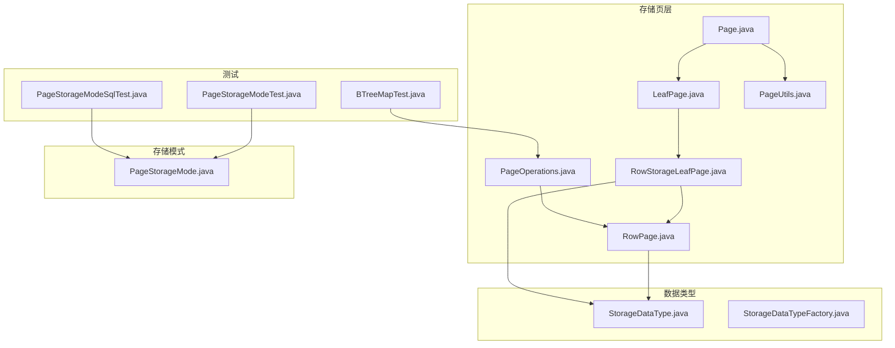
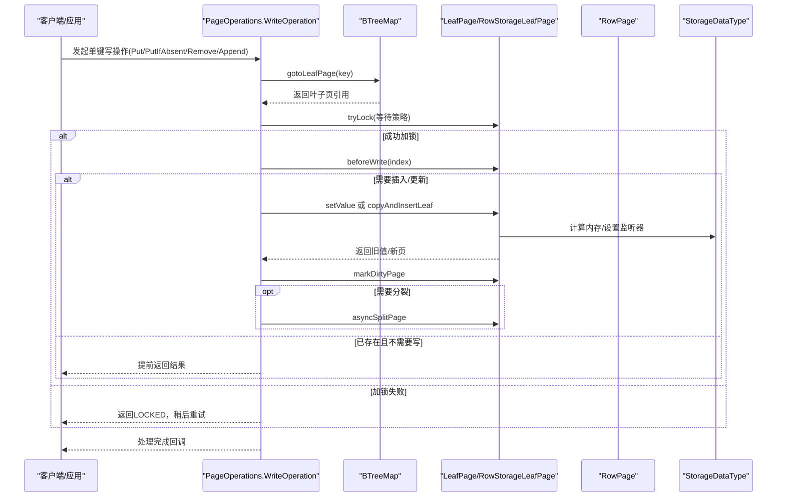
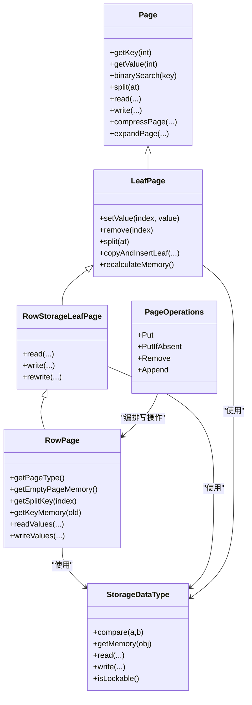
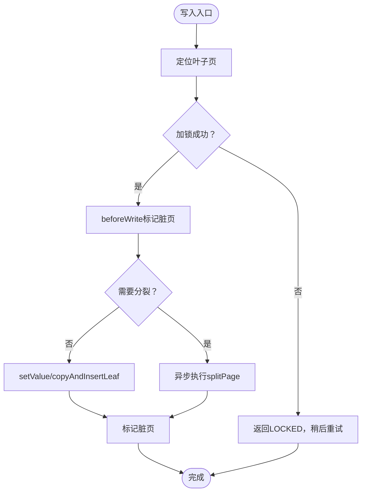

# 行式存储实现

<cite>
**本文引用的文件列表**
- [RowPage.java](file://lealone-aose/src/main/java/com/lealone/storage/aose/btree/page/RowPage.java)
- [RowStorageLeafPage.java](file://lealone-aose/src/main/java/com/lealone/storage/aose/btree/page/RowStorageLeafPage.java)
- [LeafPage.java](file://lealone-aose/src/main/java/com/lealone/storage/aose/btree/page/LeafPage.java)
- [Page.java](file://lealone-aose/src/main/java/com/lealone/storage/aose/btree/page/Page.java)
- [PageOperations.java](file://lealone-aose/src/main/java/com/lealone/storage/aose/btree/page/PageOperations.java)
- [PageUtils.java](file://lealone-aose/src/main/java/com/lealone/storage/aose/btree/page/PageUtils.java)
- [PageStorageMode.java](file://lealone-aose/src/main/java/com/lealone/storage/aose/btree/page/PageStorageMode.java)
- [StorageDataType.java](file://lealone-sci/src/main/java/com/lealone/storage/type/StorageDataType.java)
- [StorageDataTypeFactory.java](file://lealone-sci/src/main/java/com/lealone/storage/type/StorageDataTypeFactory.java)
- [BTreeMapTest.java](file://lealone-test/src/test/java/com/lealone/test/aose/BTreeMapTest.java)
- [PageStorageModeTest.java](file://lealone-test/src/test/java/com/lealone/test/aose/PageStorageModeTest.java)
- [PageStorageModeSqlTest.java](file://lealone-test/src/test/java/com/lealone/test/aose/PageStorageModeSqlTest.java)
</cite>

## 目录
1. [简介](#简介)
2. [项目结构](#项目结构)
3. [核心组件](#核心组件)
4. [架构总览](#架构总览)
5. [组件详解](#组件详解)
6. [依赖关系分析](#依赖关系分析)
7. [性能考量](#性能考量)
8. [故障排查指南](#故障排查指南)
9. [结论](#结论)
10. [附录](#附录)

## 简介
本文件聚焦于Lealone存储引擎中“行式存储”（Row Storage）的实现机制，围绕RowPage类展开，系统性解析其在B-Tree页结构中的角色、数据组织方式、记录布局与访问模式，并结合OLTP场景下的点查询与事务处理，说明其如何通过减少随机I/O、优化单条记录读写路径、降低锁竞争与页分裂成本，从而在高并发写入场景下获得高性能表现。同时提供基于测试用例的实际案例，展示行式存储在CRUD与并发写入中的优势。

## 项目结构
与行式存储实现直接相关的模块位于AOSE（AO Storage Engine）子系统，核心文件分布如下：
- 存储页层：Page、LeafPage、RowStorageLeafPage、RowPage、PageOperations、PageUtils
- 存储模式：PageStorageMode（枚举）
- 数据类型接口：StorageDataType及其工厂类
- 测试用例：BTreeMapTest、PageStorageModeTest、PageStorageModeSqlTest

图表来源
- [Page.java](file://lealone-aose/src/main/java/com/lealone/storage/aose/btree/page/Page.java#L1-L120)
- [LeafPage.java](file://lealone-aose/src/main/java/com/lealone/storage/aose/btree/page/LeafPage.java#L1-L120)
- [RowStorageLeafPage.java](file://lealone-aose/src/main/java/com/lealone/storage/aose/btree/page/RowStorageLeafPage.java#L1-L115)
- [RowPage.java](file://lealone-aose/src/main/java/com/lealone/storage/aose/btree/page/RowPage.java#L1-L74)
- [PageOperations.java](file://lealone-aose/src/main/java/com/lealone/storage/aose/btree/page/PageOperations.java#L1-L180)
- [PageUtils.java](file://lealone-aose/src/main/java/com/lealone/storage/aose/btree/page/PageUtils.java#L1-L94)
- [PageStorageMode.java](file://lealone-aose/src/main/java/com/lealone/storage/aose/btree/page/PageStorageMode.java#L1-L13)
- [StorageDataType.java](file://lealone-sci/src/main/java/com/lealone/storage/type/StorageDataType.java#L1-L200)
- [StorageDataTypeFactory.java](file://lealone-sci/src/main/java/com/lealone/storage/type/StorageDataTypeFactory.java#L49-L93)
- [BTreeMapTest.java](file://lealone-test/src/test/java/com/lealone/test/aose/BTreeMapTest.java#L150-L279)
- [PageStorageModeTest.java](file://lealone-test/src/test/java/com/lealone/test/aose/PageStorageModeTest.java#L1-L75)
- [PageStorageModeSqlTest.java](file://lealone-test/src/test/java/com/lealone/test/aose/PageStorageModeSqlTest.java#L1-L46)

章节来源
- [RowPage.java](file://lealone-aose/src/main/java/com/lealone/storage/aose/btree/page/RowPage.java#L1-L74)
- [RowStorageLeafPage.java](file://lealone-aose/src/main/java/com/lealone/storage/aose/btree/page/RowStorageLeafPage.java#L1-L115)
- [LeafPage.java](file://lealone-aose/src/main/java/com/lealone/storage/aose/btree/page/LeafPage.java#L1-L260)
- [Page.java](file://lealone-aose/src/main/java/com/lealone/storage/aose/btree/page/Page.java#L1-L378)
- [PageOperations.java](file://lealone-aose/src/main/java/com/lealone/storage/aose/btree/page/PageOperations.java#L1-L521)
- [PageUtils.java](file://lealone-aose/src/main/java/com/lealone/storage/aose/btree/page/PageUtils.java#L1-L94)
- [PageStorageMode.java](file://lealone-aose/src/main/java/com/lealone/storage/aose/btree/page/PageStorageMode.java#L1-L13)
- [StorageDataType.java](file://lealone-sci/src/main/java/com/lealone/storage/type/StorageDataType.java#L1-L200)
- [StorageDataTypeFactory.java](file://lealone-sci/src/main/java/com/lealone/storage/type/StorageDataTypeFactory.java#L49-L93)
- [BTreeMapTest.java](file://lealone-test/src/test/java/com/lealone/test/aose/BTreeMapTest.java#L150-L279)
- [PageStorageModeTest.java](file://lealone-test/src/test/java/com/lealone/test/aose/PageStorageModeTest.java#L1-L75)
- [PageStorageModeSqlTest.java](file://lealone-test/src/test/java/com/lealone/test/aose/PageStorageModeSqlTest.java#L1-L46)

## 核心组件
- RowPage：行式叶子页的具体实现，负责键数组与值数组的统一管理，支持按记录粒度的读写与内存估算。
- RowStorageLeafPage：行式叶子页抽象基类，定义了行式存储的通用读写流程、键值序列化/反序列化、页内存重计算与空记录清理。
- LeafPage：叶子页抽象，提供复制、插入、删除、拆分等通用操作，以及内存管理与监听器设置。
- Page：页抽象，定义页的基本接口、二分查找、分裂、压缩/解压、校验值写入/读取、块更新等。
- PageOperations：单键写操作的统一编排器，包含Put、PutIfAbsent、Remove、Append等，负责定位叶子页、加锁、标记脏页、异步分裂/删除等。
- PageStorageMode：存储模式枚举，区分行式与列式两种存储策略。
- StorageDataType：存储数据类型的接口，提供比较、内存估算、序列化/反序列化等能力，行式存储在写入时会根据值类型进行内存估算与锁绑定。

章节来源
- [RowPage.java](file://lealone-aose/src/main/java/com/lealone/storage/aose/btree/page/RowPage.java#L1-L74)
- [RowStorageLeafPage.java](file://lealone-aose/src/main/java/com/lealone/storage/aose/btree/page/RowStorageLeafPage.java#L1-L115)
- [LeafPage.java](file://lealone-aose/src/main/java/com/lealone/storage/aose/btree/page/LeafPage.java#L1-L260)
- [Page.java](file://lealone-aose/src/main/java/com/lealone/storage/aose/btree/page/Page.java#L1-L378)
- [PageOperations.java](file://lealone-aose/src/main/java/com/lealone/storage/aose/btree/page/PageOperations.java#L1-L521)
- [PageStorageMode.java](file://lealone-aose/src/main/java/com/lealone/storage/aose/btree/page/PageStorageMode.java#L1-L13)
- [StorageDataType.java](file://lealone-sci/src/main/java/com/lealone/storage/type/StorageDataType.java#L1-L200)

## 架构总览
行式存储在Lealone中通过“键数组+值数组”的统一布局，将每个记录作为一个整体进行序列化与反序列化，从而在点查询与事务处理中实现低开销的单条记录访问。写操作由PageOperations统一编排，配合轻量级锁与异步页分裂/删除，减少阻塞时间；读操作通过LeafPage的二分查找与RowStorageLeafPage的统一读取流程，快速定位并返回记录。

图表来源
- [PageOperations.java](file://lealone-aose/src/main/java/com/lealone/storage/aose/btree/page/PageOperations.java#L1-L200)
- [LeafPage.java](file://lealone-aose/src/main/java/com/lealone/storage/aose/btree/page/LeafPage.java#L1-L120)
- [RowStorageLeafPage.java](file://lealone-aose/src/main/java/com/lealone/storage/aose/btree/page/RowStorageLeafPage.java#L1-L115)
- [RowPage.java](file://lealone-aose/src/main/java/com/lealone/storage/aose/btree/page/RowPage.java#L1-L74)
- [StorageDataType.java](file://lealone-sci/src/main/java/com/lealone/storage/type/StorageDataType.java#L1-L200)

## 组件详解

### RowPage：行式叶子页实现
- 角色与职责
  - 作为行式叶子页的具体实现，RowPage继承自RowStorageLeafPage，专注于键数组与值数组的统一布局与读写。
  - 提供页类型标识、空页内存估算、键拆分键计算、值序列化/反序列化、写入时的锁状态检测等。
- 关键实现要点
  - 页类型与内存估算：通过常量PAGE_MEMORY给出空页内存估算，用于缓存与GC统计。
  - 键拆分键：基于键类型计算拆分键，确保B-Tree平衡。
  - 值读写：委托StorageDataType对值进行读写，并在写入时检测是否可锁（isLockable），若值实现了可锁接口则在写入时标记页面为“已锁定”，便于后续事务一致性。
  - 与键类型的关系：在内存估算与拆分键计算中，也会参考值类型（如值类型参与内存估算），体现行式存储中键值一体化的特性。

章节来源
- [RowPage.java](file://lealone-aose/src/main/java/com/lealone/storage/aose/btree/page/RowPage.java#L1-L74)

### RowStorageLeafPage：行式叶子页抽象
- 角色与职责
  - 定义行式存储的通用读写流程：键数组与值数组的统一序列化/反序列化、页内存重计算、空记录清理、压缩/解压、校验值写入/读取等。
- 关键实现要点
  - 读取流程：从缓冲区读取页长度、模式、键长度、键数组、值数组，随后根据格式版本进行扩展与解压，最后清理空记录（值为空或锁对象为空）。
  - 写入流程：写入页头、键数组、值数组，期间检测是否出现“已锁定”状态，若出现则标记页面为“已锁定”，以便上层事务处理。
  - 内存管理：在读取后调用recalculateMemory进行内存重计算；写入时根据键/值类型估算内存变化并更新。
  - 重写：提供rewrite方法，用于兼容旧格式页的重写与校验值更新。

章节来源
- [RowStorageLeafPage.java](file://lealone-aose/src/main/java/com/lealone/storage/aose/btree/page/RowStorageLeafPage.java#L1-L115)

### LeafPage：叶子页抽象
- 角色与职责
  - 提供叶子页的通用操作：setValue、remove、split、copyAndInsertLeaf、内存重计算、复制与监听器设置等。
- 关键实现要点
  - setValue：更新指定索引的值，计算内存差额并设置值的监听器（若值类型可锁）。
  - remove：删除指定索引的键与值，维护全局计数器。
  - split：按中点拆分键数组，形成左右两页。
  - copyAndInsertLeaf：在复制后插入新键值，维护全局计数器与内存估算。
  - setPageListener：当值类型可锁时，为值设置页锁或锁监听器，确保并发一致性。
  - recalculateMemory：综合键与值类型估算内存，更新页内存。
  - createEmpty/create：根据配置创建不同类型的叶子页（KeyPage、RowPage、ColumnsPage、KeyValuePage、KeyColumnsPage）。

章节来源
- [LeafPage.java](file://lealone-aose/src/main/java/com/lealone/storage/aose/btree/page/LeafPage.java#L1-L260)

### Page：页抽象
- 角色与职责
  - 定义页的通用接口：键/值访问、二分查找、分裂、复制、读写、压缩/解压、校验值、块更新等。
- 关键实现要点
  - 二分查找与页索引：binarySearch与getIndex用于定位目标子页或插入位置。
  - 分裂：split将当前页按at位置拆分为左右两部分，返回右侧新页。
  - 压缩/解压：compressPage与expandPage支持快/高压缩级别，减少磁盘占用与I/O。
  - 校验值：readCheckValue/writeCheckValue用于页完整性校验，防止文件损坏。
  - 块更新：updateChunk/updateChunkAndPage负责将页写入块并更新元数据。

章节来源
- [Page.java](file://lealone-aose/src/main/java/com/lealone/storage/aose/btree/page/Page.java#L1-L378)

### PageOperations：单键写操作编排
- 角色与职责
  - 统一编排单键写操作（Put、PutIfAbsent、Remove、Append），负责定位叶子页、加锁、标记脏页、异步分裂/删除、结果回调等。
- 关键实现要点
  - 定位叶子页：gotoLeafPage定位到目标叶子页，避免重复定位。
  - 加锁策略：tryLock支持等待策略，失败返回LOCKED，交由调度器重试。
  - 标记脏页：beforeWrite在内存映射或标记脏页成功后才执行写操作，失败则重试。
  - 插入/更新：insertLeaf/copyAndInsertLeaf在复制后插入新键值，维护全局计数器与内存估算。
  - 删除：copy后删除元素，若页为空且非根页则异步删除该页并可能触发父节点删除或再次分裂。
  - 分裂：needSplit时异步执行splitPage，必要时向上递归触发父节点分裂。
  - Append：直接定位到最后一页，自增最大键并插入新记录，适合高并发追加场景。

章节来源
- [PageOperations.java](file://lealone-aose/src/main/java/com/lealone/storage/aose/btree/page/PageOperations.java#L1-L521)

### PageStorageMode：存储模式
- 角色与职责
  - 枚举定义两种存储模式：ROW_STORAGE（行式）、COLUMN_STORAGE（列式），用于选择不同的页类型与序列化策略。
- 关键实现要点
  - LeafPage.createEmpty/create根据模式与键/值类型组合选择具体页类型，确保行式存储在键值一体化场景下的高效访问。

章节来源
- [PageStorageMode.java](file://lealone-aose/src/main/java/com/lealone/storage/aose/btree/page/PageStorageMode.java#L1-L13)
- [LeafPage.java](file://lealone-aose/src/main/java/com/lealone/storage/aose/btree/page/LeafPage.java#L180-L238)

### StorageDataType：数据类型接口
- 角色与职责
  - 提供数据类型的基础能力：比较、内存估算、序列化/反序列化、值读写等。
- 关键实现要点
  - 行式存储在写入时会调用值类型的内存估算与序列化方法，确保页内存统计准确与持久化正确。
  - isLockable用于判断值是否可锁，RowStorageLeafPage/LeafPage在设置监听器时会利用此能力。

章节来源
- [StorageDataType.java](file://lealone-sci/src/main/java/com/lealone/storage/type/StorageDataType.java#L1-L200)
- [StorageDataTypeFactory.java](file://lealone-sci/src/main/java/com/lealone/storage/type/StorageDataTypeFactory.java#L49-L93)
- [RowStorageLeafPage.java](file://lealone-aose/src/main/java/com/lealone/storage/aose/btree/page/RowStorageLeafPage.java#L79-L115)
- [LeafPage.java](file://lealone-aose/src/main/java/com/lealone/storage/aose/btree/page/LeafPage.java#L125-L170)

## 依赖关系分析
- 类层次关系
  - Page为抽象基类，LeafPage继承Page，RowStorageLeafPage继承LeafPage，RowPage继承RowStorageLeafPage。
  - PageOperations为写操作编排器，依赖LeafPage/RowStorageLeafPage/RowPage等实现具体逻辑。
  - StorageDataType为值类型抽象，被RowPage/RowStorageLeafPage/LeafPage广泛使用。
- 依赖耦合
  - RowPage/RowStorageLeafPage与StorageDataType强耦合，用于值的序列化、内存估算与锁绑定。
  - PageOperations与LeafPage紧密耦合，负责加锁、标记脏页、复制与分裂等。
  - Page与PageUtils配合，提供压缩/解压、块更新、位置编码等底层能力。
- 潜在循环依赖
  - 未发现循环依赖，各层职责清晰：抽象层（Page/LeafPage）→具体实现（RowStorageLeafPage/RowPage）→编排层（PageOperations）→类型层（StorageDataType）。

图表来源
- [Page.java](file://lealone-aose/src/main/java/com/lealone/storage/aose/btree/page/Page.java#L1-L378)
- [LeafPage.java](file://lealone-aose/src/main/java/com/lealone/storage/aose/btree/page/LeafPage.java#L1-L260)
- [RowStorageLeafPage.java](file://lealone-aose/src/main/java/com/lealone/storage/aose/btree/page/RowStorageLeafPage.java#L1-L115)
- [RowPage.java](file://lealone-aose/src/main/java/com/lealone/storage/aose/btree/page/RowPage.java#L1-L74)
- [PageOperations.java](file://lealone-aose/src/main/java/com/lealone/storage/aose/btree/page/PageOperations.java#L1-L521)
- [StorageDataType.java](file://lealone-sci/src/main/java/com/lealone/storage/type/StorageDataType.java#L1-L200)

## 性能考量

### 行式存储在OLTP中的优势
- 单条记录的读取与更新
  - 行式存储将键与值作为一个整体进行序列化与反序列化，读取时通过二分查找快速定位记录，避免列式存储中多列拼接的额外开销。
  - 写入时，RowPage/RowStorageLeafPage在写入值的同时检测是否可锁，若值可锁则标记页面为“已锁定”，有助于事务一致性与减少冲突。
- 减少随机I/O
  - 页内键值一体化布局，使得单条记录的读写集中在页内顺序扫描与定位，减少跨页随机I/O。
  - Page.compressPage/expandPage支持压缩，进一步降低磁盘I/O与网络传输成本。
- 事务处理中的高性能
  - PageOperations采用轻量级锁与异步分裂/删除，写操作完成后快速释放锁，减少阻塞时间。
  - Append操作直接定位到最后一页并自增最大键，适合高并发写入场景，减少热点页竞争。

### 优化机制与算法流程
- 写入流程（Put/Update）
  - 定位叶子页 → 尝试加锁 → beforeWrite标记脏页 → setValue或copyAndInsertLeaf → 标记脏页 → 若需分裂则异步分裂。
- 删除流程
  - 定位叶子页 → 尝试加锁 → beforeWrite → copy后删除 → 若页为空且非根则异步删除该页 → 可能触发父节点删除或再次分裂。
- 分裂流程
  - 需要分裂时，先复制当前页，按中点拆分，返回右侧新页，然后创建父节点并替换父子关系，必要时继续向上分裂。

图表来源
- [PageOperations.java](file://lealone-aose/src/main/java/com/lealone/storage/aose/btree/page/PageOperations.java#L72-L160)
- [LeafPage.java](file://lealone-aose/src/main/java/com/lealone/storage/aose/btree/page/LeafPage.java#L95-L123)

### 实际案例：高并发写入场景
- 测试用例验证
  - BTreeMapTest中通过大量并发Put操作验证行式存储在高并发写入场景下的稳定性与一致性，最终断言size与预期一致。
  - PageStorageModeTest与PageStorageModeSqlTest展示了行式存储在CRUD与列访问中的正确性与性能表现。
- 场景特征
  - 大量短事务、高频点查询与更新、少量删除与分裂。
  - Append操作在高并发写入中尤为高效，避免热点页竞争。

章节来源
- [BTreeMapTest.java](file://lealone-test/src/test/java/com/lealone/test/aose/BTreeMapTest.java#L150-L279)
- [PageStorageModeTest.java](file://lealone-test/src/test/java/com/lealone/test/aose/PageStorageModeTest.java#L1-L75)
- [PageStorageModeSqlTest.java](file://lealone-test/src/test/java/com/lealone/test/aose/PageStorageModeSqlTest.java#L1-L46)

## 故障排查指南
- 页完整性校验失败
  - Page.readCheckValue/writeCheckValue用于页完整性校验，若校验失败，通常表示页损坏或块元数据异常。建议检查磁盘与块管理器状态。
- 写入锁失败
  - PageOperations在加锁失败时返回LOCKED，应通过调度器重试；若持续失败，检查锁竞争与页结构变更。
- 分裂与删除异常
  - 分裂/删除操作为异步执行，若出现父节点为空或根节点异常，检查父节点锁与结构变更。
- 压缩/解压问题
  - 若压缩级别设置不当或压缩数据损坏，可能导致expandPage失败。建议调整压缩级别或恢复备份。

章节来源
- [Page.java](file://lealone-aose/src/main/java/com/lealone/storage/aose/btree/page/Page.java#L282-L335)
- [PageOperations.java](file://lealone-aose/src/main/java/com/lealone/storage/aose/btree/page/PageOperations.java#L283-L461)

## 结论
RowPage与RowStorageLeafPage通过“键数组+值数组”的行式布局，结合PageOperations的轻量级锁与异步分裂/删除机制，有效降低了OLTP场景下单条记录的读写开销与随机I/O。在高并发写入场景中，Append与批量Put操作能够充分利用行式存储的一体化布局与内存估算能力，显著提升吞吐量与响应时间。配合压缩与页完整性校验，行式存储在可靠性与性能之间取得良好平衡。

## 附录
- 相关测试用例路径
  - [BTreeMapTest.java](file://lealone-test/src/test/java/com/lealone/test/aose/BTreeMapTest.java#L150-L279)
  - [PageStorageModeTest.java](file://lealone-test/src/test/java/com/lealone/test/aose/PageStorageModeTest.java#L1-L75)
  - [PageStorageModeSqlTest.java](file://lealone-test/src/test/java/com/lealone/test/aose/PageStorageModeSqlTest.java#L1-L46)