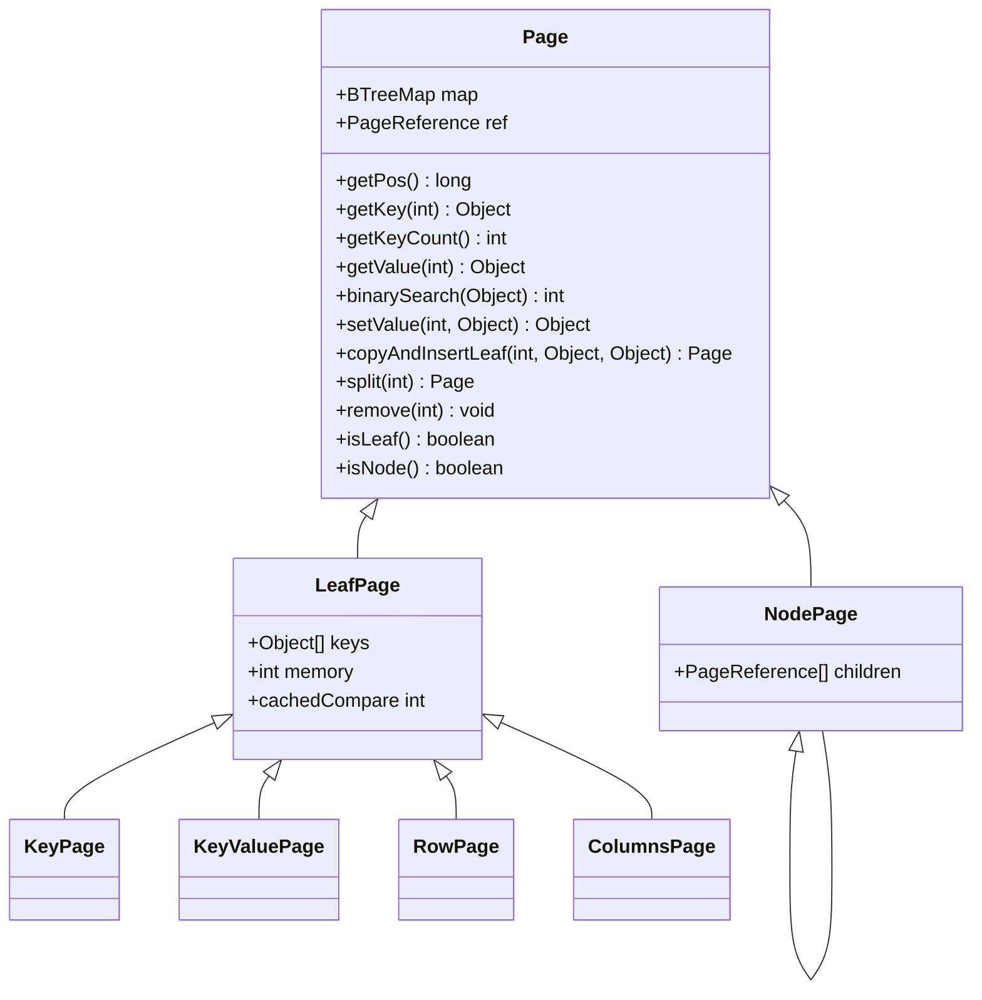
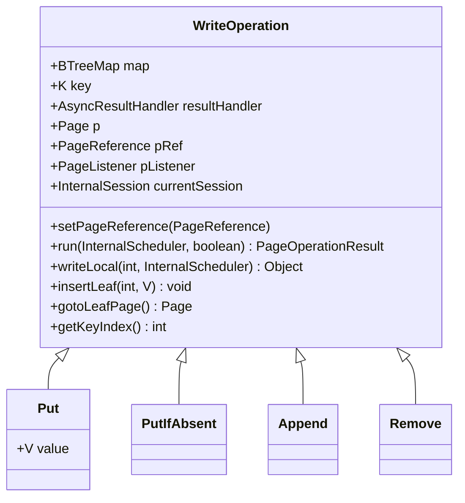
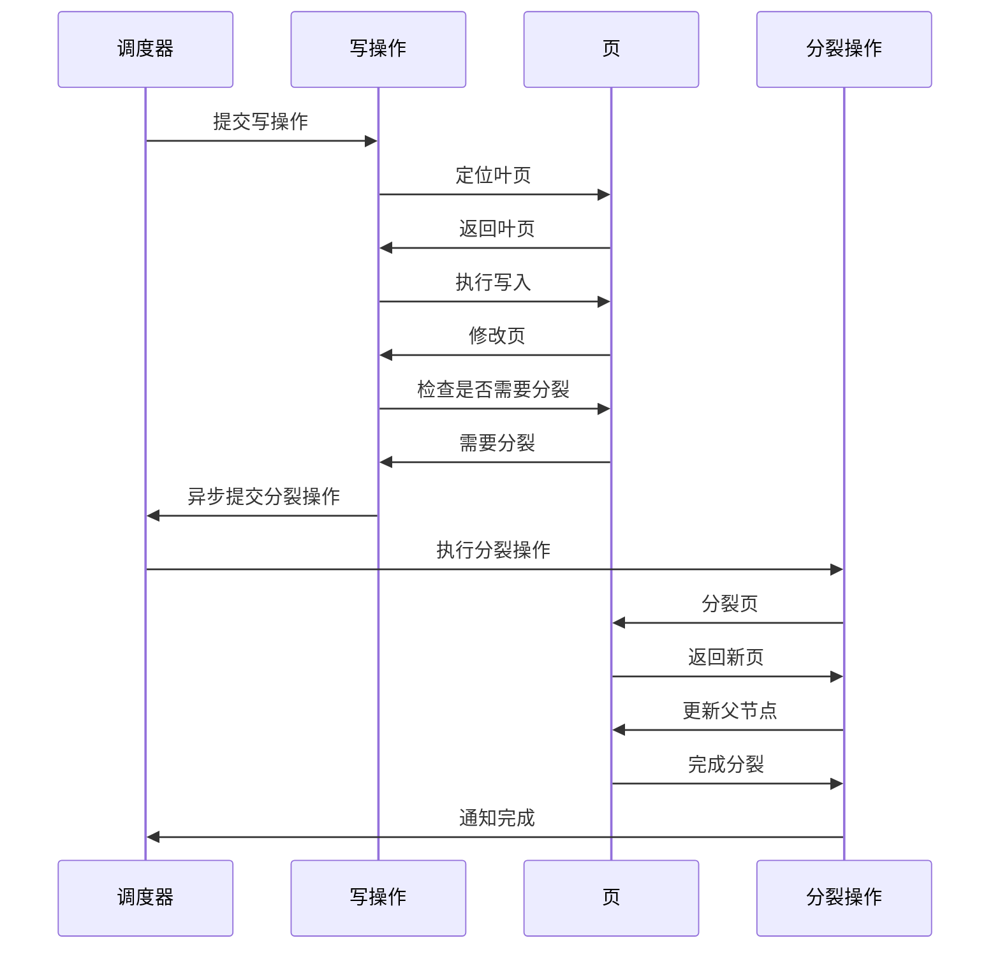
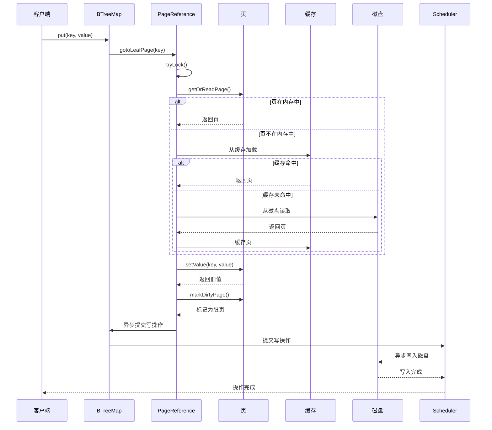

# 页操作机制

<cite>
**本文档引用的文件**
- [Page.java](file://lealone-aose\src\main\java\com\lealone\storage\aose\btree\page\Page.java)
- [PageOperations.java](file://lealone-aose\src\main\java\com\lealone\storage\aose\btree\page\PageOperations.java)
- [PageUtils.java](file://lealone-aose\src\main\java\com\lealone\storage\aose\btree\page\PageUtils.java)
- [PrettyPagePrinter.java](file://lealone-aose\src\main\java\com\lealone\storage\aose\btree\page\PrettyPagePrinter.java)
- [PageInfo.java](file://lealone-aose\src\main\java\com\lealone\storage\aose\btree\page\PageInfo.java)
- [LeafPage.java](file://lealone-aose\src\main\java\com\lealone\storage\aose\btree\page\LeafPage.java)
- [NodePage.java](file://lealone-aose\src\main\java\com\lealone\storage\aose\btree\page\NodePage.java)
- [PageReference.java](file://lealone-aose\src\main\java\com\lealone\storage\aose\btree\page\PageReference.java)
- [PageLock.java](file://lealone-aose\src\main\java\com\lealone\storage\aose\btree\page\PageLock.java)
- [PageStorageMode.java](file://lealone-aose\src\main\java\com\lealone\storage\aose\btree\page\PageStorageMode.java)
- [LocalPage.java](file://lealone-aose\src\main\java\com\lealone\storage\aose\btree\page\LocalPage.java)
- [KeyPage.java](file://lealone-aose\src\main\java\com\lealone\storage\aose\btree\page\KeyPage.java)
- [KeyValuePage.java](file://lealone-aose\src\main\java\com\lealone\storage\aose\btree\page\KeyValuePage.java)
- [RowPage.java](file://lealone-aose\src\main\java\com\lealone\storage\aose\btree\page\RowPage.java)
- [ColumnsPage.java](file://lealone-aose\src\main\java\com\lealone\storage\aose\btree\page\ColumnsPage.java)
</cite>

## 目录
1. [引言](#引言)
2. [页接口定义](#页接口定义)
3. [页操作工具类](#页操作工具类)
4. [页序列化与反序列化](#页序列化与反序列化)
5. [页内容格式化输出](#页内容格式化输出)
6. [页读写操作流程](#页读写操作流程)
7. [操作原子性与崩溃恢复](#操作原子性与崩溃恢复)
8. [结论](#结论)

## 引言
AOSE存储引擎采用B-Tree数据结构来组织和管理数据，其中页（Page）是B-Tree的基本存储单元。页操作机制是AOSE存储引擎的核心，它负责处理数据的读取、写入、分裂和合并等基本操作。本文档将全面阐述AOSE存储引擎的页操作机制，详细说明Page接口定义的核心操作方法，深入分析PageOperations工具类提供的高级页操作算法，解释PageUtils中页序列化和反序列化的实现细节，描述PrettyPagePrinter如何辅助调试和监控，并讨论操作原子性和崩溃恢复机制的设计。

## 页接口定义
`Page`接口是AOSE存储引擎中所有页类型的基类，定义了页的基本操作方法。它是一个抽象类，通过继承关系实现了不同类型的页，如叶页（LeafPage）和节点页（NodePage）。

### 核心操作方法
`Page`类定义了一系列核心操作方法，这些方法为所有页类型提供了统一的接口：

- **读取操作**：`getKey(int index)`方法用于获取指定索引处的键，`getValue(int index)`方法用于获取指定索引处的值。`binarySearch(Object key)`方法使用二分查找算法在页中搜索指定的键。
- **写入操作**：`setValue(int index, Object value)`方法用于替换指定索引处的值，`copyAndInsertLeaf(int index, Object key, Object value)`方法用于在指定位置插入新的键值对。
- **分裂操作**：`split(int at)`方法用于将页从指定位置分裂成两个页。当页的内存使用量超过预设的页大小时，会触发分裂操作。
- **合并操作**：`remove(int index)`方法用于删除指定索引处的键值对。当删除操作导致页为空时，会触发合并操作。



**图源**
- [Page.java](file://lealone-aose\src\main\java\com\lealone\storage\aose\btree\page\Page.java#L20-L377)
- [LeafPage.java](file://lealone-aose\src\main\java\com\lealone\storage\aose\btree\page\LeafPage.java#L19-L259)
- [NodePage.java](file://lealone-aose\src\main\java\com\lealone\storage\aose\btree\page\NodePage.java#L19-L278)

**页类型**
AOSE存储引擎支持多种页类型，以适应不同的存储需求：

- **KeyPage**：仅存储键的页，适用于索引场景。
- **KeyValuePage**：存储键值对的页，适用于键值存储场景。
- **RowPage**：存储行数据的页，适用于行存储场景。
- **ColumnsPage**：存储列数据的页，适用于列存储场景。
- **NodePage**：B-Tree的内部节点页，存储子页的引用。

**页类型工厂**
`Page`类提供了一个静态的`create`方法，根据页类型和缓冲区内容创建相应的页实例。该方法通过检查缓冲区中的模式字节来确定具体的页类型，并创建相应的页对象。

```java
public static Page create(BTreeMap<?, ?> map, int type, ByteBuffer buff) {
    switch (type) {
    case PageUtils.PAGE_TYPE_LEAF:
        if (map.getKeyType().isKeyOnly()) {
            return new KeyPage(map);
        } else if (map.getValueType().isRowOnly()) {
            int mode = buff.get(buff.position() + 4);
            if (PageStorageMode.values()[mode] == PageStorageMode.ROW_STORAGE)
                return new RowPage(map);
            else
                return new ColumnsPage(map);
        } else {
            int mode = buff.get(buff.position() + 4);
            if (PageStorageMode.values()[mode] == PageStorageMode.ROW_STORAGE)
                return new KeyValuePage(map);
            else
                return new KeyColumnsPage(map);
        }
    case PageUtils.PAGE_TYPE_NODE:
        return new NodePage(map);
    case PageUtils.PAGE_TYPE_COLUMN:
        return new ColumnPage(map);
    default:
        throw DbException.getInternalError("type: " + type);
    }
}
```

**页状态管理**
`Page`类通过`PageReference`对象来管理页的状态。`PageReference`包含一个`PageInfo`对象，用于存储页的元信息，如位置、内存使用量、最后访问时间等。`PageInfo`还包含一个`PageLock`对象，用于实现页级别的并发控制。

## 页操作工具类
`PageOperations`类是AOSE存储引擎中页操作的核心工具类，提供了高级的页操作算法，如B-Tree节点分裂策略、键值插入和删除的平衡维护。

### 写操作抽象
`PageOperations`类定义了一个抽象的`WriteOperation`类，作为所有写操作的基础。`WriteOperation`类实现了`PageOperation`接口，并提供了通用的写操作逻辑。



**图源**
- [PageOperations.java](file://lealone-aose\src\main\java\com\lealone\storage\aose\btree\page\PageOperations.java#L20-L520)

`WriteOperation`类的主要功能包括：

- **定位叶页**：通过`gotoLeafPage()`方法从根页开始，沿着B-Tree向下搜索，直到找到包含目标键的叶页。
- **加锁**：在对页进行写操作之前，需要获取页的轻量级锁，以确保操作的原子性。
- **写入本地**：在内存中对页进行修改，如插入、更新或删除键值对。
- **标记脏页**：修改完成后，将页标记为脏页，以便后续的持久化操作。

### B-Tree节点分裂策略
当叶页的内存使用量超过预设的页大小时，会触发分裂操作。`SplitPage`类负责处理页的分裂操作。



**图源**
- [PageOperations.java](file://lealone-aose\src\main\java\com\lealone\storage\aose\btree\page\PageOperations.java#L290-L461)

分裂操作的流程如下：

1. **检查分裂条件**：在写操作完成后，检查页的内存使用量是否超过页大小。
2. **异步提交分裂操作**：如果需要分裂，将分裂操作异步提交给调度器执行。
3. **执行分裂**：`SplitPage`操作获取父节点的锁，然后将当前页从中间位置分裂成两个页。
4. **更新父节点**：将分裂后的新页插入到父节点中，并更新父节点的键。
5. **递归检查**：如果父节点也需要分裂，则递归执行分裂操作。

### 键值插入和删除的平衡维护
`PageOperations`类还提供了`Put`、`PutIfAbsent`、`Append`和`Remove`等具体的写操作实现，用于维护B-Tree的平衡。

- **Put操作**：如果键不存在，则在叶页中插入新的键值对；如果键已存在，则更新其值。
- **PutIfAbsent操作**：只有当键不存在时才插入新的键值对，否则直接返回旧值。
- **Append操作**：将键值对追加到B-Tree的末尾，通常用于实现自增主键。
- **Remove操作**：删除指定的键值对。如果删除后叶页为空，则触发合并操作。

## 页序列化与反序列化
`PageUtils`类负责处理页的序列化和反序列化，包括字节序处理、校验和计算和压缩算法集成。

### 页位置编码
`PageUtils`类提供了页位置的编码和解码方法。页位置是一个64位的长整型，包含了页的块ID、偏移量和类型信息。

```java
public static long getPagePos(int chunkId, int offset, int type) {
    long pos = (long) chunkId << 34;
    pos |= (long) offset << 2;
    pos |= type;
    return pos;
}

public static int getPageChunkId(long pos) {
    return (int) (pos >>> 34);
}

public static int getPageOffset(long pos) {
    return (int) (pos >> 2);
}

public static int getPageType(long pos) {
    return ((int) pos) & 3;
}
```

**页类型常量**
`PageUtils`类定义了页类型的常量：

- `PAGE_TYPE_LEAF`：叶页类型
- `PAGE_TYPE_NODE`：节点页类型
- `PAGE_TYPE_COLUMN`：列页类型

**压缩算法集成**
`Page`类在写入页时会根据配置的压缩级别对页数据进行压缩。如果压缩后的数据比原始数据小，则使用压缩后的数据。

```java
void compressPage(DataBuffer buff, int compressStart, int type, int typePos) {
    int expLen = buff.position() - compressStart;
    if (expLen > 16) {
        BTreeStorage storage = map.getBTreeStorage();
        int compressionLevel = storage.getCompressionLevel();
        if (compressionLevel > 0) {
            Compressor compressor;
            int compressType;
            if (compressionLevel == 1) {
                compressor = storage.getCompressorFast();
                compressType = PageUtils.PAGE_COMPRESSED;
            } else {
                compressor = storage.getCompressorHigh();
                compressType = PageUtils.PAGE_COMPRESSED_HIGH;
            }
            byte[] exp = new byte[expLen];
            buff.position(compressStart).get(exp);
            byte[] comp = new byte[expLen * 2];
            int compLen = compressor.compress(exp, expLen, comp, 0);
            int plus = DataUtils.getVarIntLen(compLen - expLen);
            if (compLen + plus < expLen) {
                buff.position(typePos).put((byte) (type + compressType));
                buff.position(compressStart).putVarInt(expLen - compLen).put(comp, 0, compLen);
            }
        }
    }
}
```

**校验和计算**
在读取和写入页时，`Page`类会计算和验证校验和，以确保数据的完整性。

```java
static void readCheckValue(ByteBuffer buff, int chunkId, int offset, int pageLength) {
    short check = buff.getShort();
    int checkTest = DataUtils.getCheckValue(chunkId) ^ DataUtils.getCheckValue(offset)
            ^ DataUtils.getCheckValue(pageLength);
    if (check != (short) checkTest) {
        throw DataUtils.newIllegalStateException(DataUtils.ERROR_FILE_CORRUPT,
                "File corrupted in chunk {0}, expected check value {1}, got {2}", chunkId, checkTest,
                check);
    }
}

static void writeCheckValue(DataBuffer buff, Chunk chunk, int start, int pageLength, int checkPos) {
    int check = DataUtils.getCheckValue(chunk.id)
            ^ DataUtils.getCheckValue(chunk.getOffset() + start)
            ^ DataUtils.getCheckValue(pageLength);
    buff.putShort(checkPos, (short) check);
}
```

## 页内容格式化输出
`PrettyPagePrinter`类提供了页内容的可读性格式化输出，用于辅助调试和监控。

### 格式化输出
`PrettyPagePrinter`类可以将B-Tree的结构以文本形式打印出来，显示每个页的类型、位置、内存使用量、键值对等信息。

```java
public static void printPage(Page p) {
    printPage(p, true);
}

public static void printPage(Page p, boolean readOffLinePage) {
    System.out.println(getPrettyPageInfo(p, readOffLinePage));
}

public static String getPrettyPageInfo(Page p, boolean readOffLinePage) {
    StringBuilder buff = new StringBuilder();
    PrettyPageInfo info = new PrettyPageInfo();
    info.readOffLinePage = readOffLinePage;

    getPrettyPageInfoRecursive(p, "", info);

    buff.append("PrettyPageInfo:").append('\n');
    buff.append("--------------").append('\n');
    buff.append("pageCount: ").append(info.pageCount).append('\n');
    buff.append("leafPageCount: ").append(info.leafPageCount).append('\n');
    buff.append("nodePageCount: ").append(info.nodePageCount).append('\n');
    buff.append("levelCount: ").append(info.levelCount).append('\n');
    buff.append('\n');
    buff.append("pages:").append('\n');
    buff.append("--------------------------------").append('\n');

    buff.append(info.buff).append('\n');

    return buff.toString();
}
```

**输出示例**
```
PrettyPageInfo:
--------------
pageCount: 5
leafPageCount: 3
nodePageCount: 2
levelCount: 3

pages:
--------------------------------
type: node
pos: 123456789
chunkId: 1
memory: 200
keyLength: 2
keys: key1, key2
children: 3

  type: leaf
  pos: 987654321
  chunkId: 2
  memory: 150
  keyLength: 5
  keys: key1, key2, key3, key4, key5
  values: value1, value2, value3, value4, value5

  type: leaf
  pos: 112233445
  chunkId: 3
  memory: 180
  keyLength: 4
  keys: key6, key7, key8, key9
  values: value6, value7, value8, value9
```

## 页读写操作流程
本节通过时序图展示一次完整的页读写操作流程，从内存缓存到磁盘I/O的完整路径。



**图源**
- [PageOperations.java](file://lealone-aose\src\main\java\com\lealone\storage\aose\btree\page\PageOperations.java#L82-L151)
- [PageReference.java](file://lealone-aose\src\main\java\com\lealone\storage\aose\btree\page\PageReference.java#L161-L207)

**读写流程说明**
1. **客户端请求**：客户端发起一个写操作请求，如`put(key, value)`。
2. **定位叶页**：`BTreeMap`从根页开始，沿着B-Tree向下搜索，找到包含目标键的叶页。
3. **加锁**：获取叶页的轻量级锁，以确保操作的原子性。
4. **读取页**：如果页不在内存中，则从磁盘读取并缓存到内存中。
5. **写入本地**：在内存中对页进行修改，如插入或更新键值对。
6. **标记脏页**：将修改后的页标记为脏页，以便后续的持久化操作。
7. **异步写入**：将脏页异步提交给调度器，由调度器负责将页写入磁盘。
8. **返回结果**：操作完成后，向客户端返回结果。

## 操作原子性与崩溃恢复
AOSE存储引擎通过页级别的并发控制和崩溃恢复机制来保证操作的原子性和数据的一致性。

### 操作原子性
`PageReference`类使用`SchedulerLock`来实现页级别的并发控制。`SchedulerLock`是一个轻量级的锁，支持非阻塞的加锁和解锁操作。

```java
public boolean tryLock(InternalScheduler newLockOwner, boolean waitingIfLocked) {
    return schedulerLock.tryLock(newLockOwner, waitingIfLocked);
}

public void unlock() {
    schedulerLock.unlock();
}
```

在执行写操作时，首先尝试获取页的锁。如果获取成功，则执行写操作；如果获取失败，则根据配置决定是等待还是重试。

### 崩溃恢复机制
`PageInfo`类中的`pos`字段用于标识页的位置。当`pos`为0时，表示页是脏页，尚未写入磁盘。在系统崩溃后重启时，可以通过扫描所有`pos`为0的页来恢复未完成的写操作。

```java
public boolean isDirty() {
    return pos == 0;
}
```

此外，`PageUtils`类提供的校验和计算功能也可以在系统启动时验证数据的完整性，防止数据损坏。

## 结论
AOSE存储引擎的页操作机制是一个复杂而高效的系统，它通过精心设计的接口和算法实现了高性能的数据存储和管理。`Page`接口定义了页的基本操作方法，`PageOperations`工具类提供了高级的页操作算法，`PageUtils`类处理页的序列化和反序列化，`PrettyPagePrinter`类辅助调试和监控。通过这些组件的协同工作，AOSE存储引擎能够高效地处理数据的读取、写入、分裂和合并等操作，并保证操作的原子性和数据的一致性。