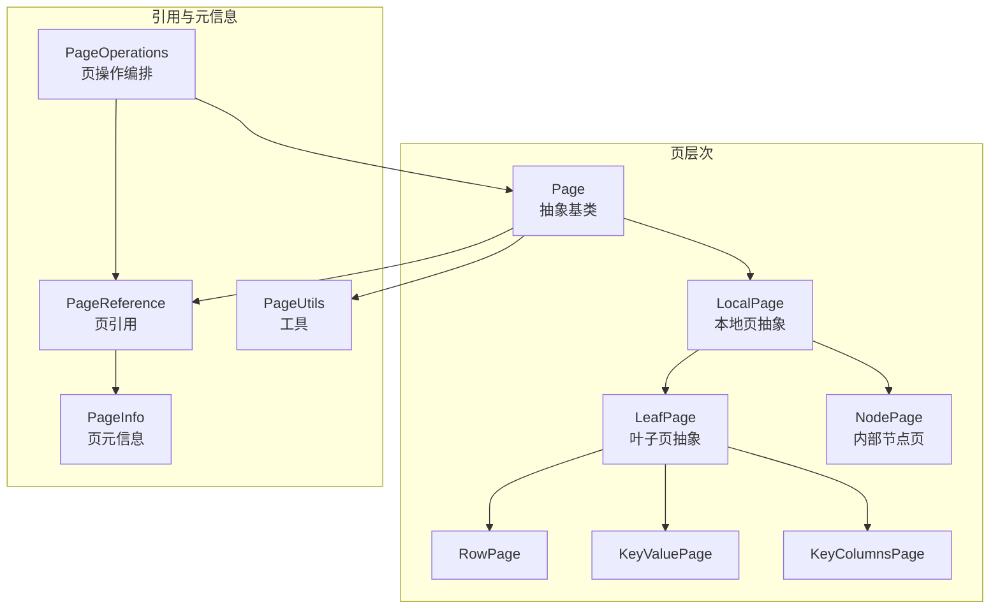
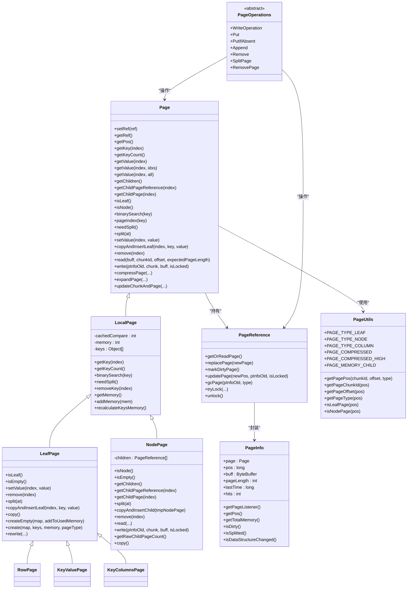
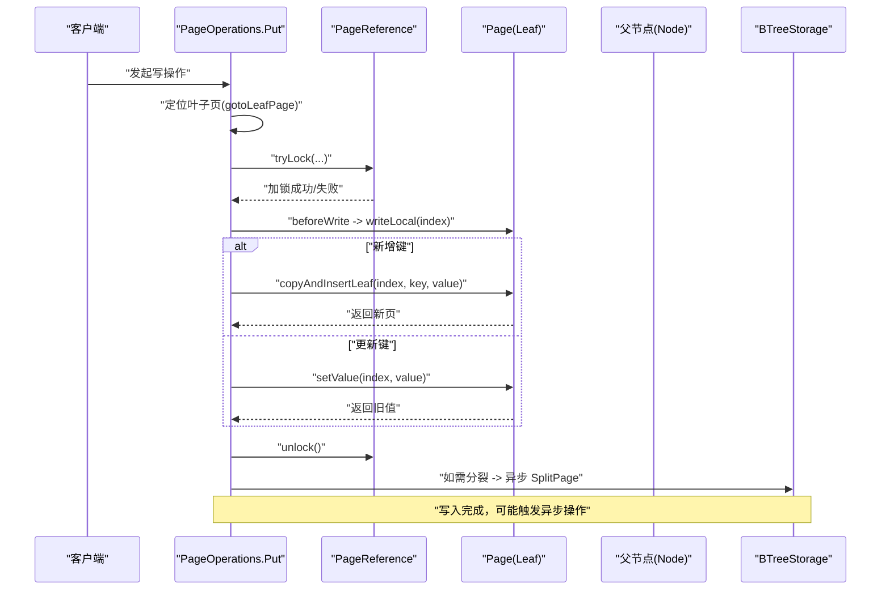
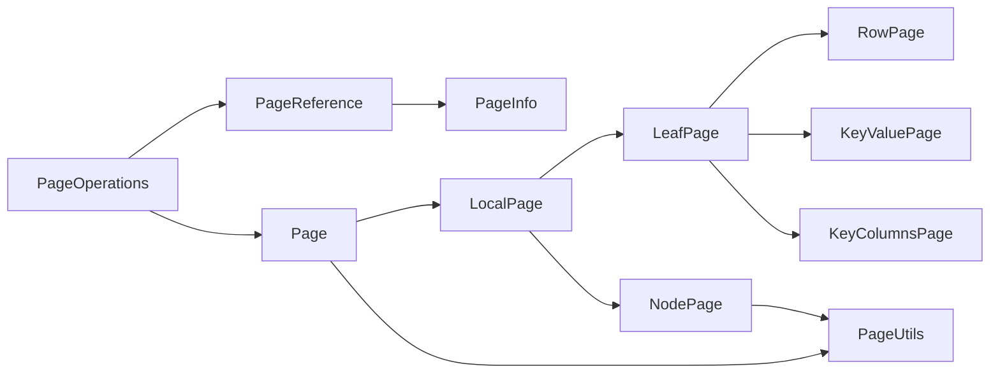

# 页管理机制

<cite>
**本文引用的文件列表**
- [Page.java](https://github.com/lealone/Lealone/blob/master/lealone-aose/src/main/java/com/lealone/storage/aose/btree/page/Page.java)
- [LocalPage.java](https://github.com/lealone/Lealone/blob/master/lealone-aose/src/main/java/com/lealone/storage/aose/btree/page/LocalPage.java)
- [LeafPage.java](https://github.com/lealone/Lealone/blob/master/lealone-aose/src/main/java/com/lealone/storage/aose/btree/page/LeafPage.java)
- [NodePage.java](https://github.com/lealone/Lealone/blob/master/lealone-aose/src/main/java/com/lealone/storage/aose/btree/page/NodePage.java)
- [RowPage.java](https://github.com/lealone/Lealone/blob/master/lealone-aose/src/main/java/com/lealone/storage/aose/btree/page/RowPage.java)
- [KeyValuePage.java](https://github.com/lealone/Lealone/blob/master/lealone-aose/src/main/java/com/lealone/storage/aose/btree/page/KeyValuePage.java)
- [KeyColumnsPage.java](https://github.com/lealone/Lealone/blob/master/lealone-aose/src/main/java/com/lealone/storage/aose/btree/page/KeyColumnsPage.java)
- [PageUtils.java](https://github.com/lealone/Lealone/blob/master/lealone-aose/src/main/java/com/lealone/storage/aose/btree/page/PageUtils.java)
- [PageOperations.java](https://github.com/lealone/Lealone/blob/master/lealone-aose/src/main/java/com/lealone/storage/aose/btree/page/PageOperations.java)
- [PageReference.java](https://github.com/lealone/Lealone/blob/master/lealone-aose/src/main/java/com/lealone/storage/aose/btree/page/PageReference.java)
- [PageInfo.java](https://github.com/lealone/Lealone/blob/master/lealone-aose/src/main/java/com/lealone/storage/aose/btree/page/PageInfo.java)
- [PageStorageMode.java](https://github.com/lealone/Lealone/blob/master/lealone-aose/src/main/java/com/lealone/storage/aose/btree/page/PageStorageMode.java)
- [PageUtilsTest.java](https://github.com/lealone/Lealone/blob/master/lealone-test/src/test/java/com/lealone/test/aose/PageUtilsTest.java)
- [BTreeMapTest.java](https://github.com/lealone/Lealone/blob/master/lealone-test/src/test/java/com/lealone/test/aose/BTreeMapTest.java)
</cite>

## 目录
1. [简介](#简介)
2. [项目结构](#项目结构)
3. [核心组件](#核心组件)
4. [架构总览](#架构总览)
5. [详细组件分析](#详细组件分析)
6. [依赖关系分析](#依赖关系分析)
7. [性能考量](#性能考量)
8. [故障排查指南](#故障排查指南)
9. [结论](#结论)
10. [附录](#附录)

## 简介
本文件系统性阐述 AOSE 存储引擎的页（Page）管理机制，重点围绕 Page 基类、LeafPage 与 NodePage 的角色与数据结构、PageUtils 工具类的功能，以及页在内存与磁盘之间的交互流程（读取、写入、压缩、校验、缓存与回收）。同时给出页管理对 I/O 效率的影响分析与优化建议，帮助读者在理解实现细节的同时掌握最佳实践。

## 项目结构
AOSE 的页管理位于 btree/page 包中，采用“基类 + 抽象页类型 + 具体页类型”的分层设计：
- Page：所有页类型的抽象基类，定义页的基本结构与通用操作接口（读写、分裂、查找、内存统计等）
- LocalPage：本地页的抽象，持有 keys 数组与二分查找缓存，负责内存估算与页大小控制
- LeafPage：叶子页族的抽象，按存储模式区分 Row/Key-Only/Column 等类型
- NodePage：内部节点页，维护键数组与子页引用数组
- PageReference：页的引用包装，负责懒加载、脏页标记、锁与 GC 协调
- PageInfo：页的元信息，包含位置、缓冲区、命中时间、锁等
- PageUtils：页位置编码、压缩标志、页类型常量等工具
- PageOperations：页级写操作编排（插入、更新、删除、分裂、删除传播）

图表来源
- [Page.java](https://github.com/lealone/Lealone/blob/master/lealone-aose/src/main/java/com/lealone/storage/aose/btree/page/Page.java#L1-L378)
- [LocalPage.java](https://github.com/lealone/Lealone/blob/master/lealone-aose/src/main/java/com/lealone/storage/aose/btree/page/LocalPage.java#L1-L169)
- [LeafPage.java](https://github.com/lealone/Lealone/blob/master/lealone-aose/src/main/java/com/lealone/storage/aose/btree/page/LeafPage.java#L1-L260)
- [NodePage.java](https://github.com/lealone/Lealone/blob/master/lealone-aose/src/main/java/com/lealone/storage/aose/btree/page/NodePage.java#L1-L279)
- [RowPage.java](https://github.com/lealone/Lealone/blob/master/lealone-aose/src/main/java/com/lealone/storage/aose/btree/page/RowPage.java#L1-L74)
- [KeyValuePage.java](https://github.com/lealone/Lealone/blob/master/lealone-aose/src/main/java/com/lealone/storage/aose/btree/page/KeyValuePage.java#L1-L91)
- [KeyColumnsPage.java](https://github.com/lealone/Lealone/blob/master/lealone-aose/src/main/java/com/lealone/storage/aose/btree/page/KeyColumnsPage.java#L1-L80)
- [PageReference.java](https://github.com/lealone/Lealone/blob/master/lealone-aose/src/main/java/com/lealone/storage/aose/btree/page/PageReference.java#L1-L418)
- [PageInfo.java](https://github.com/lealone/Lealone/blob/master/lealone-aose/src/main/java/com/lealone/storage/aose/btree/page/PageInfo.java#L1-L181)
- [PageUtils.java](https://github.com/lealone/Lealone/blob/master/lealone-aose/src/main/java/com/lealone/storage/aose/btree/page/PageUtils.java#L1-L94)
- [PageOperations.java](https://github.com/lealone/Lealone/blob/master/lealone-aose/src/main/java/com/lealone/storage/aose/btree/page/PageOperations.java#L1-L521)

章节来源
- [Page.java](https://github.com/lealone/Lealone/blob/master/lealone-aose/src/main/java/com/lealone/storage/aose/btree/page/Page.java#L1-L120)
- [LocalPage.java](https://github.com/lealone/Lealone/blob/master/lealone-aose/src/main/java/com/lealone/storage/aose/btree/page/LocalPage.java#L1-L120)
- [LeafPage.java](https://github.com/lealone/Lealone/blob/master/lealone-aose/src/main/java/com/lealone/storage/aose/btree/page/LeafPage.java#L1-L120)
- [NodePage.java](https://github.com/lealone/Lealone/blob/master/lealone-aose/src/main/java/com/lealone/storage/aose/btree/page/NodePage.java#L1-L120)
- [PageReference.java](https://github.com/lealone/Lealone/blob/master/lealone-aose/src/main/java/com/lealone/storage/aose/btree/page/PageReference.java#L1-L120)
- [PageInfo.java](https://github.com/lealone/Lealone/blob/master/lealone-aose/src/main/java/com/lealone/storage/aose/btree/page/PageInfo.java#L1-L120)
- [PageUtils.java](https://github.com/lealone/Lealone/blob/master/lealone-aose/src/main/java/com/lealone/storage/aose/btree/page/PageUtils.java#L1-L94)
- [PageOperations.java](https://github.com/lealone/Lealone/blob/master/lealone-aose/src/main/java/com/lealone/storage/aose/btree/page/PageOperations.java#L1-L120)

## 核心组件
- Page 基类：定义页的统一接口，包括键访问、键计数、二分查找、页分裂、读写、校验与压缩等；提供页位置编码与校验值计算、压缩与解压逻辑
- LocalPage：持有 keys 数组与二分查找缓存 cachedCompare，负责内存估算、页大小阈值控制与键值删除
- LeafPage：叶子页族抽象，支持多种存储模式（KeyOnly、RowStorage、ColumnStorage），提供复制插入、分裂、内存重算等
- NodePage：内部节点页，维护 keys 与 PageReference[] children，负责子页引用读写、位置回填、写入压缩与校验
- PageReference：页引用包装，负责懒加载 getOrReadPage、脏页标记 markDirtyPage、锁与 GC 协调、位置更新
- PageInfo：页元信息，记录 pos、buff、pageLength、lastTime、hits、pageLock 等，支持 GC 释放 page/buff
- PageUtils：页位置编码 getPagePos/getPageChunkId/getPageOffset/getPageType，压缩标志 PAGE_COMPRESSED/PAGE_COMPRESSED_HIGH，页类型常量
- PageOperations：写操作编排，包括 Put/PutIfAbsent/Remove/Append 与异步 Split/RemovePage，协调锁、重试与结构变更

章节来源
- [Page.java](https://github.com/lealone/Lealone/blob/master/lealone-aose/src/main/java/com/lealone/storage/aose/btree/page/Page.java#L120-L378)
- [LocalPage.java](https://github.com/lealone/Lealone/blob/master/lealone-aose/src/main/java/com/lealone/storage/aose/btree/page/LocalPage.java#L80-L169)
- [LeafPage.java](https://github.com/lealone/Lealone/blob/master/lealone-aose/src/main/java/com/lealone/storage/aose/btree/page/LeafPage.java#L120-L260)
- [NodePage.java](https://github.com/lealone/Lealone/blob/master/lealone-aose/src/main/java/com/lealone/storage/aose/btree/page/NodePage.java#L120-L279)
- [PageReference.java](https://github.com/lealone/Lealone/blob/master/lealone-aose/src/main/java/com/lealone/storage/aose/btree/page/PageReference.java#L120-L418)
- [PageInfo.java](https://github.com/lealone/Lealone/blob/master/lealone-aose/src/main/java/com/lealone/storage/aose/btree/page/PageInfo.java#L1-L181)
- [PageUtils.java](https://github.com/lealone/Lealone/blob/master/lealone-aose/src/main/java/com/lealone/storage/aose/btree/page/PageUtils.java#L1-L94)
- [PageOperations.java](https://github.com/lealone/Lealone/blob/master/lealone-aose/src/main/java/com/lealone/storage/aose/btree/page/PageOperations.java#L1-L521)

## 架构总览
下面的类图展示了页体系的继承与组合关系，以及关键字段与方法：

图表来源
- [Page.java](https://github.com/lealone/Lealone/blob/master/lealone-aose/src/main/java/com/lealone/storage/aose/btree/page/Page.java#L1-L378)
- [LocalPage.java](https://github.com/lealone/Lealone/blob/master/lealone-aose/src/main/java/com/lealone/storage/aose/btree/page/LocalPage.java#L1-L169)
- [LeafPage.java](https://github.com/lealone/Lealone/blob/master/lealone-aose/src/main/java/com/lealone/storage/aose/btree/page/LeafPage.java#L1-L260)
- [NodePage.java](https://github.com/lealone/Lealone/blob/master/lealone-aose/src/main/java/com/lealone/storage/aose/btree/page/NodePage.java#L1-L279)
- [RowPage.java](https://github.com/lealone/Lealone/blob/master/lealone-aose/src/main/java/com/lealone/storage/aose/btree/page/RowPage.java#L1-L74)
- [KeyValuePage.java](https://github.com/lealone/Lealone/blob/master/lealone-aose/src/main/java/com/lealone/storage/aose/btree/page/KeyValuePage.java#L1-L91)
- [KeyColumnsPage.java](https://github.com/lealone/Lealone/blob/master/lealone-aose/src/main/java/com/lealone/storage/aose/btree/page/KeyColumnsPage.java#L1-L80)
- [PageReference.java](https://github.com/lealone/Lealone/blob/master/lealone-aose/src/main/java/com/lealone/storage/aose/btree/page/PageReference.java#L1-L418)
- [PageInfo.java](https://github.com/lealone/Lealone/blob/master/lealone-aose/src/main/java/com/lealone/storage/aose/btree/page/PageInfo.java#L1-L181)
- [PageUtils.java](https://github.com/lealone/Lealone/blob/master/lealone-aose/src/main/java/com/lealone/storage/aose/btree/page/PageUtils.java#L1-L94)
- [PageOperations.java](https://github.com/lealone/Lealone/blob/master/lealone-aose/src/main/java/com/lealone/storage/aose/btree/page/PageOperations.java#L1-L521)

## 详细组件分析

### Page 基类与 LocalPage
- 统一接口：Page 定义了键访问、二分查找、页分裂、读写、校验与压缩等通用能力，未实现的方法由子类覆盖
- 位置与校验：提供页位置编码与校验值计算，用于磁盘一致性校验
- 压缩：支持快速与高压缩等级，按阈值自动选择压缩策略
- 内存与页大小：LocalPage 记录 memory 并通过 needSplit 控制页大小，避免超过配置的页大小阈值

章节来源
- [Page.java](https://github.com/lealone/Lealone/blob/master/lealone-aose/src/main/java/com/lealone/storage/aose/btree/page/Page.java#L1-L200)
- [LocalPage.java](https://github.com/lealone/Lealone/blob/master/lealone-aose/src/main/java/com/lealone/storage/aose/btree/page/LocalPage.java#L1-L120)

### 叶子页 LeafPage 与具体类型
- 角色：承载键值对，支持多种存储模式
- 数据结构：
  - RowPage：键为 keyOnly，值为行存储（keys 作为值数组）
  - KeyValuePage：键与值均存储（keys 与 values 分离）
  - KeyColumnsPage：键与值按列存储（keys 与 values 分离）
- 操作：
  - 插入：copyAndInsertLeaf 返回新页，增量更新内存
  - 删除：removeKey/removeValue，更新全局计数
  - 分裂：split 按索引拆分 keys 与 values，返回右半部分页
  - 内存重算：recalculateMemory 统计 keys 与 values 内存占用

章节来源
- [LeafPage.java](https://github.com/lealone/Lealone/blob/master/lealone-aose/src/main/java/com/lealone/storage/aose/btree/page/LeafPage.java#L1-L260)
- [RowPage.java](https://github.com/lealone/Lealone/blob/master/lealone-aose/src/main/java/com/lealone/storage/aose/btree/page/RowPage.java#L1-L74)
- [KeyValuePage.java](https://github.com/lealone/Lealone/blob/master/lealone-aose/src/main/java/com/lealone/storage/aose/btree/page/KeyValuePage.java#L1-L91)
- [KeyColumnsPage.java](https://github.com/lealone/Lealone/blob/master/lealone-aose/src/main/java/com/lealone/storage/aose/btree/page/KeyColumnsPage.java#L1-L80)

### 内部节点页 NodePage
- 角色：B-Tree 内部节点，维护 keys 与 PageReference[] children
- 数据结构：children 数组长度比 keys 多 1，确保区间覆盖
- 操作：
  - 分裂：按索引拆分 keys 与 children，保留中间键上移到父节点
  - 插入子页：copyAndInsertChild 合并键与子页引用，更新内存
  - 删除子页：remove 移除指定子页，调整内存
  - 读写：read 解析页头、子页位置、键类型与键数组；write 先写子页位置占位，随后写键，最后回填子页位置并可选压缩

章节来源
- [NodePage.java](https://github.com/lealone/Lealone/blob/master/lealone-aose/src/main/java/com/lealone/storage/aose/btree/page/NodePage.java#L1-L279)

### PageReference 与 PageInfo
- PageReference：
  - 懒加载：getOrReadPage 优先返回内存页，否则从磁盘读取并更新元信息
  - 脏页标记：markDirtyPage 标记页为脏，向上传播至父节点，必要时替换 PageListener/锁
  - 位置更新：updatePage 在写入完成后更新 pos，释放旧 buff
  - GC：gcPage 支持释放 page/buff 或两者，配合 BTreeGC 管理内存
- PageInfo：
  - 记录 pos、buff、pageLength、lastTime、hits、pageLock
  - 提供 getTotalMemory、isDirty、isSplitted/isDataStructureChanged 等状态查询

章节来源
- [PageReference.java](https://github.com/lealone/Lealone/blob/master/lealone-aose/src/main/java/com/lealone/storage/aose/btree/page/PageReference.java#L1-L418)
- [PageInfo.java](https://github.com/lealone/Lealone/blob/master/lealone-aose/src/main/java/com/lealone/storage/aose/btree/page/PageInfo.java#L1-L181)

### PageUtils 工具类
- 页位置编码：getPagePos 编码 chunkId、offset、type；getPageChunkId/getPageOffset/getPageType 解码
- 页类型与压缩：PAGE_TYPE_* 常量、PAGE_COMPRESSED/HIGH 压缩标志
- 页类型判定：isLeafPage/isNodePage

章节来源
- [PageUtils.java](https://github.com/lealone/Lealone/blob/master/lealone-aose/src/main/java/com/lealone/storage/aose/btree/page/PageUtils.java#L1-L94)

### PageOperations 写操作编排
- WriteOperation：定位叶子页、加锁、beforeWrite、写入、可能触发异步 split/删除传播
- Put/PutIfAbsent/Remove/Append：针对单键写操作的具体实现
- SplitPage/RemovePage：异步执行页分裂与删除传播，必要时更新父节点

章节来源
- [PageOperations.java](https://github.com/lealone/Lealone/blob/master/lealone-aose/src/main/java/com/lealone/storage/aose/btree/page/PageOperations.java#L1-L521)

### 页在内存与磁盘间的交互流程
下面的时序图展示了典型写操作（Put）从发起到完成的端到端流程，包括定位叶子页、加锁、写入、可能的页分裂与异步处理：

图表来源
- [PageOperations.java](https://github.com/lealone/Lealone/blob/master/lealone-aose/src/main/java/com/lealone/storage/aose/btree/page/PageOperations.java#L120-L220)
- [PageReference.java](https://github.com/lealone/Lealone/blob/master/lealone-aose/src/main/java/com/lealone/storage/aose/btree/page/PageReference.java#L160-L210)
- [LeafPage.java](https://github.com/lealone/Lealone/blob/master/lealone-aose/src/main/java/com/lealone/storage/aose/btree/page/LeafPage.java#L90-L120)

## 依赖关系分析
- Page 与 LocalPage/LeafPage/NodePage：继承关系，LocalPage 作为公共父类，LeafPage/NodePage 各自扩展
- PageReference 与 PageInfo：PageReference 封装 PageInfo，负责页的生命周期管理与元信息更新
- PageOperations 与 PageReference/Page：编排写操作，协调锁、重试与结构变更
- PageUtils 与 Page/NodePage：被 Page/NodePage 读写时使用，用于位置编码与压缩标志

图表来源
- [Page.java](https://github.com/lealone/Lealone/blob/master/lealone-aose/src/main/java/com/lealone/storage/aose/btree/page/Page.java#L1-L120)
- [LocalPage.java](https://github.com/lealone/Lealone/blob/master/lealone-aose/src/main/java/com/lealone/storage/aose/btree/page/LocalPage.java#L1-L120)
- [LeafPage.java](https://github.com/lealone/Lealone/blob/master/lealone-aose/src/main/java/com/lealone/storage/aose/btree/page/LeafPage.java#L1-L120)
- [NodePage.java](https://github.com/lealone/Lealone/blob/master/lealone-aose/src/main/java/com/lealone/storage/aose/btree/page/NodePage.java#L1-L120)
- [PageReference.java](https://github.com/lealone/Lealone/blob/master/lealone-aose/src/main/java/com/lealone/storage/aose/btree/page/PageReference.java#L1-L120)
- [PageInfo.java](https://github.com/lealone/Lealone/blob/master/lealone-aose/src/main/java/com/lealone/storage/aose/btree/page/PageInfo.java#L1-L120)
- [PageOperations.java](https://github.com/lealone/Lealone/blob/master/lealone-aose/src/main/java/com/lealone/storage/aose/btree/page/PageOperations.java#L1-L120)
- [PageUtils.java](https://github.com/lealone/Lealone/blob/master/lealone-aose/src/main/java/com/lealone/storage/aose/btree/page/PageUtils.java#L1-L94)

章节来源
- [Page.java](https://github.com/lealone/Lealone/blob/master/lealone-aose/src/main/java/com/lealone/storage/aose/btree/page/Page.java#L1-L120)
- [PageReference.java](https://github.com/lealone/Lealone/blob/master/lealone-aose/src/main/java/com/lealone/storage/aose/btree/page/PageReference.java#L1-L120)
- [PageOperations.java](https://github.com/lealone/Lealone/blob/master/lealone-aose/src/main/java/com/lealone/storage/aose/btree/page/PageOperations.java#L1-L120)

## 性能考量
- 页大小与内存估算
  - LocalPage 通过 memory 与 needSplit 控制页大小，避免超过配置的页大小阈值
  - 叶子页在插入/删除时增量更新内存，减少全量重算成本
- 压缩策略
  - Page 提供压缩阈值与快速/高压缩等级选择，减少磁盘占用
  - NodePage 写入时先写子页位置占位，再写键，最后回填子页位置，减少重复 IO
- 锁与并发
  - PageReference 的 tryLock/unlock 与 markDirtyPage 保证写操作的原子性与可见性
  - 写操作完成后快速解锁，降低锁竞争
- 懒加载与缓存
  - PageReference.getOrReadPage 优先使用内存页，缺失时从磁盘读取并更新元信息
  - PageInfo 记录 lastTime 与 hits，便于 GC 评估回收价值
- 分裂与删除传播
  - PageOperations.SplitPage/RemovePage 异步执行，避免阻塞主路径
  - NodePage 分裂时仅移动指针，不复制键，降低开销

章节来源
- [LocalPage.java](https://github.com/lealone/Lealone/blob/master/lealone-aose/src/main/java/com/lealone/storage/aose/btree/page/LocalPage.java#L80-L120)
- [Page.java](https://github.com/lealone/Lealone/blob/master/lealone-aose/src/main/java/com/lealone/storage/aose/btree/page/Page.java#L280-L378)
- [NodePage.java](https://github.com/lealone/Lealone/blob/master/lealone-aose/src/main/java/com/lealone/storage/aose/btree/page/NodePage.java#L150-L220)
- [PageReference.java](https://github.com/lealone/Lealone/blob/master/lealone-aose/src/main/java/com/lealone/storage/aose/btree/page/PageReference.java#L160-L210)
- [PageOperations.java](https://github.com/lealone/Lealone/blob/master/lealone-aose/src/main/java/com/lealone/storage/aose/btree/page/PageOperations.java#L280-L460)

## 故障排查指南
- 页校验失败
  - Page.readCheckValue/writeCheckValue 使用校验值，若不匹配抛出文件损坏异常
  - 检查 chunkId/offset/pageLength 是否一致，确认磁盘完整性
- 页位置编码异常
  - 使用 PageUtils.getPagePos/getPageChunkId/getPageOffset/getPageType 校验位置编码
  - 测试用例可参考 PageUtilsTest
- 页被回收或结构变更
  - PageReference.markDirtyPage 会检测是否被垃圾回收或发生结构变更（split/remove）
  - 若检测到变更，写操作会重试并重新定位叶子页
- 写入后未落盘
  - NodePage.write 中先写子页位置占位，随后写键，最后回填子页位置
  - 若出现位置不一致，检查 writeChildren 与 updatePage 流程

章节来源
- [Page.java](https://github.com/lealone/Lealone/blob/master/lealone-aose/src/main/java/com/lealone/storage/aose/btree/page/Page.java#L280-L335)
- [PageUtils.java](https://github.com/lealone/Lealone/blob/master/lealone-aose/src/main/java/com/lealone/storage/aose/btree/page/PageUtils.java#L40-L94)
- [PageReference.java](https://github.com/lealone/Lealone/blob/master/lealone-aose/src/main/java/com/lealone/storage/aose/btree/page/PageReference.java#L230-L360)
- [NodePage.java](https://github.com/lealone/Lealone/blob/master/lealone-aose/src/main/java/com/lealone/storage/aose/btree/page/NodePage.java#L157-L220)
- [PageUtilsTest.java](https://github.com/lealone/Lealone/blob/master/lealone-test/src/test/java/com/lealone/test/aose/PageUtilsTest.java#L1-L39)

## 结论
AOSE 的页管理机制通过 Page 基类统一抽象、LocalPage/LeafPage/NodePage 的分层设计、PageReference/PageInfo 的引用与元信息管理，以及 PageOperations 的写操作编排，实现了高效的 B-Tree 存储。其关键特性包括：
- 明确的页类型与存储模式，支持 Row/Key-Only/Column 多种布局
- 严格的页大小控制与内存估算，避免过度膨胀
- 压缩与懒加载相结合，兼顾空间与 I/O 效率
- 基于锁与脏页标记的并发控制，保障一致性
- 异步分裂与删除传播，降低写放大

这些设计共同提升了 AOSE 在高并发与大规模数据场景下的稳定性与性能表现。

## 附录
- 存储模式枚举：PageStorageMode 定义 ROW_STORAGE/COLUMN_STORAGE，影响页类型选择与序列化方式
- 测试参考：PageUtilsTest 验证页位置编码，BTreeMapTest 展示常见写操作与分裂行为

章节来源
- [PageStorageMode.java](https://github.com/lealone/Lealone/blob/master/lealone-aose/src/main/java/com/lealone/storage/aose/btree/page/PageStorageMode.java#L1-L13)
- [PageUtilsTest.java](https://github.com/lealone/Lealone/blob/master/lealone-test/src/test/java/com/lealone/test/aose/PageUtilsTest.java#L1-L39)
- [BTreeMapTest.java](https://github.com/lealone/Lealone/blob/master/lealone-test/src/test/java/com/lealone/test/aose/BTreeMapTest.java#L1-L279)