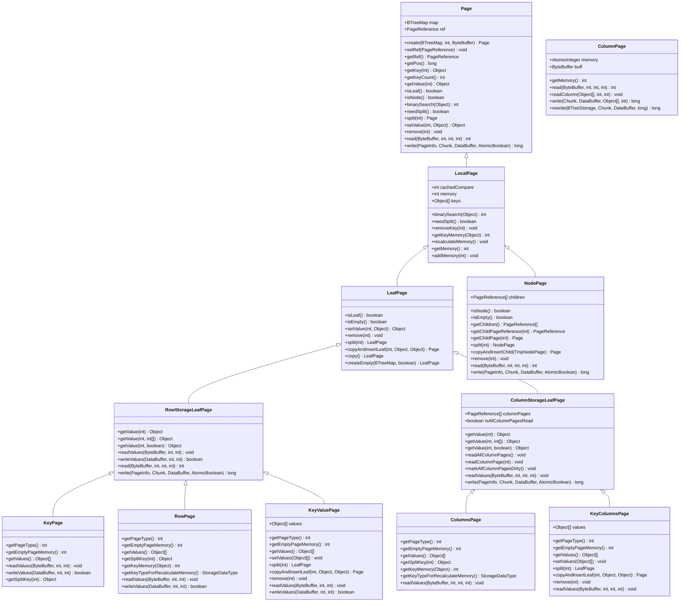

# 页类型体系

**本文档引用的文件**   
- [Page.java](https://github.com/lealone/Lealone/blob/master/lealone-aose\src\main\java\com\lealone\storage\aose\btree\page\Page.java)
- [LeafPage.java](https://github.com/lealone/Lealone/blob/master/lealone-aose\src\main\java\com\lealone\storage\aose\btree\page\LeafPage.java)
- [NodePage.java](https://github.com/lealone/Lealone/blob/master/lealone-aose\src\main\java\com\lealone\storage\aose\btree\page\NodePage.java)
- [RowPage.java](https://github.com/lealone/Lealone/blob/master/lealone-aose\src\main\java\com\lealone\storage\aose\btree\page\RowPage.java)
- [ColumnPage.java](https://github.com/lealone/Lealone/blob/master/lealone-aose\src\main\java\com\lealone\storage\aose\btree\page\ColumnPage.java)
- [LocalPage.java](https://github.com/lealone/Lealone/blob/master/lealone-aose\src\main\java\com\lealone\storage\aose\btree\page\LocalPage.java)
- [RowStorageLeafPage.java](https://github.com/lealone/Lealone/blob/master/lealone-aose\src\main\java\com\lealone\storage\aose\btree\page\RowStorageLeafPage.java)
- [ColumnStorageLeafPage.java](https://github.com/lealone/Lealone/blob/master/lealone-aose\src\main\java\com\lealone\storage\aose\btree\page\ColumnStorageLeafPage.java)
- [KeyPage.java](https://github.com/lealone/Lealone/blob/master/lealone-aose\src\main\java\com\lealone\storage\aose\btree\page\KeyPage.java)
- [KeyValuePage.java](https://github.com/lealone/Lealone/blob/master/lealone-aose\src\main\java\com\lealone\storage\aose\btree\page\KeyValuePage.java)
- [ColumnsPage.java](https://github.com/lealone/Lealone/blob/master/lealone-aose\src\main\java\com\lealone\storage\aose\btree\page\ColumnsPage.java)
- [KeyColumnsPage.java](https://github.com/lealone/Lealone/blob/master/lealone-aose\src\main\java\com\lealone\storage\aose\btree\page\KeyColumnsPage.java)
- [PageUtils.java](https://github.com/lealone/Lealone/blob/master/lealone-aose\src\main\java\com\lealone\storage\aose\btree\page\PageUtils.java)
- [PageStorageMode.java](https://github.com/lealone/Lealone/blob/master/lealone-aose\src\main\java\com\lealone\storage\aose\btree\page\PageStorageMode.java)

## 目录
1. [引言](#引言)
2. [页类型继承体系](#页类型继承体系)
3. [Page基类详解](#page基类详解)
4. [叶节点页分析](#叶节点页分析)
5. [内部节点页分析](#内部节点页分析)
6. [行列混合存储模式](#行列混合存储模式)
7. [B-Tree遍历中的角色转换](#b-tree遍历中的角色转换)
8. [查询性能与存储效率影响](#查询性能与存储效率影响)

## 引言

AOSE存储引擎采用B-Tree数据结构来组织和管理数据，其核心在于精心设计的页类型体系。该体系通过分层的类继承结构，实现了不同类型页的高效管理和操作。页类型体系不仅定义了通用的页结构和核心操作接口，还针对不同的存储需求提供了专门的优化设计。本文将深入解析这一复杂的页类型体系，详细阐述其设计原理和实现细节。

**页类型体系**的核心目标是提供一个灵活、高效且可扩展的数据存储框架。通过抽象基类和具体实现类的结合，该体系能够适应各种不同的数据存储场景，从简单的键值对存储到复杂的行列混合存储。这种设计不仅提高了代码的复用性，还为未来的功能扩展提供了坚实的基础。

## 页类型继承体系

**图示来源**
- [Page.java](https://github.com/lealone/Lealone/blob/master/lealone-aose\src\main\java\com\lealone\storage\aose\btree\page\Page.java)
- [LeafPage.java](https://github.com/lealone/Lealone/blob/master/lealone-aose\src\main\java\com\lealone\storage\aose\btree\page\LeafPage.java)
- [NodePage.java](https://github.com/lealone/Lealone/blob/master/lealone-aose\src\main\java\com\lealone\storage\aose\btree\page\NodePage.java)
- [RowStorageLeafPage.java](https://github.com/lealone/Lealone/blob/master/lealone-aose\src\main\java\com\lealone\storage\aose\btree\page\RowStorageLeafPage.java)
- [ColumnStorageLeafPage.java](https://github.com/lealone/Lealone/blob/master/lealone-aose\src\main\java\com\lealone\storage\aose\btree\page\ColumnStorageLeafPage.java)
- [KeyPage.java](https://github.com/lealone/Lealone/blob/master/lealone-aose\src\main\java\com\lealone\storage\aose\btree\page\KeyPage.java)
- [RowPage.java](https://github.com/lealone/Lealone/blob/master/lealone-aose\src\main\java\com\lealone\storage\aose\btree\page\RowPage.java)
- [KeyValuePage.java](https://github.com/lealone/Lealone/blob/master/lealone-aose\src\main\java\com\lealone\storage\aose\btree\page\KeyValuePage.java)
- [ColumnsPage.java](https://github.com/lealone/Lealone/blob/master/lealone-aose\src\main\java\com\lealone\storage\aose\btree\page\ColumnsPage.java)
- [KeyColumnsPage.java](https://github.com/lealone/Lealone/blob/master/lealone-aose\src\main\java\com\lealone\storage\aose\btree\page\KeyColumnsPage.java)
- [ColumnPage.java](https://github.com/lealone/Lealone/blob/master/lealone-aose\src\main\java\com\lealone\storage\aose\btree\page\ColumnPage.java)

## Page基类详解

`Page`类作为所有页类型的基类，定义了通用的页结构和核心操作接口。它位于页类型体系的最顶层，为所有具体的页实现提供了统一的抽象。`Page`类的核心职责包括管理页的基本状态、提供通用的页操作接口以及处理页的序列化和反序列化。

页头信息是`Page`类的重要组成部分，它包含了页的基本元数据。这些信息包括页的位置（通过`getPos()`方法获取）、页的引用（通过`getRef()`方法管理）以及页的类型标识。页类型标识通过`isLeaf()`和`isNode()`等方法来判断，这对于B-Tree的遍历和操作至关重要。`Page`类还定义了`getKey()`、`getValue()`等方法来访问页中的数据，以及`binarySearch()`方法来支持高效的键查找。

`Page`类的设计体现了高度的抽象性和灵活性。它通过抽象方法和默认实现的结合，既保证了接口的一致性，又为子类提供了足够的扩展空间。例如，`read()`和`write()`方法定义了页的序列化和反序列化协议，而具体的实现则由子类根据其特定的数据结构来完成。这种设计模式使得`Page`类能够适应各种不同的存储需求，同时保持了代码的清晰和可维护性。

**页类型体系**中的`Page`基类还负责处理一些通用的页操作，如页的压缩和解压缩。通过`compressPage()`和`expandPage()`等方法，`Page`类能够有效地管理页的存储空间，提高存储效率。这些功能对于大规模数据存储系统来说至关重要，因为它们直接影响到系统的性能和资源利用率。

**本节来源**
- [Page.java](https://github.com/lealone/Lealone/blob/master/lealone-aose\src\main\java\com\lealone\storage\aose\btree\page\Page.java)
- [PageUtils.java](https://github.com/lealone/Lealone/blob/master/lealone-aose\src\main\java\com\lealone\storage\aose\btree\page\PageUtils.java)

## 叶节点页分析

叶节点页在B-Tree结构中扮演着存储实际数据的关键角色。`LeafPage`类作为所有叶节点页的抽象基类，定义了叶节点页的通用行为和接口。它继承自`LocalPage`，并实现了`isLeaf()`方法返回`true`，明确标识了其作为叶节点的特性。`LeafPage`类的核心功能包括管理键值对数据、支持数据的插入和删除操作，以及处理页的分裂和合并。

`LeafPage`类的设计充分考虑了内存管理和性能优化。它通过`recalculateMemory()`方法动态计算页的内存占用，并通过`addMemory()`方法更新内存使用情况。这种精确的内存管理对于防止内存溢出和优化垃圾回收至关重要。`LeafPage`还实现了`needSplit()`方法，当页的内存使用超过预设阈值时，会触发页的分裂操作，确保B-Tree的平衡性。

在具体的实现中，`LeafPage`派生出了多个专门的子类，以适应不同的数据存储模式。`KeyPage`用于存储只有键的数据，常用于索引场景；`RowPage`用于存储行式数据，适合需要频繁访问整行数据的场景；`KeyValuePage`则用于存储完整的键值对数据。这些子类通过重写`getPageType()`方法来标识其特定的页类型，并通过`readValues()`和`writeValues()`方法实现特定的数据序列化和反序列化逻辑。

**页类型体系**中的叶节点页设计体现了高度的灵活性和可扩展性。通过抽象基类和具体实现的分离，系统能够根据不同的应用场景选择最合适的页类型，从而在性能和存储效率之间取得最佳平衡。这种设计不仅提高了系统的适应性，还为未来的功能扩展提供了坚实的基础。

**本节来源**
- [LeafPage.java](https://github.com/lealone/Lealone/blob/master/lealone-aose\src\main\java\com\lealone\storage\aose\btree\page\LeafPage.java)
- [KeyPage.java](https://github.com/lealone/Lealone/blob/master/lealone-aose\src\main\java\com\lealone\storage\aose\btree\page\KeyPage.java)
- [RowPage.java](https://github.com/lealone/Lealone/blob/master/lealone-aose\src\main\java\com\lealone\storage\aose\btree\page\RowPage.java)
- [KeyValuePage.java](https://github.com/lealone/Lealone/blob/master/lealone-aose\src\main\java\com\lealone\storage\aose\btree\page\KeyValuePage.java)

## 内部节点页分析

内部节点页在B-Tree结构中负责维护树的层次结构和导航信息。`NodePage`类作为内部节点页的实现，承担着管理子节点指针和分隔键的重要职责。与叶节点页不同，内部节点页不存储实际的数据值，而是存储指向子节点的引用和用于分割键空间的分隔键。

`NodePage`类的核心数据结构包括`keys`数组和`children`数组。`keys`数组存储分隔键，用于指导B-Tree的搜索路径；`children`数组存储指向子节点的引用，构成了B-Tree的分支结构。`NodePage`通过`getChildPage()`方法实现子节点的延迟加载，即只有在需要访问子节点时才从存储中读取，这大大提高了访问效率并减少了内存占用。

`NodePage`的分裂操作是其最复杂的部分之一。当内部节点页需要分裂时，`split()`方法会将键和子节点引用重新分配到两个新的节点中。特别值得注意的是，分裂点对应的键会被提升到父节点中，作为新的分隔键。这种设计确保了B-Tree的平衡性和搜索效率。`NodePage`还实现了`copyAndInsertChild()`方法，用于在插入新子节点时创建页的副本，这在B-Tree的自底向上重构过程中起着关键作用。

**页类型体系**中的内部节点页设计充分考虑了并发访问和内存效率。通过使用`PageReference`对象来间接引用子节点，`NodePage`能够有效地管理子节点的生命周期和内存使用。这种间接引用机制还支持了页的懒加载和缓存策略，进一步优化了系统的整体性能。

**本节来源**
- [NodePage.java](https://github.com/lealone/Lealone/blob/master/lealone-aose\src\main\java\com\lealone\storage\aose\btree\page\NodePage.java)
- [PageReference.java](https://github.com/lealone/Lealone/blob/master/lealone-aose\src\main\java\com\lealone\storage\aose\btree\page\PageReference.java)

## 行列混合存储模式

AOSE存储引擎通过`RowStorageLeafPage`和`ColumnStorageLeafPage`两个抽象基类，实现了对行式和列式存储模式的支持。这种设计允许系统根据不同的查询模式和数据访问特征，选择最优的存储布局，从而在OLTP和OLAP场景中都能获得良好的性能表现。

`RowStorageLeafPage`是行式存储模式的基础，它将每一行数据作为一个整体进行存储。这种模式适合需要频繁访问整行数据的OLTP场景。`RowPage`和`KeyValuePage`都继承自`RowStorageLeafPage`，它们将键和值（或整行数据）连续存储在同一个页中，使得单行数据的读取非常高效。行式存储的优势在于写入性能好，适合频繁的增删改操作。

`ColumnStorageLeafPage`则是列式存储模式的基础，它将同一列的数据集中存储。这种模式适合需要对特定列进行聚合分析的OLAP场景。`ColumnsPage`和`KeyColumnsPage`继承自`ColumnStorageLeafPage`，它们将不同列的数据分别存储在独立的`ColumnPage`中。这种设计使得对特定列的扫描和计算非常高效，同时有利于数据压缩。列式存储的优势在于读取性能好，特别是对于只访问少数列的查询。

**页类型体系**中的行列混合存储模式通过`PageStorageMode`枚举进行控制。系统可以根据表的配置和查询需求，动态选择最适合的存储模式。这种灵活性使得AOSE存储引擎能够适应各种不同的应用场景，从高并发的事务处理到大规模的数据分析。

**本节来源**
- [RowStorageLeafPage.java](https://github.com/lealone/Lealone/blob/master/lealone-aose\src\main\java\com\lealone\storage\aose\btree\page\RowStorageLeafPage.java)
- [ColumnStorageLeafPage.java](https://github.com/lealone/Lealone/blob/master/lealone-aose\src\main\java\com\lealone\storage\aose\btree\page\ColumnStorageLeafPage.java)
- [ColumnsPage.java](https://github.com/lealone/Lealone/blob/master/lealone-aose\src\main\java\com\lealone\storage\aose\btree\page\ColumnsPage.java)
- [KeyColumnsPage.java](https://github.com/lealone/Lealone/blob/master/lealone-aose\src\main\java\com\lealone\storage\aose\btree\page\KeyColumnsPage.java)
- [ColumnPage.java](https://github.com/lealone/Lealone/blob/master/lealone-aose\src\main\java\com\lealone\storage\aose\btree\page\ColumnPage.java)
- [PageStorageMode.java](https://github.com/lealone/Lealone/blob/master/lealone-aose\src\main\java\com\lealone\storage\aose\btree\page\PageStorageMode.java)

## B-Tree遍历中的角色转换

在B-Tree的遍历过程中，不同类型的页扮演着不同的角色，并通过一系列精心设计的方法实现角色的转换。这个过程始于根节点，通过`gotoLeafPage()`方法从`Page`基类开始，递归地向下遍历，直到找到包含目标键的叶节点页。

遍历的核心是`binarySearch()`方法，它在每个节点页中执行二分查找，确定下一个要访问的子节点。`NodePage`通过`getPageIndex()`方法计算出正确的子节点索引，然后通过`getChildPage()`方法获取子节点的引用。这个过程体现了内部节点页作为"导航器"的角色，它不存储实际数据，而是指导搜索路径。

当遍历到达叶节点页时，角色从"导航"转变为"数据访问"。`LeafPage`及其子类实现了`getValue()`方法，用于从页中提取实际的数据值。对于`ColumnStorageLeafPage`，这个过程可能涉及延迟加载，即只有在需要访问特定列时，才会通过`readColumnPage()`方法加载对应的`ColumnPage`。这种按需加载的策略大大提高了查询效率，特别是在只访问少数列的场景中。

**页类型体系**中的角色转换还体现在页的修改操作中。当插入或删除数据导致页的分裂或合并时，`split()`和`copyAndInsertChild()`等方法会创建新的页结构，并重新组织B-Tree的层次。这个过程可能涉及从叶节点到内部节点的角色转换，例如当一个叶节点分裂后，其父节点可能需要升级为内部节点来容纳新的子节点。

**本节来源**
- [Page.java](https://github.com/lealone/Lealone/blob/master/lealone-aose\src\main\java\com\lealone\storage\aose\btree\page\Page.java#L273-L280)
- [NodePage.java](https://github.com/lealone/Lealone/blob/master/lealone-aose\src\main\java\com\lealone\storage\aose\btree\page\NodePage.java#L56-L62)
- [LeafPage.java](https://github.com/lealone/Lealone/blob/master/lealone-aose\src\main\java\com\lealone\storage\aose\btree\page\LeafPage.java#L24-L25)
- [ColumnStorageLeafPage.java](https://github.com/lealone/Lealone/blob/master/lealone-aose\src\main\java\com\lealone\storage\aose\btree\page\ColumnStorageLeafPage.java#L34-L58)

## 查询性能与存储效率影响

页类型设计对查询性能和存储效率有着深远的影响。不同的页类型针对不同的访问模式进行了优化，从而在各种应用场景中表现出不同的性能特征。理解这些影响对于选择合适的存储策略和优化查询性能至关重要。

对于OLTP场景，`RowStorageLeafPage`系列的页类型提供了最佳的性能。由于数据按行存储，单行数据的读取和写入都非常高效。`RowPage`和`KeyValuePage`的连续存储布局减少了I/O操作次数，提高了缓存命中率。然而，这种模式在进行列扫描时效率较低，因为需要读取整行数据才能获取单个列的值。

对于OLAP场景，`ColumnStorageLeafPage`系列的页类型则表现出色。`ColumnsPage`和`KeyColumnsPage`将同一列的数据集中存储，使得列扫描和聚合计算非常高效。此外，列式存储有利于数据压缩，因为同一列的数据通常具有较高的相似性。这种模式显著减少了存储空间占用，并提高了I/O效率。

**页类型体系**的整体设计还考虑了内存使用和垃圾回收的影响。通过精确的内存管理，系统能够有效地控制内存占用，避免内存溢出。`Page`类的压缩功能进一步提高了存储效率，特别是在存储大量重复数据时。这些设计决策共同作用，使得AOSE存储引擎能够在保证高性能的同时，实现高效的资源利用。

**本节来源**
- [LeafPage.java](https://github.com/lealone/Lealone/blob/master/lealone-aose\src\main\java\com\lealone\storage\aose\btree\page\LeafPage.java#L153-L163)
- [ColumnPage.java](https://github.com/lealone/Lealone/blob/master/lealone-aose\src\main\java\com\lealone\storage\aose\btree\page\ColumnPage.java#L47-L58)
- [NodePage.java](https://github.com/lealone/Lealone/blob/master/lealone-aose\src\main\java\com\lealone\storage\aose\btree\page\NodePage.java#L156-L194)