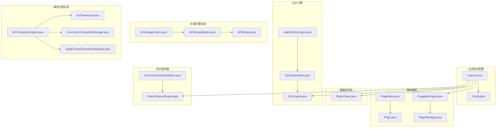
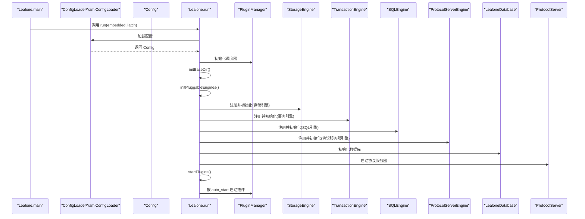
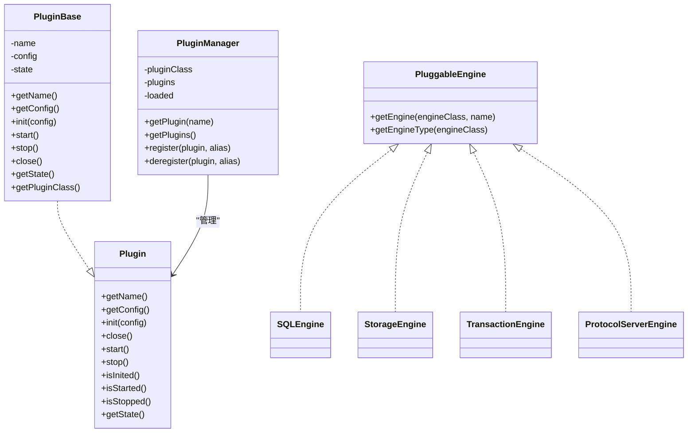
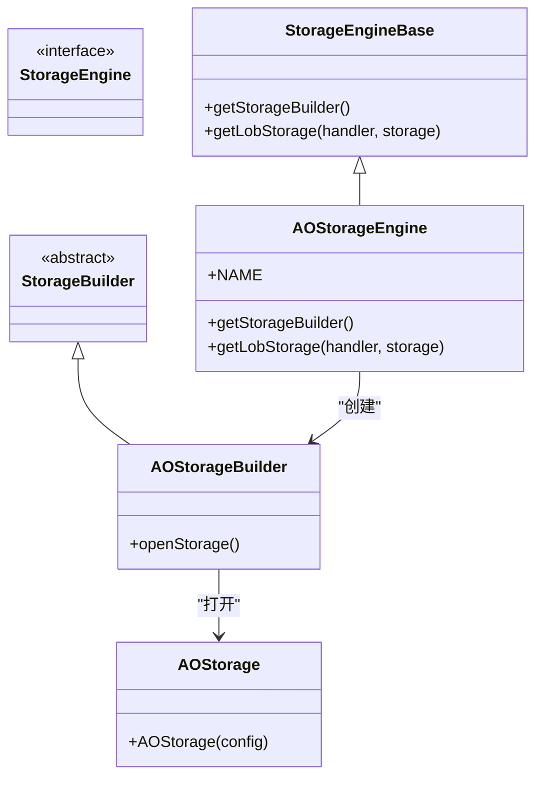
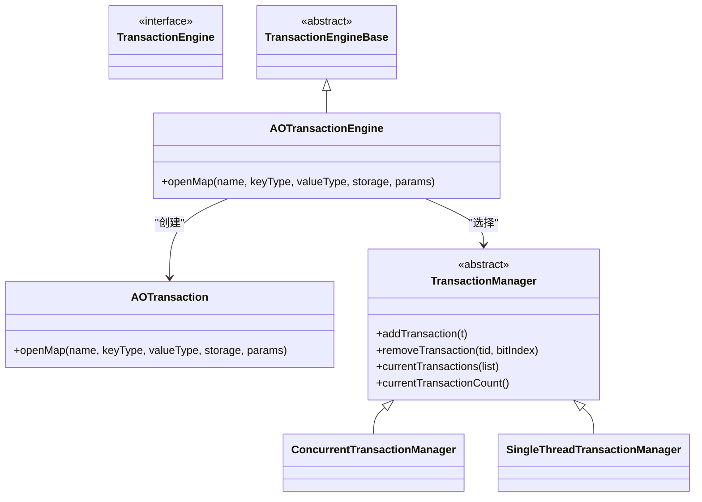
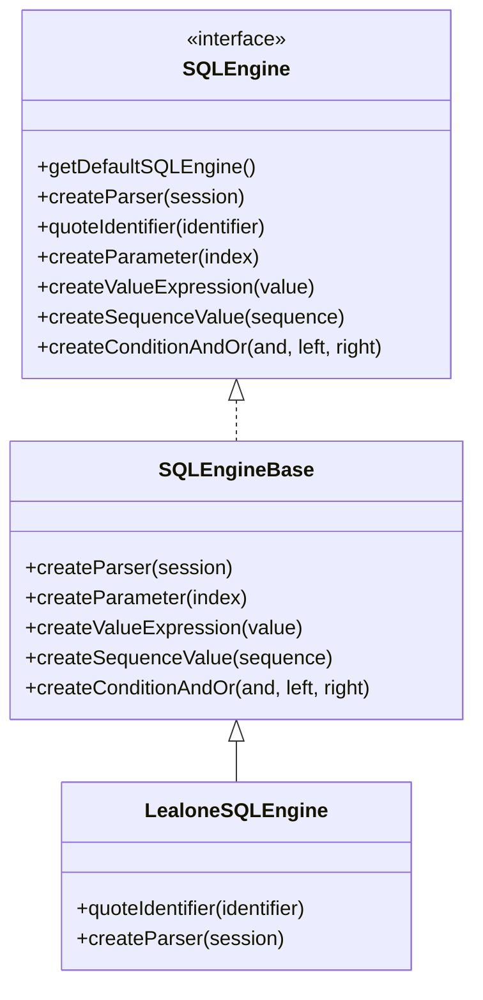
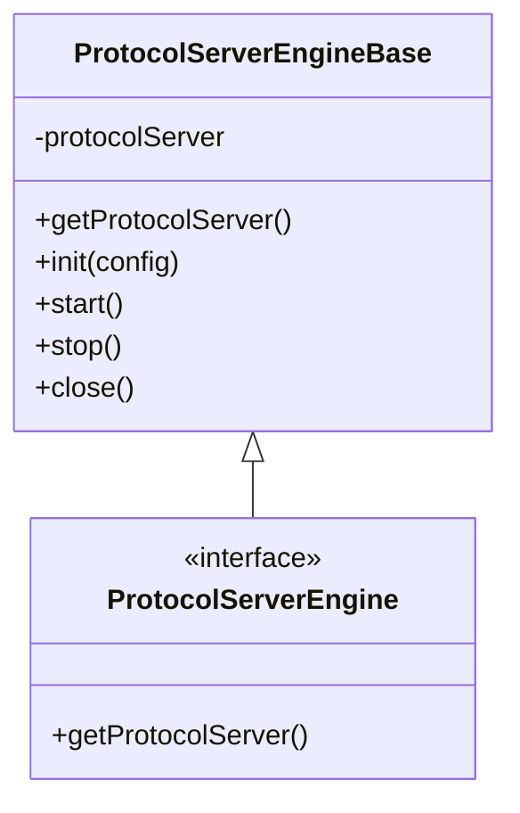
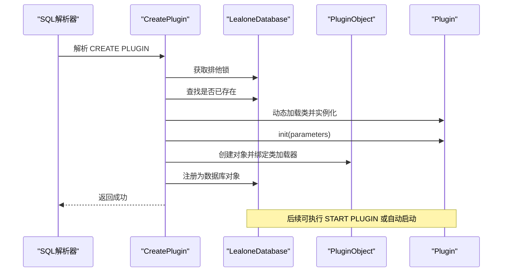
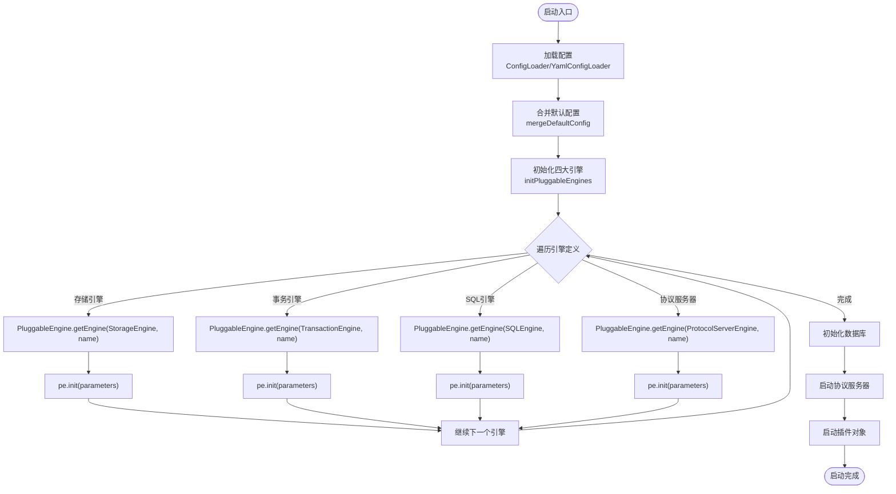
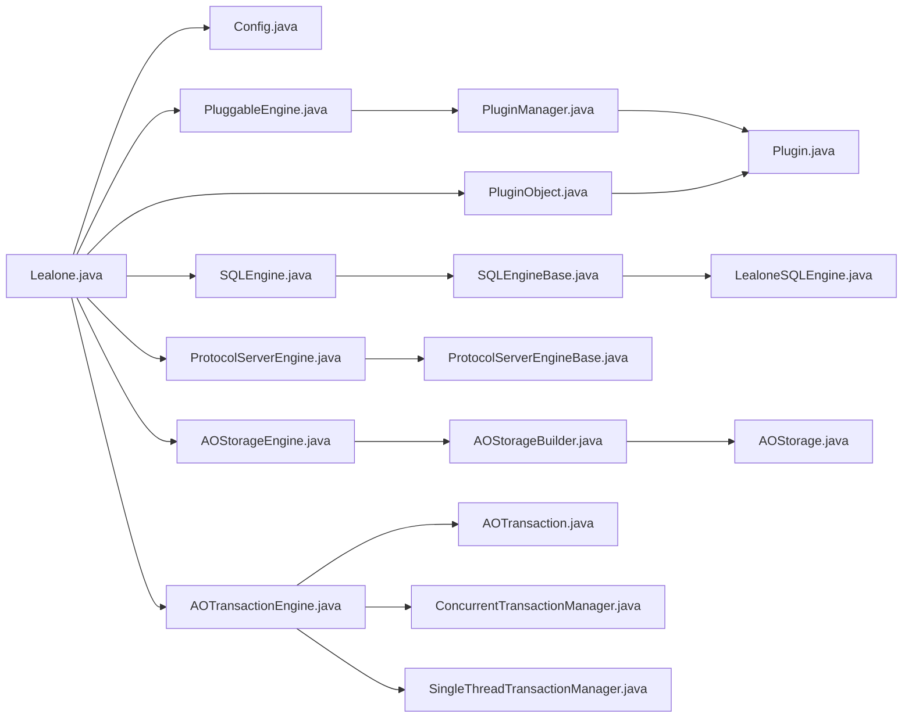

# 插件化架构

**本文引用的文件**
- [Lealone.java](https://github.com/lealone/Lealone/blob/master/lealone-main/src/main/java/com/lealone/main/Lealone.java)
- [Config.java](https://github.com/lealone/Lealone/blob/master/lealone-main/src/main/java/com/lealone/main/config/Config.java)
- [PluggableEngine.java](https://github.com/lealone/Lealone/blob/master/lealone-sci/src/main/java/com/lealone/db/plugin/PluggableEngine.java)
- [PluginManager.java](https://github.com/lealone/Lealone/blob/master/lealone-common/src/main/java/com/lealone/db/plugin/PluginManager.java)
- [Plugin.java](https://github.com/lealone/Lealone/blob/master/lealone-common/src/main/java/com/lealone/db/plugin/Plugin.java)
- [PluginBase.java](https://github.com/lealone/Lealone/blob/master/lealone-common/src/main/java/com/lealone/db/plugin/PluginBase.java)
- [PluginObject.java](https://github.com/lealone/Lealone/blob/master/lealone-db/src/main/java/com/lealone/db/plugin/PluginObject.java)
- [CreatePlugin.java](https://github.com/lealone/Lealone/blob/master/lealone-sql/src/main/java/com/lealone/sql/admin/CreatePlugin.java)
- [StartPlugin.java](https://github.com/lealone/Lealone/blob/master/lealone-sql/src/main/java/com/lealone/sql/admin/StartPlugin.java)
- [StartServer.java](https://github.com/lealone/Lealone/blob/master/lealone-sql/src/main/java/com/lealone/sql/admin/StartServer.java)
- [SQLEngine.java](https://github.com/lealone/Lealone/blob/master/lealone-sci/src/main/java/com/lealone/sql/SQLEngine.java)
- [SQLEngineBase.java](https://github.com/lealone/Lealone/blob/master/lealone-sql/src/main/java/com/lealone/sql/SQLEngineBase.java)
- [LealoneSQLEngine.java](https://github.com/lealone/Lealone/blob/master/lealone-sql/src/main/java/com/lealone/sql/LealoneSQLEngine.java)
- [ProtocolServerEngine.java](https://github.com/lealone/Lealone/blob/master/lealone-sci/src/main/java/com/lealone/server/ProtocolServerEngine.java)
- [ProtocolServerEngineBase.java](https://github.com/lealone/Lealone/blob/master/lealone-sci/src/main/java/com/lealone/server/ProtocolServerEngineBase.java)
- [AOStorageEngine.java](https://github.com/lealone/Lealone/blob/master/lealone-aose/src/main/java/com/lealone/storage/aose/AOStorageEngine.java)
- [AOStorageBuilder.java](https://github.com/lealone/Lealone/blob/master/lealone-aose/src/main/java/com/lealone/storage/aose/AOStorageBuilder.java)
- [AOStorage.java](https://github.com/lealone/Lealone/blob/master/lealone-aose/src/main/java/com/lealone/storage/aose/AOStorage.java)
- [AOTransactionEngine.java](https://github.com/lealone/Lealone/blob/master/lealone-aote/src/main/java/com/lealone/transaction/aote/AOTransactionEngine.java)
- [AOTransaction.java](https://github.com/lealone/Lealone/blob/master/lealone-aote/src/main/java/com/lealone/transaction/aote/AOTransaction.java)
- [ConcurrentTransactionManager.java](https://github.com/lealone/Lealone/blob/master/lealone-aote/src/main/java/com/lealone/transaction/aote/tm/ConcurrentTransactionManager.java)
- [SingleThreadTransactionManager.java](https://github.com/lealone/Lealone/blob/master/lealone-aote/src/main/java/com/lealone/transaction/aote/tm/SingleThreadTransactionManager.java)
- [ServerSession.java](https://github.com/lealone/Lealone/blob/master/lealone-db/src/main/java/com/lealone/db/session/ServerSession.java)

## 目录
1. [引言](#引言)
2. [项目结构](#项目结构)
3. [核心组件](#核心组件)
4. [架构总览](#架构总览)
5. [详细组件分析](#详细组件分析)
6. [依赖关系分析](#依赖关系分析)
7. [性能考量](#性能考量)
8. [故障排查指南](#故障排查指南)
9. [结论](#结论)
10. [附录：开发自定义插件指南](#附录开发自定义插件指南)

## 引言
本文件系统性阐述 Lealone 的插件化架构，围绕 PluggableEngine 接口，解释存储引擎、事务引擎、SQL 引擎与协议服务器的插件化设计原理；详解 PluginManager 如何加载、初始化与管理插件生命周期；结合 Lealone.java 的启动流程，说明插件配置（如 aose、aote）如何被解析与实例化；并提供开发自定义插件的完整指南与实践示例，帮助读者快速替换默认引擎或扩展新功能。

## 项目结构
Lealone 将插件化能力分布在多个模块：
- 主进程与配置：lealone-main
- 插件基础与管理：lealone-common
- 数据库内核与插件对象：lealone-db
- SQL 引擎与解析器：lealone-sql
- 存储引擎实现：lealone-aose
- 事务引擎实现：lealone-aote
- 协议服务器接口与实现：lealone-sci、lealone-server

图表来源
- [Lealone.java](https://github.com/lealone/Lealone/blob/master/lealone-main/src/main/java/com/lealone/main/Lealone.java#L153-L207)
- [Config.java](https://github.com/lealone/Lealone/blob/master/lealone-main/src/main/java/com/lealone/main/config/Config.java#L1-L185)
- [PluggableEngine.java](https://github.com/lealone/Lealone/blob/master/lealone-sci/src/main/java/com/lealone/db/plugin/PluggableEngine.java#L1-L46)
- [PluginManager.java](https://github.com/lealone/Lealone/blob/master/lealone-common/src/main/java/com/lealone/db/plugin/PluginManager.java#L1-L124)
- [Plugin.java](https://github.com/lealone/Lealone/blob/master/lealone-common/src/main/java/com/lealone/db/plugin/Plugin.java#L1-L39)
- [PluginBase.java](https://github.com/lealone/Lealone/blob/master/lealone-common/src/main/java/com/lealone/db/plugin/PluginBase.java#L1-L101)
- [PluginObject.java](https://github.com/lealone/Lealone/blob/master/lealone-db/src/main/java/com/lealone/db/plugin/PluginObject.java#L1-L102)
- [SQLEngine.java](https://github.com/lealone/Lealone/blob/master/lealone-sci/src/main/java/com/lealone/sql/SQLEngine.java#L1-L33)
- [SQLEngineBase.java](https://github.com/lealone/Lealone/blob/master/lealone-sql/src/main/java/com/lealone/sql/SQLEngineBase.java#L1-L59)
- [LealoneSQLEngine.java](https://github.com/lealone/Lealone/blob/master/lealone-sql/src/main/java/com/lealone/sql/LealoneSQLEngine.java#L1-L26)
- [ProtocolServerEngine.java](https://github.com/lealone/Lealone/blob/master/lealone-sci/src/main/java/com/lealone/server/ProtocolServerEngine.java#L1-L19)
- [ProtocolServerEngineBase.java](https://github.com/lealone/Lealone/blob/master/lealone-sci/src/main/java/com/lealone/server/ProtocolServerEngineBase.java#L1-L58)
- [AOStorageEngine.java](https://github.com/lealone/Lealone/blob/master/lealone-aose/src/main/java/com/lealone/storage/aose/AOStorageEngine.java#L1-L32)
- [AOStorageBuilder.java](https://github.com/lealone/Lealone/blob/master/lealone-aose/src/main/java/com/lealone/storage/aose/AOStorageBuilder.java#L1-L41)
- [AOStorage.java](https://github.com/lealone/Lealone/blob/master/lealone-aose/src/main/java/com/lealone/storage/aose/AOStorage.java#L1-L40)
- [AOTransactionEngine.java](https://github.com/lealone/Lealone/blob/master/lealone-aote/src/main/java/com/lealone/transaction/aote/AOTransactionEngine.java#L1-L36)
- [AOTransaction.java](https://github.com/lealone/Lealone/blob/master/lealone-aote/src/main/java/com/lealone/transaction/aote/AOTransaction.java#L168-L198)
- [ConcurrentTransactionManager.java](https://github.com/lealone/Lealone/blob/master/lealone-aote/src/main/java/com/lealone/transaction/aote/tm/ConcurrentTransactionManager.java#L1-L48)
- [SingleThreadTransactionManager.java](https://github.com/lealone/Lealone/blob/master/lealone-aote/src/main/java/com/lealone/transaction/aote/tm/SingleThreadTransactionManager.java#L40-L63)

章节来源
- [Lealone.java](https://github.com/lealone/Lealone/blob/master/lealone-main/src/main/java/com/lealone/main/Lealone.java#L153-L207)
- [Config.java](https://github.com/lealone/Lealone/blob/master/lealone-main/src/main/java/com/lealone/main/config/Config.java#L1-L185)

## 核心组件
- PluggableEngine：四大引擎（存储、事务、SQL、协议服务器）的统一插件标记接口，提供按名称获取与类型识别能力。
- PluginManager：插件注册表与加载器，基于 ServiceLoader 发现实现，并支持并发安全的注册/注销与按名检索。
- Plugin/PluginBase：插件生命周期抽象（init/start/stop/close），状态机与默认实现。
- PluginObject：数据库内的插件对象实体，负责持久化与自动启停控制。
- 各引擎接口与实现：
  - SQLEngine/SQLEngineBase/LealoneSQLEngine
  - ProtocolServerEngine/ProtocolServerEngineBase
  - StorageEngine/AOStorageEngine/AOStorageBuilder/AOStorage
  - TransactionEngine/AOTransactionEngine/AOTransaction/TransactionManager

章节来源
- [PluggableEngine.java](https://github.com/lealone/Lealone/blob/master/lealone-sci/src/main/java/com/lealone/db/plugin/PluggableEngine.java#L1-L46)
- [PluginManager.java](https://github.com/lealone/Lealone/blob/master/lealone-common/src/main/java/com/lealone/db/plugin/PluginManager.java#L1-L124)
- [Plugin.java](https://github.com/lealone/Lealone/blob/master/lealone-common/src/main/java/com/lealone/db/plugin/Plugin.java#L1-L39)
- [PluginBase.java](https://github.com/lealone/Lealone/blob/master/lealone-common/src/main/java/com/lealone/db/plugin/PluginBase.java#L1-L101)
- [PluginObject.java](https://github.com/lealone/Lealone/blob/master/lealone-db/src/main/java/com/lealone/db/plugin/PluginObject.java#L1-L102)
- [SQLEngine.java](https://github.com/lealone/Lealone/blob/master/lealone-sci/src/main/java/com/lealone/sql/SQLEngine.java#L1-L33)
- [SQLEngineBase.java](https://github.com/lealone/Lealone/blob/master/lealone-sql/src/main/java/com/lealone/sql/SQLEngineBase.java#L1-L59)
- [LealoneSQLEngine.java](https://github.com/lealone/Lealone/blob/master/lealone-sql/src/main/java/com/lealone/sql/LealoneSQLEngine.java#L1-L26)
- [ProtocolServerEngine.java](https://github.com/lealone/Lealone/blob/master/lealone-sci/src/main/java/com/lealone/server/ProtocolServerEngine.java#L1-L19)
- [ProtocolServerEngineBase.java](https://github.com/lealone/Lealone/blob/master/lealone-sci/src/main/java/com/lealone/server/ProtocolServerEngineBase.java#L1-L58)
- [AOStorageEngine.java](https://github.com/lealone/Lealone/blob/master/lealone-aose/src/main/java/com/lealone/storage/aose/AOStorageEngine.java#L1-L32)
- [AOStorageBuilder.java](https://github.com/lealone/Lealone/blob/master/lealone-aose/src/main/java/com/lealone/storage/aose/AOStorageBuilder.java#L1-L41)
- [AOStorage.java](https://github.com/lealone/Lealone/blob/master/lealone-aose/src/main/java/com/lealone/storage/aose/AOStorage.java#L1-L40)
- [AOTransactionEngine.java](https://github.com/lealone/Lealone/blob/master/lealone-aote/src/main/java/com/lealone/transaction/aote/AOTransactionEngine.java#L1-L36)
- [AOTransaction.java](https://github.com/lealone/Lealone/blob/master/lealone-aote/src/main/java/com/lealone/transaction/aote/AOTransaction.java#L168-L198)
- [ConcurrentTransactionManager.java](https://github.com/lealone/Lealone/blob/master/lealone-aote/src/main/java/com/lealone/transaction/aote/tm/ConcurrentTransactionManager.java#L1-L48)
- [SingleThreadTransactionManager.java](https://github.com/lealone/Lealone/blob/master/lealone-aote/src/main/java/com/lealone/transaction/aote/tm/SingleThreadTransactionManager.java#L40-L63)

## 架构总览
Lealone 的启动流程遵循“配置加载 → 引擎初始化 → 数据库初始化 → 协议服务器启动 → 插件自动启动”的顺序。插件配置由 Config 定义，Lealone 在启动时按顺序初始化四大引擎，并在协议服务器启动后启动数据库内已注册的插件对象。

图表来源
- [Lealone.java](https://github.com/lealone/Lealone/blob/master/lealone-main/src/main/java/com/lealone/main/Lealone.java#L153-L207)
- [Lealone.java](https://github.com/lealone/Lealone/blob/master/lealone-main/src/main/java/com/lealone/main/Lealone.java#L253-L318)
- [Config.java](https://github.com/lealone/Lealone/blob/master/lealone-main/src/main/java/com/lealone/main/config/Config.java#L1-L185)
- [PluggableEngine.java](https://github.com/lealone/Lealone/blob/master/lealone-sci/src/main/java/com/lealone/db/plugin/PluggableEngine.java#L1-L46)
- [PluginManager.java](https://github.com/lealone/Lealone/blob/master/lealone-common/src/main/java/com/lealone/db/plugin/PluginManager.java#L1-L124)

章节来源
- [Lealone.java](https://github.com/lealone/Lealone/blob/master/lealone-main/src/main/java/com/lealone/main/Lealone.java#L153-L207)
- [Lealone.java](https://github.com/lealone/Lealone/blob/master/lealone-main/src/main/java/com/lealone/main/Lealone.java#L253-L318)
- [Config.java](https://github.com/lealone/Lealone/blob/master/lealone-main/src/main/java/com/lealone/main/config/Config.java#L1-L185)

## 详细组件分析

### PluggableEngine 与 PluginManager
- PluggableEngine.getEngine：优先从 PluginManager 查找，未找到则通过类名反射实例化并注册，便于按名称动态加载。
- PluggableEngine.getEngineType：用于错误消息与日志输出，区分存储/事务/SQL/协议服务器引擎类型。
- PluginManager：使用 ServiceLoader 自动发现实现类，注册到并发安全的 Map 中；支持按名检索、批量获取、注册/注销与懒加载。

图表来源
- [Plugin.java](https://github.com/lealone/Lealone/blob/master/lealone-common/src/main/java/com/lealone/db/plugin/Plugin.java#L1-L39)
- [PluginBase.java](https://github.com/lealone/Lealone/blob/master/lealone-common/src/main/java/com/lealone/db/plugin/PluginBase.java#L1-L101)
- [PluggableEngine.java](https://github.com/lealone/Lealone/blob/master/lealone-sci/src/main/java/com/lealone/db/plugin/PluggableEngine.java#L1-L46)
- [PluginManager.java](https://github.com/lealone/Lealone/blob/master/lealone-common/src/main/java/com/lealone/db/plugin/PluginManager.java#L1-L124)

章节来源
- [PluggableEngine.java](https://github.com/lealone/Lealone/blob/master/lealone-sci/src/main/java/com/lealone/db/plugin/PluggableEngine.java#L1-L46)
- [PluginManager.java](https://github.com/lealone/Lealone/blob/master/lealone-common/src/main/java/com/lealone/db/plugin/PluginManager.java#L1-L124)
- [Plugin.java](https://github.com/lealone/Lealone/blob/master/lealone-common/src/main/java/com/lealone/db/plugin/Plugin.java#L1-L39)
- [PluginBase.java](https://github.com/lealone/Lealone/blob/master/lealone-common/src/main/java/com/lealone/db/plugin/PluginBase.java#L1-L101)

### 存储引擎插件（AOSE）
- AOStorageEngine：继承 StorageEngineBase，提供 StorageBuilder 与 LOB 存储实现。
- AOStorageBuilder：根据配置打开 AOStorage 实例，支持缓存与调度工厂注入。
- AOStorage：基于文件系统与页存储模式的存储实现，负责目录创建与文件扫描。

图表来源
- [AOStorageEngine.java](https://github.com/lealone/Lealone/blob/master/lealone-aose/src/main/java/com/lealone/storage/aose/AOStorageEngine.java#L1-L32)
- [AOStorageBuilder.java](https://github.com/lealone/Lealone/blob/master/lealone-aose/src/main/java/com/lealone/storage/aose/AOStorageBuilder.java#L1-L41)
- [AOStorage.java](https://github.com/lealone/Lealone/blob/master/lealone-aose/src/main/java/com/lealone/storage/aose/AOStorage.java#L1-L40)

章节来源
- [AOStorageEngine.java](https://github.com/lealone/Lealone/blob/master/lealone-aose/src/main/java/com/lealone/storage/aose/AOStorageEngine.java#L1-L32)
- [AOStorageBuilder.java](https://github.com/lealone/Lealone/blob/master/lealone-aose/src/main/java/com/lealone/storage/aose/AOStorageBuilder.java#L1-L41)
- [AOStorage.java](https://github.com/lealone/Lealone/blob/master/lealone-aose/src/main/java/com/lealone/storage/aose/AOStorage.java#L1-L40)

### 事务引擎插件（AOTE）
- AOTransactionEngine：继承 TransactionEngineBase，实现存储事件监听与事务映射创建。
- AOTransaction：支持按存储类型包装值类型，适配事务语义。
- TransactionManager 抽象与并发/单线程实现：维护当前事务集合与计数。

图表来源
- [AOTransactionEngine.java](https://github.com/lealone/Lealone/blob/master/lealone-aote/src/main/java/com/lealone/transaction/aote/AOTransactionEngine.java#L1-L36)
- [AOTransaction.java](https://github.com/lealone/Lealone/blob/master/lealone-aote/src/main/java/com/lealone/transaction/aote/AOTransaction.java#L168-L198)
- [ConcurrentTransactionManager.java](https://github.com/lealone/Lealone/blob/master/lealone-aote/src/main/java/com/lealone/transaction/aote/tm/ConcurrentTransactionManager.java#L1-L48)
- [SingleThreadTransactionManager.java](https://github.com/lealone/Lealone/blob/master/lealone-aote/src/main/java/com/lealone/transaction/aote/tm/SingleThreadTransactionManager.java#L40-L63)

章节来源
- [AOTransactionEngine.java](https://github.com/lealone/Lealone/blob/master/lealone-aote/src/main/java/com/lealone/transaction/aote/AOTransactionEngine.java#L1-L36)
- [AOTransaction.java](https://github.com/lealone/Lealone/blob/master/lealone-aote/src/main/java/com/lealone/transaction/aote/AOTransaction.java#L168-L198)
- [ConcurrentTransactionManager.java](https://github.com/lealone/Lealone/blob/master/lealone-aote/src/main/java/com/lealone/transaction/aote/tm/ConcurrentTransactionManager.java#L1-L48)
- [SingleThreadTransactionManager.java](https://github.com/lealone/Lealone/blob/master/lealone-aote/src/main/java/com/lealone/transaction/aote/tm/SingleThreadTransactionManager.java#L40-L63)

### SQL 引擎插件
- SQLEngine：扩展 PluggableEngine，提供默认 SQL 引擎获取方法与表达式/解析器工厂方法。
- SQLEngineBase：提供通用表达式与解析器工厂方法，默认实现。
- LealoneSQLEngine：具体实现，提供标识符转义与解析器创建。

图表来源
- [SQLEngine.java](https://github.com/lealone/Lealone/blob/master/lealone-sci/src/main/java/com/lealone/sql/SQLEngine.java#L1-L33)
- [SQLEngineBase.java](https://github.com/lealone/Lealone/blob/master/lealone-sql/src/main/java/com/lealone/sql/SQLEngineBase.java#L1-L59)
- [LealoneSQLEngine.java](https://github.com/lealone/Lealone/blob/master/lealone-sql/src/main/java/com/lealone/sql/LealoneSQLEngine.java#L1-L26)

章节来源
- [SQLEngine.java](https://github.com/lealone/Lealone/blob/master/lealone-sci/src/main/java/com/lealone/sql/SQLEngine.java#L1-L33)
- [SQLEngineBase.java](https://github.com/lealone/Lealone/blob/master/lealone-sql/src/main/java/com/lealone/sql/SQLEngineBase.java#L1-L59)
- [LealoneSQLEngine.java](https://github.com/lealone/Lealone/blob/master/lealone-sql/src/main/java/com/lealone/sql/LealoneSQLEngine.java#L1-L26)

### 协议服务器插件
- ProtocolServerEngine：扩展 PluggableEngine，提供 ProtocolServer 获取方法。
- ProtocolServerEngineBase：封装 ProtocolServer 生命周期，统一 init/start/stop 并委派给具体实现。

图表来源
- [ProtocolServerEngine.java](https://github.com/lealone/Lealone/blob/master/lealone-sci/src/main/java/com/lealone/server/ProtocolServerEngine.java#L1-L19)
- [ProtocolServerEngineBase.java](https://github.com/lealone/Lealone/blob/master/lealone-sci/src/main/java/com/lealone/server/ProtocolServerEngineBase.java#L1-L58)

章节来源
- [ProtocolServerEngine.java](https://github.com/lealone/Lealone/blob/master/lealone-sci/src/main/java/com/lealone/server/ProtocolServerEngine.java#L1-L19)
- [ProtocolServerEngineBase.java](https://github.com/lealone/Lealone/blob/master/lealone-sci/src/main/java/com/lealone/server/ProtocolServerEngineBase.java#L1-L58)

### 插件对象与数据库集成
- PluginObject：数据库内插件对象，保存实现类名、类路径、参数与类加载器；支持 start/stop 与自动启动。
- CreatePlugin/StartPlugin：SQL 命令实现，支持动态加载外部类并初始化插件对象。
- Lealone.java 在启动完成后调用 startPlugins，遍历数据库中的插件对象并按 auto_start 启动。

图表来源
- [CreatePlugin.java](https://github.com/lealone/Lealone/blob/master/lealone-sql/src/main/java/com/lealone/sql/admin/CreatePlugin.java#L1-L115)
- [StartPlugin.java](https://github.com/lealone/Lealone/blob/master/lealone-sql/src/main/java/com/lealone/sql/admin/StartPlugin.java#L1-L46)
- [PluginObject.java](https://github.com/lealone/Lealone/blob/master/lealone-db/src/main/java/com/lealone/db/plugin/PluginObject.java#L1-L102)
- [Lealone.java](https://github.com/lealone/Lealone/blob/master/lealone-main/src/main/java/com/lealone/main/Lealone.java#L318-L329)

章节来源
- [CreatePlugin.java](https://github.com/lealone/Lealone/blob/master/lealone-sql/src/main/java/com/lealone/sql/admin/CreatePlugin.java#L1-L115)
- [StartPlugin.java](https://github.com/lealone/Lealone/blob/master/lealone-sql/src/main/java/com/lealone/sql/admin/StartPlugin.java#L1-L46)
- [PluginObject.java](https://github.com/lealone/Lealone/blob/master/lealone-db/src/main/java/com/lealone/db/plugin/PluginObject.java#L1-L102)
- [Lealone.java](https://github.com/lealone/Lealone/blob/master/lealone-main/src/main/java/com/lealone/main/Lealone.java#L318-L329)

### 启动流程与插件配置解析（aose/aote 示例）
- 配置合并：Config.mergeDefaultConfig 将默认引擎配置与用户配置合并，确保存储/事务/SQL/协议服务器均有默认项。
- 启动顺序：Lealone.initPluggableEngines 严格按存储 → 事务 → SQL → 协议服务器顺序初始化。
- 参数处理：registerAndInitEngines 对每个引擎定义进行参数标准化（大小写不敏感、填充 base_dir、协议服务器 host 继承 listen_address 等），然后通过 PluggableEngine.getEngine 获取或实例化引擎并调用 init。
- aose/aote：AOSE/AOTE 分别作为存储/事务引擎的实现，通过名称在配置中启用，随后被加载与初始化。

图表来源
- [Lealone.java](https://github.com/lealone/Lealone/blob/master/lealone-main/src/main/java/com/lealone/main/Lealone.java#L253-L318)
- [Config.java](https://github.com/lealone/Lealone/blob/master/lealone-main/src/main/java/com/lealone/main/config/Config.java#L115-L185)
- [PluggableEngine.java](https://github.com/lealone/Lealone/blob/master/lealone-sci/src/main/java/com/lealone/db/plugin/PluggableEngine.java#L1-L46)

章节来源
- [Lealone.java](https://github.com/lealone/Lealone/blob/master/lealone-main/src/main/java/com/lealone/main/Lealone.java#L253-L318)
- [Config.java](https://github.com/lealone/Lealone/blob/master/lealone-main/src/main/java/com/lealone/main/config/Config.java#L115-L185)
- [PluggableEngine.java](https://github.com/lealone/Lealone/blob/master/lealone-sci/src/main/java/com/lealone/db/plugin/PluggableEngine.java#L1-L46)

## 依赖关系分析
- 组件耦合：
  - Lealone 依赖 Config 与四大引擎接口；通过 PluggableEngine.getEngine 与 PluginManager 解耦具体实现。
  - PluginManager 仅依赖 ServiceLoader 与插件接口，保持低耦合。
  - PluginObject 与 LealoneDatabase 强耦合，用于持久化与生命周期管理。
- 外部依赖：
  - ServiceLoader 机制用于自动发现插件实现类。
  - URLClassLoader 支持外部类路径加载，配合 CreatePlugin 实现动态插件加载。

图表来源
- [Lealone.java](https://github.com/lealone/Lealone/blob/master/lealone-main/src/main/java/com/lealone/main/Lealone.java#L153-L207)
- [Config.java](https://github.com/lealone/Lealone/blob/master/lealone-main/src/main/java/com/lealone/main/config/Config.java#L1-L185)
- [PluggableEngine.java](https://github.com/lealone/Lealone/blob/master/lealone-sci/src/main/java/com/lealone/db/plugin/PluggableEngine.java#L1-L46)
- [PluginManager.java](https://github.com/lealone/Lealone/blob/master/lealone-common/src/main/java/com/lealone/db/plugin/PluginManager.java#L1-L124)
- [Plugin.java](https://github.com/lealone/Lealone/blob/master/lealone-common/src/main/java/com/lealone/db/plugin/Plugin.java#L1-L39)
- [PluginObject.java](https://github.com/lealone/Lealone/blob/master/lealone-db/src/main/java/com/lealone/db/plugin/PluginObject.java#L1-L102)
- [SQLEngine.java](https://github.com/lealone/Lealone/blob/master/lealone-sci/src/main/java/com/lealone/sql/SQLEngine.java#L1-L33)
- [SQLEngineBase.java](https://github.com/lealone/Lealone/blob/master/lealone-sql/src/main/java/com/lealone/sql/SQLEngineBase.java#L1-L59)
- [LealoneSQLEngine.java](https://github.com/lealone/Lealone/blob/master/lealone-sql/src/main/java/com/lealone/sql/LealoneSQLEngine.java#L1-L26)
- [ProtocolServerEngine.java](https://github.com/lealone/Lealone/blob/master/lealone-sci/src/main/java/com/lealone/server/ProtocolServerEngine.java#L1-L19)
- [ProtocolServerEngineBase.java](https://github.com/lealone/Lealone/blob/master/lealone-sci/src/main/java/com/lealone/server/ProtocolServerEngineBase.java#L1-L58)
- [AOStorageEngine.java](https://github.com/lealone/Lealone/blob/master/lealone-aose/src/main/java/com/lealone/storage/aose/AOStorageEngine.java#L1-L32)
- [AOStorageBuilder.java](https://github.com/lealone/Lealone/blob/master/lealone-aose/src/main/java/com/lealone/storage/aose/AOStorageBuilder.java#L1-L41)
- [AOStorage.java](https://github.com/lealone/Lealone/blob/master/lealone-aose/src/main/java/com/lealone/storage/aose/AOStorage.java#L1-L40)
- [AOTransactionEngine.java](https://github.com/lealone/Lealone/blob/master/lealone-aote/src/main/java/com/lealone/transaction/aote/AOTransactionEngine.java#L1-L36)
- [AOTransaction.java](https://github.com/lealone/Lealone/blob/master/lealone-aote/src/main/java/com/lealone/transaction/aote/AOTransaction.java#L168-L198)
- [ConcurrentTransactionManager.java](https://github.com/lealone/Lealone/blob/master/lealone-aote/src/main/java/com/lealone/transaction/aote/tm/ConcurrentTransactionManager.java#L1-L48)
- [SingleThreadTransactionManager.java](https://github.com/lealone/Lealone/blob/master/lealone-aote/src/main/java/com/lealone/transaction/aote/tm/SingleThreadTransactionManager.java#L40-L63)

章节来源
- [Lealone.java](https://github.com/lealone/Lealone/blob/master/lealone-main/src/main/java/com/lealone/main/Lealone.java#L153-L207)
- [Config.java](https://github.com/lealone/Lealone/blob/master/lealone-main/src/main/java/com/lealone/main/config/Config.java#L1-L185)
- [PluggableEngine.java](https://github.com/lealone/Lealone/blob/master/lealone-sci/src/main/java/com/lealone/db/plugin/PluggableEngine.java#L1-L46)
- [PluginManager.java](https://github.com/lealone/Lealone/blob/master/lealone-common/src/main/java/com/lealone/db/plugin/PluginManager.java#L1-L124)
- [PluginObject.java](https://github.com/lealone/Lealone/blob/master/lealone-db/src/main/java/com/lealone/db/plugin/PluginObject.java#L1-L102)

## 性能考量
- 插件懒加载：PluginManager 在首次查询时才加载 ServiceLoader，避免启动时的额外开销。
- 并发安全：插件注册表使用并发容器，保证多线程场景下的读写一致性。
- 存储层缓存：AOStorageBuilder 对相同存储路径进行缓存，减少重复实例化成本。
- 调度器复用：各引擎共享调度器工厂，降低线程与任务管理成本。
- 启动阶段延迟：协议服务器启动在数据库初始化之后，确保资源可用性与稳定性。

[本节为通用指导，无需特定文件引用]

## 故障排查指南
- 插件未找到：检查配置中引擎名称是否正确，确认 PluggableEngine.getEngine 是否能通过名称解析到实现类。
- 插件初始化失败：查看 ConfigException 与日志，确认参数完整性（如 base_dir、host/port 等）。
- 插件类加载异常：CreatePlugin 使用 URLClassLoader 加载外部类，若 classPath 错误或类不存在会抛出异常。
- 插件生命周期问题：确认 PluginBase 的 init/start/stop/close 调用顺序与状态机一致。

章节来源
- [PluggableEngine.java](https://github.com/lealone/Lealone/blob/master/lealone-sci/src/main/java/com/lealone/db/plugin/PluggableEngine.java#L1-L46)
- [PluginManager.java](https://github.com/lealone/Lealone/blob/master/lealone-common/src/main/java/com/lealone/db/plugin/PluginManager.java#L1-L124)
- [CreatePlugin.java](https://github.com/lealone/Lealone/blob/master/lealone-sql/src/main/java/com/lealone/sql/admin/CreatePlugin.java#L1-L115)
- [PluginBase.java](https://github.com/lealone/Lealone/blob/master/lealone-common/src/main/java/com/lealone/db/plugin/PluginBase.java#L1-L101)

## 结论
Lealone 的插件化架构以 PluggableEngine 为核心，通过统一接口与 PluginManager 实现解耦与动态加载；配置驱动的初始化流程确保存储、事务、SQL、协议服务器四大引擎的有序装配；数据库内插件对象与 SQL 命令进一步实现了运行时插件的创建、启动与管理。该设计既保留了默认实现（如 aose/aote），又允许开发者灵活替换或扩展引擎能力。

[本节为总结，无需特定文件引用]

## 附录：开发自定义插件指南

### 一、实现步骤
1. 实现 Plugin 接口或继承 PluginBase，完成 init/start/stop/close 与状态管理。
2. 在插件实现类中声明 getPluginClass，返回该插件所属的接口类型（如 StorageEngine.class）。
3. 若需要被 ServiceLoader 自动发现，确保实现类具备公共无参构造函数，并在 META-INF/services 下提供服务描述文件。
4. 在配置中注册插件定义（名称、参数、是否默认），并在启动时被 Lealone.initPluggableEngines 加载。

章节来源
- [Plugin.java](https://github.com/lealone/Lealone/blob/master/lealone-common/src/main/java/com/lealone/db/plugin/Plugin.java#L1-L39)
- [PluginBase.java](https://github.com/lealone/Lealone/blob/master/lealone-common/src/main/java/com/lealone/db/plugin/PluginBase.java#L1-L101)
- [PluggableEngine.java](https://github.com/lealone/Lealone/blob/master/lealone-sci/src/main/java/com/lealone/db/plugin/PluggableEngine.java#L1-L46)
- [Lealone.java](https://github.com/lealone/Lealone/blob/master/lealone-main/src/main/java/com/lealone/main/Lealone.java#L253-L318)

### 二、配置注册与依赖管理
- 在 Config 中定义插件列表（storage_engines/transaction_engines/sql_engines/protocol_server_engines），每条定义包含 name/enabled/is_default/parameters。
- 参数大小写不敏感，Lealone 会在必要时填充 base_dir、host 等默认值。
- 默认引擎键（如 default.storage.engine）可在首次启用且未显式设置时由 Lealone 写入系统属性。

章节来源
- [Config.java](https://github.com/lealone/Lealone/blob/master/lealone-main/src/main/java/com/lealone/main/config/Config.java#L1-L185)
- [Lealone.java](https://github.com/lealone/Lealone/blob/master/lealone-main/src/main/java/com/lealone/main/Lealone.java#L253-L318)

### 三、替换默认引擎或添加新功能
- 替换存储引擎：在配置中将 storage_engines 列表中的默认项替换为你的实现名称，并确保实现类可被加载。
- 替换事务引擎：类似地，在 transaction_engines 中指定你的实现名称。
- 添加新功能：通过 PluginObject 与 SQL 命令（CreatePlugin/StartPlugin）在运行时注册并启动插件，或在启动阶段通过配置启用。

章节来源
- [CreatePlugin.java](https://github.com/lealone/Lealone/blob/master/lealone-sql/src/main/java/com/lealone/sql/admin/CreatePlugin.java#L1-L115)
- [StartPlugin.java](https://github.com/lealone/Lealone/blob/master/lealone-sql/src/main/java/com/lealone/sql/admin/StartPlugin.java#L1-L46)
- [Lealone.java](https://github.com/lealone/Lealone/blob/master/lealone-main/src/main/java/com/lealone/main/Lealone.java#L318-L329)

### 四、示例路径参考
- 自定义存储引擎实现：[AOStorageEngine.java](https://github.com/lealone/Lealone/blob/master/lealone-aose/src/main/java/com/lealone/storage/aose/AOStorageEngine.java#L1-L32)
- 自定义事务引擎实现：[AOTransactionEngine.java](https://github.com/lealone/Lealone/blob/master/lealone-aote/src/main/java/com/lealone/transaction/aote/AOTransactionEngine.java#L1-L36)
- 自定义 SQL 引擎实现：[LealoneSQLEngine.java](https://github.com/lealone/Lealone/blob/master/lealone-sql/src/main/java/com/lealone/sql/LealoneSQLEngine.java#L1-L26)
- 协议服务器引擎基类：[ProtocolServerEngineBase.java](https://github.com/lealone/Lealone/blob/master/lealone-sci/src/main/java/com/lealone/server/ProtocolServerEngineBase.java#L1-L58)
- 插件对象与自动启动：[PluginObject.java](https://github.com/lealone/Lealone/blob/master/lealone-db/src/main/java/com/lealone/db/plugin/PluginObject.java#L1-L102)

[本节为实践指南，引用上述文件路径作为示例参考]