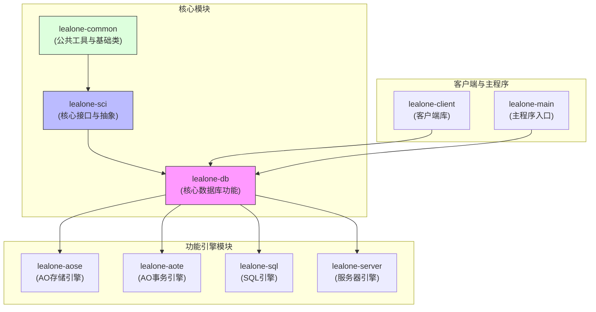
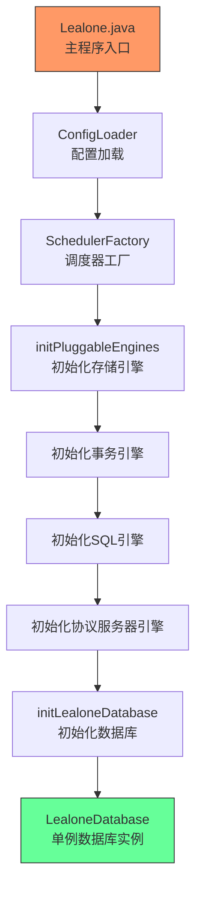
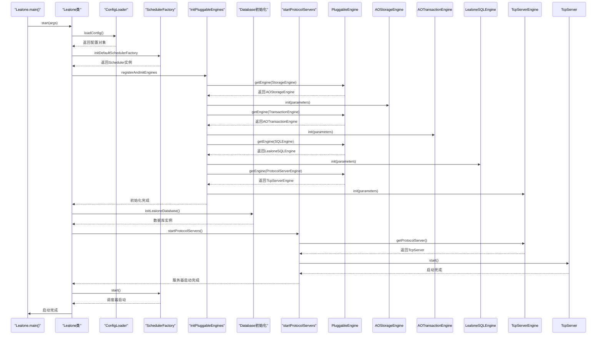
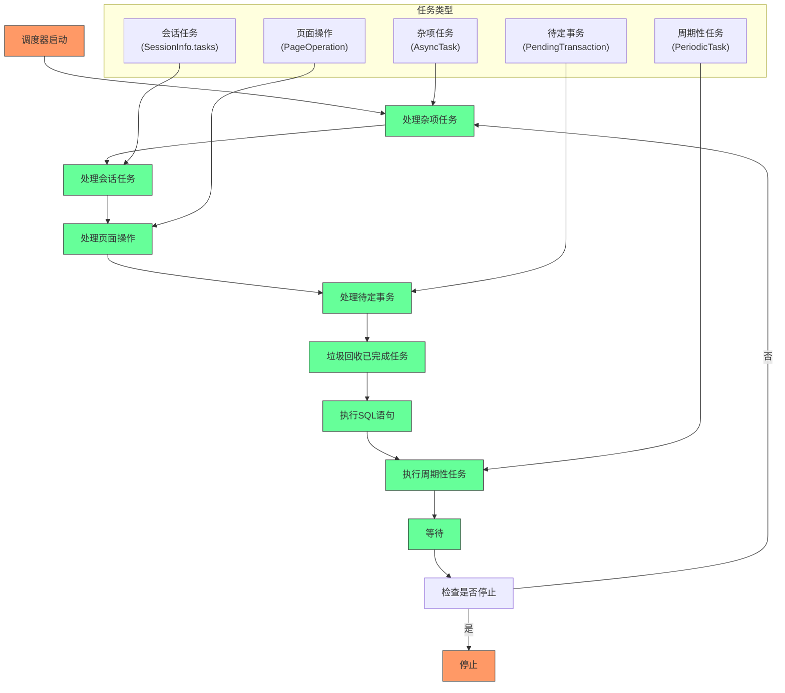
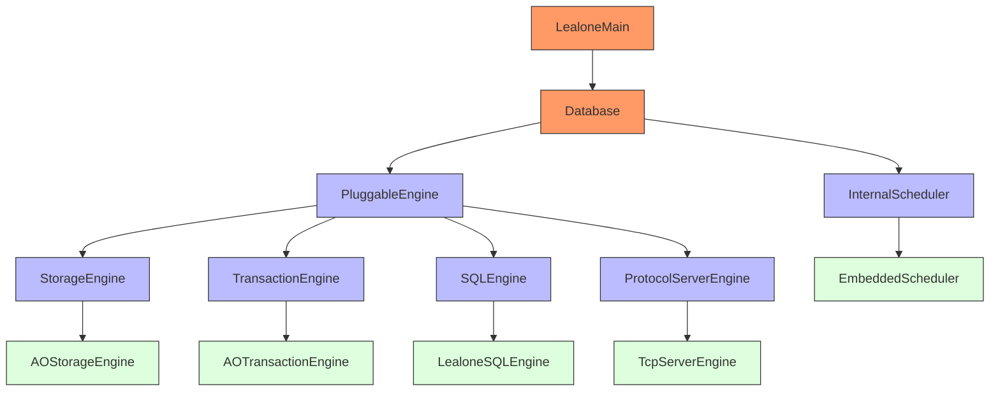

# 架构设计


**本文档中引用的文件**  
- [Lealone.java](https://github.com/lealone/Lealone/blob/master/lealone-main/src/main/java/com/lealone/main/Lealone.java)
- [Database.java](https://github.com/lealone/Lealone/blob/master/lealone-db/src/main/java/com/lealone/db/Database.java)
- [PluggableEngine.java](https://github.com/lealone/Lealone/blob/master/lealone-sci/src/main/java/com/lealone/db/plugin/PluggableEngine.java)
- [StorageEngine.java](https://github.com/lealone/Lealone/blob/master/lealone-sci/src/main/java/com/lealone/storage/StorageEngine.java)
- [TransactionEngine.java](https://github.com/lealone/Lealone/blob/master/lealone-sci/src/main/java/com/lealone/transaction/TransactionEngine.java)
- [SQLEngine.java](https://github.com/lealone/Lealone/blob/master/lealone-sci/src/main/java/com/lealone/sql/SQLEngine.java)
- [ProtocolServerEngine.java](https://github.com/lealone/Lealone/blob/master/lealone-sci/src/main/java/com/lealone/server/ProtocolServerEngine.java)
- [InternalScheduler.java](https://github.com/lealone/Lealone/blob/master/lealone-sci/src/main/java/com/lealone/db/scheduler/InternalScheduler.java)
- [EmbeddedScheduler.java](https://github.com/lealone/Lealone/blob/master/lealone-sci/src/main/java/com/lealone/db/scheduler/EmbeddedScheduler.java)
- [AOStorageEngine.java](https://github.com/lealone/Lealone/blob/master/lealone-aose/src/main/java/com/lealone/storage/aose/AOStorageEngine.java)
- [AOTransactionEngine.java](https://github.com/lealone/Lealone/blob/master/lealone-aote/src/main/java/com/lealone/transaction/aote/AOTransactionEngine.java)
- [LealoneSQLEngine.java](https://github.com/lealone/Lealone/blob/master/lealone-sql/src/main/java/com/lealone/sql/LealoneSQLEngine.java)
- [TcpServerEngine.java](https://github.com/lealone/Lealone/blob/master/lealone-server/src/main/java/com/lealone/server/TcpServerEngine.java)


## 目录
1. [引言](#引言)
2. [项目结构](#项目结构)
3. [核心组件](#核心组件)
4. [架构概述](#架构概述)
5. [详细组件分析](#详细组件分析)
6. [依赖分析](#依赖分析)
7. [性能考虑](#性能考虑)
8. [故障排除指南](#故障排除指南)
9. [结论](#结论)

## 引言
Lealone 是一个基于插件化微内核架构的数据库系统，其设计目标是实现高可扩展性、模块化和灵活性。该系统通过将核心功能（如存储、事务、SQL处理和协议服务）解耦为独立的可插拔引擎，实现了各组件之间的松耦合。这种架构允许开发者根据需要替换或扩展特定功能模块，而无需修改核心代码。

系统采用全链路异步化设计理念，通过调度器（Scheduler）管理任务执行，确保高并发场景下的性能和响应性。本文档将深入分析Lealone的系统架构，重点阐述其插件化设计、启动流程、核心组件交互以及异步任务管理机制，为开发者提供一个清晰的系统全景视图。

## 项目结构
Lealone项目采用模块化设计，每个核心功能都封装在独立的模块中。这种结构不仅提高了代码的可维护性，还便于功能的独立开发和测试。



**图示来源**  
- [lealone-db](https://github.com/lealone/Lealone/blob/master/lealone-db)
- [lealone-sci](https://github.com/lealone/Lealone/blob/master/lealone-sci)
- [lealone-aose](https://github.com/lealone/Lealone/blob/master/lealone-aose)
- [lealone-aote](https://github.com/lealone/Lealone/blob/master/lealone-aote)
- [lealone-sql](https://github.com/lealone/Lealone/blob/master/lealone-sql)
- [lealone-server](https://github.com/lealone/Lealone/blob/master/lealone-server)

**本节来源**  
- [lealone-main](https://github.com/lealone/Lealone/blob/master/lealone-main)
- [lealone-client](https://github.com/lealone/Lealone/blob/master/lealone-client)

## 核心组件
Lealone系统的核心组件包括微内核（Database）、插件引擎框架（PluggableEngine）和调度器（Scheduler）。微内核负责协调各引擎的初始化和运行，插件引擎框架提供了可插拔架构的基础，而调度器则管理着系统的异步任务执行。

**本节来源**  
- [Database.java](https://github.com/lealone/Lealone/blob/master/lealone-db/src/main/java/com/lealone/db/Database.java)
- [PluggableEngine.java](https://github.com/lealone/Lealone/blob/master/lealone-sci/src/main/java/com/lealone/db/plugin/PluggableEngine.java)
- [InternalScheduler.java](https://github.com/lealone/Lealone/blob/master/lealone-sci/src/main/java/com/lealone/db/scheduler/InternalScheduler.java)

## 架构概述
Lealone采用插件化微内核架构，将数据库的核心功能分解为四个主要的可插拔引擎：存储引擎、事务引擎、SQL引擎和协议服务器引擎。这种设计实现了各功能模块的解耦，使得每个引擎都可以独立开发、测试和替换。



**图示来源**  
- [Lealone.java](https://github.com/lealone/Lealone/blob/master/lealone-main/src/main/java/com/lealone/main/Lealone.java#L153-L203)
- [Database.java](https://github.com/lealone/Lealone/blob/master/lealone-db/src/main/java/com/lealone/db/Database.java#L207-L238)

## 详细组件分析

### 插件化架构分析
Lealone的插件化架构基于`PluggableEngine`接口，该接口作为所有可插拔引擎的标记接口。通过这种设计，系统实现了存储、事务、SQL和协议服务等核心功能的完全解耦。

```mermaid
classDiagram
class PluggableEngine {
<<interface>>
+getEngine(Class<PE>, String) PE
+getEngineType(Class<PE>) String
}
class StorageEngine {
<<interface>>
+getStorageBuilder() StorageBuilder
+getLobStorage(DataHandler, Storage) LobStorage
+getDefaultStorageEngine() StorageEngine
}
class TransactionEngine {
<<interface>>
+beginTransaction(RunMode, int, InternalScheduler) Transaction
+supportsMVCC() boolean
+checkpoint() void
+getFsyncService() Runnable
+getDefaultTransactionEngine() TransactionEngine
}
class SQLEngine {
<<interface>>
+createParser(Session) SQLParser
+quoteIdentifier(String) String
+getDefaultSQLEngine() SQLEngine
}
class ProtocolServerEngine {
<<interface>>
+getProtocolServer() ProtocolServer
}
class AOStorageEngine {
+NAME : String
+getStorageBuilder() StorageBuilder
+getLobStorage(DataHandler, Storage) LobStorage
}
class AOTransactionEngine {
+NAME : String
+beginTransaction(RunMode, int, InternalScheduler) Transaction
+getFsyncService() Runnable
}
class LealoneSQLEngine {
+NAME : String
+createParser(Session) SQLParser
}
class TcpServerEngine {
+NAME : String
+getProtocolServer() ProtocolServer
}
PluggableEngine <|-- StorageEngine
PluggableEngine <|-- TransactionEngine
PluggableEngine <|-- SQLEngine
PluggableEngine <|-- ProtocolServerEngine
StorageEngine <|-- AOStorageEngine
TransactionEngine <|-- AOTransactionEngine
SQLEngine <|-- LealoneSQLEngine
ProtocolServerEngine <|-- TcpServerEngine
note right of PluggableEngine
插件化引擎的标记接口
提供引擎获取和类型识别功能
end note
note right of StorageEngine
存储引擎接口
负责数据的持久化存储
end note
note right of TransactionEngine
事务引擎接口
管理事务的ACID特性
end note
note right of SQLEngine
SQL引擎接口
处理SQL语句的解析和执行
end note
note right of ProtocolServerEngine
协议服务器引擎接口
处理客户端连接和协议通信
end note
```

**图示来源**  
- [PluggableEngine.java](https://github.com/lealone/Lealone/blob/master/lealone-sci/src/main/java/com/lealone/db/plugin/PluggableEngine.java#L16-L45)
- [StorageEngine.java](https://github.com/lealone/Lealone/blob/master/lealone-sci/src/main/java/com/lealone/storage/StorageEngine.java#L14-L24)
- [TransactionEngine.java](https://github.com/lealone/Lealone/blob/master/lealone-sci/src/main/java/com/lealone/transaction/TransactionEngine.java#L17-L71)
- [SQLEngine.java](https://github.com/lealone/Lealone/blob/master/lealone-sci/src/main/java/com/lealone/sql/SQLEngine.java#L15-L34)
- [ProtocolServerEngine.java](https://github.com/lealone/Lealone/blob/master/lealone-sci/src/main/java/com/lealone/server/ProtocolServerEngine.java#L13-L20)
- [AOStorageEngine.java](https://github.com/lealone/Lealone/blob/master/lealone-aose/src/main/java/com/lealone/storage/aose/AOStorageEngine.java#L15-L33)
- [AOTransactionEngine.java](https://github.com/lealone/Lealone/blob/master/lealone-aote/src/main/java/com/lealone/transaction/aote/AOTransactionEngine.java)
- [LealoneSQLEngine.java](https://github.com/lealone/Lealone/blob/master/lealone-sql/src/main/java/com/lealone/sql/LealoneSQLEngine.java)
- [TcpServerEngine.java](https://github.com/lealone/Lealone/blob/master/lealone-server/src/main/java/com/lealone/server/TcpServerEngine.java)

**本节来源**  
- [PluggableEngine.java](https://github.com/lealone/Lealone/blob/master/lealone-sci/src/main/java/com/lealone/db/plugin/PluggableEngine.java)
- [StorageEngine.java](https://github.com/lealone/Lealone/blob/master/lealone-sci/src/main/java/com/lealone/storage/StorageEngine.java)
- [TransactionEngine.java](https://github.com/lealone/Lealone/blob/master/lealone-sci/src/main/java/com/lealone/transaction/TransactionEngine.java)
- [SQLEngine.java](https://github.com/lealone/Lealone/blob/master/lealone-sci/src/main/java/com/lealone/sql/SQLEngine.java)
- [ProtocolServerEngine.java](https://github.com/lealone/Lealone/blob/master/lealone-sci/src/main/java/com/lealone/server/ProtocolServerEngine.java)

### 启动流程分析
Lealone的启动流程遵循严格的初始化顺序，确保各组件按正确依赖关系加载。从主类`Lealone`开始，系统依次加载配置、初始化调度器、注册并初始化各插件引擎，最后启动协议服务器。



**图示来源**  
- [Lealone.java](https://github.com/lealone/Lealone/blob/master/lealone-main/src/main/java/com/lealone/main/Lealone.java#L123-L203)
- [Database.java](https://github.com/lealone/Lealone/blob/master/lealone-db/src/main/java/com/lealone/db/Database.java#L207-L238)

**本节来源**  
- [Lealone.java](https://github.com/lealone/Lealone/blob/master/lealone-main/src/main/java/com/lealone/main/Lealone.java#L48-L203)

### 调度器与异步化分析
Lealone采用全链路异步化设计，通过`InternalScheduler`接口和`EmbeddedScheduler`实现来管理任务执行。这种设计确保了系统在高并发场景下的高性能和响应性。



**图示来源**  
- [EmbeddedScheduler.java](https://github.com/lealone/Lealone/blob/master/lealone-sci/src/main/java/com/lealone/db/scheduler/EmbeddedScheduler.java#L64-L76)
- [InternalScheduler.java](https://github.com/lealone/Lealone/blob/master/lealone-sci/src/main/java/com/lealone/db/scheduler/InternalScheduler.java#L14-L47)

**本节来源**  
- [EmbeddedScheduler.java](https://github.com/lealone/Lealone/blob/master/lealone-sci/src/main/java/com/lealone/db/scheduler/EmbeddedScheduler.java)
- [InternalSchedulerBase.java](https://github.com/lealone/Lealone/blob/master/lealone-sci/src/main/java/com/lealone/db/scheduler/InternalSchedulerBase.java)

## 依赖分析
Lealone系统的组件依赖关系清晰，遵循微内核架构的设计原则。核心数据库模块依赖于插件化接口，而具体的功能引擎则实现这些接口。



**图示来源**  
- [Lealone.java](https://github.com/lealone/Lealone/blob/master/lealone-main/src/main/java/com/lealone/main/Lealone.java)
- [Database.java](https://github.com/lealone/Lealone/blob/master/lealone-db/src/main/java/com/lealone/db/Database.java)
- [PluggableEngine.java](https://github.com/lealone/Lealone/blob/master/lealone-sci/src/main/java/com/lealone/db/plugin/PluggableEngine.java)

**本节来源**  
- [Lealone.java](https://github.com/lealone/Lealone/blob/master/lealone-main/src/main/java/com/lealone/main/Lealone.java)
- [Database.java](https://github.com/lealone/Lealone/blob/master/lealone-db/src/main/java/com/lealone/db/Database.java)

## 性能考虑
Lealone的全链路异步化设计和插件化架构为系统性能提供了坚实基础。通过调度器的精细任务管理，系统能够有效处理高并发请求，避免线程阻塞。

调度器采用轮询机制处理不同类型的任务，确保关键任务得到及时处理。同时，系统通过`yieldIfNeeded`机制实现任务优先级调度，保证高优先级任务能够及时获得执行机会。

**本节来源**  
- [EmbeddedScheduler.java](https://github.com/lealone/Lealone/blob/master/lealone-sci/src/main/java/com/lealone/db/scheduler/EmbeddedScheduler.java#L277-L296)

## 故障排除指南
当遇到Lealone系统启动或运行问题时，建议按照以下步骤进行排查：

1. 检查配置文件是否正确，特别是各引擎的配置参数
2. 确认调度器是否正常启动
3. 验证各插件引擎是否成功初始化
4. 检查协议服务器是否成功绑定端口
5. 查看日志文件中的错误信息

**本节来源**  
- [Lealone.java](https://github.com/lealone/Lealone/blob/master/lealone-main/src/main/java/com/lealone/main/Lealone.java#L203-L206)
- [Database.java](https://github.com/lealone/Lealone/blob/master/lealone-db/src/main/java/com/lealone/db/Database.java#L532-L533)

## 结论
Lealone系统通过插件化微内核架构实现了高度模块化和可扩展性。其核心设计包括：

1. **插件化架构**：通过`PluggableEngine`接口将存储、事务、SQL和协议服务等核心功能解耦，实现了各组件的独立开发和替换。

2. **严格的初始化顺序**：系统按照存储->事务->SQL->协议服务器的顺序初始化各引擎，确保依赖关系正确。

3. **全链路异步化**：通过`InternalScheduler`和`EmbeddedScheduler`实现任务的异步处理，提高了系统的并发性能和响应性。

4. **灵活的配置机制**：支持通过配置文件动态选择和配置不同的引擎实现，满足不同应用场景的需求。

这种架构设计使得Lealone成为一个高度可定制和可扩展的数据库系统，为开发者提供了极大的灵活性和控制力。