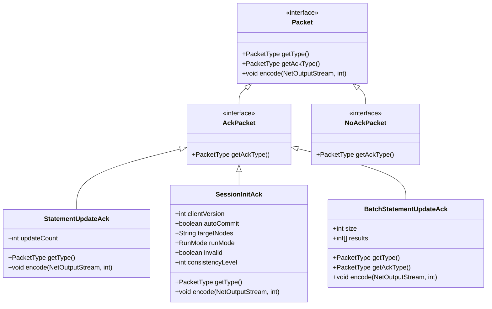
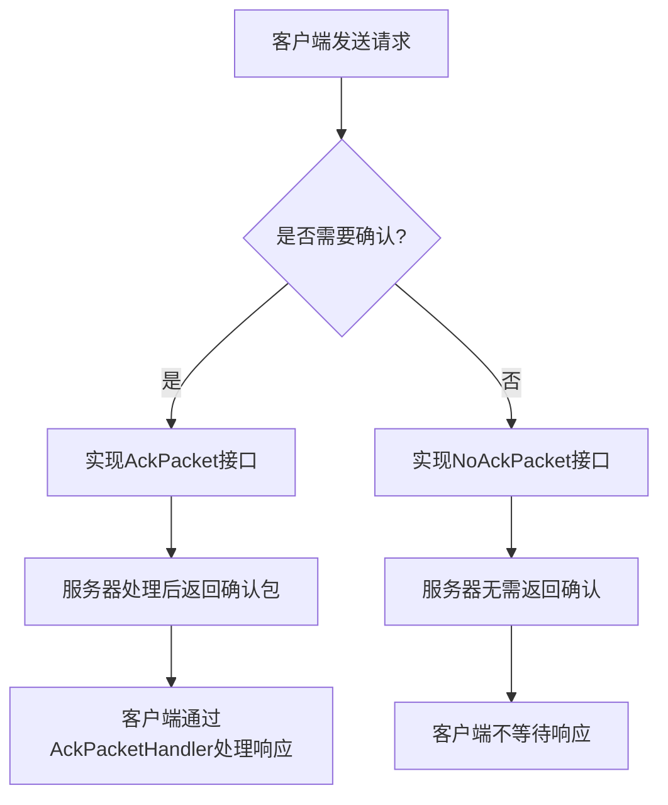
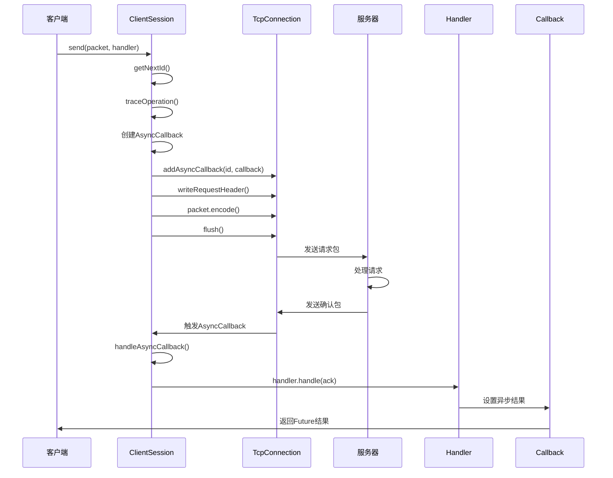
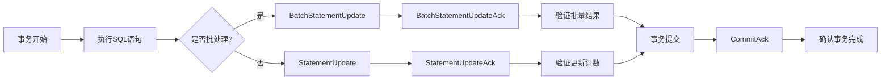
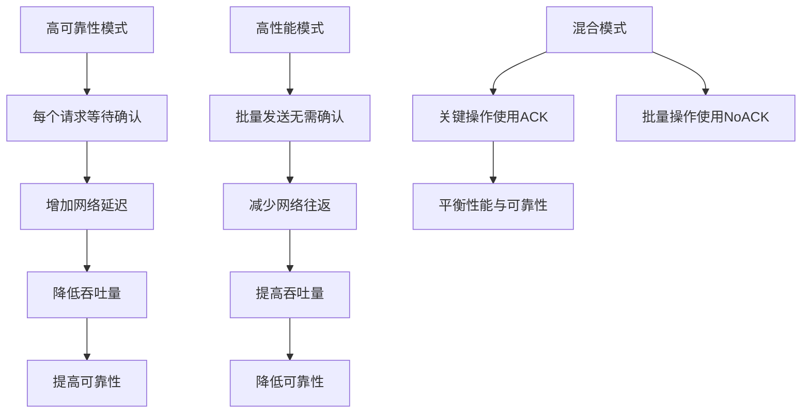

# ACK确认机制

<cite>
**本文档引用的文件**
- [AckPacket.java](file://lealone-common/src/main/java/com/lealone/server/protocol/AckPacket.java)
- [NoAckPacket.java](file://lealone-common/src/main/java/com/lealone/server/protocol/NoAckPacket.java)
- [AckPacketHandler.java](file://lealone-common/src/main/java/com/lealone/server/protocol/AckPacketHandler.java)
- [Session.java](file://lealone-common/src/main/java/com/lealone/db/session/Session.java)
- [ClientSession.java](file://lealone-client/src/main/java/com/lealone/client/session/ClientSession.java)
- [Packet.java](file://lealone-common/src/main/java/com/lealone/server/protocol/Packet.java)
- [PacketType.java](file://lealone-common/src/main/java/com/lealone/server/protocol/PacketType.java)
- [StatementUpdateAck.java](file://lealone-common/src/main/java/com/lealone/server/protocol/statement/StatementUpdateAck.java)
- [SessionInitAck.java](file://lealone-common/src/main/java/com/lealone/server/protocol/session/SessionInitAck.java)
- [BatchStatementUpdateAck.java](file://lealone-common/src/main/java/com/lealone/server/protocol/batch/BatchStatementUpdateAck.java)
</cite>

## 目录
1. [引言](#引言)
2. [ACK机制设计概述](#ack机制设计概述)
3. [AckPacket与NoAckPacket语义差异](#ackpacket与noackpacket语义差异)
4. [AckPacketHandler回调与超时机制](#ackpackethandler回调与超时机制)
5. [ACK机制与关键流程集成](#ack机制与关键流程集成)
6. [性能影响分析](#性能影响分析)
7. [配置建议与调优方案](#配置建议与调优方案)
8. [结论](#结论)

## 引言
Lealone数据库系统中的ACK确认机制是确保客户端与服务器之间通信可靠性的核心组件。该机制通过定义明确的确认包语义、回调处理和超时策略，实现了消息的端到端可靠传输。本文档详细阐述ACK机制的设计与实现，分析其在不同通信场景下的应用策略，并提供配置建议。

## ACK机制设计概述

**图示来源**
- [Packet.java](file://lealone-common/src/main/java/com/lealone/server/protocol/Packet.java#L12-L20)
- [AckPacket.java](file://lealone-common/src/main/java/com/lealone/server/protocol/AckPacket.java#L8-L13)
- [NoAckPacket.java](file://lealone-common/src/main/java/com/lealone/server/protocol/NoAckPacket.java#L8-L13)
- [StatementUpdateAck.java](file://lealone-common/src/main/java/com/lealone/server/protocol/statement/StatementUpdateAck.java#L16-L47)
- [SessionInitAck.java](file://lealone-common/src/main/java/com/lealone/server/protocol/session/SessionInitAck.java#L18-L75)
- [BatchStatementUpdateAck.java](file://lealone-common/src/main/java/com/lealone/server/protocol/batch/BatchStatementUpdateAck.java#L16-L57)

**本节来源**
- [Packet.java](file://lealone-common/src/main/java/com/lealone/server/protocol/Packet.java#L12-L20)
- [PacketType.java](file://lealone-common/src/main/java/com/lealone/server/protocol/PacketType.java#L10-L56)

## AckPacket与NoAckPacket语义差异

Lealone中的ACK机制通过`AckPacket`和`NoAckPacket`两个接口定义了不同的通信语义。`AckPacket`接口表示需要确认响应的请求包，而`NoAckPacket`接口表示无需确认的单向消息。

**图示来源**
- [AckPacket.java](file://lealone-common/src/main/java/com/lealone/server/protocol/AckPacket.java#L8-L13)
- [NoAckPacket.java](file://lealone-common/src/main/java/com/lealone/server/protocol/NoAckPacket.java#L8-L13)

**本节来源**
- [AckPacket.java](file://lealone-common/src/main/java/com/lealone/server/protocol/AckPacket.java#L8-L13)
- [NoAckPacket.java](file://lealone-common/src/main/java/com/lealone/server/protocol/NoAckPacket.java#L8-L13)

### 高可靠性操作场景
在需要确保操作结果的场景中，如事务提交、数据更新等，使用`AckPacket`确保服务器已成功处理请求。例如`StatementUpdateAck`包含更新计数，客户端可以验证操作影响的行数。

### 高性能批量操作场景
在批量操作中，为了提高吞吐量，可以使用`NoAckPacket`减少网络往返。例如`SessionClose`和`SessionSetAutoCommit`等操作无需等待服务器确认，可以直接继续后续操作。

## AckPacketHandler回调与超时机制

**图示来源**
- [ClientSession.java](file://lealone-client/src/main/java/com/lealone/client/session/ClientSession.java#L277-L322)
- [AckPacketHandler.java](file://lealone-common/src/main/java/com/lealone/server/protocol/AckPacketHandler.java#L8-L10)

**本节来源**
- [ClientSession.java](file://lealone-client/src/main/java/com/lealone/client/session/ClientSession.java#L277-L377)
- [AckPacketHandler.java](file://lealone-common/src/main/java/com/lealone/server/protocol/AckPacketHandler.java#L8-L10)

### 回调处理流程
`AckPacketHandler`接口定义了`handle(P ack)`方法，用于处理服务器返回的确认包。在`ClientSession.send()`方法中，当检测到请求包需要确认时，会创建`AsyncCallback`实例并注册到连接中。当服务器响应到达时，通过`handleAsyncCallback`方法调用处理器的`handle`方法。

### 超时机制
超时机制通过`AsyncCallback`的`setStartTime`和`setNetworkTimeout`方法实现。客户端在发送请求时记录开始时间，并设置网络超时值。如果在指定时间内未收到响应，异步回调将触发超时异常。

## ACK机制与关键流程集成

**图示来源**
- [StatementUpdateAck.java](file://lealone-common/src/main/java/com/lealone/server/protocol/statement/StatementUpdateAck.java#L16-L47)
- [BatchStatementUpdateAck.java](file://lealone-common/src/main/java/com/lealone/server/protocol/batch/BatchStatementUpdateAck.java#L16-L57)

**本节来源**
- [StatementUpdateAck.java](file://lealone-common/src/main/java/com/lealone/server/protocol/statement/StatementUpdateAck.java#L16-L47)
- [BatchStatementUpdateAck.java](file://lealone-common/src/main/java/com/lealone/server/protocol/batch/BatchStatementUpdateAck.java#L16-L57)
- [Session.java](file://lealone-common/src/main/java/com/lealone/db/session/Session.java#L155-L158)

### 事务提交集成
在事务提交过程中，客户端发送提交请求并等待`AckPacket`响应。通过`AckPacketHandler`处理确认包，确保事务已成功提交到服务器。如果网络中断或超时，客户端可以发起重试或回滚操作。

### 结果返回集成
对于查询操作，`StatementQueryAck`包含结果集元数据，客户端通过ACK机制确保正确接收查询结果。后续的`ResultFetchRowsAck`包也采用确认机制，确保所有结果行都已可靠传输。

## 性能影响分析

**图示来源**
- [PacketType.java](file://lealone-common/src/main/java/com/lealone/server/protocol/PacketType.java#L10-L56)
- [ClientSession.java](file://lealone-client/src/main/java/com/lealone/client/session/ClientSession.java#L292-L304)

**本节来源**
- [ClientSession.java](file://lealone-client/src/main/java/com/lealone/client/session/ClientSession.java#L292-L304)
- [PacketType.java](file://lealone-common/src/main/java/com/lealone/server/protocol/PacketType.java#L10-L56)

### 吞吐量影响
使用`AckPacket`会增加每个请求的网络往返时间(RTT)，降低系统吞吐量。特别是在高延迟网络环境中，这种影响更为显著。而`NoAckPacket`允许客户端连续发送多个请求，显著提高吞吐量。

### 延迟影响
ACK机制引入了额外的延迟，因为客户端必须等待服务器响应。对于低延迟要求的应用，可以采用批量处理或异步非阻塞模式来缓解这一问题。

## 配置建议与调优方案

### ACK模式配置建议
- **高可靠性场景**：对事务操作、关键数据更新使用`AckPacket`，确保操作结果的可靠性
- **高性能场景**：对批量插入、日志写入等操作使用`NoAckPacket`，提高吞吐量
- **混合场景**：结合使用两种模式，关键步骤使用ACK，非关键批量操作使用NoACK

### 网络不稳定环境调优
- **超时设置**：根据网络状况合理设置`networkTimeout`，避免过早超时
- **重试策略**：实现智能重试机制，在网络抖动时自动重试失败的ACK请求
- **批量优化**：将多个小请求合并为批量请求，减少ACK开销
- **连接池**：使用连接池管理TCP连接，减少连接建立开销

**本节来源**
- [ClientSession.java](file://lealone-client/src/main/java/com/lealone/client/session/ClientSession.java#L267-L274)
- [Session.java](file://lealone-common/src/main/java/com/lealone/db/session/Session.java#L124-L127)

## 结论
Lealone的ACK确认机制通过精心设计的`AckPacket`和`NoAckPacket`语义，实现了灵活性与可靠性的平衡。通过`AckPacketHandler`的回调机制和超时控制，确保了消息的端到端可靠传输。在实际应用中，应根据具体场景选择合适的ACK模式，在保证数据可靠性的同时最大化系统性能。在网络不稳定环境中，合理的配置和调优策略可以显著提升系统的稳定性和响应能力。