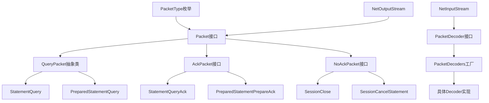
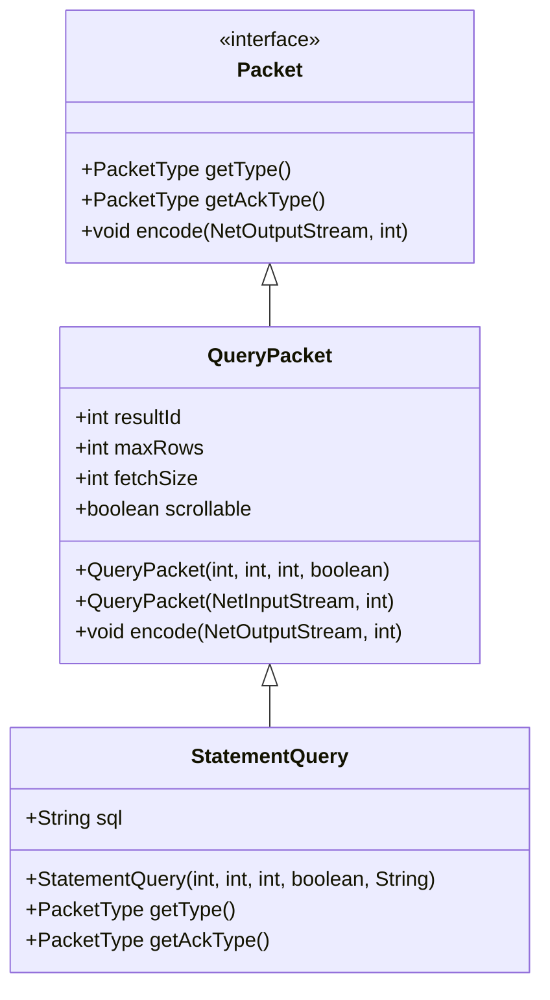
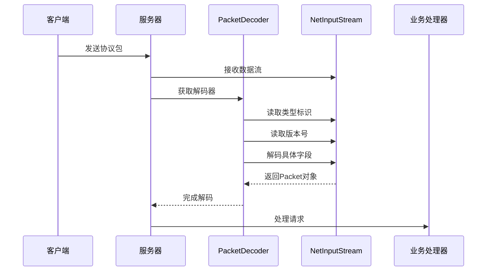
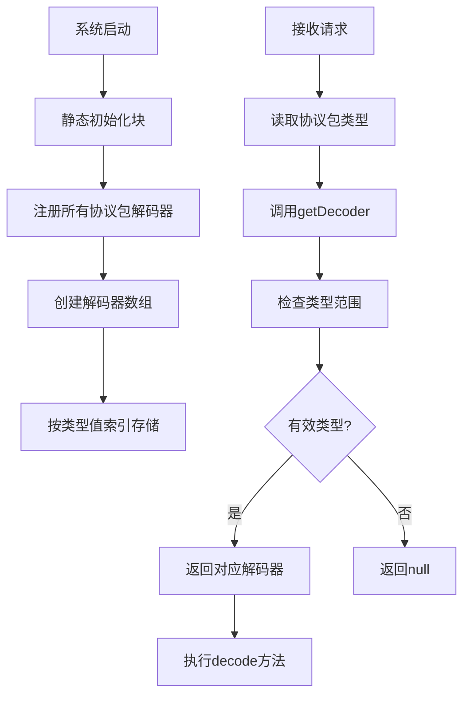
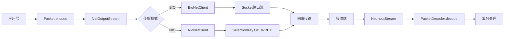

# 协议包结构

<cite>
**本文档引用的文件**  
- [Packet.java](https://github.com/lealone/Lealone/blob/master/lealone-common/src/main/java/com/lealone/server/protocol/Packet.java)
- [QueryPacket.java](https://github.com/lealone/Lealone/blob/master/lealone-common/src/main/java/com/lealone/server/protocol/QueryPacket.java)
- [PacketType.java](https://github.com/lealone/Lealone/blob/master/lealone-common/src/main/java/com/lealone/server/protocol/PacketType.java)
- [PacketDecoder.java](https://github.com/lealone/Lealone/blob/master/lealone-common/src/main/java/com/lealone/server/protocol/PacketDecoder.java)
- [PacketDecoders.java](https://github.com/lealone/Lealone/blob/master/lealone-common/src/main/java/com/lealone/server/protocol/PacketDecoders.java)
- [StatementQuery.java](https://github.com/lealone/Lealone/blob/master/lealone-common/src/main/java/com/lealone/server/protocol/statement/StatementQuery.java)
- [NetInputStream.java](https://github.com/lealone/Lealone/blob/master/lealone-common/src/main/java/com/lealone/net/NetInputStream.java)
- [NetOutputStream.java](https://github.com/lealone/Lealone/blob/master/lealone-common/src/main/java/com/lealone/net/NetOutputStream.java)
- [BioNetClient.java](https://github.com/lealone/Lealone/blob/master/lealone-net/src/main/java/com/lealone/net/bio/BioNetClient.java)
- [NioNetClient.java](https://github.com/lealone/Lealone/blob/master/lealone-net/src/main/java/com/lealone/net/nio/NioNetClient.java)
- [ClientSession.java](https://github.com/lealone/Lealone/blob/master/lealone-client/src/main/java/com/lealone/client/session/ClientSession.java)
</cite>

## 目录
1. [引言](#引言)
2. [协议包结构设计](#协议包结构设计)
3. [Packet抽象基类设计原理](#packet抽象基类设计原理)
4. [QueryPacket具体实现分析](#querypacket具体实现分析)
5. [PacketDecoder解码器工作流程](#packetdecoder解码器工作流程)
6. [PacketDecoders工厂类管理机制](#packetdecoders工厂类管理机制)
7. [自定义Packet实现规范](#自定义packet实现规范)
8. [网络层数据流封装过程](#网络层数据流封装过程)
9. [结论](#结论)

## 引言
Lealone数据库系统的协议包设计采用分层架构，通过抽象基类与具体实现分离的方式，实现了高效、可扩展的网络通信机制。本协议体系支持BIO/NIO两种传输模式，通过统一的序列化接口确保数据在不同网络环境下的兼容性。协议包的设计充分考虑了性能优化与可维护性，为数据库客户端与服务器之间的高效通信提供了坚实基础。

## 协议包结构设计

**图示来源**  
- [Packet.java](https://github.com/lealone/Lealone/blob/master/lealone-common/src/main/java/com/lealone/server/protocol/Packet.java)
- [QueryPacket.java](https://github.com/lealone/Lealone/blob/master/lealone-common/src/main/java/com/lealone/server/protocol/QueryPacket.java)
- [PacketType.java](https://github.com/lealone/Lealone/blob/master/lealone-common/src/main/java/com/lealone/server/protocol/PacketType.java)
- [PacketDecoder.java](https://github.com/lealone/Lealone/blob/master/lealone-common/src/main/java/com/lealone/server/protocol/PacketDecoder.java)

## Packet抽象基类设计原理

Lealone协议包的核心是`Packet`接口，它定义了所有协议包必须实现的基本方法。该设计采用类型标识与长度前缀相结合的字段布局策略，确保了协议的可扩展性和解析效率。

`Packet`接口包含三个核心方法：
- `getType()`：返回协议包的类型标识
- `getAckType()`：返回对应的确认包类型
- `encode()`：将协议包序列化到输出流

协议包的序列化采用紧凑的二进制格式，通过`NetOutputStream`接口实现跨平台的数据编码。类型标识使用自定义值而非枚举序数，允许在不破坏兼容性的情况下调整枚举定义顺序。不同类型之间设置间隔值，为未来新增协议包预留空间。

**本节来源**  
- [Packet.java](https://github.com/lealone/Lealone/blob/master/lealone-common/src/main/java/com/lealone/server/protocol/Packet.java#L12-L19)
- [PacketType.java](https://github.com/lealone/Lealone/blob/master/lealone-common/src/main/java/com/lealone/server/protocol/PacketType.java#L8-L55)

## QueryPacket具体实现分析

`QueryPacket`作为查询类协议包的抽象基类，封装了SQL查询请求的公共属性和序列化逻辑。该类采用继承方式扩展Packet接口，体现了面向对象设计的复用原则。

**图示来源**  
- [QueryPacket.java](https://github.com/lealone/Lealone/blob/master/lealone-common/src/main/java/com/lealone/server/protocol/QueryPacket.java#L13-L38)
- [StatementQuery.java](https://github.com/lealone/Lealone/blob/master/lealone-common/src/main/java/com/lealone/server/protocol/statement/StatementQuery.java#L16-L60)

`QueryPacket`包含四个核心字段：`resultId`（结果集ID）、`maxRows`（最大行数）、`fetchSize`（获取大小）和`scrollable`（是否可滚动）。构造函数提供两种初始化方式：通过参数直接创建，或从输入流反序列化。`encode`方法实现了字段的顺序编码，确保网络传输的一致性。

`StatementQuery`作为具体实现，继承`QueryPacket`并添加`sql`字段存储SQL语句。它重写了`getType`和`getAckType`方法，返回对应的枚举值，实现了类型系统的完整闭环。

## PacketDecoder解码器工作流程

**图示来源**  
- [PacketDecoder.java](https://github.com/lealone/Lealone/blob/master/lealone-common/src/main/java/com/lealone/server/protocol/PacketDecoder.java#L12-L15)
- [ClientSession.java](https://github.com/lealone/Lealone/blob/master/lealone-client/src/main/java/com/lealone/client/session/ClientSession.java#L328-L332)

`PacketDecoder`接口定义了`decode`方法，负责从`NetInputStream`中解析出具体的协议包对象。解码过程遵循严格的顺序：首先读取类型标识确定协议包种类，然后根据版本号处理可能的格式变更，最后按预定义的字段顺序读取数据。

每个具体协议包类都包含一个静态的`Decoder`内部类实现`PacketDecoder`接口。这种设计模式将解码逻辑封装在协议包内部，提高了代码的内聚性。解码器通过工厂类统一管理，实现了创建与使用的分离。

## PacketDecoders工厂类管理机制

**图示来源**  
- [PacketDecoders.java](https://github.com/lealone/Lealone/blob/master/lealone-common/src/main/java/com/lealone/server/protocol/PacketDecoders.java#L38-L97)
- [PacketType.java](https://github.com/lealone/Lealone/blob/master/lealone-common/src/main/java/com/lealone/server/protocol/PacketType.java#L10-L55)

`PacketDecoders`工厂类采用静态数组存储所有协议包解码器，通过类型值作为数组索引实现O(1)时间复杂度的快速查找。这种设计避免了HashMap的哈希计算开销，特别适合协议包类型固定且数量有限的场景。

工厂类在静态初始化块中完成所有解码器的注册，确保系统启动时就建立完整的解码器映射表。`getDecoder`方法提供两种重载：通过`PacketType`枚举或整数值获取解码器，内部都转换为数组索引访问。边界检查防止数组越界，提高系统健壮性。

## 自定义Packet实现规范

实现自定义协议包应遵循以下最佳实践：

1. **继承适当基类**：查询类包继承`QueryPacket`，确认类包实现`AckPacket`，无响应包实现`NoAckPacket`
2. **实现必要方法**：必须重写`getType`返回唯一类型标识，`encode`方法按字段顺序编码
3. **提供双构造函数**：一个用于参数初始化，一个用于反序列化
4. **注册解码器**：在`PacketDecoders`的静态块中注册自定义解码器
5. **保持向后兼容**：新增字段应放在末尾，避免破坏现有序列化格式

序列化时应遵循紧凑原则，优先使用基本类型编码方法（如`writeInt`、`writeBoolean`），复杂对象通过`writeValue`等专用方法处理。字段编码顺序必须与解码顺序严格一致，确保跨平台兼容性。

**本节来源**  
- [StatementQuery.java](https://github.com/lealone/Lealone/blob/master/lealone-common/src/main/java/com/lealone/server/protocol/statement/StatementQuery.java)
- [PacketDecoders.java](https://github.com/lealone/Lealone/blob/master/lealone-common/src/main/java/com/lealone/server/protocol/PacketDecoders.java#L58-L95)

## 网络层数据流封装过程

**图示来源**  
- [BioNetClient.java](https://github.com/lealone/Lealone/blob/master/lealone-net/src/main/java/com/lealone/net/bio/BioNetClient.java#L25-L73)
- [NioNetClient.java](https://github.com/lealone/Lealone/blob/master/lealone-net/src/main/java/com/lealone/net/nio/NioNetClient.java#L24-L101)
- [ClientSession.java](https://github.com/lealone/Lealone/blob/master/lealone-client/src/main/java/com/lealone/client/session/ClientSession.java#L308-L310)

协议包在BIO/NIO传输中的封装过程体现了抽象与实现分离的设计思想。应用层通过统一的`Packet.encode`方法将对象序列化到`NetOutputStream`，底层传输细节由具体的网络客户端处理。

在BIO模式下，`BioNetClient`使用阻塞Socket进行数据传输，`write`操作会直接写入网络。而在NIO模式下，`NioNetClient`通过`SelectionKey.OP_WRITE`事件实现非阻塞写入，提高了并发处理能力。两种模式都通过`NetBuffer`管理网络缓冲区，实现了内存的高效利用和复用。

## 结论
Lealone协议包体系通过精心设计的抽象层次和工厂模式，实现了高效、可扩展的网络通信机制。`Packet`接口与`PacketDecoder`解码器的分离设计，使得协议扩展变得简单而安全。类型标识的自定义值策略为系统演进提供了灵活性，而静态数组索引的解码器查找机制则保证了高性能。BIO/NIO双模式支持满足了不同应用场景的需求，统一的序列化接口确保了代码的可维护性。这一设计模式为分布式数据库系统的网络通信提供了优秀的参考范例。