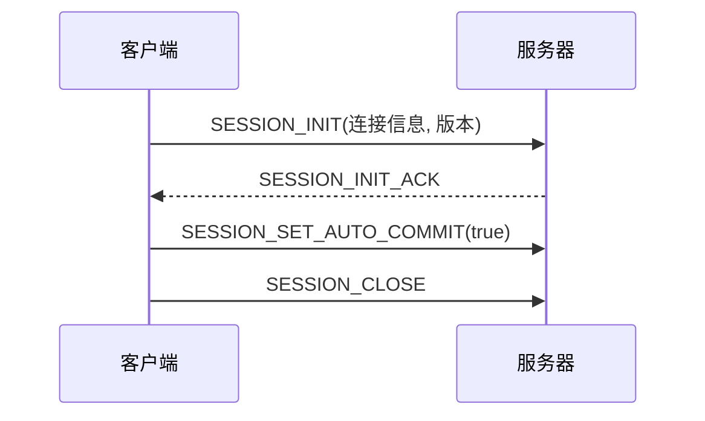
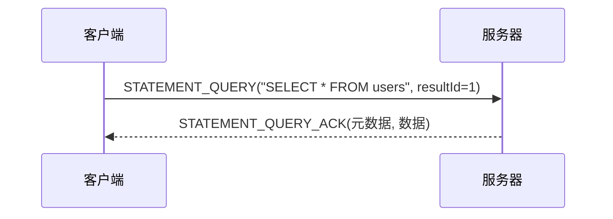
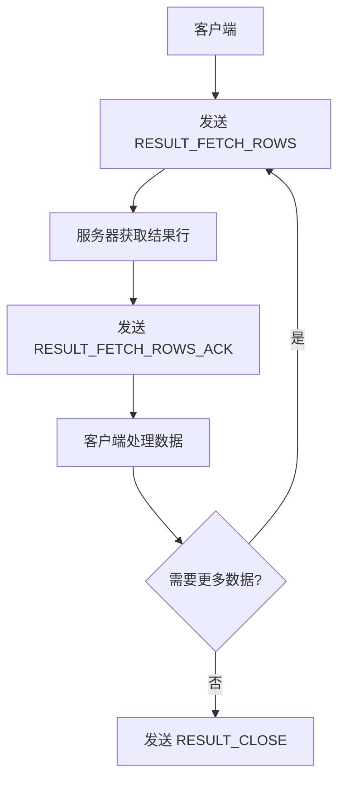
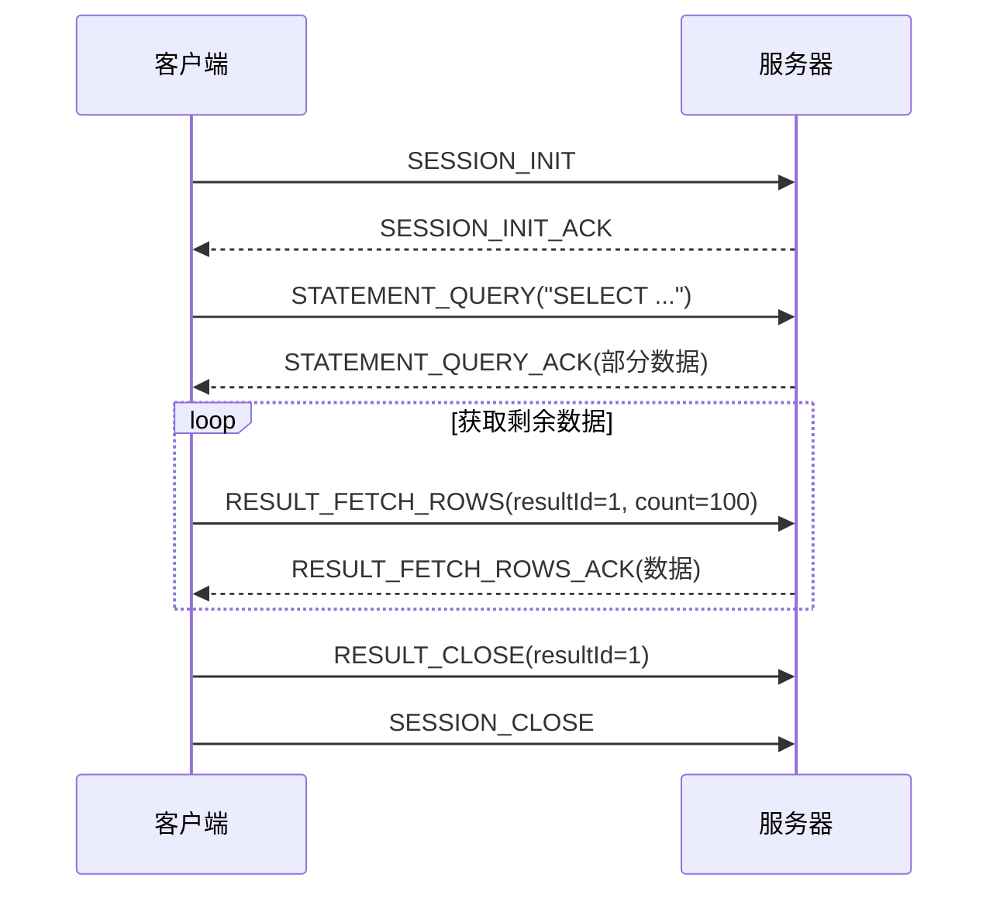

# 协议类型分类

**本文档引用的文件**
- [PacketType.java](https://github.com/lealone/Lealone/blob/master/lealone-common/src/main/java/com/lealone/server/protocol/PacketType.java)
- [SessionInit.java](https://github.com/lealone/Lealone/blob/master/lealone-common/src/main/java/com/lealone/server/protocol/session/SessionInit.java)
- [StatementQuery.java](https://github.com/lealone/Lealone/blob/master/lealone-common/src/main/java/com/lealone/server/protocol/statement/StatementQuery.java)
- [ResultFetchRows.java](https://github.com/lealone/Lealone/blob/master/lealone-common/src/main/java/com/lealone/server/protocol/result/ResultFetchRows.java)
- [BatchStatementUpdate.java](https://github.com/lealone/Lealone/blob/master/lealone-common/src/main/java/com/lealone/server/protocol/batch/BatchStatementUpdate.java)
- [LobRead.java](https://github.com/lealone/Lealone/blob/master/lealone-common/src/main/java/com/lealone/server/protocol/lob/LobRead.java)
- [SessionPacketHandlers.java](https://github.com/lealone/Lealone/blob/master/lealone-server/src/main/java/com/lealone/server/handler/SessionPacketHandlers.java)
- [StatementPacketHandlers.java](https://github.com/lealone/Lealone/blob/master/lealone-server/src/main/java/com/lealone/server/handler/StatementPacketHandlers.java)
- [ResultPacketHandlers.java](https://github.com/lealone/Lealone/blob/master/lealone-server/src/main/java/com/lealone/server/handler/ResultPacketHandlers.java)
- [BatchStatementPacketHandlers.java](https://github.com/lealone/Lealone/blob/master/lealone-server/src/main/java/com/lealone/server/handler/BatchStatementPacketHandlers.java)
- [LobPacketHandlers.java](https://github.com/lealone/Lealone/blob/master/lealone-server/src/main/java/com/lealone/server/handler/LobPacketHandlers.java)

## 目录
1. [引言](#引言)
2. [协议类型体系概览](#协议类型体系概览)
3. [会话管理协议包](#会话管理协议包)
4. [语句执行协议包](#语句执行协议包)
5. [结果集操作协议包](#结果集操作协议包)
6. [批处理协议包](#批处理协议包)
7. [LOB读写协议包](#lob读写协议包)
8. [协议扩展与兼容性](#协议扩展与兼容性)
9. [完整通信生命周期示例](#完整通信生命周期示例)
10. [结论](#结论)

## 引言
Lealone数据库系统采用基于TCP的二进制协议进行客户端与服务器之间的通信。该协议通过定义一系列结构化的数据包（Packet）来实现各种数据库操作。本文档系统性地分类并说明Lealone协议包的类型体系，按照会话管理、语句执行、结果集操作、批处理和LOB读写等维度，逐一解析各类PacketType的用途与数据结构。同时，说明协议类型扩展的兼容性原则，并结合实际交互流程展示不同类型包的调用序列，帮助开发者理解完整的通信生命周期。

**协议类型体系概览**
- [PacketType.java](https://github.com/lealone/Lealone/blob/master/lealone-common/src/main/java/com/lealone/server/protocol/PacketType.java#L10-L55)

## 会话管理协议包
会话管理协议包负责客户端与服务器之间连接的建立、配置和终止。这些包构成了所有数据库交互的基础。

### SessionInit 与 SessionInitAck
`SESSION_INIT`包用于客户端向服务器发起连接请求。它包含连接信息（ConnectionInfo），如数据库名、用户名、密码哈希、文件加密密钥以及各种连接属性。服务器在成功验证后返回`SESSION_INIT_ACK`作为确认。

该包还包含客户端协议版本信息，用于版本协商。服务器会检查客户端声明的最小和最大版本号，并根据自身支持的版本范围决定是否接受连接，从而实现向后兼容。

### SessionClose
`SESSION_CLOSE`包用于客户端请求关闭当前会话。服务器收到此包后，会清理与该会话相关的所有资源，包括缓存的预编译语句和结果集，并最终关闭网络连接。

### 其他会话管理包
- `SESSION_CANCEL_STATEMENT`：用于取消一个正在执行的语句。
- `SESSION_SET_AUTO_COMMIT`：用于设置会话的自动提交模式。

**图示来源**
- [SessionInit.java](https://github.com/lealone/Lealone/blob/master/lealone-common/src/main/java/com/lealone/server/protocol/session/SessionInit.java#L20-L108)
- [SessionPacketHandlers.java](https://github.com/lealone/Lealone/blob/master/lealone-server/src/main/java/com/lealone/server/handler/SessionPacketHandlers.java#L19-L23)

**本节来源**
- [SessionInit.java](https://github.com/lealone/Lealone/blob/master/lealone-common/src/main/java/com/lealone/server/protocol/session/SessionInit.java#L12-L33)
- [SessionPacketHandlers.java](https://github.com/lealone/Lealone/blob/master/lealone-server/src/main/java/com/lealone/server/handler/SessionPacketHandlers.java#L20-L22)

## 语句执行协议包
语句执行协议包用于执行SQL语句，分为普通语句和预编译语句两种模式。

### StatementQuery 与 StatementUpdate
`STATEMENT_QUERY`包用于执行查询语句（如SELECT）。它包含一个SQL字符串以及结果集相关的参数，如结果ID、最大行数、获取大小和是否可滚动。服务器执行查询后，返回一个结果集，并通过`STATEMENT_QUERY_ACK`包将结果集的元数据和第一部分数据发送给客户端。

`STATEMENT_UPDATE`包用于执行更新语句（如INSERT, UPDATE, DELETE）。它同样包含一个SQL字符串，服务器执行后返回受影响的行数。

### 预编译语句
预编译语句流程更为复杂：
1.  **PREPARED_STATEMENT_PREPARE**：客户端发送SQL语句以进行预编译。
2.  **PREPARED_STATEMENT_PREPARE_ACK**：服务器返回预编译结果，包括参数元数据。
3.  **PREPARED_STATEMENT_QUERY/PREPARED_STATEMENT_UPDATE**：客户端使用预编译的语句ID和参数值执行查询或更新。

**图示来源**
- [StatementQuery.java](https://github.com/lealone/Lealone/blob/master/lealone-common/src/main/java/com/lealone/server/protocol/statement/StatementQuery.java#L16-L23)
- [StatementPacketHandlers.java](https://github.com/lealone/Lealone/blob/master/lealone-server/src/main/java/com/lealone/server/handler/StatementPacketHandlers.java#L17-L18)

**本节来源**
- [StatementQuery.java](https://github.com/lealone/Lealone/blob/master/lealone-common/src/main/java/com/lealone/server/protocol/statement/StatementQuery.java#L16-L60)
- [StatementPacketHandlers.java](https://github.com/lealone/Lealone/blob/master/lealone-server/src/main/java/com/lealone/server/handler/StatementPacketHandlers.java#L16-L19)

## 结果集操作协议包
当查询返回大量数据时，结果集操作协议包允许客户端分页式地获取数据。

### ResultFetchRows 与 ResultFetchRowsAck
`RESULT_FETCH_ROWS`是客户端主动请求获取更多结果行的包。它指定结果集ID和本次请求的行数。服务器收到后，从对应的结果集中读取指定数量的行，并通过`RESULT_FETCH_ROWS_ACK`包将数据返回给客户端。

### 其他结果集操作
- `RESULT_CHANGE_ID`：更改结果集的ID，用于在会话间共享结果集。
- `RESULT_RESET`：重置结果集的游标到起始位置。
- `RESULT_CLOSE`：关闭并释放结果集占用的服务器资源。

**图示来源**
- [ResultFetchRows.java](https://github.com/lealone/Lealone/blob/master/lealone-common/src/main/java/com/lealone/server/protocol/result/ResultFetchRows.java#L16-L24)
- [ResultPacketHandlers.java](https://github.com/lealone/Lealone/blob/master/lealone-server/src/main/java/com/lealone/server/handler/ResultPacketHandlers.java#L28-L33)

**本节来源**
- [ResultFetchRows.java](https://github.com/lealone/Lealone/blob/master/lealone-common/src/main/java/com/lealone/server/protocol/result/ResultFetchRows.java#L16-L50)
- [ResultPacketHandlers.java](https://github.com/lealone/Lealone/blob/master/lealone-server/src/main/java/com/lealone/server/handler/ResultPacketHandlers.java#L21-L26)

## 批处理协议包
批处理协议包用于高效地执行多条更新语句。

### BatchStatementUpdate
`BATCH_STATEMENT_UPDATE`包允许客户端一次性发送多条SQL语句。包中包含一个语句列表和一个大小计数。服务器收到后，会将这些语句拆分成独立的任务，按顺序逐一执行，并在所有语句执行完毕后，通过`BATCH_STATEMENT_UPDATE_ACK`包将所有语句的执行结果（更新行数数组）一次性返回给客户端。

这种方式减少了网络往返次数，显著提高了批量插入或更新的性能。

**本节来源**
- [BatchStatementUpdate.java](https://github.com/lealone/Lealone/blob/master/lealone-common/src/main/java/com/lealone/server/protocol/batch/BatchStatementUpdate.java#L18-L26)
- [BatchStatementPacketHandlers.java](https://github.com/lealone/Lealone/blob/master/lealone-server/src/main/java/com/lealone/server/handler/BatchStatementPacketHandlers.java#L29-L31)

## LOB读写协议包
LOB（Large Object）读写协议包用于处理大对象数据，如BLOB和CLOB。

### LobRead 与 LobReadAck
`LOB_READ`包用于从服务器读取LOB数据的特定片段。它包含LOB的ID、HMAC（用于安全验证）、读取的偏移量和长度。服务器验证HMAC后，定位到指定的LOB和偏移量，读取指定长度的数据，并通过`LOB_READ_ACK`包将数据返回。

服务器端使用了一个LRU缓存（`SmallLRUCache`）来缓存LOB的输入流，以避免为每次读取都重新打开文件，从而提高性能。

**本节来源**
- [LobRead.java](https://github.com/lealone/Lealone/blob/master/lealone-common/src/main/java/com/lealone/server/protocol/lob/LobRead.java#L16-L28)
- [LobPacketHandlers.java](https://github.com/lealone/Lealone/blob/master/lealone-server/src/main/java/com/lealone/server/handler/LobPacketHandlers.java#L30-L31)

## 协议扩展与兼容性
Lealone协议在设计上充分考虑了向后兼容性和可扩展性。

### 类型值设计
`PacketType`枚举中的类型值（如`SESSION_INIT(0)`, `STATEMENT_QUERY(30)`）是手动指定的，而非使用枚举的`ordinal`值。更重要的是，不同功能类别的协议包之间有意设置了数值间隔（如会话管理在0-10，语句执行在30-40）。这种设计允许在不破坏现有协议的情况下，在未来的版本中轻松地插入新的协议包类型。

### 版本协商机制
在`SESSION_INIT`包中，客户端会发送其支持的最小和最大协议版本号。服务器会根据自身的`Constants.TCP_PROTOCOL_VERSION_MIN`和`Constants.TCP_PROTOCOL_VERSION_MAX`进行检查。如果客户端的版本范围与服务器支持的范围有交集，则连接可以建立；否则，服务器会拒绝连接并抛出版本错误。这确保了新旧客户端与服务器之间的兼容性。

**本节来源**
- [PacketType.java](https://github.com/lealone/Lealone/blob/master/lealone-common/src/main/java/com/lealone/server/protocol/PacketType.java#L8-L10)
- [SessionInit.java](https://github.com/lealone/Lealone/blob/master/lealone-common/src/main/java/com/lealone/server/protocol/session/SessionInit.java#L68-L74)

## 完整通信生命周期示例
一个典型的数据库交互流程如下：

1.  **连接建立**：客户端发送`SESSION_INIT`，服务器回复`SESSION_INIT_ACK`。
2.  **执行查询**：客户端发送`STATEMENT_QUERY`，服务器回复`STATEMENT_QUERY_ACK`。
3.  **获取结果**：客户端根据需要多次发送`RESULT_FETCH_ROWS`，服务器回复`RESULT_FETCH_ROWS_ACK`。
4.  **关闭结果集**：客户端发送`RESULT_CLOSE`。
5.  **关闭会话**：客户端发送`SESSION_CLOSE`。

**图示来源**
- [SessionInit.java](https://github.com/lealone/Lealone/blob/master/lealone-common/src/main/java/com/lealone/server/protocol/session/SessionInit.java#L12)
- [StatementQuery.java](https://github.com/lealone/Lealone/blob/master/lealone-common/src/main/java/com/lealone/server/protocol/statement/StatementQuery.java#L30)
- [ResultFetchRows.java](https://github.com/lealone/Lealone/blob/master/lealone-common/src/main/java/com/lealone/server/protocol/result/ResultFetchRows.java#L28)
- [ResultClose.java](https://github.com/lealone/Lealone/blob/master/lealone-common/src/main/java/com/lealone/server/protocol/result/ResultClose.java#L28)
- [SessionClose.java](https://github.com/lealone/Lealone/blob/master/lealone-common/src/main/java/com/lealone/server/protocol/session/SessionClose.java#L28)

## 结论
Lealone的协议类型体系设计清晰、模块化，通过不同的协议包类型精确地划分了数据库通信的各个阶段。从会话管理到语句执行，再到结果集和LOB操作，每个环节都有对应的协议包进行处理。其类型值的间隔设计和版本协商机制，为协议的长期演进和维护提供了坚实的兼容性保障。理解这一协议体系，对于开发Lealone的客户端驱动或进行深度性能调优至关重要。