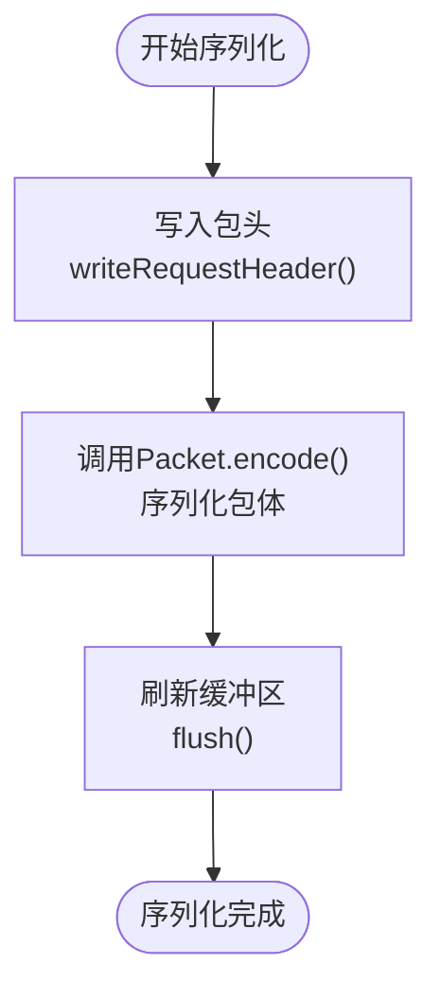
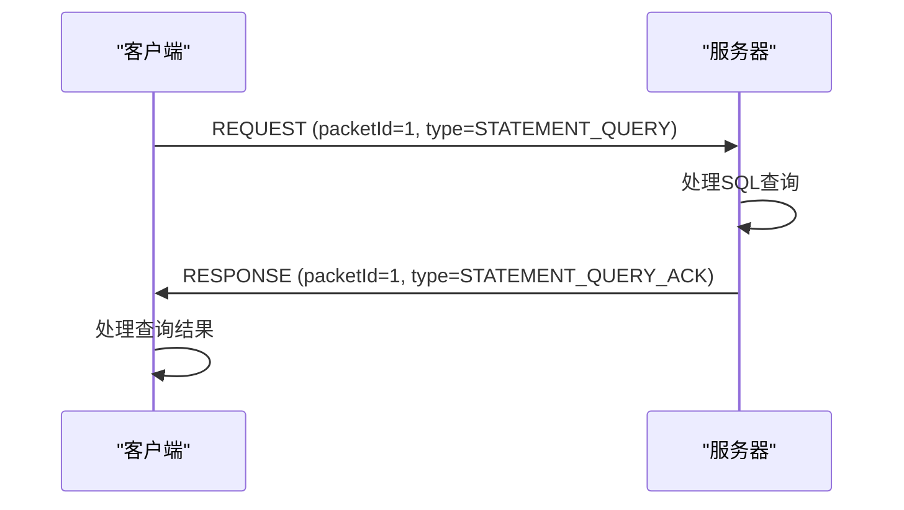
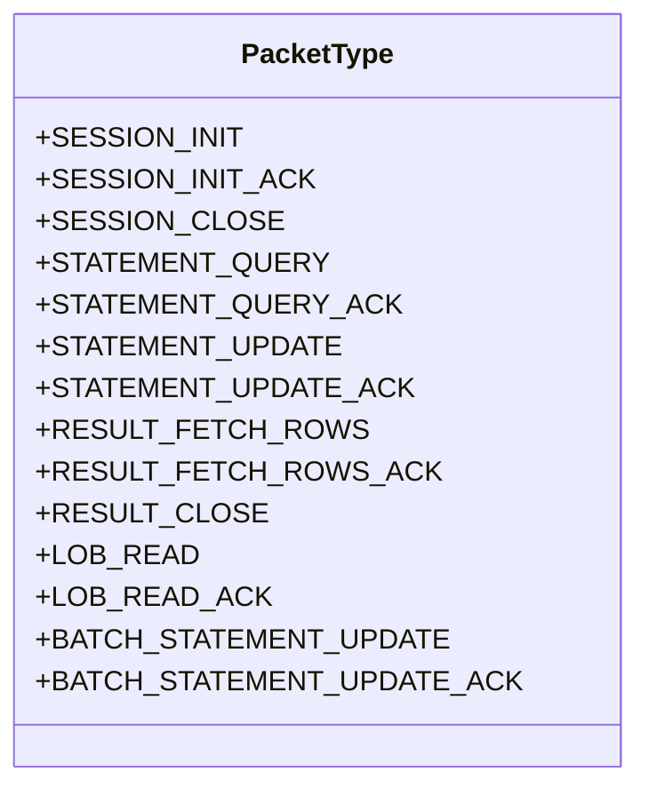
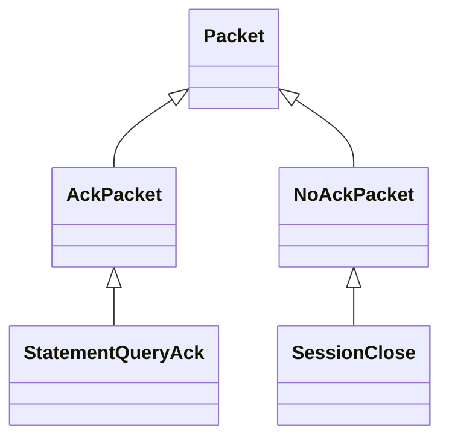

# 协议设计

<cite>
**本文档引用的文件**   
- [Packet.java](file://lealone-common/src/main/java/com/lealone/server/protocol/Packet.java)
- [PacketType.java](file://lealone-common/src/main/java/com/lealone/server/protocol/PacketType.java)
- [AckPacket.java](file://lealone-common/src/main/java/com/lealone/server/protocol/AckPacket.java)
- [NoAckPacket.java](file://lealone-common/src/main/java/com/lealone/server/protocol/NoAckPacket.java)
- [PacketDecoders.java](file://lealone-common/src/main/java/com/lealone/server/protocol/PacketDecoders.java)
- [SessionInit.java](file://lealone-common/src/main/java/com/lealone/server/protocol/session/SessionInit.java)
- [StatementQuery.java](file://lealone-common/src/main/java/com/lealone/server/protocol/statement/StatementQuery.java)
- [ResultFetchRows.java](file://lealone-common/src/main/java/com/lealone/server/protocol/result/ResultFetchRows.java)
- [LobRead.java](file://lealone-common/src/main/java/com/lealone/server/protocol/lob/LobRead.java)
- [TransferOutputStream.java](file://lealone-net/src/main/java/com/lealone/net/TransferOutputStream.java)
- [TransferInputStream.java](file://lealone-net/src/main/java/com/lealone/net/TransferInputStream.java)
- [TcpServerConnection.java](file://lealone-server/src/main/java/com/lealone/server/TcpServerConnection.java)
- [Session.java](file://lealone-common/src/main/java/com/lealone/db/session/Session.java)
- [ClientSession.java](file://lealone-client/src/main/java/com/lealone/client/session/ClientSession.java)
</cite>

## 目录
1. [引言](#引言)
2. [协议包结构与序列化机制](#协议包结构与序列化机制)
3. [ACK机制与可靠传输](#ack机制与可靠传输)
4. [PacketType分类与用途](#packetttype分类与用途)
5. [AckPacket与NoAckPacket的区别](#ackpacket与noackpacket的区别)
6. [协议扩展指南](#协议扩展指南)
7. [结论](#结论)

## 引言

Lealone数据库系统采用了一套精心设计的通信协议，用于客户端与服务器之间的高效、可靠通信。该协议基于TCP传输，通过定义清晰的Packet结构和ACK确认机制，实现了会话管理、语句执行、结果返回等核心功能。本文档将全面解析Lealone的通信协议设计，深入探讨Packet协议包的结构、序列化机制、ACK确认机制、PacketType分类以及协议扩展方法，为开发者提供详尽的参考。

**本文档引用的文件**   
- [Packet.java](file://lealone-common/src/main/java/com/lealone/server/protocol/Packet.java)
- [PacketType.java](file://lealone-common/src/main/java/com/lealone/server/protocol/PacketType.java)

## 协议包结构与序列化机制

Lealone的通信协议以`Packet`接口为核心，所有网络通信数据包都必须实现此接口。`Packet`接口定义了三个关键方法：`getType()`用于获取包类型，`getAckType()`用于获取对应的ACK包类型，`encode()`用于将包序列化到输出流。

协议包的序列化通过`TransferOutputStream`和`TransferInputStream`类实现。`TransferOutputStream`负责将`Packet`对象编码为字节流，而`TransferInputStream`则负责从字节流中解码出`Packet`对象。序列化过程遵循以下步骤：

1.  **写入包头**：首先调用`writeRequestHeader`或`writeResponseHeader`方法写入包头信息，包括请求/响应标识、包ID、状态码和会话ID。
2.  **序列化包体**：调用`Packet`对象的`encode`方法，将包的具体内容（如SQL语句、参数值等）写入输出流。
3.  **刷新缓冲区**：调用`flush`方法，将缓冲区中的数据写入底层网络通道。

**图源**
- [TransferOutputStream.java](file://lealone-net/src/main/java/com/lealone/net/TransferOutputStream.java#L68-L107)
- [Packet.java](file://lealone-common/src/main/java/com/lealone/server/protocol/Packet.java#L18)

**本节源码**
- [Packet.java](file://lealone-common/src/main/java/com/lealone/server/protocol/Packet.java#L12-L19)
- [TransferOutputStream.java](file://lealone-net/src/main/java/com/lealone/net/TransferOutputStream.java#L68-L107)

## ACK机制与可靠传输

Lealone协议通过ACK（确认）机制确保消息的可靠传输。每个请求包（Request Packet）都期望收到一个对应的响应包（Response Packet），这个响应包即为ACK包。ACK机制的工作流程如下：

1.  **客户端发送请求**：客户端创建一个`Packet`对象（如`StatementQuery`），并为其分配一个唯一的`packetId`。
2.  **服务器处理并响应**：服务器接收到请求后，根据`packetType`查找对应的`PacketHandler`进行处理。处理完成后，服务器创建一个对应的ACK包（如`StatementQueryAck`），并使用相同的`packetId`作为响应包的ID。
3.  **客户端接收ACK**：客户端通过`packetId`将收到的ACK包与原始请求进行匹配，并调用相应的回调函数处理结果。

这种基于`packetId`的请求-响应配对机制，确保了消息的有序性和可靠性。如果客户端在超时时间内未收到ACK，可以进行重试或报告错误。

**图源**
- [TcpServerConnection.java](file://lealone-server/src/main/java/com/lealone/server/TcpServerConnection.java#L83-L93)
- [ClientSession.java](file://lealone-client/src/main/java/com/lealone/client/session/ClientSession.java#L308-L310)

**本节源码**
- [TcpServerConnection.java](file://lealone-server/src/main/java/com/lealone/server/TcpServerConnection.java#L83-L93)
- [ClientSession.java](file://lealone-client/src/main/java/com/lealone/client/session/ClientSession.java#L308-L310)

## PacketType分类与用途

`PacketType`枚举定义了协议中所有支持的包类型，这些类型被分为多个逻辑类别，用于不同的通信场景：

### 会话管理类
- `SESSION_INIT` / `SESSION_INIT_ACK`: 用于客户端初始化会话，建立连接。
- `SESSION_CLOSE`: 用于客户端关闭会话。

### 语句执行类
- `STATEMENT_QUERY` / `STATEMENT_QUERY_ACK`: 用于执行普通SQL查询。
- `STATEMENT_UPDATE` / `STATEMENT_UPDATE_ACK`: 用于执行更新语句（INSERT, UPDATE, DELETE）。
- `PREPARED_STATEMENT_*`: 用于预编译语句的准备、执行和关闭。

### 结果返回类
- `RESULT_FETCH_ROWS` / `RESULT_FETCH_ROWS_ACK`: 用于从服务器获取结果集的下一批行。
- `RESULT_CLOSE`: 用于关闭结果集。

### LOB操作类
- `LOB_READ` / `LOB_READ_ACK`: 用于读取大对象（LOB）数据。

### 批处理类
- `BATCH_STATEMENT_UPDATE` / `BATCH_STATEMENT_UPDATE_ACK`: 用于执行批处理更新。

**图源**
- [PacketType.java](file://lealone-common/src/main/java/com/lealone/server/protocol/PacketType.java#L10-L48)

**本节源码**
- [PacketType.java](file://lealone-common/src/main/java/com/lealone/server/protocol/PacketType.java#L10-L48)

## AckPacket与NoAckPacket的区别

Lealone协议中定义了两种特殊的`Packet`标记接口：`AckPacket`和`NoAckPacket`，它们用于区分需要ACK和不需要ACK的包。

- **AckPacket**: 实现此接口的包表示它是一个响应包（ACK包）。当服务器处理完一个请求后，会返回一个`AckPacket`。客户端通过解析`AckPacket`来获取操作结果。例如，`StatementQueryAck`就是一个`AckPacket`。

- **NoAckPacket**: 实现此接口的包表示它是一个单向通知，不需要服务器返回ACK。这类包通常用于会话管理中的某些操作，例如`SessionClose`。客户端发送`SessionClose`包后，服务器会关闭会话，但不会发送一个`SessionCloseAck`包作为回应。

这种设计优化了通信效率，避免了不必要的ACK往返。对于幂等性高或重要性较低的操作，可以使用`NoAckPacket`来减少网络开销。

**图源**
- [AckPacket.java](file://lealone-common/src/main/java/com/lealone/server/protocol/AckPacket.java#L8)
- [NoAckPacket.java](file://lealone-common/src/main/java/com/lealone/server/protocol/NoAckPacket.java#L8)

**本节源码**
- [AckPacket.java](file://lealone-common/src/main/java/com/lealone/server/protocol/AckPacket.java#L8)
- [NoAckPacket.java](file://lealone-common/src/main/java/com/lealone/server/protocol/NoAckPacket.java#L8)

## 协议扩展指南

开发者可以遵循以下步骤来扩展Lealone的通信协议：

### 1. 定义新的PacketType
在`PacketType`枚举中添加新的类型值。注意，类型值是自定义的，有意设置了间隔，以便后续添加新的协议包。

### 2. 创建新的Packet类
创建一个新的类实现`Packet`接口。该类应包含所有需要传输的数据字段，并实现`getType()`、`getAckType()`和`encode()`方法。

### 3. 实现PacketDecoder
为新的Packet类创建一个静态的`Decoder`内部类，实现`PacketDecoder<T>`接口。`decode`方法负责从`NetInputStream`中读取数据并构造Packet对象。

### 4. 注册PacketDecoder
在`PacketDecoders`类的静态代码块中，使用`register`方法将新的`PacketType`和其对应的`Decoder`注册到全局解码器映射中。

### 5. 创建PacketHandler
创建一个处理类实现`PacketHandler<T>`接口，用于处理客户端发来的该类型请求。在`handle`方法中编写具体的业务逻辑。

### 6. 注册PacketHandler
在`PacketHandlers`类中，将新的`PacketType`和其对应的`PacketHandler`实例关联起来。

**兼容性考虑**:
- **版本控制**：`Packet`的`encode`方法接收一个`version`参数，可用于实现向后兼容。新版本的服务器应能处理旧版本客户端的请求。
- **字段扩展**：在序列化时，应先写入核心字段，再写入可选或扩展字段。旧版本客户端在读取时，如果遇到不认识的字段，应能安全地跳过。

**本节源码**
- [PacketType.java](file://lealone-common/src/main/java/com/lealone/server/protocol/PacketType.java#L52-L54)
- [PacketDecoders.java](file://lealone-common/src/main/java/com/lealone/server/protocol/PacketDecoders.java#L58-L96)
- [SessionInit.java](file://lealone-common/src/main/java/com/lealone/server/protocol/session/SessionInit.java#L63-L108)

## 结论

Lealone的通信协议设计精巧，通过`Packet`接口、`PacketType`枚举、ACK确认机制和灵活的序列化框架，构建了一个高效、可靠且易于扩展的通信系统。理解这套协议对于深入掌握Lealone的内部工作原理和进行二次开发至关重要。开发者在扩展协议时，应严格遵循其设计模式，确保新功能的兼容性和稳定性。