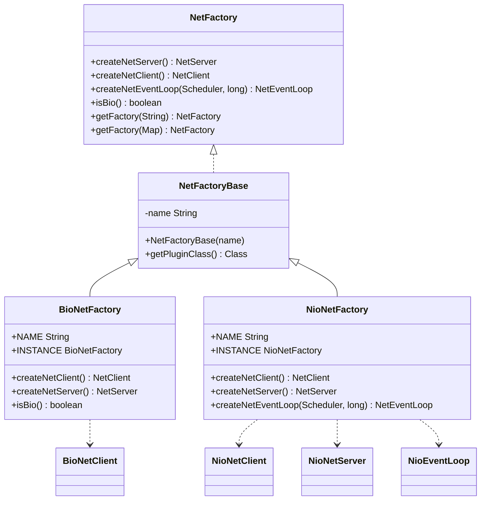
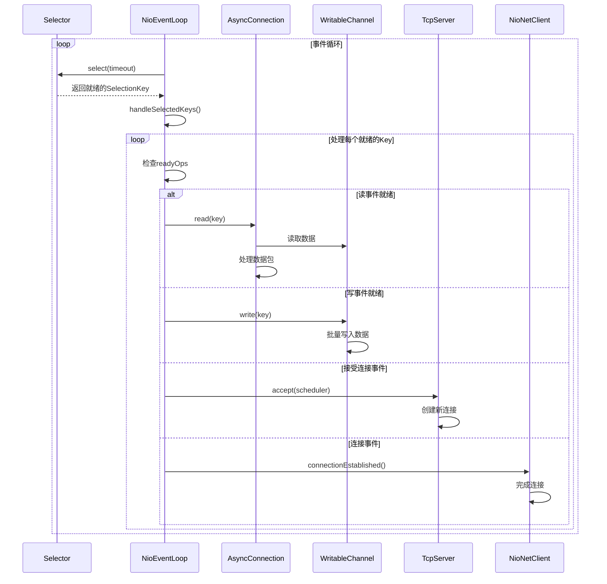
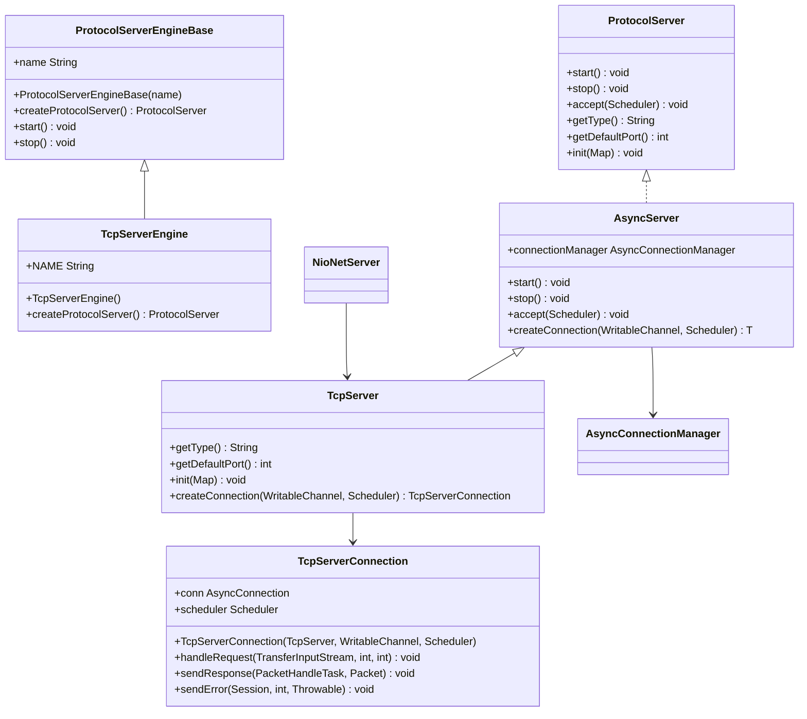
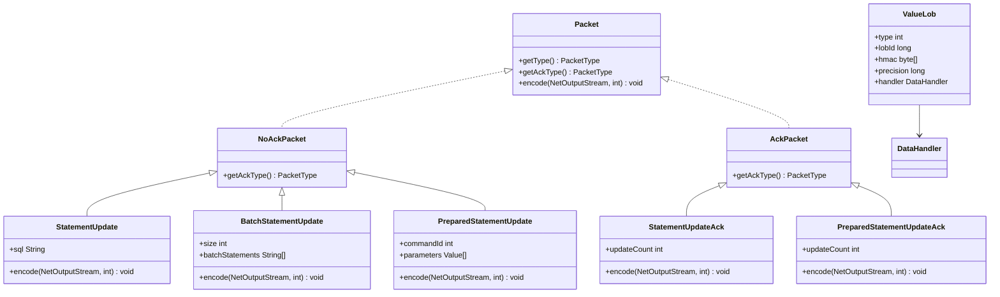
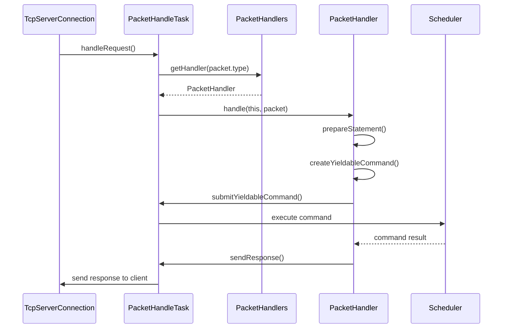

# 网络层架构


**本文档引用的文件**
- [BioNetFactory.java](https://github.com/lealone/Lealone/blob/master/lealone-net/src/main/java/com/lealone/net/bio/BioNetFactory.java)
- [NioNetFactory.java](https://github.com/lealone/Lealone/blob/master/lealone-net/src/main/java/com/lealone/net/nio/NioNetFactory.java)
- [NioEventLoop.java](https://github.com/lealone/Lealone/blob/master/lealone-net/src/main/java/com/lealone/net/nio/NioEventLoop.java)
- [NioNetServer.java](https://github.com/lealone/Lealone/blob/master/lealone-net/src/main/java/com/lealone/net/nio/NioNetServer.java)
- [NioNetClient.java](https://github.com/lealone/Lealone/blob/master/lealone-net/src/main/java/com/lealone/net/nio/NioNetClient.java)
- [NetFactory.java](https://github.com/lealone/Lealone/blob/master/lealone-net/src/main/java/com/lealone/net/NetFactory.java)
- [NetFactoryBase.java](https://github.com/lealone/Lealone/blob/master/lealone-net/src/main/java/com/lealone/net/NetFactoryBase.java)
- [TcpServerEngine.java](https://github.com/lealone/Lealone/blob/master/lealone-server/src/main/java/com/lealone/server/TcpServerEngine.java)
- [TcpServer.java](https://github.com/lealone/Lealone/blob/master/lealone-server/src/main/java/com/lealone/server/TcpServer.java)
- [PacketHandlers.java](https://github.com/lealone/Lealone/blob/master/lealone-server/src/main/java/com/lealone/server/handler/PacketHandlers.java)
- [AsyncConnection.java](https://github.com/lealone/Lealone/blob/master/lealone-net/src/main/java/com/lealone/net/AsyncConnection.java)
- [NetEventLoop.java](https://github.com/lealone/Lealone/blob/master/lealone-net/src/main/java/com/lealone/net/NetEventLoop.java)
- [PacketHandleTask.java](https://github.com/lealone/Lealone/blob/master/lealone-server/src/main/java/com/lealone/server/scheduler/PacketHandleTask.java)
- [WritableChannel.java](https://github.com/lealone/Lealone/blob/master/lealone-net/src/main/java/com/lealone/net/WritableChannel.java)


## 目录
1. [网络模型对比](#网络模型对比)
2. [NIO事件循环机制](#nio事件循环机制)
3. [TcpServerEngine连接处理](#tcpserverengine连接处理)
4. [Packet协议包设计](#packet协议包设计)
5. [PacketHandlers请求路由](#packethandlers请求路由)
6. [网络参数调优与扩展](#网络参数调优与扩展)

## 网络模型对比

Lealone数据库系统提供了两种网络模型实现：BIO（阻塞I/O）和NIO（非阻塞I/O），分别通过`BioNetFactory`和`NioNetFactory`两个工厂类实现。这两种模型在架构设计和性能特征上有显著差异。

`BioNetFactory`是BIO网络模型的实现，其主要特点是：
- 仅支持客户端连接，不支持服务器端监听
- 通过`isBio()`方法标识为BIO模式
- 在服务器端调用`createNetServer()`时会抛出内部错误，表明不支持服务器功能
- 适用于简单的客户端场景，每个连接都需要独立的线程处理



**图源**
- [BioNetFactory.java](https://github.com/lealone/Lealone/blob/master/lealone-net/src/main/java/com/lealone/net/bio/BioNetFactory.java#L13-L36)
- [NioNetFactory.java](https://github.com/lealone/Lealone/blob/master/lealone-net/src/main/java/com/lealone/net/nio/NioNetFactory.java#L14-L37)
- [NetFactory.java](https://github.com/lealone/Lealone/blob/master/lealone-net/src/main/java/com/lealone/net/NetFactory.java#L20-L55)
- [NetFactoryBase.java](https://github.com/lealone/Lealone/blob/master/lealone-net/src/main/java/com/lealone/net/NetFactoryBase.java#L11-L21)

`NioNetFactory`是NIO网络模型的完整实现，其主要特点包括：
- 同时支持客户端和服务器端功能
- 提供完整的`createNetServer()`和`createNetClient()`实现
- 支持创建`NioEventLoop`事件循环，实现高效的事件驱动I/O
- 基于Java NIO的Selector机制，能够用少量线程处理大量并发连接

两种网络模型通过`NetFactory`接口统一管理，系统根据配置动态选择合适的网络工厂。这种设计实现了网络层的可插拔性，允许开发者根据应用场景选择最适合的网络模型。

**本节源码**
- [BioNetFactory.java](https://github.com/lealone/Lealone/blob/master/lealone-net/src/main/java/com/lealone/net/bio/BioNetFactory.java#L13-L36)
- [NioNetFactory.java](https://github.com/lealone/Lealone/blob/master/lealone-net/src/main/java/com/lealone/net/nio/NioNetFactory.java#L14-L37)
- [NetFactory.java](https://github.com/lealone/Lealone/blob/master/lealone-net/src/main/java/com/lealone/net/NetFactory.java#L20-L55)

## NIO事件循环机制

`NioEventLoop`是Lealone NIO网络模型的核心组件，负责管理I/O事件的处理循环。它基于Java NIO的Selector机制，实现了高效的事件驱动I/O处理。

`NioEventLoop`的主要工作机制包括：

1. **延迟初始化Selector**：为了避免`Selector.open()`操作的性能开销影响系统启动速度，`NioEventLoop`采用延迟初始化策略，只有在首次需要时才创建Selector实例。

2. **事件选择与处理**：通过`select()`方法监控注册的通道上的I/O事件。当有事件就绪时，调用`handleSelectedKeys()`方法处理这些事件，包括读、写、连接和接受等操作。

3. **读写分离处理**：对于读操作，`NioEventLoop`实现了复杂的包长度解析机制。它首先读取包长度信息，然后根据长度读取完整的数据包，支持处理未完全读取的包的续读。

4. **批量写优化**：为了提高写操作的效率，`NioEventLoop`支持批量写入。当有多个待写数据时，会将它们组合成一个批量操作，减少系统调用次数。



**图源**
- [NioEventLoop.java](https://github.com/lealone/Lealone/blob/master/lealone-net/src/main/java/com/lealone/net/nio/NioEventLoop.java#L41-L568)
- [NioNetServer.java](https://github.com/lealone/Lealone/blob/master/lealone-net/src/main/java/com/lealone/net/nio/NioNetServer.java#L54-L76)
- [NioNetClient.java](https://github.com/lealone/Lealone/blob/master/lealone-net/src/main/java/com/lealone/net/nio/NioNetClient.java#L66-L99)

`NioEventLoop`还实现了线程安全的唤醒机制。当需要在事件循环外部触发事件处理时，可以调用`wakeUp()`方法，该方法会设置`haveWork`标志并唤醒Selector，确保新的工作能够及时得到处理。

此外，`NioEventLoop`还包含了一些性能优化特性：
- 配置化的最大包数量限制（maxPacketCountPerLoop），控制每次循环处理的数据包数量
- 可配置的最大包大小限制（maxPacketSize），防止内存溢出
- 批量写入偏好设置（preferBatchWrite），允许根据网络状况调整写入策略

**本节源码**
- [NioEventLoop.java](https://github.com/lealone/Lealone/blob/master/lealone-net/src/main/java/com/lealone/net/nio/NioEventLoop.java#L41-L568)

## TcpServerEngine连接处理

`TcpServerEngine`是Lealone TCP服务器的核心引擎，负责处理客户端连接和请求分发。它通过`ProtocolServerEngineBase`基类实现，遵循Lealone的协议服务器架构。

`TcpServerEngine`的连接处理流程如下：

1. **服务器创建**：`TcpServerEngine`通过重写`createProtocolServer()`方法，创建`TcpServer`实例作为具体的协议服务器。

2. **连接监听**：`TcpServer`继承自`AsyncServer`，使用`NioNetServer`作为底层网络服务器，通过NIO的Selector机制监听TCP连接请求。

3. **连接建立**：当有新的连接请求时，`NioNetServer`的`accept()`方法被调用，创建`NioWritableChannel`并注册到事件循环中。

4. **连接管理**：新连接被封装为`TcpServerConnection`，并由`AsyncConnectionManager`进行管理。



**图源**
- [TcpServerEngine.java](https://github.com/lealone/Lealone/blob/master/lealone-server/src/main/java/com/lealone/server/TcpServerEngine.java#L8-L20)
- [TcpServer.java](https://github.com/lealone/Lealone/blob/master/lealone-server/src/main/java/com/lealone/server/TcpServer.java#L15-L38)
- [NioNetServer.java](https://github.com/lealone/Lealone/blob/master/lealone-net/src/main/java/com/lealone/net/nio/NioNetServer.java#L20-L76)

`TcpServerConnection`是TCP连接的具体实现，负责处理客户端请求。其主要功能包括：
- 通过`handleRequest()`方法处理客户端请求
- 将请求数据解码为`Packet`对象
- 提交到`PacketHandleTask`进行异步处理
- 将处理结果通过`sendResponse()`方法返回给客户端

请求分发过程通过`PacketHandleTask`实现。每个请求被封装为一个任务，提交到调度器的执行队列中。这种设计实现了请求处理的异步化，避免了阻塞事件循环。

**本节源码**
- [TcpServerEngine.java](https://github.com/lealone/Lealone/blob/master/lealone-server/src/main/java/com/lealone/server/TcpServerEngine.java#L8-L20)
- [TcpServer.java](https://github.com/lealone/Lealone/blob/master/lealone-server/src/main/java/com/lealone/server/TcpServer.java#L15-L38)
- [NioNetServer.java](https://github.com/lealone/Lealone/blob/master/lealone-net/src/main/java/com/lealone/net/nio/NioNetServer.java#L20-L76)

## Packet协议包设计

Lealone的Packet协议包设计是其网络通信的核心，采用二进制协议格式，支持多种数据类型和操作。协议包的设计考虑了性能、可靠性和扩展性。

### 协议包结构

每个Packet由包长度和包内容组成：
- 包长度：4字节整数，表示包内容的字节数
- 包内容：实际的数据，包含操作类型和相关数据

`AsyncConnection`类定义了包长度的处理方法：
- `getPacketLengthByteCount()`：返回包长度占用的字节数（固定为4）
- `getPacketLength(ByteBuffer)`：从缓冲区读取包长度

### ACK机制

Lealone采用ACK（确认）机制确保通信的可靠性。协议包分为两类：
- `NoAckPacket`：不需要确认的包，如请求包
- `AckPacket`：需要确认的包，如响应包

当客户端发送一个请求包（NoAckPacket）后，服务器处理完成后会返回一个响应包（AckPacket）。客户端通过`AckPacketHandler`处理响应，实现请求-响应的同步。

### 批处理语句

批处理语句通过特殊的Packet类型实现：
- `BatchStatementUpdate`：用于批量执行SQL语句
- `BatchStatementPreparedUpdate`：用于批量执行预编译语句

批处理包的结构包含：
- 批处理大小
- 每个语句或参数组的数据
- 支持高效的批量数据传输

### LOB操作特殊处理

LOB（大对象）操作有特殊的处理机制：
- 对于小LOB数据，直接内联在Packet中传输
- 对于大LOB数据，采用分块传输或引用传输
- 通过`ValueLob`类管理LOB数据，包含LOB ID、HMAC验证等安全特性



**图源**
- [AsyncConnection.java](https://github.com/lealone/Lealone/blob/master/lealone-net/src/main/java/com/lealone/net/AsyncConnection.java#L32-L38)
- [AckPacket.java](https://github.com/lealone/Lealone/blob/master/lealone-common/src/main/java/com/lealone/server/protocol/AckPacket.java#L8-L12)
- [NoAckPacket.java](https://github.com/lealone/Lealone/blob/master/lealone-common/src/main/java/com/lealone/server/protocol/NoAckPacket.java#L8-L12)
- [BatchStatementUpdate.java](https://github.com/lealone/Lealone/blob/master/lealone-common/src/main/java/com/lealone/server/protocol/batch/BatchStatementUpdate.java#L42-L58)
- [BatchStatementPreparedUpdate.java](https://github.com/lealone/Lealone/blob/master/lealone-common/src/main/java/com/lealone/server/protocol/batch/BatchStatementPreparedUpdate.java#L43-L73)
- [ValueLob.java](https://github.com/lealone/Lealone/blob/master/lealone-common/src/main/java/com/lealone/db/value/ValueLob.java#L39-L154)

**本节源码**
- [AsyncConnection.java](https://github.com/lealone/Lealone/blob/master/lealone-net/src/main/java/com/lealone/net/AsyncConnection.java#L32-L38)
- [AckPacket.java](https://github.com/lealone/Lealone/blob/master/lealone-common/src/main/java/com/lealone/server/protocol/AckPacket.java#L8-L12)
- [NoAckPacket.java](https://github.com/lealone/Lealone/blob/master/lealone-common/src/main/java/com/lealone/server/protocol/NoAckPacket.java#L8-L12)

## PacketHandlers请求路由

`PacketHandlers`是Lealone网络层的请求路由中心，负责将不同类型的请求包路由到相应的处理器。它采用注册-分发模式，实现了灵活的请求处理机制。

### 路由机制

`PacketHandlers`维护一个静态数组`handlers`，以`PacketType`的值作为索引存储对应的处理器：
- `register(PacketType, PacketHandler)`：注册处理器
- `getHandler(PacketType)`：获取处理器
- 数组大小由`PacketType.VOID.value`决定，确保覆盖所有可能的包类型

系统在静态初始化块中注册所有处理器：
```java
static {
    SessionPacketHandlers.register();
    PreparedStatementPacketHandlers.register();
    StatementPacketHandlers.register();
    BatchStatementPacketHandlers.register();
    ResultPacketHandlers.register();
    LobPacketHandlers.register();
}
```

### 处理器层次结构

`PacketHandlers`定义了通用的处理基类，简化了具体处理器的实现：

1. **更新操作基类**：
   - `UpdateBase`：提供更新操作的通用处理逻辑
   - `UpdatePacketHandler`：处理普通更新语句
   - `PreparedUpdatePacketHandler`：处理预编译更新语句

2. **查询操作基类**：
   - `QueryBase`：提供查询操作的通用处理逻辑
   - `QueryPacketHandler`：处理普通查询语句
   - `PreparedQueryPacketHandler`：处理预编译查询语句

### 请求处理流程

请求处理流程如下：
1. `PacketHandleTask`从输入流读取包
2. 根据包类型查找对应的`PacketHandler`
3. 调用处理器的`handle()`方法处理请求
4. 处理器创建`Yieldable`命令提交到调度器
5. 命令执行完成后发送响应



**图源**
- [PacketHandlers.java](https://github.com/lealone/Lealone/blob/master/lealone-server/src/main/java/com/lealone/server/handler/PacketHandlers.java#L26-L163)
- [PacketHandleTask.java](https://github.com/lealone/Lealone/blob/master/lealone-server/src/main/java/com/lealone/server/scheduler/PacketHandleTask.java#L18-L77)

`PacketHandlers`还实现了智能的语句缓存机制：
- 对于预编译语句，从会话缓存中获取`PreparedSQLStatement`
- 对于普通语句，创建新的`PreparedSQLStatement`并设置packetId作为标识
- 参数值在处理时动态设置，确保每次执行使用正确的参数

这种设计既保证了预编译语句的性能优势，又支持了普通语句的灵活性。

**本节源码**
- [PacketHandlers.java](https://github.com/lealone/Lealone/blob/master/lealone-server/src/main/java/com/lealone/server/handler/PacketHandlers.java#L26-L163)
- [PacketHandleTask.java](https://github.com/lealone/Lealone/blob/master/lealone-server/src/main/java/com/lealone/server/scheduler/PacketHandleTask.java#L18-L77)

## 网络参数调优与扩展

### 网络参数调优

Lealone提供了多个可配置的网络参数，用于优化性能：

1. **事件循环参数**：
   - `loopInterval`：事件循环的超时时间
   - `maxPacketCountPerLoop`：每次循环处理的最大包数量
   - `preferBatchWrite`：是否优先批量写入

2. **缓冲区参数**：
   - `inputBuffer`：输入缓冲区大小
   - `outputBuffer`：输出缓冲区大小
   - `maxPacketSize`：最大包大小限制

3. **连接参数**：
   - `maxSharedSize`：连接池最大共享大小
   - `connectionTimeout`：连接超时时间

### 连接池配置

Lealone的连接池通过`AsyncConnectionPool`管理，主要配置包括：
- 最大连接数
- 最小空闲连接数
- 连接超时时间
- 连接验证策略

连接池支持共享连接，通过`isShared()`和`getSharedSize()`方法管理共享状态。

### 自定义协议扩展

Lealone的网络层设计支持自定义协议扩展，主要通过以下机制：

1. **插件化网络工厂**：
   - 实现`NetFactory`接口
   - 通过`PluginManager`注册
   - 支持自定义的网络模型

2. **自定义Packet类型**：
   - 定义新的`PacketType`
   - 实现相应的`Packet`和`PacketHandler`
   - 在`PacketHandlers`中注册

3. **自定义事件循环**：
   - 实现`NetEventLoop`接口
   - 在`NetFactory`中提供创建方法
   - 支持特殊的事件处理逻辑

开发者可以通过实现这些扩展点，为Lealone添加新的网络协议或优化现有协议。

**本节源码**
- [NioEventLoop.java](https://github.com/lealone/Lealone/blob/master/lealone-net/src/main/java/com/lealone/net/nio/NioEventLoop.java#L52-L71)
- [AsyncConnection.java](https://github.com/lealone/Lealone/blob/master/lealone-net/src/main/java/com/lealone/net/AsyncConnection.java#L80-L90)
- [NetFactory.java](https://github.com/lealone/Lealone/blob/master/lealone-net/src/main/java/com/lealone/net/NetFactory.java#L20-L55)