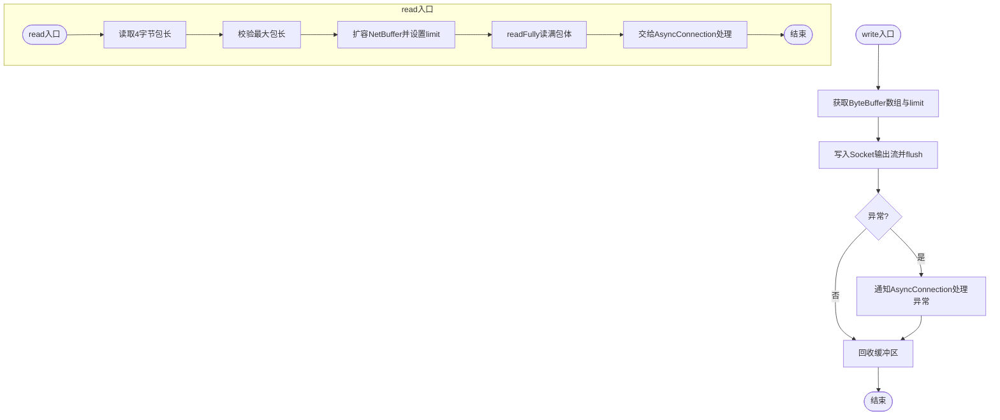

# BIO模型

<cite>
**本文引用的文件列表**
- [BioNetFactory.java](https://github.com/lealone/Lealone/blob/master/lealone-net/src/main/java/com/lealone/net/bio/BioNetFactory.java)
- [BioNetClient.java](https://github.com/lealone/Lealone/blob/master/lealone-net/src/main/java/com/lealone/net/bio/BioNetClient.java)
- [BioWritableChannel.java](https://github.com/lealone/Lealone/blob/master/lealone-net/src/main/java/com/lealone/net/bio/BioWritableChannel.java)
- [NetFactory.java](https://github.com/lealone/Lealone/blob/master/lealone-net/src/main/java/com/lealone/net/NetFactory.java)
- [NetClientBase.java](https://github.com/lealone/Lealone/blob/master/lealone-net/src/main/java/com/lealone/net/NetClientBase.java)
- [WritableChannel.java](https://github.com/lealone/Lealone/blob/master/lealone-net/src/main/java/com/lealone/net/WritableChannel.java)
- [TcpClientConnection.java](https://github.com/lealone/Lealone/blob/master/lealone-net/src/main/java/com/lealone/net/TcpClientConnection.java)
- [NioNetClient.java](https://github.com/lealone/Lealone/blob/master/lealone-net/src/main/java/com/lealone/net/nio/NioNetClient.java)
- [NioWritableChannel.java](https://github.com/lealone/Lealone/blob/master/lealone-net/src/main/java/com/lealone/net/nio/NioWritableChannel.java)
- [ConnectionSetting.java](https://github.com/lealone/Lealone/blob/master/lealone-common/src/main/java/com/lealone/db/ConnectionSetting.java)
- [Constants.java](https://github.com/lealone/Lealone/blob/master/lealone-common/src/main/java/com/lealone/db/Constants.java)
- [CRUDExample.java](https://github.com/lealone/Lealone/blob/master/lealone-test/src/test/java/com/lealone/test/misc/CRUDExample.java)
</cite>

## 目录
1. [引言](#引言)
2. [项目结构](#项目结构)
3. [核心组件](#核心组件)
4. [架构总览](#架构总览)
5. [详细组件分析](#详细组件分析)
6. [依赖关系分析](#依赖关系分析)
7. [性能考量](#性能考量)
8. [故障排查指南](#故障排查指南)
9. [结论](#结论)
10. [附录：配置参数与使用示例](#附录配置参数与使用示例)

## 引言
本文件围绕Lealone的BIO（阻塞I/O）网络模型展开，重点解析BioNetFactory工厂类如何创建和管理BIO网络客户端；详细说明BioNetClient的连接建立流程与连接管理机制，以及BioWritableChannel的读写实现细节。同时，结合NIO模型进行对比，帮助开发者在低并发与高并发场景下做出合理选型，并提供配置参数说明与使用示例。

## 项目结构
BIO网络模型位于lealone-net模块的bio包中，核心类包括：
- 工厂类：BioNetFactory
- 客户端：BioNetClient
- 可写通道：BioWritableChannel
- 基类与接口：NetClientBase、WritableChannel
- 客户端连接封装：TcpClientConnection
- 对比参考：NIO模型的NioNetClient、NioWritableChannel
- 配置项：ConnectionSetting、Constants

图表来源
- [BioNetFactory.java](https://github.com/lealone/Lealone/blob/master/lealone-net/src/main/java/com/lealone/net/bio/BioNetFactory.java#L1-L36)
- [BioNetClient.java](https://github.com/lealone/Lealone/blob/master/lealone-net/src/main/java/com/lealone/net/bio/BioNetClient.java#L1-L72)
- [BioWritableChannel.java](https://github.com/lealone/Lealone/blob/master/lealone-net/src/main/java/com/lealone/net/bio/BioWritableChannel.java#L1-L160)
- [TcpClientConnection.java](https://github.com/lealone/Lealone/blob/master/lealone-net/src/main/java/com/lealone/net/TcpClientConnection.java#L1-L191)
- [NetClientBase.java](https://github.com/lealone/Lealone/blob/master/lealone-net/src/main/java/com/lealone/net/NetClientBase.java#L1-L143)
- [WritableChannel.java](https://github.com/lealone/Lealone/blob/master/lealone-net/src/main/java/com/lealone/net/WritableChannel.java#L1-L58)
- [NioNetClient.java](https://github.com/lealone/Lealone/blob/master/lealone-net/src/main/java/com/lealone/net/nio/NioNetClient.java#L1-L101)
- [NioWritableChannel.java](https://github.com/lealone/Lealone/blob/master/lealone-net/src/main/java/com/lealone/net/nio/NioWritableChannel.java#L1-L136)

章节来源
- [BioNetFactory.java](https://github.com/lealone/Lealone/blob/master/lealone-net/src/main/java/com/lealone/net/bio/BioNetFactory.java#L1-L36)
- [BioNetClient.java](https://github.com/lealone/Lealone/blob/master/lealone-net/src/main/java/com/lealone/net/bio/BioNetClient.java#L1-L72)
- [BioWritableChannel.java](https://github.com/lealone/Lealone/blob/master/lealone-net/src/main/java/com/lealone/net/bio/BioWritableChannel.java#L1-L160)
- [NetClientBase.java](https://github.com/lealone/Lealone/blob/master/lealone-net/src/main/java/com/lealone/net/NetClientBase.java#L1-L143)
- [WritableChannel.java](https://github.com/lealone/Lealone/blob/master/lealone-net/src/main/java/com/lealone/net/WritableChannel.java#L1-L58)
- [TcpClientConnection.java](https://github.com/lealone/Lealone/blob/master/lealone-net/src/main/java/com/lealone/net/TcpClientConnection.java#L1-L191)
- [NioNetClient.java](https://github.com/lealone/Lealone/blob/master/lealone-net/src/main/java/com/lealone/net/nio/NioNetClient.java#L1-L101)
- [NioWritableChannel.java](https://github.com/lealone/Lealone/blob/master/lealone-net/src/main/java/com/lealone/net/nio/NioWritableChannel.java#L1-L136)

## 核心组件
- BioNetFactory：BIO网络工厂，负责创建BioNetClient实例，并声明自身为BIO类型。
- BioNetClient：BIO客户端，负责建立TCP连接、初始化Socket参数、创建BioWritableChannel与TcpClientConnection，并维护连接池。
- BioWritableChannel：BIO可写通道，封装Socket的输入输出流，实现读取完整包与写入数据的逻辑，并进行最大包长校验。
- NetClientBase：客户端基类，提供连接池管理、关闭、超时检查、Socket参数初始化等通用能力。
- WritableChannel：可写通道接口，定义读写、关闭、标识等抽象。
- TcpClientConnection：客户端连接封装，负责异步回调管理、异常处理、会话状态处理等。
- NIO模型对比：NioNetClient与NioWritableChannel用于对比BIO的阻塞式读写与NIO的事件驱动写入。

章节来源
- [BioNetFactory.java](https://github.com/lealone/Lealone/blob/master/lealone-net/src/main/java/com/lealone/net/bio/BioNetFactory.java#L1-L36)
- [BioNetClient.java](https://github.com/lealone/Lealone/blob/master/lealone-net/src/main/java/com/lealone/net/bio/BioNetClient.java#L1-L72)
- [BioWritableChannel.java](https://github.com/lealone/Lealone/blob/master/lealone-net/src/main/java/com/lealone/net/bio/BioWritableChannel.java#L1-L160)
- [NetClientBase.java](https://github.com/lealone/Lealone/blob/master/lealone-net/src/main/java/com/lealone/net/NetClientBase.java#L1-L143)
- [WritableChannel.java](https://github.com/lealone/Lealone/blob/master/lealone-net/src/main/java/com/lealone/net/WritableChannel.java#L1-L58)
- [TcpClientConnection.java](https://github.com/lealone/Lealone/blob/master/lealone-net/src/main/java/com/lealone/net/TcpClientConnection.java#L1-L191)
- [NioNetClient.java](https://github.com/lealone/Lealone/blob/master/lealone-net/src/main/java/com/lealone/net/nio/NioNetClient.java#L1-L101)
- [NioWritableChannel.java](https://github.com/lealone/Lealone/blob/master/lealone-net/src/main/java/com/lealone/net/nio/NioWritableChannel.java#L1-L136)

## 架构总览
BIO网络模型采用“每个连接一个线程”的阻塞I/O方式。客户端通过BioNetFactory创建BioNetClient，后者基于Socket阻塞I/O建立连接，使用BioWritableChannel进行读写，TcpClientConnection负责协议层面的请求/响应处理与回调管理。

图表来源
- [BioNetFactory.java](https://github.com/lealone/Lealone/blob/master/lealone-net/src/main/java/com/lealone/net/bio/BioNetFactory.java#L1-L36)
- [BioNetClient.java](https://github.com/lealone/Lealone/blob/master/lealone-net/src/main/java/com/lealone/net/bio/BioNetClient.java#L1-L72)
- [BioWritableChannel.java](https://github.com/lealone/Lealone/blob/master/lealone-net/src/main/java/com/lealone/net/bio/BioWritableChannel.java#L1-L160)
- [TcpClientConnection.java](https://github.com/lealone/Lealone/blob/master/lealone-net/src/main/java/com/lealone/net/TcpClientConnection.java#L1-L191)

## 详细组件分析

### BioNetFactory工厂类
- 责任：提供BIO网络工厂实例，创建BioNetClient；声明自身为BIO类型。
- 关键点：createNetClient返回BioNetClient；createNetServer抛出内部错误（BIO不支持服务端）；isBio返回true。

章节来源
- [BioNetFactory.java](https://github.com/lealone/Lealone/blob/master/lealone-net/src/main/java/com/lealone/net/bio/BioNetFactory.java#L1-L36)
- [NetFactory.java](https://github.com/lealone/Lealone/blob/master/lealone-net/src/main/java/com/lealone/net/NetFactory.java#L1-L56)

### BioNetClient连接管理机制
- 连接创建流程：
  - 解析配置，获取网络超时时间。
  - 创建Socket，设置接收/发送缓冲区大小、TCP延迟、保活、地址复用等参数。
  - 建立连接并设置超时。
  - 创建BioWritableChannel与TcpClientConnection，或将连接交由AsyncConnectionManager管理。
  - 将连接加入连接池，返回AsyncConnection。
- 连接池管理：
  - 使用InetSocketAddress作为键，避免同名不同表达导致重复连接。
  - 提供添加、移除、关闭、超时检查等能力。
- 错误处理：连接失败时关闭Socket并返回异常结果。

图表来源
- [BioNetClient.java](https://github.com/lealone/Lealone/blob/master/lealone-net/src/main/java/com/lealone/net/bio/BioNetClient.java#L1-L72)
- [NetClientBase.java](https://github.com/lealone/Lealone/blob/master/lealone-net/src/main/java/com/lealone/net/NetClientBase.java#L1-L143)

章节来源
- [BioNetClient.java](https://github.com/lealone/Lealone/blob/master/lealone-net/src/main/java/com/lealone/net/bio/BioNetClient.java#L1-L72)
- [NetClientBase.java](https://github.com/lealone/Lealone/blob/master/lealone-net/src/main/java/com/lealone/net/NetClientBase.java#L1-L143)

### BioWritableChannel写操作实现
- 写入流程：
  - 从WritableBuffer获取底层ByteBuffer数组与长度，写入Socket输出流并刷新。
  - 捕获异常并通知AsyncConnection处理异常。
  - 回收缓冲区，避免内存泄漏。
- 读取流程：
  - 读取包头长度（固定4字节），校验最大包长。
  - 扩容NetBuffer以容纳完整包，确保limit不越界。
  - 使用readFully保证读满指定长度，防止部分读导致解析失败。
  - 将完整包交给AsyncConnection处理。
- 关闭与状态：
  - 关闭时静默关闭输入输出流与Socket，清空引用。
  - isClosed返回是否已关闭。

图表来源
- [BioWritableChannel.java](https://github.com/lealone/Lealone/blob/master/lealone-net/src/main/java/com/lealone/net/bio/BioWritableChannel.java#L1-L160)

章节来源
- [BioWritableChannel.java](https://github.com/lealone/Lealone/blob/master/lealone-net/src/main/java/com/lealone/net/bio/BioWritableChannel.java#L1-L160)

### TcpClientConnection回调与异常处理
- 回调管理：根据packetId维护AsyncCallback映射，处理响应状态并触发回调。
- 异常处理：连接关闭或异常时，清理回调并设置异常，避免等待线程死等。
- 会话管理：维护会话集合，支持共享连接与最大共享数控制。

章节来源
- [TcpClientConnection.java](https://github.com/lealone/Lealone/blob/master/lealone-net/src/main/java/com/lealone/net/TcpClientConnection.java#L1-L191)

### 与NIO模型的对比
- NIO写入策略：NioWritableChannel将待写缓冲放入队列，通过NetEventLoop批量写入，减少系统调用次数。
- BIO写入策略：BioWritableChannel直接将ByteBuffer数组写入Socket输出流并flush，简单直接但可能频繁系统调用。
- 连接模型：NIO使用SocketChannel+Selector事件循环；BIO使用阻塞Socket，每个连接占用一个线程。

章节来源
- [NioWritableChannel.java](https://github.com/lealone/Lealone/blob/master/lealone-net/src/main/java/com/lealone/net/nio/NioWritableChannel.java#L1-L136)
- [NioNetClient.java](https://github.com/lealone/Lealone/blob/master/lealone-net/src/main/java/com/lealone/net/nio/NioNetClient.java#L1-L101)

## 依赖关系分析
- BioNetFactory依赖NetFactoryBase，实现NetFactory接口，提供BIO客户端与类型标识。
- BioNetClient继承NetClientBase，复用连接池与Socket初始化逻辑。
- BioWritableChannel实现WritableChannel，直接使用Socket输入输出流。
- NetFactory根据配置选择具体工厂（默认nio），支持通过名称切换至bio。

图表来源
- [NetFactory.java](https://github.com/lealone/Lealone/blob/master/lealone-net/src/main/java/com/lealone/net/NetFactory.java#L1-L56)
- [BioNetFactory.java](https://github.com/lealone/Lealone/blob/master/lealone-net/src/main/java/com/lealone/net/bio/BioNetFactory.java#L1-L36)
- [NetClientBase.java](https://github.com/lealone/Lealone/blob/master/lealone-net/src/main/java/com/lealone/net/NetClientBase.java#L1-L143)
- [BioNetClient.java](https://github.com/lealone/Lealone/blob/master/lealone-net/src/main/java/com/lealone/net/bio/BioNetClient.java#L1-L72)
- [WritableChannel.java](https://github.com/lealone/Lealone/blob/master/lealone-net/src/main/java/com/lealone/net/WritableChannel.java#L1-L58)
- [BioWritableChannel.java](https://github.com/lealone/Lealone/blob/master/lealone-net/src/main/java/com/lealone/net/bio/BioWritableChannel.java#L1-L160)
- [TcpClientConnection.java](https://github.com/lealone/Lealone/blob/master/lealone-net/src/main/java/com/lealone/net/TcpClientConnection.java#L1-L191)

## 性能考量
- 低并发优势：
  - 实现简单，无需事件循环与复杂的缓冲队列管理。
  - 每个连接独占线程，读写路径短，延迟较低。
- 高并发瓶颈：
  - 每个连接占用一个线程与Socket，线程上下文切换开销大。
  - BIO写入频繁flush，系统调用次数较多，吞吐受限。
  - 缓冲区大小与包长限制需合理配置，避免过大包导致内存压力。
- 与NIO对比：
  - NIO通过事件驱动与批量写入降低系统调用与上下文切换，适合高并发场景。
  - BIO在小规模、低延迟要求场景更易维护与调试。

[本节为通用性能讨论，不直接分析具体文件]

## 故障排查指南
- 连接超时：
  - 确认网络超时配置生效，检查服务器端口可达性与防火墙策略。
  - 查看连接失败时是否正确关闭Socket并返回异常。
- 包长异常：
  - 检查最大包长配置，避免超过限制导致读取中断。
  - 确认readFully逻辑确保完整读取。
- 写入异常：
  - 捕获异常并通知AsyncConnection处理，避免回调未释放导致线程阻塞。
  - 确保缓冲区回收，防止内存泄漏。
- 连接池问题：
  - 检查连接池是否正确添加/移除，避免重复连接或资源泄露。
  - 定期执行超时检查，及时清理失效连接。

章节来源
- [BioNetClient.java](https://github.com/lealone/Lealone/blob/master/lealone-net/src/main/java/com/lealone/net/bio/BioNetClient.java#L1-L72)
- [BioWritableChannel.java](https://github.com/lealone/Lealone/blob/master/lealone-net/src/main/java/com/lealone/net/bio/BioWritableChannel.java#L1-L160)
- [TcpClientConnection.java](https://github.com/lealone/Lealone/blob/master/lealone-net/src/main/java/com/lealone/net/TcpClientConnection.java#L1-L191)
- [NetClientBase.java](https://github.com/lealone/Lealone/blob/master/lealone-net/src/main/java/com/lealone/net/NetClientBase.java#L1-L143)

## 结论
BIO网络模型在低并发、低延迟要求的场景下具有实现简单、延迟低的优势；但在高并发场景下，其阻塞式I/O与频繁系统调用会成为性能瓶颈。开发者应根据业务并发量、延迟与稳定性需求选择合适的网络模型。如需高并发，建议优先考虑NIO模型；若追求实现简洁与易调试，可在小规模场景使用BIO。

[本节为总结性内容，不直接分析具体文件]

## 附录：配置参数与使用示例

### 配置参数说明
- 网络工厂名称：用于选择客户端网络模型（默认nio）。可通过配置项NET_FACTORY_NAME切换为bio。
- 网络超时：建立连接与网络读写的超时时间。
- 接收/发送Socket缓冲区大小：影响网络吞吐与内存占用。
- 最大包大小：限制单次传输的最大字节数，防止过大包导致内存压力。
- 自动重连：启用后在网络异常时尝试重连。
- 调度器数量：影响事件循环与任务调度的并发度。

章节来源
- [NetFactory.java](https://github.com/lealone/Lealone/blob/master/lealone-net/src/main/java/com/lealone/net/NetFactory.java#L1-L56)
- [ConnectionSetting.java](https://github.com/lealone/Lealone/blob/master/lealone-common/src/main/java/com/lealone/db/ConnectionSetting.java#L1-L28)
- [Constants.java](https://github.com/lealone/Lealone/blob/master/lealone-common/src/main/java/com/lealone/db/Constants.java#L1-L393)
- [NetClientBase.java](https://github.com/lealone/Lealone/blob/master/lealone-net/src/main/java/com/lealone/net/NetClientBase.java#L1-L143)
- [BioWritableChannel.java](https://github.com/lealone/Lealone/blob/master/lealone-net/src/main/java/com/lealone/net/bio/BioWritableChannel.java#L1-L160)

### 使用示例
- 切换到BIO模型：
  - 在测试或示例代码中设置网络工厂名为bio，即可使用BIO客户端。
- 示例参考：
  - 测试示例展示了如何分别获取BIO与NIO连接，便于对比验证。

章节来源
- [CRUDExample.java](https://github.com/lealone/Lealone/blob/master/lealone-test/src/test/java/com/lealone/test/misc/CRUDExample.java#L1-L81)