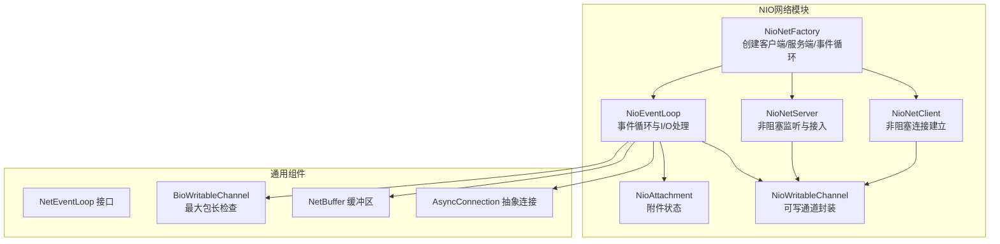
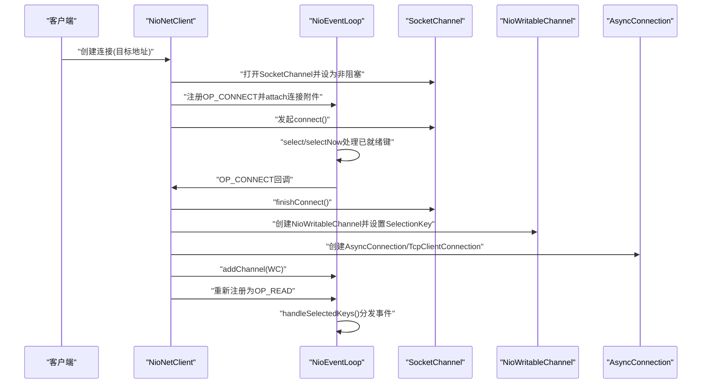
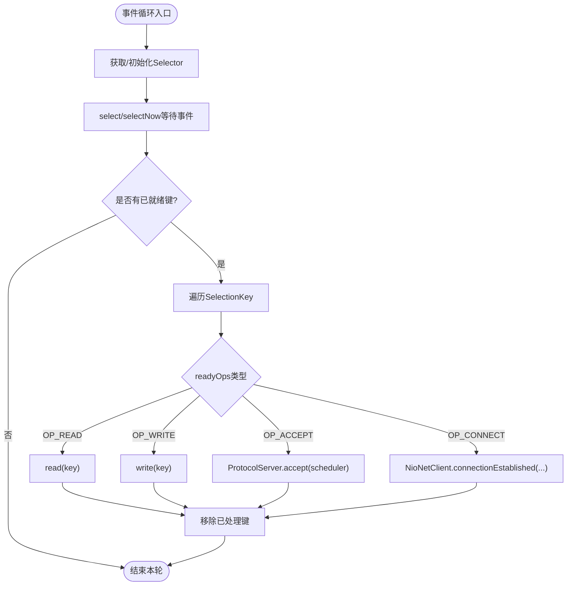
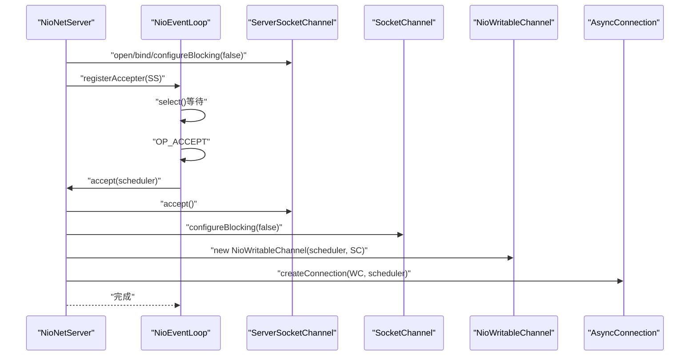
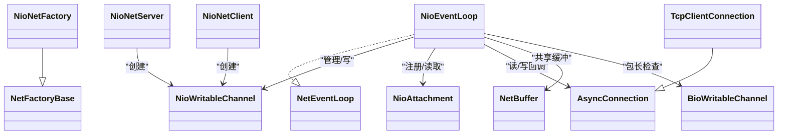

# NIO模型

<cite>
**本文引用的文件**
- [NioNetFactory.java](https://github.com/lealone/Lealone/blob/master/lealone-net/src/main/java/com/lealone/net/nio/NioNetFactory.java)
- [NioEventLoop.java](https://github.com/lealone/Lealone/blob/master/lealone-net/src/main/java/com/lealone/net/nio/NioEventLoop.java)
- [NioNetServer.java](https://github.com/lealone/Lealone/blob/master/lealone-net/src/main/java/com/lealone/net/nio/NioNetServer.java)
- [NioNetClient.java](https://github.com/lealone/Lealone/blob/master/lealone-net/src/main/java/com/lealone/net/nio/NioNetClient.java)
- [NioWritableChannel.java](https://github.com/lealone/Lealone/blob/master/lealone-net/src/main/java/com/lealone/net/nio/NioWritableChannel.java)
- [NioAttachment.java](https://github.com/lealone/Lealone/blob/master/lealone-net/src/main/java/com/lealone/net/nio/NioAttachment.java)
- [NetEventLoop.java](https://github.com/lealone/Lealone/blob/master/lealone-net/src/main/java/com/lealone/net/NetEventLoop.java)
- [NetFactoryBase.java](https://github.com/lealone/Lealone/blob/master/lealone-net/src/main/java/com/lealone/net/NetFactoryBase.java)
- [BioWritableChannel.java](https://github.com/lealone/Lealone/blob/master/lealone-net/src/main/java/com/lealone/net/bio/BioWritableChannel.java)
- [NetBuffer.java](https://github.com/lealone/Lealone/blob/master/lealone-common/src/main/java/com/lealone/net/NetBuffer.java)
- [AsyncConnection.java](https://github.com/lealone/Lealone/blob/master/lealone-net/src/main/java/com/lealone/net/AsyncConnection.java)
- [TcpClientConnection.java](https://github.com/lealone/Lealone/blob/master/lealone-net/src/main/java/com/lealone/net/TcpClientConnection.java)
- [ClientScheduler.java](https://github.com/lealone/Lealone/blob/master/lealone-client/src/main/java/com/lealone/client/ClientScheduler.java)
- [lealone-test.yaml](https://github.com/lealone/Lealone/blob/master/lealone-test/src/test/resources/lealone-test.yaml)
- [CRUDExample.java](https://github.com/lealone/Lealone/blob/master/lealone-test/src/test/java/com/lealone/test/misc/CRUDExample.java)
</cite>

## 目录
1. [简介](#简介)
2. [项目结构](#项目结构)
3. [核心组件](#核心组件)
4. [架构总览](#架构总览)
5. [详细组件分析](#详细组件分析)
6. [依赖关系分析](#依赖关系分析)
7. [性能考量与优化建议](#性能考量与优化建议)
8. [故障排查指南](#故障排查指南)
9. [结论](#结论)
10. [附录：配置与使用示例路径](#附录配置与使用示例路径)

## 简介
本文件系统性解析 Lealone 的 NIO 网络模型实现，围绕 NioNetFactory 如何创建 NIO 网络组件展开，深入剖析 NioEventLoop 事件循环的机制（Selector 轮询、OP_READ/OP_WRITE/OP_ACCEPT/OP_CONNECT 处理、批量写策略），并说明 NioNetServer 的连接接受流程与 NioAttachment 在连接状态管理中的作用。最后给出高并发场景下的性能优化建议与配置示例路径。

## 项目结构
NIO 相关代码集中在 lealone-net 模块的 nio 包中，配合通用的 NetBuffer 缓冲区、AsyncConnection 抽象连接、以及客户端侧的 ClientScheduler 调度器共同构成完整的 NIO 网络栈。

图表来源
- [NioNetFactory.java](https://github.com/lealone/Lealone/blob/master/lealone-net/src/main/java/com/lealone/net/nio/NioNetFactory.java#L1-L37)
- [NioNetServer.java](https://github.com/lealone/Lealone/blob/master/lealone-net/src/main/java/com/lealone/net/nio/NioNetServer.java#L1-L77)
- [NioNetClient.java](https://github.com/lealone/Lealone/blob/master/lealone-net/src/main/java/com/lealone/net/nio/NioNetClient.java#L1-L101)
- [NioEventLoop.java](https://github.com/lealone/Lealone/blob/master/lealone-net/src/main/java/com/lealone/net/nio/NioEventLoop.java#L1-L569)
- [NioWritableChannel.java](https://github.com/lealone/Lealone/blob/master/lealone-net/src/main/java/com/lealone/net/nio/NioWritableChannel.java#L1-L136)
- [NioAttachment.java](https://github.com/lealone/Lealone/blob/master/lealone-net/src/main/java/com/lealone/net/nio/NioAttachment.java#L1-L20)
- [NetEventLoop.java](https://github.com/lealone/Lealone/blob/master/lealone-net/src/main/java/com/lealone/net/NetEventLoop.java#L1-L52)
- [AsyncConnection.java](https://github.com/lealone/Lealone/blob/master/lealone-net/src/main/java/com/lealone/net/AsyncConnection.java#L1-L96)
- [NetBuffer.java](https://github.com/lealone/Lealone/blob/master/lealone-common/src/main/java/com/lealone/net/NetBuffer.java#L105-L171)
- [BioWritableChannel.java](https://github.com/lealone/Lealone/blob/master/lealone-net/src/main/java/com/lealone/net/bio/BioWritableChannel.java#L150-L159)

章节来源
- [NioNetFactory.java](https://github.com/lealone/Lealone/blob/master/lealone-net/src/main/java/com/lealone/net/nio/NioNetFactory.java#L1-L37)
- [NioEventLoop.java](https://github.com/lealone/Lealone/blob/master/lealone-net/src/main/java/com/lealone/net/nio/NioEventLoop.java#L1-L120)

## 核心组件
- NioNetFactory：工厂类，负责创建 NIO 客户端、服务端与事件循环实例。
- NioEventLoop：事件循环核心，封装 Selector、注册/选择/处理事件、读写处理、异常处理与资源回收。
- NioNetServer：非阻塞服务端监听器，负责接受新连接并创建可写通道与连接对象。
- NioNetClient：非阻塞客户端，发起连接、完成连接后注册到事件循环。
- NioWritableChannel：对 SocketChannel 的封装，维护待写缓冲队列与 SelectionKey。
- NioAttachment：注册到 SelectionKey 的附件，承载 AsyncConnection 与部分读取状态（如未读完包的片段）。
- NetEventLoop 接口：定义事件循环对外能力。
- AsyncConnection/TcpClientConnection：抽象连接与客户端连接实现，负责协议解析与回调处理。
- NetBuffer：共享的输入/输出缓冲区，支持可回收的可写/可读缓冲包装。

章节来源
- [NioNetFactory.java](https://github.com/lealone/Lealone/blob/master/lealone-net/src/main/java/com/lealone/net/nio/NioNetFactory.java#L1-L37)
- [NioEventLoop.java](https://github.com/lealone/Lealone/blob/master/lealone-net/src/main/java/com/lealone/net/nio/NioEventLoop.java#L1-L120)
- [NioNetServer.java](https://github.com/lealone/Lealone/blob/master/lealone-net/src/main/java/com/lealone/net/nio/NioNetServer.java#L1-L77)
- [NioNetClient.java](https://github.com/lealone/Lealone/blob/master/lealone-net/src/main/java/com/lealone/net/nio/NioNetClient.java#L1-L101)
- [NioWritableChannel.java](https://github.com/lealone/Lealone/blob/master/lealone-net/src/main/java/com/lealone/net/nio/NioWritableChannel.java#L1-L136)
- [NioAttachment.java](https://github.com/lealone/Lealone/blob/master/lealone-net/src/main/java/com/lealone/net/nio/NioAttachment.java#L1-L20)
- [NetEventLoop.java](https://github.com/lealone/Lealone/blob/master/lealone-net/src/main/java/com/lealone/net/NetEventLoop.java#L1-L52)
- [AsyncConnection.java](https://github.com/lealone/Lealone/blob/master/lealone-net/src/main/java/com/lealone/net/AsyncConnection.java#L1-L96)
- [TcpClientConnection.java](https://github.com/lealone/Lealone/blob/master/lealone-net/src/main/java/com/lealone/net/TcpClientConnection.java#L1-L191)
- [NetBuffer.java](https://github.com/lealone/Lealone/blob/master/lealone-common/src/main/java/com/lealone/net/NetBuffer.java#L105-L171)

## 架构总览
NIO 模型采用“单事件循环线程 + 多通道”的模式：
- 事件循环线程持有 Selector，统一进行 select/selectNow/wakeup。
- 每个连接对应一个 NioWritableChannel，加入 channels 集合，按需注册 OP_READ/OP_WRITE/OP_CONNECT/OP_ACCEPT。
- 读写采用 NetBuffer 共享缓冲，支持批量写与按需写策略，避免阻塞。
- 服务端通过 NioNetServer 接受连接，客户端通过 NioNetClient 发起连接。

图表来源
- [NioNetClient.java](https://github.com/lealone/Lealone/blob/master/lealone-net/src/main/java/com/lealone/net/nio/NioNetClient.java#L33-L101)
- [NioEventLoop.java](https://github.com/lealone/Lealone/blob/master/lealone-net/src/main/java/com/lealone/net/nio/NioEventLoop.java#L113-L145)
- [NioEventLoop.java](https://github.com/lealone/Lealone/blob/master/lealone-net/src/main/java/com/lealone/net/nio/NioEventLoop.java#L463-L487)

## 详细组件分析

### NioNetFactory：NIO网络组件工厂
- 负责创建 NioNetClient、NioNetServer 与 NioEventLoop 实例。
- 事件循环构造时注入 Scheduler 与配置 Map，用于读写缓冲、批处理阈值与最大包长等参数。

章节来源
- [NioNetFactory.java](https://github.com/lealone/Lealone/blob/master/lealone-net/src/main/java/com/lealone/net/nio/NioNetFactory.java#L1-L37)
- [NetFactoryBase.java](https://github.com/lealone/Lealone/blob/master/lealone-net/src/main/java/com/lealone/net/NetFactoryBase.java#L1-L22)

### NioEventLoop：事件循环与I/O处理
- Selector 延迟初始化，避免启动开销；select/selectNow/wakeup 控制事件轮询。
- 注册阶段将 AsyncConnection 作为附件绑定到 SelectionKey，便于事件回调时定位连接。
- 读处理：
  - 支持从共享 inputBuffer 中读取，按包长字段拆包，处理半包与扩容。
  - 若上一次未读完包，会恢复上次的 inBuffer 与 packetLength 继续读取。
  - 异常时回收共享缓冲占用，避免内存泄漏。
- 写处理：
  - 单包写采用 while 循环确保写完，未写完时注册 OP_WRITE。
  - 批量写：将通道待写队列合并为堆叠 ByteBuffer 数组一次性写出，减少系统调用次数。
  - 当输出缓冲包数量超过阈值或调度器繁忙/需要立即写时，优先批量写。
- 事件分发：
  - OP_READ：调用 read(SelectionKey)。
  - OP_WRITE：调用 write(SelectionKey)。
  - OP_ACCEPT：由 NioNetServer 注册的附件触发，调用 ProtocolServer.accept。
  - OP_CONNECT：由 NioNetClient 回调完成连接并切换为 OP_READ。
- 关闭与异常：
  - 异常时记录日志并关闭通道，回收缓冲。
  - 关闭时遍历 channels 清理 SelectionKey 并静默关闭底层 Socket。

图表来源
- [NioEventLoop.java](https://github.com/lealone/Lealone/blob/master/lealone-net/src/main/java/com/lealone/net/nio/NioEventLoop.java#L113-L145)
- [NioEventLoop.java](https://github.com/lealone/Lealone/blob/master/lealone-net/src/main/java/com/lealone/net/nio/NioEventLoop.java#L463-L487)

章节来源
- [NioEventLoop.java](https://github.com/lealone/Lealone/blob/master/lealone-net/src/main/java/com/lealone/net/nio/NioEventLoop.java#L1-L120)
- [NioEventLoop.java](https://github.com/lealone/Lealone/blob/master/lealone-net/src/main/java/com/lealone/net/nio/NioEventLoop.java#L155-L375)
- [NioEventLoop.java](https://github.com/lealone/Lealone/blob/master/lealone-net/src/main/java/com/lealone/net/nio/NioEventLoop.java#L372-L438)
- [NioEventLoop.java](https://github.com/lealone/Lealone/blob/master/lealone-net/src/main/java/com/lealone/net/nio/NioEventLoop.java#L448-L487)
- [NioEventLoop.java](https://github.com/lealone/Lealone/blob/master/lealone-net/src/main/java/com/lealone/net/nio/NioEventLoop.java#L489-L569)

### NioNetServer：连接接受机制
- 打开 ServerSocketChannel，绑定主机与端口，设为非阻塞。
- 将自身注册为“可接受者”，在事件循环中通过 OP_ACCEPT 触发 accept 流程。
- 接受新连接后创建 NioWritableChannel 与 AsyncConnection，并交由连接管理器处理。

图表来源
- [NioNetServer.java](https://github.com/lealone/Lealone/blob/master/lealone-net/src/main/java/com/lealone/net/nio/NioNetServer.java#L25-L76)

章节来源
- [NioNetServer.java](https://github.com/lealone/Lealone/blob/master/lealone-net/src/main/java/com/lealone/net/nio/NioNetServer.java#L1-L77)

### NioNetClient：连接建立与事件回调
- 创建 SocketChannel 并设为非阻塞，注册 OP_CONNECT 与自定义附件（包含连接管理器、目标地址、回调等）。
- 若事件循环已在运行，可能立即 selectNow 并处理已就绪键，避免重复注册冲突。
- 连接完成后创建 NioWritableChannel 与 AsyncConnection/TcpClientConnection，加入事件循环并切换为 OP_READ。

章节来源
- [NioNetClient.java](https://github.com/lealone/Lealone/blob/master/lealone-net/src/main/java/com/lealone/net/nio/NioNetClient.java#L33-L101)

### NioAttachment：连接状态管理
- 作为 SelectionKey 附件，保存 AsyncConnection、未读完包的 inBuffer 与 packetLength。
- 在读取过程中用于恢复上次未完成的包解析，保证半包处理的正确性。

章节来源
- [NioAttachment.java](https://github.com/lealone/Lealone/blob/master/lealone-net/src/main/java/com/lealone/net/nio/NioAttachment.java#L1-L20)
- [NioEventLoop.java](https://github.com/lealone/Lealone/blob/master/lealone-net/src/main/java/com/lealone/net/nio/NioEventLoop.java#L155-L275)

### NioWritableChannel：通道封装与缓冲队列
- 维护待写缓冲列表，提供 addBuffer/write/close 等接口。
- 通过事件循环的 write 方法实现单包写与批量写，未写完时注册 OP_WRITE。
- 关闭时回收缓冲并从事件循环 channels 中移除。

章节来源
- [NioWritableChannel.java](https://github.com/lealone/Lealone/blob/master/lealone-net/src/main/java/com/lealone/net/nio/NioWritableChannel.java#L1-L136)
- [NioEventLoop.java](https://github.com/lealone/Lealone/blob/master/lealone-net/src/main/java/com/lealone/net/nio/NioEventLoop.java#L326-L407)

### NetBuffer：共享缓冲与包计数
- 提供可回收的 WritableBuffer/ReadableBuffer，支持共享 inputBuffer 与 outputBuffer。
- 读取时按包长切片，必要时扩容；写入时批量合并写出，减少系统调用。

章节来源
- [NetBuffer.java](https://github.com/lealone/Lealone/blob/master/lealone-common/src/main/java/com/lealone/net/NetBuffer.java#L105-L171)

### AsyncConnection/TcpClientConnection：连接抽象与客户端实现
- AsyncConnection 定义包长解析、通道访问、异常处理与关闭语义。
- TcpClientConnection 维护会话映射与回调表，处理响应状态与超时检查，异常时清理回调避免死等。

章节来源
- [AsyncConnection.java](https://github.com/lealone/Lealone/blob/master/lealone-net/src/main/java/com/lealone/net/AsyncConnection.java#L1-L96)
- [TcpClientConnection.java](https://github.com/lealone/Lealone/blob/master/lealone-net/src/main/java/com/lealone/net/TcpClientConnection.java#L1-L191)

## 依赖关系分析
- NioNetFactory 继承 NetFactoryBase，实现 NetFactory 接口，提供 NIO 组件实例。
- NioEventLoop 实现 NetEventLoop 接口，依赖 Scheduler、NetBuffer、AsyncConnection、NioWritableChannel 等。
- NioNetServer/NioNetClient 分别通过事件循环注册不同类型的事件键。
- BioWritableChannel 提供最大包长检查，NioEventLoop 在读取时调用该检查防止过大包。

图表来源
- [NioNetFactory.java](https://github.com/lealone/Lealone/blob/master/lealone-net/src/main/java/com/lealone/net/nio/NioNetFactory.java#L1-L37)
- [NioEventLoop.java](https://github.com/lealone/Lealone/blob/master/lealone-net/src/main/java/com/lealone/net/nio/NioEventLoop.java#L1-L120)
- [NioNetServer.java](https://github.com/lealone/Lealone/blob/master/lealone-net/src/main/java/com/lealone/net/nio/NioNetServer.java#L1-L77)
- [NioNetClient.java](https://github.com/lealone/Lealone/blob/master/lealone-net/src/main/java/com/lealone/net/nio/NioNetClient.java#L1-L101)
- [NioWritableChannel.java](https://github.com/lealone/Lealone/blob/master/lealone-net/src/main/java/com/lealone/net/nio/NioWritableChannel.java#L1-L136)
- [NioAttachment.java](https://github.com/lealone/Lealone/blob/master/lealone-net/src/main/java/com/lealone/net/nio/NioAttachment.java#L1-L20)
- [AsyncConnection.java](https://github.com/lealone/Lealone/blob/master/lealone-net/src/main/java/com/lealone/net/AsyncConnection.java#L1-L96)
- [TcpClientConnection.java](https://github.com/lealone/Lealone/blob/master/lealone-net/src/main/java/com/lealone/net/TcpClientConnection.java#L1-L191)
- [NetBuffer.java](https://github.com/lealone/Lealone/blob/master/lealone-common/src/main/java/com/lealone/net/NetBuffer.java#L105-L171)
- [BioWritableChannel.java](https://github.com/lealone/Lealone/blob/master/lealone-net/src/main/java/com/lealone/net/bio/BioWritableChannel.java#L150-L159)

## 性能考量与优化建议
- 线程池与调度器
  - 使用 ClientScheduler 或服务端调度器工厂创建多个调度器线程，提高事件循环并发度。
  - 可参考配置项：scheduler_count、prefer_batch_write、max_packet_count_per_loop。
- 缓冲区大小与批处理
  - prefer_batch_write=true 时，优先批量写以降低系统调用次数；在高吞吐场景可考虑关闭以降低延迟。
  - max_packet_count_per_loop 控制每轮循环最多处理的包数，避免长时间占用事件循环。
  - NetBuffer 的扩容策略在半包场景下自动生效，避免频繁分配。
- 事件处理优化
  - OP_WRITE 未写完时注册 OP_WRITE，避免忙等；写完后及时取消兴趣位。
  - 读取时尽量复用共享 inputBuffer，减少内存碎片与 GC 压力。
- 最大包长限制
  - 通过 ConnectionSetting.MAX_PACKET_SIZE 控制最大包长，NioEventLoop 在读取时调用 BioWritableChannel 的检查方法进行校验。
- 客户端连接策略
  - 连接建立后立即切换为 OP_READ，减少不必要的 OP_CONNECT 事件。
  - 对于高并发连接，建议合理设置 socket 接收/发送缓冲区大小（可通过连接参数配置）。

章节来源
- [ClientScheduler.java](https://github.com/lealone/Lealone/blob/master/lealone-client/src/main/java/com/lealone/client/ClientScheduler.java#L36-L70)
- [NioEventLoop.java](https://github.com/lealone/Lealone/blob/master/lealone-net/src/main/java/com/lealone/net/nio/NioEventLoop.java#L63-L75)
- [NioEventLoop.java](https://github.com/lealone/Lealone/blob/master/lealone-net/src/main/java/com/lealone/net/nio/NioEventLoop.java#L326-L407)
- [BioWritableChannel.java](https://github.com/lealone/Lealone/blob/master/lealone-net/src/main/java/com/lealone/net/bio/BioWritableChannel.java#L150-L159)
- [lealone-test.yaml](https://github.com/lealone/Lealone/blob/master/lealone-test/src/test/resources/lealone-test.yaml#L9-L14)

## 故障排查指南
- 连接异常断开
  - 读取返回负值时视为连接关闭，事件循环会关闭通道并回收缓冲。
- 写入未完成
  - 单包写采用 while 循环确保写完；若未写完则注册 OP_WRITE，避免死循环。
- 半包与扩容
  - 未读完包会保存 inBuffer 与 packetLength，在下次读取时恢复继续解析。
- 日志与异常
  - 事件循环在异常时记录日志并调用 AsyncConnection.handleException，随后关闭通道。
- 调度器与事件循环
  - ClientScheduler 在停止时会关闭事件循环，确保资源释放。

章节来源
- [NioEventLoop.java](https://github.com/lealone/Lealone/blob/master/lealone-net/src/main/java/com/lealone/net/nio/NioEventLoop.java#L284-L305)
- [NioEventLoop.java](https://github.com/lealone/Lealone/blob/master/lealone-net/src/main/java/com/lealone/net/nio/NioEventLoop.java#L393-L407)
- [NioEventLoop.java](https://github.com/lealone/Lealone/blob/master/lealone-net/src/main/java/com/lealone/net/nio/NioEventLoop.java#L531-L546)
- [ClientScheduler.java](https://github.com/lealone/Lealone/blob/master/lealone-client/src/main/java/com/lealone/client/ClientScheduler.java#L207-L211)

## 结论
Lealone 的 NIO 网络模型通过 NioNetFactory 统一创建组件，NioEventLoop 以 Selector 为核心实现高效的事件驱动 I/O，结合共享缓冲与批量写策略在高并发场景下具备良好的吞吐与低延迟表现。NioNetServer 与 NioNetClient 分别负责连接接受与建立，NioAttachment 与 NioWritableChannel 提供了可靠的连接状态管理与通道封装。通过合理的调度器配置、缓冲区与批处理策略，可在不同业务场景下取得最佳性能。

## 附录：配置与使用示例路径
- 服务端/调度器参数示例（scheduler_count、prefer_batch_write、max_packet_count_per_loop）
  - [lealone-test.yaml](https://github.com/lealone/Lealone/blob/master/lealone-test/src/test/resources/lealone-test.yaml#L9-L14)
- 客户端连接参数示例（MAX_PACKET_SIZE、AUTO_RECONNECT、SCHEDULER_COUNT）
  - [CRUDExample.java](https://github.com/lealone/Lealone/blob/master/lealone-test/src/test/java/com/lealone/test/misc/CRUDExample.java#L61-L75)
- 事件循环与批处理开关
  - [ClientScheduler.java](https://github.com/lealone/Lealone/blob/master/lealone-client/src/main/java/com/lealone/client/ClientScheduler.java#L41-L48)
- 工厂与组件创建
  - [NioNetFactory.java](https://github.com/lealone/Lealone/blob/master/lealone-net/src/main/java/com/lealone/net/nio/NioNetFactory.java#L24-L36)
- 事件循环关键方法
  - [NetEventLoop.java](https://github.com/lealone/Lealone/blob/master/lealone-net/src/main/java/com/lealone/net/NetEventLoop.java#L14-L52)
  - [NioEventLoop.java](https://github.com/lealone/Lealone/blob/master/lealone-net/src/main/java/com/lealone/net/nio/NioEventLoop.java#L113-L145)
  - [NioEventLoop.java](https://github.com/lealone/Lealone/blob/master/lealone-net/src/main/java/com/lealone/net/nio/NioEventLoop.java#L326-L407)
- 连接接受与建立
  - [NioNetServer.java](https://github.com/lealone/Lealone/blob/master/lealone-net/src/main/java/com/lealone/net/nio/NioNetServer.java#L54-L76)
  - [NioNetClient.java](https://github.com/lealone/Lealone/blob/master/lealone-net/src/main/java/com/lealone/net/nio/NioNetClient.java#L33-L101)
- 附件与通道
  - [NioAttachment.java](https://github.com/lealone/Lealone/blob/master/lealone-net/src/main/java/com/lealone/net/nio/NioAttachment.java#L1-L20)
  - [NioWritableChannel.java](https://github.com/lealone/Lealone/blob/master/lealone-net/src/main/java/com/lealone/net/nio/NioWritableChannel.java#L89-L136)
- 缓冲区与包长检查
  - [NetBuffer.java](https://github.com/lealone/Lealone/blob/master/lealone-common/src/main/java/com/lealone/net/NetBuffer.java#L105-L171)
  - [BioWritableChannel.java](https://github.com/lealone/Lealone/blob/master/lealone-net/src/main/java/com/lealone/net/bio/BioWritableChannel.java#L150-L159)