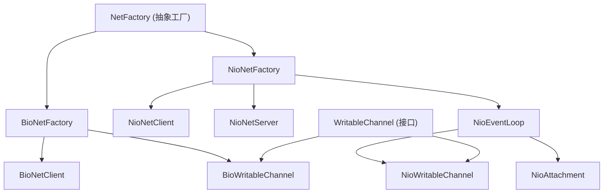
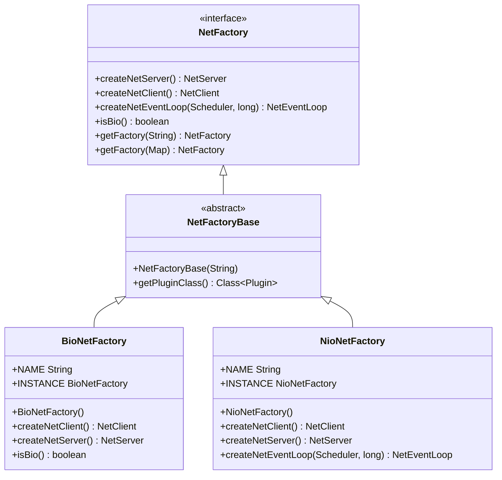
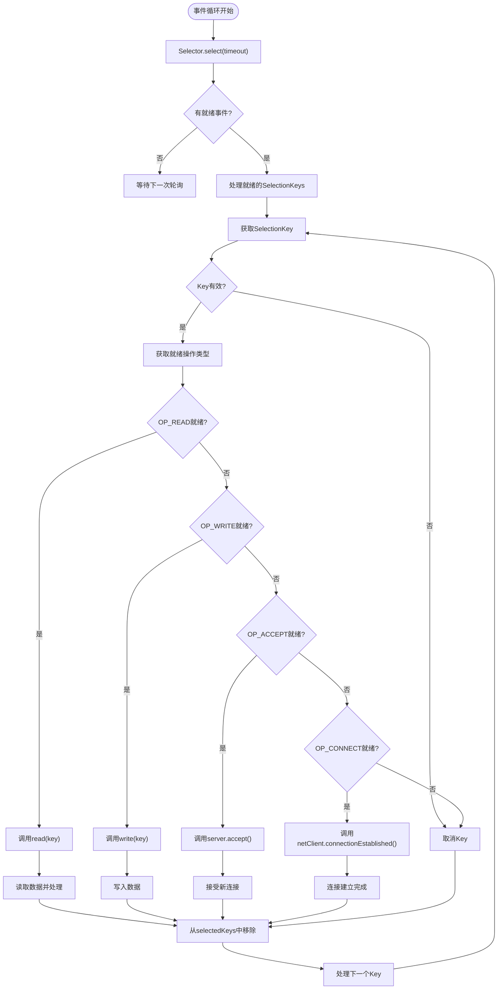
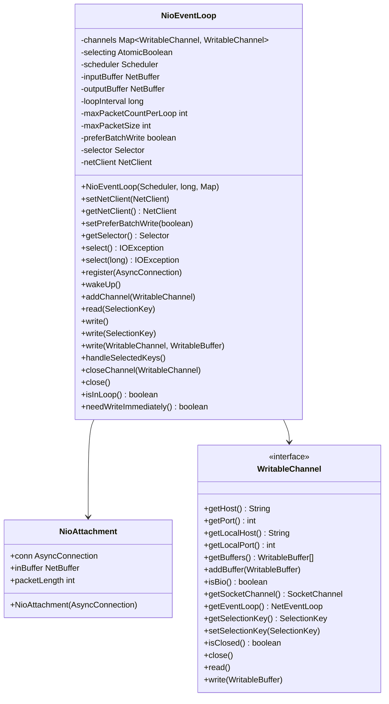
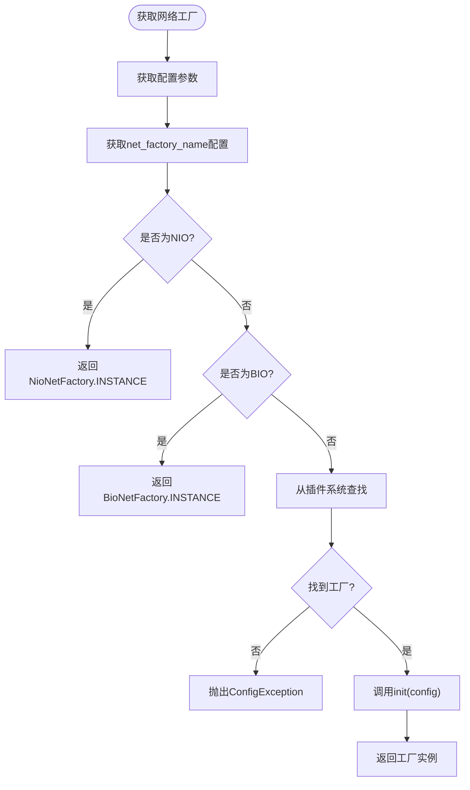
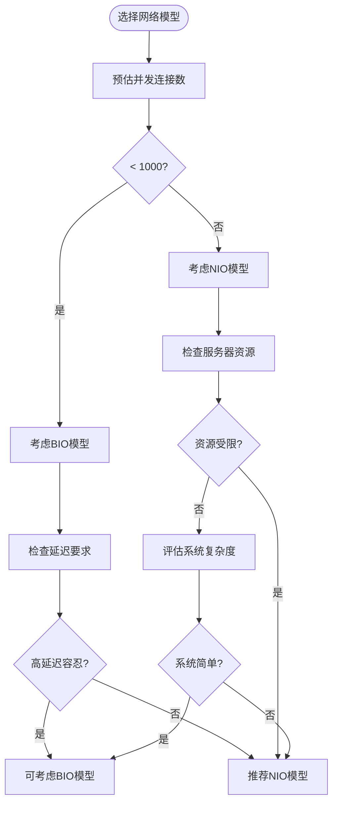

# 网络模型

<cite>
**本文档引用的文件**  
- [BioNetFactory.java](file://lealone-net/src/main/java/com/lealone/net/bio/BioNetFactory.java)
- [NioNetFactory.java](file://lealone-net/src/main/java/com/lealone/net/nio/NioNetFactory.java)
- [NioEventLoop.java](file://lealone-net/src/main/java/com/lealone/net/nio/NioEventLoop.java)
- [NetFactory.java](file://lealone-net/src/main/java/com/lealone/net/NetFactory.java)
- [NetFactoryBase.java](file://lealone-net/src/main/java/com/lealone/net/NetFactoryBase.java)
- [BioNetClient.java](file://lealone-net/src/main/java/com/lealone/net/bio/BioNetClient.java)
- [NioNetClient.java](file://lealone-net/src/main/java/com/lealone/net/nio/NioNetClient.java)
- [NioNetServer.java](file://lealone-net/src/main/java/com/lealone/net/nio/NioNetServer.java)
- [BioWritableChannel.java](file://lealone-net/src/main/java/com/lealone/net/bio/BioWritableChannel.java)
- [NioWritableChannel.java](file://lealone-net/src/main/java/com/lealone/net/nio/NioWritableChannel.java)
- [NioAttachment.java](file://lealone-net/src/main/java/com/lealone/net/nio/NioAttachment.java)
- [NetEventLoop.java](file://lealone-net/src/main/java/com/lealone/net/NetEventLoop.java)
- [WritableChannel.java](file://lealone-net/src/main/java/com/lealone/net/WritableChannel.java)
</cite>

## 目录
1. [引言](#引言)
2. [网络模型架构概览](#网络模型架构概览)
3. [BIO与NIO网络模型实现对比](#bio与nio网络模型实现对比)
4. [NIO事件循环机制深入解析](#nio事件循环机制深入解析)
5. [NetFactory抽象工厂设计分析](#netfactory抽象工厂设计分析)
6. [网络模型选择决策指南](#网络模型选择决策指南)
7. [性能调优与资源消耗分析](#性能调优与资源消耗分析)
8. [结论](#结论)

## 引言
Lealone数据库系统提供了两种网络通信模型：BIO（阻塞I/O）和NIO（非阻塞I/O）。本文档详细分析这两种网络模型的实现机制，对比BioNetFactory和NioNetFactory的设计差异，深入解析NIO事件循环NioEventLoop的工作原理，并为开发者提供选择合适网络模型的决策指南。

## 网络模型架构概览

**图示来源**  
- [BioNetFactory.java](file://lealone-net/src/main/java/com/lealone/net/bio/BioNetFactory.java)
- [NioNetFactory.java](file://lealone-net/src/main/java/com/lealone/net/nio/NioNetFactory.java)
- [NioEventLoop.java](file://lealone-net/src/main/java/com/lealone/net/nio/NioEventLoop.java)

**本节来源**  
- [NetFactory.java](file://lealone-net/src/main/java/com/lealone/net/NetFactory.java)
- [NetFactoryBase.java](file://lealone-net/src/main/java/com/lealone/net/NetFactoryBase.java)

## BIO与NIO网络模型实现对比

### BioNetFactory设计分析
BioNetFactory是BIO网络模型的工厂实现，采用传统的阻塞式I/O模型。其主要特点包括：

- **单例模式**：通过`INSTANCE`字段提供全局唯一的工厂实例
- **BIO标识**：`isBio()`方法返回`true`，标识为BIO模式
- **客户端支持**：可创建BioNetClient用于客户端连接
- **服务器端限制**：`createNetServer()`方法抛出内部错误，表明不支持服务器端BIO实现

BioNetFactory适用于低并发、简单连接的场景，其阻塞特性使得每个连接都需要独立的线程处理，资源消耗较大。

### NioNetFactory设计分析
NioNetFactory是NIO网络模型的工厂实现，基于Java NIO的非阻塞I/O模型。其主要特点包括：

- **单例模式**：通过`INSTANCE`字段提供全局唯一的工厂实例
- **NIO标识**：继承自NetFactoryBase，`isBio()`方法返回`false`
- **完整支持**：同时支持客户端(NioNetClient)和服务器端(NioNetServer)实现
- **事件循环**：提供`createNetEventLoop()`方法创建NIO事件循环

NioNetFactory适用于高并发、大量连接的场景，通过事件驱动和多路复用机制，能够用少量线程处理大量连接，资源利用率高。

**图示来源**  
- [BioNetFactory.java](file://lealone-net/src/main/java/com/lealone/net/bio/BioNetFactory.java#L13-L37)
- [NioNetFactory.java](file://lealone-net/src/main/java/com/lealone/net/nio/NioNetFactory.java#L14-L38)
- [NetFactory.java](file://lealone-net/src/main/java/com/lealone/net/NetFactory.java#L20-L56)
- [NetFactoryBase.java](file://lealone-net/src/main/java/com/lealone/net/NetFactoryBase.java#L11-L22)

**本节来源**  
- [BioNetFactory.java](file://lealone-net/src/main/java/com/lealone/net/bio/BioNetFactory.java)
- [NioNetFactory.java](file://lealone-net/src/main/java/com/lealone/net/nio/NioNetFactory.java)

## NIO事件循环机制深入解析

### NioEventLoop核心组件
NioEventLoop是NIO网络模型的核心，负责事件的注册、轮询和处理。其主要组件包括：

- **Selector**：NIO选择器，用于多路复用I/O事件
- **channels**：存储所有可写通道的映射表
- **inputBuffer/outputBuffer**：输入输出缓冲区
- **scheduler**：关联的调度器
- **loopInterval**：事件循环间隔

### 事件注册流程
当新的连接建立时，通过`register()`方法将连接注册到事件循环：

1. 获取连接的可写通道(WritableChannel)
2. 将通道添加到channels映射表中
3. 通过SocketChannel注册到Selector，监听OP_READ事件
4. 创建NioAttachment作为SelectionKey的附件，保存连接上下文

### 事件轮询与处理流程
NioEventLoop通过`handleSelectedKeys()`方法处理就绪的I/O事件：

**图示来源**  
- [NioEventLoop.java](file://lealone-net/src/main/java/com/lealone/net/nio/NioEventLoop.java#L448-L486)

### 读写操作实现
NioEventLoop的读写操作具有以下特点：

- **读操作**：通过`read()`方法处理输入数据，支持分包读取和缓冲区管理
- **写操作**：通过`write()`方法处理输出数据，支持批量写入和立即写入
- **异常处理**：完善的异常捕获和连接关闭机制

**图示来源**  
- [NioEventLoop.java](file://lealone-net/src/main/java/com/lealone/net/nio/NioEventLoop.java#L41-L569)
- [NioAttachment.java](file://lealone-net/src/main/java/com/lealone/net/nio/NioAttachment.java#L11-L20)
- [WritableChannel.java](file://lealone-net/src/main/java/com/lealone/net/WritableChannel.java#L14-L58)

**本节来源**  
- [NioEventLoop.java](file://lealone-net/src/main/java/com/lealone/net/nio/NioEventLoop.java)

## NetFactory抽象工厂设计分析

### 抽象工厂模式实现
NetFactory接口采用抽象工厂模式统一管理不同网络模型的创建：

- **工厂接口**：定义创建网络服务器、客户端和事件循环的抽象方法
- **工厂基类**：NetFactoryBase提供基础实现
- **具体工厂**：BioNetFactory和NioNetFactory实现具体创建逻辑

### 工厂获取机制
通过静态方法`getFactory()`根据配置获取相应的工厂实例：

**图示来源**  
- [NetFactory.java](file://lealone-net/src/main/java/com/lealone/net/NetFactory.java#L34-L55)

### 工厂初始化流程
工厂初始化时会根据配置参数设置相关属性：

- **BIO模式**：设置最大数据包大小、网络超时等参数
- **NIO模式**：设置事件循环间隔、最大包数、批量写入偏好等参数

**本节来源**  
- [NetFactory.java](file://lealone-net/src/main/java/com/lealone/net/NetFactory.java)
- [NetFactoryBase.java](file://lealone-net/src/main/java/com/lealone/net/NetFactoryBase.java)

## 网络模型选择决策指南

### BIO模型适用场景
BIO网络模型适用于以下场景：

- **低并发连接**：连接数较少，每个连接处理时间较长
- **简单应用**：不需要处理大量并发连接的简单应用
- **调试环境**：便于调试和问题排查的开发环境
- **资源充足**：服务器资源充足，可以为每个连接分配独立线程

### NIO模型适用场景
NIO网络模型适用于以下场景：

- **高并发连接**：需要处理大量并发连接的场景
- **高性能要求**：对响应时间和吞吐量有较高要求的应用
- **资源受限**：服务器资源有限，需要高效利用线程和内存
- **长连接应用**：大量长连接的实时通信应用

### 决策流程图

**本节来源**  
- [BioNetFactory.java](file://lealone-net/src/main/java/com/lealone/net/bio/BioNetFactory.java)
- [NioNetFactory.java](file://lealone-net/src/main/java/com/lealone/net/nio/NioNetFactory.java)

## 性能调优与资源消耗分析

### BIO模型性能特征
BIO模型的性能特征如下：

- **线程消耗**：每个连接需要一个独立线程，线程数随连接数线性增长
- **内存消耗**：每个线程需要栈空间（通常1MB），内存消耗较大
- **上下文切换**：大量线程导致频繁的上下文切换，影响性能
- **扩展性**：受线程数限制，扩展性较差

### NIO模型性能特征
NIO模型的性能特征如下：

- **线程消耗**：少量线程处理大量连接，通常每个CPU核心一个事件循环线程
- **内存消耗**：共享缓冲区和事件循环，内存消耗较小
- **上下文切换**：减少线程数量，降低上下文切换开销
- **扩展性**：通过事件驱动机制，具有良好的扩展性

### NIO调优参数
NioEventLoop提供以下可调优参数：

| 参数 | 默认值 | 说明 |
|------|--------|------|
| max_packet_count_per_loop | 8 | 每次循环最多读取的数据包数量 |
| prefer_batch_write | true | 是否优先批量写入 |
| loop_interval | 配置值 | 事件循环间隔时间 |

### 资源消耗对比表
| 特性 | BIO模型 | NIO模型 |
|------|--------|--------|
| 线程模型 | 每连接一线程 | 事件驱动 |
| 内存占用 | 高（线程栈） | 低（共享缓冲区） |
| 上下文切换 | 频繁 | 较少 |
| 连接数上限 | 受线程数限制 | 受文件描述符限制 |
| 编程复杂度 | 简单 | 复杂 |
| 调试难度 | 容易 | 较难 |

**本节来源**  
- [NioEventLoop.java](file://lealone-net/src/main/java/com/lealone/net/nio/NioEventLoop.java#L63-L75)
- [BioWritableChannel.java](file://lealone-net/src/main/java/com/lealone/net/bio/BioWritableChannel.java#L150-L159)

## 结论
Lealone的BIO和NIO网络模型实现了不同的I/O处理策略，满足不同场景的需求。BIO模型简单直观，适合低并发场景；NIO模型高效复杂，适合高并发场景。通过NetFactory抽象工厂，系统能够灵活切换和管理不同的网络模型。开发者应根据应用的并发需求、性能要求和资源限制选择合适的网络模型，并在高并发场景下优先考虑NIO模型以获得更好的性能和扩展性。