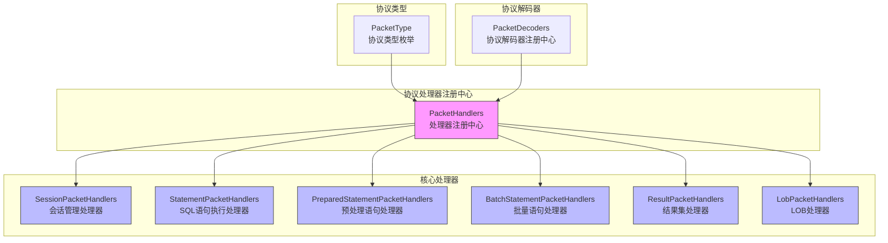
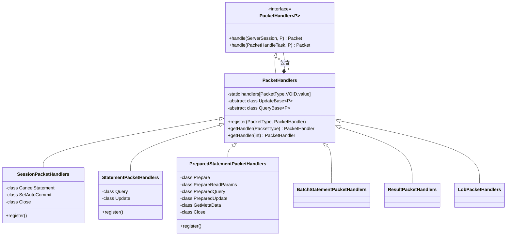
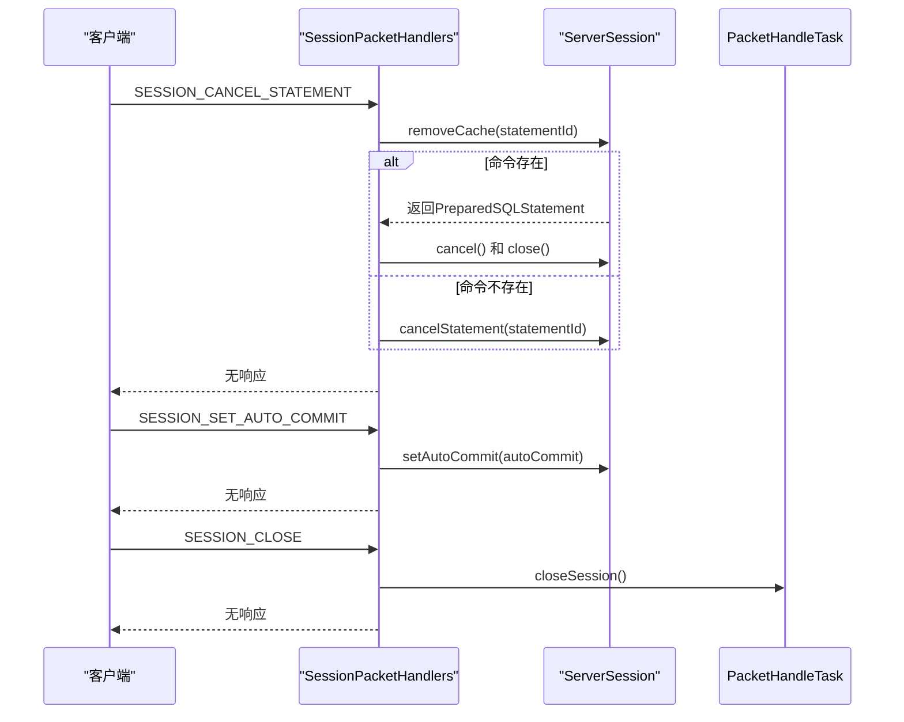
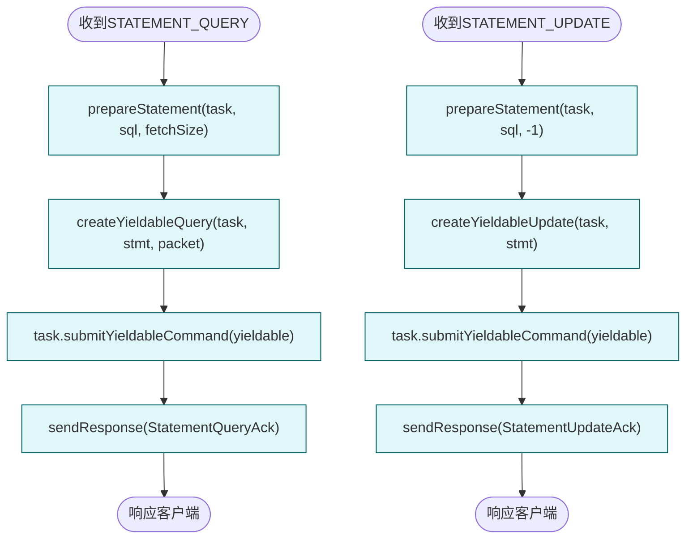
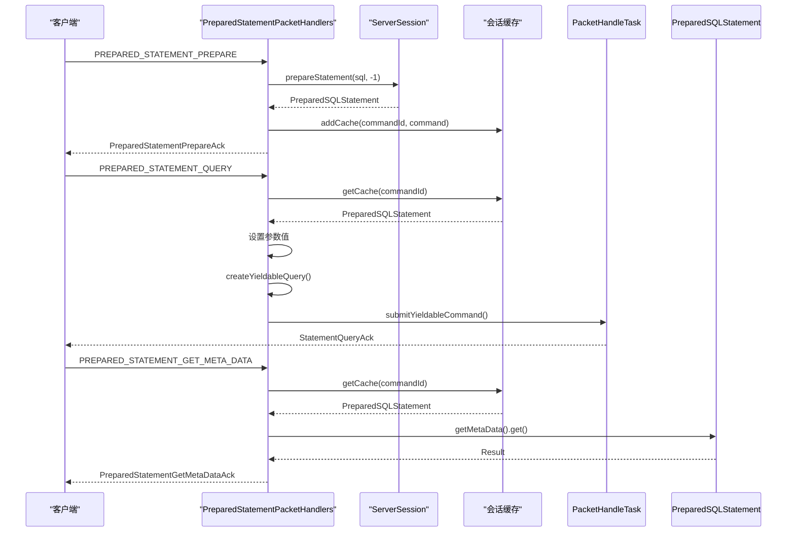
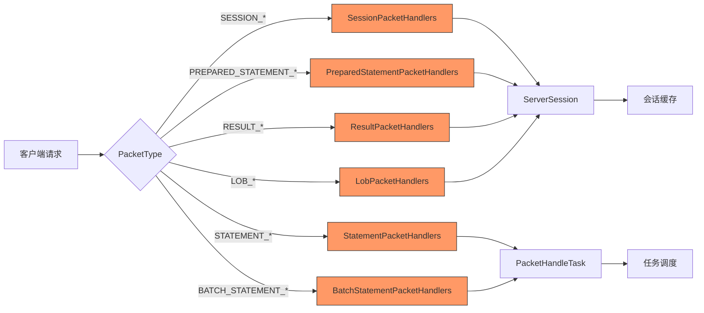
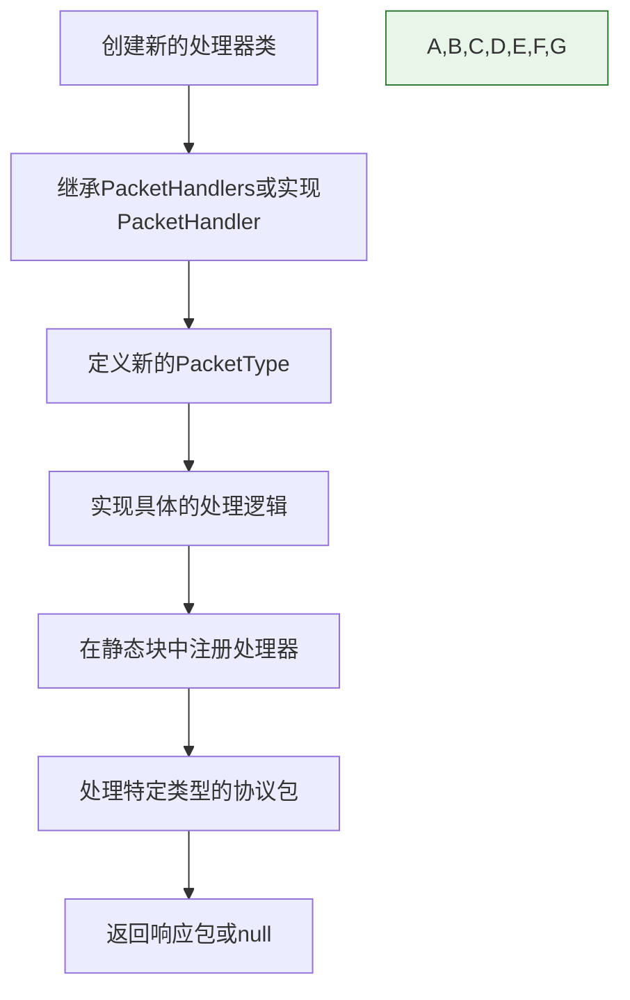

# 协议处理器

<cite>
**本文档引用的文件**
- [PacketHandler.java](file://lealone-server/src/main/java/com/lealone/server/handler/PacketHandler.java)
- [PacketHandlers.java](file://lealone-server/src/main/java/com/lealone/server/handler/PacketHandlers.java)
- [SessionPacketHandlers.java](file://lealone-server/src/main/java/com/lealone/server/handler/SessionPacketHandlers.java)
- [StatementPacketHandlers.java](file://lealone-server/src/main/java/com/lealone/server/handler/StatementPacketHandlers.java)
- [PreparedStatementPacketHandlers.java](file://lealone-server/src/main/java/com/lealone/server/handler/PreparedStatementPacketHandlers.java)
- [BatchStatementPacketHandlers.java](file://lealone-server/src/main/java/com/lealone/server/handler/BatchStatementPacketHandlers.java)
- [ResultPacketHandlers.java](file://lealone-server/src/main/java/com/lealone/server/handler/ResultPacketHandlers.java)
- [LobPacketHandlers.java](file://lealone-server/src/main/java/com/lealone/server/handler/LobPacketHandlers.java)
- [PacketType.java](file://lealone-common/src/main/java/com/lealone/server/protocol/PacketType.java)
- [PacketDecoders.java](file://lealone-common/src/main/java/com/lealone/server/protocol/PacketDecoders.java)
- [Packet.java](file://lealone-common/src/main/java/com/lealone/server/protocol/Packet.java)
- [PreparedStatementQuery.java](file://lealone-common/src/main/java/com/lealone/server/protocol/ps/PreparedStatementQuery.java)
- [StatementQuery.java](file://lealone-common/src/main/java/com/lealone/server/protocol/statement/StatementQuery.java)
- [PreparedStatementPrepare.java](file://lealone-common/src/main/java/com/lealone/server/protocol/ps/PreparedStatementPrepare.java)
- [SessionClose.java](file://lealone-common/src/main/java/com/lealone/server/protocol/session/SessionClose.java)
</cite>

## 目录
1. [引言](#引言)
2. [协议处理器体系架构](#协议处理器体系架构)
3. [核心处理器职责与实现](#核心处理器职责与实现)
4. [会话管理处理器](#会话管理处理器)
5. [SQL语句执行处理器](#sql语句执行处理器)
6. [预处理语句处理器](#预处理语句处理器)
7. [处理器协作关系与数据传递](#处理器协作关系与数据传递)
8. [处理器扩展开发指南](#处理器扩展开发指南)
9. [结论](#结论)

## 引言
Lealone数据库系统采用基于包类型的协议处理器体系，通过注册机制处理各种客户端请求。该体系将不同类型的协议请求分发到相应的处理器进行处理，实现了会话管理、SQL语句执行、预处理语句操作等功能的模块化设计。本文档全面介绍Lealone的协议处理器体系，详细描述SessionPacketHandlers、StatementPacketHandlers和PreparedStatementPacketHandlers等核心处理器的职责和实现。

## 协议处理器体系架构

**图示来源**
- [PacketHandlers.java](file://lealone-server/src/main/java/com/lealone/server/handler/PacketHandlers.java#L26-L49)
- [PacketType.java](file://lealone-common/src/main/java/com/lealone/server/protocol/PacketType.java#L10-L48)
- [PacketDecoders.java](file://lealone-common/src/main/java/com/lealone/server/protocol/PacketDecoders.java#L57-L96)

**本节来源**
- [PacketHandlers.java](file://lealone-server/src/main/java/com/lealone/server/handler/PacketHandlers.java#L26-L49)
- [PacketType.java](file://lealone-common/src/main/java/com/lealone/server/protocol/PacketType.java#L10-L48)

## 核心处理器职责与实现

Lealone的协议处理器体系基于`PacketHandler`接口实现，所有处理器都遵循统一的处理模式。`PacketHandlers`类作为处理器注册中心，维护了所有协议类型与对应处理器的映射关系。

**图示来源**
- [PacketHandler.java](file://lealone-server/src/main/java/com/lealone/server/handler/PacketHandler.java#L12-L21)
- [PacketHandlers.java](file://lealone-server/src/main/java/com/lealone/server/handler/PacketHandlers.java#L26-L164)

**本节来源**
- [PacketHandler.java](file://lealone-server/src/main/java/com/lealone/server/handler/PacketHandler.java#L12-L21)
- [PacketHandlers.java](file://lealone-server/src/main/java/com/lealone/server/handler/PacketHandlers.java#L26-L164)

## 会话管理处理器

SessionPacketHandlers负责处理与会话生命周期相关的协议请求，包括会话取消语句、设置自动提交模式和会话关闭等操作。

**图示来源**
- [SessionPacketHandlers.java](file://lealone-server/src/main/java/com/lealone/server/handler/SessionPacketHandlers.java#L17-L56)
- [SessionClose.java](file://lealone-common/src/main/java/com/lealone/server/protocol/session/SessionClose.java)

**本节来源**
- [SessionPacketHandlers.java](file://lealone-server/src/main/java/com/lealone/server/handler/SessionPacketHandlers.java#L17-L56)

## SQL语句执行处理器

StatementPacketHandlers负责处理普通SQL语句的查询和更新操作，通过继承PacketHandlers中的抽象基类实现统一的处理逻辑。

**图示来源**
- [StatementPacketHandlers.java](file://lealone-server/src/main/java/com/lealone/server/handler/StatementPacketHandlers.java#L14-L35)
- [StatementQuery.java](file://lealone-common/src/main/java/com/lealone/server/protocol/statement/StatementQuery.java)

**本节来源**
- [StatementPacketHandlers.java](file://lealone-server/src/main/java/com/lealone/server/handler/StatementPacketHandlers.java#L14-L35)
- [PacketHandlers.java](file://lealone-server/src/main/java/com/lealone/server/handler/PacketHandlers.java#L90-L142)

## 预处理语句处理器

PreparedStatementPacketHandlers负责处理预处理语句的准备、查询、更新和元数据获取等操作，通过命令ID在会话缓存中管理预处理语句。

**图示来源**
- [PreparedStatementPacketHandlers.java](file://lealone-server/src/main/java/com/lealone/server/handler/PreparedStatementPacketHandlers.java#L24-L94)
- [PreparedStatementPrepare.java](file://lealone-common/src/main/java/com/lealone/server/protocol/ps/PreparedStatementPrepare.java)
- [PreparedStatementQuery.java](file://lealone-common/src/main/java/com/lealone/server/protocol/ps/PreparedStatementQuery.java)

**本节来源**
- [PreparedStatementPacketHandlers.java](file://lealone-server/src/main/java/com/lealone/server/handler/PreparedStatementPacketHandlers.java#L24-L94)

## 处理器协作关系与数据传递

Lealone的协议处理器体系通过PacketHandlers注册中心协调各个处理器的工作，形成完整的请求处理链条。处理器之间通过会话缓存和任务调度机制进行数据传递。

**图示来源**
- [PacketHandlers.java](file://lealone-server/src/main/java/com/lealone/server/handler/PacketHandlers.java#L42-L48)
- [SessionPacketHandlers.java](file://lealone-server/src/main/java/com/lealone/server/handler/SessionPacketHandlers.java#L19-L23)
- [StatementPacketHandlers.java](file://lealone-server/src/main/java/com/lealone/server/handler/StatementPacketHandlers.java#L16-L19)

**本节来源**
- [PacketHandlers.java](file://lealone-server/src/main/java/com/lealone/server/handler/PacketHandlers.java#L42-L48)
- [SessionPacketHandlers.java](file://lealone-server/src/main/java/com/lealone/server/handler/SessionPacketHandlers.java#L19-L23)

## 处理器扩展开发指南

开发者可以通过继承PacketHandlers类并注册新的处理器来扩展Lealone的协议处理能力。以下是扩展开发的基本步骤和最佳实践。

### 扩展开发步骤

### 最佳实践

1. **遵循命名规范**：处理器类名应以"PacketHandlers"结尾，处理方法应以具体操作命名
2. **合理使用缓存**：对于需要重复使用的对象，应使用会话缓存进行管理
3. **异步处理**：耗时操作应通过PacketHandleTask提交为异步任务
4. **错误处理**：异常情况应通过task.sendError()方法通知客户端
5. **资源管理**：使用完毕的资源应及时关闭，避免内存泄漏

**本节来源**
- [PacketHandlers.java](file://lealone-server/src/main/java/com/lealone/server/handler/PacketHandlers.java#L30-L36)
- [PacketHandler.java](file://lealone-server/src/main/java/com/lealone/server/handler/PacketHandler.java#L12-L21)

## 结论

Lealone的协议处理器体系通过模块化设计实现了高效的请求处理机制。SessionPacketHandlers、StatementPacketHandlers和PreparedStatementPacketHandlers等核心处理器各司其职，通过统一的注册机制协同工作。该体系不仅支持基本的会话管理和SQL执行功能，还提供了预处理语句、批量操作和LOB处理等高级特性。通过清晰的扩展接口，开发者可以轻松地为系统添加新的协议处理能力，满足多样化的应用需求。