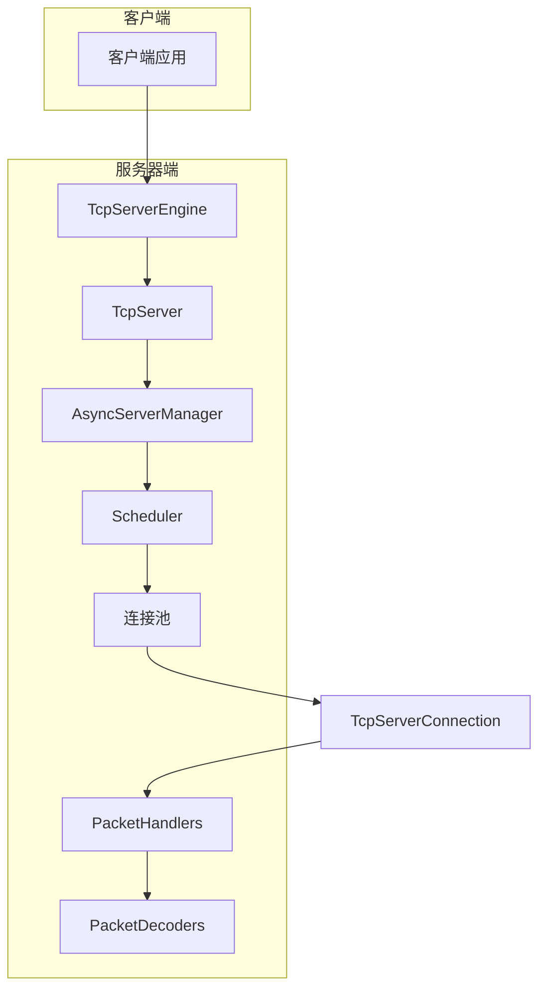
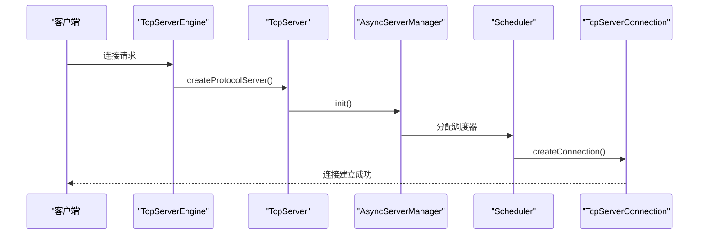
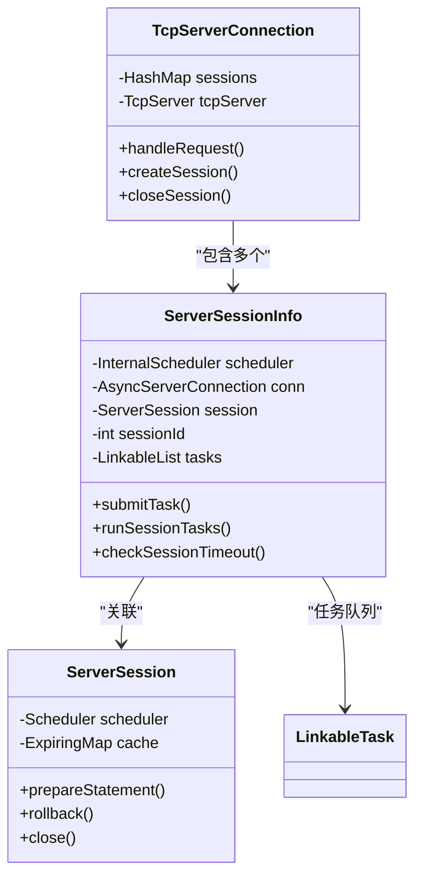
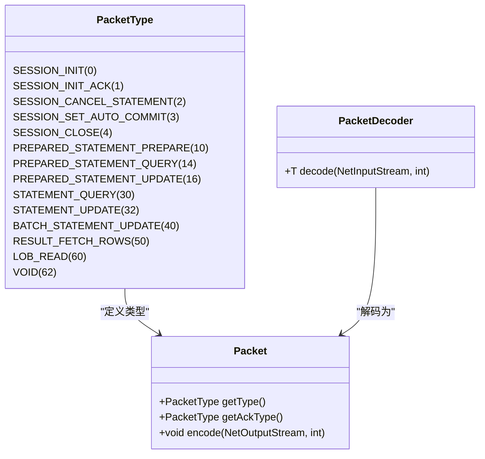
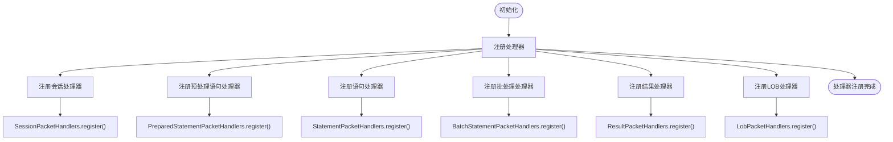
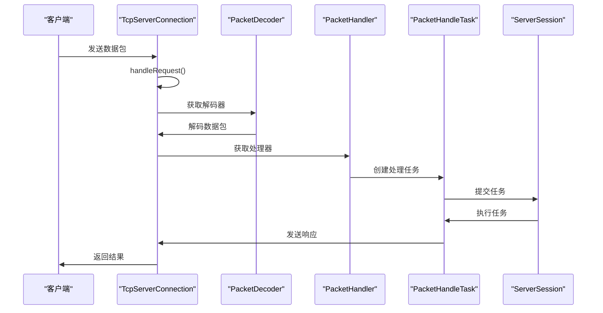
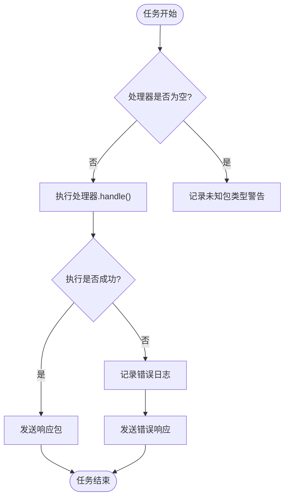
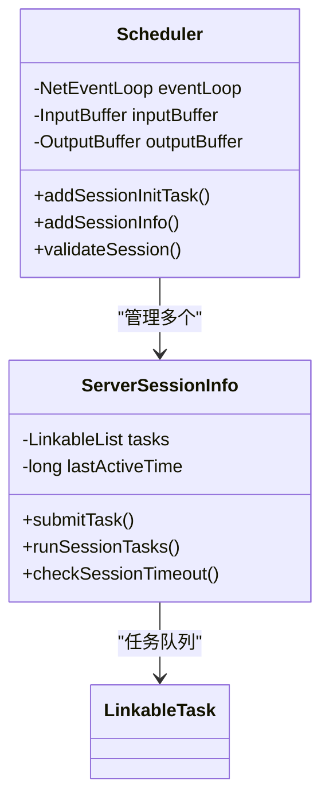
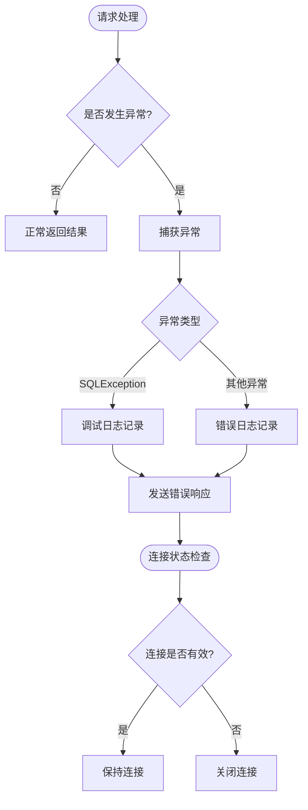

# 请求处理

**本文档引用的文件**   
- [TcpServerEngine.java](https://github.com/lealone/Lealone/blob/master/lealone-server/src/main/java/com/lealone/server/TcpServerEngine.java)
- [TcpServer.java](https://github.com/lealone/Lealone/blob/master/lealone-server/src/main/java/com/lealone/server/TcpServer.java)
- [TcpServerConnection.java](https://github.com/lealone/Lealone/blob/master/lealone-server/src/main/java/com/lealone/server/TcpServerConnection.java)
- [AsyncServerConnection.java](https://github.com/lealone/Lealone/blob/master/lealone-server/src/main/java/com/lealone/server/AsyncServerConnection.java)
- [PacketHandlers.java](https://github.com/lealone/Lealone/blob/master/lealone-server/src/main/java/com/lealone/server/handler/PacketHandlers.java)
- [PacketHandler.java](https://github.com/lealone/Lealone/blob/master/lealone-server/src/main/java/com/lealone/server/handler/PacketHandler.java)
- [PacketType.java](https://github.com/lealone/Lealone/blob/master/lealone-common/src/main/java/com/lealone/server/protocol/PacketType.java)
- [PacketDecoders.java](https://github.com/lealone/Lealone/blob/master/lealone-common/src/main/java/com/lealone/server/protocol/PacketDecoders.java)
- [SessionPacketHandlers.java](https://github.com/lealone/Lealone/blob/master/lealone-server/src/main/java/com/lealone/server/handler/SessionPacketHandlers.java)
- [PacketHandleTask.java](https://github.com/lealone/Lealone/blob/master/lealone-server/src/main/java/com/lealone/server/scheduler/PacketHandleTask.java)
- [ServerSessionInfo.java](https://github.com/lealone/Lealone/blob/master/lealone-server/src/main/java/com/lealone/server/scheduler/ServerSessionInfo.java)
- [AsyncServer.java](https://github.com/lealone/Lealone/blob/master/lealone-server/src/main/java/com/lealone/server/AsyncServer.java)
- [AsyncServerManager.java](https://github.com/lealone/Lealone/blob/master/lealone-server/src/main/java/com/lealone/server/AsyncServerManager.java)

## 目录
1. [引言](#引言)
2. [请求处理架构](#请求处理架构)
3. [连接建立与会话管理](#连接建立与会话管理)
4. [请求路由机制](#请求路由机制)
5. [请求处理生命周期](#请求处理生命周期)
6. [性能优化建议](#性能优化建议)
7. [异常处理策略](#异常处理策略)
8. [结论](#结论)

## 引言
本文深入剖析Lealone数据库的请求处理机制，重点分析TcpServerEngine如何接收客户端连接并创建AsyncServerConnection，解析PacketHandlers如何根据协议类型将请求路由到相应的PacketHandler，说明请求处理的完整生命周期，包括解码、执行、编码和响应，并为开发者提供性能优化建议。

## 请求处理架构

Lealone的请求处理架构基于异步非阻塞I/O模型，采用多线程调度器模式实现高并发处理能力。整个架构的核心组件包括协议服务器引擎、网络服务器、连接管理器和数据包处理器。

**图示来源**
- [TcpServerEngine.java](https://github.com/lealone/Lealone/blob/master/lealone-server/src/main/java/com/lealone/server/TcpServerEngine.java)
- [TcpServer.java](https://github.com/lealone/Lealone/blob/master/lealone-server/src/main/java/com/lealone/server/TcpServer.java)
- [AsyncServerManager.java](https://github.com/lealone/Lealone/blob/master/lealone-server/src/main/java/com/lealone/server/AsyncServerManager.java)

**本节来源**
- [TcpServerEngine.java](https://github.com/lealone/Lealone/blob/master/lealone-server/src/main/java/com/lealone/server/TcpServerEngine.java#L1-L21)
- [TcpServer.java](https://github.com/lealone/Lealone/blob/master/lealone-server/src/main/java/com/lealone/server/TcpServer.java#L1-L39)

## 连接建立与会话管理

### 连接建立流程
Lealone的TCP连接建立流程遵循典型的服务器端网络编程模式，通过TcpServerEngine启动TcpServer，由AsyncServerManager管理连接的生命周期。

TcpServerEngine作为协议服务器引擎，继承自ProtocolServerEngineBase，负责创建具体的协议服务器实例。其核心代码如下：

**图示来源**
- [TcpServerEngine.java](https://github.com/lealone/Lealone/blob/master/lealone-server/src/main/java/com/lealone/server/TcpServerEngine.java#L8-L19)
- [TcpServer.java](https://github.com/lealone/Lealone/blob/master/lealone-server/src/main/java/com/lealone/server/TcpServer.java#L15-L38)

**本节来源**
- [TcpServerEngine.java](https://github.com/lealone/Lealone/blob/master/lealone-server/src/main/java/com/lealone/server/TcpServerEngine.java#L8-L19)
- [TcpServer.java](https://github.com/lealone/Lealone/blob/master/lealone-server/src/main/java/com/lealone/server/TcpServer.java#L15-L38)
- [AsyncServer.java](https://github.com/lealone/Lealone/blob/master/lealone-server/src/main/java/com/lealone/server/AsyncServer.java#L26-L169)

### 会话管理机制
Lealone支持在一个TCP连接中管理多个客户端会话，通过SessionId进行会话映射。每个TcpServerConnection实例对应一个Scheduler，确保线程安全的会话管理。

**图示来源**
- [TcpServerConnection.java](https://github.com/lealone/Lealone/blob/master/lealone-server/src/main/java/com/lealone/server/TcpServerConnection.java#L42-L249)
- [ServerSessionInfo.java](https://github.com/lealone/Lealone/blob/master/lealone-server/src/main/java/com/lealone/server/scheduler/ServerSessionInfo.java#L21-L181)

**本节来源**
- [TcpServerConnection.java](https://github.com/lealone/Lealone/blob/master/lealone-server/src/main/java/com/lealone/server/TcpServerConnection.java#L42-L249)
- [ServerSessionInfo.java](https://github.com/lealone/Lealone/blob/master/lealone-server/src/main/java/com/lealone/server/scheduler/ServerSessionInfo.java#L21-L181)
- [AsyncServerConnection.java](https://github.com/lealone/Lealone/blob/master/lealone-server/src/main/java/com/lealone/server/AsyncServerConnection.java#L14-L28)

## 请求路由机制

### 协议类型与数据包
Lealone定义了丰富的协议类型，通过PacketType枚举进行管理。每个协议类型都有唯一的数值标识，用于在数据包中编码和解码。

**图示来源**
- [PacketType.java](https://github.com/lealone/Lealone/blob/master/lealone-common/src/main/java/com/lealone/server/protocol/PacketType.java#L10-L55)
- [Packet.java](https://github.com/lealone/Lealone/blob/master/lealone-common/src/main/java/com/lealone/server/protocol/Packet.java#L12-L19)

**本节来源**
- [PacketType.java](https://github.com/lealone/Lealone/blob/master/lealone-common/src/main/java/com/lealone/server/protocol/PacketType.java#L10-L55)
- [PacketDecoders.java](https://github.com/lealone/Lealone/blob/master/lealone-common/src/main/java/com/lealone/server/protocol/PacketDecoders.java#L25-L97)

### 数据包处理器注册
PacketHandlers类采用静态数组存储所有数据包处理器，通过协议类型值作为索引实现O(1)时间复杂度的处理器查找。

**图示来源**
- [PacketHandlers.java](https://github.com/lealone/Lealone/blob/master/lealone-server/src/main/java/com/lealone/server/handler/PacketHandlers.java#L28-L49)

**本节来源**
- [PacketHandlers.java](https://github.com/lealone/Lealone/blob/master/lealone-server/src/main/java/com/lealone/server/handler/PacketHandlers.java#L28-L49)
- [SessionPacketHandlers.java](https://github.com/lealone/Lealone/blob/master/lealone-server/src/main/java/com/lealone/server/handler/SessionPacketHandlers.java#L17-L23)

## 请求处理生命周期

### 请求处理流程
Lealone的请求处理生命周期包括连接接收、数据包解码、处理器路由、命令执行和响应编码五个阶段。

**图示来源**
- [TcpServerConnection.java](https://github.com/lealone/Lealone/blob/master/lealone-server/src/main/java/com/lealone/server/TcpServerConnection.java#L69-L96)
- [PacketHandleTask.java](https://github.com/lealone/Lealone/blob/master/lealone-server/src/main/java/com/lealone/server/scheduler/PacketHandleTask.java#L18-L78)

**本节来源**
- [TcpServerConnection.java](https://github.com/lealone/Lealone/blob/master/lealone-server/src/main/java/com/lealone/server/TcpServerConnection.java#L69-L96)
- [PacketHandleTask.java](https://github.com/lealone/Lealone/blob/master/lealone-server/src/main/java/com/lealone/server/scheduler/PacketHandleTask.java#L18-L78)

### 处理器执行机制
PacketHandleTask作为请求处理的核心执行单元，封装了任务执行的完整逻辑，包括异常处理和结果返回。

**图示来源**
- [PacketHandleTask.java](https://github.com/lealone/Lealone/blob/master/lealone-server/src/main/java/com/lealone/server/scheduler/PacketHandleTask.java#L39-L56)

**本节来源**
- [PacketHandleTask.java](https://github.com/lealone/Lealone/blob/master/lealone-server/src/main/java/com/lealone/server/scheduler/PacketHandleTask.java#L39-L56)
- [PacketHandlers.java](https://github.com/lealone/Lealone/blob/master/lealone-server/src/main/java/com/lealone/server/handler/PacketHandlers.java#L51-L164)

## 性能优化建议

### 处理器并发控制
Lealone通过Scheduler和ServerSessionInfo实现精细的并发控制，确保请求处理的高效性和线程安全性。

1. **调度器隔离**：每个TcpServerConnection关联一个Scheduler，避免多线程竞争
2. **会话任务队列**：每个会话有独立的任务队列，保证SQL执行顺序
3. **批量处理优化**：批处理语句合并执行，减少网络往返

**图示来源**
- [ServerSessionInfo.java](https://github.com/lealone/Lealone/blob/master/lealone-server/src/main/java/com/lealone/server/scheduler/ServerSessionInfo.java#L21-L181)
- [AsyncServer.java](https://github.com/lealone/Lealone/blob/master/lealone-server/src/main/java/com/lealone/server/AsyncServer.java#L26-L169)

**本节来源**
- [ServerSessionInfo.java](https://github.com/lealone/Lealone/blob/master/lealone-server/src/main/java/com/lealone/server/scheduler/ServerSessionInfo.java#L21-L181)
- [AsyncServer.java](https://github.com/lealone/Lealone/blob/master/lealone-server/src/main/java/com/lealone/server/AsyncServer.java#L26-L169)

### 缓存策略
Lealone采用多层次缓存策略提升性能：

1. **预处理语句缓存**：在会话级别缓存预处理语句
2. **结果集缓存**：临时存储查询结果，支持分页获取
3. **连接池复用**：减少TCP连接建立开销

## 异常处理策略

### 异常处理机制
Lealone建立了完善的异常处理体系，确保系统稳定性和错误信息的准确传递。

**图示来源**
- [PacketHandleTask.java](https://github.com/lealone/Lealone/blob/master/lealone-server/src/main/java/com/lealone/server/scheduler/PacketHandleTask.java#L40-L56)
- [TcpServerConnection.java](https://github.com/lealone/Lealone/blob/master/lealone-server/src/main/java/com/lealone/server/TcpServerConnection.java#L64-L66)

**本节来源**
- [PacketHandleTask.java](https://github.com/lealone/Lealone/blob/master/lealone-server/src/main/java/com/lealone/server/scheduler/PacketHandleTask.java#L40-L56)
- [TcpServerConnection.java](https://github.com/lealone/Lealone/blob/master/lealone-server/src/main/java/com/lealone/server/TcpServerConnection.java#L64-L66)
- [SessionPacketHandlers.java](https://github.com/lealone/Lealone/blob/master/lealone-server/src/main/java/com/lealone/server/handler/SessionPacketHandlers.java#L17-L56)

### 会话超时管理
Lealone实现了会话超时检测机制，防止资源泄漏：

1. **活动时间更新**：每次请求处理更新最后活动时间
2. **定期检查**：Scheduler定期检查会话超时
3. **自动清理**：超时会话自动关闭并释放资源

## 结论
Lealone的请求处理机制设计精巧，通过异步非阻塞I/O模型和多线程调度器实现了高性能的并发处理能力。其核心特点包括：

1. **分层架构**：清晰的组件分层，职责分离
2. **高效路由**：基于协议类型的O(1)处理器查找
3. **安全并发**：调度器隔离和会话任务队列
4. **完善异常处理**：多层次的错误处理和日志记录
5. **性能优化**：缓存策略和批量处理优化

开发者在使用Lealone时，应充分利用其预处理语句缓存和批处理功能，合理配置会话超时时间，以获得最佳性能表现。