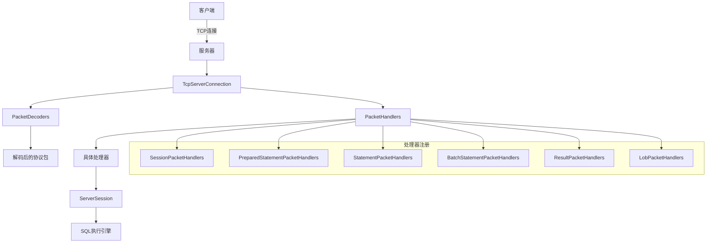
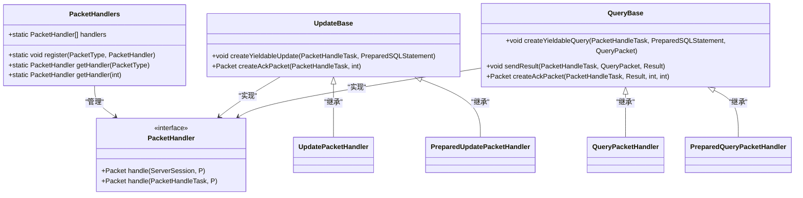
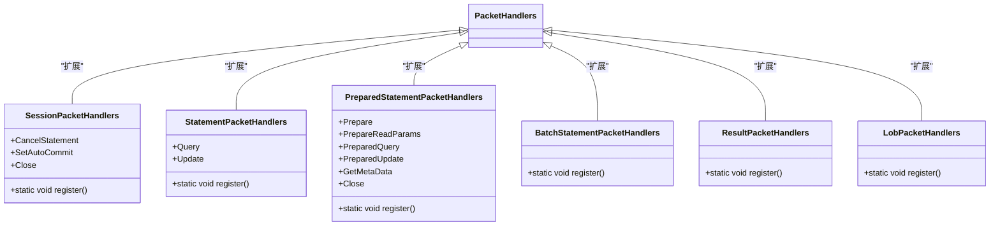
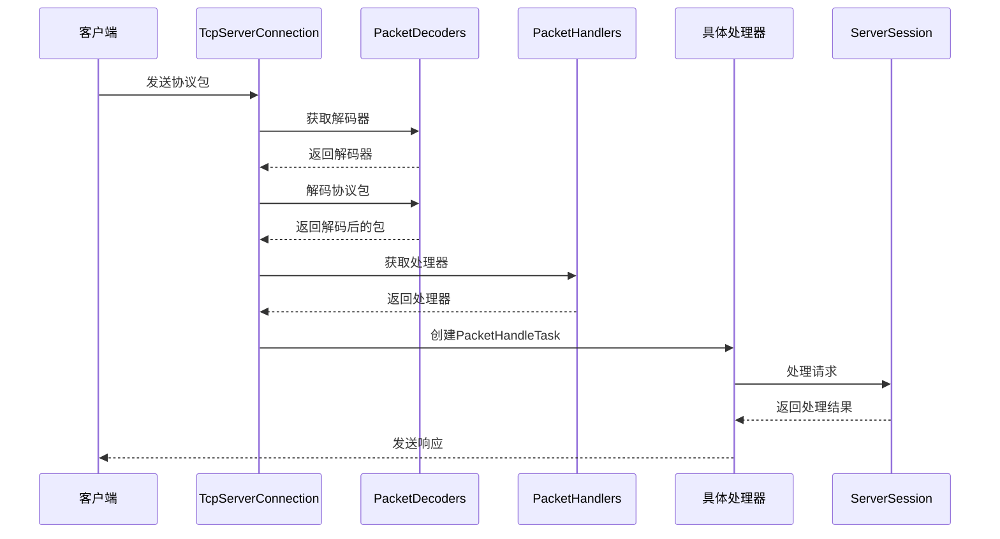
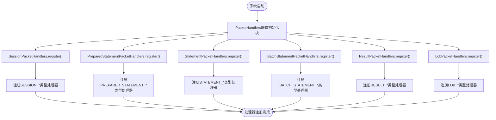
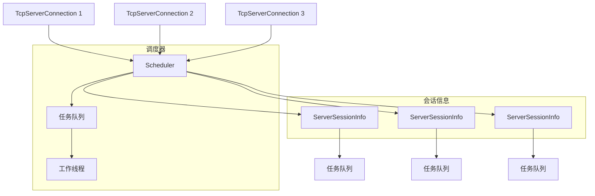
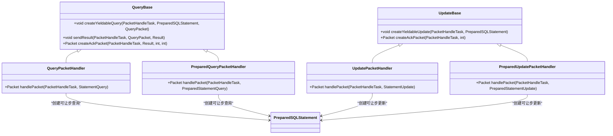
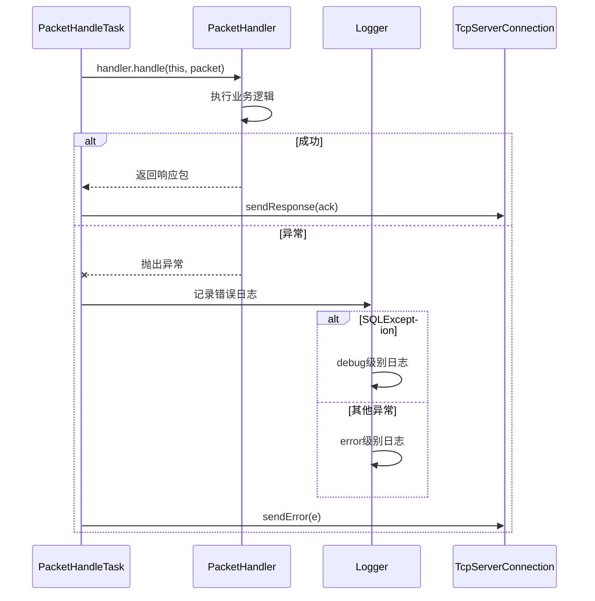

# 请求路由

<cite>
**本文档引用的文件**
- [PacketHandlers.java](file://lealone-server/src/main/java/com/lealone/server/handler/PacketHandlers.java)
- [PacketHandler.java](file://lealone-server/src/main/java/com/lealone/server/handler/PacketHandler.java)
- [PacketType.java](file://lealone-common/src/main/java/com/lealone/server/protocol/PacketType.java)
- [SessionPacketHandlers.java](file://lealone-server/src/main/java/com/lealone/server/handler/SessionPacketHandlers.java)
- [StatementPacketHandlers.java](file://lealone-server/src/main/java/com/lealone/server/handler/StatementPacketHandlers.java)
- [PreparedStatementPacketHandlers.java](file://lealone-server/src/main/java/com/lealone/server/handler/PreparedStatementPacketHandlers.java)
- [BatchStatementPacketHandlers.java](file://lealone-server/src/main/java/com/lealone/server/handler/BatchStatementPacketHandlers.java)
- [ResultPacketHandlers.java](file://lealone-server/src/main/java/com/lealone/server/handler/ResultPacketHandlers.java)
- [LobPacketHandlers.java](file://lealone-server/src/main/java/com/lealone/server/handler/LobPacketHandlers.java)
- [PacketHandleTask.java](file://lealone-server/src/main/java/com/lealone/server/scheduler/PacketHandleTask.java)
- [TcpServerConnection.java](file://lealone-server/src/main/java/com/lealone/server/TcpServerConnection.java)
- [PacketDecoders.java](file://lealone-common/src/main/java/com/lealone/server/protocol/PacketDecoders.java)
</cite>

## 目录
1. [引言](#引言)
2. [请求路由架构](#请求路由架构)
3. [核心组件分析](#核心组件分析)
4. [协议包解码与路由流程](#协议包解码与路由流程)
5. [处理器注册机制](#处理器注册机制)
6. [性能优化建议](#性能优化建议)
7. [异常处理策略](#异常处理策略)
8. [结论](#结论)

## 引言
Lealone数据库系统采用高效的请求路由机制来处理客户端的各种请求。该机制基于协议包类型（PacketType）将不同类型的请求分发到相应的处理器（PacketHandler），实现了请求处理的模块化和可扩展性。本文深入解析Lealone的请求路由机制，详细描述其工作原理和实现细节。

## 请求路由架构

**图示来源**
- [TcpServerConnection.java](file://lealone-server/src/main/java/com/lealone/server/TcpServerConnection.java)
- [PacketHandlers.java](file://lealone-server/src/main/java/com/lealone/server/handler/PacketHandlers.java)
- [PacketDecoders.java](file://lealone-common/src/main/java/com/lealone/server/protocol/PacketDecoders.java)

## 核心组件分析

### PacketHandlers 组件
PacketHandlers是请求路由的核心组件，负责管理所有类型的PacketHandler。它使用一个静态数组来存储不同类型的处理器，通过PacketType的value值作为索引进行快速查找。

**图示来源**
- [PacketHandlers.java](file://lealone-server/src/main/java/com/lealone/server/handler/PacketHandlers.java)
- [PacketHandler.java](file://lealone-server/src/main/java/com/lealone/server/handler/PacketHandler.java)

**本节来源**
- [PacketHandlers.java](file://lealone-server/src/main/java/com/lealone/server/handler/PacketHandlers.java#L26-L163)

### 具体处理器组件
Lealone实现了多种具体的处理器来处理不同类型的请求，这些处理器通过静态注册方式加入到PacketHandlers中。

**图示来源**
- [SessionPacketHandlers.java](file://lealone-server/src/main/java/com/lealone/server/handler/SessionPacketHandlers.java)
- [StatementPacketHandlers.java](file://lealone-server/src/main/java/com/lealone/server/handler/StatementPacketHandlers.java)
- [PreparedStatementPacketHandlers.java](file://lealone-server/src/main/java/com/lealone/server/handler/PreparedStatementPacketHandlers.java)
- [BatchStatementPacketHandlers.java](file://lealone-server/src/main/java/com/lealone/server/handler/BatchStatementPacketHandlers.java)
- [ResultPacketHandlers.java](file://lealone-server/src/main/java/com/lealone/server/handler/ResultPacketHandlers.java)
- [LobPacketHandlers.java](file://lealone-server/src/main/java/com/lealone/server/handler/LobPacketHandlers.java)

**本节来源**
- [SessionPacketHandlers.java](file://lealone-server/src/main/java/com/lealone/server/handler/SessionPacketHandlers#L17-L55)
- [StatementPacketHandlers.java](file://lealone-server/src/main/java/com/lealone/server/handler/StatementPacketHandlers#L14-L34)
- [PreparedStatementPacketHandlers.java](file://lealone-server/src/main/java/com/lealone/server/handler/PreparedStatementPacketHandlers#L24-L93)

## 协议包解码与路由流程

**图示来源**
- [TcpServerConnection.java](file://lealone-server/src/main/java/com/lealone/server/TcpServerConnection.java#L69-L93)
- [PacketDecoders.java](file://lealone-common/src/main/java/com/lealone/server/protocol/PacketDecoders.java)
- [PacketHandlers.java](file://lealone-server/src/main/java/com/lealone/server/handler/PacketHandlers.java)

**本节来源**
- [TcpServerConnection.java](file://lealone-server/src/main/java/com/lealone/server/TcpServerConnection#L69-L93)
- [PacketDecoders.java](file://lealone-common/src/main/java/com/lealone/server/protocol/PacketDecoders#L38-L96)

## 处理器注册机制

**图示来源**
- [PacketHandlers.java](file://lealone-server/src/main/java/com/lealone/server/handler/PacketHandlers.java#L42-L48)
- [SessionPacketHandlers.java](file://lealone-server/src/main/java/com/lealone/server/handler/SessionPacketHandlers.java#L19-L23)
- [PreparedStatementPacketHandlers.java](file://lealone-server/src/main/java/com/lealone/server/handler/PreparedStatementPacketHandlers.java#L26-L32)
- [StatementPacketHandlers.java](file://lealone-server/src/main/java/com/lealone/server/handler/StatementPacketHandlers.java#L16-L19)

**本节来源**
- [PacketHandlers.java](file://lealone-server/src/main/java/com/lealone/server/handler/PacketHandlers#L42-L48)
- [SessionPacketHandlers.java](file://lealone-server/src/main/java/com/lealone/server/handler/SessionPacketHandlers#L19-L23)

## 性能优化建议

### 处理器并发控制
Lealone通过Scheduler机制实现了高效的并发控制。每个TcpServerConnection对应一个Scheduler，确保了单个连接内的请求按顺序处理，同时允许多个连接并行处理。

**图示来源**
- [TcpServerConnection.java](file://lealone-server/src/main/java/com/lealone/server/TcpServerConnection.java)
- [ServerSessionInfo.java](file://lealone-server/src/main/java/com/lealone/server/scheduler/ServerSessionInfo.java)

**本节来源**
- [TcpServerConnection.java](file://lealone-server/src/main/java/com/lealone/server/TcpServerConnection#L42-L56)
- [PacketHandleTask.java](file://lealone-server/src/main/java/com/lealone/server/scheduler/PacketHandleTask.java)

### 查询与更新处理优化
Lealone对查询和更新操作进行了专门的优化，通过抽象基类封装了通用逻辑，提高了代码复用性和性能。

**图示来源**
- [PacketHandlers.java](file://lealone-server/src/main/java/com/lealone/server/handler/PacketHandlers.java#L90-L142)
- [PacketHandlers.java](file://lealone-server/src/main/java/com/lealone/server/handler/PacketHandlers.java#L51-L68)

**本节来源**
- [PacketHandlers.java](file://lealone-server/src/main/java/com/lealone/server/handler/PacketHandlers#L51-L142)

## 异常处理策略

**图示来源**
- [PacketHandleTask.java](file://lealone-server/src/main/java/com/lealone/server/scheduler/PacketHandleTask.java#L39-L55)
- [TcpServerConnection.java](file://lealone-server/src/main/java/com/lealone/server/TcpServerConnection.java#L238-L246)

**本节来源**
- [PacketHandleTask.java](file://lealone-server/src/main/java/com/lealone/server/scheduler/PacketHandleTask#L39-L55)

## 结论
Lealone的请求路由机制设计精巧，通过PacketType和PacketHandler的组合实现了灵活的请求分发。系统采用静态数组存储处理器，确保了O(1)时间复杂度的处理器查找性能。通过抽象基类封装了查询和更新的通用逻辑，提高了代码复用性。处理器的静态注册机制保证了系统启动时完成所有处理器的注册，避免了运行时的注册开销。异常处理机制完善，能够有效捕获和处理各种异常情况，确保系统的稳定性。整体架构清晰，模块化程度高，具有良好的可扩展性和维护性。